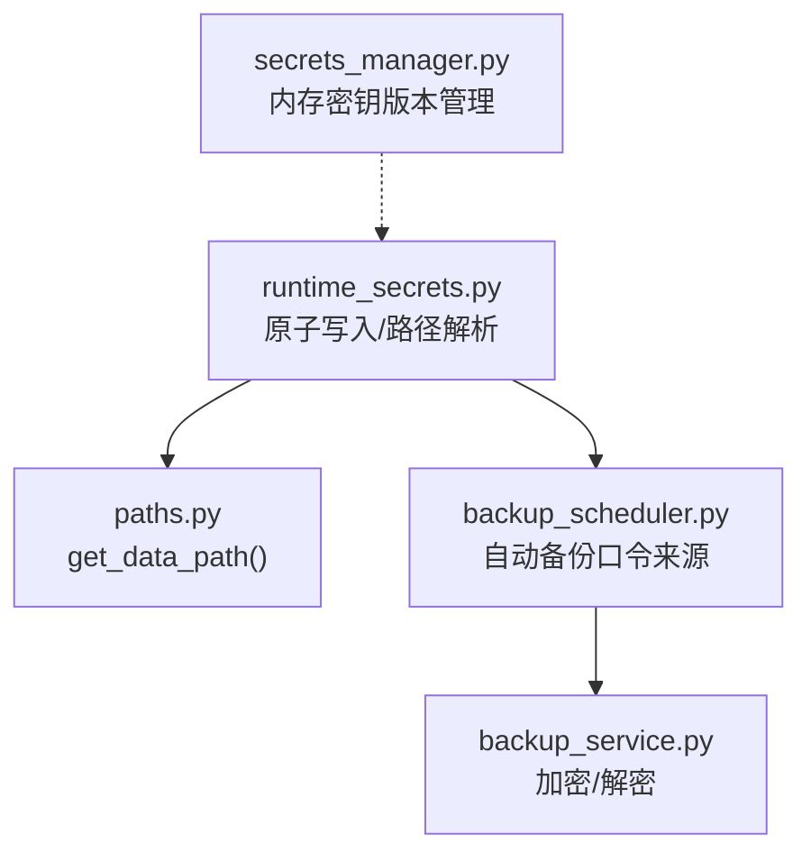
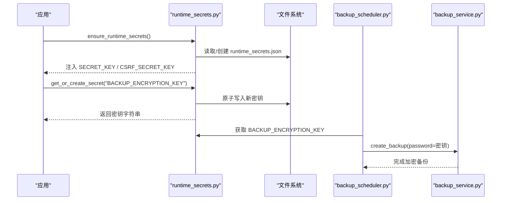
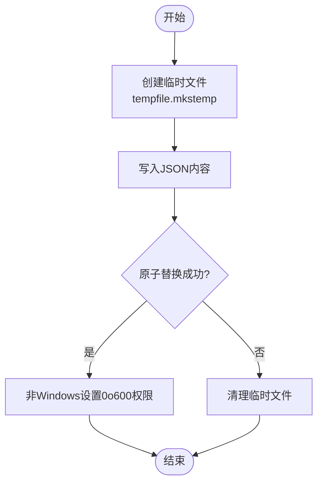
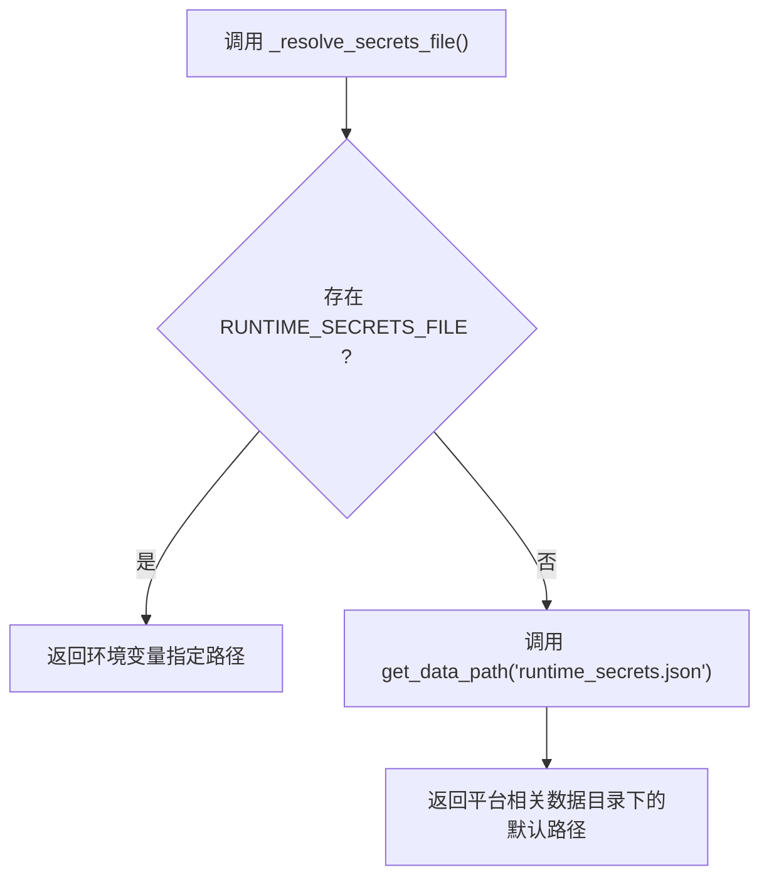
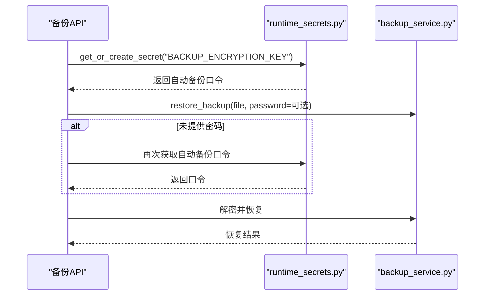
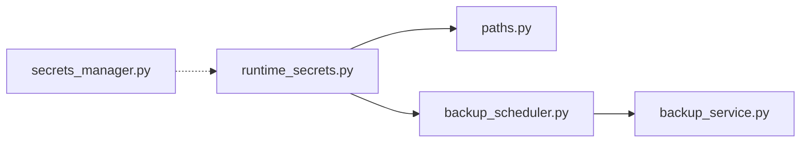

# 密钥存储管理

<cite>
**本文引用的文件**
- [backend/app/utils/runtime_secrets.py](file://backend/app/utils/runtime_secrets.py)
- [backend/app/utils/paths.py](file://backend/app/utils/paths.py)
- [backend/app/services/secrets_manager.py](file://backend/app/services/secrets_manager.py)
- [backend/app/services/backup_service.py](file://backend/app/services/backup_service.py)
- [backend/app/services/backup_scheduler.py](file://backend/app/services/backup_scheduler.py)
- [backend/tests/unit/test_runtime_secrets.py](file://backend/tests/unit/test_runtime_secrets.py)
- [backend/tests/security/test_audit.py](file://backend/tests/security/test_audit.py)
</cite>

## 目录
1. [简介](#简介)
2. [项目结构](#项目结构)
3. [核心组件](#核心组件)
4. [架构总览](#架构总览)
5. [详细组件分析](#详细组件分析)
6. [依赖关系分析](#依赖关系分析)
7. [性能与可靠性](#性能与可靠性)
8. [故障排除指南](#故障排除指南)
9. [结论](#结论)
10. [附录](#附录)

## 简介
本文件面向“运行时密钥存储”的完整实现，聚焦 runtime_secrets.json 的原子写入机制、路径解析策略（支持环境变量 RUNTIME_SECRETS_FILE）、Unix 权限限制（0o600）与 Windows 兼容性，并给出存储结构、备份恢复策略与故障排除建议。该机制用于保障 SECRET_KEY、CSRF_SECRET_KEY 以及系统内其他运行时密钥的安全持久化与可用性。

## 项目结构
与密钥存储相关的代码主要分布在以下模块：
- 运行时密钥工具：backend/app/utils/runtime_secrets.py
- 路径解析与数据目录：backend/app/utils/paths.py
- 密钥管理服务（内存态版本控制）：backend/app/services/secrets_manager.py
- 备份服务（加密/解密、自动备份口令来源）：backend/app/services/backup_service.py、backend/app/services/backup_scheduler.py
- 测试用例（覆盖原子写入、权限、路径解析等）：backend/tests/unit/test_runtime_secrets.py、backend/tests/security/test_audit.py

图表来源
- [backend/app/utils/runtime_secrets.py:137-148](file://backend/app/utils/runtime_secrets.py#L137-L148)
- [backend/app/utils/paths.py:119-139](file://backend/app/utils/paths.py#L119-L139)
- [backend/app/services/backup_scheduler.py:100-123](file://backend/app/services/backup_scheduler.py#L100-L123)
- [backend/app/services/backup_service.py:143-214](file://backend/app/services/backup_service.py#L143-L214)

章节来源
- [backend/app/utils/runtime_secrets.py:1-179](file://backend/app/utils/runtime_secrets.py#L1-L179)
- [backend/app/utils/paths.py:90-139](file://backend/app/utils/paths.py#L90-L139)

## 核心组件
- 运行时密钥初始化与获取：ensure_runtime_secrets()、get_or_create_secret()
- 文件路径解析：_resolve_secrets_file()，优先使用环境变量 RUNTIME_SECRETS_FILE，否则回退到 get_data_path("runtime_secrets.json")
- 原子写入：_atomic_write_json()，基于临时文件 + os.replace 的原子替换，并在非 Windows 平台设置 0o600 权限
- 备份口令来源：自动备份通过 get_or_create_secret("BACKUP_ENCRYPTION_KEY", ...) 生成并持久化
- 密钥版本管理（内存态）：SecretsManager 提供密钥轮换、撤销、过期清理等能力

章节来源
- [backend/app/utils/runtime_secrets.py:20-134](file://backend/app/utils/runtime_secrets.py#L20-L134)
- [backend/app/utils/runtime_secrets.py:137-179](file://backend/app/utils/runtime_secrets.py#L137-L179)
- [backend/app/services/backup_scheduler.py:100-123](file://backend/app/services/backup_scheduler.py#L100-L123)
- [backend/app/services/secrets_manager.py:13-193](file://backend/app/services/secrets_manager.py#L13-L193)

## 架构总览
运行时密钥的生命周期如下：
- 启动时确保 SECRET_KEY/CSRF_SECRET_KEY 可用；若缺失或过短则生成并持久化
- 任意运行时密钥通过 get_or_create_secret(key, generate=...) 读取或生成并持久化
- 自动备份口令通过同一机制持久化，供后续加密备份与恢复使用
- 所有写操作均通过原子写入保证一致性，避免并发或崩溃导致的数据损坏

图表来源
- [backend/app/utils/runtime_secrets.py:20-93](file://backend/app/utils/runtime_secrets.py#L20-L93)
- [backend/app/utils/runtime_secrets.py:95-134](file://backend/app/utils/runtime_secrets.py#L95-L134)
- [backend/app/services/backup_scheduler.py:100-123](file://backend/app/services/backup_scheduler.py#L100-L123)
- [backend/app/services/backup_service.py:143-214](file://backend/app/services/backup_service.py#L143-L214)

## 详细组件分析

### 原子写入机制（runtime_secrets.py）
- 临时文件创建：使用 tempfile.mkstemp 在目标目录创建 .tmp 临时文件
- 写入与序列化：以 UTF-8 编码写入 JSON，缩进便于人工查看
- 原子替换：使用 os.replace 将临时文件原子替换为目标文件，避免部分写入导致的损坏
- 权限设置：在非 Windows 平台调用 os.chmod(path, 0o600)，仅所有者可读可写
- 异常安全：finally 中确保关闭文件描述符并清理残留临时文件

图表来源
- [backend/app/utils/runtime_secrets.py:145-179](file://backend/app/utils/runtime_secrets.py#L145-L179)

章节来源
- [backend/app/utils/runtime_secrets.py:145-179](file://backend/app/utils/runtime_secrets.py#L145-L179)
- [backend/tests/unit/test_runtime_secrets.py:251-279](file://backend/tests/unit/test_runtime_secrets.py#L251-L279)

### 文件路径解析策略（RUNTIME_SECRETS_FILE）
- 优先级：若环境变量 RUNTIME_SECRETS_FILE 存在，则直接使用该路径
- 回退：否则使用 get_data_path("runtime_secrets.json")，其基础目录由 get_app_data_dir() 决定
- 平台差异：
  - Linux 生产环境：~/.bumofu/data
  - Windows 生产环境：%APPDATA%/bumofu-assistance/data
  - 开发/测试环境：backend 项目根目录下的 data

图表来源
- [backend/app/utils/runtime_secrets.py:137-142](file://backend/app/utils/runtime_secrets.py#L137-L142)
- [backend/app/utils/paths.py:90-139](file://backend/app/utils/paths.py#L90-L139)

章节来源
- [backend/app/utils/runtime_secrets.py:137-142](file://backend/app/utils/runtime_secrets.py#L137-L142)
- [backend/app/utils/paths.py:90-139](file://backend/app/utils/paths.py#L90-L139)
- [backend/tests/unit/test_runtime_secrets.py:233-243](file://backend/tests/unit/test_runtime_secrets.py#L233-L243)

### 存储结构与默认值
- 文件为 JSON 格式，键为密钥名称，值为字符串
- 常见键：
  - SECRET_KEY：应用密钥
  - CSRF_SECRET_KEY：CSRF 保护密钥
  - BACKUP_ENCRYPTION_KEY：自动备份加密口令
- 默认生成策略：
  - 未提供时，使用 secrets.token_urlsafe(48) 生成强随机串
  - 对环境变量中的密钥进行强度校验（长度不足视为无效）

章节来源
- [backend/app/utils/runtime_secrets.py:20-93](file://backend/app/utils/runtime_secrets.py#L20-L93)
- [backend/app/utils/runtime_secrets.py:95-134](file://backend/app/utils/runtime_secrets.py#L95-L134)
- [backend/app/services/backup_scheduler.py:100-123](file://backend/app/services/backup_scheduler.py#L100-L123)

### 备份口令与恢复策略
- 自动备份口令来源：通过 get_or_create_secret("BACKUP_ENCRYPTION_KEY", generate=token_urlsafe(32)) 生成并持久化
- 加密备份：使用 PBKDF2 派生 Fernet 兼容密钥，对备份文件进行 AES-256 加密
- 恢复流程：
  - 上传加密备份后，若未提供密码，尝试从 runtime_secrets 中读取自动备份口令作为兜底
  - 解密到临时文件后再执行恢复，保留原始加密备份以防失败

图表来源
- [backend/app/services/backup_scheduler.py:100-123](file://backend/app/services/backup_scheduler.py#L100-L123)
- [backend/app/services/backup_service.py:143-214](file://backend/app/services/backup_service.py#L143-L214)
- [backend/tests/unit/test_backup_api_cov.py:312-339](file://backend/tests/unit/test_backup_api_cov.py#L312-L339)

章节来源
- [backend/app/services/backup_scheduler.py:100-123](file://backend/app/services/backup_scheduler.py#L100-L123)
- [backend/app/services/backup_service.py:143-214](file://backend/app/services/backup_service.py#L143-L214)
- [backend/tests/unit/test_backup_api_cov.py:312-339](file://backend/tests/unit/test_backup_api_cov.py#L312-L339)

### 权限与安全
- Unix 权限：非 Windows 平台写入后设置 0o600，仅文件所有者可读写
- Windows 兼容：跳过 chmod，遵循系统 ACL
- 路径安全：路径拼接使用 _safe_join，防止路径遍历攻击
- 日志记录：读取失败、权限错误、写入失败等场景均有警告日志，便于排查

章节来源
- [backend/app/utils/runtime_secrets.py:145-179](file://backend/app/utils/runtime_secrets.py#L145-L179)
- [backend/app/utils/paths.py:20-48](file://backend/app/utils/paths.py#L20-L48)
- [backend/tests/security/test_audit.py:43-51](file://backend/tests/security/test_audit.py#L43-L51)

## 依赖关系分析
- runtime_secrets.py 依赖 paths.py 的 get_data_path() 确定默认存储位置
- backup_scheduler.py 通过 runtime_secrets.py 获取自动备份口令
- backup_service.py 提供加密/解密能力，配合口令进行备份保护
- secrets_manager.py 提供内存态密钥版本管理（与文件持久化互补）

图表来源
- [backend/app/utils/runtime_secrets.py:137-142](file://backend/app/utils/runtime_secrets.py#L137-L142)
- [backend/app/services/backup_scheduler.py:100-123](file://backend/app/services/backup_scheduler.py#L100-L123)
- [backend/app/services/backup_service.py:143-214](file://backend/app/services/backup_service.py#L143-L214)
- [backend/app/services/secrets_manager.py:13-193](file://backend/app/services/secrets_manager.py#L13-L193)

章节来源
- [backend/app/utils/runtime_secrets.py:137-142](file://backend/app/utils/runtime_secrets.py#L137-L142)
- [backend/app/services/backup_scheduler.py:100-123](file://backend/app/services/backup_scheduler.py#L100-L123)
- [backend/app/services/backup_service.py:143-214](file://backend/app/services/backup_service.py#L143-L214)
- [backend/app/services/secrets_manager.py:13-193](file://backend/app/services/secrets_manager.py#L13-L193)

## 性能与可靠性
- 原子写入：通过临时文件+os.replace 避免并发写冲突和崩溃导致的半写文件
- 最小 I/O：仅在需要时写入，且写入前已构建完整 JSON
- 幂等性：重复请求不会重复生成相同密钥（已有键直接返回）
- 容错：读取失败（JSON 损坏、权限不足）会降级为进程内值并继续运行
- 资源清理：异常分支确保临时文件和文件描述符被正确释放

[本节为通用指导，不直接分析具体文件]

## 故障排除指南
- 无法读取密钥文件
  - 现象：日志出现“读取运行时密钥文件失败”或“无读取权限”
  - 处理：检查文件是否存在、权限是否为 0o600、是否被其他进程占用
  - 参考：[backend/app/utils/runtime_secrets.py:116-134](file://backend/app/utils/runtime_secrets.py#L116-L134)
- 写入失败
  - 现象：日志出现“无法持久化密钥...仅使用进程内值”
  - 处理：确认目标目录可写、磁盘空间充足、权限正确
  - 参考：[backend/app/utils/runtime_secrets.py:129-134](file://backend/app/utils/runtime_secrets.py#L129-L134)
- 自动备份口令不可用
  - 现象：加密备份恢复时提示缺少密码
  - 处理：检查 runtime_secrets.json 中是否存在 BACKUP_ENCRYPTION_KEY；或通过 API 重新触发自动备份以生成口令
  - 参考：[backend/app/services/backup_scheduler.py:100-123](file://backend/app/services/backup_scheduler.py#L100-L123)
- 权限不符合预期
  - 现象：文件权限不是 0o600
  - 处理：确认在非 Windows 平台；检查是否有外部脚本修改了权限
  - 参考：[backend/tests/security/test_audit.py:43-51](file://backend/tests/security/test_audit.py#L43-L51)

章节来源
- [backend/app/utils/runtime_secrets.py:116-134](file://backend/app/utils/runtime_secrets.py#L116-L134)
- [backend/app/services/backup_scheduler.py:100-123](file://backend/app/services/backup_scheduler.py#L100-L123)
- [backend/tests/security/test_audit.py:43-51](file://backend/tests/security/test_audit.py#L43-L51)

## 结论
本方案通过环境变量驱动的路径解析、原子写入与严格的权限控制，实现了高可靠、安全的运行时密钥存储。结合自动备份口令的持久化与恢复兜底，系统在跨平台环境下具备一致的可用性与安全性。建议在部署时明确 RUNTIME_SECRETS_FILE 指向受控目录，并确保操作系统层权限符合 0o600 要求。

[本节为总结，不直接分析具体文件]

## 附录
- 环境变量
  - RUNTIME_SECRETS_FILE：自定义 runtime_secrets.json 存储路径
  - SECRET_KEY、CSRF_SECRET_KEY：应用与 CSRF 保护密钥（若长度不足将被忽略并重新生成）
- 默认存储位置
  - Linux 生产：~/.bumofu/data/runtime_secrets.json
  - Windows 生产：%APPDATA%/bumofu-assistance/data/runtime_secrets.json
  - 开发/测试：backend/data/runtime_secrets.json
- 相关文件
  - 原子写入与路径解析：[backend/app/utils/runtime_secrets.py](file://backend/app/utils/runtime_secrets.py)
  - 路径工具：[backend/app/utils/paths.py](file://backend/app/utils/paths.py)
  - 备份服务：[backend/app/services/backup_service.py](file://backend/app/services/backup_service.py)
  - 自动备份调度：[backend/app/services/backup_scheduler.py](file://backend/app/services/backup_scheduler.py)
  - 密钥版本管理：[backend/app/services/secrets_manager.py](file://backend/app/services/secrets_manager.py)

[本节为补充信息，不直接分析具体文件]