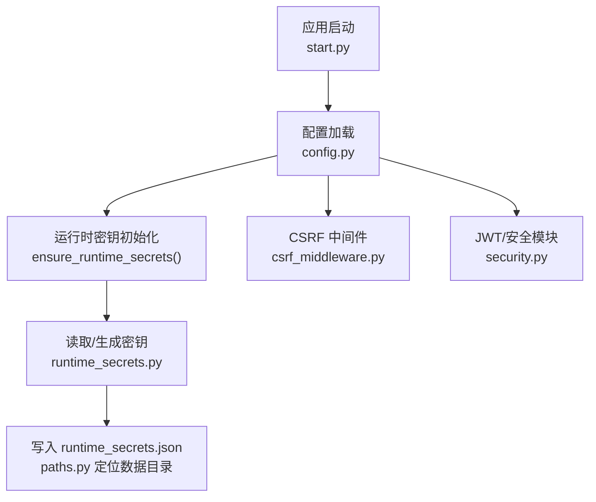
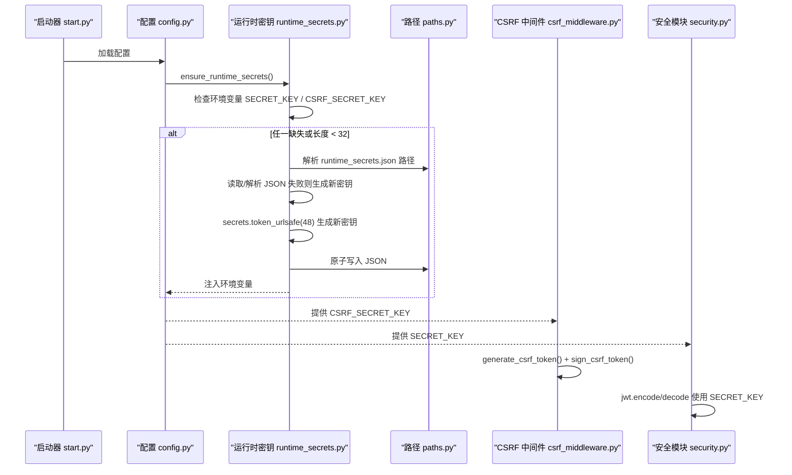
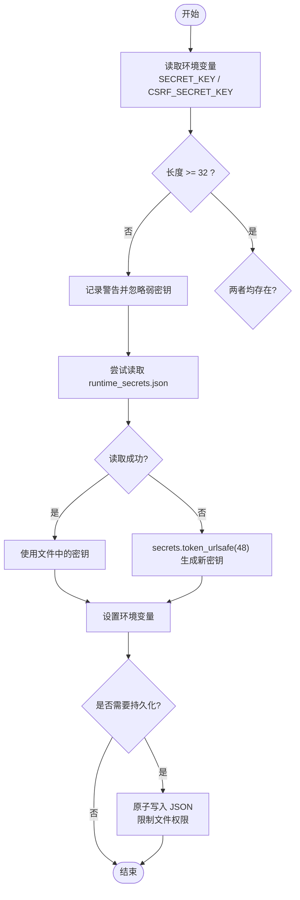
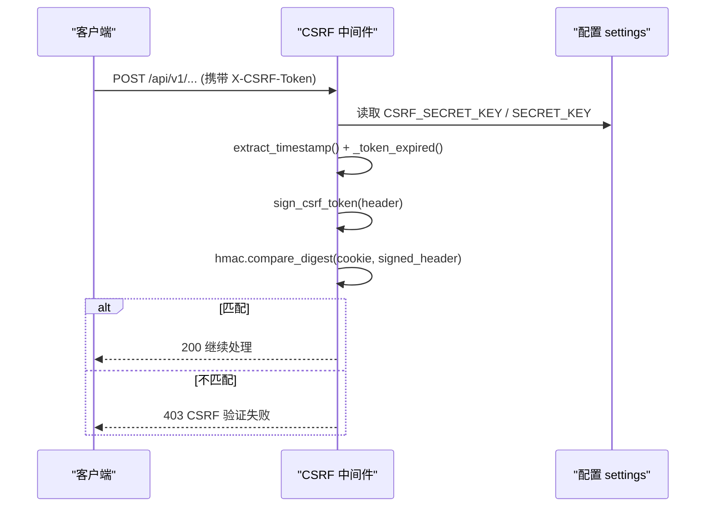
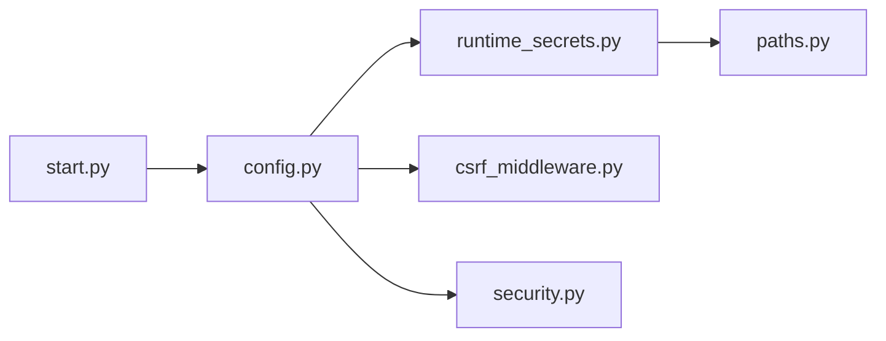

# 密钥生成机制

<cite>
**本文引用的文件**
- [backend/app/utils/runtime_secrets.py](file://backend/app/utils/runtime_secrets.py)
- [backend/app/core/config.py](file://backend/app/core/config.py)
- [backend/app/middleware/csrf_middleware.py](file://backend/app/middleware/csrf_middleware.py)
- [backend/app/core/security.py](file://backend/app/core/security.py)
- [backend/app/utils/paths.py](file://backend/app/utils/paths.py)
- [backend/start.py](file://backend/start.py)
- [backend/tests/unit/test_runtime_secrets.py](file://backend/tests/unit/test_runtime_secrets.py)
</cite>

## 目录
1. [简介](#简介)
2. [项目结构](#项目结构)
3. [核心组件](#核心组件)
4. [架构总览](#架构总览)
5. [详细组件分析](#详细组件分析)
6. [依赖关系分析](#依赖关系分析)
7. [性能与安全考量](#性能与安全考量)
8. [故障排查指南](#故障排查指南)
9. [结论](#结论)
10. [附录：示例与最佳实践](#附录示例与最佳实践)

## 简介
本文件聚焦于系统中 SECRET_KEY 与 CSRF_SECRET_KEY 的自动生成机制，说明其算法、强度校验、持久化策略、随机性与防碰撞保障，并给出使用示例与安全最佳实践。系统通过运行时密钥管理模块在启动时确保两个密钥可用；若环境变量未提供或长度不足，则自动从安全随机源生成并持久化到本地 JSON 文件，同时注入进程环境变量供后续认证、签名等模块使用。

## 项目结构
密钥相关的关键代码分布在以下位置：
- 运行时密钥管理与持久化：backend/app/utils/runtime_secrets.py
- 配置加载与初始化入口：backend/app/core/config.py、backend/start.py
- CSRF 中间件（token 生成与 HMAC 签名）：backend/app/middleware/csrf_middleware.py
- JWT 与全局密钥回退：backend/app/core/security.py
- 数据路径解析（runtime_secrets.json 落盘位置）：backend/app/utils/paths.py

图表来源
- [backend/start.py:514-516](file://backend/start.py#L514-L516)
- [backend/app/core/config.py:369-381](file://backend/app/core/config.py#L369-L381)
- [backend/app/utils/runtime_secrets.py:20-93](file://backend/app/utils/runtime_secrets.py#L20-L93)
- [backend/app/utils/paths.py:119-139](file://backend/app/utils/paths.py#L119-L139)
- [backend/app/middleware/csrf_middleware.py:65-101](file://backend/app/middleware/csrf_middleware.py#L65-L101)
- [backend/app/core/security.py:60-88](file://backend/app/core/security.py#L60-L88)

章节来源
- [backend/start.py:514-516](file://backend/start.py#L514-L516)
- [backend/app/core/config.py:369-381](file://backend/app/core/config.py#L369-L381)

## 核心组件
- 运行时密钥管理器（ensure_runtime_secrets）：负责按优先级获取密钥（环境变量 → 持久化文件 → 自动生成），并进行强度校验与持久化。
- CSRF 中间件：负责生成带时间戳的原始 token，并使用 HMAC-SHA256 基于 CSRF_SECRET_KEY 对 token 进行签名，用于请求验证。
- 安全模块（security.py）：统一使用 settings.SECRET_KEY 进行 JWT 加解密，并在极端情况下回退到进程内随机密钥。
- 路径工具（paths.py）：跨平台确定 runtime_secrets.json 的存储位置，保证可写且安全。

章节来源
- [backend/app/utils/runtime_secrets.py:20-93](file://backend/app/utils/runtime_secrets.py#L20-L93)
- [backend/app/middleware/csrf_middleware.py:65-101](file://backend/app/middleware/csrf_middleware.py#L65-L101)
- [backend/app/core/security.py:60-88](file://backend/app/core/security.py#L60-L88)
- [backend/app/utils/paths.py:119-139](file://backend/app/utils/paths.py#L119-L139)

## 架构总览
密钥生命周期如下：
- 启动阶段调用 ensure_runtime_secrets()，优先使用环境变量中的 SECRET_KEY 和 CSRF_SECRET_KEY。
- 若任一密钥缺失或长度小于阈值（32 字符），视为弱密钥并忽略，进入生成流程。
- 尝试从 runtime_secrets.json 读取已有密钥；若不存在或损坏，则使用 secrets.token_urlsafe(48) 生成新的 48 字符 URL 安全随机串。
- 将生成的密钥原子写入 JSON 文件，并设置到环境变量，供后续模块使用。
- CSRF 中间件使用 CSRF_SECRET_KEY 对原始 token 做 HMAC 签名；JWT 模块使用 SECRET_KEY 进行令牌编解码。

图表来源
- [backend/start.py:514-516](file://backend/start.py#L514-L516)
- [backend/app/core/config.py:369-381](file://backend/app/core/config.py#L369-L381)
- [backend/app/utils/runtime_secrets.py:20-93](file://backend/app/utils/runtime_secrets.py#L20-L93)
- [backend/app/utils/paths.py:119-139](file://backend/app/utils/paths.py#L119-L139)
- [backend/app/middleware/csrf_middleware.py:65-101](file://backend/app/middleware/csrf_middleware.py#L65-L101)
- [backend/app/core/security.py:60-88](file://backend/app/core/security.py#L60-L88)

## 详细组件分析

### 运行时密钥管理器（ensure_runtime_secrets）
- 优先级与策略：
  - 首先读取环境变量 SECRET_KEY 与 CSRF_SECRET_KEY。
  - 若存在但长度小于 32 字符，记录警告并视为无效，触发重新生成。
  - 若仍缺失，尝试从 runtime_secrets.json 读取；若文件不存在、JSON 损坏或权限不足，则生成新密钥。
- 生成算法：
  - 使用 secrets.token_urlsafe(48) 生成 48 字符的 URL 安全随机字符串，具备高熵与不可预测性。
- 持久化：
  - 使用原子写入（临时文件 + os.replace）避免部分写入导致的损坏。
  - 非 Windows 平台将文件权限设置为 0o600，仅当前用户可读。
  - 路径由 get_data_path("runtime_secrets.json") 决定，跨平台适配开发/生产环境。
- 健壮性：
  - 捕获 FileNotFoundError、JSONDecodeError、PermissionError 等异常并记录警告，不影响服务继续运行。
  - 若写入失败，仍会将密钥注入环境变量，仅在进程内有效。

图表来源
- [backend/app/utils/runtime_secrets.py:20-93](file://backend/app/utils/runtime_secrets.py#L20-L93)
- [backend/app/utils/paths.py:119-139](file://backend/app/utils/paths.py#L119-L139)

章节来源
- [backend/app/utils/runtime_secrets.py:20-93](file://backend/app/utils/runtime_secrets.py#L20-L93)
- [backend/app/utils/paths.py:119-139](file://backend/app/utils/paths.py#L119-L139)

### CSRF 中间件（token 生成与 HMAC 签名）
- Token 生成：
  - generate_csrf_token() 返回 "{timestamp}.{random_hex}" 格式，其中 random_hex 为 24 字节随机数的十六进制表示（48 个十六进制字符）。
- 签名与验证：
  - sign_csrf_token(token, secret_key=None) 使用 HMAC-SHA256 对原始 token 进行签名，secret_key 默认取自 settings.CSRF_SECRET_KEY，回退到 settings.SECRET_KEY。
  - 中间件验证流程：优先比较 HMAC(header_value) 与 cookie 值；若失败则回退到明文比对（兼容旧版前端），并记录警告日志。
- 过期检测：
  - 提取 token 中的时间戳，超过 CSRF_TOKEN_EXPIRY（默认 86400 秒）即拒绝。
- 豁免路径与方法：
  - GET/HEAD/OPTIONS 直接放行；特定路径前缀（如健康检查、文档）豁免。

图表来源
- [backend/app/middleware/csrf_middleware.py:65-101](file://backend/app/middleware/csrf_middleware.py#L65-L101)
- [backend/app/middleware/csrf_middleware.py:119-132](file://backend/app/middleware/csrf_middleware.py#L119-L132)
- [backend/app/middleware/csrf_middleware.py:189-284](file://backend/app/middleware/csrf_middleware.py#L189-L284)

章节来源
- [backend/app/middleware/csrf_middleware.py:65-101](file://backend/app/middleware/csrf_middleware.py#L65-L101)
- [backend/app/middleware/csrf_middleware.py:119-132](file://backend/app/middleware/csrf_middleware.py#L119-L132)
- [backend/app/middleware/csrf_middleware.py:189-284](file://backend/app/middleware/csrf_middleware.py#L189-L284)

### 安全模块（JWT 与密钥回退）
- 统一密钥来源：
  - 优先使用 settings.SECRET_KEY；若为空，则调用 _ensure_secret_key() 生成临时密钥并记录严重错误。
- 影响范围：
  - JWT access/refresh token 的编码与解码均使用该密钥；密钥变化会导致已签发令牌失效。
- 回退策略：
  - 当配置系统未正确初始化时，回退到环境变量 JWT_SECRET_KEY 或 SECRET_KEY；若仍为空，则生成进程内随机密钥。

章节来源
- [backend/app/core/security.py:60-88](file://backend/app/core/security.py#L60-L88)
- [backend/app/core/security.py:210-235](file://backend/app/core/security.py#L210-L235)

### 路径与持久化（runtime_secrets.json）
- 路径解析：
  - 通过 get_data_path("runtime_secrets.json") 获取数据目录下的文件路径，支持开发/生产环境的跨平台差异。
- 原子写入：
  - 使用 tempfile.mkstemp 创建临时文件，写入后以 os.replace 原子替换目标文件，避免并发写入导致的数据损坏。
- 权限控制：
  - 非 Windows 平台将文件权限设置为 0o600，仅所有者可读写，降低泄露风险。

章节来源
- [backend/app/utils/paths.py:119-139](file://backend/app/utils/paths.py#L119-L139)
- [backend/app/utils/runtime_secrets.py:145-179](file://backend/app/utils/runtime_secrets.py#L145-L179)

## 依赖关系分析
- 启动顺序：
  - backend/start.py 在应用启动时调用 ensure_runtime_secrets()，确保密钥就绪后再加载其他模块。
- 配置依赖：
  - backend/app/core/config.py 在模块加载时调用 ensure_runtime_secrets()，使 settings.SECRET_KEY 与 settings.CSRF_SECRET_KEY 始终可用。
- 模块耦合：
  - CSRF 中间件依赖 settings.CSRF_SECRET_KEY；JWT 模块依赖 settings.SECRET_KEY。
  - 运行时密钥管理器依赖路径工具以确定持久化位置。

图表来源
- [backend/start.py:514-516](file://backend/start.py#L514-L516)
- [backend/app/core/config.py:369-381](file://backend/app/core/config.py#L369-L381)
- [backend/app/utils/runtime_secrets.py:20-93](file://backend/app/utils/runtime_secrets.py#L20-L93)
- [backend/app/utils/paths.py:119-139](file://backend/app/utils/paths.py#L119-L139)
- [backend/app/middleware/csrf_middleware.py:65-101](file://backend/app/middleware/csrf_middleware.py#L65-L101)
- [backend/app/core/security.py:60-88](file://backend/app/core/security.py#L60-L88)

章节来源
- [backend/start.py:514-516](file://backend/start.py#L514-L516)
- [backend/app/core/config.py:369-381](file://backend/app/core/config.py#L369-L381)

## 性能与安全考量
- 随机性与强度：
  - 使用 secrets.token_urlsafe(48) 生成 48 字符 URL 安全随机串，熵值高，适合用作密钥。
  - CSRF token 使用 os.urandom(24) 生成 24 字节随机数，转换为十六进制得到 48 字符随机段，结合时间戳实现唯一性与过期控制。
- 防碰撞策略：
  - 随机源来自操作系统提供的安全随机数生成器，碰撞概率极低。
  - CSRF token 包含时间戳与前缀，进一步降低重复概率。
- 持久化安全：
  - 原子写入避免部分写入导致的损坏。
  - 非 Windows 平台限制文件权限为 0o600，减少泄露风险。
- 回退与容错：
  - 若配置文件或文件系统异常，仍能通过环境变量或进程内随机密钥维持运行，但会记录警告/严重日志提示潜在风险。
- 性能影响：
  - 密钥生成与 HMAC 计算开销较小，对请求延迟影响可忽略。
  - 原子写入仅在密钥变更时发生，频率低。

[本节为通用指导，无需具体文件引用]

## 故障排查指南
- 常见问题与现象：
  - 环境变量密钥长度不足：会被忽略并重新生成，日志中会有“长度不足”的警告。
  - runtime_secrets.json 损坏或无权限：会记录“JSON 格式损坏”或“无读取权限”的警告，并重新生成密钥。
  - 写入失败：会记录“无法持久化”的警告，密钥仅在进程内存中有效。
- 排查步骤：
  - 检查环境变量是否设置了有效的 SECRET_KEY 与 CSRF_SECRET_KEY（长度 ≥ 32）。
  - 确认 runtime_secrets.json 是否存在且可读可写，权限是否正确。
  - 查看应用日志中的警告/错误信息，定位具体失败点。
  - 若怀疑密钥不一致导致 JWT 失效，检查服务重启后是否生成了新的临时密钥。

章节来源
- [backend/app/utils/runtime_secrets.py:32-93](file://backend/app/utils/runtime_secrets.py#L32-L93)
- [backend/app/core/security.py:60-88](file://backend/app/core/security.py#L60-L88)

## 结论
系统通过统一的运行时密钥管理机制，确保 SECRET_KEY 与 CSRF_SECRET_KEY 在启动时可用，并提供强随机性、持久化与回退策略。CSRF 中间件采用 HMAC 签名与时间戳过期机制，增强请求安全性。整体设计兼顾了安全性、可用性与可维护性，适用于开发与生产环境。

[本节为总结性内容，无需具体文件引用]

## 附录：示例与最佳实践
- 密钥生成示例（参考路径）：
  - 运行时密钥生成：参见 [backend/app/utils/runtime_secrets.py:68-74](file://backend/app/utils/runtime_secrets.py#L68-L74)
  - CSRF token 生成与签名：参见 [backend/app/middleware/csrf_middleware.py:65-101](file://backend/app/middleware/csrf_middleware.py#L65-L101)
- 安全最佳实践：
  - 在生产环境中优先通过环境变量提供 SECRET_KEY 与 CSRF_SECRET_KEY，并确保长度 ≥ 32。
  - 保护 runtime_secrets.json 文件权限，避免被未授权访问。
  - 定期轮换密钥，并结合令牌版本机制强制下线旧会话。
  - 监控日志中的密钥相关警告，及时处理异常。
  - 避免硬编码密钥；若必须临时使用，应在部署后尽快替换为安全来源。

章节来源
- [backend/app/utils/runtime_secrets.py:68-74](file://backend/app/utils/runtime_secrets.py#L68-L74)
- [backend/app/middleware/csrf_middleware.py:65-101](file://backend/app/middleware/csrf_middleware.py#L65-L101)
- [backend/tests/unit/test_runtime_secrets.py:76-93](file://backend/tests/unit/test_runtime_secrets.py#L76-L93)