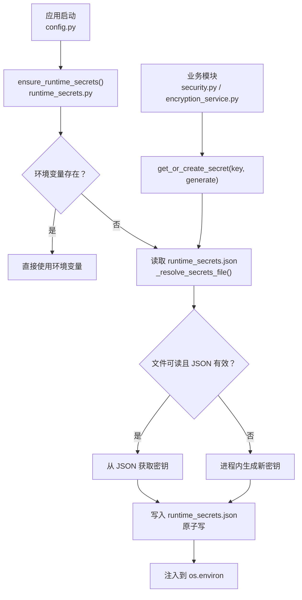
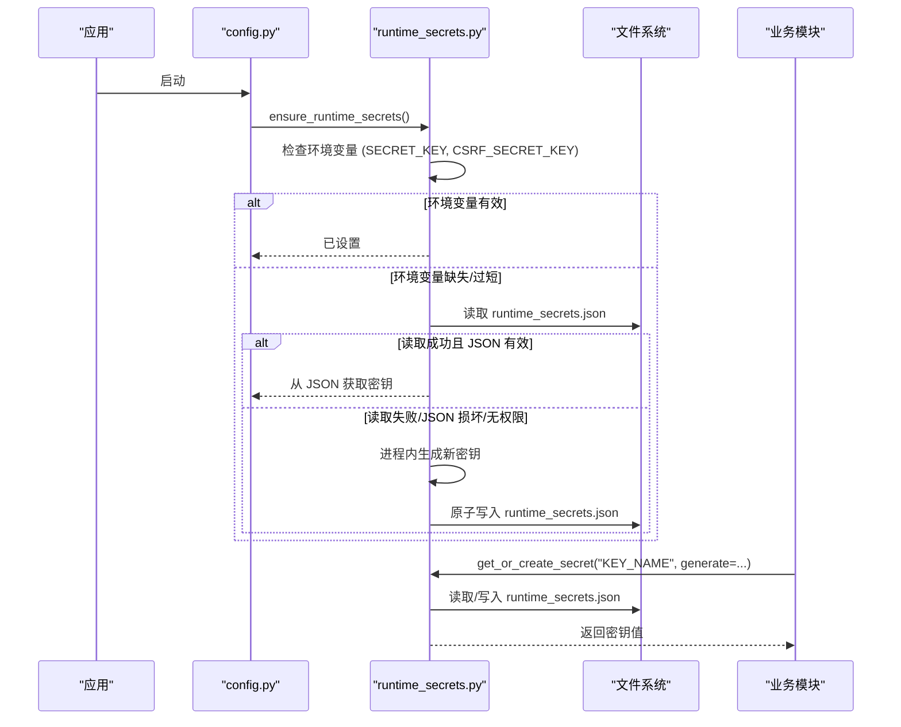
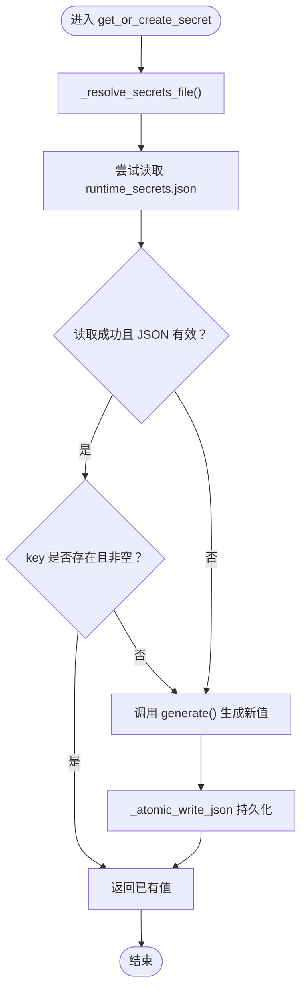
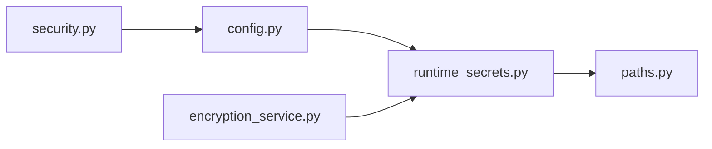

# 密钥访问控制

<cite>
**本文引用的文件**
- [runtime_secrets.py](file://backend/app/utils/runtime_secrets.py)
- [paths.py](file://backend/app/utils/paths.py)
- [config.py](file://backend/app/core/config.py)
- [security.py](file://backend/app/core/security.py)
- [encryption_service.py](file://backend/app/services/encryption_service.py)
- [secrets_manager.py](file://backend/app/services/secrets_manager.py)
- [test_runtime_secrets.py](file://backend/tests/unit/test_runtime_secrets.py)
</cite>

## 目录
1. [简介](#简介)
2. [项目结构](#项目结构)
3. [核心组件](#核心组件)
4. [架构总览](#架构总览)
5. [详细组件分析](#详细组件分析)
6. [依赖关系分析](#依赖关系分析)
7. [性能与并发](#性能与并发)
8. [故障排查指南](#故障排查指南)
9. [结论](#结论)
10. [附录：环境变量与优先级](#附录环境变量与优先级)

## 简介
本文件聚焦于系统“运行时密钥”的访问控制与生命周期管理，重点说明以下目标：
- 环境变量优先级的加载策略：环境变量 > runtime_secrets.json > 进程内生成。
- get_or_create_secret 的通用密钥管理机制：支持任意密钥名称的持久化存储。
- 权限错误处理、JSON 格式损坏恢复、文件读取失败的降级策略。
- 密钥访问模式、并发安全注意事项与性能优化建议。

该机制用于保障 SECRET_KEY、CSRF_SECRET_KEY、加密密钥等敏感配置在启动时可用，并在运行期可持久化、可恢复。

## 项目结构
与密钥访问控制直接相关的后端模块分布如下：
- 运行时密钥工具：backend/app/utils/runtime_secrets.py
- 路径解析（数据目录）：backend/app/utils/paths.py
- 配置初始化（调用 ensure_runtime_secrets）：backend/app/core/config.py
- 认证与安全（JWT 密钥回退）：backend/app/core/security.py
- 字段加密服务（使用运行时密钥）：backend/app/services/encryption_service.py
- 内存态密钥版本管理（辅助能力）：backend/app/services/secrets_manager.py
- 单元测试（覆盖异常与降级路径）：backend/tests/unit/test_runtime_secrets.py

图表来源
- [config.py:366-379](file://backend/app/core/config.py#L366-L379)
- [runtime_secrets.py:20-93](file://backend/app/utils/runtime_secrets.py#L20-L93)
- [runtime_secrets.py:95-134](file://backend/app/utils/runtime_secrets.py#L95-L134)
- [runtime_secrets.py:137-179](file://backend/app/utils/runtime_secrets.py#L137-L179)

章节来源
- [config.py:366-379](file://backend/app/core/config.py#L366-L379)
- [runtime_secrets.py:20-93](file://backend/app/utils/runtime_secrets.py#L20-L93)
- [runtime_secrets.py:95-134](file://backend/app/utils/runtime_secrets.py#L95-L134)
- [runtime_secrets.py:137-179](file://backend/app/utils/runtime_secrets.py#L137-L179)

## 核心组件
- 运行时密钥工具（runtime_secrets.py）
  - ensure_runtime_secrets：确保 SECRET_KEY 与 CSRF_SECRET_KEY 可用；若缺失则生成并持久化。
  - get_or_create_secret：通用接口，按 key 名从 runtime_secrets.json 读取或生成并持久化。
  - _resolve_secrets_file：解析 runtime_secrets.json 的路径（优先环境变量 RUNTIME_SECRETS_FILE）。
  - _atomic_write_json：原子写入 JSON，非 Windows 平台限制文件权限为 0o600。
- 路径工具（paths.py）
  - get_data_path：返回跨平台的数据目录（开发/打包/不同 OS），runtime_secrets.json 默认落在此处。
- 配置初始化（config.py）
  - 启动时调用 ensure_runtime_secrets，保证后续模块能稳定获取 SECRET_KEY。
  - 生产环境自动补齐 ENCRYPTION_KEY（通过 get_or_create_secret）。
- 认证与安全（security.py）
  - JWT 密钥来源：优先环境变量，其次 settings.SECRET_KEY，最后回退到临时密钥并记录严重日志。
- 加密服务（encryption_service.py）
  - 通过 get_or_create_secret 获取持久化的 Fernet 密钥，失败时抛出明确错误提示。
- 内存态密钥版本管理（secrets_manager.py）
  - 提供密钥版本、轮换、撤销、清理等能力（内存态为主，配合文件持久化默认密钥）。

章节来源
- [runtime_secrets.py:20-93](file://backend/app/utils/runtime_secrets.py#L20-L93)
- [runtime_secrets.py:95-134](file://backend/app/utils/runtime_secrets.py#L95-L134)
- [runtime_secrets.py:137-179](file://backend/app/utils/runtime_secrets.py#L137-L179)
- [paths.py:90-139](file://backend/app/utils/paths.py#L90-L139)
- [config.py:311-329](file://backend/app/core/config.py#L311-L329)
- [config.py:366-379](file://backend/app/core/config.py#L366-L379)
- [security.py:70-88](file://backend/app/core/security.py#L70-L88)
- [encryption_service.py:210-224](file://backend/app/services/encryption_service.py#L210-L224)
- [secrets_manager.py:13-192](file://backend/app/services/secrets_manager.py#L13-L192)

## 架构总览
密钥加载与控制的关键流程如下：
- 启动阶段：config.py 调用 ensure_runtime_secrets，完成 SECRET_KEY/CSRF_SECRET_KEY 的加载与持久化。
- 运行阶段：各模块按需通过 get_or_create_secret 获取任意密钥（如 ENCRYPTION_FERNET_KEY、BACKUP_ENCRYPTION_KEY 等）。
- 文件层：runtime_secrets.json 作为持久化载体，采用原子写入，非 Windows 下限制权限为 0o600。
- 降级策略：环境变量缺失或无效、JSON 损坏、权限不足时，均会降级为进程内生成值并记录日志。

图表来源
- [config.py:366-379](file://backend/app/core/config.py#L366-L379)
- [runtime_secrets.py:20-93](file://backend/app/utils/runtime_secrets.py#L20-L93)
- [runtime_secrets.py:95-134](file://backend/app/utils/runtime_secrets.py#L95-L134)
- [runtime_secrets.py:137-179](file://backend/app/utils/runtime_secrets.py#L137-L179)

## 详细组件分析

### 环境变量优先级与加载策略
- 优先级顺序：
  1) 环境变量（如 SECRET_KEY、CSRF_SECRET_KEY、RUNTIME_SECRETS_FILE）
  2) runtime_secrets.json（位于 get_data_path("data") 下的 runtime_secrets.json）
  3) 进程内生成（token_urlsafe(48) 或 Fernet.generate_key()）
- 长度校验：当环境变量存在但长度小于最小阈值（例如 32）时，视为无效并重新生成。
- 路径解析：可通过 RUNTIME_SECRETS_FILE 指定自定义路径；否则由 paths.get_data_path 决定。

章节来源
- [runtime_secrets.py:20-93](file://backend/app/utils/runtime_secrets.py#L20-L93)
- [runtime_secrets.py:137-142](file://backend/app/utils/runtime_secrets.py#L137-L142)
- [paths.py:90-139](file://backend/app/utils/paths.py#L90-L139)

### get_or_create_secret 通用密钥管理
- 功能：按 key 名从 runtime_secrets.json 读取；不存在则调用 generate() 生成新值，持久化后返回。
- 默认生成器：未提供 generate 时使用 token_urlsafe(48)。
- 持久化：使用 _atomic_write_json 原子写入，避免并发写入导致的部分写入问题。
- 降级：读取失败（权限、JSON 损坏、IO 异常）时记录警告并继续以进程内值工作。

图表来源
- [runtime_secrets.py:95-134](file://backend/app/utils/runtime_secrets.py#L95-L134)
- [runtime_secrets.py:137-179](file://backend/app/utils/runtime_secrets.py#L137-L179)

章节来源
- [runtime_secrets.py:95-134](file://backend/app/utils/runtime_secrets.py#L95-L134)
- [test_runtime_secrets.py:163-226](file://backend/tests/unit/test_runtime_secrets.py#L163-L226)

### 权限错误处理与降级策略
- 读取权限不足：捕获 PermissionError，记录警告，降级为进程内生成值。
- JSON 格式损坏：捕获 JSONDecodeError，记录警告，降级为进程内生成值。
- 写入权限不足：捕获 PermissionError/其他异常，记录警告，仅使用进程内值（不中断服务）。
- 测试覆盖：单元测试验证了上述三种场景的降级行为与日志输出。

章节来源
- [runtime_secrets.py:53-63](file://backend/app/utils/runtime_secrets.py#L53-L63)
- [runtime_secrets.py:116-133](file://backend/app/utils/runtime_secrets.py#L116-L133)
- [test_runtime_secrets.py:197-220](file://backend/tests/unit/test_runtime_secrets.py#L197-L220)

### 原子写入与文件权限
- 原子写入：先写入临时文件，再原子替换为目标文件，避免部分写入导致的损坏。
- 权限限制：在非 Windows 平台将最终文件权限设置为 0o600，减少泄露风险。
- 清理逻辑：无论成功或失败，都会清理临时文件与文件描述符。

章节来源
- [runtime_secrets.py:145-179](file://backend/app/utils/runtime_secrets.py#L145-L179)

### 配置集成与加密密钥
- config.py 启动时调用 ensure_runtime_secrets，确保 SECRET_KEY/CSRF_SECRET_KEY 始终可用。
- 生产环境若未配置 ENCRYPTION_KEY，则通过 get_or_create_secret 自动生成并持久化。
- security.py 中 JWT 密钥来源：优先环境变量，其次 settings.SECRET_KEY，最后回退到临时密钥并记录严重日志。
- encryption_service.py 通过 get_or_create_secret 获取 Fernet 密钥，失败时抛出明确错误提示。

章节来源
- [config.py:311-329](file://backend/app/core/config.py#L311-L329)
- [config.py:366-379](file://backend/app/core/config.py#L366-L379)
- [security.py:70-88](file://backend/app/core/security.py#L70-L88)
- [encryption_service.py:210-224](file://backend/app/services/encryption_service.py#L210-L224)

### 内存态密钥版本管理（辅助）
- SecretsManager 提供密钥版本、轮换、撤销、过期清理等功能，主要用于内存态管理。
- 默认密钥可持久化到用户数据目录（便于重启恢复），但不替代 runtime_secrets.json 的通用机制。

章节来源
- [secrets_manager.py:13-192](file://backend/app/services/secrets_manager.py#L13-L192)

## 依赖关系分析
- runtime_secrets.py 依赖 paths.get_data_path 确定数据目录。
- config.py 在启动阶段依赖 runtime_secrets.ensure_runtime_secrets。
- security.py 依赖 settings.SECRET_KEY（由 config 初始化）与环境变量。
- encryption_service.py 依赖 runtime_secrets.get_or_create_secret 获取持久化加密密钥。

图表来源
- [config.py:366-379](file://backend/app/core/config.py#L366-L379)
- [runtime_secrets.py:137-142](file://backend/app/utils/runtime_secrets.py#L137-L142)
- [security.py:70-88](file://backend/app/core/security.py#L70-L88)
- [encryption_service.py:210-224](file://backend/app/services/encryption_service.py#L210-L224)

章节来源
- [config.py:366-379](file://backend/app/core/config.py#L366-L379)
- [runtime_secrets.py:137-142](file://backend/app/utils/runtime_secrets.py#L137-L142)
- [security.py:70-88](file://backend/app/core/security.py#L70-L88)
- [encryption_service.py:210-224](file://backend/app/services/encryption_service.py#L210-L224)

## 性能与并发
- 性能特性
  - 首次启动或首次访问某个 key 时会进行文件读写与可能的生成操作；后续请求命中内存缓存（Python 字典），开销极低。
  - 原子写入避免竞争条件下的文件损坏，但会带来一次磁盘 IO。
- 并发安全
  - 当前实现未引入显式锁；在高并发场景下可能出现多次重复生成同一 key 的情况（因为读-改-写不是原子整体）。
  - 建议：
    - 对高频访问的密钥（如加密密钥）在进程内建立缓存（例如模块级变量），减少频繁文件 IO。
    - 如需强一致性，可在 get_or_create_secret 外层加进程级锁（如 multiprocessing.Lock），或在部署层面保证单实例。
- 优化建议
  - 合理设置 RUNTIME_SECRETS_FILE 到高性能存储（本地 SSD）。
  - 避免在热路径中频繁调用 get_or_create_secret；尽量在启动阶段集中初始化所需密钥。
  - 监控日志中的“无法持久化”“读取失败”等告警，及时修复权限或磁盘问题。

[本节为通用指导，不直接分析具体代码文件]

## 故障排查指南
- 常见问题与定位
  - 启动时报错或密钥为空：检查环境变量是否设置正确，以及 runtime_secrets.json 是否存在且可读。
  - JSON 格式损坏：查看日志中的“读取运行时密钥文件失败”，系统将自动重建该文件。
  - 权限不足：确认运行用户对 data 目录及 runtime_secrets.json 有读写权限；非 Windows 平台文件权限应为 0o600。
  - 写入失败：检查磁盘空间与权限；即使写入失败，服务仍可使用进程内密钥继续运行。
- 日志关键字
  - “读取运行时密钥文件失败”
  - “无法持久化”
  - “所有密钥来源均已耗尽，生成了临时会话密钥”（JWT 回退）
- 参考测试用例
  - 单元测试覆盖了 JSON 损坏、权限错误、写入异常等场景，可作为复现与回归依据。

章节来源
- [runtime_secrets.py:53-63](file://backend/app/utils/runtime_secrets.py#L53-L63)
- [runtime_secrets.py:116-133](file://backend/app/utils/runtime_secrets.py#L116-L133)
- [security.py:70-88](file://backend/app/core/security.py#L70-L88)
- [test_runtime_secrets.py:197-220](file://backend/tests/unit/test_runtime_secrets.py#L197-L220)

## 结论
- 本系统实现了健壮的运行时密钥管理：环境变量优先、文件持久化兜底、进程内生成保障可用性。
- get_or_create_secret 提供通用、可扩展的密钥管理能力，支持任意密钥名称与自定义生成策略。
- 完善的降级策略与原子写入保障了系统在异常场景下的稳定性与安全性。
- 在高并发与高吞吐场景下，建议结合进程内缓存与必要的锁机制进一步优化性能与一致性。

[本节为总结性内容，不直接分析具体代码文件]

## 附录：环境变量与优先级
- 关键环境变量
  - SECRET_KEY：应用签名密钥（ensure_runtime_secrets 负责保障其可用）。
  - CSRF_SECRET_KEY：CSRF 保护密钥（同上）。
  - RUNTIME_SECRETS_FILE：指定 runtime_secrets.json 的路径（可选）。
  - ENCRYPTION_KEY：字段加密密钥（生产环境若未配置，将通过 get_or_create_secret 自动生成）。
- 优先级
  - 环境变量 > runtime_secrets.json > 进程内生成。
- 示例用法
  - 通过环境变量覆盖默认密钥位置：export RUNTIME_SECRETS_FILE=/custom/path/secrets.json
  - 在业务模块中获取任意密钥：get_or_create_secret("MY_KEY", generate=lambda: ...)

章节来源
- [runtime_secrets.py:20-93](file://backend/app/utils/runtime_secrets.py#L20-L93)
- [runtime_secrets.py:95-134](file://backend/app/utils/runtime_secrets.py#L95-L134)
- [runtime_secrets.py:137-142](file://backend/app/utils/runtime_secrets.py#L137-L142)
- [config.py:311-329](file://backend/app/core/config.py#L311-L329)
- [config.py:366-379](file://backend/app/core/config.py#L366-L379)