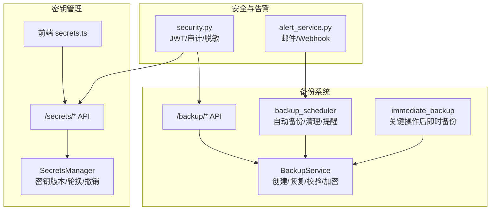
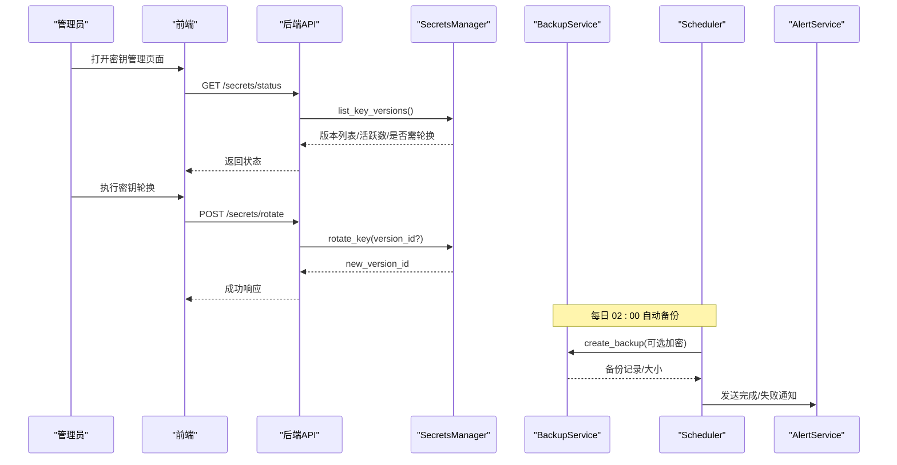
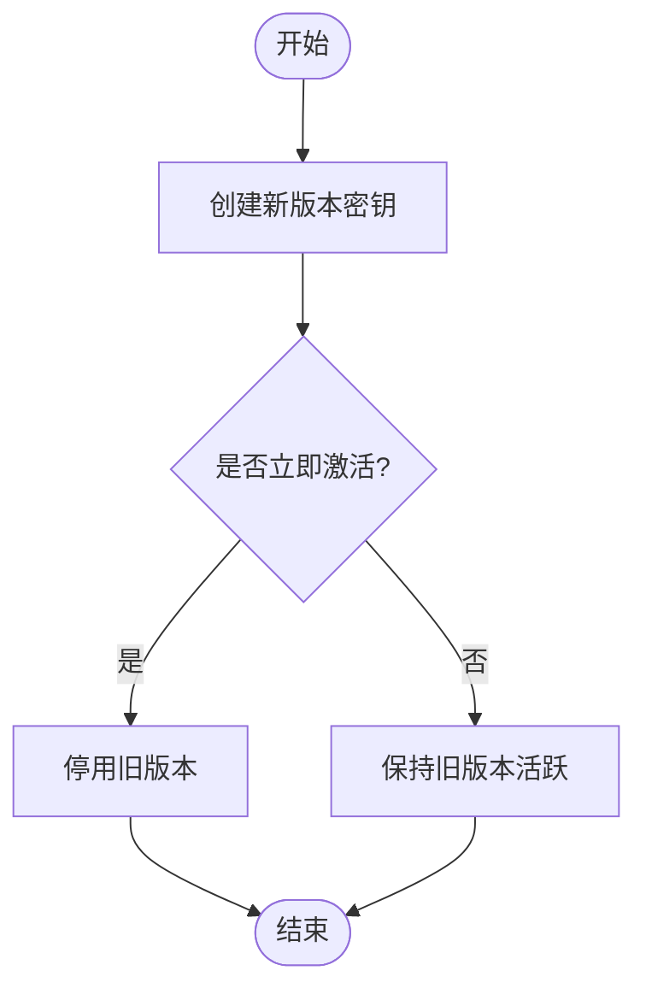
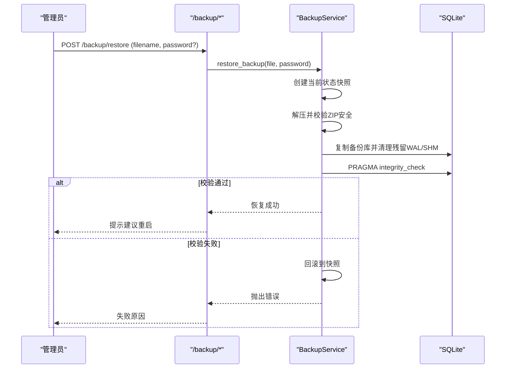
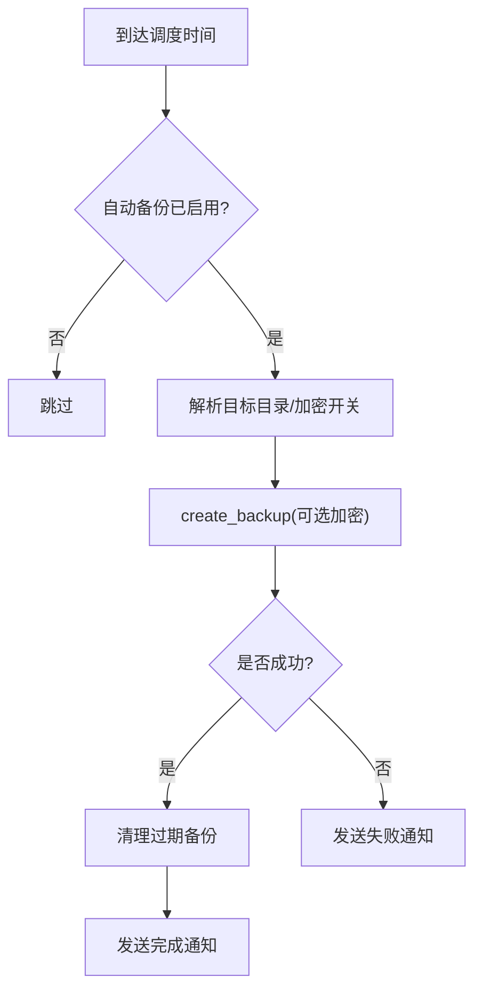
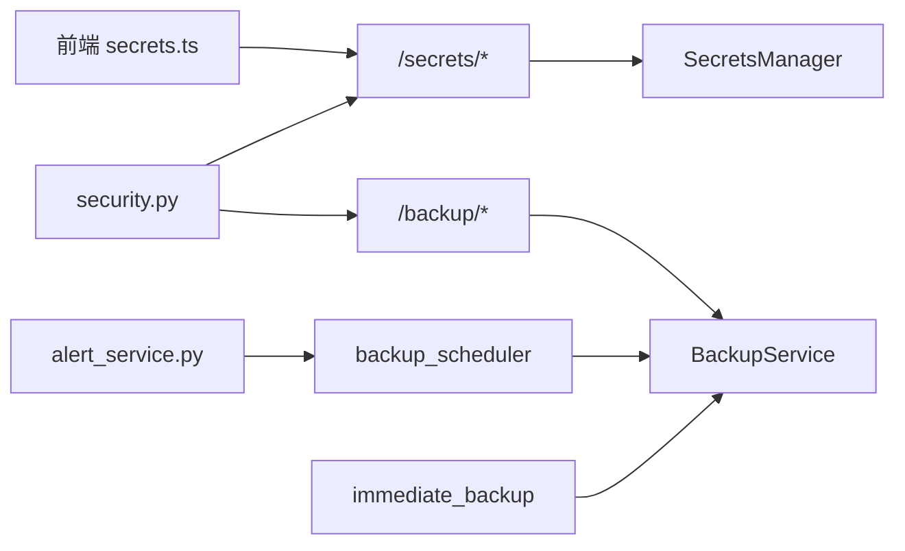

# 密钥轮换与备份

<cite>
**本文引用的文件**
- [backend/app/services/secrets_manager.py](file://backend/app/services/secrets_manager.py)
- [backend/app/api/v1/monitoring/secrets.py](file://backend/app/api/v1/monitoring/secrets.py)
- [frontend/src/api/secrets.ts](file://frontend/src/api/secrets.ts)
- [backend/app/services/backup_service.py](file://backend/app/services/backup_service.py)
- [backend/app/api/v1/system/backup.py](file://backend/app/api/v1/system/backup.py)
- [backend/app/services/backup_scheduler.py](file://backend/app/services/backup_scheduler.py)
- [backend/app/services/immediate_backup.py](file://backend/app/services/immediate_backup.py)
- [backend/app/core/security.py](file://backend/app/core/security.py)
- [backend/app/services/alert_service.py](file://backend/app/services/alert_service.py)
</cite>

## 目录
1. [简介](#简介)
2. [项目结构](#项目结构)
3. [核心组件](#核心组件)
4. [架构总览](#架构总览)
5. [详细组件分析](#详细组件分析)
6. [依赖关系分析](#依赖关系分析)
7. [性能考虑](#性能考虑)
8. [故障排查指南](#故障排查指南)
9. [结论](#结论)
10. [附录](#附录)

## 简介
本文件面向运维与安全负责人，系统化说明本系统的“密钥轮换”和“备份恢复”能力，覆盖策略、版本管理、向后兼容、自动化调度、多实例同步要点、灾难恢复流程、安全审计日志与监控告警配置，并提供可落地的最佳实践与操作指引。

## 项目结构
围绕密钥与备份的关键代码分布在以下模块：
- 密钥管理：服务层 SecretsManager + API 路由 + 前端调用封装
- 备份服务：BackupService（含加密、一致性快照、恢复回滚）+ 备份 API + 定时调度器 + 即时备份触发器
- 安全与告警：JWT/Token 安全、审计日志、多渠道告警

图表来源
- [backend/app/services/secrets_manager.py:1-193](file://backend/app/services/secrets_manager.py#L1-L193)
- [backend/app/api/v1/monitoring/secrets.py:1-112](file://backend/app/api/v1/monitoring/secrets.py#L1-L112)
- [frontend/src/api/secrets.ts:1-57](file://frontend/src/api/secrets.ts#L1-L57)
- [backend/app/services/backup_service.py:1-800](file://backend/app/services/backup_service.py#L1-L800)
- [backend/app/api/v1/system/backup.py:1-800](file://backend/app/api/v1/system/backup.py#L1-L800)
- [backend/app/services/backup_scheduler.py:1-553](file://backend/app/services/backup_scheduler.py#L1-L553)
- [backend/app/services/immediate_backup.py:1-58](file://backend/app/services/immediate_backup.py#L1-L58)
- [backend/app/core/security.py:1-713](file://backend/app/core/security.py#L1-L713)
- [backend/app/services/alert_service.py:1-111](file://backend/app/services/alert_service.py#L1-L111)

章节来源
- [backend/app/services/secrets_manager.py:1-193](file://backend/app/services/secrets_manager.py#L1-L193)
- [backend/app/api/v1/monitoring/secrets.py:1-112](file://backend/app/api/v1/monitoring/secrets.py#L1-L112)
- [frontend/src/api/secrets.ts:1-57](file://frontend/src/api/secrets.ts#L1-L57)
- [backend/app/services/backup_service.py:1-800](file://backend/app/services/backup_service.py#L1-L800)
- [backend/app/api/v1/system/backup.py:1-800](file://backend/app/api/v1/system/backup.py#L1-L800)
- [backend/app/services/backup_scheduler.py:1-553](file://backend/app/services/backup_scheduler.py#L1-L553)
- [backend/app/services/immediate_backup.py:1-58](file://backend/app/services/immediate_backup.py#L1-L58)
- [backend/app/core/security.py:1-713](file://backend/app/core/security.py#L1-L713)
- [backend/app/services/alert_service.py:1-111](file://backend/app/services/alert_service.py#L1-L111)

## 核心组件
- 密钥管理服务（SecretsManager）
  - 支持生成、轮换、撤销、过期清理与版本列表；默认持久化一个主密钥文件，避免重启丢失。
- 密钥管理 API（/secrets/*）
  - 提供列出版本、轮换、创建、撤销、清理、状态查询等接口，需管理员权限。
- 备份服务（BackupService）
  - 完整备份/恢复、ZIP 完整性校验、AES-256/Fernet 加密、SQLite 一致性快照、失败回滚、保留期清理。
- 备份 API（/backup/*）
  - 创建、列表、统计、目标目录管理、计划配置、下载、预览、验证、恢复、上传并恢复等。
- 备份调度器（backup_scheduler）
  - 基于 threading.Timer 的每日任务：自动备份、KPI 预计算、异常检测、消息清理、待办提醒、周报、数据库维护、自动打包。
- 即时备份（immediate_backup）
  - 在关键操作后后台触发一次幂等备份，防止误操作导致数据不可回退。
- 安全与告警
  - JWT/Token 安全、审计日志、敏感信息脱敏；邮件与 Webhook 告警通道。

章节来源
- [backend/app/services/secrets_manager.py:1-193](file://backend/app/services/secrets_manager.py#L1-L193)
- [backend/app/api/v1/monitoring/secrets.py:1-112](file://backend/app/api/v1/monitoring/secrets.py#L1-L112)
- [backend/app/services/backup_service.py:1-800](file://backend/app/services/backup_service.py#L1-L800)
- [backend/app/api/v1/system/backup.py:1-800](file://backend/app/api/v1/system/backup.py#L1-L800)
- [backend/app/services/backup_scheduler.py:1-553](file://backend/app/services/backup_scheduler.py#L1-L553)
- [backend/app/services/immediate_backup.py:1-58](file://backend/app/services/immediate_backup.py#L1-L58)
- [backend/app/core/security.py:1-713](file://backend/app/core/security.py#L1-L713)
- [backend/app/services/alert_service.py:1-111](file://backend/app/services/alert_service.py#L1-L111)

## 架构总览
密钥与备份的整体交互如下：

图表来源
- [backend/app/api/v1/monitoring/secrets.py:23-112](file://backend/app/api/v1/monitoring/secrets.py#L23-L112)
- [backend/app/services/secrets_manager.py:67-188](file://backend/app/services/secrets_manager.py#L67-L188)
- [backend/app/services/backup_scheduler.py:60-148](file://backend/app/services/backup_scheduler.py#L60-L148)
- [backend/app/services/backup_service.py:319-395](file://backend/app/services/backup_service.py#L319-L395)
- [backend/app/services/alert_service.py:20-111](file://backend/app/services/alert_service.py#L20-L111)

## 详细组件分析

### 密钥轮换策略与版本管理
- 版本生命周期
  - 创建：生成新密钥并标记为活跃，记录版本元信息（类型、创建时间、可选过期时间）。
  - 轮换：生成新版本并激活，停用旧版本或指定版本；返回新版本 ID。
  - 撤销：将指定版本标记为非活跃并记录撤销时间。
  - 清理：按保留天数删除已撤销且过期的版本及内存中的密钥。
- 向后兼容
  - 默认密钥通过环境变量或本地文件持久化，确保重启可用；历史未声明 token_version 的令牌在用户强制下线场景下被拒绝。
- 建议策略
  - 定期轮换：结合业务敏感度设定周期（如 90 天），并在变更窗口执行。
  - 灰度过渡：轮换时保留旧版本一段时间，允许解密历史数据；到期后再清理。
  - 最小权限：仅管理员可访问密钥管理 API。

图表来源
- [backend/app/services/secrets_manager.py:110-157](file://backend/app/services/secrets_manager.py#L110-L157)
- [backend/app/core/security.py:243-336](file://backend/app/core/security.py#L243-L336)

章节来源
- [backend/app/services/secrets_manager.py:20-188](file://backend/app/services/secrets_manager.py#L20-L188)
- [backend/app/api/v1/monitoring/secrets.py:23-112](file://backend/app/api/v1/monitoring/secrets.py#L23-L112)
- [backend/app/core/security.py:243-336](file://backend/app/core/security.py#L243-L336)

### 备份与恢复机制
- 备份
  - 一致性快照：优先使用 SQLite Backup API 合并 WAL，失败回退 checkpoint + 裸拷贝。
  - 完整性校验：必须包含数据库文件，否则视为失败并删除半成品。
  - 加密：可选 AES-256/Fernet 加密，密码从运行时密钥存储获取（自动备份）或手动输入。
  - 保留策略：按天数或数量清理旧备份。
- 恢复
  - 解压前校验 ZIP 安全性，防止路径穿越。
  - 先创建当前状态快照，再覆盖数据库与上传目录；失败则回滚到快照。
  - 恢复后执行完整性检查，失败即中止启用。
- 多实例同步
  - 单机部署：备份至 U 盘/移动硬盘实现离线冗余。
  - 多实例：建议集中式对象存储或共享存储存放备份；各实例只读访问，写由单一节点负责。
- 灾难恢复流程
  - 选择最近有效备份 → 上传/定位备份文件 → 提供密码（若加密）→ 执行恢复 → 验证健康 → 建议重启以回收连接池。

图表来源
- [backend/app/api/v1/system/backup.py:653-703](file://backend/app/api/v1/system/backup.py#L653-L703)
- [backend/app/services/backup_service.py:420-600](file://backend/app/services/backup_service.py#L420-L600)

章节来源
- [backend/app/services/backup_service.py:231-600](file://backend/app/services/backup_service.py#L231-L600)
- [backend/app/api/v1/system/backup.py:173-703](file://backend/app/api/v1/system/backup.py#L173-L703)

### 自动化轮换脚本与备份策略
- 自动备份
  - 每日 02:00 触发，读取配置决定是否启用、保留天数、目标目录与加密开关。
  - 自动备份密码来自运行时密钥存储，避免硬编码。
  - 完成后清理过期备份并通过站内消息通知管理员。
- 即时备份
  - 关键操作后后台触发一次幂等备份，不阻塞主流程。
- 建议策略
  - 开启自动备份并设置合理保留期（如 7-30 天）。
  - 对高价值数据启用加密备份。
  - 将备份目标指向外部介质（U 盘/共享盘）以实现离线冗余。

图表来源
- [backend/app/services/backup_scheduler.py:60-148](file://backend/app/services/backup_scheduler.py#L60-L148)
- [backend/app/services/immediate_backup.py:17-58](file://backend/app/services/immediate_backup.py#L17-L58)

章节来源
- [backend/app/services/backup_scheduler.py:60-148](file://backend/app/services/backup_scheduler.py#L60-L148)
- [backend/app/services/immediate_backup.py:17-58](file://backend/app/services/immediate_backup.py#L17-L58)

### 安全审计日志与监控告警
- 审计日志
  - 统一写入审计表，记录操作人、资源、IP、详情等；敏感字段脱敏。
- 告警通道
  - 邮件与 Webhook（通用/钉钉/企业微信）；失败时记录日志但不阻断主流程。
- 建议配置
  - 配置 SMTP 或 Webhook 地址，确保告警可达。
  - 对备份失败、磁盘空间不足、恢复失败等事件开启告警。

章节来源
- [backend/app/core/security.py:644-687](file://backend/app/core/security.py#L644-L687)
- [backend/app/services/alert_service.py:20-111](file://backend/app/services/alert_service.py#L20-L111)

## 依赖关系分析
- 密钥管理
  - API 依赖 SecretsManager；前端通过 TypeScript 封装调用。
- 备份系统
  - API 依赖 BackupService；调度器与即时备份均调用 BackupService。
  - 调度器依赖系统配置服务与消息服务；告警服务用于通知。
- 安全
  - 认证鉴权、审计日志贯穿 API 层；Token 版本控制支持强制下线。

图表来源
- [frontend/src/api/secrets.ts:1-57](file://frontend/src/api/secrets.ts#L1-L57)
- [backend/app/api/v1/monitoring/secrets.py:1-112](file://backend/app/api/v1/monitoring/secrets.py#L1-L112)
- [backend/app/services/secrets_manager.py:1-193](file://backend/app/services/secrets_manager.py#L1-L193)
- [backend/app/api/v1/system/backup.py:1-800](file://backend/app/api/v1/system/backup.py#L1-L800)
- [backend/app/services/backup_service.py:1-800](file://backend/app/services/backup_service.py#L1-L800)
- [backend/app/services/backup_scheduler.py:1-553](file://backend/app/services/backup_scheduler.py#L1-L553)
- [backend/app/services/immediate_backup.py:1-58](file://backend/app/services/immediate_backup.py#L1-L58)
- [backend/app/core/security.py:1-713](file://backend/app/core/security.py#L1-L713)
- [backend/app/services/alert_service.py:1-111](file://backend/app/services/alert_service.py#L1-L111)

章节来源
- [同上“图表来源”所列文件]

## 性能考虑
- 备份写入
  - 使用一致性快照减少锁竞争；ZIP 压缩级别可调；大文件流式处理避免 OOM。
- 恢复过程
  - 先快照再覆盖，失败回滚；恢复后执行完整性检查，失败即中止。
- 磁盘空间
  - 备份前进行空间预检，不足则提前失败，避免产生损坏文件。
- 调度开销
  - 轻量 Timer 调度，避免引入重型调度框架；任务失败不影响其他任务。

[本节为通用指导，无需特定文件引用]

## 故障排查指南
- 备份失败
  - 检查磁盘剩余空间、目标目录可写性、ZIP 完整性；查看日志中“备份不完整”“磁盘空间不足”等关键字。
- 恢复失败
  - 确认备份包是否包含数据库文件；加密备份需提供正确密码；检查恢复后完整性检查结果。
- 自动备份未执行
  - 检查自动备份开关、保留期配置、目标目录有效性；查看调度器日志。
- 密钥轮换问题
  - 确认是否有活跃版本；检查版本列表与撤销状态；必要时清理过期版本。
- 告警未送达
  - 校验 SMTP/Webhook 配置；查看告警服务日志。

章节来源
- [backend/app/services/backup_service.py:216-395](file://backend/app/services/backup_service.py#L216-L395)
- [backend/app/api/v1/system/backup.py:173-703](file://backend/app/api/v1/system/backup.py#L173-L703)
- [backend/app/services/backup_scheduler.py:60-148](file://backend/app/services/backup_scheduler.py#L60-L148)
- [backend/app/services/alert_service.py:20-111](file://backend/app/services/alert_service.py#L20-L111)

## 结论
本系统提供了完善的密钥轮换与备份恢复能力：密钥版本化管理与撤销清理、备份的一致性快照与加密、失败的强回滚与完整性校验、自动与即时备份策略、以及多渠道告警与审计。建议在生产环境启用自动备份与加密、合理设置保留期与告警阈值，并将备份落盘至外部介质以实现离线冗余。

## 附录
- 常用配置项（示例）
  - 自动备份开关：auto_backup
  - 备份保留天数：backup_retention_days
  - 备份目标目录：backup_target_dir
  - 自动打包开关：auto_package_enabled
  - 自动打包间隔（月）：auto_package_interval_months
  - 自动打包目录：auto_package_dir
- 参考端点
  - 密钥管理：/secrets/versions、/secrets/rotate、/secrets/create、/secrets/revoke/{version_id}、/secrets/cleanup、/secrets/status
  - 备份管理：/backup（创建/列表/统计/目标/计划/下载/预览/验证/恢复/上传恢复）

章节来源
- [backend/app/api/v1/monitoring/secrets.py:23-112](file://backend/app/api/v1/monitoring/secrets.py#L23-L112)
- [backend/app/api/v1/system/backup.py:173-800](file://backend/app/api/v1/system/backup.py#L173-L800)