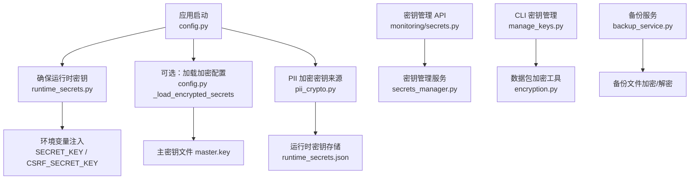
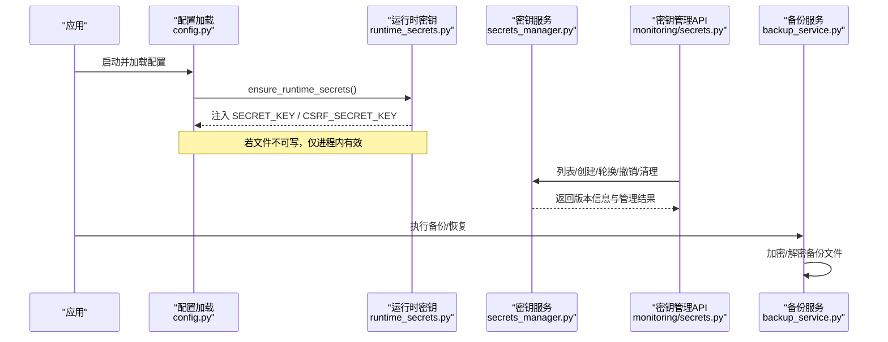
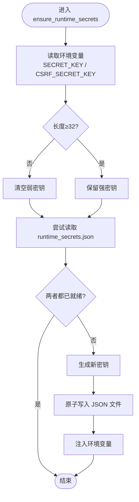
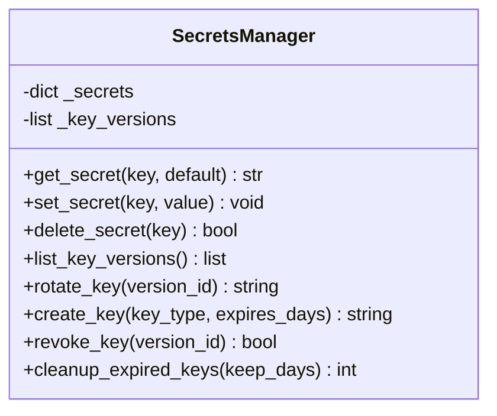
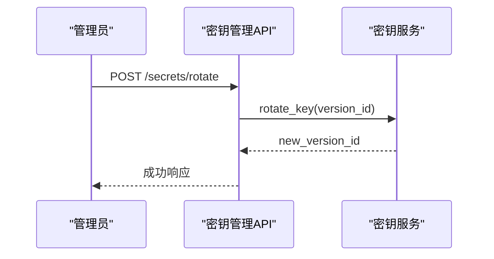
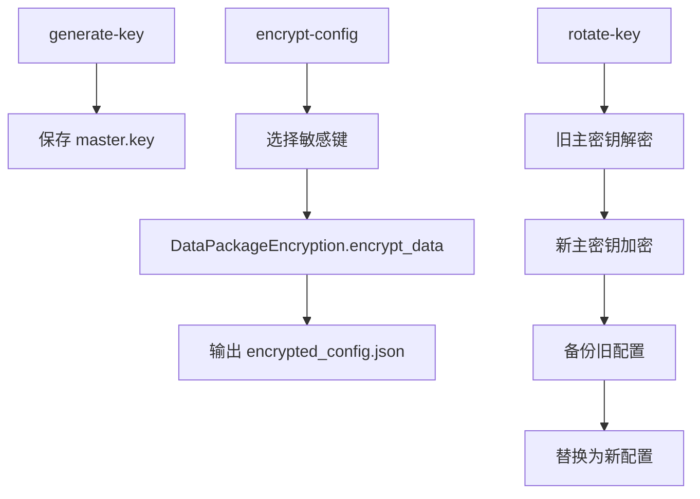
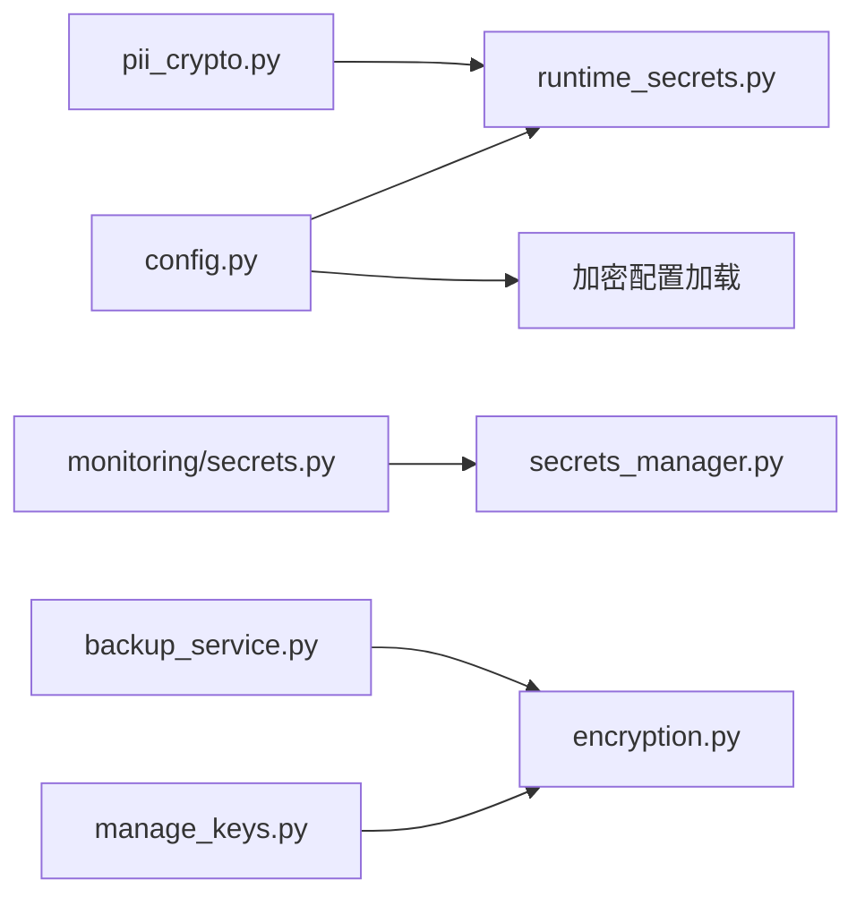

# 运行时密钥管理

<cite>
**本文引用的文件**
- [backend/app/utils/runtime_secrets.py](file://backend/app/utils/runtime_secrets.py)
- [backend/app/core/config.py](file://backend/app/core/config.py)
- [backend/app/services/secrets_manager.py](file://backend/app/services/secrets_manager.py)
- [backend/app/api/v1/monitoring/secrets.py](file://backend/app/api/v1/monitoring/secrets.py)
- [backend/scripts/manage_keys.py](file://backend/scripts/manage_keys.py)
- [backend/app/core/pii_crypto.py](file://backend/app/core/pii_crypto.py)
- [backend/app/services/backup_service.py](file://backend/app/services/backup_service.py)
- [backend/app/utils/encryption.py](file://backend/app/utils/encryption.py)
- [backend/tests/unit/test_runtime_secrets.py](file://backend/tests/unit/test_runtime_secrets.py)
</cite>

## 目录
1. [简介](#简介)
2. [项目结构](#项目结构)
3. [核心组件](#核心组件)
4. [架构总览](#架构总览)
5. [详细组件分析](#详细组件分析)
6. [依赖关系分析](#依赖关系分析)
7. [性能与安全考量](#性能与安全考量)
8. [故障排除指南](#故障排除指南)
9. [结论](#结论)
10. [附录：脚本与运维操作](#附录脚本与运维操作)

## 简介
本文件面向“运行时密钥管理”，覆盖 SECRET_KEY、CSRF_SECRET_KEY 等敏感密钥的自动生成、持久化、访问控制、轮换、备份恢复与多实例同步策略。系统通过启动时自动兜底生成并安全落盘，结合可选的加密配置与主密钥机制，提供从开发到生产的全链路密钥治理方案；同时提供密钥管理 API 与 CLI 工具，便于审计、轮换与应急处理。

## 项目结构
围绕运行时密钥管理的代码主要分布在以下位置：
- 运行时密钥自动初始化与持久化：backend/app/utils/runtime_secrets.py
- 应用配置加载与解密入口：backend/app/core/config.py
- 密钥版本管理与轮换服务：backend/app/services/secrets_manager.py
- 密钥管理 API（管理员）：backend/app/api/v1/monitoring/secrets.py
- 加密配置与主密钥管理 CLI：backend/scripts/manage_keys.py
- PII 字段透明加密与密钥来源：backend/app/core/pii_crypto.py
- 备份数据加密与恢复：backend/app/services/backup_service.py
- 数据包加密工具（PBKDF2 + Fernet）：backend/app/utils/encryption.py
- 运行时密钥行为测试用例：backend/tests/unit/test_runtime_secrets.py

**图示来源**
- [backend/app/core/config.py:60-259](file://backend/app/core/config.py#L60-L259)
- [backend/app/utils/runtime_secrets.py:20-179](file://backend/app/utils/runtime_secrets.py#L20-L179)
- [backend/app/core/pii_crypto.py:30-94](file://backend/app/core/pii_crypto.py#L30-L94)
- [backend/app/api/v1/monitoring/secrets.py:1-112](file://backend/app/api/v1/monitoring/secrets.py#L1-L112)
- [backend/app/services/secrets_manager.py:1-193](file://backend/app/services/secrets_manager.py#L1-L193)
- [backend/scripts/manage_keys.py:1-294](file://backend/scripts/manage_keys.py#L1-L294)
- [backend/app/services/backup_service.py:145-200](file://backend/app/services/backup_service.py#L145-L200)
- [backend/app/utils/encryption.py:17-179](file://backend/app/utils/encryption.py#L17-L179)

**章节来源**
- [backend/app/core/config.py:60-259](file://backend/app/core/config.py#L60-L259)
- [backend/app/utils/runtime_secrets.py:20-179](file://backend/app/utils/runtime_secrets.py#L20-L179)

## 核心组件
- 运行时密钥自动初始化：在应用启动阶段确保 SECRET_KEY 与 CSRF_SECRET_KEY 可用，优先使用环境变量，其次读取 runtime_secrets.json，缺失则生成并原子写入，最后注入进程环境变量。
- 通用密钥持久化：get_or_create_secret 为任意密钥名提供“存在即读、不存在生成并持久化”的能力，默认使用安全随机源。
- 密钥版本管理：SecretsManager 维护密钥版本、活跃状态、过期清理与撤销能力，并通过 API 暴露给管理员。
- 加密配置与主密钥：支持将敏感配置项加密存储于 JSON，配合独立的主密钥文件进行加载；提供 CLI 用于生成、加密、解密与轮换。
- PII 字段加密：PII 字段采用确定性加密（AES-SIV），密钥可来自显式配置或运行时密钥存储，保证跨机离线同步场景下的密文一致性。
- 备份加密：备份包可使用 PBKDF2 派生密钥进行 AES-256（Fernet）加密，支持检测是否已加密与解密到临时文件后恢复。

**章节来源**
- [backend/app/utils/runtime_secrets.py:20-179](file://backend/app/utils/runtime_secrets.py#L20-L179)
- [backend/app/services/secrets_manager.py:13-193](file://backend/app/services/secrets_manager.py#L13-L193)
- [backend/scripts/manage_keys.py:28-239](file://backend/scripts/manage_keys.py#L28-L239)
- [backend/app/core/pii_crypto.py:30-94](file://backend/app/core/pii_crypto.py#L30-L94)
- [backend/app/services/backup_service.py:145-200](file://backend/app/services/backup_service.py#L145-L200)

## 架构总览
运行时密钥管理贯穿“启动加载 → 运行期访问 → 管理接口 → 备份恢复”全生命周期。

**图示来源**
- [backend/app/core/config.py:366-383](file://backend/app/core/config.py#L366-L383)
- [backend/app/utils/runtime_secrets.py:20-93](file://backend/app/utils/runtime_secrets.py#L20-L93)
- [backend/app/api/v1/monitoring/secrets.py:23-112](file://backend/app/api/v1/monitoring/secrets.py#L23-L112)
- [backend/app/services/secrets_manager.py:67-188](file://backend/app/services/secrets_manager.py#L67-L188)
- [backend/app/services/backup_service.py:145-200](file://backend/app/services/backup_service.py#L145-L200)

## 详细组件分析

### 运行时密钥自动初始化（SECRET_KEY / CSRF_SECRET_KEY）
- 优先级：环境变量 > runtime_secrets.json > 自动生成
- 强度校验：长度不足视为无效，触发重新生成
- 原子落盘：使用临时文件 + os.replace 避免部分写入；非 Windows 平台限制权限为 0o600
- 回退策略：无法写入时仅保留进程内密钥，记录告警日志

**图示来源**
- [backend/app/utils/runtime_secrets.py:20-93](file://backend/app/utils/runtime_secrets.py#L20-L93)

**章节来源**
- [backend/app/utils/runtime_secrets.py:20-93](file://backend/app/utils/runtime_secrets.py#L20-L93)
- [backend/tests/unit/test_runtime_secrets.py:76-118](file://backend/tests/unit/test_runtime_secrets.py#L76-L118)

### 通用密钥持久化（get_or_create_secret）
- 用途：为任意密钥名（如 ENCRYPTION_FERNET_KEY、PII_AESSIV_KEY）提供“首次生成并持久化”的统一入口
- 默认生成器：token_urlsafe(48)
- 失败回退：无法写入时仅返回进程内值并记录警告

**章节来源**
- [backend/app/utils/runtime_secrets.py:95-134](file://backend/app/utils/runtime_secrets.py#L95-L134)

### 密钥版本管理（SecretsManager）
- 功能：创建密钥、列出版本、轮换（激活新版本并停用旧版本）、撤销、清理过期
- 存储：内存中的密钥字典 + 版本元数据列表
- 类型：默认 Fernet；其他类型使用随机密钥
- 过期策略：按 created_at / revoked_at 与 keep_days 阈值清理

**图示来源**
- [backend/app/services/secrets_manager.py:13-193](file://backend/app/services/secrets_manager.py#L13-L193)

**章节来源**
- [backend/app/services/secrets_manager.py:67-188](file://backend/app/services/secrets_manager.py#L67-L188)

### 密钥管理 API（管理员）
- 端点：
  - GET /api/v1/secrets/versions：列出所有密钥版本
  - POST /api/v1/secrets/rotate：轮换密钥（可指定版本）
  - POST /api/v1/secrets/create：创建新密钥（支持过期天数）
  - POST /api/v1/secrets/revoke/{version_id}：撤销密钥
  - POST /api/v1/secrets/cleanup：清理过期密钥
  - GET /api/v1/secrets/status：获取密钥状态（活跃数量、最新版本等）
- 鉴权：需管理员权限

**图示来源**
- [backend/app/api/v1/monitoring/secrets.py:23-112](file://backend/app/api/v1/monitoring/secrets.py#L23-L112)
- [backend/app/services/secrets_manager.py:71-108](file://backend/app/services/secrets_manager.py#L71-L108)

**章节来源**
- [backend/app/api/v1/monitoring/secrets.py:18-112](file://backend/app/api/v1/monitoring/secrets.py#L18-L112)

### 加密配置与主密钥（CLI）
- 生成主密钥：Fernet.generate_key()
- 加密配置：从 .env 提取敏感键（如 SECRET_KEY、CSRF_SECRET_KEY、SMTP_PASSWORD、DB_ENCRYPTION_KEY、DATABASE_URL、REDIS_URL）并使用主密钥加密为 JSON
- 解密验证：使用主密钥对加密配置进行解密校验
- 密钥轮换：用旧主密钥解密后再用新主密钥重新加密，自动备份旧配置

**图示来源**
- [backend/scripts/manage_keys.py:28-239](file://backend/scripts/manage_keys.py#L28-L239)
- [backend/app/utils/encryption.py:17-179](file://backend/app/utils/encryption.py#L17-L179)

**章节来源**
- [backend/scripts/manage_keys.py:28-239](file://backend/scripts/manage_keys.py#L28-L239)
- [backend/app/utils/encryption.py:59-105](file://backend/app/utils/encryption.py#L59-L105)

### PII 字段透明加密与密钥来源
- 算法：AES-SIV（确定性加密），标记前缀 enc.v1:
- 密钥来源优先级：
  1) 显式 ENCRYPTION_KEY（SHA-512 派生 64 字节 AESSIV 密钥）
  2) 运行时密钥存储中的 PII_AESSIV_KEY（首次生成并持久化）
- 多机离线同步：应配置相同 ENCRYPTION_KEY，以保证密文一致

**章节来源**
- [backend/app/core/pii_crypto.py:30-94](file://backend/app/core/pii_crypto.py#L30-L94)

### 备份数据加密与恢复
- 加密方式：PBKDF2 派生 AES-256（Fernet），文件头包含加密标记与盐
- 检测：根据标记判断是否已加密
- 解密：密码错误或损坏抛出异常，解密到临时文件以保护原始备份

**章节来源**
- [backend/app/services/backup_service.py:145-200](file://backend/app/services/backup_service.py#L145-L200)

## 依赖关系分析
- config.py 在模块加载阶段调用 ensure_runtime_secrets，确保后续组件能读到 SECRET_KEY / CSRF_SECRET_KEY
- pii_crypto.py 在需要时通过 get_or_create_secret 获取 PII 加密密钥
- secrets_manager.py 被 monitoring/secrets.py 暴露为 API，供管理员进行密钥生命周期管理
- manage_keys.py 依赖 encryption.py 实现配置级加密与轮换
- backup_service.py 使用 cryptography 库进行备份文件的对称加密

**图示来源**
- [backend/app/core/config.py:366-383](file://backend/app/core/config.py#L366-L383)
- [backend/app/core/pii_crypto.py:30-94](file://backend/app/core/pii_crypto.py#L30-L94)
- [backend/app/api/v1/monitoring/secrets.py:1-112](file://backend/app/api/v1/monitoring/secrets.py#L1-L112)
- [backend/scripts/manage_keys.py:1-294](file://backend/scripts/manage_keys.py#L1-L294)
- [backend/app/services/backup_service.py:145-200](file://backend/app/services/backup_service.py#L145-L200)

**章节来源**
- [backend/app/core/config.py:366-383](file://backend/app/core/config.py#L366-L383)
- [backend/app/core/pii_crypto.py:30-94](file://backend/app/core/pii_crypto.py#L30-L94)
- [backend/app/api/v1/monitoring/secrets.py:1-112](file://backend/app/api/v1/monitoring/secrets.py#L1-L112)
- [backend/scripts/manage_keys.py:1-294](file://backend/scripts/manage_keys.py#L1-L294)
- [backend/app/services/backup_service.py:145-200](file://backend/app/services/backup_service.py#L145-L200)

## 性能与安全考量
- 性能
  - 运行时密钥文件读写仅在缺失或变更时发生，正常路径为直接读取环境变量或缓存
  - 原子写入避免并发竞争导致的文件损坏
  - 备份加密使用 PBKDF2 高迭代次数，兼顾安全性与性能平衡
- 安全
  - 密钥最小长度校验，弱密钥将被忽略并重新生成
  - 非 Windows 平台下运行时密钥文件权限限制为 0o600
  - 主密钥与加密配置文件分离存放，建议严格权限控制
  - 备份文件头部包含加密标记，防止误用明文备份
  - PII 确定性加密暴露等值关系，但满足离线同步需求且不影响查询性能

[本节为通用指导，不直接分析具体文件]

## 故障排除指南
- 运行时密钥未持久化
  - 现象：重启后密钥变化
  - 排查：检查运行时密钥文件是否存在及权限；确认写入目录可写
  - 参考：[backend/app/utils/runtime_secrets.py:79-93](file://backend/app/utils/runtime_secrets.py#L79-L93)
- 环境变量长度不足
  - 现象：启动日志提示弱密钥并重新生成
  - 排查：确保 SECRET_KEY / CSRF_SECRET_KEY 长度 ≥ 32
  - 参考：[backend/app/utils/runtime_secrets.py:32-45](file://backend/app/utils/runtime_secrets.py#L32-L45)
- 加密配置无法加载
  - 现象：回退到环境变量
  - 排查：确认 SECRETS_FILE_PATH 与 MASTER_KEY_PATH 存在且可读
  - 参考：[backend/app/core/config.py:243-259](file://backend/app/core/config.py#L243-L259)
- 备份恢复失败
  - 现象：密码错误或文件损坏
  - 排查：确认密码正确、备份文件完整且未被篡改
  - 参考：[backend/app/services/backup_service.py:180-200](file://backend/app/services/backup_service.py#L180-L200)
- PII 解密失败
  - 现象：日志记录解密失败并原样返回
  - 排查：确认 ENCRYPTION_KEY 或 PII_AESSIV_KEY 一致，数据未被破坏
  - 参考：[backend/app/core/pii_crypto.py:78-87](file://backend/app/core/pii_crypto.py#L78-L87)

**章节来源**
- [backend/app/utils/runtime_secrets.py:32-93](file://backend/app/utils/runtime_secrets.py#L32-L93)
- [backend/app/core/config.py:243-259](file://backend/app/core/config.py#L243-L259)
- [backend/app/services/backup_service.py:180-200](file://backend/app/services/backup_service.py#L180-L200)
- [backend/app/core/pii_crypto.py:78-87](file://backend/app/core/pii_crypto.py#L78-L87)

## 结论
本系统提供了完整的运行时密钥管理方案：启动时自动兜底生成并安全持久化，支持通用密钥持久化、密钥版本化管理与 API 管理、加密配置与主密钥轮换、PII 字段透明加密以及备份数据加密。通过严格的强度校验、原子写入与权限控制，兼顾了易用性与安全性。建议在多实例部署中统一配置 ENCRYPTION_KEY 以实现 PII 密文互导，并结合备份加密与定期轮换策略保障长期安全。

[本节为总结性内容，不直接分析具体文件]

## 附录：脚本与运维操作
- 生成主密钥
  - 命令：python -m scripts.manage_keys generate-key
  - 作用：生成 Fernet 主密钥并保存到文件
  - 参考：[backend/scripts/manage_keys.py:28-52](file://backend/scripts/manage_keys.py#L28-L52)
- 加密配置文件
  - 命令：python -m scripts.manage_keys encrypt-config <env_file> [--key <master_key_file>]
  - 作用：将敏感键加密为 JSON 配置
  - 参考：[backend/scripts/manage_keys.py:55-139](file://backend/scripts/manage_keys.py#L55-L139)
- 解密验证
  - 命令：python -m scripts.manage_keys decrypt-config <encrypted_file> [--key <master_key_file>]
  - 作用：使用主密钥解密并预览
  - 参考：[backend/scripts/manage_keys.py:142-175](file://backend/scripts/manage_keys.py#L142-L175)
- 密钥轮换
  - 命令：python -m scripts.manage_keys rotate-key <old_key_file> <new_key_file> <encrypted_config_file>
  - 作用：用旧主密钥解密后用新主密钥重新加密，并备份旧配置
  - 参考：[backend/scripts/manage_keys.py:178-239](file://backend/scripts/manage_keys.py#L178-L239)
- 密钥管理 API（管理员）
  - 列表版本：GET /api/v1/secrets/versions
  - 轮换密钥：POST /api/v1/secrets/rotate
  - 创建密钥：POST /api/v1/secrets/create
  - 撤销密钥：POST /api/v1/secrets/revoke/{version_id}
  - 清理过期：POST /api/v1/secrets/cleanup
  - 状态查询：GET /api/v1/secrets/status
  - 参考：[backend/app/api/v1/monitoring/secrets.py:23-112](file://backend/app/api/v1/monitoring/secrets.py#L23-L112)

**章节来源**
- [backend/scripts/manage_keys.py:28-239](file://backend/scripts/manage_keys.py#L28-L239)
- [backend/app/api/v1/monitoring/secrets.py:23-112](file://backend/app/api/v1/monitoring/secrets.py#L23-L112)