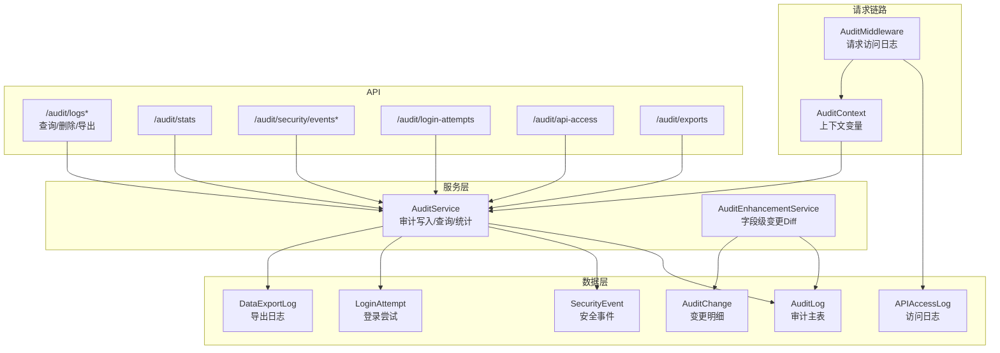
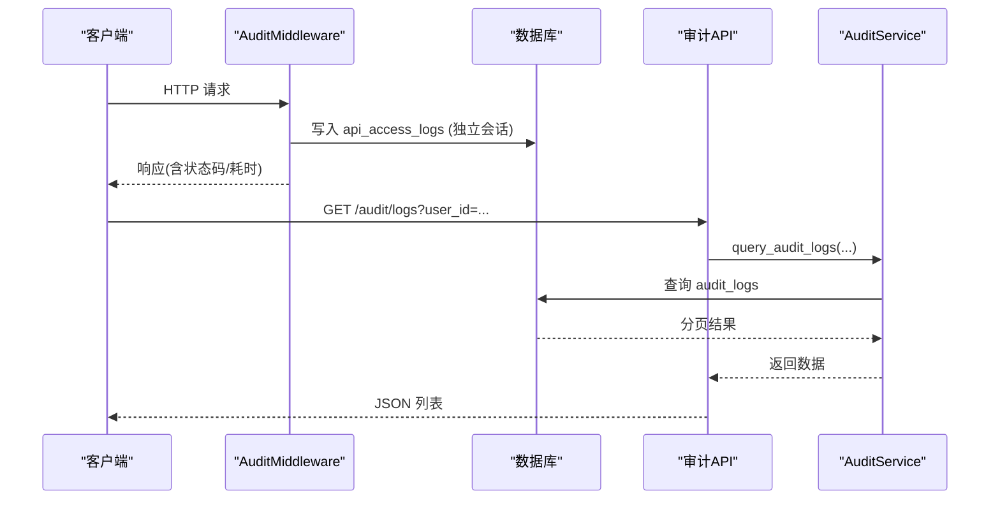
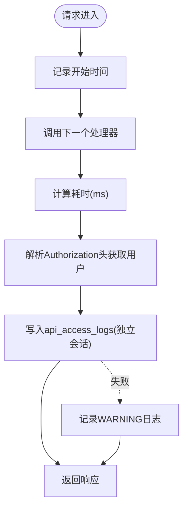
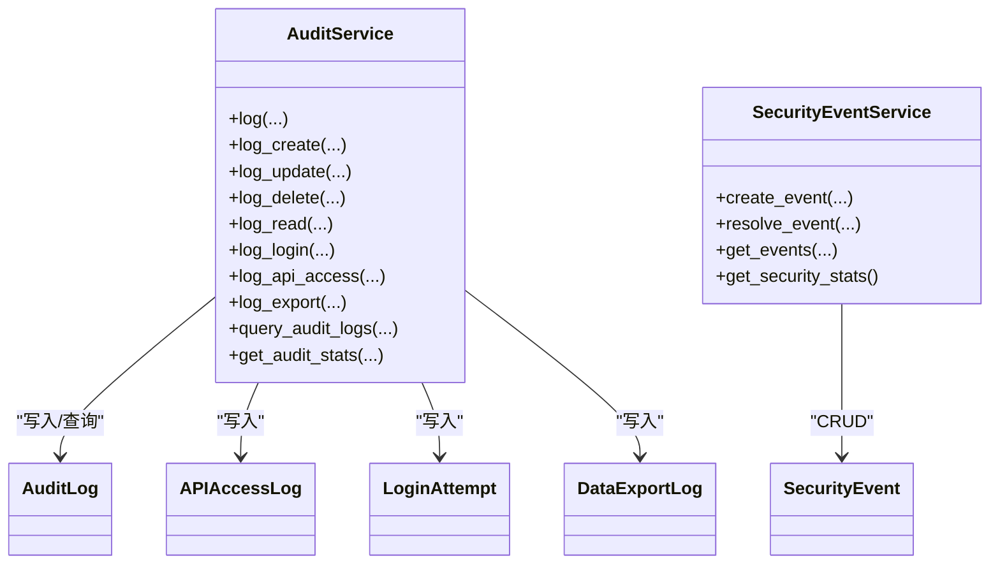
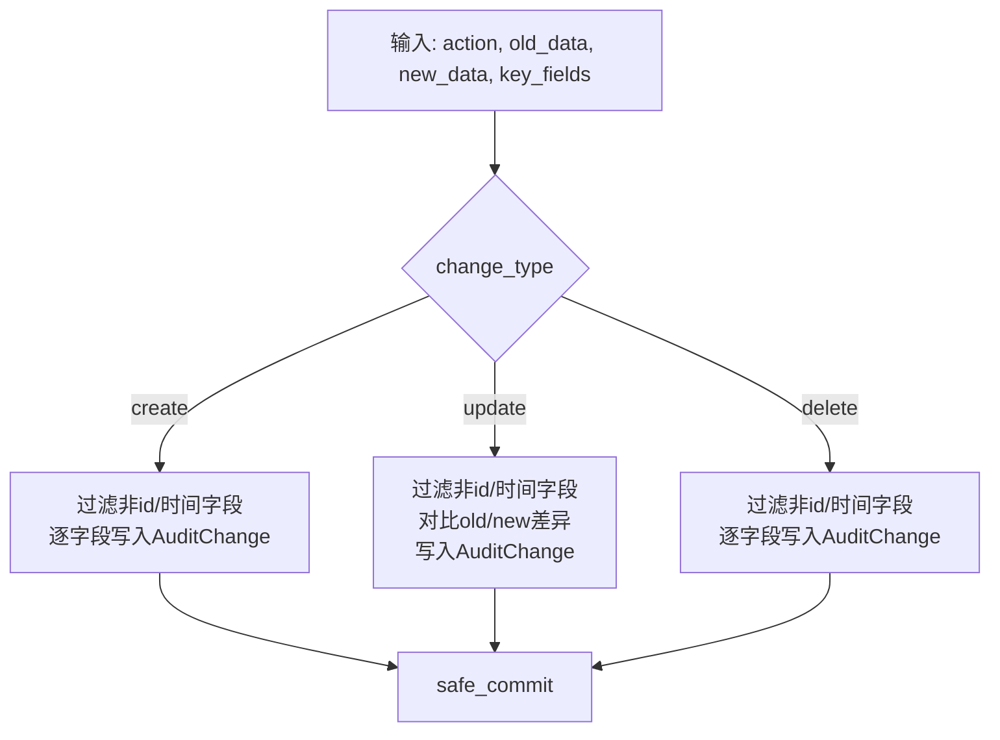
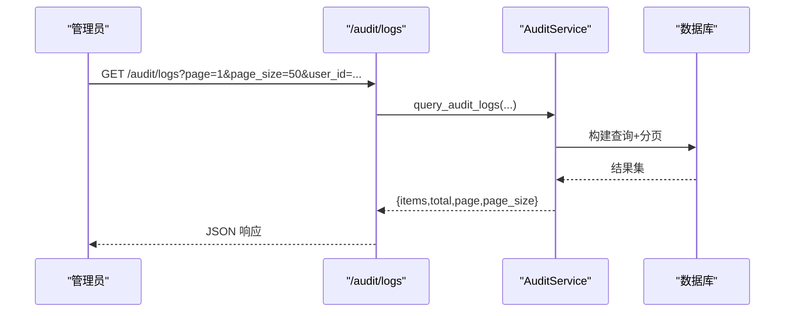
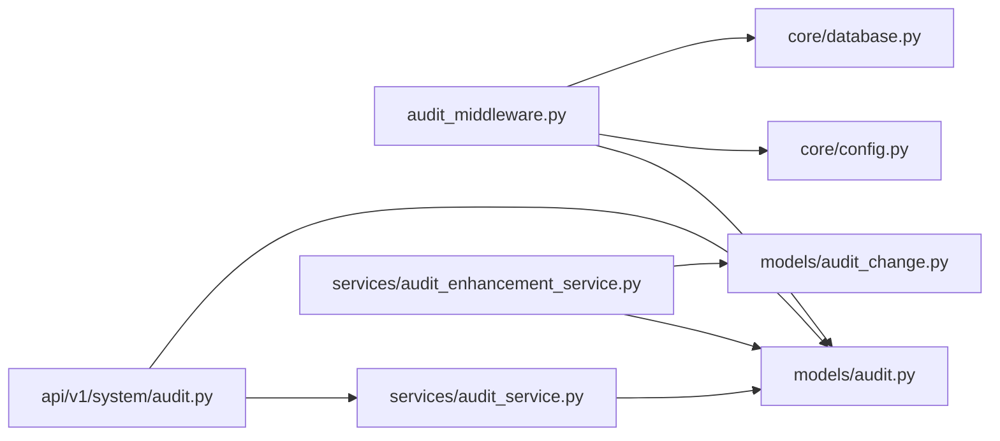

# 审计日志系统

<cite>
**本文引用的文件**
- [backend/app/core/audit_middleware.py](file://backend/app/core/audit_middleware.py)
- [backend/app/models/audit.py](file://backend/app/models/audit.py)
- [backend/app/models/audit_change.py](file://backend/app/models/audit_change.py)
- [backend/app/services/audit_service.py](file://backend/app/services/audit_service.py)
- [backend/app/services/audit_enhancement_service.py](file://backend/app/services/audit_enhancement_service.py)
- [backend/app/middleware/audit_context.py](file://backend/app/middleware/audit_context.py)
- [backend/app/api/v1/system/audit.py](file://backend/app/api/v1/system/audit.py)
</cite>

## 目录
1. [简介](#简介)
2. [项目结构](#项目结构)
3. [核心组件](#核心组件)
4. [架构总览](#架构总览)
5. [详细组件分析](#详细组件分析)
6. [依赖关系分析](#依赖关系分析)
7. [性能与生产配置](#性能与生产配置)
8. [故障排查指南](#故障排查指南)
9. [结论](#结论)
10. [附录：API 使用示例与扩展方法](#附录api-使用示例与扩展方法)

## 简介
本系统提供完整的审计日志能力，覆盖操作审计记录、访问日志收集、变更历史追踪等核心功能。通过中间件自动采集 HTTP 请求的访问信息，结合服务层统一写入结构化审计表；同时提供字段级变更 Diff 留痕，便于合规审计与问题回溯。系统提供查询、统计、导出与安全事件管理能力，并支持管理员权限控制与分页过滤。

## 项目结构
审计相关代码主要分布在以下模块：
- 中间件：请求级访问日志采集与用户身份解析
- 模型：审计主表、变更明细表、安全事件、登录尝试、API 访问日志、数据导出日志
- 服务：统一的审计写入、查询、统计与安全事件处理；增强服务提供字段级变更记录
- API：审计日志与安全事件的查询、删除、导出、统计等接口

图表来源
- [backend/app/core/audit_middleware.py:11-109](file://backend/app/core/audit_middleware.py#L11-L109)
- [backend/app/services/audit_service.py:23-376](file://backend/app/services/audit_service.py#L23-L376)
- [backend/app/services/audit_enhancement_service.py:20-215](file://backend/app/services/audit_enhancement_service.py#L20-L215)
- [backend/app/models/audit.py:53-205](file://backend/app/models/audit.py#L53-L205)
- [backend/app/models/audit_change.py:13-33](file://backend/app/models/audit_change.py#L13-L33)
- [backend/app/api/v1/system/audit.py:80-615](file://backend/app/api/v1/system/audit.py#L80-L615)

章节来源
- [backend/app/core/audit_middleware.py:11-109](file://backend/app/core/audit_middleware.py#L11-L109)
- [backend/app/models/audit.py:53-205](file://backend/app/models/audit.py#L53-L205)
- [backend/app/models/audit_change.py:13-33](file://backend/app/models/audit_change.py#L13-L33)
- [backend/app/services/audit_service.py:23-376](file://backend/app/services/audit_service.py#L23-L376)
- [backend/app/services/audit_enhancement_service.py:20-215](file://backend/app/services/audit_enhancement_service.py#L20-L215)
- [backend/app/api/v1/system/audit.py:80-615](file://backend/app/api/v1/system/audit.py#L80-L615)

## 核心组件
- 访问日志中间件：捕获每次请求的方法、路径、状态码、耗时、用户身份（从 JWT 提取），并落库到独立短事务中，失败不影响业务。
- 审计服务：统一封装审计日志写入、查询、统计、导出、登录尝试与安全事件管理。
- 审计增强服务：为关键实体提供字段级变更 Diff 留痕，自动生成 create/update/delete 的明细记录。
- 审计上下文：基于 ContextVar 维护当前请求的用户 ID 与请求 ID，供各层复用。
- 数据模型：包含审计主表、变更明细表、安全事件、登录尝试、API 访问日志、数据导出日志，均设计有索引以优化查询。
- API 路由：提供审计日志与安全事件的查询、删除、导出、统计、登录尝试与 API 访问日志查看等接口，受管理员角色保护。

章节来源
- [backend/app/core/audit_middleware.py:11-109](file://backend/app/core/audit_middleware.py#L11-L109)
- [backend/app/services/audit_service.py:23-376](file://backend/app/services/audit_service.py#L23-L376)
- [backend/app/services/audit_enhancement_service.py:20-215](file://backend/app/services/audit_enhancement_service.py#L20-L215)
- [backend/app/middleware/audit_context.py:15-58](file://backend/app/middleware/audit_context.py#L15-L58)
- [backend/app/models/audit.py:53-205](file://backend/app/models/audit.py#L53-L205)
- [backend/app/models/audit_change.py:13-33](file://backend/app/models/audit_change.py#L13-L33)
- [backend/app/api/v1/system/audit.py:80-615](file://backend/app/api/v1/system/audit.py#L80-L615)

## 架构总览
审计系统采用“中间件 + 服务 + 模型 + API”的分层架构：
- 中间件负责无侵入地采集访问日志，保证业务不受影响
- 服务层提供一致的审计写入与查询能力，屏蔽底层细节
- 模型层定义结构化存储结构与索引策略
- API 层暴露查询、导出、统计与管理能力，并进行权限校验

图表来源
- [backend/app/core/audit_middleware.py:18-44](file://backend/app/core/audit_middleware.py#L18-L44)
- [backend/app/api/v1/system/audit.py:339-377](file://backend/app/api/v1/system/audit.py#L339-L377)
- [backend/app/services/audit_service.py:275-315](file://backend/app/services/audit_service.py#L275-L315)

## 详细组件分析

### 访问日志中间件（AuditMiddleware）
- 职责：记录请求方法、路径、状态码、耗时、用户身份（从 Authorization Bearer Token 解析），并持久化到 api_access_logs。
- 健壮性：落库失败仅记录警告日志，不破坏业务请求；使用独立短会话提交。
- 用户解析：解析 JWT payload 获取 sub 与 username，忽略过期验证以保证审计完整性。

图表来源
- [backend/app/core/audit_middleware.py:18-109](file://backend/app/core/audit_middleware.py#L18-L109)

章节来源
- [backend/app/core/audit_middleware.py:18-109](file://backend/app/core/audit_middleware.py#L18-L109)

### 审计服务（AuditService）
- 统一写入：提供 log/log_create/log_update/log_delete/log_read/log_login/log_api_access/log_export 等方法，封装审计主表与安全事件、登录尝试、导出日志的写入。
- 查询与统计：query_audit_logs 支持多维度过滤与分页；get_audit_stats 提供按动作、状态、级别、活跃用户、近期活动等统计。
- 安全事件：SecurityEventService 提供创建、解决、查询与安全统计。

图表来源
- [backend/app/services/audit_service.py:23-510](file://backend/app/services/audit_service.py#L23-L510)
- [backend/app/models/audit.py:53-205](file://backend/app/models/audit.py#L53-L205)

章节来源
- [backend/app/services/audit_service.py:23-510](file://backend/app/services/audit_service.py#L23-L510)
- [backend/app/models/audit.py:53-205](file://backend/app/models/audit.py#L53-L205)

### 审计增强服务（AuditEnhancementService）
- 字段级变更 Diff：对 create/update/delete 三类操作，生成字段级变更记录到 audit_changes，支持 key_fields 限制记录范围。
- 序列化：将值序列化为 JSON 兼容格式（字符串、数字、布尔、日期、列表、字典）。
- 变更历史：get_change_history 按资源类型与 ID 聚合最近 N 条审计日志及其变更明细。

图表来源
- [backend/app/services/audit_enhancement_service.py:49-146](file://backend/app/services/audit_enhancement_service.py#L49-L146)

章节来源
- [backend/app/services/audit_enhancement_service.py:49-215](file://backend/app/services/audit_enhancement_service.py#L49-L215)
- [backend/app/models/audit_change.py:13-33](file://backend/app/models/audit_change.py#L13-L33)

### 审计上下文（AuditContext）
- 基于 ContextVar 维护当前请求的用户 ID 与请求 ID，便于跨层传递审计上下文。
- 提供 get/set 当前上下文与便捷函数。

章节来源
- [backend/app/middleware/audit_context.py:15-58](file://backend/app/middleware/audit_context.py#L15-L58)

### API 路由（/audit/*）
- 日志管理：查询、详情、批量删除、单条删除、备注更新、导出（JSON/Excel/CSV）。
- 统计：审计统计、可用动作/级别枚举。
- 安全事件：查询、解决、统计。
- 登录尝试：查询。
- API 访问日志：查询。
- 导出日志：查询。
- 权限：多数接口要求 admin/super_admin。

图表来源
- [backend/app/api/v1/system/audit.py:339-377](file://backend/app/api/v1/system/audit.py#L339-L377)
- [backend/app/services/audit_service.py:275-315](file://backend/app/services/audit_service.py#L275-L315)

章节来源
- [backend/app/api/v1/system/audit.py:80-615](file://backend/app/api/v1/system/audit.py#L80-L615)

## 依赖关系分析
- 中间件依赖：JWT 解析、配置、数据库会话、审计模型。
- 服务依赖：SQLAlchemy Session、事务工具 safe_commit、审计模型与枚举。
- API 依赖：FastAPI 路由、依赖注入、权限校验、响应封装。
- 模型依赖：SQLAlchemy 列、索引、外键约束。

图表来源
- [backend/app/core/audit_middleware.py:18-109](file://backend/app/core/audit_middleware.py#L18-L109)
- [backend/app/services/audit_service.py:23-510](file://backend/app/services/audit_service.py#L23-L510)
- [backend/app/services/audit_enhancement_service.py:20-215](file://backend/app/services/audit_enhancement_service.py#L20-L215)
- [backend/app/models/audit.py:53-205](file://backend/app/models/audit.py#L53-L205)
- [backend/app/models/audit_change.py:13-33](file://backend/app/models/audit_change.py#L13-L33)
- [backend/app/api/v1/system/audit.py:80-615](file://backend/app/api/v1/system/audit.py#L80-L615)

章节来源
- [backend/app/core/audit_middleware.py:18-109](file://backend/app/core/audit_middleware.py#L18-L109)
- [backend/app/services/audit_service.py:23-510](file://backend/app/services/audit_service.py#L23-L510)
- [backend/app/services/audit_enhancement_service.py:20-215](file://backend/app/services/audit_enhancement_service.py#L20-L215)
- [backend/app/models/audit.py:53-205](file://backend/app/models/audit.py#L53-L205)
- [backend/app/models/audit_change.py:13-33](file://backend/app/models/audit_change.py#L13-L33)
- [backend/app/api/v1/system/audit.py:80-615](file://backend/app/api/v1/system/audit.py#L80-L615)

## 性能与生产配置
- 访问日志落库隔离：中间件使用独立短会话写入 api_access_logs，失败仅记录 WARNING，确保不阻塞业务请求。
- 索引优化：审计主表与访问日志表针对 user_id、action、created_at、resource_type/resource_id、endpoint 等高频查询字段建立索引。
- 分页与限制：API 查询默认分页，导出限制最大行数（如 5000），避免大结果集拖慢。
- 事务安全：审计写入使用 safe_commit，确保即使业务回滚也能保留审计轨迹。
- 敏感信息过滤：建议在业务侧记录审计时避免写入敏感字段（如密码、令牌），可通过 key_fields 或自定义 metadata 控制；如需更细粒度过滤，可在写入前进行字段白名单处理。
- 日志级别：审计日志支持 DEBUG/INFO/WARNING/ERROR/CRITICAL，可按需调整以平衡可观测性与开销。
- 外部依赖：openpyxl 可选，未安装时 Excel 导出自动降级为 CSV。

[本节为通用指导，不直接分析具体文件]

## 故障排查指南
- 访问日志未入库：检查中间件异常日志（WARNING），确认数据库连接与权限；确认独立会话提交是否成功。
- 审计日志缺失：确认业务侧是否正确调用审计服务；检查事务提交顺序，审计写入应独立提交。
- 变更历史为空：确认是否调用增强服务的 record_changes；检查 key_fields 是否限制了记录范围；确认旧/新数据是否为空。
- 导出失败：确认 openpyxl 是否安装；若未安装，将回退到 CSV 格式。
- 权限错误：审计管理接口需要 admin/super_admin 角色，请检查当前用户角色。

章节来源
- [backend/app/core/audit_middleware.py:80-109](file://backend/app/core/audit_middleware.py#L80-L109)
- [backend/app/services/audit_enhancement_service.py:143-146](file://backend/app/services/audit_enhancement_service.py#L143-L146)
- [backend/app/api/v1/system/audit.py:205-336](file://backend/app/api/v1/system/audit.py#L205-L336)

## 结论
本审计日志系统通过中间件与服务层的协同，实现了无侵入的请求访问日志采集、结构化审计记录与字段级变更历史追踪。配合完善的索引、分页与导出能力，以及安全事件管理与权限控制，能够满足生产环境的合规审计与运维监控需求。建议在生产环境中合理配置日志级别、敏感字段过滤与导出限制，以获得最佳性能与安全性。

[本节为总结，不直接分析具体文件]

## 附录：API 使用示例与扩展方法

### 常用审计 API
- 查询审计日志
  - 路径：GET /audit/logs
  - 参数：user_id、action、resource_type、status、level、start_date、end_date、page、page_size
  - 说明：需管理员权限；支持多维过滤与分页
  - 参考：[backend/app/api/v1/system/audit.py:339-377](file://backend/app/api/v1/system/audit.py#L339-L377)

- 审计统计
  - 路径：GET /audit/stats
  - 说明：返回按动作、状态、级别、活跃用户、近期活动等的统计
  - 参考：[backend/app/api/v1/system/audit.py:395-406](file://backend/app/api/v1/system/audit.py#L395-L406)

- 导出审计日志
  - 路径：GET /audit/logs/export
  - 参数：action、start_date、end_date、format(json/excel/csv)
  - 说明：支持 JSON/Excel/CSV 导出；未安装 openpyxl 时回退 CSV
  - 参考：[backend/app/api/v1/system/audit.py:205-336](file://backend/app/api/v1/system/audit.py#L205-L336)

- 批量删除审计日志
  - 路径：DELETE /audit/logs/batch
  - 请求体：ids、actions/action、before_date
  - 说明：支持按 ID、动作类型、日期范围组合删除；需管理员权限
  - 参考：[backend/app/api/v1/system/audit.py:80-141](file://backend/app/api/v1/system/audit.py#L80-L141)

- 安全事件
  - 查询：GET /audit/security/events
  - 解决：POST /audit/security/events/{event_id}/resolve
  - 统计：GET /audit/security/stats
  - 参考：[backend/app/api/v1/system/audit.py:419-475](file://backend/app/api/v1/system/audit.py#L419-L475)

- 登录尝试
  - 路径：GET /audit/login-attempts
  - 参数：username、ip_address、start_date、end_date、page、page_size
  - 参考：[backend/app/api/v1/system/audit.py:478-508](file://backend/app/api/v1/system/audit.py#L478-L508)

- API 访问日志
  - 路径：GET /audit/api-access
  - 参数：user_id、endpoint、start_date、end_date、page、page_size
  - 参考：[backend/app/api/v1/system/audit.py:511-541](file://backend/app/api/v1/system/audit.py#L511-L541)

- 导出日志
  - 路径：GET /audit/exports
  - 参数：user_id、export_type、start_date、end_date、page、page_size
  - 参考：[backend/app/api/v1/system/audit.py:544-574](file://backend/app/api/v1/system/audit.py#L544-L574)

### 自定义审计事件扩展
- 在业务逻辑中调用审计服务写入审计日志：
  - 使用 AuditService.log_* 系列方法记录创建、更新、删除、读取、登录等操作
  - 使用 AuditEnhancementService.log_entity_changes 记录字段级变更
  - 使用 SecurityEventService.create_event 记录安全事件
- 推荐实践：
  - 明确 resource_type 与 resource_id，便于后续检索
  - 使用 key_fields 限制变更记录的字段范围，减少冗余
  - 避免在审计中写入敏感信息，必要时通过 metadata 附加非敏感上下文
  - 在高并发场景下，利用中间件的独立会话写入访问日志，降低对业务事务的影响

章节来源
- [backend/app/api/v1/system/audit.py:80-615](file://backend/app/api/v1/system/audit.py#L80-L615)
- [backend/app/services/audit_service.py:62-376](file://backend/app/services/audit_service.py#L62-L376)
- [backend/app/services/audit_enhancement_service.py:49-215](file://backend/app/services/audit_enhancement_service.py#L49-L215)