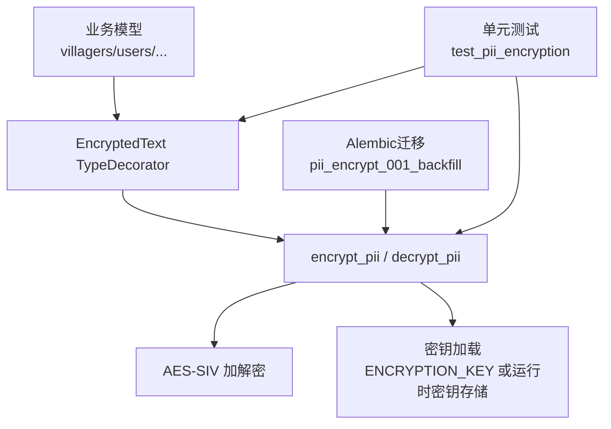
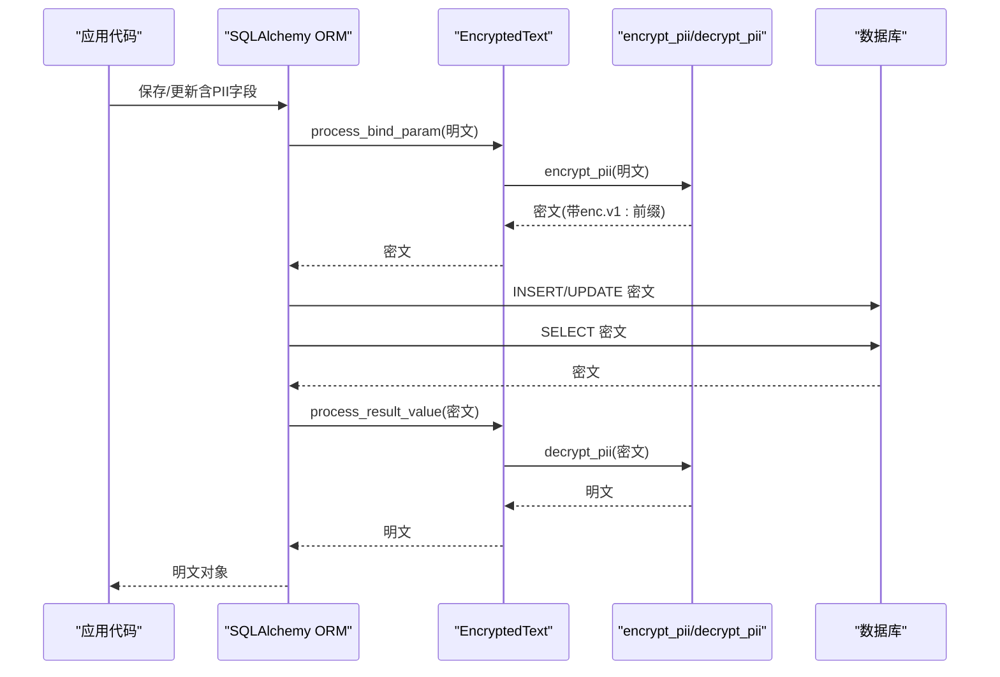
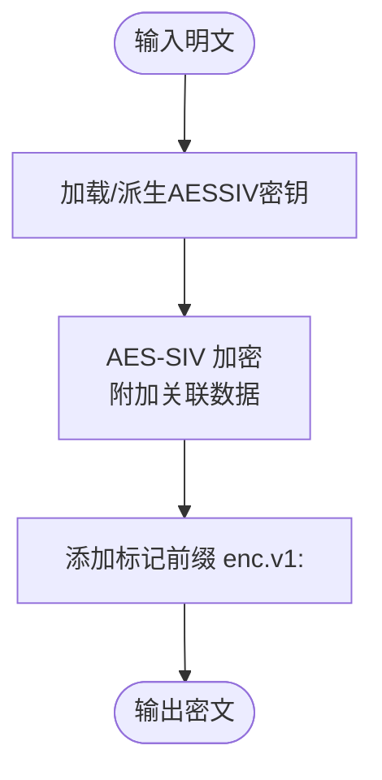
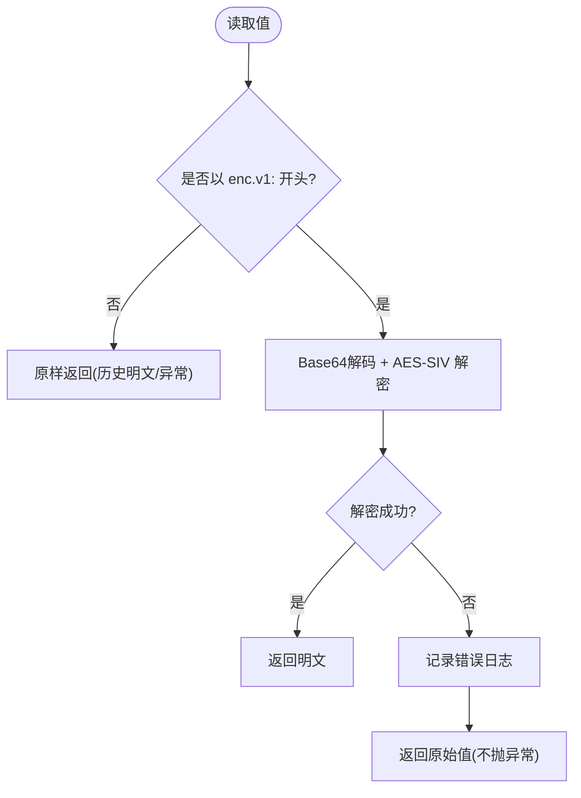
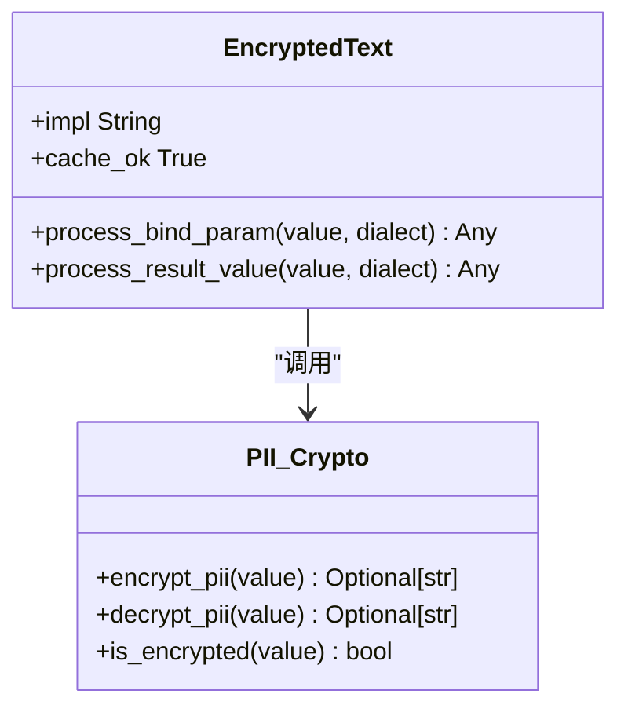
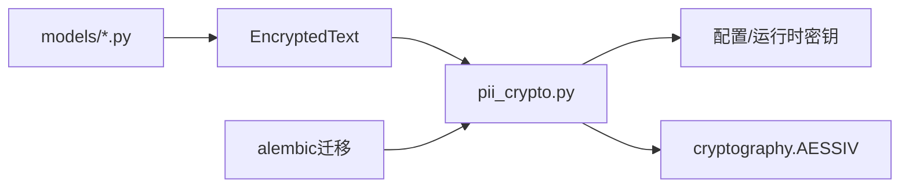

# PII字段加密

<cite>
**本文引用的文件**
- [backend/app/core/pii_crypto.py](file://backend/app/core/pii_crypto.py)
- [backend/app/models/base.py](file://backend/app/models/base.py)
- [backend/alembic/versions/pii_encrypt_001_backfill.py](file://backend/alembic/versions/pii_encrypt_001_backfill.py)
- [backend/tests/unit/test_pii_encryption.py](file://backend/tests/unit/test_pii_encryption.py)
- [backend/app/models/village.py](file://backend/app/models/village.py)
- [backend/app/models/user.py](file://backend/app/models/user.py)
- [backend/app/models/organization.py](file://backend/app/models/organization.py)
- [backend/app/models/project.py](file://backend/app/models/project.py)
- [backend/app/models/rural_work.py](file://backend/app/models/rural_work.py)
- [backend/app/models/rural_task.py](file://backend/app/models/rural_task.py)
- [backend/app/models/school.py](file://backend/app/models/school.py)
</cite>

## 目录
1. [简介](#简介)
2. [项目结构](#项目结构)
3. [核心组件](#核心组件)
4. [架构总览](#架构总览)
5. [详细组件分析](#详细组件分析)
6. [依赖关系分析](#依赖关系分析)
7. [性能考量](#性能考量)
8. [故障排查指南](#故障排查指南)
9. [结论](#结论)
10. [附录](#附录)

## 简介
本文件系统性说明PII（个人身份信息）字段的透明加密方案。该方案基于确定性AES-SIV算法，实现“同一明文恒得同一密文”，从而在数据库层直接支持等值查询；通过TypeDecorator将加解密逻辑嵌入ORM读写流程，业务代码与既有SQL查询无需改动；同时以密文标记前缀“enc.v1:”兼容历史明文数据，确保迁移平滑、可回退、可幂等执行。

## 项目结构
PII加密相关代码主要分布在以下位置：
- 加密核心：backend/app/core/pii_crypto.py
- ORM类型装饰器：backend/app/models/base.py（EncryptedText）
- 存量回填迁移：backend/alembic/versions/pii_encrypt_001_backfill.py
- 使用示例模型：villagers、users、organizations、projects、rural_works、rural_tasks、schools
- 验收测试：backend/tests/unit/test_pii_encryption.py

图表来源
- [backend/app/models/base.py:23-45](file://backend/app/models/base.py#L23-L45)
- [backend/app/core/pii_crypto.py:30-63](file://backend/app/core/pii_crypto.py#L30-L63)
- [backend/alembic/versions/pii_encrypt_001_backfill.py:41-73](file://backend/alembic/versions/pii_encrypt_001_backfill.py#L41-L73)
- [backend/tests/unit/test_pii_encryption.py:36-130](file://backend/tests/unit/test_pii_encryption.py#L36-L130)

章节来源
- [backend/app/models/base.py:23-45](file://backend/app/models/base.py#L23-L45)
- [backend/app/core/pii_crypto.py:1-27](file://backend/app/core/pii_crypto.py#L1-L27)
- [backend/alembic/versions/pii_encrypt_001_backfill.py:26-38](file://backend/alembic/versions/pii_encrypt_001_backfill.py#L26-L38)

## 核心组件
- 加密核心模块：提供确定性AES-SIV加解密、密钥加载、标记识别与缓存机制。
- EncryptedText类型装饰器：在ORM写入时自动加密、读取时自动解密，对上层透明。
- Alembic迁移：对存量明文进行一次性回填加密，并支持降级回退。
- 模型列：在多个业务表中对敏感字段使用EncryptedText声明。

章节来源
- [backend/app/core/pii_crypto.py:30-93](file://backend/app/core/pii_crypto.py#L30-L93)
- [backend/app/models/base.py:23-45](file://backend/app/models/base.py#L23-L45)
- [backend/alembic/versions/pii_encrypt_001_backfill.py:41-73](file://backend/alembic/versions/pii_encrypt_001_backfill.py#L41-L73)
- [backend/app/models/village.py:89-90](file://backend/app/models/village.py#L89-L90)
- [backend/app/models/user.py:49-49](file://backend/app/models/user.py#L49-L49)
- [backend/app/models/organization.py:59-59](file://backend/app/models/organization.py#L59-L59)
- [backend/app/models/project.py:110-110](file://backend/app/models/project.py#L110-L110)
- [backend/app/models/rural_work.py:52-52](file://backend/app/models/rural_work.py#L52-L52)
- [backend/app/models/rural_task.py:96-96](file://backend/app/models/rural_task.py#L96-L96)
- [backend/app/models/school.py:95-95](file://backend/app/models/school.py#L95-L95)

## 架构总览
下图展示了从ORM写入到落库、再到读取返回的完整链路，以及迁移回填如何与现有数据共存。

图表来源
- [backend/app/models/base.py:37-45](file://backend/app/models/base.py#L37-L45)
- [backend/app/core/pii_crypto.py:70-87](file://backend/app/core/pii_crypto.py#L70-L87)

## 详细组件分析

### AES-SIV确定性加密原理与等值查询
- 确定性：同一明文在同一密钥下始终生成相同密文，因此WHERE phone = :v经绑定参数加密后可以直接匹配数据库中已加密的值，无需额外哈希列或查询改写。
- 关联数据：使用固定关联数据标识，增强安全性。
- 密钥派生：通过对配置或运行时密钥做SHA-512派生得到64字节AESSIV密钥，进程内缓存避免重复计算。

图表来源
- [backend/app/core/pii_crypto.py:30-63](file://backend/app/core/pii_crypto.py#L30-L63)
- [backend/app/core/pii_crypto.py:70-75](file://backend/app/core/pii_crypto.py#L70-L75)

章节来源
- [backend/app/core/pii_crypto.py:1-27](file://backend/app/core/pii_crypto.py#L1-L27)
- [backend/app/core/pii_crypto.py:30-63](file://backend/app/core/pii_crypto.py#L30-L63)
- [backend/app/core/pii_crypto.py:70-75](file://backend/app/core/pii_crypto.py#L70-L75)

### 密文标记前缀“enc.v1:”的作用机制与历史明文兼容
- 作用：用于区分“已加密值”和“历史明文/异常值”。读取时若无前缀则原样返回，避免二次加密或报错。
- 迁移：存量回填仅处理非空且不含该前缀的行，幂等可重跑。
- 降级：downgrade按前缀筛选已加密行并解密回明文。

图表来源
- [backend/app/core/pii_crypto.py:66-87](file://backend/app/core/pii_crypto.py#L66-L87)
- [backend/alembic/versions/pii_encrypt_001_backfill.py:46-57](file://backend/alembic/versions/pii_encrypt_001_backfill.py#L46-L57)
- [backend/alembic/versions/pii_encrypt_001_backfill.py:65-73](file://backend/alembic/versions/pii_encrypt_001_backfill.py#L65-L73)

章节来源
- [backend/app/core/pii_crypto.py:66-87](file://backend/app/core/pii_crypto.py#L66-L87)
- [backend/alembic/versions/pii_encrypt_001_backfill.py:41-73](file://backend/alembic/versions/pii_encrypt_001_backfill.py#L41-L73)

### encrypt_pii 与 decrypt_pii 使用方法、参数与返回值
- encrypt_pii(value)
  - 参数：可选字符串（明文），None 或已加密值原样返回。
  - 返回：带“enc.v1:”前缀的密文字符串；None 保持为 None。
- decrypt_pii(value)
  - 参数：可选字符串（密文或明文）。
  - 返回：若检测到“enc.v1:”前缀则尝试解密，失败记录日志并返回原值；无前缀则原样返回。

章节来源
- [backend/app/core/pii_crypto.py:70-87](file://backend/app/core/pii_crypto.py#L70-L87)
- [backend/tests/unit/test_pii_encryption.py:36-45](file://backend/tests/unit/test_pii_encryption.py#L36-L45)

### TypeDecorator 绑定参数的透明加密机制
- 写入：EncryptedText.process_bind_param 调用 encrypt_pii，将明文转为密文再入库。
- 读取：EncryptedText.process_result_value 调用 decrypt_pii，将密文还原为明文返回给ORM对象。
- 效果：ORM读写与既有查询零改动；WHERE等值条件经绑定参数加密后可直接命中密文。

图表来源
- [backend/app/models/base.py:23-45](file://backend/app/models/base.py#L23-L45)
- [backend/app/core/pii_crypto.py:66-87](file://backend/app/core/pii_crypto.py#L66-L87)

章节来源
- [backend/app/models/base.py:23-45](file://backend/app/models/base.py#L23-L45)

### 模型中PII字段的使用示例
- villagers.id_card、villagers.phone
- users.phone
- organizations.contact_phone
- projects.contact_phone
- rural_works.contact_phone
- rural_tasks.contact_phone
- schools.contact_phone

这些字段均声明为EncryptedText，ORM写入自动加密，读取自动解密，查询可直接用等值条件匹配密文。

章节来源
- [backend/app/models/village.py:89-90](file://backend/app/models/village.py#L89-L90)
- [backend/app/models/user.py:49-49](file://backend/app/models/user.py#L49-L49)
- [backend/app/models/organization.py:59-59](file://backend/app/models/organization.py#L59-L59)
- [backend/app/models/project.py:110-110](file://backend/app/models/project.py#L110-L110)
- [backend/app/models/rural_work.py:52-52](file://backend/app/models/rural_work.py#L52-L52)
- [backend/app/models/rural_task.py:96-96](file://backend/app/models/rural_task.py#L96-L96)
- [backend/app/models/school.py:95-95](file://backend/app/models/school.py#L95-L95)

### 存量回填迁移与幂等性
- 扫描所有目标表/列，过滤出非空且未带“enc.v1:”前缀的历史明文。
- 逐行调用encrypt_pii并更新，记录日志。
- 幂等：已加密值跳过；可断点重跑。
- downgrade：按前缀筛选已加密行并解密回明文。

章节来源
- [backend/alembic/versions/pii_encrypt_001_backfill.py:26-38](file://backend/alembic/versions/pii_encrypt_001_backfill.py#L26-L38)
- [backend/alembic/versions/pii_encrypt_001_backfill.py:41-73](file://backend/alembic/versions/pii_encrypt_001_backfill.py#L41-L73)

### 端到端验证与行为保障
- 确定性：同明文两次加密结果一致。
- ORM写入落库为密文，读取返回明文。
- 等值查询：WHERE phone = :v 能正确匹配到对应行。
- 文件级安全：数据库文件中不包含明文，包含“enc.v1:”标记。
- 历史明文兼容：未迁移行读取时原样透出，不抛异常。
- 迁移清单一致性：迁移中的表/列清单与模型元数据保持一致。

章节来源
- [backend/tests/unit/test_pii_encryption.py:36-130](file://backend/tests/unit/test_pii_encryption.py#L36-L130)

## 依赖关系分析
- 加密核心依赖：
  - 配置系统获取ENCRYPTION_KEY（如存在）
  - 运行时密钥存储（如不存在显式密钥）
  - cryptography库的AESSIV实现
- ORM集成依赖：
  - SQLAlchemy TypeDecorator接口
  - 各业务模型对EncryptedText的使用
- 迁移依赖：
  - Alembic运行环境
  - 加密核心函数（encrypt_pii/decrypt_pii/is_encrypted）

图表来源
- [backend/app/core/pii_crypto.py:30-63](file://backend/app/core/pii_crypto.py#L30-L63)
- [backend/app/models/base.py:23-45](file://backend/app/models/base.py#L23-L45)
- [backend/alembic/versions/pii_encrypt_001_backfill.py:41-73](file://backend/alembic/versions/pii_encrypt_001_backfill.py#L41-L73)

章节来源
- [backend/app/core/pii_crypto.py:30-63](file://backend/app/core/pii_crypto.py#L30-L63)
- [backend/app/models/base.py:23-45](file://backend/app/models/base.py#L23-L45)
- [backend/alembic/versions/pii_encrypt_001_backfill.py:41-73](file://backend/alembic/versions/pii_encrypt_001_backfill.py#L41-L73)

## 性能考量
- 确定性加密带来等值查询零改写的优势，避免了额外的哈希列与查询重写成本。
- 密钥派生与AESSIV实例化在进程内缓存，减少重复开销。
- SQLite场景下密文长度可控（≤约55字符），无需调整列宽。
- 批量回填迁移按表/列迭代，建议在生产环境分批执行并监控日志。

[本节为通用指导，不直接分析具体文件]

## 故障排查指南
- 解密失败：当密文损坏或密钥不匹配时，解密会记录错误日志并返回原值，不会抛出异常。检查密钥配置与数据完整性。
- 历史明文未迁移：确认迁移是否执行完成，或手动触发回填；读取侧会原样透出历史明文。
- 查询无结果：确认ORM写入路径是否正确（通过EncryptedText字段写入），以及WHERE条件是否为等值匹配。
- 多机同步显示密文：跨机器不同密钥会导致无法解密，需统一ENCRYPTION_KEY或使用支持解密的通道。

章节来源
- [backend/app/core/pii_crypto.py:78-87](file://backend/app/core/pii_crypto.py#L78-L87)
- [backend/alembic/versions/pii_encrypt_001_backfill.py:41-73](file://backend/alembic/versions/pii_encrypt_001_backfill.py#L41-L73)
- [backend/tests/unit/test_pii_encryption.py:99-110](file://backend/tests/unit/test_pii_encryption.py#L99-L110)

## 结论
本方案通过确定性AES-SIV加密与TypeDecorator透明封装，实现了PII字段在数据库层的强保护与对业务零侵入的等值查询能力；借助“enc.v1:”标记前缀，既保证了向后兼容，又提供了幂等、可回退的迁移路径。结合完善的单元测试与迁移脚本，可在生产环境中安全落地。

[本节为总结性内容，不直接分析具体文件]

## 附录

### 最佳实践
- 明确PII字段范围：仅在必要字段上使用EncryptedText，避免过度加密影响性能。
- 密钥管理：多机离线同步部署应配置相同的ENCRYPTION_KEY；单机部署可使用运行时密钥存储。
- 迁移策略：先切换模型列类型为EncryptedText，再执行回填迁移；必要时保留降级脚本。
- 查询设计：优先使用等值查询；如需范围查询，考虑在应用层预处理或引入辅助列。
- 监控与审计：关注解密失败日志，及时定位密钥或数据问题。

[本节为通用指导，不直接分析具体文件]

### 常见问题
- 问：为什么等值查询能命中密文？
  - 答：因为AES-SIV是确定性加密，同一明文在同一密钥下产生相同密文；ORM写入时将明文加密为密文，WHERE条件经绑定参数同样加密，故可匹配。
- 问：历史明文如何处理？
  - 答：读取侧检测“enc.v1:”前缀，无前缀则原样返回；迁移回填会将历史明文转换为密文。
- 问：能否禁用加密？
  - 答：不建议。若必须临时关闭，请先移除EncryptedText并执行降级迁移，注意密钥一致性与数据安全。

[本节为通用指导，不直接分析具体文件]