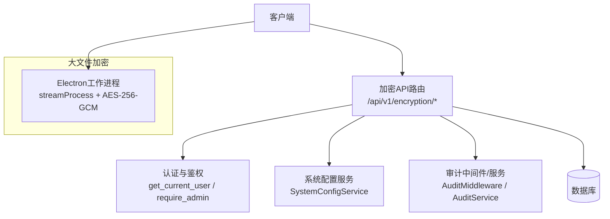
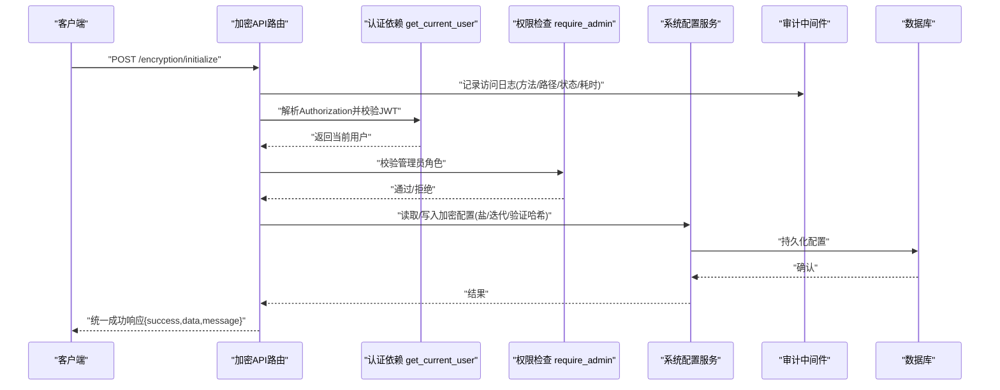
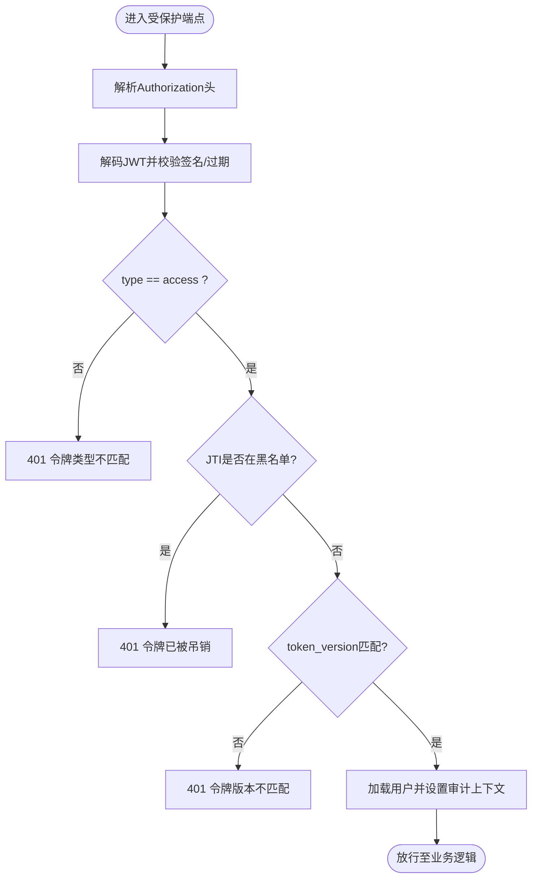
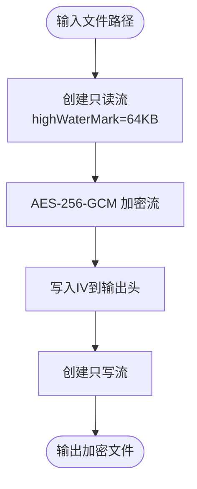
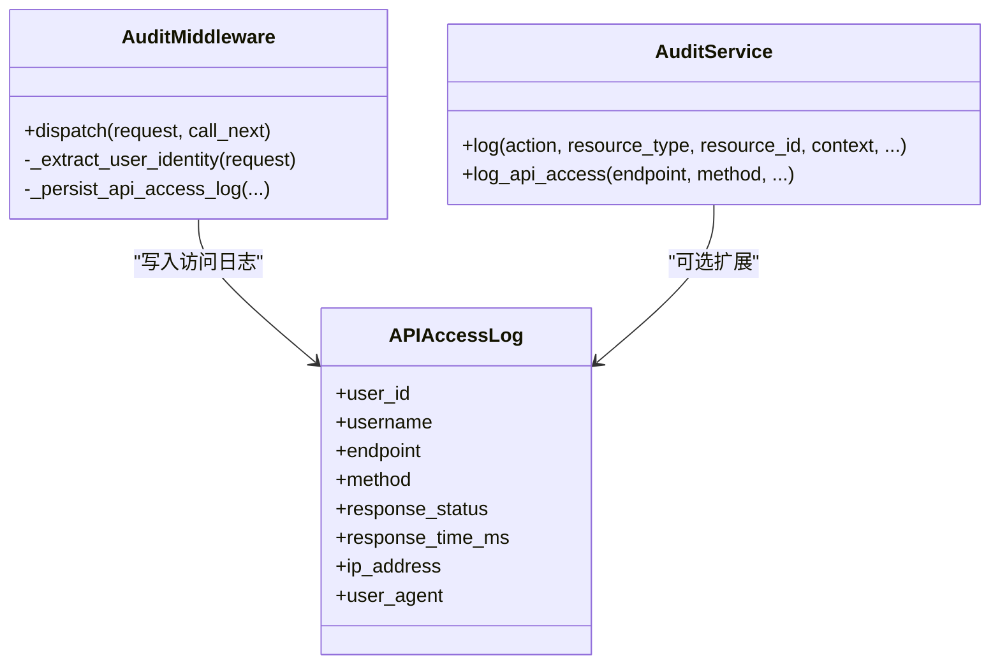
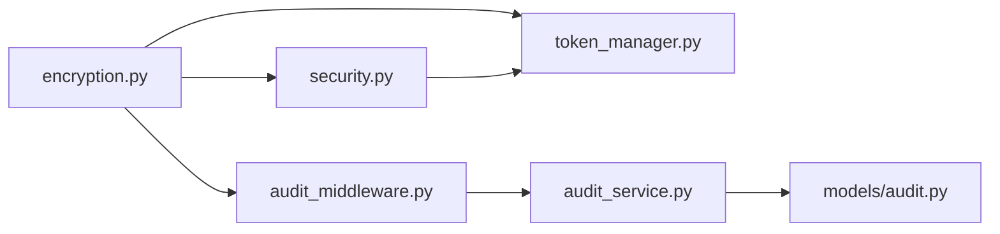

# 加密服务API

<cite>
**本文引用的文件**
- [backend/app/api/v1/encryption.py](file://backend/app/api/v1/encryption.py)
- [backend/app/core/security.py](file://backend/app/core/security.py)
- [backend/app/core/token_manager.py](file://backend/app/core/token_manager.py)
- [backend/app/core/audit_middleware.py](file://backend/app/core/audit_middleware.py)
- [backend/app/services/audit_service.py](file://backend/app/services/audit_service.py)
- [backend/app/models/audit.py](file://backend/app/models/audit.py)
- [backend/app/utils/encryption.py](file://backend/app/utils/encryption.py)
- [electron/worker-tasks.js](file://electron/worker-tasks.js)
</cite>

## 目录
1. [简介](#简介)
2. [项目结构](#项目结构)
3. [核心组件](#核心组件)
4. [架构总览](#架构总览)
5. [详细组件分析](#详细组件分析)
6. [依赖关系分析](#依赖关系分析)
7. [性能考虑](#性能考虑)
8. [故障排查指南](#故障排查指南)
9. [结论](#结论)
10. [附录](#附录)

## 简介
本接口文档面向“加密服务”的RESTful API，覆盖数据库加密管理（初始化、修改密码、状态查询、禁用）以及大文件流式加密能力。文档包含：
- 每个端点的请求参数、响应格式、状态码与错误处理
- JWT令牌认证在加密操作中的使用方式
- 批量与大文件处理的实现细节与最佳实践
- 审计日志记录与监控指标收集说明
- 调用示例、错误模式与性能优化建议

## 项目结构
加密相关能力由以下模块协作完成：
- API层：FastAPI路由定义与入参校验
- 安全层：JWT签发/校验、权限控制、敏感信息脱敏
- 配置与密钥：系统配置持久化（盐值、迭代次数、验证哈希）
- 审计与监控：请求访问日志、操作审计、指标采集
- 大文件处理：Electron侧流式加密任务（AES-256-GCM）

图表来源
- [backend/app/api/v1/encryption.py:21-196](file://backend/app/api/v1/encryption.py#L21-L196)
- [backend/app/core/security.py:243-371](file://backend/app/core/security.py#L243-L371)
- [backend/app/core/audit_middleware.py:11-44](file://backend/app/core/audit_middleware.py#L11-L44)
- [electron/worker-tasks.js:39-70](file://electron/worker-tasks.js#L39-L70)

章节来源
- [backend/app/api/v1/encryption.py:21-196](file://backend/app/api/v1/encryption.py#L21-L196)
- [backend/app/core/security.py:243-371](file://backend/app/core/security.py#L243-L371)
- [backend/app/core/audit_middleware.py:11-44](file://backend/app/core/audit_middleware.py#L11-L44)
- [electron/worker-tasks.js:39-70](file://electron/worker-tasks.js#L39-L70)

## 核心组件
- 加密管理API路由：提供初始化、改密、状态查询、禁用等能力
- 认证与鉴权：基于JWT Bearer Token，强制管理员权限用于敏感操作
- 系统配置服务：持久化加密盐值、迭代次数、验证哈希等关键参数
- 审计与监控：记录API访问、操作审计、耗时与状态码
- 大文件流式加密：基于AES-256-GCM的分块读写，避免内存溢出

章节来源
- [backend/app/api/v1/encryption.py:30-196](file://backend/app/api/v1/encryption.py#L30-L196)
- [backend/app/core/security.py:243-371](file://backend/app/core/security.py#L243-L371)
- [backend/app/core/audit_middleware.py:11-44](file://backend/app/core/audit_middleware.py#L11-L44)
- [electron/worker-tasks.js:39-70](file://electron/worker-tasks.js#L39-L70)

## 架构总览
下图展示了从客户端到后端各层的交互流程，包括认证、权限校验、业务处理、审计落库与数据库操作。

图表来源
- [backend/app/api/v1/encryption.py:67-108](file://backend/app/api/v1/encryption.py#L67-L108)
- [backend/app/core/security.py:243-371](file://backend/app/core/security.py#L243-L371)
- [backend/app/core/audit_middleware.py:18-44](file://backend/app/core/audit_middleware.py#L18-L44)

## 详细组件分析

### 加密管理API（/encryption）
- 基础信息
  - 前缀：/api/v1/encryption
  - 鉴权：需要有效的JWT Bearer Token；涉及管理的端点需管理员角色
  - 统一响应：success_response(data, message)

- 端点清单
  - POST /encryption/initialize
    - 功能：初始化数据库加密（生成盐值、迭代次数、验证哈希）
    - 请求体：password, confirm_password
    - 校验：两次密码一致；密码长度不少于6位；未初始化才可执行
    - 成功响应：{ success: true, message: "..." }
    - 失败：
      - 400 密码不一致/长度不足/已初始化
      - 401 未认证
      - 403 非管理员
  - POST /encryption/change-password
    - 功能：修改加密密码（验证旧密码后更新派生参数）
    - 请求体：old_password, new_password, confirm_password
    - 校验：新密码一致性、长度；旧密码正确性
    - 成功响应：{ success: true, message: "..." }
    - 失败：同上
  - GET /encryption/status
    - 功能：获取加密状态
    - 响应数据：is_enabled, has_salt, iterations
    - 成功响应：{ success: true, data: {...} }
    - 失败：401 未认证
  - POST /encryption/disable
    - 功能：禁用数据库加密（清除配置）
    - 请求体：password
    - 校验：旧密码正确性
    - 成功响应：{ success: true, message: "..." }
    - 失败：同上

- 错误处理模式
  - 400：参数校验失败或密码不正确
  - 401：未提供或无效/过期的JWT
  - 403：非管理员尝试管理操作
  - 5xx：内部异常（如日志写入失败不影响主流程）

- 审计与日志
  - 每次请求经审计中间件记录：方法、路径、状态码、耗时、用户标识
  - 管理操作写入工作日志（如初始化、改密、禁用），失败仅记录调试日志

章节来源
- [backend/app/api/v1/encryption.py:30-196](file://backend/app/api/v1/encryption.py#L30-L196)
- [backend/app/core/security.py:243-371](file://backend/app/core/security.py#L243-L371)
- [backend/app/core/audit_middleware.py:18-44](file://backend/app/core/audit_middleware.py#L18-L44)

### JWT令牌认证与权限
- 认证流程
  - 客户端在请求头携带 Authorization: Bearer <token>
  - get_current_user 解析并解码JWT，校验类型（access）、黑名单、版本（token_version）
  - 根据用户名查询用户并设置审计上下文
- 权限控制
  - require_admin 确保调用者具备管理员角色或超级管理员
- 令牌刷新与吊销
  - refresh_access_token 使用refresh token轮换并吊销旧refresh
  - revoke_token 将JTI加入黑名单并持久化，支持重启后仍有效

图表来源
- [backend/app/core/security.py:243-371](file://backend/app/core/security.py#L243-L371)
- [backend/app/core/token_manager.py:135-210](file://backend/app/core/token_manager.py#L135-L210)

章节来源
- [backend/app/core/security.py:243-371](file://backend/app/core/security.py#L243-L371)
- [backend/app/core/token_manager.py:64-210](file://backend/app/core/token_manager.py#L64-L210)

### 大文件流式加密（AES-256-GCM）
- 目标：对大文件进行加密，避免一次性读入内存导致OOM
- 实现要点
  - 分块读取与写入，使用高水位标记控制缓冲大小
  - 随机IV与GCM认证标签写入输出文件头部
  - 密码通过scrypt派生为32字节密钥
- 适用场景：批量导出、离线归档、跨设备传输

图表来源
- [electron/worker-tasks.js:39-70](file://electron/worker-tasks.js#L39-L70)

章节来源
- [electron/worker-tasks.js:39-70](file://electron/worker-tasks.js#L39-L70)

### 审计日志与监控指标
- 访问日志
  - 审计中间件记录每次HTTP请求的方法、路径、状态码、耗时、用户标识
  - 独立短事务落库，失败仅记录警告，不影响业务
- 操作审计
  - 加密管理操作（初始化、改密、禁用）写入工作日志，便于追溯
- 指标收集
  - 可通过中间件记录的response_time_ms与status_code聚合QPS、P95/P99延迟、错误率

图表来源
- [backend/app/core/audit_middleware.py:11-109](file://backend/app/core/audit_middleware.py#L11-L109)
- [backend/app/services/audit_service.py:62-229](file://backend/app/services/audit_service.py#L62-L229)
- [backend/app/models/audit.py:65-101](file://backend/app/models/audit.py#L65-L101)

章节来源
- [backend/app/core/audit_middleware.py:11-109](file://backend/app/core/audit_middleware.py#L11-L109)
- [backend/app/services/audit_service.py:62-229](file://backend/app/services/audit_service.py#L62-L229)
- [backend/app/models/audit.py:65-101](file://backend/app/models/audit.py#L65-L101)

## 依赖关系分析
- 路由依赖
  - encryption.py 依赖 security.get_current_user、security.require_admin、system_config_service、work_log_service
- 认证依赖
  - security.get_current_user 依赖 jwt.decode、token_blacklist.is_blacklisted、User模型
- 令牌管理
  - token_manager.create_token_pair/revoke_token/refresh_access_token 依赖jwt、settings、blacklist
- 审计
  - audit_middleware 依赖 jwt.decode（仅用于提取用户身份，不校验过期）
  - audit_service 与 models.audit 配合持久化审计记录

图表来源
- [backend/app/api/v1/encryption.py:10-18](file://backend/app/api/v1/encryption.py#L10-L18)
- [backend/app/core/security.py:243-371](file://backend/app/core/security.py#L243-L371)
- [backend/app/core/token_manager.py:64-210](file://backend/app/core/token_manager.py#L64-L210)
- [backend/app/core/audit_middleware.py:11-109](file://backend/app/core/audit_middleware.py#L11-L109)
- [backend/app/services/audit_service.py:62-229](file://backend/app/services/audit_service.py#L62-L229)
- [backend/app/models/audit.py:65-101](file://backend/app/models/audit.py#L65-L101)

章节来源
- [backend/app/api/v1/encryption.py:10-18](file://backend/app/api/v1/encryption.py#L10-L18)
- [backend/app/core/security.py:243-371](file://backend/app/core/security.py#L243-L371)
- [backend/app/core/token_manager.py:64-210](file://backend/app/core/token_manager.py#L64-L210)
- [backend/app/core/audit_middleware.py:11-109](file://backend/app/core/audit_middleware.py#L11-L109)
- [backend/app/services/audit_service.py:62-229](file://backend/app/services/audit_service.py#L62-L229)
- [backend/app/models/audit.py:65-101](file://backend/app/models/audit.py#L65-L101)

## 性能考虑
- 认证开销
  - JWT解码与黑名单检查为O(1)，注意在高并发下缓存黑名单查询结果
  - 使用合理的ACCESS_TOKEN_EXPIRE_MINUTES与REFRESH_TOKEN_EXPIRE_DAYS平衡安全与性能
- 数据库写入
  - 审计日志使用独立短事务，避免阻塞主请求
  - 加密配置变更采用批量set与safe_commit减少往返
- 大文件加密
  - 合理设置highWaterMark（默认64KB）以平衡吞吐与内存占用
  - 优先使用硬件加速（AES-NI）提升GCM吞吐
- 监控指标
  - 利用response_time_ms统计P95/P99延迟与错误率，结合状态码定位瓶颈

## 故障排查指南
- 401 未认证/令牌无效
  - 检查Authorization头是否携带Bearer Token
  - 确认Token未过期且未被吊销
  - 核对算法与密钥配置一致
- 403 非管理员
  - 确认当前用户角色为admin或super_admin
- 400 参数校验失败
  - 初始化/改密时确保两次密码一致且长度满足要求
  - 禁用时需传入正确的旧密码
- 审计日志缺失
  - 检查审计中间件是否启用
  - 查看数据库连接与权限，确认api_access_logs表可写
- 大文件加密失败
  - 检查输入/输出路径权限
  - 确认密码强度与salt配置正确
  - 观察内存与磁盘IO，调整highWaterMark

章节来源
- [backend/app/core/security.py:243-371](file://backend/app/core/security.py#L243-L371)
- [backend/app/core/audit_middleware.py:11-109](file://backend/app/core/audit_middleware.py#L11-L109)
- [electron/worker-tasks.js:39-70](file://electron/worker-tasks.js#L39-L70)

## 结论
本加密服务API提供了完整的数据库加密管理能力与可靠的大文件流式加密方案。通过JWT强认证与管理员权限控制，保障敏感操作的安全性；借助审计中间件与服务，实现全链路可观测与可追溯。建议在部署中启用硬件加速、合理配置令牌有效期与批处理大小，并结合监控指标持续优化性能与稳定性。

## 附录

### API端点速查表
- POST /encryption/initialize
  - 鉴权：管理员
  - 请求体：password, confirm_password
  - 成功：200 { success: true, message: "..." }
  - 失败：400/401/403
- POST /encryption/change-password
  - 鉴权：管理员
  - 请求体：old_password, new_password, confirm_password
  - 成功：200 { success: true, message: "..." }
  - 失败：400/401/403
- GET /encryption/status
  - 鉴权：登录用户
  - 成功：200 { success: true, data: { is_enabled, has_salt, iterations } }
  - 失败：401
- POST /encryption/disable
  - 鉴权：管理员
  - 请求体：password
  - 成功：200 { success: true, message: "..." }
  - 失败：400/401/403

### 调用示例（概念性）
- 初始化加密
  - 请求：POST /api/v1/encryption/initialize
  - 头：Authorization: Bearer <access_token>
  - 体：{ password: "...", confirm_password: "..." }
  - 预期：200 { success: true, message: "数据库加密已启用" }
- 修改密码
  - 请求：POST /api/v1/encryption/change-password
  - 头：Authorization: Bearer <access_token>
  - 体：{ old_password: "...", new_password: "...", confirm_password: "..." }
  - 预期：200 { success: true, message: "加密密码已更新" }
- 查询状态
  - 请求：GET /api/v1/encryption/status
  - 头：Authorization: Bearer <access_token>
  - 预期：200 { success: true, data: { is_enabled: true, has_salt: true, iterations: 100000 } }
- 禁用加密
  - 请求：POST /api/v1/encryption/disable
  - 头：Authorization: Bearer <access_token>
  - 体：{ password: "..." }
  - 预期：200 { success: true, message: "数据库加密已禁用" }

### 错误处理模式
- 参数校验失败：400，detail包含具体原因（如“两次输入的密码不一致”“密码长度不能少于6位”）
- 认证失败：401，detail提示“未提供认证凭证”“无效或过期的令牌”“令牌已被吊销”
- 权限不足：403，detail提示“需要管理员权限”
- 内部异常：5xx，审计日志记录堆栈，业务返回统一成功/失败包装

### 性能优化建议
- 令牌策略：缩短access token有效期，使用refresh token轮换降低重放风险
- 黑名单缓存：对高频校验的JTI进行本地缓存，减少DB压力
- 大文件加密：按设备能力调整highWaterMark，启用AES-NI，避免同步阻塞
- 审计落库：异步化或批量写入，降低对主请求的影响