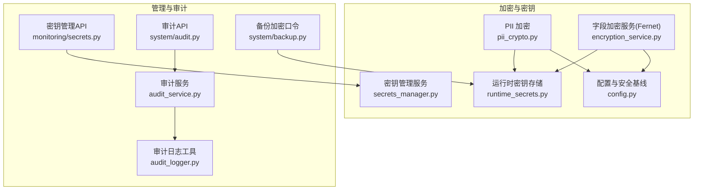
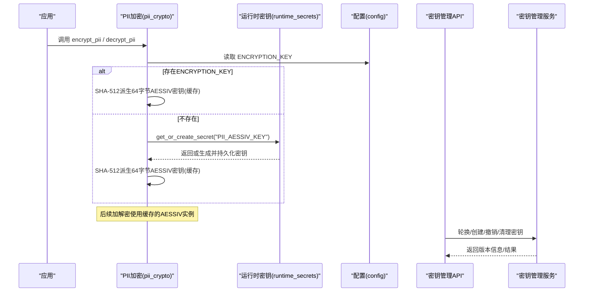
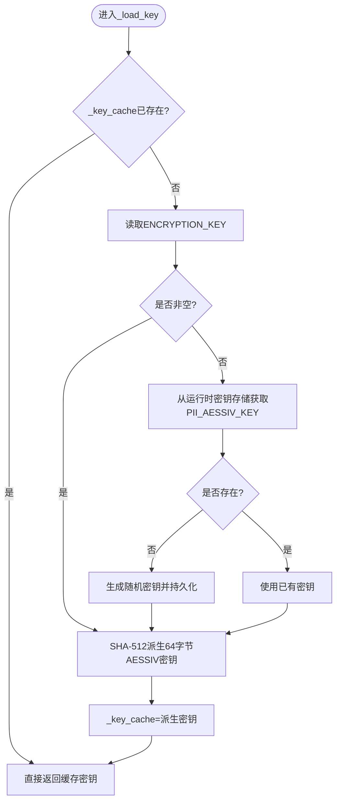
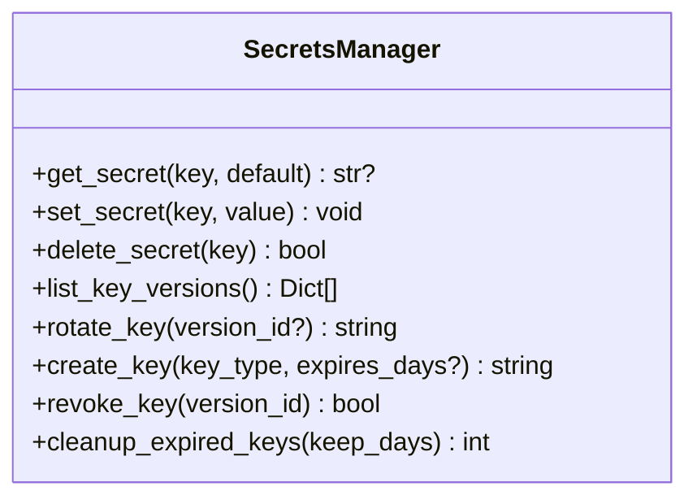
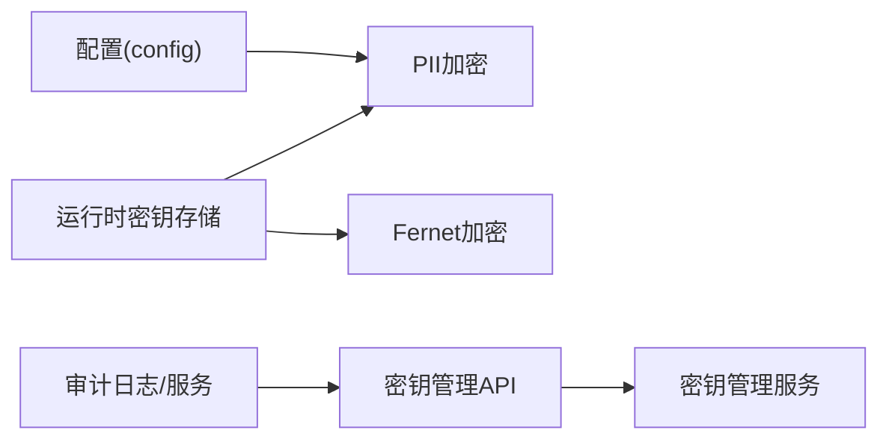

# 密钥管理机制

<cite>
**本文引用的文件**
- [backend/app/core/pii_crypto.py](file://backend/app/core/pii_crypto.py)
- [backend/app/utils/runtime_secrets.py](file://backend/app/utils/runtime_secrets.py)
- [backend/app/services/secrets_manager.py](file://backend/app/services/secrets_manager.py)
- [backend/app/api/v1/monitoring/secrets.py](file://backend/app/api/v1/monitoring/secrets.py)
- [backend/app/services/encryption_service.py](file://backend/app/services/encryption_service.py)
- [backend/app/core/config.py](file://backend/app/core/config.py)
- [backend/app/utils/audit_logger.py](file://backend/app/utils/audit_logger.py)
- [backend/app/services/audit_service.py](file://backend/app/services/audit_service.py)
- [backend/app/api/v1/system/audit.py](file://backend/app/api/v1/system/audit.py)
- [backend/app/api/v1/system/backup.py](file://backend/app/api/v1/system/backup.py)
</cite>

## 目录
1. [简介](#简介)
2. [项目结构](#项目结构)
3. [核心组件](#核心组件)
4. [架构总览](#架构总览)
5. [详细组件分析](#详细组件分析)
6. [依赖关系分析](#依赖关系分析)
7. [性能考虑](#性能考虑)
8. [故障排查指南](#故障排查指南)
9. [结论](#结论)
10. [附录](#附录)

## 简介
本文件系统化梳理本项目的密钥管理机制，重点覆盖：
- 多优先级密钥加载策略：显式配置的 ENCRYPTION_KEY 与运行时密钥存储的 PII_AESSIV_KEY。
- SHA-512 派生 64 字节 AESSIV 密钥的过程与安全考量。
- 密钥缓存机制与 reset_key_cache 的使用场景。
- 多机离线同步部署中的密钥配置要求与最佳实践。
- 密钥轮换策略、备份恢复方案与泄露应急流程。
- 监控告警与审计日志的实现要点。

## 项目结构
围绕密钥管理的关键代码分布在以下模块：
- 字段级透明加密（PII）：backend/app/core/pii_crypto.py
- 运行时密钥持久化：backend/app/utils/runtime_secrets.py
- 通用密钥管理服务（版本/轮换/撤销/清理）：backend/app/services/secrets_manager.py
- 密钥管理 API：backend/app/api/v1/monitoring/secrets.py
- 通用字段加密服务（Fernet）：backend/app/services/encryption_service.py
- 配置与安全基线：backend/app/core/config.py
- 审计日志与事件：backend/app/utils/audit_logger.py、backend/app/services/audit_service.py、backend/app/api/v1/system/audit.py
- 备份加密口令：backend/app/api/v1/system/backup.py

**图示来源**
- [backend/app/core/pii_crypto.py:1-94](file://backend/app/core/pii_crypto.py#L1-L94)
- [backend/app/utils/runtime_secrets.py:1-179](file://backend/app/utils/runtime_secrets.py#L1-L179)
- [backend/app/services/secrets_manager.py:1-193](file://backend/app/services/secrets_manager.py#L1-L193)
- [backend/app/api/v1/monitoring/secrets.py:1-112](file://backend/app/api/v1/monitoring/secrets.py#L1-L112)
- [backend/app/services/encryption_service.py:180-261](file://backend/app/services/encryption_service.py#L180-L261)
- [backend/app/core/config.py:80-350](file://backend/app/core/config.py#L80-L350)
- [backend/app/utils/audit_logger.py:1-297](file://backend/app/utils/audit_logger.py#L1-L297)
- [backend/app/services/audit_service.py:1-200](file://backend/app/services/audit_service.py#L1-L200)
- [backend/app/api/v1/system/audit.py:389-432](file://backend/app/api/v1/system/audit.py#L389-L432)
- [backend/app/api/v1/system/backup.py:76-86](file://backend/app/api/v1/system/backup.py#L76-L86)

**章节来源**
- [backend/app/core/pii_crypto.py:1-94](file://backend/app/core/pii_crypto.py#L1-L94)
- [backend/app/utils/runtime_secrets.py:1-179](file://backend/app/utils/runtime_secrets.py#L1-L179)
- [backend/app/services/secrets_manager.py:1-193](file://backend/app/services/secrets_manager.py#L1-L193)
- [backend/app/api/v1/monitoring/secrets.py:1-112](file://backend/app/api/v1/monitoring/secrets.py#L1-L112)
- [backend/app/services/encryption_service.py:180-261](file://backend/app/services/encryption_service.py#L180-L261)
- [backend/app/core/config.py:80-350](file://backend/app/core/config.py#L80-L350)
- [backend/app/utils/audit_logger.py:1-297](file://backend/app/utils/audit_logger.py#L1-L297)
- [backend/app/services/audit_service.py:1-200](file://backend/app/services/audit_service.py#L1-L200)
- [backend/app/api/v1/system/audit.py:389-432](file://backend/app/api/v1/system/audit.py#L389-L432)
- [backend/app/api/v1/system/backup.py:76-86](file://backend/app/api/v1/system/backup.py#L76-L86)

## 核心组件
- PII 字段透明加密（AES-SIV）：提供确定性加密、密文标记前缀、加解密函数与密钥缓存。
- 运行时密钥存储：负责 SECRET_KEY/CSRF_SECRET_KEY 等运行时密钥的生成、持久化与读取；被 PII 和 Fernet 加密服务复用。
- 密钥管理服务：提供密钥版本管理、轮换、撤销、过期清理等能力，并通过 API 暴露。
- 字段加密服务（Fernet）：用于通用字段加密，具备与 PII 相同的密钥优先级策略。
- 配置与安全基线：生产环境强制检查并自动兜底 ENCRYPTION_KEY，避免使用默认测试密钥。
- 审计与监控：记录敏感操作、安全事件，并提供统计查询接口。

**章节来源**
- [backend/app/core/pii_crypto.py:1-94](file://backend/app/core/pii_crypto.py#L1-L94)
- [backend/app/utils/runtime_secrets.py:1-179](file://backend/app/utils/runtime_secrets.py#L1-L179)
- [backend/app/services/secrets_manager.py:1-193](file://backend/app/services/secrets_manager.py#L1-L193)
- [backend/app/services/encryption_service.py:180-261](file://backend/app/services/encryption_service.py#L180-L261)
- [backend/app/core/config.py:80-350](file://backend/app/core/config.py#L80-L350)
- [backend/app/utils/audit_logger.py:1-297](file://backend/app/utils/audit_logger.py#L1-L297)
- [backend/app/services/audit_service.py:1-200](file://backend/app/services/audit_service.py#L1-L200)
- [backend/app/api/v1/system/audit.py:389-432](file://backend/app/api/v1/system/audit.py#L389-L432)

## 架构总览
下图展示了密钥加载优先级、缓存与使用路径，以及 API 对密钥管理的控制面。

**图示来源**
- [backend/app/core/pii_crypto.py:30-63](file://backend/app/core/pii_crypto.py#L30-L63)
- [backend/app/utils/runtime_secrets.py:95-134](file://backend/app/utils/runtime_secrets.py#L95-L134)
- [backend/app/api/v1/monitoring/secrets.py:23-112](file://backend/app/api/v1/monitoring/secrets.py#L23-L112)
- [backend/app/services/secrets_manager.py:25-188](file://backend/app/services/secrets_manager.py#L25-L188)

## 详细组件分析

### PII 字段透明加密（AES-SIV）
- 设计要点
  - 确定性加密（AES-SIV），同一明文恒得同一密文，便于等值查询。
  - 密文标记前缀“enc.v1:”，兼容历史明文行。
  - 密钥来源优先级：
    1) 显式配置的 ENCRYPTION_KEY（经 SHA-512 派生 64 字节 AESSIV 密钥）。
    2) 运行时密钥存储的 PII_AESSIV_KEY（单机自动生成，跨重启保持）。
- 密钥派生与安全
  - 通过 SHA-512 将输入 secret 转换为 64 字节密钥，适配 AESSIV-512。
  - 使用关联数据 b"pii-field" 增强抗篡改能力。
- 缓存与重置
  - 进程内缓存 _key_cache，避免重复派生。
  - reset_key_cache() 用于测试或需要重新加载密钥的场景。

**图示来源**
- [backend/app/core/pii_crypto.py:30-57](file://backend/app/core/pii_crypto.py#L30-L57)
- [backend/app/utils/runtime_secrets.py:95-134](file://backend/app/utils/runtime_secrets.py#L95-L134)

**章节来源**
- [backend/app/core/pii_crypto.py:1-94](file://backend/app/core/pii_crypto.py#L1-L94)

### 运行时密钥存储（runtime_secrets）
- 职责
  - 确保 SECRET_KEY/CSRF_SECRET_KEY 可用，支持自动生成与持久化。
  - 提供 get_or_create_secret(key, generate) 通用接口，供 PII 与 Fernet 加密服务复用。
- 持久化与权限
  - 原子写入 JSON 文件，Unix 下限制文件权限为 0o600。
  - 读取失败时降级为进程内密钥并记录警告。
- 路径解析
  - 优先使用 RUNTIME_SECRETS_FILE 环境变量，否则回退到数据目录下的 runtime_secrets.json。

**章节来源**
- [backend/app/utils/runtime_secrets.py:1-179](file://backend/app/utils/runtime_secrets.py#L1-L179)

### 密钥管理服务（SecretsManager）
- 功能
  - 初始化默认密钥（优先 ENCRYPTION_KEY，否则本地持久化或随机）。
  - 列表、创建、轮换、撤销、清理过期密钥。
- 版本管理
  - 每个版本包含 version_id、created_at、is_active、key_type、可选 expires_at。
- API 暴露
  - 通过 /api/v1/monitoring/secrets 提供管理员操作的端点。

**图示来源**
- [backend/app/services/secrets_manager.py:13-188](file://backend/app/services/secrets_manager.py#L13-L188)
- [backend/app/api/v1/monitoring/secrets.py:23-112](file://backend/app/api/v1/monitoring/secrets.py#L23-L112)

**章节来源**
- [backend/app/services/secrets_manager.py:1-193](file://backend/app/services/secrets_manager.py#L1-L193)
- [backend/app/api/v1/monitoring/secrets.py:1-112](file://backend/app/api/v1/monitoring/secrets.py#L1-L112)

### 字段加密服务（Fernet）
- 密钥优先级
  1) 环境变量/配置文件中的 ENCRYPTION_KEY。
  2) 运行时密钥存储中的持久化密钥（跨重启保持）。
  3) 新生成并持久化的密钥。
- 缓存
  - 进程内缓存 cipher 实例，减少重复构造开销。
- 与 PII 的区别
  - PII 使用 AES-SIV（确定性加密），Fernet 使用非确定性加密（适合一般字段）。

**章节来源**
- [backend/app/services/encryption_service.py:180-261](file://backend/app/services/encryption_service.py#L180-L261)

### 配置与安全基线（config）
- 生产环境强制检查 ENCRYPTION_KEY，若为空则尝试从运行时密钥存储加载或生成持久化密钥，避免使用默认测试密钥。
- 其他安全相关配置包括 DB 加密开关、CSRF、速率限制、日志级别等。

**章节来源**
- [backend/app/core/config.py:80-350](file://backend/app/core/config.py#L80-L350)

### 审计与监控
- 审计日志
  - 同时写入 Python 日志系统与数据库表（audit_logs、login_attempts），保证可追溯性。
  - 提供登录、数据变更、敏感操作等便捷方法。
- 审计 API
  - 提供统计与安全事件查询接口，需管理员权限。
- 监控
  - 密钥状态、轮换需求等指标可通过监控 API 获取。

**章节来源**
- [backend/app/utils/audit_logger.py:1-297](file://backend/app/utils/audit_logger.py#L1-L297)
- [backend/app/services/audit_service.py:1-200](file://backend/app/services/audit_service.py#L1-L200)
- [backend/app/api/v1/system/audit.py:389-432](file://backend/app/api/v1/system/audit.py#L389-L432)

## 依赖关系分析
- PII 加密依赖配置与运行时密钥存储，内部维护进程级密钥缓存。
- Fernet 加密同样依赖配置与运行时密钥存储，具备独立缓存。
- 密钥管理服务通过 API 暴露管理能力，供前端或运维脚本调用。
- 审计系统独立于加密子系统，但会记录密钥相关敏感操作。

**图示来源**
- [backend/app/core/config.py:80-350](file://backend/app/core/config.py#L80-L350)
- [backend/app/core/pii_crypto.py:30-63](file://backend/app/core/pii_crypto.py#L30-L63)
- [backend/app/utils/runtime_secrets.py:95-134](file://backend/app/utils/runtime_secrets.py#L95-L134)
- [backend/app/services/encryption_service.py:180-261](file://backend/app/services/encryption_service.py#L180-L261)
- [backend/app/api/v1/monitoring/secrets.py:23-112](file://backend/app/api/v1/monitoring/secrets.py#L23-L112)
- [backend/app/utils/audit_logger.py:1-297](file://backend/app/utils/audit_logger.py#L1-L297)

**章节来源**
- [backend/app/core/config.py:80-350](file://backend/app/core/config.py#L80-L350)
- [backend/app/core/pii_crypto.py:30-63](file://backend/app/core/pii_crypto.py#L30-L63)
- [backend/app/utils/runtime_secrets.py:95-134](file://backend/app/utils/runtime_secrets.py#L95-L134)
- [backend/app/services/encryption_service.py:180-261](file://backend/app/services/encryption_service.py#L180-L261)
- [backend/app/api/v1/monitoring/secrets.py:23-112](file://backend/app/api/v1/monitoring/secrets.py#L23-L112)
- [backend/app/utils/audit_logger.py:1-297](file://backend/app/utils/audit_logger.py#L1-L297)

## 性能考虑
- 进程内缓存
  - PII 与 Fernet 均缓存密钥/密码器实例，避免重复派生与对象构造。
- I/O 最小化
  - 运行时密钥存储采用原子写入，降低并发写冲突风险。
- 确定性加密优势
  - AES-SIV 支持等值查询，无需额外索引或二次处理。

[本节为通用指导，不直接分析具体文件]

## 故障排查指南
- 启动时报错：既无 ENCRYPTION_KEY 也无法读写运行时密钥存储
  - 现象：PII 加密初始化失败，提示检查文件权限与磁盘空间。
  - 处理：确认 runtime_secrets.json 所在目录可写且磁盘空间充足；或在环境变量中设置 ENCRYPTION_KEY。
- 解密失败：密钥不匹配或数据损坏
  - 现象：解密异常后原样返回密文并记录错误日志。
  - 处理：核对当前运行环境的密钥来源是否与数据加密时一致；必要时执行密钥轮换与数据重加密。
- 生产环境未配置 ENCRYPTION_KEY
  - 现象：配置层自动从运行时密钥存储加载或生成，但可能仅进程内有效。
  - 处理：尽快通过环境变量或 .env 配置 ENCRYPTION_KEY，确保跨重启一致性。
- 备份加密口令丢失
  - 现象：无法解密历史备份。
  - 处理：确保 BACKUP_ENCRYPTION_KEY 由运行时密钥存储统一管理并妥善备份。

**章节来源**
- [backend/app/core/pii_crypto.py:50-57](file://backend/app/core/pii_crypto.py#L50-L57)
- [backend/app/core/pii_crypto.py:78-87](file://backend/app/core/pii_crypto.py#L78-L87)
- [backend/app/core/config.py:311-329](file://backend/app/core/config.py#L311-L329)
- [backend/app/api/v1/system/backup.py:76-86](file://backend/app/api/v1/system/backup.py#L76-L86)

## 结论
本项目实现了分层、可观测、可运维的密钥管理机制：
- 明确的密钥优先级与持久化策略，兼顾开发与生产安全。
- 确定性加密与通用加密并存，满足不同业务场景。
- 完善的密钥生命周期管理与审计追踪，满足合规与可追溯要求。
建议在多机离线同步部署中统一配置 ENCRYPTION_KEY，并结合定期轮换、备份恢复与泄露应急流程，持续提升安全性与可用性。

[本节为总结性内容，不直接分析具体文件]

## 附录

### 多优先级密钥加载策略
- PII 加密
  - 优先级：ENCRYPTION_KEY → PII_AESSIV_KEY（运行时密钥存储）。
  - 派生：SHA-512 输出 64 字节作为 AESSIV 密钥。
- 字段加密（Fernet）
  - 优先级：ENCRYPTION_KEY → ENCRYPTION_FERNET_KEY（运行时密钥存储）。
- 配置层兜底
  - 生产环境若未配置 ENCRYPTION_KEY，自动从运行时密钥存储加载或生成。

**章节来源**
- [backend/app/core/pii_crypto.py:30-57](file://backend/app/core/pii_crypto.py#L30-L57)
- [backend/app/services/encryption_service.py:180-224](file://backend/app/services/encryption_service.py#L180-L224)
- [backend/app/core/config.py:311-329](file://backend/app/core/config.py#L311-L329)

### SHA-512 派生 64 字节 AESSIV 密钥过程与安全考量
- 过程
  - 取 secret（来自 ENCRYPTION_KEY 或 PII_AESSIV_KEY）。
  - 计算 SHA-512，得到 64 字节密钥，用于 AESSIV-512。
- 安全考量
  - 确定性加密暴露等值关系，适用于身份证/电话等无范围查询的字段。
  - 使用关联数据 b"pii-field" 增强抗篡改。
  - 进程内缓存提升性能，但需注意在密钥轮换或测试时重置缓存。

**章节来源**
- [backend/app/core/pii_crypto.py:10-15](file://backend/app/core/pii_crypto.py#L10-L15)
- [backend/app/core/pii_crypto.py:30-63](file://backend/app/core/pii_crypto.py#L30-L63)

### 密钥缓存机制与 reset_key_cache 使用场景
- 缓存位置
  - PII：_key_cache（bytes）。
  - Fernet：_cipher_cache（Fernet 实例）。
- 使用场景
  - 测试：切换不同密钥源后，调用 reset_key_cache() 使新密钥生效。
  - 运维：密钥轮换后，必要时重启服务或触发缓存失效逻辑。

**章节来源**
- [backend/app/core/pii_crypto.py:27-28](file://backend/app/core/pii_crypto.py#L27-L28)
- [backend/app/core/pii_crypto.py:90-93](file://backend/app/core/pii_crypto.py#L90-L93)
- [backend/app/services/encryption_service.py:227-230](file://backend/app/services/encryption_service.py#L227-L230)

### 多机离线同步部署的密钥配置要求与最佳实践
- 要求
  - 所有机器配置相同的 ENCRYPTION_KEY，以确保 PII 密文可跨机互导。
- 最佳实践
  - 通过环境变量或集中配置注入 ENCRYPTION_KEY。
  - 禁止使用默认测试密钥；生产环境必须显式配置。
  - 结合密钥轮换策略，定期更新并保留旧密钥以兼容历史数据。

**章节来源**
- [backend/app/core/pii_crypto.py:10-13](file://backend/app/core/pii_crypto.py#L10-L13)
- [backend/app/core/config.py:311-329](file://backend/app/core/config.py#L311-L329)

### 密钥轮换策略、备份恢复与泄露应急流程
- 轮换策略
  - 通过 API 创建新版本、轮换活跃密钥、撤销旧版本、清理过期密钥。
  - 建议周期性轮换，并保留足够历史版本以兼容待迁移数据。
- 备份恢复
  - 备份加密口令（BACKUP_ENCRYPTION_KEY）由运行时密钥存储统一管理。
  - 恢复时需确保相同密钥可用，否则无法解密备份。
- 泄露应急
  - 立即撤销泄露密钥版本，轮换新密钥。
  - 评估影响范围，必要时对受影响数据进行重加密。
  - 记录审计日志与安全事件，通知相关人员。

**章节来源**
- [backend/app/api/v1/monitoring/secrets.py:35-93](file://backend/app/api/v1/monitoring/secrets.py#L35-L93)
- [backend/app/services/secrets_manager.py:71-188](file://backend/app/services/secrets_manager.py#L71-L188)
- [backend/app/api/v1/system/backup.py:76-86](file://backend/app/api/v1/system/backup.py#L76-L86)

### 监控告警与审计日志实现
- 监控
  - 密钥状态接口返回版本数量、活跃版本、是否需要轮换。
- 审计
  - 审计日志同时写入日志系统与数据库，支持登录、数据变更、敏感操作等。
  - 提供统计与安全事件查询接口，需管理员权限。

**章节来源**
- [backend/app/api/v1/monitoring/secrets.py:96-112](file://backend/app/api/v1/monitoring/secrets.py#L96-L112)
- [backend/app/utils/audit_logger.py:60-185](file://backend/app/utils/audit_logger.py#L60-L185)
- [backend/app/services/audit_service.py:58-200](file://backend/app/services/audit_service.py#L58-L200)
- [backend/app/api/v1/system/audit.py:389-432](file://backend/app/api/v1/system/audit.py#L389-L432)