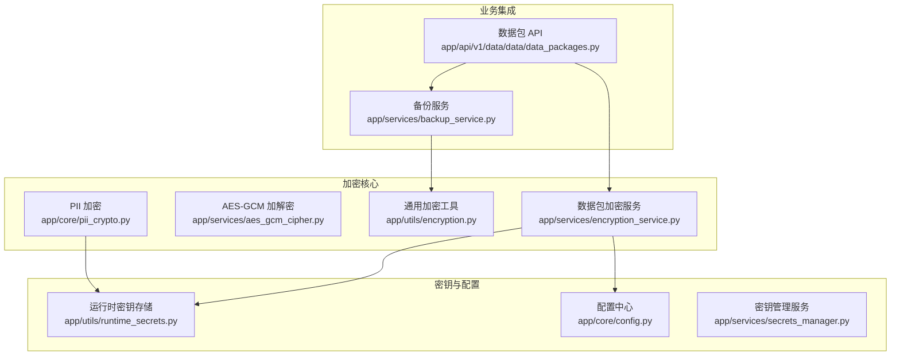
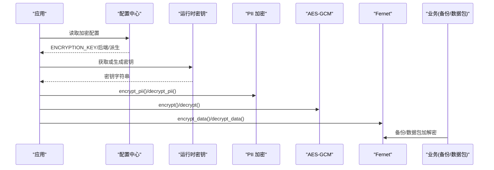
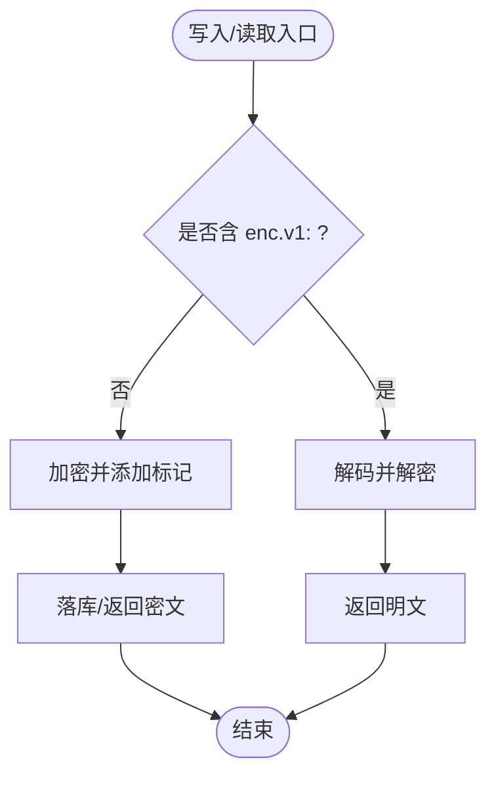
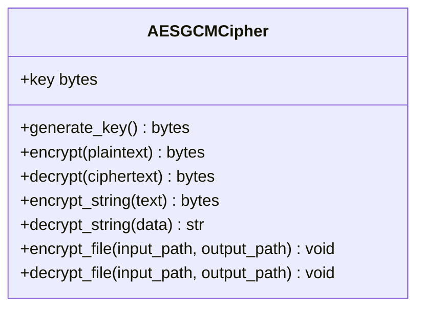
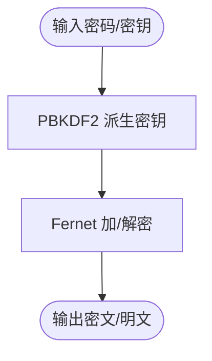
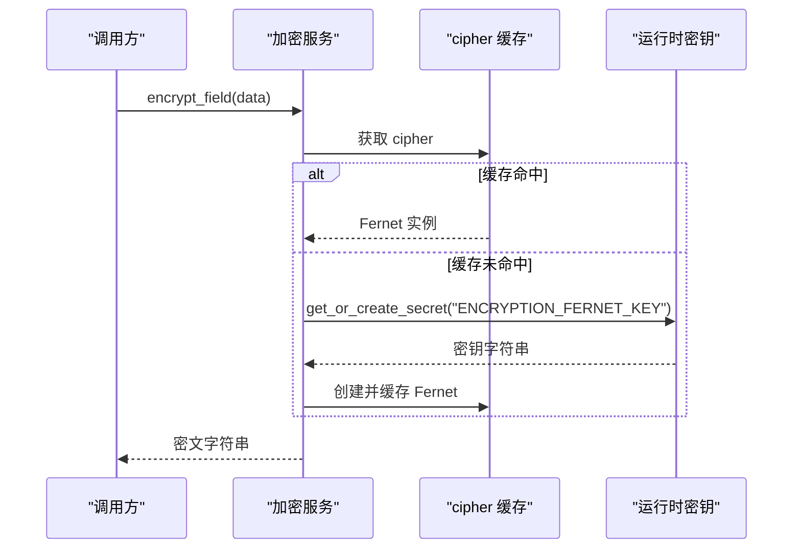
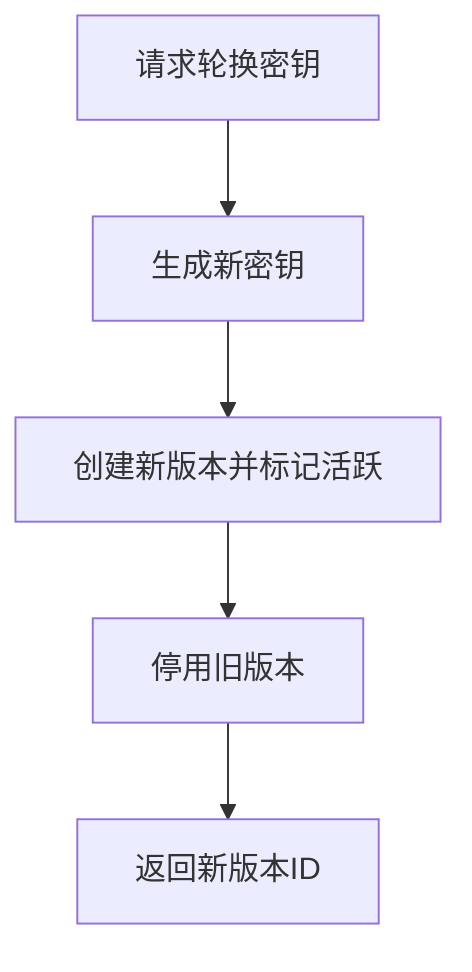
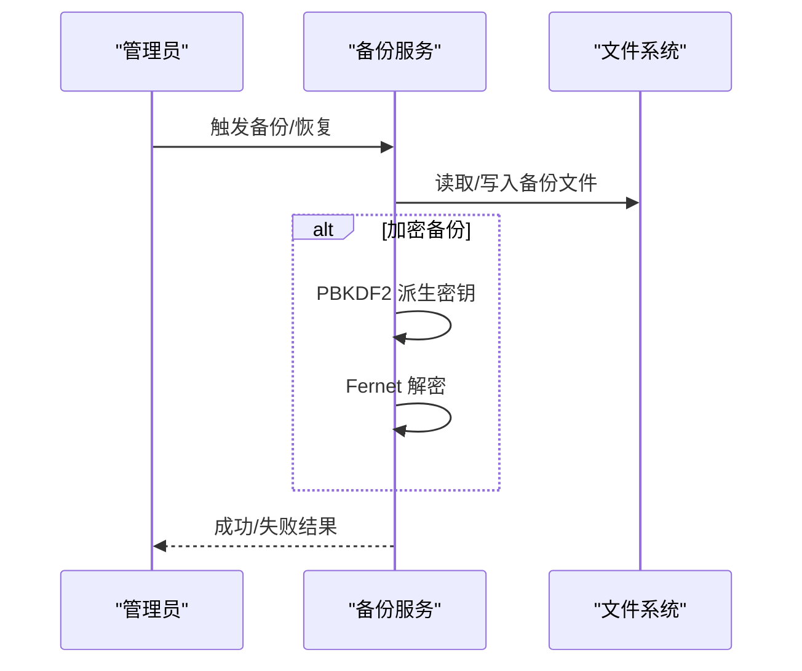
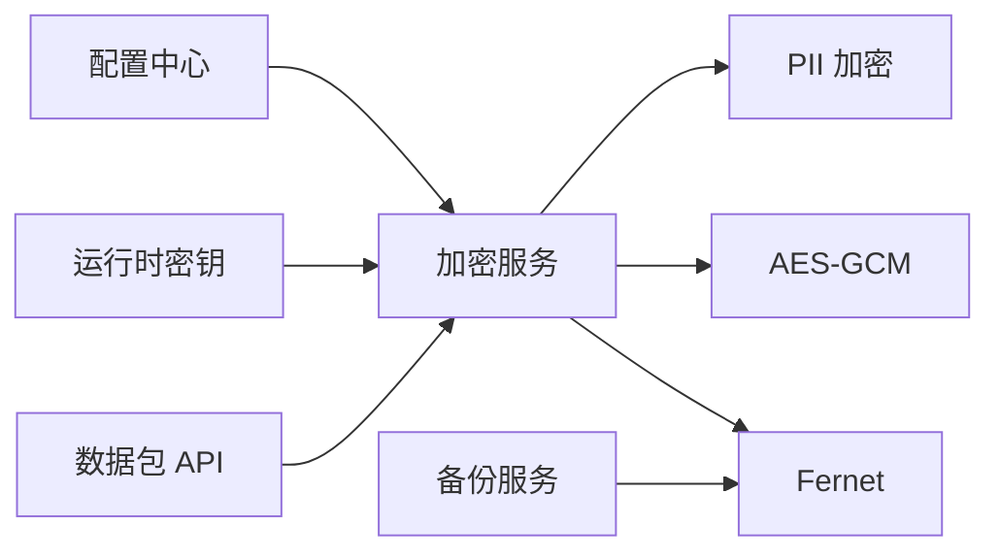
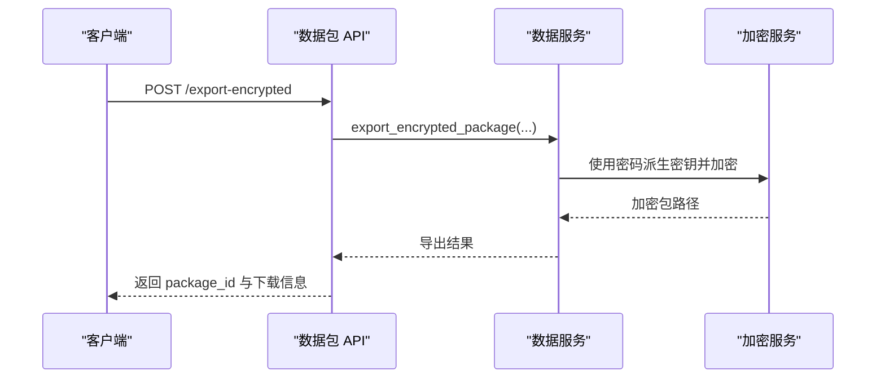

# 数据加密存储

<cite>
**本文引用的文件**
- [backend/app/core/pii_crypto.py](file://backend/app/core/pii_crypto.py)
- [backend/app/services/aes_gcm_cipher.py](file://backend/app/services/aes_gcm_cipher.py)
- [backend/app/services/encryption_service.py](file://backend/app/services/encryption_service.py)
- [backend/app/utils/encryption.py](file://backend/app/utils/encryption.py)
- [backend/app/utils/runtime_secrets.py](file://backend/app/utils/runtime_secrets.py)
- [backend/app/services/secrets_manager.py](file://backend/app/services/secrets_manager.py)
- [backend/app/core/config.py](file://backend/app/core/config.py)
- [backend/app/services/backup_service.py](file://backend/app/services/backup_service.py)
- [backend/alembic/versions/pii_encrypt_001_backfill.py](file://backend/alembic/versions/pii_encrypt_001_backfill.py)
- [backend/app/api/v1/data/data/data_packages.py](file://backend/app/api/v1/data/data/data_packages.py)
- [backend/tests/unit/test_aes_gcm_cipher.py](file://backend/tests/unit/test_aes_gcm_cipher.py)
- [backend/tests/unit/test_pii_encryption.py](file://backend/tests/unit/test_pii_encryption.py)
- [backend/tests/integration/test_encrypted_package_flow.py](file://backend/tests/integration/test_encrypted_package_flow.py)
</cite>

## 目录
1. [简介](#简介)
2. [项目结构](#项目结构)
3. [核心组件](#核心组件)
4. [架构总览](#架构总览)
5. [详细组件分析](#详细组件分析)
6. [依赖关系分析](#依赖关系分析)
7. [性能考虑](#性能考虑)
8. [故障排查指南](#故障排查指南)
9. [结论](#结论)
10. [附录：API与集成示例](#附录api与集成示例)

## 简介
本文件面向生产环境的数据加密存储方案，覆盖敏感信息加密算法选择、AES-GCM 实现、PII 字段级加密策略、密钥管理与轮换、备份恢复、性能优化与最佳实践，并提供加密服务 API 使用示例与自定义加密算法集成方法。系统采用分层加密能力：
- PII 字段透明加密（确定性 AES-SIV）：支持等值查询、零改写 ORM。
- 通用数据加密（AES-256-GCM）：高安全离线加密，随机 nonce，完整性校验。
- 数据包/文件加密（Fernet/AES-128-CBC）：用于导出包、备份文件的对称加密。
- 运行时密钥管理：环境变量优先，持久化到 runtime_secrets.json，支持版本化与轮换。

## 项目结构
围绕加密能力的代码主要分布在以下模块：
- 核心加密库：PII 加密、AES-GCM、通用加密工具
- 密钥与配置：运行时密钥、配置项、密钥管理服务
- 业务集成：备份服务、数据包导出导入 API
- 迁移与测试：存量回填迁移、单元/集成测试

**图表来源**
- [backend/app/core/pii_crypto.py:1-94](file://backend/app/core/pii_crypto.py#L1-L94)
- [backend/app/services/aes_gcm_cipher.py:1-82](file://backend/app/services/aes_gcm_cipher.py#L1-L82)
- [backend/app/utils/encryption.py:1-252](file://backend/app/utils/encryption.py#L1-L252)
- [backend/app/services/encryption_service.py:1-261](file://backend/app/services/encryption_service.py#L1-L261)
- [backend/app/utils/runtime_secrets.py:1-179](file://backend/app/utils/runtime_secrets.py#L1-L179)
- [backend/app/core/config.py:54-94](file://backend/app/core/config.py#L54-L94)
- [backend/app/services/backup_service.py:1-200](file://backend/app/services/backup_service.py#L1-L200)
- [backend/app/api/v1/data/data/data_packages.py:1-200](file://backend/app/api/v1/data/data/data_packages.py#L1-L200)

**章节来源**
- [backend/app/core/pii_crypto.py:1-94](file://backend/app/core/pii_crypto.py#L1-L94)
- [backend/app/services/aes_gcm_cipher.py:1-82](file://backend/app/services/aes_gcm_cipher.py#L1-L82)
- [backend/app/utils/encryption.py:1-252](file://backend/app/utils/encryption.py#L1-L252)
- [backend/app/services/encryption_service.py:1-261](file://backend/app/services/encryption_service.py#L1-L261)
- [backend/app/utils/runtime_secrets.py:1-179](file://backend/app/utils/runtime_secrets.py#L1-L179)
- [backend/app/core/config.py:54-94](file://backend/app/core/config.py#L54-L94)
- [backend/app/services/backup_service.py:1-200](file://backend/app/services/backup_service.py#L1-L200)
- [backend/app/api/v1/data/data/data_packages.py:1-200](file://backend/app/api/v1/data/data/data_packages.py#L1-L200)

## 核心组件
- PII 字段透明加密：基于确定性 AES-SIV，密文带标记前缀，支持等值查询与历史明文兼容。
- AES-256-GCM 加解密：随机 nonce，附带认证标签，防篡改。
- 通用加密工具：PBKDF2 派生密钥 + Fernet 对称加密，适用于文件/数据包。
- 数据包加密服务：提供字段级加解密、全局 cipher 缓存与密钥优先级策略。
- 运行时密钥管理：环境变量优先，缺失时自动持久化到 runtime_secrets.json。
- 密钥管理服务：版本化密钥、轮换、撤销与过期清理。
- 备份服务：增量/全量备份，可选 AES-256 加密与压缩，支持密码派生密钥。

**章节来源**
- [backend/app/core/pii_crypto.py:1-94](file://backend/app/core/pii_crypto.py#L1-L94)
- [backend/app/services/aes_gcm_cipher.py:1-82](file://backend/app/services/aes_gcm_cipher.py#L1-L82)
- [backend/app/utils/encryption.py:1-252](file://backend/app/utils/encryption.py#L1-L252)
- [backend/app/services/encryption_service.py:1-261](file://backend/app/services/encryption_service.py#L1-L261)
- [backend/app/utils/runtime_secrets.py:1-179](file://backend/app/utils/runtime_secrets.py#L1-L179)
- [backend/app/services/secrets_manager.py:1-193](file://backend/app/services/secrets_manager.py#L1-L193)
- [backend/app/services/backup_service.py:1-200](file://backend/app/services/backup_service.py#L1-L200)

## 架构总览
系统以“配置→密钥→加密算法→业务场景”的层次组织：
- 配置层：读取 ENCRYPTION_KEY、后端类型、派生方式等。
- 密钥层：环境变量 → 运行时密钥文件 → 自动生成并持久化。
- 算法层：AES-SIV（PII）、AES-GCM（高安全）、Fernet（包/备份）。
- 业务层：ORM 字段透明加密、数据包导出/导入、备份与恢复。

**图表来源**
- [backend/app/core/config.py:54-94](file://backend/app/core/config.py#L54-L94)
- [backend/app/utils/runtime_secrets.py:95-134](file://backend/app/utils/runtime_secrets.py#L95-L134)
- [backend/app/core/pii_crypto.py:30-87](file://backend/app/core/pii_crypto.py#L30-L87)
- [backend/app/services/aes_gcm_cipher.py:23-67](file://backend/app/services/aes_gcm_cipher.py#L23-L67)
- [backend/app/utils/encryption.py:17-105](file://backend/app/utils/encryption.py#L17-L105)
- [backend/app/services/encryption_service.py:171-261](file://backend/app/services/encryption_service.py#L171-L261)
- [backend/app/services/backup_service.py:141-200](file://backend/app/services/backup_service.py#L141-L200)

## 详细组件分析

### PII 字段透明加密（AES-SIV）
- 设计要点
  - 确定性加密：同一明文恒得同一密文，便于 WHERE 等值查询命中。
  - 密文标记：enc.v1: 前缀标识已加密，兼容历史明文行。
  - 密钥来源：ENCRYPTION_KEY 优先；否则从运行时密钥存储加载 PII_AESSIV_KEY。
  - 关联数据：使用固定关联数据 b"pii-field" 增强安全性。
- 关键流程
  - 写入：明文 → 加密 → 添加标记前缀 → 落库。
  - 读取：检测标记 → 解密 → 返回明文；未标记则原样返回。
  - 迁移：存量回填幂等执行，跳过已加密值。

**图表来源**
- [backend/app/core/pii_crypto.py:66-87](file://backend/app/core/pii_crypto.py#L66-L87)
- [backend/alembic/versions/pii_encrypt_001_backfill.py:41-73](file://backend/alembic/versions/pii_encrypt_001_backfill.py#L41-L73)

**章节来源**
- [backend/app/core/pii_crypto.py:1-94](file://backend/app/core/pii_crypto.py#L1-L94)
- [backend/alembic/versions/pii_encrypt_001_backfill.py:1-74](file://backend/alembic/versions/pii_encrypt_001_backfill.py#L1-L74)
- [backend/tests/unit/test_pii_encryption.py:1-129](file://backend/tests/unit/test_pii_encryption.py#L1-L129)

### AES-256-GCM 高安全加解密
- 设计要点
  - 每次加密使用随机 12 字节 nonce，密文格式为 [nonce][ciphertext+tag]。
  - 解密密文时验证认证标签，失败抛出异常，防止篡改。
  - 支持字符串与文件加解密便捷方法。
- 错误处理
  - 密文过短：直接拒绝。
  - 标签不匹配：提示密钥错误或数据被篡改。

**图表来源**
- [backend/app/services/aes_gcm_cipher.py:13-82](file://backend/app/services/aes_gcm_cipher.py#L13-L82)

**章节来源**
- [backend/app/services/aes_gcm_cipher.py:1-82](file://backend/app/services/aes_gcm_cipher.py#L1-L82)
- [backend/tests/unit/test_aes_gcm_cipher.py:1-114](file://backend/tests/unit/test_aes_gcm_cipher.py#L1-L114)

### 通用加密工具（PBKDF2 + Fernet）
- 设计要点
  - 从密码派生密钥：PBKDF2-HMAC-SHA256，迭代次数≥600,000（OWASP 基线）。
  - 部署唯一盐值：持久化到运行时密钥文件，保证跨重启一致性。
  - 文件/数据加解密：统一通过 Fernet 完成。
- 校验和
  - 支持 sha256/sha1/md5（md5 仅非安全用途），提供计算与验证函数。

**图表来源**
- [backend/app/utils/encryption.py:17-105](file://backend/app/utils/encryption.py#L17-L105)
- [backend/app/utils/encryption.py:181-252](file://backend/app/utils/encryption.py#L181-L252)

**章节来源**
- [backend/app/utils/encryption.py:1-252](file://backend/app/utils/encryption.py#L1-L252)

### 数据包加密服务（字段级加密与密钥缓存）
- 设计要点
  - 密钥优先级：ENCRYPTION_KEY → 运行时密钥存储 → 新生成并持久化。
  - 全局 cipher 缓存：减少重复初始化开销。
  - 字段级加解密：encrypt_field/decrypt_field 便捷接口。
- 错误处理
  - 密钥无效或损坏时抛出明确异常，便于上层捕获与告警。

**图表来源**
- [backend/app/services/encryption_service.py:171-261](file://backend/app/services/encryption_service.py#L171-L261)
- [backend/app/utils/runtime_secrets.py:95-134](file://backend/app/utils/runtime_secrets.py#L95-L134)

**章节来源**
- [backend/app/services/encryption_service.py:1-261](file://backend/app/services/encryption_service.py#L1-L261)
- [backend/app/utils/runtime_secrets.py:1-179](file://backend/app/utils/runtime_secrets.py#L1-L179)

### 密钥管理与轮换
- 运行时密钥存储
  - 确保 SECRET_KEY/CSRF_SECRET_KEY 可用，弱密钥将被忽略并重新生成。
  - get_or_create_secret：按 key 名持久化任意密钥，支持自定义生成器。
- 密钥管理服务
  - 版本化密钥：记录版本 ID、创建时间、是否活跃、类型、过期时间。
  - 轮换与撤销：支持指定版本或当前活跃版本轮换，撤销旧版本。
  - 过期清理：按保留天数清理已撤销且过期的密钥。

**图表来源**
- [backend/app/services/secrets_manager.py:71-108](file://backend/app/services/secrets_manager.py#L71-L108)
- [backend/app/services/secrets_manager.py:159-188](file://backend/app/services/secrets_manager.py#L159-L188)
- [backend/app/utils/runtime_secrets.py:20-93](file://backend/app/utils/runtime_secrets.py#L20-L93)

**章节来源**
- [backend/app/services/secrets_manager.py:1-193](file://backend/app/services/secrets_manager.py#L1-L193)
- [backend/app/utils/runtime_secrets.py:1-179](file://backend/app/utils/runtime_secrets.py#L1-L179)

### 备份与恢复（含加密）
- 功能要点
  - 增量/全量备份，压缩级别可配。
  - 备份文件可选 AES-256（Fernet）加密，密码通过 PBKDF2 派生密钥。
  - 路径解析与校验：避免路径遍历攻击，确保在允许目录内。
- 恢复流程
  - 检测是否加密 → 密码正确性校验 → 解密到临时文件 → 解压/恢复。

**图表来源**
- [backend/app/services/backup_service.py:74-200](file://backend/app/services/backup_service.py#L74-L200)

**章节来源**
- [backend/app/services/backup_service.py:1-200](file://backend/app/services/backup_service.py#L1-L200)

## 依赖关系分析
- 配置依赖：Settings 提供加密后端、密钥派生方式、数据库连接池等。
- 密钥依赖：加密模块依赖运行时密钥存储，确保跨重启一致性与安全性。
- 业务依赖：数据包 API 与备份服务依赖加密服务与工具，形成清晰分层。

**图表来源**
- [backend/app/core/config.py:54-94](file://backend/app/core/config.py#L54-L94)
- [backend/app/services/encryption_service.py:171-261](file://backend/app/services/encryption_service.py#L171-L261)
- [backend/app/core/pii_crypto.py:30-87](file://backend/app/core/pii_crypto.py#L30-L87)
- [backend/app/services/aes_gcm_cipher.py:23-67](file://backend/app/services/aes_gcm_cipher.py#L23-L67)
- [backend/app/utils/encryption.py:17-105](file://backend/app/utils/encryption.py#L17-L105)
- [backend/app/api/v1/data/data/data_packages.py:1-200](file://backend/app/api/v1/data/data/data_packages.py#L1-L200)
- [backend/app/services/backup_service.py:141-200](file://backend/app/services/backup_service.py#L141-L200)

**章节来源**
- [backend/app/core/config.py:54-94](file://backend/app/core/config.py#L54-L94)
- [backend/app/services/encryption_service.py:171-261](file://backend/app/services/encryption_service.py#L171-L261)
- [backend/app/core/pii_crypto.py:30-87](file://backend/app/core/pii_crypto.py#L30-L87)
- [backend/app/services/aes_gcm_cipher.py:23-67](file://backend/app/services/aes_gcm_cipher.py#L23-L67)
- [backend/app/utils/encryption.py:17-105](file://backend/app/utils/encryption.py#L17-L105)
- [backend/app/api/v1/data/data/data_packages.py:1-200](file://backend/app/api/v1/data/data/data_packages.py#L1-L200)
- [backend/app/services/backup_service.py:141-200](file://backend/app/services/backup_service.py#L141-L200)

## 性能考虑
- 确定性加密（AES-SIV）：等值查询无需额外索引或改写，降低查询成本。
- 随机 nonce（AES-GCM）：每次加密不同输出，避免模式泄露，但增加少量 CPU 开销。
- 密钥缓存：Fernet cipher 全局缓存减少初始化开销。
- 备份压缩：可配置压缩级别，平衡空间与 CPU。
- 连接池：SQLite WAL 模式配合合理连接池参数，提升并发读性能。

[本节为通用指导，不直接分析具体文件]

## 故障排查指南
- PII 解密失败
  - 现象：日志记录“密钥不匹配或数据损坏”，返回原值。
  - 排查：确认 ENCRYPTION_KEY 或 PII_AESSIV_KEY 一致；检查密文标记与关联数据。
- AES-GCM 解密异常
  - 现象：密文太短或标签不匹配。
  - 排查：确认密钥长度 32 字节；检查传输过程中是否被篡改。
- 数据包/备份解密失败
  - 现象：密码错误或文件损坏。
  - 排查：确认密码与派生参数一致；校验文件完整性（校验和）。
- 密钥初始化失败
  - 现象：无法加载或创建持久化密钥。
  - 排查：检查 runtime_secrets.json 权限与磁盘空间；确认环境变量设置。

**章节来源**
- [backend/app/core/pii_crypto.py:78-87](file://backend/app/core/pii_crypto.py#L78-L87)
- [backend/app/services/aes_gcm_cipher.py:46-59](file://backend/app/services/aes_gcm_cipher.py#L46-L59)
- [backend/app/services/encryption_service.py:206-224](file://backend/app/services/encryption_service.py#L206-L224)
- [backend/app/services/backup_service.py:173-200](file://backend/app/services/backup_service.py#L173-L200)

## 结论
本方案通过分层加密与严格的密钥管理，实现了敏感数据的字段级保护、高安全离线加密与可靠的备份恢复能力。确定性加密保障查询效率，随机 nonce 与认证标签保障机密性与完整性，运行时密钥存储与版本化管理满足生产环境的合规与运维需求。建议在生产中启用 CSRF、限制访问令牌有效期、定期轮换密钥并监控备份完整性。

[本节为总结，不直接分析具体文件]

## 附录：API与集成示例

### 数据包导出/导入（含加密）
- 一键上报：POST /api/v1/data-packages/one-click-report
  - 作用：自动收集当前用户所属组织的数据类型，打包导出并返回文件流。
- 导出加密包：POST /api/v1/data-packages/export-encrypted
  - 请求体：data_types、password（需满足强度要求）
  - 响应：package_id、file_name、file_size、manifest
- 上传加密包：POST /api/v1/data-packages/upload-encrypted
  - 表单：file（zip/enc）
  - 响应：id、status、is_encrypted
- 解密预览：POST /api/v1/data-packages/decrypt-preview/{package_id}
  - 请求体：password
  - 响应：预览数据

**图表来源**
- [backend/app/api/v1/data/data/data_packages.py:119-200](file://backend/app/api/v1/data/data/data_packages.py#L119-L200)
- [backend/tests/integration/test_encrypted_package_flow.py:102-123](file://backend/tests/integration/test_encrypted_package_flow.py#L102-L123)

**章节来源**
- [backend/app/api/v1/data/data/data_packages.py:1-200](file://backend/app/api/v1/data/data/data_packages.py#L1-L200)
- [backend/tests/integration/test_encrypted_package_flow.py:91-123](file://backend/tests/integration/test_encrypted_package_flow.py#L91-L123)

### 自定义加密算法集成
- 替换 PII 后端：修改 _load_key 与 _aessiv 实现，保持 encrypt_pii/decrypt_pii 接口不变。
- 替换通用后端：在 encryption_service._get_cipher 中切换 Fernet 或其他对称算法。
- 迁移兼容：确保存量数据标记与解密逻辑兼容，必要时提供降级脚本。

**章节来源**
- [backend/app/core/pii_crypto.py:30-63](file://backend/app/core/pii_crypto.py#L30-L63)
- [backend/app/services/encryption_service.py:181-224](file://backend/app/services/encryption_service.py#L181-L224)