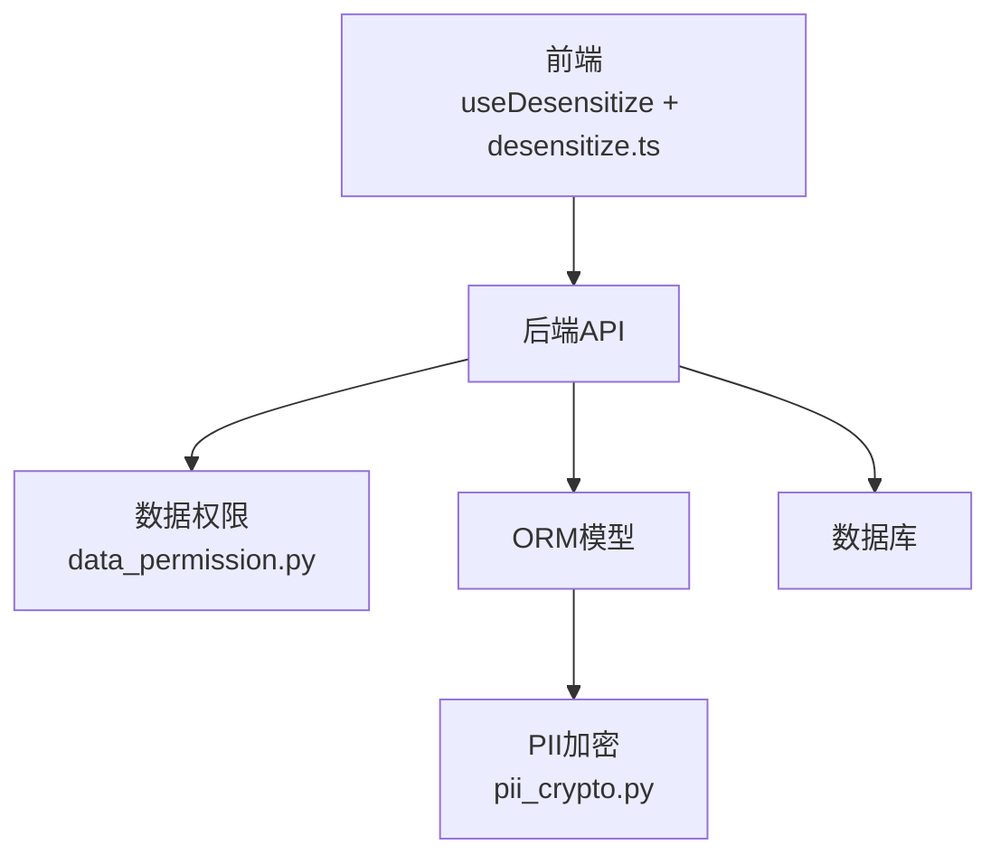
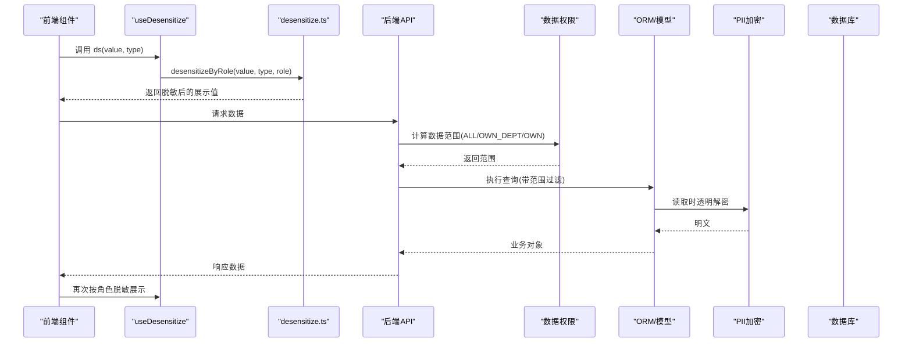
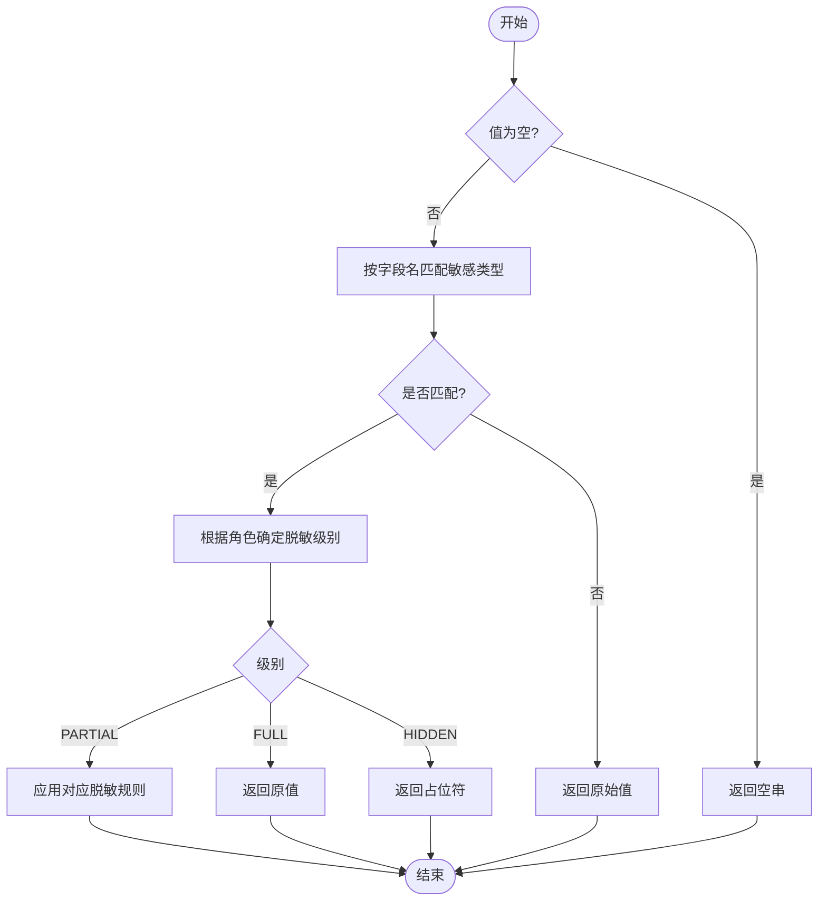
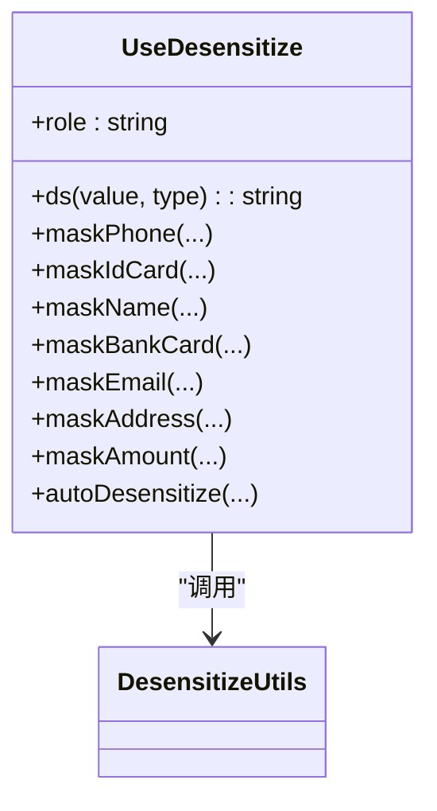
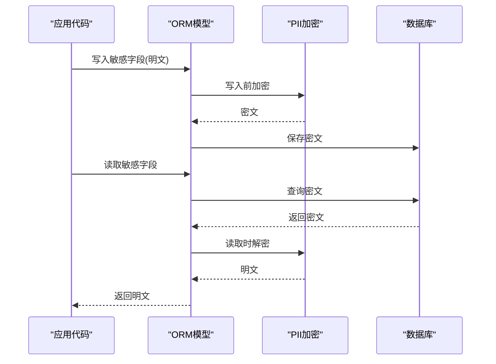
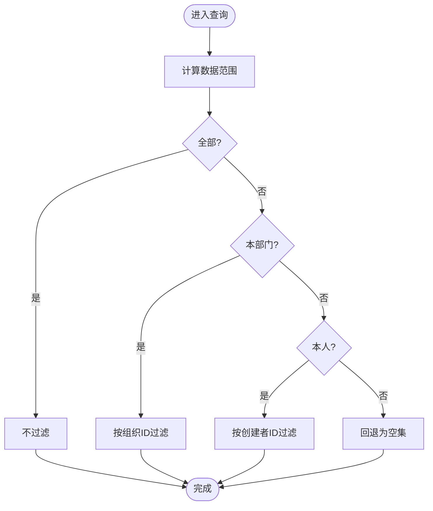
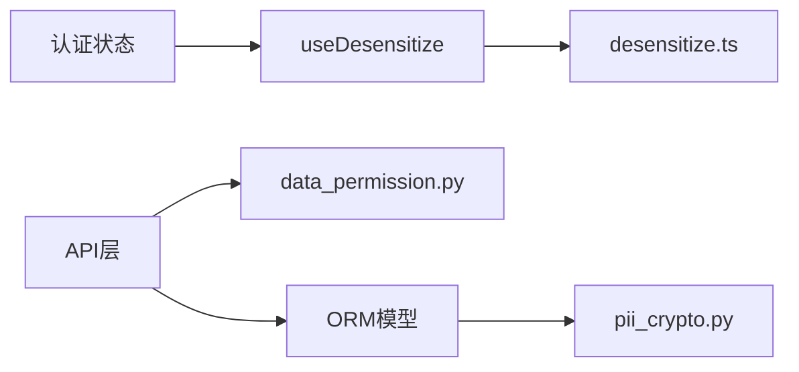

# 数据脱敏处理

<cite>
**本文引用的文件**
- [frontend/src/utils/desensitize.ts](file://frontend/src/utils/desensitize.ts)
- [frontend/src/composables/useDesensitize.ts](file://frontend/src/composables/useDesensitize.ts)
- [frontend/tests/unit/utils/desensitize.test.ts](file://frontend/tests/unit/utils/desensitize.test.ts)
- [frontend/tests/unit/composables/useDesensitize.test.ts](file://frontend/tests/unit/composables/useDesensitize.test.ts)
- [backend/app/core/pii_crypto.py](file://backend/app/core/pii_crypto.py)
- [backend/alembic/versions/pii_encrypt_001_backfill.py](file://backend/alembic/versions/pii_encrypt_001_backfill.py)
- [backend/tests/unit/test_pii_encryption.py](file://backend/tests/unit/test_pii_encryption.py)
- [backend/app/core/data_permission.py](file://backend/app/core/data_permission.py)
</cite>

## 目录
1. [简介](#简介)
2. [项目结构](#项目结构)
3. [核心组件](#核心组件)
4. [架构总览](#架构总览)
5. [详细组件分析](#详细组件分析)
6. [依赖关系分析](#依赖关系分析)
7. [性能考虑](#性能考虑)
8. [故障排查指南](#故障排查指南)
9. [结论](#结论)
10. [附录](#附录)

## 简介
本文件系统性说明本项目中的数据脱敏方案，覆盖前端展示层与后端存储层的职责边界、算法选择、角色可见性控制、配置项与扩展方式，以及测试验证方法。整体目标：在保障数据安全的前提下，提供可配置、可扩展、可观测的脱敏能力，满足多角色用户在不同场景下的信息可见性需求。

## 项目结构
- 前端
  - 工具库：集中实现手机号、身份证、姓名、银行卡、邮箱、地址、金额、军证等脱敏规则，并提供按级别/角色自动脱敏能力。
  - 组合式函数：封装当前用户角色到脱敏策略的映射，便于在 Vue 组件中统一调用。
- 后端
  - PII 透明加密：对敏感字段进行确定性加密（AES-SIV），ORM 读写透明，支持迁移回填与密钥管理。
  - 数据权限：基于角色的数据范围控制（全部/本部门/本人），用于查询侧的数据可见性过滤。

图表来源
- [frontend/src/composables/useDesensitize.ts:1-40](file://frontend/src/composables/useDesensitize.ts#L1-L40)
- [frontend/src/utils/desensitize.ts:1-251](file://frontend/src/utils/desensitize.ts#L1-L251)
- [backend/app/core/data_permission.py:1-187](file://backend/app/core/data_permission.py#L1-L187)
- [backend/app/core/pii_crypto.py:1-93](file://backend/app/core/pii_crypto.py#L1-L93)

章节来源
- [frontend/src/utils/desensitize.ts:1-251](file://frontend/src/utils/desensitize.ts#L1-L251)
- [frontend/src/composables/useDesensitize.ts:1-40](file://frontend/src/composables/useDesensitize.ts#L1-L40)
- [backend/app/core/data_permission.py:1-187](file://backend/app/core/data_permission.py#L1-L187)
- [backend/app/core/pii_crypto.py:1-93](file://backend/app/core/pii_crypto.py#L1-L93)

## 核心组件
- 前端脱敏工具
  - 基础脱敏：手机号、身份证、姓名、银行卡、邮箱、地址、金额、军证编号。
  - 分级脱敏：FULL（完整）、PARTIAL（部分）、HIDDEN（隐藏）。
  - 角色映射：将历史角色归一化后映射为脱敏级别。
  - 自动匹配：根据字段名模式自动识别敏感类型并应用规则。
  - 批量脱敏：对对象内所有字符串/数字字段进行自动脱敏。
- 前端组合式函数 useDesensitize
  - 从认证状态获取当前用户角色，暴露 ds() 便捷方法与各基础脱敏函数。
- 后端 PII 加密
  - 使用确定性 AES-SIV 对敏感字段加密，支持标记前缀识别、密钥派生与缓存、解密失败回退。
  - 迁移脚本对存量数据进行回填加密。
- 后端数据权限
  - 基于角色计算数据范围（全部/本部门/本人），并在查询时应用过滤条件。

章节来源
- [frontend/src/utils/desensitize.ts:1-251](file://frontend/src/utils/desensitize.ts#L1-L251)
- [frontend/src/composables/useDesensitize.ts:1-40](file://frontend/src/composables/useDesensitize.ts#L1-L40)
- [backend/app/core/pii_crypto.py:1-93](file://backend/app/core/pii_crypto.py#L1-L93)
- [backend/app/core/data_permission.py:1-187](file://backend/app/core/data_permission.py#L1-L187)

## 架构总览
前端负责“展示级”脱敏，依据当前用户角色决定显示粒度；后端负责“存储级”安全，通过透明加密保护落库敏感信息，并通过数据权限控制查询可见范围。两者互补：即使前端被绕过，后端仍保证数据不泄露；即使后端返回明文，前端仍可基于角色进行展示级脱敏。

图表来源
- [frontend/src/composables/useDesensitize.ts:1-40](file://frontend/src/composables/useDesensitize.ts#L1-L40)
- [frontend/src/utils/desensitize.ts:1-251](file://frontend/src/utils/desensitize.ts#L1-L251)
- [backend/app/core/data_permission.py:1-187](file://backend/app/core/data_permission.py#L1-L187)
- [backend/app/core/pii_crypto.py:1-93](file://backend/app/core/pii_crypto.py#L1-L93)

## 详细组件分析

### 前端脱敏工具 desensitize.ts
- 设计要点
  - 明确三类脱敏级别：FULL（管理员）、PARTIAL（普通用户）、HIDDEN（查看者）。
  - 角色归一化：将历史角色（如 manager、approval_leader、operator）映射到当前角色体系，确保一致性。
  - 自动匹配：通过字段名正则匹配敏感类型，减少显式声明成本。
  - 批量处理：对对象字段进行遍历与替换，避免遗漏。
- 关键行为
  - 手机号：保留前三位和后四位，中间用星号掩码。
  - 身份证：保留前三位和后四位，中间用星号掩码。
  - 姓名：首尾保留，中间用星号填充；两字姓名仅掩码末位。
  - 银行卡：保留前四后四，中间分段掩码。
  - 邮箱：保留首字符与域名，中间掩码。
  - 地址：保留前三字符，其余掩码。
  - 金额：无权限时隐藏为占位符；有权限时可格式化输出。
  - 军证：保留首尾两位，中间掩码。
- 复杂度
  - 单条记录脱敏时间复杂度 O(n)，n 为字段数量；空间复杂度 O(n) 用于构建结果对象。
- 优化点
  - 批量脱敏仅在必要时执行；对非字符串/数字字段跳过处理。
  - 自动匹配采用预编译正则集合，降低重复开销。

图表来源
- [frontend/src/utils/desensitize.ts:128-225](file://frontend/src/utils/desensitize.ts#L128-L225)

章节来源
- [frontend/src/utils/desensitize.ts:1-251](file://frontend/src/utils/desensitize.ts#L1-L251)
- [frontend/tests/unit/utils/desensitize.test.ts:1-232](file://frontend/tests/unit/utils/desensitize.test.ts#L1-L232)

### 前端组合式函数 useDesensitize
- 作用
  - 从认证状态中读取当前用户角色，默认 viewer。
  - 暴露 ds(value, type) 便捷方法，内部委托 desensitizeByRole。
  - 同时导出各基础脱敏函数与自动脱敏函数，便于灵活使用。
- 使用建议
  - 在模板或计算属性中直接调用 ds()，无需重复判断角色。
  - 对于需要强制脱敏的场景，可直接调用具体 mask* 函数。

图表来源
- [frontend/src/composables/useDesensitize.ts:1-40](file://frontend/src/composables/useDesensitize.ts#L1-L40)
- [frontend/src/utils/desensitize.ts:1-251](file://frontend/src/utils/desensitize.ts#L1-L251)

章节来源
- [frontend/src/composables/useDesensitize.ts:1-40](file://frontend/src/composables/useDesensitize.ts#L1-L40)
- [frontend/tests/unit/composables/useDesensitize.test.ts:1-69](file://frontend/tests/unit/composables/useDesensitize.test.ts#L1-L69)

### 后端 PII 透明加密
- 设计要点
  - 确定性加密（AES-SIV）：同一明文恒得同一密文，支持等值查询零改写。
  - 标记前缀：以特定前缀标识已加密值，兼容历史明文行。
  - 密钥管理：优先使用显式配置密钥，否则从运行时密钥存储加载；密钥哈希缓存提升性能。
  - 容错：解密失败记录日志并原样返回，避免破坏既有流程。
- 迁移回填
  - 扫描指定列，跳过已加密值，对明文逐行加密更新，支持断点重跑。
- 测试验证
  - 端到端验证写入密文、读取明文、确定性、历史明文兼容、异常数据回退。

图表来源
- [backend/app/core/pii_crypto.py:1-93](file://backend/app/core/pii_crypto.py#L1-L93)
- [backend/alembic/versions/pii_encrypt_001_backfill.py:41-73](file://backend/alembic/versions/pii_encrypt_001_backfill.py#L41-L73)
- [backend/tests/unit/test_pii_encryption.py:1-71](file://backend/tests/unit/test_pii_encryption.py#L1-L71)

章节来源
- [backend/app/core/pii_crypto.py:1-93](file://backend/app/core/pii_crypto.py#L1-L93)
- [backend/alembic/versions/pii_encrypt_001_backfill.py:41-73](file://backend/alembic/versions/pii_encrypt_001_backfill.py#L41-L73)
- [backend/tests/unit/test_pii_encryption.py:1-71](file://backend/tests/unit/test_pii_encryption.py#L1-L71)

### 后端数据权限与可见性控制
- 角色到数据范围映射
  - 超级管理员：全部数据。
  - 管理员：本部门数据。
  - 普通用户/查看者：仅本人数据。
- 查询过滤
  - 根据范围动态添加过滤条件，缺失字段时 fail-closed 返回空集，避免越权。
- 记录访问检查
  - 针对单条记录校验是否允许访问，结合创建者与组织归属。

图表来源
- [backend/app/core/data_permission.py:54-134](file://backend/app/core/data_permission.py#L54-L134)

章节来源
- [backend/app/core/data_permission.py:1-187](file://backend/app/core/data_permission.py#L1-L187)

## 依赖关系分析
- 前端
  - useDesensitize 依赖认证状态与 desensitize.ts 工具库。
  - desensitize.ts 内部维护脱敏规则表与字段名匹配模式，解耦具体规则与策略。
- 后端
  - 数据权限模块独立于业务模型，通过通用接口注入查询过滤。
  - PII 加密模块与 ORM 集成，对敏感字段透明加解密，不影响既有查询逻辑。

图表来源
- [frontend/src/composables/useDesensitize.ts:1-40](file://frontend/src/composables/useDesensitize.ts#L1-L40)
- [frontend/src/utils/desensitize.ts:1-251](file://frontend/src/utils/desensitize.ts#L1-L251)
- [backend/app/core/data_permission.py:1-187](file://backend/app/core/data_permission.py#L1-L187)
- [backend/app/core/pii_crypto.py:1-93](file://backend/app/core/pii_crypto.py#L1-L93)

章节来源
- [frontend/src/composables/useDesensitize.ts:1-40](file://frontend/src/composables/useDesensitize.ts#L1-L40)
- [frontend/src/utils/desensitize.ts:1-251](file://frontend/src/utils/desensitize.ts#L1-L251)
- [backend/app/core/data_permission.py:1-187](file://backend/app/core/data_permission.py#L1-L187)
- [backend/app/core/pii_crypto.py:1-93](file://backend/app/core/pii_crypto.py#L1-L93)

## 性能考虑
- 前端
  - 批量脱敏仅在对象渲染时执行，且对非字符串/数字字段跳过处理。
  - 自动匹配使用预定义正则集合，避免重复编译。
  - 建议在列表渲染中使用虚拟滚动或分页，减少单次脱敏规模。
- 后端
  - PII 加密密钥哈希缓存，避免重复派生。
  - 确定性加密支持等值查询，无需额外索引改造。
  - 迁移回填支持断点重跑，避免全量锁表。

[本节为通用指导，不直接分析具体文件]

## 故障排查指南
- 前端
  - 现象：脱敏结果不符合预期。
    - 检查字段名是否匹配敏感模式；确认角色是否正确传入。
    - 参考用例验证不同输入分支（空值、短字符串、非法格式）。
  - 参考路径
    - [frontend/tests/unit/utils/desensitize.test.ts:1-232](file://frontend/tests/unit/utils/desensitize.test.ts#L1-L232)
    - [frontend/tests/unit/composables/useDesensitize.test.ts:1-69](file://frontend/tests/unit/composables/useDesensitize.test.ts#L1-L69)
- 后端
  - 现象：查询未返回数据或返回空集。
    - 检查数据权限范围是否正确；确认模型是否包含 owner/dept 字段。
  - 现象：敏感字段仍为明文或解密失败。
    - 检查是否已执行迁移回填；确认密钥配置与运行时密钥存储可用。
  - 参考路径
    - [backend/app/core/data_permission.py:83-134](file://backend/app/core/data_permission.py#L83-L134)
    - [backend/app/core/pii_crypto.py:66-93](file://backend/app/core/pii_crypto.py#L66-L93)
    - [backend/alembic/versions/pii_encrypt_001_backfill.py:41-73](file://backend/alembic/versions/pii_encrypt_001_backfill.py#L41-L73)
    - [backend/tests/unit/test_pii_encryption.py:1-71](file://backend/tests/unit/test_pii_encryption.py#L1-L71)

章节来源
- [frontend/tests/unit/utils/desensitize.test.ts:1-232](file://frontend/tests/unit/utils/desensitize.test.ts#L1-L232)
- [frontend/tests/unit/composables/useDesensitize.test.ts:1-69](file://frontend/tests/unit/composables/useDesensitize.test.ts#L1-L69)
- [backend/app/core/data_permission.py:83-134](file://backend/app/core/data_permission.py#L83-L134)
- [backend/app/core/pii_crypto.py:66-93](file://backend/app/core/pii_crypto.py#L66-L93)
- [backend/alembic/versions/pii_encrypt_001_backfill.py:41-73](file://backend/alembic/versions/pii_encrypt_001_backfill.py#L41-L73)
- [backend/tests/unit/test_pii_encryption.py:1-71](file://backend/tests/unit/test_pii_encryption.py#L1-L71)

## 结论
本方案通过前后端协同实现数据脱敏与安全：前端基于角色进行展示级脱敏，后端通过透明加密与数据权限控制存储与查询可见性。该设计兼顾安全性、可维护性与性能，具备完善的测试覆盖与迁移能力，适合在多角色、多组织的复杂场景中稳定运行。

[本节为总结，不直接分析具体文件]

## 附录

### 配置选项与自定义规则
- 前端
  - 脱敏级别：FULL/PARTIAL/HIDDEN，可通过角色映射调整。
  - 自动匹配：可在字段名模式中新增正则以支持新字段类型。
  - 批量脱敏：可对任意对象进行脱敏，便于统一处理列表数据。
  - 参考路径
    - [frontend/src/utils/desensitize.ts:152-225](file://frontend/src/utils/desensitize.ts#L152-L225)
- 后端
  - 密钥配置：优先使用显式密钥，否则从运行时密钥存储加载。
  - 迁移回填：按需执行迁移脚本对存量数据加密。
  - 参考路径
    - [backend/app/core/pii_crypto.py:30-64](file://backend/app/core/pii_crypto.py#L30-L64)
    - [backend/alembic/versions/pii_encrypt_001_backfill.py:41-73](file://backend/alembic/versions/pii_encrypt_001_backfill.py#L41-L73)

章节来源
- [frontend/src/utils/desensitize.ts:152-225](file://frontend/src/utils/desensitize.ts#L152-L225)
- [backend/app/core/pii_crypto.py:30-64](file://backend/app/core/pii_crypto.py#L30-L64)
- [backend/alembic/versions/pii_encrypt_001_backfill.py:41-73](file://backend/alembic/versions/pii_encrypt_001_backfill.py#L41-L73)

### 测试验证方法
- 前端
  - 单元测试覆盖各脱敏函数边界分支、角色映射、自动匹配与批量脱敏。
  - 参考路径
    - [frontend/tests/unit/utils/desensitize.test.ts:1-232](file://frontend/tests/unit/utils/desensitize.test.ts#L1-L232)
    - [frontend/tests/unit/composables/useDesensitize.test.ts:1-69](file://frontend/tests/unit/composables/useDesensitize.test.ts#L1-L69)
- 后端
  - 端到端验证写入密文、读取明文、确定性加密、历史明文兼容与异常回退。
  - 参考路径
    - [backend/tests/unit/test_pii_encryption.py:1-71](file://backend/tests/unit/test_pii_encryption.py#L1-L71)

章节来源
- [frontend/tests/unit/utils/desensitize.test.ts:1-232](file://frontend/tests/unit/utils/desensitize.test.ts#L1-L232)
- [frontend/tests/unit/composables/useDesensitize.test.ts:1-69](file://frontend/tests/unit/composables/useDesensitize.test.ts#L1-L69)
- [backend/tests/unit/test_pii_encryption.py:1-71](file://backend/tests/unit/test_pii_encryption.py#L1-L71)

### 国际化支持
- 当前实现未内置多语言文案；如需提示脱敏状态或错误信息，可在前端 i18n 资源中补充键值，并在界面层引用。
- 后端日志与异常消息可按需扩展多语言，但当前实现以英文为主。

[本节为通用指导，不直接分析具体文件]