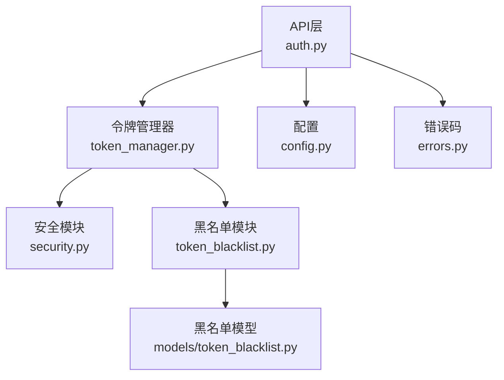
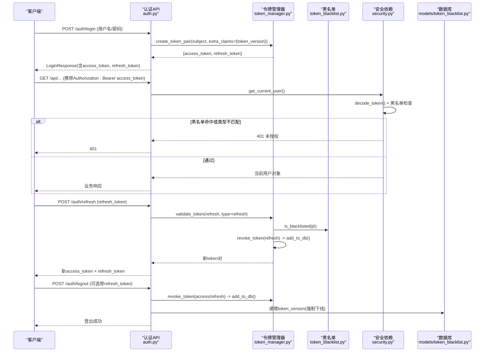
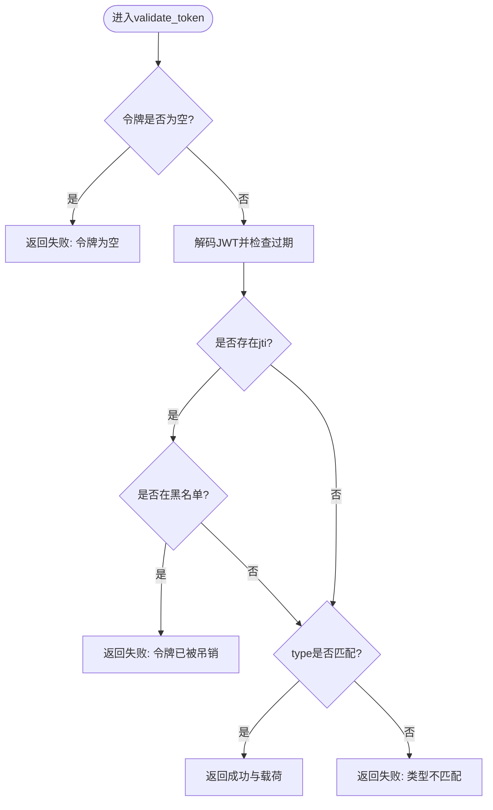
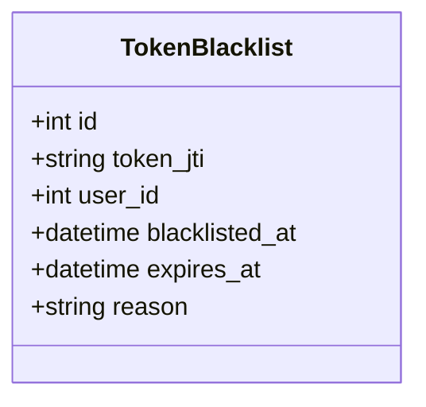
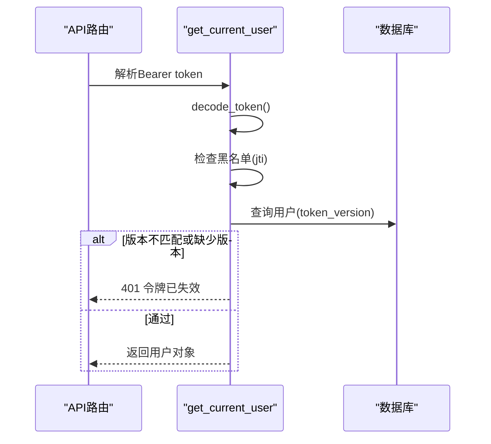
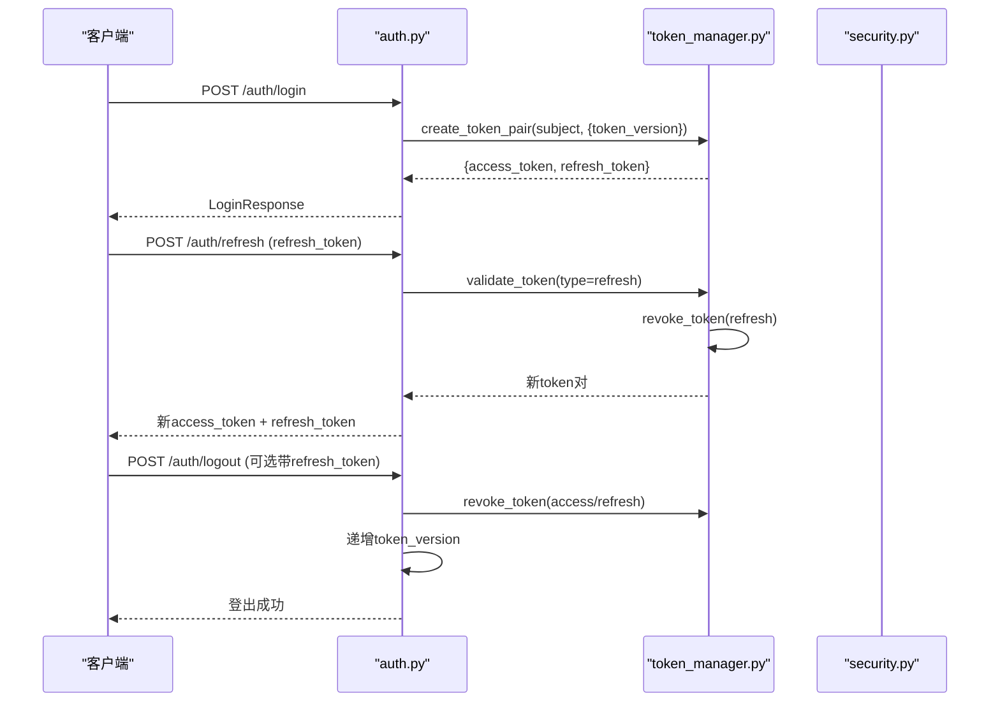
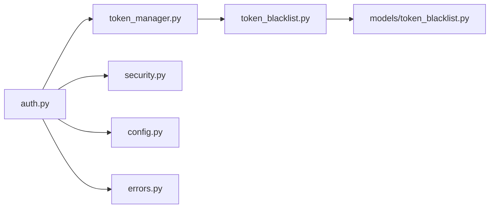

# JWT令牌管理

<cite>
**本文引用的文件**
- [backend/app/core/token_manager.py](file://backend/app/core/token_manager.py)
- [backend/app/core/token_blacklist.py](file://backend/app/core/token_blacklist.py)
- [backend/app/core/security.py](file://backend/app/core/security.py)
- [backend/app/schemas/auth.py](file://backend/app/schemas/auth.py)
- [backend/app/models/token_blacklist.py](file://backend/app/models/token_blacklist.py)
- [backend/app/api/v1/auth/auth.py](file://backend/app/api/v1/auth/auth.py)
- [backend/app/core/config.py](file://backend/app/core/config.py)
- [backend/app/core/errors.py](file://backend/app/core/errors.py)
</cite>

## 目录
1. [简介](#简介)
2. [项目结构](#项目结构)
3. [核心组件](#核心组件)
4. [架构总览](#架构总览)
5. [详细组件分析](#详细组件分析)
6. [依赖关系分析](#依赖关系分析)
7. [性能与可用性](#性能与可用性)
8. [故障排查指南](#故障排查指南)
9. [结论](#结论)
10. [附录：API使用示例与错误处理](#附录api使用示例与错误处理)

## 简介
本文件系统性说明本项目的JWT令牌管理机制，覆盖access token与refresh token的生成、验证、刷新、吊销、黑名单、多会话管理与强制下线等能力；同时解释载荷结构、签名算法与密钥管理、过期策略、错误码与异常处理策略，并提供API调用示例。

## 项目结构
JWT相关能力分布在以下模块：
- 令牌生命周期与校验：token_manager
- 令牌黑名单（内存+数据库）：token_blacklist + models.token_blacklist
- 安全常量、密码与FastAPI认证依赖：security
- 认证API路由：api.v1.auth.auth
- 配置项（有效期、算法、密钥来源）：config
- 统一错误码与消息：errors
- 请求/响应数据模型：schemas.auth

图表来源
- [backend/app/api/v1/auth/auth.py:101-690](file://backend/app/api/v1/auth/auth.py#L101-L690)
- [backend/app/core/token_manager.py:64-240](file://backend/app/core/token_manager.py#L64-L240)
- [backend/app/core/token_blacklist.py:27-114](file://backend/app/core/token_blacklist.py#L27-L114)
- [backend/app/models/token_blacklist.py:13-57](file://backend/app/models/token_blacklist.py#L13-L57)
- [backend/app/core/security.py:210-336](file://backend/app/core/security.py#L210-L336)
- [backend/app/core/config.py:126-130](file://backend/app/core/config.py#L126-L130)
- [backend/app/core/errors.py:10-37](file://backend/app/core/errors.py#L10-L37)

章节来源
- [backend/app/api/v1/auth/auth.py:101-690](file://backend/app/api/v1/auth/auth.py#L101-L690)
- [backend/app/core/token_manager.py:64-240](file://backend/app/core/token_manager.py#L64-L240)
- [backend/app/core/token_blacklist.py:27-114](file://backend/app/core/token_blacklist.py#L27-L114)
- [backend/app/models/token_blacklist.py:13-57](file://backend/app/models/token_blacklist.py#L13-L57)
- [backend/app/core/security.py:210-336](file://backend/app/core/security.py#L210-L336)
- [backend/app/core/config.py:126-130](file://backend/app/core/config.py#L126-L130)
- [backend/app/core/errors.py:10-37](file://backend/app/core/errors.py#L10-L37)

## 核心组件
- 令牌管理器（token_manager）：封装access/refresh token的创建、验证、刷新、吊销，并负责将吊销信息持久化到数据库。
- 黑名单（token_blacklist）：内存集合维护已吊销的JTI，支持按过期时间清理；启动时从数据库加载未过期记录，保证重启后仍有效。
- 安全模块（security）：提供SECRET_KEY、ALGORITHM、ACCESS_TOKEN_EXPIRE_MINUTES、REFRESH_TOKEN_EXPIRE_DAYS等全局配置；提供get_current_user依赖，实现Bearer鉴权、类型校验、黑名单检查、token_version强制下线。
- 认证API（auth.py）：登录、双因素验证、登出、刷新、CSRF获取等端点，串联上述组件完成完整认证流程。
- 黑名单模型（models/token_blacklist.py）：持久化被吊销的JTI、用户ID、原因、过期时间等。
- 配置（config.py）：集中定义令牌有效期、算法、速率限制、CORS等。
- 错误码（errors.py）：统一的错误码枚举与中文消息，便于前端展示与日志定位。

章节来源
- [backend/app/core/token_manager.py:64-240](file://backend/app/core/token_manager.py#L64-L240)
- [backend/app/core/token_blacklist.py:27-114](file://backend/app/core/token_blacklist.py#L27-L114)
- [backend/app/core/security.py:210-336](file://backend/app/core/security.py#L210-L336)
- [backend/app/api/v1/auth/auth.py:101-690](file://backend/app/api/v1/auth/auth.py#L101-L690)
- [backend/app/models/token_blacklist.py:13-57](file://backend/app/models/token_blacklist.py#L13-L57)
- [backend/app/core/config.py:126-130](file://backend/app/core/config.py#L126-L130)
- [backend/app/core/errors.py:10-37](file://backend/app/core/errors.py#L10-L37)

## 架构总览
下图展示了从客户端发起认证到访问受保护资源的完整链路，包括令牌签发、校验、刷新、吊销与强制下线。

图表来源
- [backend/app/api/v1/auth/auth.py:101-690](file://backend/app/api/v1/auth/auth.py#L101-L690)
- [backend/app/core/token_manager.py:64-240](file://backend/app/core/token_manager.py#L64-L240)
- [backend/app/core/token_blacklist.py:27-114](file://backend/app/core/token_blacklist.py#L27-L114)
- [backend/app/core/security.py:243-336](file://backend/app/core/security.py#L243-L336)
- [backend/app/models/token_blacklist.py:13-57](file://backend/app/models/token_blacklist.py#L13-L57)

## 详细组件分析

### 令牌管理器（token_manager）
- 令牌创建
  - create_token_pair：为subject生成access与refresh两个JWT，分别设置exp与type，并写入唯一jti；返回包含access_token、refresh_token、token_type、expires_in的结构。
  - 支持extra_claims扩展（如token_version），用于后续强制下线。
- 令牌验证
  - validate_token：解码JWT，检查是否过期、类型是否匹配、是否在黑名单中；返回布尔与载荷或错误信息。
- 令牌吊销
  - revoke_token：解码（忽略过期）提取jti，加入内存黑名单，并异步持久化到数据库，确保服务重启后仍生效。
- 令牌刷新
  - refresh_access_token：校验refresh类型，吊销旧refresh（轮换防重放），重新签发新的access/refresh对。
- 向后兼容
  - TokenManager类提供create_access_token、decode_token等便捷方法，兼容历史调用。

图表来源
- [backend/app/core/token_manager.py:135-169](file://backend/app/core/token_manager.py#L135-L169)
- [backend/app/core/token_blacklist.py:60-70](file://backend/app/core/token_blacklist.py#L60-L70)

章节来源
- [backend/app/core/token_manager.py:64-240](file://backend/app/core/token_manager.py#L64-L240)

### 黑名单机制（token_blacklist + models）
- 内存存储
  - 以jti为键、过期时间为值的字典，线程安全锁保护并发访问；定期清理过期条目。
- 数据库持久化
  - 启动时从数据库加载未过期的黑名单条目到内存；新增吊销时写入数据库，保证重启后仍有效。
- 模型字段
  - token_jti（唯一索引）、user_id、blacklisted_at、expires_at、reason，以及复合索引优化查询。

图表来源
- [backend/app/models/token_blacklist.py:13-57](file://backend/app/models/token_blacklist.py#L13-L57)

章节来源
- [backend/app/core/token_blacklist.py:27-114](file://backend/app/core/token_blacklist.py#L27-L114)
- [backend/app/models/token_blacklist.py:13-57](file://backend/app/models/token_blacklist.py#L13-L57)

### 安全模块与认证依赖（security）
- 密钥与算法
  - SECRET_KEY优先从配置读取，缺失则回退环境变量或生成临时密钥并记录严重日志；ALGORITHM默认HS256。
- 令牌有效期
  - ACCESS_TOKEN_EXPIRE_MINUTES、REFRESH_TOKEN_EXPIRE_DAYS来自配置，控制access与refresh的生存期。
- 认证依赖
  - get_current_user：从Authorization头提取Bearer token，解码并校验类型、黑名单、token_version；若版本不匹配或无版本声明且用户已启用版本控制，直接拒绝，实现“强制下线所有会话”。
  - require_admin：基于角色或超级管理员标志进行权限校验。
- 其他安全能力
  - 密码哈希、输入清洗、速率限制、安全响应头等。

图表来源
- [backend/app/core/security.py:243-336](file://backend/app/core/security.py#L243-L336)
- [backend/app/core/token_blacklist.py:60-70](file://backend/app/core/token_blacklist.py#L60-L70)

章节来源
- [backend/app/core/security.py:210-336](file://backend/app/core/security.py#L210-L336)
- [backend/app/core/config.py:126-130](file://backend/app/core/config.py#L126-L130)

### 认证API（auth.py）
- 登录
  - 校验用户名/密码、机器码绑定、账户锁定状态、2FA流程；成功后签发access/refresh对，并附带token_version。
- 双因素验证
  - 使用临时令牌与TOTP验证码完成二次验证，通过后吊销临时令牌并签发正式令牌。
- 登出
  - 吊销本次请求的access/refresh，并递增token_version使该用户全部现存JWT立即失效（强制下线）。
- 刷新
  - 仅接受refresh_token，校验后吊销旧refresh（轮换），签发新token对。
- CSRF
  - 提供获取CSRF token接口，配合中间件防护跨站请求伪造。

图表来源
- [backend/app/api/v1/auth/auth.py:101-690](file://backend/app/api/v1/auth/auth.py#L101-L690)
- [backend/app/core/token_manager.py:64-240](file://backend/app/core/token_manager.py#L64-L240)

章节来源
- [backend/app/api/v1/auth/auth.py:101-690](file://backend/app/api/v1/auth/auth.py#L101-L690)

## 依赖关系分析
- 模块耦合
  - auth.py依赖token_manager、security、config、errors，形成清晰的分层：API层→令牌管理→安全与黑名单→数据库。
- 外部依赖
  - PyJWT用于编解码JWT；SQLAlchemy用于数据库操作；FastAPI提供路由与依赖注入。
- 循环导入规避
  - 通过延迟导入避免模块间循环依赖（如token_manager在运行时导入security与database）。

图表来源
- [backend/app/api/v1/auth/auth.py:1-33](file://backend/app/api/v1/auth/auth.py#L1-L33)
- [backend/app/core/token_manager.py:1-57](file://backend/app/core/token_manager.py#L1-L57)
- [backend/app/core/token_blacklist.py:1-26](file://backend/app/core/token_blacklist.py#L1-L26)
- [backend/app/models/token_blacklist.py:1-12](file://backend/app/models/token_blacklist.py#L1-L12)

章节来源
- [backend/app/api/v1/auth/auth.py:1-33](file://backend/app/api/v1/auth/auth.py#L1-L33)
- [backend/app/core/token_manager.py:1-57](file://backend/app/core/token_manager.py#L1-L57)
- [backend/app/core/token_blacklist.py:1-26](file://backend/app/core/token_blacklist.py#L1-L26)
- [backend/app/models/token_blacklist.py:1-12](file://backend/app/models/token_blacklist.py#L1-L12)

## 性能与可用性
- 令牌有效期
  - access token默认较短（例如8小时），refresh token较长（例如30天），平衡安全性与用户体验。
- 黑名单清理
  - 内存黑名单定期清理过期条目，降低内存占用；数据库加载未过期记录，保证重启后一致性。
- 并发安全
  - 黑名单操作使用线程锁保护，防止并发下KeyError或竞态条件。
- 强制下线
  - 通过token_version机制，登出或管理员操作可立即使该用户所有会话失效，无需等待过期。
- 速率限制
  - 登录、注册、刷新等敏感操作实施IP级速率限制，防止暴力破解与滥用。

[本节为通用指导，不直接分析具体文件]

## 故障排查指南
- 常见错误码
  - 1001 用户名或密码错误
  - 1002 令牌已过期
  - 1003 令牌无效
  - 1004 令牌已被吊销
  - 1005 账户已锁定
  - 1006 账户已禁用
  - 1007 密码已过期
  - 1008 密码强度不足
- 典型问题定位
  - 401未授权：检查Authorization头是否正确、token是否过期、是否被加入黑名单、token_version是否匹配。
  - 429请求过于频繁：检查登录/注册/刷新频率是否超过限制。
  - 登出后仍可访问：确认是否调用了登出接口、是否递增了token_version、黑名单是否持久化成功。
- 日志建议
  - 关注安全模块与令牌管理器的警告与错误日志，特别是黑名单写入失败、密钥加载异常、解码失败等。

章节来源
- [backend/app/core/errors.py:10-37](file://backend/app/core/errors.py#L10-L37)
- [backend/app/core/security.py:243-336](file://backend/app/core/security.py#L243-L336)
- [backend/app/core/token_manager.py:176-210](file://backend/app/core/token_manager.py#L176-L210)

## 结论
本项目实现了完整的JWT令牌生命周期管理，涵盖签发、验证、刷新、吊销、黑名单、多会话与强制下线等关键能力。通过token_version与黑名单双重机制，既保证了即时失效的安全性，又兼顾了分布式场景下的可扩展性。结合速率限制与安全中间件，整体方案在生产环境中具备较高的可用性与安全性。

[本节为总结性内容，不直接分析具体文件]

## 附录：API使用示例与错误处理

### 登录
- 请求
  - 路径：POST /api/v1/auth/login
  - 请求体：{username, password}
- 响应
  - 成功：返回access_token、refresh_token、用户信息等
  - 失败：401/403/429（凭据错误、未激活、频率限制）

章节来源
- [backend/app/api/v1/auth/auth.py:101-287](file://backend/app/api/v1/auth/auth.py#L101-L287)
- [backend/app/schemas/auth.py:8-63](file://backend/app/schemas/auth.py#L8-L63)

### 双因素验证
- 请求
  - 路径：POST /api/v1/auth/two-factor/verify-login
  - 请求体：{temp_token, code}
- 响应
  - 成功：返回正式access_token、refresh_token
  - 失败：401（临时令牌无效、验证码错误）

章节来源
- [backend/app/api/v1/auth/auth.py:290-444](file://backend/app/api/v1/auth/auth.py#L290-L444)

### 刷新令牌
- 请求
  - 路径：POST /api/v1/auth/refresh
  - 请求体：{token: refresh_token}
- 行为
  - 校验refresh类型与有效性，吊销旧refresh，签发新token对
- 响应
  - 成功：新access_token、refresh_token
  - 失败：401（无效或过期）

章节来源
- [backend/app/api/v1/auth/auth.py:594-690](file://backend/app/api/v1/auth/auth.py#L594-L690)

### 登出
- 请求
  - 路径：POST /api/v1/auth/logout
  - 可选：请求体中包含refresh_token一并吊销
- 行为
  - 吊销本次access/refresh，递增token_version强制下线该用户所有会话
- 响应
  - 成功：登出成功

章节来源
- [backend/app/api/v1/auth/auth.py:570-592](file://backend/app/api/v1/auth/auth.py#L570-L592)

### 获取当前用户信息
- 请求
  - 路径：GET /api/v1/auth/me
  - 头部：Authorization: Bearer <access_token>
- 响应
  - 成功：用户基本信息
  - 失败：401（未认证或令牌无效）

章节来源
- [backend/app/api/v1/auth/auth.py:473-505](file://backend/app/api/v1/auth/auth.py#L473-L505)

### 错误处理策略
- 统一错误码：使用ErrorCode枚举与ERROR_MESSAGES映射，便于前端展示与日志定位。
- 常见HTTP状态码
  - 401：未认证、令牌无效/过期/吊销、类型不匹配、版本不匹配
  - 403：账户禁用、权限不足
  - 429：请求过于频繁
- 建议
  - 前端根据错误码提示用户，并在401时引导重新登录或刷新令牌。

章节来源
- [backend/app/core/errors.py:10-37](file://backend/app/core/errors.py#L10-L37)
- [backend/app/core/security.py:243-336](file://backend/app/core/security.py#L243-L336)