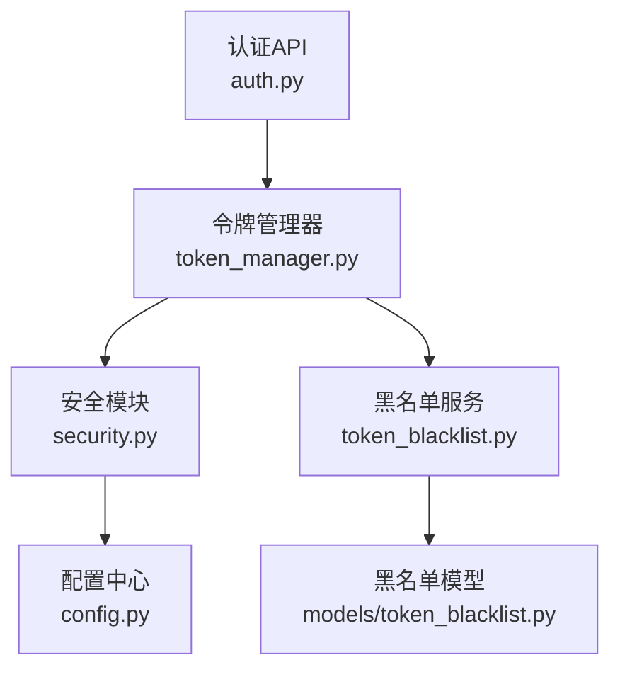
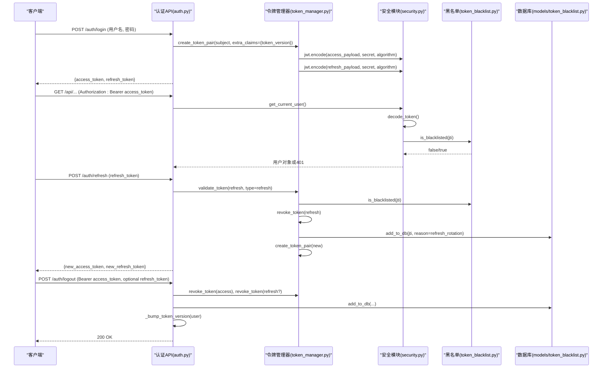
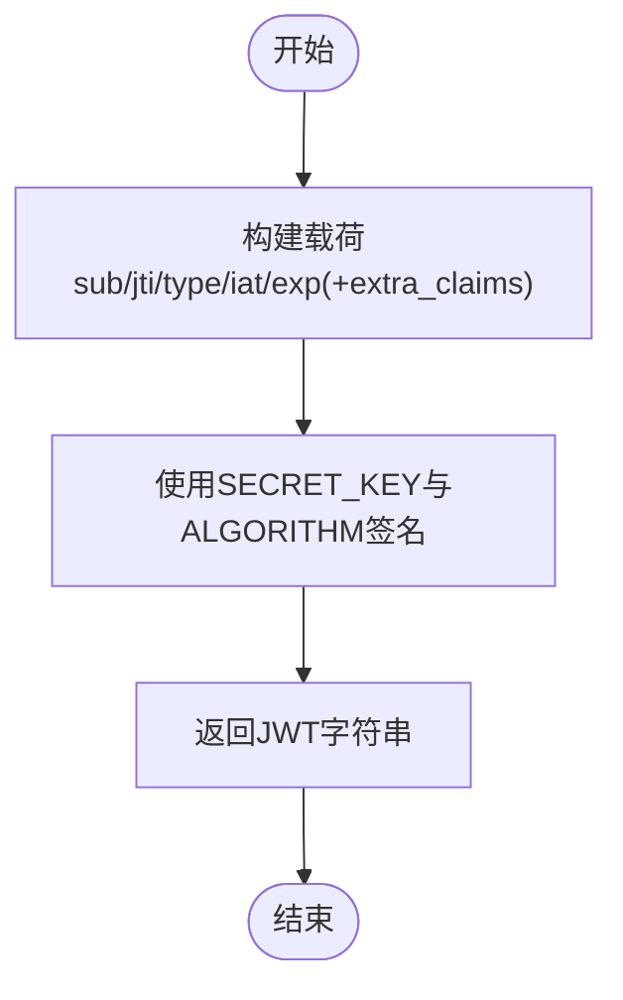
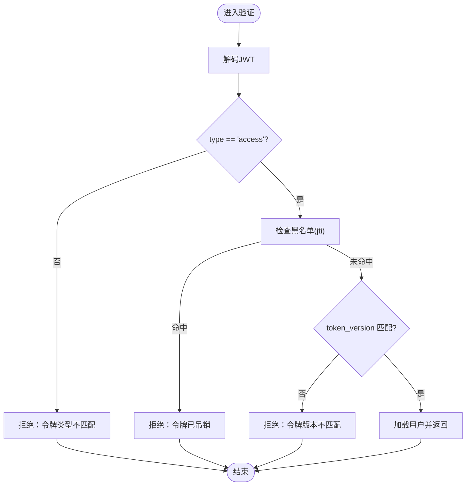
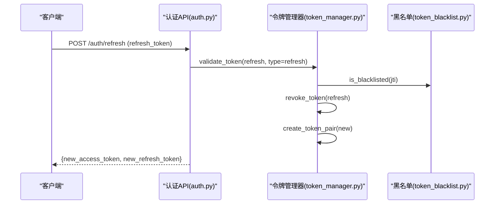
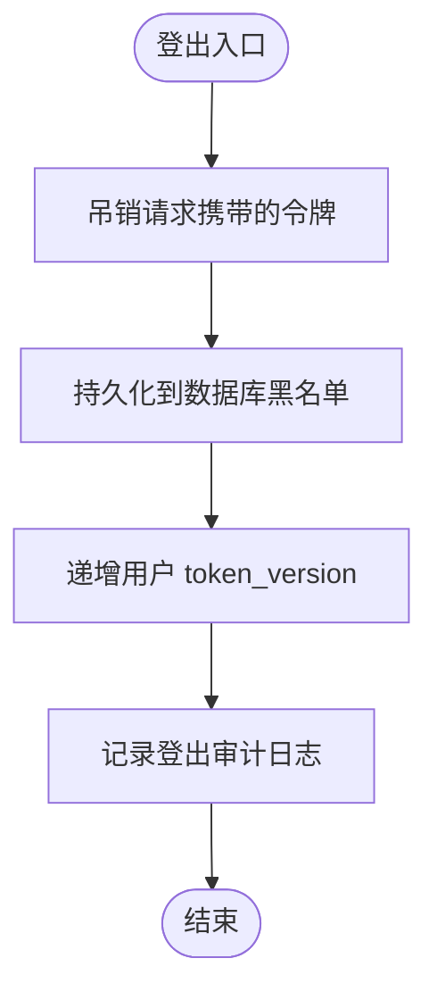
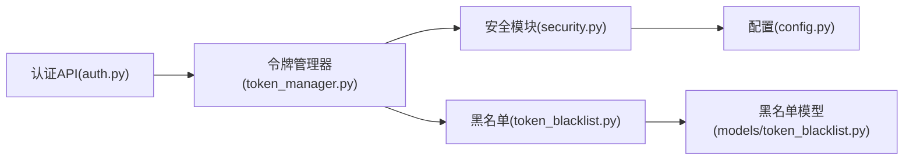

# 令牌生命周期管理

<cite>
**本文引用的文件**
- [backend/app/core/security.py](file://backend/app/core/security.py)
- [backend/app/core/token_manager.py](file://backend/app/core/token_manager.py)
- [backend/app/api/v1/auth/auth.py](file://backend/app/api/v1/auth/auth.py)
- [backend/app/core/token_blacklist.py](file://backend/app/core/token_blacklist.py)
- [backend/app/models/token_blacklist.py](file://backend/app/models/token_blacklist.py)
- [backend/app/core/config.py](file://backend/app/core/config.py)
</cite>

## 目录
1. [简介](#简介)
2. [项目结构](#项目结构)
3. [核心组件](#核心组件)
4. [架构总览](#架构总览)
5. [详细组件分析](#详细组件分析)
6. [依赖关系分析](#依赖关系分析)
7. [性能考虑](#性能考虑)
8. [故障排查指南](#故障排查指南)
9. [结论](#结论)
10. [附录：API使用示例](#附录api使用示例)

## 简介
本文件系统性说明系统中 JWT 令牌的完整生命周期管理，包括 access token 与 refresh token 的生成、验证、刷新、吊销与自动续期策略。重点解释 create_access_token 与 create_refresh_token 的实现原理（载荷设计、签名算法、密钥管理），并提供令牌生命周期的流程图与 API 使用示例，帮助开发者与安全审计人员快速理解并正确使用。

## 项目结构
围绕令牌管理的核心代码分布在以下模块：
- 安全与基础JWT工具：backend/app/core/security.py
- 高级令牌管理封装：backend/app/core/token_manager.py
- 认证API（登录/刷新/登出）：backend/app/api/v1/auth/auth.py
- 黑名单机制（内存+数据库持久化）：backend/app/core/token_blacklist.py
- 黑名单数据模型：backend/app/models/token_blacklist.py
- 配置项（过期时间、算法、密钥等）：backend/app/core/config.py

**图表来源**
- [backend/app/api/v1/auth/auth.py:101-287](file://backend/app/api/v1/auth/auth.py#L101-L287)
- [backend/app/core/token_manager.py:64-127](file://backend/app/core/token_manager.py#L64-L127)
- [backend/app/core/security.py:210-235](file://backend/app/core/security.py#L210-L235)
- [backend/app/core/token_blacklist.py:27-70](file://backend/app/core/token_blacklist.py#L27-L70)
- [backend/app/models/token_blacklist.py:13-57](file://backend/app/models/token_blacklist.py#L13-L57)
- [backend/app/core/config.py:127-130](file://backend/app/core/config.py#L127-L130)

**章节来源**
- [backend/app/api/v1/auth/auth.py:101-287](file://backend/app/api/v1/auth/auth.py#L101-L287)
- [backend/app/core/token_manager.py:64-127](file://backend/app/core/token_manager.py#L64-L127)
- [backend/app/core/security.py:210-235](file://backend/app/core/security.py#L210-L235)
- [backend/app/core/token_blacklist.py:27-70](file://backend/app/core/token_blacklist.py#L27-L70)
- [backend/app/models/token_blacklist.py:13-57](file://backend/app/models/token_blacklist.py#L13-L57)
- [backend/app/core/config.py:127-130](file://backend/app/core/config.py#L127-L130)

## 核心组件
- 安全模块（security.py）
  - 提供 create_access_token、create_refresh_token、decode_token 等基础JWT操作
  - 定义 SECRET_KEY、ALGORITHM、ACCESS_TOKEN_EXPIRE_MINUTES、REFRESH_TOKEN_EXPIRE_DAYS
  - 提供 get_current_user 依赖，实现访问令牌校验、类型检查、黑名单检查、版本控制
- 令牌管理器（token_manager.py）
  - 提供 create_token_pair、validate_token、revoke_token、refresh_access_token 等高阶接口
  - 统一签发双令牌（access + refresh），支持额外声明与TTL覆盖
  - 刷新时执行“轮换”：吊销旧 refresh token 并签发新 pair
- 认证API（auth.py）
  - /login：校验用户、可选2FA、签发双令牌（含 token_version）
  - /refresh：仅接受 refresh token，校验后吊销旧 token 并签发新 pair
  - /logout：吊销请求携带的 access/refresh，并递增 token_version 使该用户所有会话立即失效
- 黑名单（token_blacklist.py + models/token_blacklist.py）
  - 内存集合 + 数据库持久化，支持按 exp 自动清理
  - 启动或需要时从数据库加载未过期条目到内存
- 配置（config.py）
  - ACCESS_TOKEN_EXPIRE_MINUTES=480（8小时）
  - REFRESH_TOKEN_EXPIRE_DAYS=30（30天）
  - ALGORITHM=HS256，SECRET_KEY 由运行时注入或回退生成

**章节来源**
- [backend/app/core/security.py:210-336](file://backend/app/core/security.py#L210-L336)
- [backend/app/core/token_manager.py:64-240](file://backend/app/core/token_manager.py#L64-L240)
- [backend/app/api/v1/auth/auth.py:101-690](file://backend/app/api/v1/auth/auth.py#L101-L690)
- [backend/app/core/token_blacklist.py:27-163](file://backend/app/core/token_blacklist.py#L27-L163)
- [backend/app/models/token_blacklist.py:13-57](file://backend/app/models/token_blacklist.py#L13-L57)
- [backend/app/core/config.py:127-130](file://backend/app/core/config.py#L127-L130)

## 架构总览
下图展示了从登录到访问、刷新、登出的完整流程，以及黑名单与版本控制的参与点。

**图表来源**
- [backend/app/api/v1/auth/auth.py:101-287](file://backend/app/api/v1/auth/auth.py#L101-L287)
- [backend/app/api/v1/auth/auth.py:594-690](file://backend/app/api/v1/auth/auth.py#L594-L690)
- [backend/app/api/v1/auth/auth.py:570-591](file://backend/app/api/v1/auth/auth.py#L570-L591)
- [backend/app/core/token_manager.py:64-127](file://backend/app/core/token_manager.py#L64-L127)
- [backend/app/core/token_manager.py:176-240](file://backend/app/core/token_manager.py#L176-L240)
- [backend/app/core/security.py:210-336](file://backend/app/core/security.py#L210-L336)
- [backend/app/core/token_blacklist.py:27-70](file://backend/app/core/token_blacklist.py#L27-L70)
- [backend/app/models/token_blacklist.py:13-57](file://backend/app/models/token_blacklist.py#L13-L57)

## 详细组件分析

### 令牌生成：create_access_token 与 create_refresh_token
- 载荷设计
  - access token：包含 sub、jti、type="access"、iat、exp；可附加额外声明（如 token_version）
  - refresh token：包含 sub、jti、type="refresh"、iat、exp
- 签名算法与密钥
  - 算法：HS256（可通过配置修改）
  - 密钥：优先使用配置的 SECRET_KEY；若缺失则回退为进程内随机密钥并记录严重日志
- 过期时间
  - access token：默认 ACCESS_TOKEN_EXPIRE_MINUTES（480分钟，即8小时）
  - refresh token：默认 REFRESH_TOKEN_EXPIRE_DAYS（30天）
- 实现位置
  - security.py 中的 create_access_token/create_refresh_token 直接编码JWT
  - token_manager.py 中的 create_token_pair 统一签发双令牌，便于登录/刷新场景复用

**图表来源**
- [backend/app/core/security.py:210-225](file://backend/app/core/security.py#L210-L225)
- [backend/app/core/token_manager.py:91-127](file://backend/app/core/token_manager.py#L91-L127)
- [backend/app/core/config.py:127-130](file://backend/app/core/config.py#L127-L130)

**章节来源**
- [backend/app/core/security.py:210-225](file://backend/app/core/security.py#L210-L225)
- [backend/app/core/token_manager.py:91-127](file://backend/app/core/token_manager.py#L91-L127)
- [backend/app/core/config.py:127-130](file://backend/app/core/config.py#L127-L130)

### 令牌验证：get_current_user 与 validate_token
- 访问令牌验证（get_current_user）
  - 解码JWT，校验类型必须为 access
  - 检查黑名单（通过 jti）
  - 校验 token_version：若用户 token_version > 0 且令牌缺少版本或版本不匹配，拒绝访问
  - 查询用户并写入审计上下文
- 通用验证（token_manager.validate_token）
  - 支持指定 expected_type（access/refresh）
  - 检查黑名单与类型匹配
  - 返回 payload 或错误信息

**图表来源**
- [backend/app/core/security.py:243-336](file://backend/app/core/security.py#L243-L336)
- [backend/app/core/token_manager.py:135-168](file://backend/app/core/token_manager.py#L135-L168)
- [backend/app/core/token_blacklist.py:60-70](file://backend/app/core/token_blacklist.py#L60-L70)

**章节来源**
- [backend/app/core/security.py:243-336](file://backend/app/core/security.py#L243-L336)
- [backend/app/core/token_manager.py:135-168](file://backend/app/core/token_manager.py#L135-L168)
- [backend/app/core/token_blacklist.py:60-70](file://backend/app/core/token_blacklist.py#L60-L70)

### 令牌刷新：refresh_access_token
- 仅接受 refresh token
- 校验类型、黑名单、用户状态与锁定状态
- 吊销旧 refresh token（旋转机制，防止重放）
- 签发新的 access + refresh 对，并携带最新 token_version
- 速率限制：同一IP每分钟最多10次刷新尝试

**图表来源**
- [backend/app/api/v1/auth/auth.py:594-690](file://backend/app/api/v1/auth/auth.py#L594-L690)
- [backend/app/core/token_manager.py:218-240](file://backend/app/core/token_manager.py#L218-L240)
- [backend/app/core/token_blacklist.py:27-70](file://backend/app/core/token_blacklist.py#L27-L70)

**章节来源**
- [backend/app/api/v1/auth/auth.py:594-690](file://backend/app/api/v1/auth/auth.py#L594-L690)
- [backend/app/core/token_manager.py:218-240](file://backend/app/core/token_manager.py#L218-L240)

### 令牌吊销与登出：revoke_token 与 logout
- revoke_token
  - 解码JWT（允许过期仍加入黑名单）
  - 提取 jti 并加入内存黑名单
  - 持久化到数据库（reason 标记为 manual_revoke 或 refresh_rotation）
- logout
  - 吊销本次请求携带的 access_token（及可选 refresh_token）
  - 递增用户的 token_version，使该用户所有现存JWT立即失效
  - 记录登出审计日志

**图表来源**
- [backend/app/core/token_manager.py:176-210](file://backend/app/core/token_manager.py#L176-L210)
- [backend/app/api/v1/auth/auth.py:570-591](file://backend/app/api/v1/auth/auth.py#L570-L591)
- [backend/app/core/token_blacklist.py:133-163](file://backend/app/core/token_blacklist.py#L133-L163)

**章节来源**
- [backend/app/core/token_manager.py:176-210](file://backend/app/core/token_manager.py#L176-L210)
- [backend/app/api/v1/auth/auth.py:570-591](file://backend/app/api/v1/auth/auth.py#L570-L591)
- [backend/app/core/token_blacklist.py:133-163](file://backend/app/core/token_blacklist.py#L133-L163)

### 令牌类型区分与自动续期策略
- 类型区分
  - access：用于访问受保护资源，短时效
  - refresh：用于换取新 access，长时效
  - 在验证时严格校验 type 字段，防止将 refresh 当作 access 使用
- 自动续期策略
  - 刷新采用“轮换”模式：每次刷新都吊销旧 refresh token 并签发新 pair，降低重放风险
  - 结合 token_version 强制下线：登出或管理员操作可立即使所有会话失效
  - 黑名单持久化：确保重启后吊销仍然有效

**章节来源**
- [backend/app/core/security.py:243-336](file://backend/app/core/security.py#L243-L336)
- [backend/app/core/token_manager.py:218-240](file://backend/app/core/token_manager.py#L218-L240)
- [backend/app/api/v1/auth/auth.py:594-690](file://backend/app/api/v1/auth/auth.py#L594-L690)

## 依赖关系分析
- 模块耦合
  - auth.py 依赖 token_manager 进行令牌签发与刷新
  - token_manager 依赖 security 进行JWT编解码，依赖 token_blacklist 进行吊销与校验
  - security.get_current_user 依赖 token_blacklist 与数据库模型进行鉴权
- 外部依赖
  - PyJWT 用于JWT编解码
  - SQLAlchemy 用于数据库读写（黑名单持久化）
  - FastAPI 依赖注入与HTTP异常处理

**图表来源**
- [backend/app/api/v1/auth/auth.py:101-287](file://backend/app/api/v1/auth/auth.py#L101-L287)
- [backend/app/core/token_manager.py:64-127](file://backend/app/core/token_manager.py#L64-L127)
- [backend/app/core/security.py:210-336](file://backend/app/core/security.py#L210-L336)
- [backend/app/core/token_blacklist.py:27-70](file://backend/app/core/token_blacklist.py#L27-L70)
- [backend/app/models/token_blacklist.py:13-57](file://backend/app/models/token_blacklist.py#L13-L57)
- [backend/app/core/config.py:127-130](file://backend/app/core/config.py#L127-L130)

**章节来源**
- [backend/app/api/v1/auth/auth.py:101-287](file://backend/app/api/v1/auth/auth.py#L101-L287)
- [backend/app/core/token_manager.py:64-127](file://backend/app/core/token_manager.py#L64-L127)
- [backend/app/core/security.py:210-336](file://backend/app/core/security.py#L210-L336)
- [backend/app/core/token_blacklist.py:27-70](file://backend/app/core/token_blacklist.py#L27-L70)
- [backend/app/models/token_blacklist.py:13-57](file://backend/app/models/token_blacklist.py#L13-L57)
- [backend/app/core/config.py:127-130](file://backend/app/core/config.py#L127-L130)

## 性能考虑
- 黑名单内存存储与定期清理：减少数据库压力，避免内存泄漏
- 刷新速率限制：防止暴力刷新攻击
- 令牌短时效（access 8小时）：降低泄露窗口
- 版本控制（token_version）：即时吊销能力，无需等待过期
- 数据库索引优化：黑名单表针对 user_id、expires_at 建立索引，提升查询效率

[本节为通用指导，不直接分析具体文件]

## 故障排查指南
- 常见问题
  - 令牌类型不匹配：确认传入的是 access 还是 refresh，并在验证时指定 expected_type
  - 令牌被吊销：检查黑名单是否包含对应 jti，或用户 token_version 是否已变更
  - 刷新频率过高：检查IP限流是否触发
  - 密钥问题：确认 SECRET_KEY 已正确注入，避免回退到临时密钥导致全部令牌失效
- 定位步骤
  - 查看安全模块日志中关于JWT解码失败的调试信息
  - 检查黑名单内存与数据库记录
  - 核对配置中的过期时间与算法设置

**章节来源**
- [backend/app/core/security.py:228-235](file://backend/app/core/security.py#L228-L235)
- [backend/app/core/token_blacklist.py:60-70](file://backend/app/core/token_blacklist.py#L60-L70)
- [backend/app/api/v1/auth/auth.py:594-690](file://backend/app/api/v1/auth/auth.py#L594-L690)

## 结论
系统实现了完整的JWT令牌生命周期管理：安全的密钥与算法配置、严格的类型与版本校验、高效的黑名单机制、以及健壮的刷新与吊销策略。通过短时效 access 与长时效 refresh 的组合，配合轮换与强制下线能力，既保障了用户体验又提升了安全性。建议在生产环境中始终启用 CSRF、合理配置过期时间，并结合审计日志持续监控异常行为。

[本节为总结性内容，不直接分析具体文件]

## 附录：API使用示例
- 登录
  - 方法：POST
  - 路径：/api/v1/auth/login
  - 请求体：{username, password}
  - 响应：{access_token, refresh_token, user_info}
  - 参考实现：[backend/app/api/v1/auth/auth.py:101-287](file://backend/app/api/v1/auth/auth.py#L101-L287)
- 刷新
  - 方法：POST
  - 路径：/api/v1/auth/refresh
  - 请求体：{token: refresh_token}
  - 响应：{access_token, refresh_token, user_info}
  - 参考实现：[backend/app/api/v1/auth/auth.py:594-690](file://backend/app/api/v1/auth/auth.py#L594-L690)
- 登出
  - 方法：POST
  - 路径：/api/v1/auth/logout
  - 请求头：Authorization: Bearer <access_token>
  - 可选请求体：{refresh_token}
  - 响应：{code, message}
  - 参考实现：[backend/app/api/v1/auth/auth.py:570-591](file://backend/app/api/v1/auth/auth.py#L570-L591)

**章节来源**
- [backend/app/api/v1/auth/auth.py:101-287](file://backend/app/api/v1/auth/auth.py#L101-L287)
- [backend/app/api/v1/auth/auth.py:594-690](file://backend/app/api/v1/auth/auth.py#L594-L690)
- [backend/app/api/v1/auth/auth.py:570-591](file://backend/app/api/v1/auth/auth.py#L570-L591)