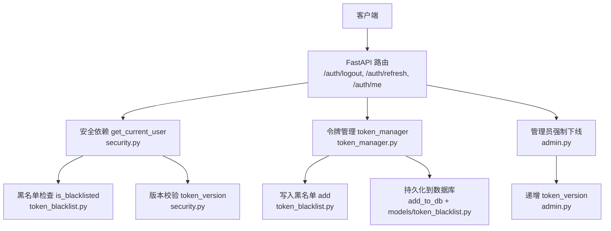
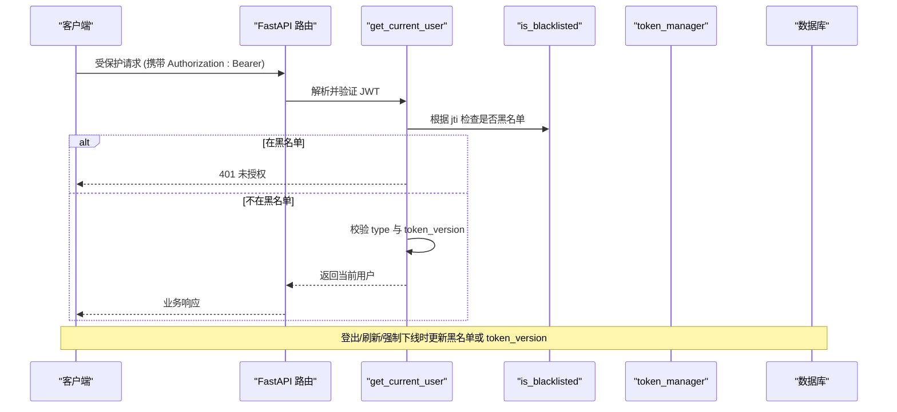
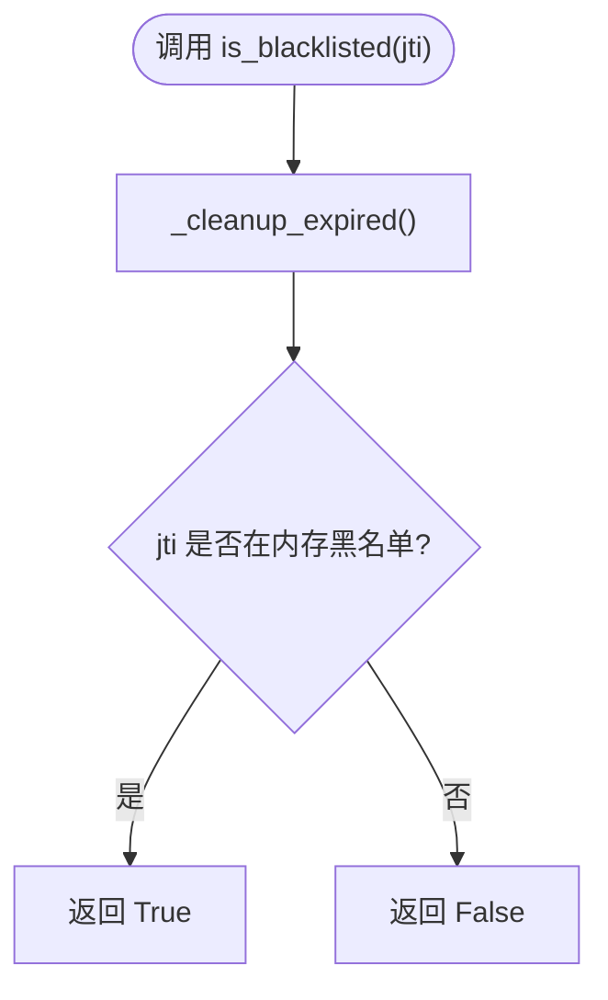
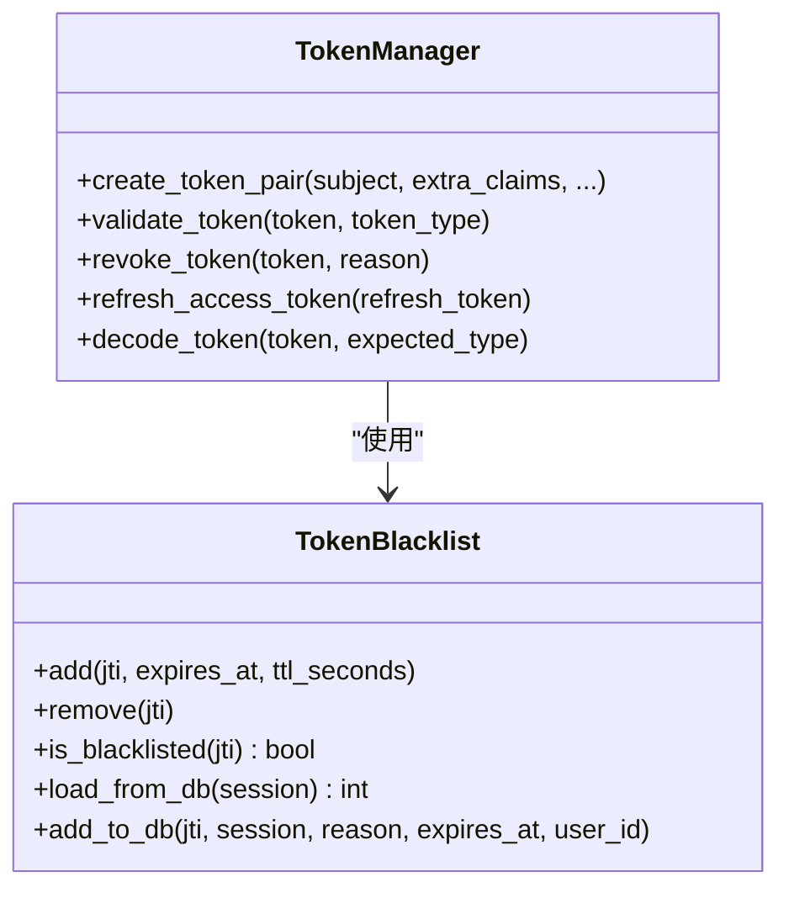
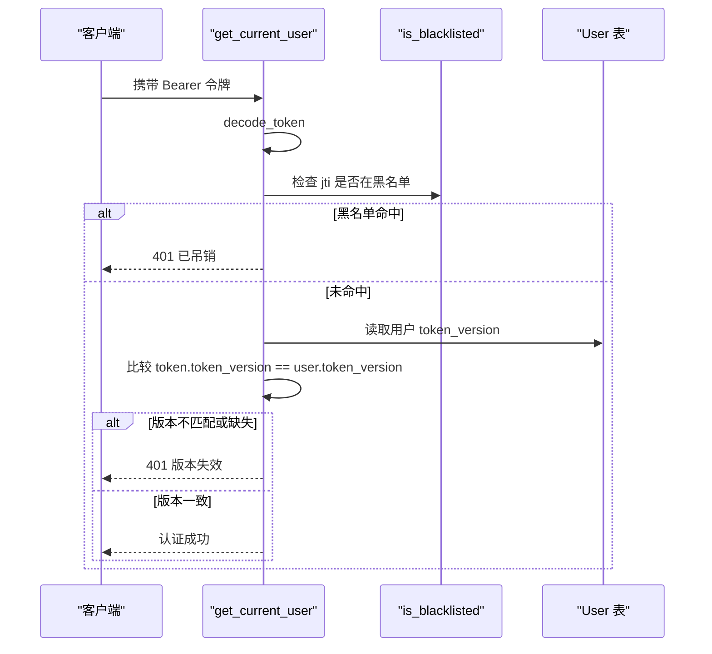
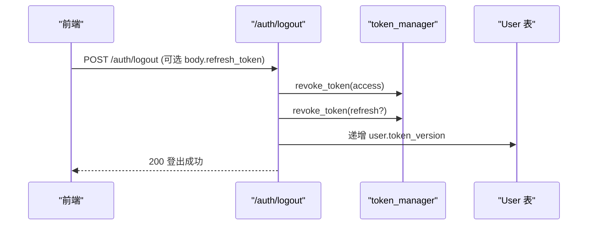
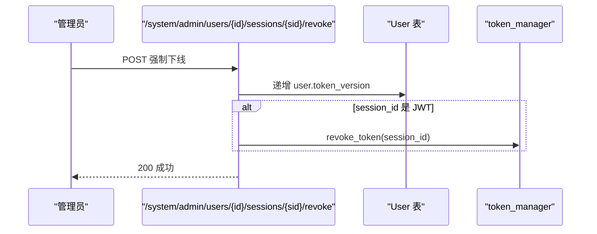
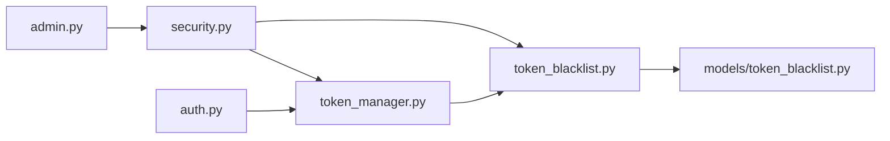

# 令牌黑名单系统

<cite>
**本文引用的文件**
- [backend/app/core/token_blacklist.py](file://backend/app/core/token_blacklist.py)
- [backend/app/models/token_blacklist.py](file://backend/app/models/token_blacklist.py)
- [backend/app/core/security.py](file://backend/app/core/security.py)
- [backend/app/core/token_manager.py](file://backend/app/core/token_manager.py)
- [backend/app/api/v1/auth/auth.py](file://backend/app/api/v1/auth/auth.py)
- [backend/app/api/v1/system/admin.py](file://backend/app/api/v1/system/admin.py)
- [backend/scripts/clear_token_blacklist.py](file://backend/scripts/clear_token_blacklist.py)
</cite>

## 目录
1. [简介](#简介)
2. [项目结构](#项目结构)
3. [核心组件](#核心组件)
4. [架构总览](#架构总览)
5. [详细组件分析](#详细组件分析)
6. [依赖关系分析](#依赖关系分析)
7. [性能与扩展性](#性能与扩展性)
8. [故障排查指南](#故障排查指南)
9. [结论](#结论)
10. [附录：API 接口与使用示例](#附录api-接口与使用示例)

## 简介
本文件系统性地说明“令牌黑名单”机制的实现原理与使用方式，覆盖以下关键点：
- 令牌吊销机制：is_blacklisted 的工作流程、JTI（JWT ID）管理机制、内存与数据库双写策略。
- 强制下线能力：用户登出时的令牌处理、会话终止逻辑、多设备登录控制（基于 token_version）。
- API 接口与使用示例：登出、刷新、管理员强制下线等接口的调用方式、错误处理与性能优化建议。

## 项目结构
围绕令牌黑名单的核心代码分布在以下模块：
- 黑名单存储与查询：core/token_blacklist.py
- 黑名单数据模型：models/token_blacklist.py
- 认证校验入口（集成黑名单检查）：core/security.py
- 令牌签发/验证/吊销统一封装：core/token_manager.py
- 认证相关 API（登录/登出/刷新）：api/v1/auth/auth.py
- 管理员强制下线 API：api/v1/system/admin.py
- 运维脚本（清理黑名单）：scripts/clear_token_blacklist.py

图表来源
- [backend/app/core/security.py:243-336](file://backend/app/core/security.py#L243-L336)
- [backend/app/core/token_blacklist.py:60-126](file://backend/app/core/token_blacklist.py#L60-L126)
- [backend/app/core/token_manager.py:176-210](file://backend/app/core/token_manager.py#L176-L210)
- [backend/app/api/v1/auth/auth.py:570-591](file://backend/app/api/v1/auth/auth.py#L570-L591)
- [backend/app/api/v1/system/admin.py:441-472](file://backend/app/api/v1/system/admin.py#L441-L472)

章节来源
- [backend/app/core/token_blacklist.py:1-163](file://backend/app/core/token_blacklist.py#L1-L163)
- [backend/app/models/token_blacklist.py:1-61](file://backend/app/models/token_blacklist.py#L1-L61)
- [backend/app/core/security.py:243-336](file://backend/app/core/security.py#L243-L336)
- [backend/app/core/token_manager.py:64-210](file://backend/app/core/token_manager.py#L64-L210)
- [backend/app/api/v1/auth/auth.py:570-591](file://backend/app/api/v1/auth/auth.py#L570-L591)
- [backend/app/api/v1/system/admin.py:441-472](file://backend/app/api/v1/system/admin.py#L441-L472)

## 核心组件
- 黑名单存储（内存+数据库）
  - 内存：进程内 dict，键为 jti，值为过期时间戳；每次访问前清理过期项。
  - 数据库：TokenBlacklist 表，记录 jti、user_id、blacklisted_at、expires_at、reason，并建立索引以支持高效查询与清理。
- 令牌管理（token_manager）
  - 签发：access/refresh token 均包含唯一 jti、type、exp 等声明。
  - 验证：decode 后检查黑名单与类型匹配。
  - 吊销：解析 jti 并加入黑名单，同时异步持久化到数据库。
- 认证依赖（get_current_user）
  - 解码 JWT，检查黑名单与类型，校验 token_version 实现“全量会话失效”。
- 登出与刷新（auth API）
  - 登出：吊销当前 access 与可选 refresh，并递增 token_version。
  - 刷新：仅接受 refresh，旧 refresh 立即吊销并轮换为新对。
- 管理员强制下线（admin API）
  - 通过递增目标用户的 token_version 使该用户所有现存 JWT 立即失效；若传入真实 JWT，则额外按 jti 吊销。

章节来源
- [backend/app/core/token_blacklist.py:27-126](file://backend/app/core/token_blacklist.py#L27-L126)
- [backend/app/models/token_blacklist.py:13-61](file://backend/app/models/token_blacklist.py#L13-L61)
- [backend/app/core/token_manager.py:64-210](file://backend/app/core/token_manager.py#L64-L210)
- [backend/app/core/security.py:243-336](file://backend/app/core/security.py#L243-L336)
- [backend/app/api/v1/auth/auth.py:570-690](file://backend/app/api/v1/auth/auth.py#L570-L690)
- [backend/app/api/v1/system/admin.py:441-472](file://backend/app/api/v1/system/admin.py#L441-L472)

## 架构总览
下图展示了从请求进入鉴权到黑名单检查的完整链路，以及登出/刷新/强制下线的关键路径。

图表来源
- [backend/app/core/security.py:243-336](file://backend/app/core/security.py#L243-L336)
- [backend/app/core/token_blacklist.py:60-126](file://backend/app/core/token_blacklist.py#L60-L126)
- [backend/app/core/token_manager.py:176-210](file://backend/app/core/token_manager.py#L176-L210)

## 详细组件分析

### 黑名单存储与查询（token_blacklist）
- 内存存储
  - 数据结构：dict[jti] = expires_at_epoch
  - 并发安全：使用线程锁保护清理与写入。
  - 自动清理：每次查询前清理过期条目，避免内存泄漏。
- 数据库持久化
  - 写入：revoke_token 成功后将 jti 持久化到 TokenBlacklist 表，便于服务重启后仍生效。
  - 加载：服务启动时可从数据库加载未过期的黑名单到内存。
- 关键函数
  - add/remove/is_blacklisted/load_from_db/add_to_db/clear/count/_cleanup_expired

图表来源
- [backend/app/core/token_blacklist.py:60-126](file://backend/app/core/token_blacklist.py#L60-L126)

章节来源
- [backend/app/core/token_blacklist.py:27-126](file://backend/app/core/token_blacklist.py#L27-L126)
- [backend/app/models/token_blacklist.py:13-61](file://backend/app/models/token_blacklist.py#L13-L61)

### 令牌签发与验证（token_manager）
- 签发
  - 生成 access/refresh 双令牌，均包含唯一 jti、type、exp。
- 验证
  - decode 后检查黑名单与类型匹配。
- 吊销
  - 解析 jti，加入内存黑名单，并持久化到数据库。
- 刷新
  - 仅接受 refresh，旧 refresh 立即吊销并签发新对。

图表来源
- [backend/app/core/token_manager.py:64-210](file://backend/app/core/token_manager.py#L64-L210)
- [backend/app/core/token_blacklist.py:27-126](file://backend/app/core/token_blacklist.py#L27-L126)

章节来源
- [backend/app/core/token_manager.py:64-210](file://backend/app/core/token_manager.py#L64-L210)

### 认证依赖与强制下线（security.get_current_user）
- 认证链
  - 解析 JWT，检查黑名单与类型，校验 token_version。
  - 当用户 token_version > 0 而 token 缺少版本声明或版本不匹配时，拒绝访问。
- 强制下线效果
  - 登出或管理员操作递增 token_version 后，所有现存 JWT 立即失效。

图表来源
- [backend/app/core/security.py:243-336](file://backend/app/core/security.py#L243-L336)

章节来源
- [backend/app/core/security.py:243-336](file://backend/app/core/security.py#L243-L336)

### 登出与刷新（auth API）
- 登出
  - 吊销当前 access 与可选 refresh。
  - 递增用户 token_version，使该用户全部现存 JWT 立即失效。
  - 审计日志记录登出行为。
- 刷新
  - 仅接受 refresh，旧 refresh 立即吊销并签发新对。
  - 速率限制防止滥用。

图表来源
- [backend/app/api/v1/auth/auth.py:556-591](file://backend/app/api/v1/auth/auth.py#L556-L591)
- [backend/app/core/token_manager.py:176-210](file://backend/app/core/token_manager.py#L176-L210)

章节来源
- [backend/app/api/v1/auth/auth.py:556-591](file://backend/app/api/v1/auth/auth.py#L556-L591)
- [backend/app/core/token_manager.py:176-210](file://backend/app/core/token_manager.py#L176-L210)

### 管理员强制下线（admin API）
- 功能
  - 递增目标用户的 token_version，使其所有现存 JWT 立即失效。
  - 若传入真实 JWT（session_id），则额外按 jti 吊销。
- 权限
  - 需要管理员角色。

图表来源
- [backend/app/api/v1/system/admin.py:441-472](file://backend/app/api/v1/system/admin.py#L441-L472)

章节来源
- [backend/app/api/v1/system/admin.py:441-472](file://backend/app/api/v1/system/admin.py#L441-L472)

## 依赖关系分析
- 低耦合设计
  - token_manager 负责令牌生命周期，不直接感知业务；黑名单作为独立模块被多处复用。
  - security.get_current_user 作为认证唯一出口，集中执行黑名单与版本校验。
- 外部依赖
  - PyJWT 用于编解码；SQLAlchemy 用于数据库读写；FastAPI 提供路由与依赖注入。
- 潜在循环依赖
  - 通过延迟导入（如 from app.core.database import SessionLocal）避免循环依赖。

图表来源
- [backend/app/core/security.py:243-336](file://backend/app/core/security.py#L243-L336)
- [backend/app/core/token_manager.py:64-210](file://backend/app/core/token_manager.py#L64-L210)
- [backend/app/core/token_blacklist.py:27-126](file://backend/app/core/token_blacklist.py#L27-L126)
- [backend/app/models/token_blacklist.py:13-61](file://backend/app/models/token_blacklist.py#L13-L61)
- [backend/app/api/v1/auth/auth.py:556-591](file://backend/app/api/v1/auth/auth.py#L556-L591)
- [backend/app/api/v1/system/admin.py:441-472](file://backend/app/api/v1/system/admin.py#L441-L472)

章节来源
- [backend/app/core/security.py:243-336](file://backend/app/core/security.py#L243-L336)
- [backend/app/core/token_manager.py:64-210](file://backend/app/core/token_manager.py#L64-L210)
- [backend/app/core/token_blacklist.py:27-126](file://backend/app/core/token_blacklist.py#L27-L126)
- [backend/app/models/token_blacklist.py:13-61](file://backend/app/models/token_blacklist.py#L13-L61)
- [backend/app/api/v1/auth/auth.py:556-591](file://backend/app/api/v1/auth/auth.py#L556-L591)
- [backend/app/api/v1/system/admin.py:441-472](file://backend/app/api/v1/system/admin.py#L441-L472)

## 性能与扩展性
- 内存黑名单
  - 优点：极低延迟，适合高频鉴权场景。
  - 风险：进程重启丢失；需配合数据库持久化保证一致性。
- 数据库黑名单
  - 优点：持久化、可跨进程/实例共享。
  - 注意：写入失败不应阻塞主流程（已做异常捕获与回滚）。
- 清理策略
  - 每次查询前清理过期条目，避免内存膨胀。
  - 可通过定时任务或脚本清理历史数据。
- 扩展建议
  - 高并发场景可引入 Redis 作为分布式黑名单缓存，降低数据库压力。
  - 增加指标监控：黑名单命中率、清理频率、数据库写入失败率。

[本节为通用指导，无需特定文件引用]

## 故障排查指南
- 常见问题
  - 登出后仍可访问：确认 get_current_user 是否执行了黑名单检查与 token_version 校验。
  - 刷新失败：确认仅接受 refresh，且旧 refresh 已被吊销。
  - 强制下线无效：确认 admin 接口是否正确递增 token_version。
- 定位方法
  - 查看日志：黑名单写入失败、数据库连接异常、JWT 解码失败等。
  - 检查数据库：TokenBlacklist 表是否有对应记录，索引是否正常。
  - 检查配置：SECRET_KEY、ALGORITHM、TTL 等是否与签发端一致。
- 工具与脚本
  - 可使用 clear_token_blacklist.py 清理历史数据（谨慎使用）。

章节来源
- [backend/app/core/token_blacklist.py:133-163](file://backend/app/core/token_blacklist.py#L133-L163)
- [backend/scripts/clear_token_blacklist.py](file://backend/scripts/clear_token_blacklist.py)

## 结论
本系统通过“内存黑名单 + 数据库持久化 + token_version 版本控制”的组合，实现了强一致的令牌吊销与多设备会话控制。登出与强制下线均能确保被吊销令牌立即失效，结合类型校验与速率限制，提升了整体安全性与稳定性。建议在大规模部署中引入分布式缓存以提升性能，并完善监控与告警。

[本节为总结，无需特定文件引用]

## 附录：API 接口与使用示例

- 用户登出
  - 路径：POST /api/v1/auth/logout
  - 作用：吊销当前 access 与可选 refresh，并递增 token_version。
  - 请求头：Authorization: Bearer <access_token>
  - 请求体（可选）：{ "refresh_token": "<string>" }
  - 响应：200 登出成功
  - 错误处理：网络或服务异常不影响本地清理（前端侧已做容错）。

- 刷新令牌
  - 路径：POST /api/v1/auth/refresh
  - 作用：使用 refresh_token 获取新的 access/refresh 对，旧 refresh 立即吊销。
  - 请求体：{ "token": "<refresh_token>" }
  - 响应：200 返回新令牌对
  - 错误处理：非法格式或过期返回 401。

- 管理员强制下线
  - 路径：POST /api/v1/system/admin/users/{user_id}/sessions/{session_id}/revoke
  - 作用：递增用户 token_version，使该用户所有现存 JWT 立即失效；若 session_id 为 JWT，则额外按 jti 吊销。
  - 权限：需要管理员角色。
  - 响应：200 成功

- 使用示例（概念性描述）
  - 登出：前端在退出时调用 /auth/logout，携带 access_token 与可选 refresh_token；后端吊销并递增版本；前端清理本地状态。
  - 刷新：前端在 access 即将过期时调用 /auth/refresh；后端吊销旧 refresh 并签发新对；前端更新本地令牌。
  - 强制下线：管理员调用 admin 接口；后端递增版本；目标用户后续请求将被拒绝。

章节来源
- [backend/app/api/v1/auth/auth.py:570-690](file://backend/app/api/v1/auth/auth.py#L570-L690)
- [backend/app/api/v1/system/admin.py:441-472](file://backend/app/api/v1/system/admin.py#L441-L472)