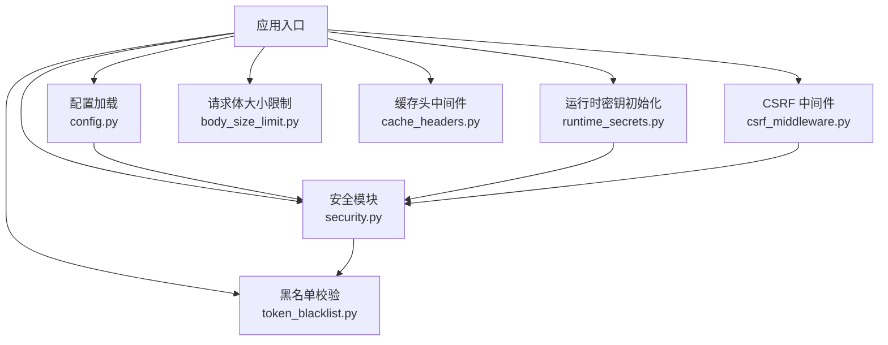
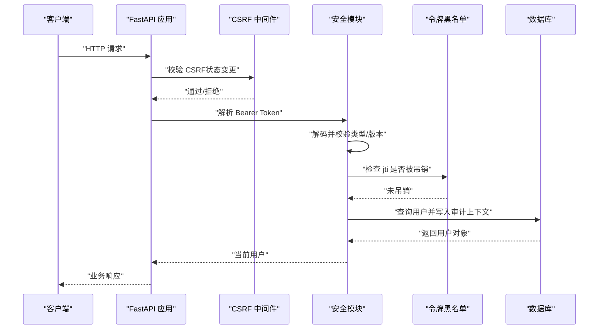
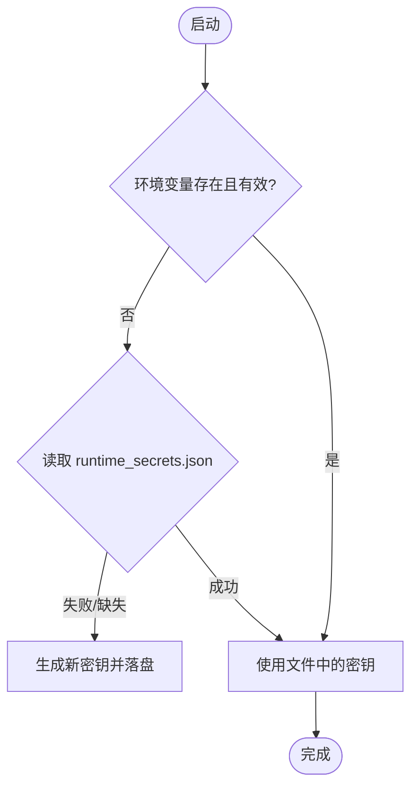
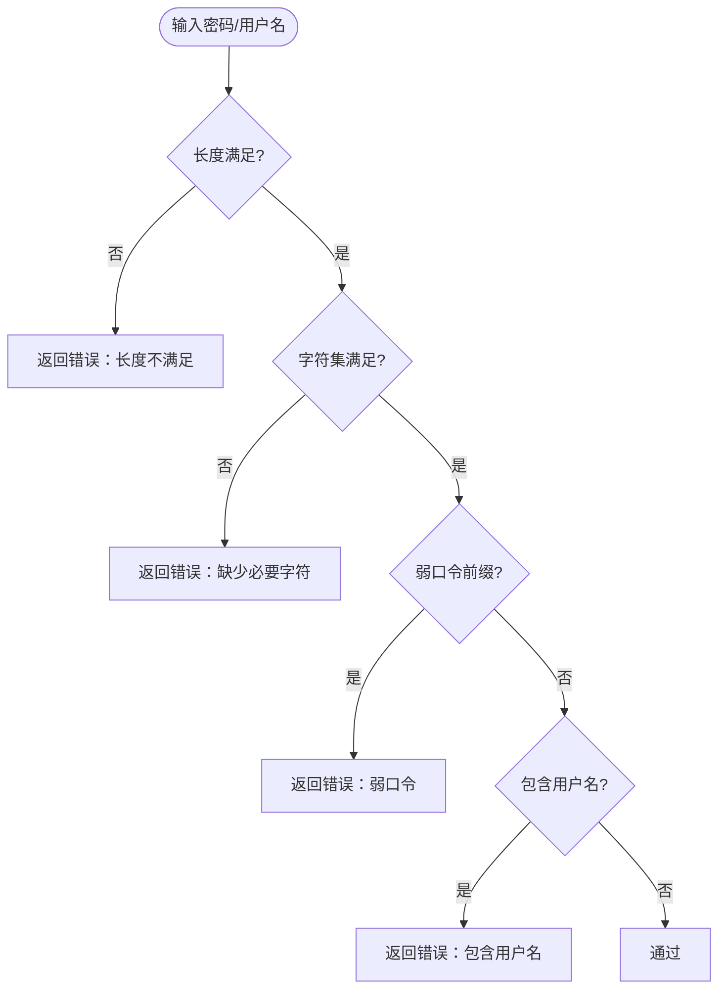
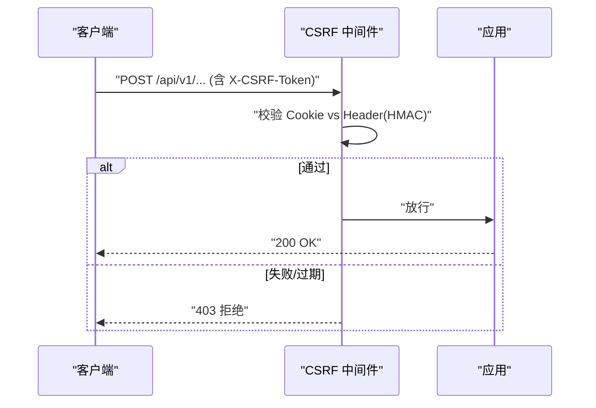
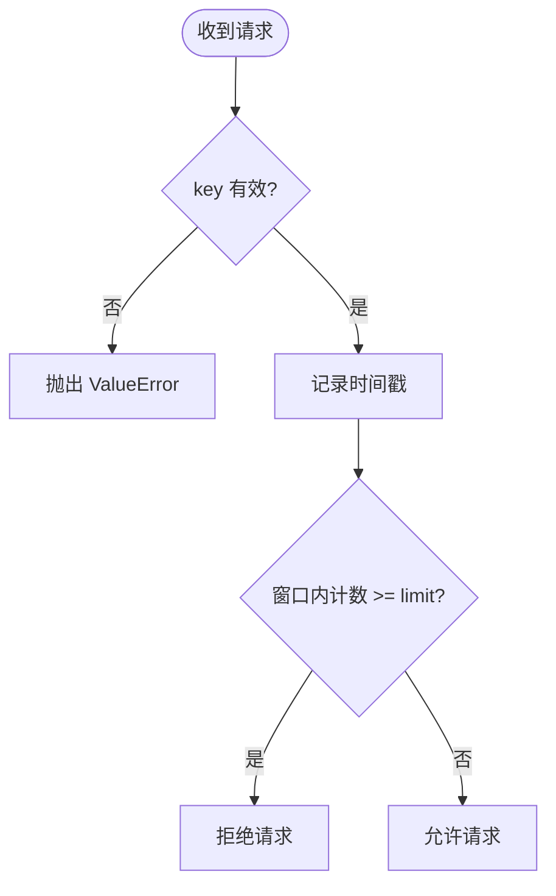
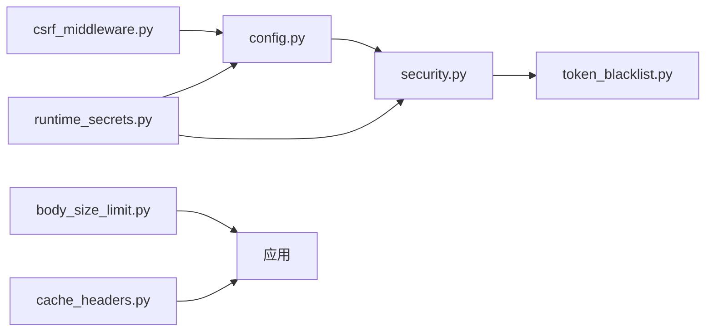

# 安全配置管理

<cite>
**本文引用的文件**
- [backend/app/core/security.py](file://backend/app/core/security.py)
- [backend/app/core/config.py](file://backend/app/core/config.py)
- [backend/app/middleware/csrf_middleware.py](file://backend/app/middleware/csrf_middleware.py)
- [backend/app/utils/runtime_secrets.py](file://backend/app/utils/runtime_secrets.py)
- [backend/app/core/token_blacklist.py](file://backend/app/core/token_blacklist.py)
- [backend/app/middleware/body_size_limit.py](file://backend/app/middleware/body_size_limit.py)
- [backend/app/middleware/cache_headers.py](file://backend/app/middleware/cache_headers.py)
</cite>

## 目录
1. [简介](#简介)
2. [项目结构](#项目结构)
3. [核心组件](#核心组件)
4. [架构总览](#架构总览)
5. [详细组件分析](#详细组件分析)
6. [依赖关系分析](#依赖关系分析)
7. [性能考虑](#性能考虑)
8. [故障排除指南](#故障排除指南)
9. [结论](#结论)
10. [附录](#附录)

## 简介
本文件面向生产环境的安全配置管理，聚焦以下主题：
- JWT 密钥管理机制：SECRET_KEY 的来源与生命周期、ALGORITHM 选择、令牌有效期与轮换策略。
- 密码策略配置：PasswordPolicy 参数、复杂度要求、用户名验证规则。
- 安全中间件：SecurityHeadersMiddleware 安全头、CSRF 保护、速率限制、输入清理与请求体大小限制。
- 生产环境最佳实践与故障排查建议。

## 项目结构
与安全相关的关键模块分布如下：
- 核心安全能力：JWT/密码/认证依赖/速率限制/安全头在 core/security.py。
- 配置与运行时密钥：config.py 提供全局设置；runtime_secrets.py 负责 SECRET_KEY/CSRF_SECRET_KEY 的生成与持久化。
- CSRF 保护：middleware/csrf_middleware.py。
- 令牌吊销：core/token_blacklist.py。
- 其他安全中间件：body_size_limit.py（请求体大小限制）、cache_headers.py（缓存头）。

**图示来源**
- [backend/app/core/config.py:54-135](file://backend/app/core/config.py#L54-L135)
- [backend/app/utils/runtime_secrets.py:20-93](file://backend/app/utils/runtime_secrets.py#L20-L93)
- [backend/app/core/security.py:61-90](file://backend/app/core/security.py#L61-L90)
- [backend/app/middleware/csrf_middleware.py:177-284](file://backend/app/middleware/csrf_middleware.py#L177-L284)
- [backend/app/core/token_blacklist.py:27-70](file://backend/app/core/token_blacklist.py#L27-L70)
- [backend/app/middleware/body_size_limit.py:48-79](file://backend/app/middleware/body_size_limit.py#L48-L79)
- [backend/app/middleware/cache_headers.py:20-31](file://backend/app/middleware/cache_headers.py#L20-L31)

**章节来源**
- [backend/app/core/config.py:54-135](file://backend/app/core/config.py#L54-L135)
- [backend/app/utils/runtime_secrets.py:20-93](file://backend/app/utils/runtime_secrets.py#L20-L93)
- [backend/app/core/security.py:61-90](file://backend/app/core/security.py#L61-L90)

## 核心组件
- JWT 与认证：基于 PyJWT，使用 settings.SECRET_KEY 与 ALGORITHM 进行签名与验签；支持 access/refresh 两类令牌，强制类型校验与黑名单检查。
- 密码哈希：passlib + bcrypt，自动处理长度兼容与异常回退。
- 密码策略：PasswordPolicy 提供最小长度、字符集、弱口令前缀、用户名包含检测等规则。
- 运行时密钥：ensure_runtime_secrets 保证 SECRET_KEY/CSRF_SECRET_KEY 存在且强度达标，并持久化到 runtime_secrets.json。
- CSRF 保护：HMAC 签名模式，支持过期窗口与降级兼容。
- 令牌吊销：内存黑名单 + 可选数据库持久化，支持按 JTI 快速失效。
- 安全中间件：安全响应头、请求体大小限制、缓存头控制。

**章节来源**
- [backend/app/core/security.py:210-235](file://backend/app/core/security.py#L210-L235)
- [backend/app/core/security.py:524-590](file://backend/app/core/security.py#L524-L590)
- [backend/app/utils/runtime_secrets.py:20-93](file://backend/app/utils/runtime_secrets.py#L20-L93)
- [backend/app/middleware/csrf_middleware.py:65-124](file://backend/app/middleware/csrf_middleware.py#L65-L124)
- [backend/app/core/token_blacklist.py:27-70](file://backend/app/core/token_blacklist.py#L27-L70)

## 架构总览
下图展示一次受保护的 API 调用从进入应用到鉴权、限流、审计的完整链路。

**图示来源**
- [backend/app/middleware/csrf_middleware.py:177-284](file://backend/app/middleware/csrf_middleware.py#L177-L284)
- [backend/app/core/security.py:243-336](file://backend/app/core/security.py#L243-L336)
- [backend/app/core/token_blacklist.py:60-70](file://backend/app/core/token_blacklist.py#L60-L70)

## 详细组件分析

### JWT 密钥管理与算法
- 密钥来源与优先级
  - 环境变量优先：SECRET_KEY、CSRF_SECRET_KEY。
  - 若为空或长度不足，则从 runtime_secrets.json 读取。
  - 仍不存在时自动生成并原子落盘，同时注入环境变量。
- 算法选择
  - 默认 HS256，可通过 settings.ALGORITHM 覆盖。
- 令牌有效期
  - ACCESS_TOKEN_EXPIRE_MINUTES：默认 480 分钟（8 小时）。
  - REFRESH_TOKEN_EXPIRE_DAYS：默认 30 天。
- 令牌吊销与版本控制
  - 支持 jti 黑名单机制，登出/强制下线立即生效。
  - token_version 字段用于批量强制下线会话。

**图示来源**
- [backend/app/utils/runtime_secrets.py:20-93](file://backend/app/utils/runtime_secrets.py#L20-L93)
- [backend/app/core/config.py:366-379](file://backend/app/core/config.py#L366-L379)

**章节来源**
- [backend/app/core/config.py:70-72](file://backend/app/core/config.py#L70-L72)
- [backend/app/core/config.py:127-130](file://backend/app/core/config.py#L127-L130)
- [backend/app/core/security.py:61-90](file://backend/app/core/security.py#L61-L90)
- [backend/app/core/security.py:210-235](file://backend/app/core/security.py#L210-L235)
- [backend/app/core/security.py:243-336](file://backend/app/core/security.py#L243-L336)
- [backend/app/core/token_blacklist.py:27-70](file://backend/app/core/token_blacklist.py#L27-L70)
- [backend/app/utils/runtime_secrets.py:20-93](file://backend/app/utils/runtime_secrets.py#L20-L93)

### 密码策略与用户名验证
- PasswordPolicy 关键参数
  - MIN_LENGTH：最小长度（默认 12）。
  - REQUIRE_UPPER/LOWER/DIGIT/SPECIAL：是否要求大写、小写、数字、特殊字符。
  - SPECIAL_WHITELIST：允许的特殊字符白名单。
  - WEAK_PASSWORD_PREFIXES：弱口令前缀黑名单。
  - FORBIDDEN_USERNAME_PARTS：禁止包含的用户名字段（可扩展）。
- 用户名验证
  - 长度范围、字符集限制（字母、数字、下划线、短横线、中文）。
- 密码哈希
  - passlib + bcrypt，自动截断超长密码以避免底层异常。

**图示来源**
- [backend/app/core/security.py:524-590](file://backend/app/core/security.py#L524-L590)

**章节来源**
- [backend/app/core/security.py:122-149](file://backend/app/core/security.py#L122-L149)
- [backend/app/core/security.py:524-590](file://backend/app/core/security.py#L524-L590)

### 安全中间件配置
- SecurityHeadersMiddleware
  - 添加 X-Content-Type-Options、X-Frame-Options、X-XSS-Protection、Referrer-Policy 等安全头。
  - 对静态资源与参考数据设置合适的 Cache-Control。
- CSRF 中间件
  - HMAC 签名模式：Cookie 存储签名值，Header 携带原始 token，服务端常量时间比较。
  - 支持过期窗口与旧版明文兼容降级。
  - 豁免路径与可信代理 IP 透传。
- 请求体大小限制
  - 非 multipart 请求默认 10MB 上限，特定路径放行大负载。
- 缓存头中间件
  - 为静态资源与低变化数据添加 Cache-Control，减少重复查询。

**图示来源**
- [backend/app/middleware/csrf_middleware.py:65-124](file://backend/app/middleware/csrf_middleware.py#L65-L124)
- [backend/app/middleware/csrf_middleware.py:177-284](file://backend/app/middleware/csrf_middleware.py#L177-L284)

**章节来源**
- [backend/app/core/security.py:598-636](file://backend/app/core/security.py#L598-L636)
- [backend/app/middleware/csrf_middleware.py:177-284](file://backend/app/middleware/csrf_middleware.py#L177-L284)
- [backend/app/middleware/body_size_limit.py:48-79](file://backend/app/middleware/body_size_limit.py#L48-L79)
- [backend/app/middleware/cache_headers.py:20-31](file://backend/app/middleware/cache_headers.py#L20-L31)

### 速率限制与输入清理
- 内置速率限制器
  - 滑动窗口算法，默认 60 次/分钟，键为 key（如 IP），线程安全，周期性清理过期键。
  - 严格参数校验：缺失 key 或 request 直接抛出异常，fail-closed。
- 输入清理
  - sanitize_input 移除常见 SQL 注入危险字符。
  - sanitize_log_data 脱敏日志中的敏感字段。

**图示来源**
- [backend/app/core/security.py:414-488](file://backend/app/core/security.py#L414-L488)
- [backend/app/core/security.py:394-411](file://backend/app/core/security.py#L394-L411)

**章节来源**
- [backend/app/core/security.py:414-488](file://backend/app/core/security.py#L414-L488)
- [backend/app/core/security.py:394-411](file://backend/app/core/security.py#L394-L411)

## 依赖关系分析
- config.py 提供全局设置（SECRET_KEY、ALGORITHM、CSRF_ENABLED、速率限制开关等）。
- runtime_secrets.py 确保密钥可用并持久化，被 config.py 与 security.py 间接依赖。
- security.py 依赖 config.py 获取密钥与算法，依赖 token_blacklist.py 做吊销检查。
- csrf_middleware.py 依赖 config.py 获取 CSRF 开关与密钥，独立实现签名与过期校验。
- body_size_limit.py 与 cache_headers.py 作为通用中间件，降低攻击面与提升性能。

**图示来源**
- [backend/app/core/config.py:54-135](file://backend/app/core/config.py#L54-L135)
- [backend/app/utils/runtime_secrets.py:20-93](file://backend/app/utils/runtime_secrets.py#L20-L93)
- [backend/app/core/security.py:61-90](file://backend/app/core/security.py#L61-L90)
- [backend/app/core/token_blacklist.py:27-70](file://backend/app/core/token_blacklist.py#L27-L70)
- [backend/app/middleware/csrf_middleware.py:177-284](file://backend/app/middleware/csrf_middleware.py#L177-L284)
- [backend/app/middleware/body_size_limit.py:48-79](file://backend/app/middleware/body_size_limit.py#L48-L79)
- [backend/app/middleware/cache_headers.py:20-31](file://backend/app/middleware/cache_headers.py#L20-L31)

**章节来源**
- [backend/app/core/config.py:54-135](file://backend/app/core/config.py#L54-L135)
- [backend/app/utils/runtime_secrets.py:20-93](file://backend/app/utils/runtime_secrets.py#L20-L93)
- [backend/app/core/security.py:61-90](file://backend/app/core/security.py#L61-L90)
- [backend/app/core/token_blacklist.py:27-70](file://backend/app/core/token_blacklist.py#L27-L70)
- [backend/app/middleware/csrf_middleware.py:177-284](file://backend/app/middleware/csrf_middleware.py#L177-L284)
- [backend/app/middleware/body_size_limit.py:48-79](file://backend/app/middleware/body_size_limit.py#L48-L79)
- [backend/app/middleware/cache_headers.py:20-31](file://backend/app/middleware/cache_headers.py#L20-L31)

## 性能考虑
- 速率限制采用内存滑动窗口，定期清理过期键，避免内存泄漏。
- 黑名单支持数据库持久化，启动时可加载未过期条目，兼顾性能与可靠性。
- 缓存头中间件为静态与低变化数据设置合理 TTL，减少数据库压力。
- 请求体大小限制防止超大 payload 导致的资源耗尽。

[本节为通用指导，无需具体文件引用]

## 故障排除指南
- 登录失败或令牌无效
  - 检查 SECRET_KEY 是否已正确生成并持久化（runtime_secrets.json）。
  - 确认 ALGORITHM 一致，access/refresh 类型匹配。
  - 查看令牌是否被加入黑名单或被强制下线（token_version）。
- CSRF 验证失败
  - 确认前端先获取 token 并在状态变更请求中携带 X-CSRF-Token。
  - 检查 Cookie 与 Header 是否匹配（HMAC 签名）。
  - 关注过期窗口与降级日志。
- 请求被拒绝（413/403）
  - 检查请求体大小是否超过限制，或路径是否在豁免列表。
  - 检查 CSRF 是否启用以及路径是否豁免。
- 日志泄露风险
  - 生产环境确保 DB_ECHO 关闭，敏感字段已脱敏。

**章节来源**
- [backend/app/core/security.py:243-336](file://backend/app/core/security.py#L243-L336)
- [backend/app/middleware/csrf_middleware.py:177-284](file://backend/app/middleware/csrf_middleware.py#L177-L284)
- [backend/app/middleware/body_size_limit.py:48-79](file://backend/app/middleware/body_size_limit.py#L48-L79)
- [backend/app/core/config.py:301-309](file://backend/app/core/config.py#L301-L309)

## 结论
本系统围绕“密钥可再生、策略可配置、中间件可组合”的原则构建安全基线：
- 密钥管理：环境变量优先，自动持久化，强度校验，避免硬编码。
- 密码策略：强复杂度、弱口令拦截、用户名关联检测。
- 中间件：安全头、CSRF、限流、大小限制、缓存头协同工作。
- 生产建议：收紧令牌有效期、启用 CSRF、开启黑名单、谨慎信任代理头、关闭调试输出。

[本节为总结性内容，无需具体文件引用]

## 附录
- 关键配置项速查
  - SECRET_KEY：JWT 签名密钥，由 ensure_runtime_secrets 保障可用。
  - ALGORITHM：JWT 算法，默认 HS256。
  - ACCESS_TOKEN_EXPIRE_MINUTES：访问令牌有效期（分钟）。
  - REFRESH_TOKEN_EXPIRE_DAYS：刷新令牌有效期（天）。
  - CSRF_ENABLED：是否启用 CSRF 保护。
  - RATE_LIMIT_ENABLED/RATE_LIMIT_PER_MINUTE：速率限制开关与阈值。
  - TRUST_PROXY_HEADERS：是否信任代理头（默认 False）。
- 推荐实践
  - 生产环境固定 ALGORITHM，统一密钥来源与轮转流程。
  - 结合 token_version 实现批量强制下线。
  - 使用黑名单持久化提升跨进程/重启后的吊销一致性。
  - 对静态资源与参考数据设置合理的缓存策略。

**章节来源**
- [backend/app/core/config.py:70-72](file://backend/app/core/config.py#L70-L72)
- [backend/app/core/config.py:127-130](file://backend/app/core/config.py#L127-L130)
- [backend/app/core/config.py:153-159](file://backend/app/core/config.py#L153-L159)
- [backend/app/core/config.py:107-112](file://backend/app/core/config.py#L107-L112)
- [backend/app/core/security.py:210-235](file://backend/app/core/security.py#L210-L235)
- [backend/app/core/token_blacklist.py:73-103](file://backend/app/core/token_blacklist.py#L73-L103)
- [backend/app/middleware/cache_headers.py:10-17](file://backend/app/middleware/cache_headers.py#L10-L17)