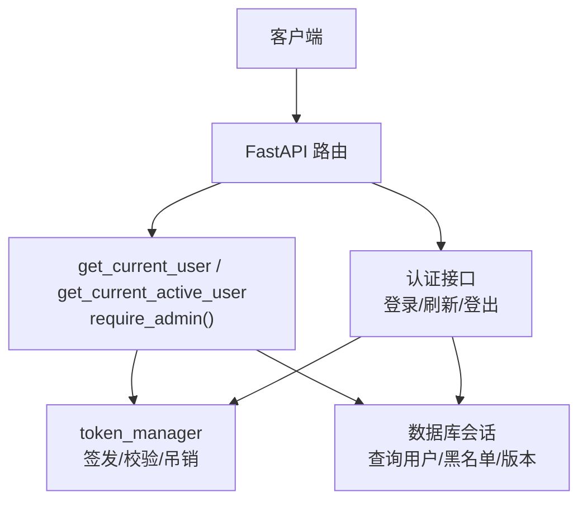
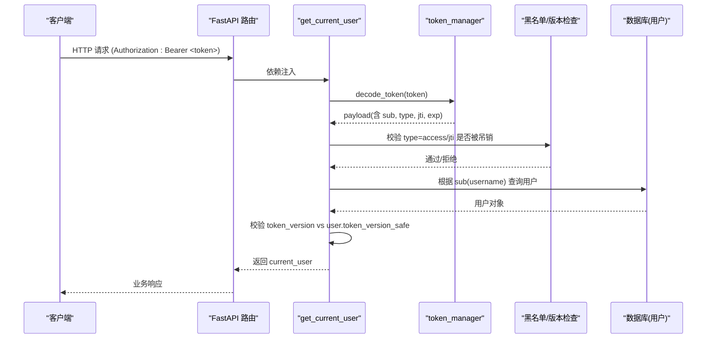
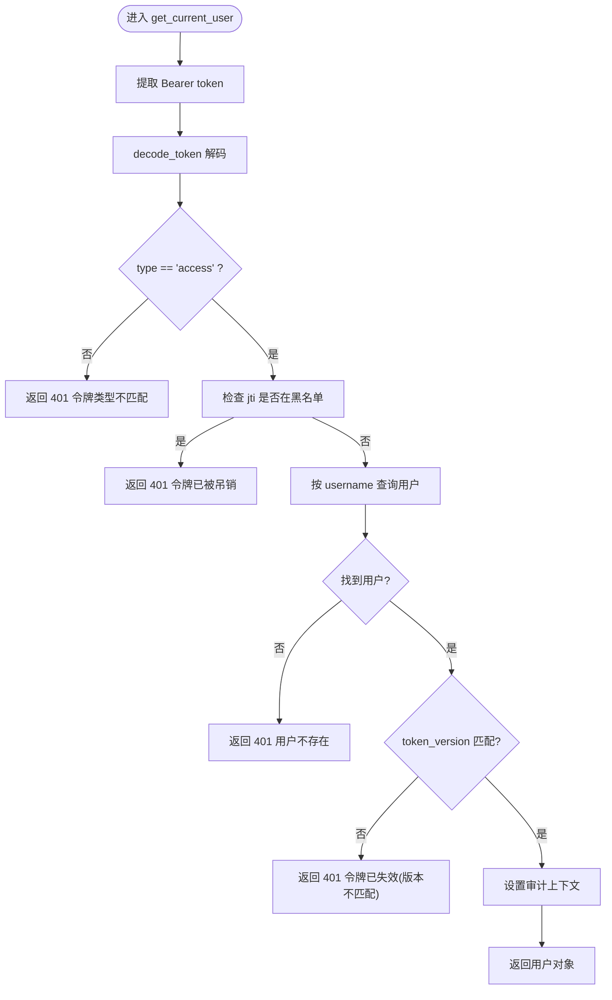
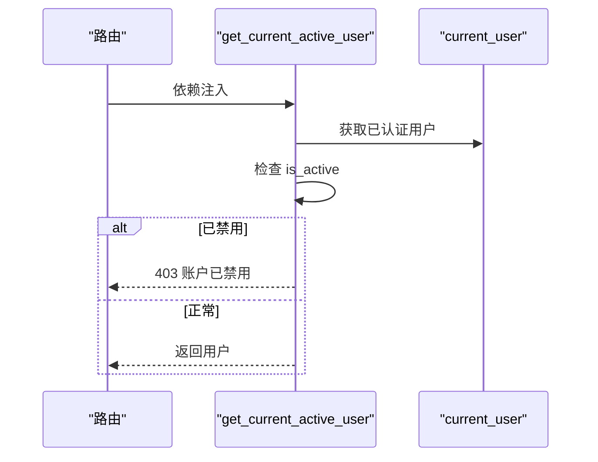
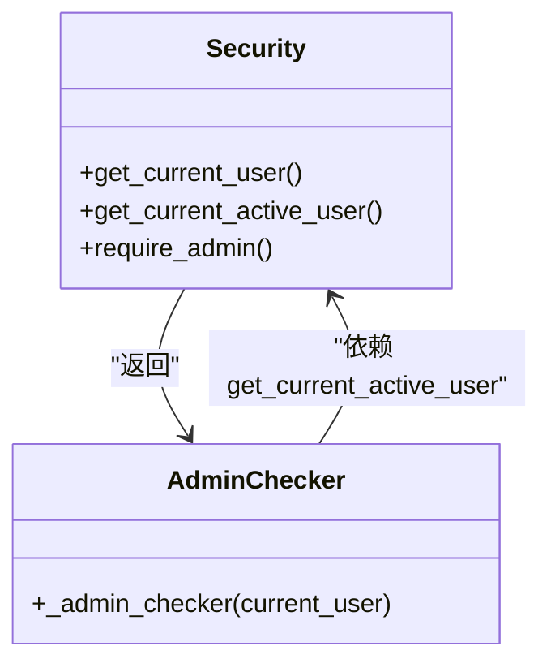
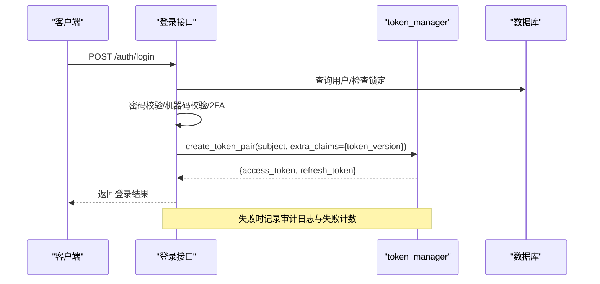
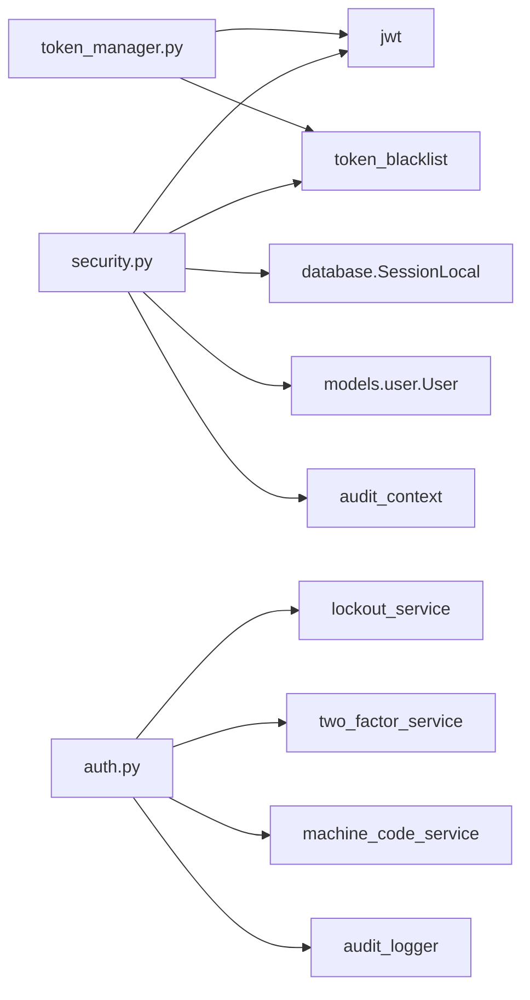

# 认证依赖注入

<cite>
**本文引用的文件**
- [security.py](file://backend/app/core/security.py)
- [auth.py](file://backend/app/api/v1/auth/auth.py)
- [token_manager.py](file://backend/app/core/token_manager.py)
- [user.py](file://backend/app/models/user.py)
- [ai.py](file://backend/app/api/v1/ai.py)
</cite>

## 目录
1. [简介](#简介)
2. [项目结构](#项目结构)
3. [核心组件](#核心组件)
4. [架构总览](#架构总览)
5. [详细组件分析](#详细组件分析)
6. [依赖关系分析](#依赖关系分析)
7. [性能考虑](#性能考虑)
8. [故障排查指南](#故障排查指南)
9. [结论](#结论)
10. [附录：使用示例与扩展方法](#附录使用示例与扩展方法)

## 简介
本文件聚焦于后端 FastAPI 的认证依赖注入实现，围绕以下目标展开：
- 详解 get_current_user 与 get_current_active_user 的实现机制，包括 Bearer 令牌提取、JWT 解码校验、黑名单与版本控制、用户状态检查。
- 解释 require_admin 权限检查器的设计原理：角色验证、管理员判断、访问控制策略。
- 提供在 API 中使用这些依赖的示例，并给出自定义认证中间件的扩展建议。

## 项目结构
认证相关代码主要分布在以下模块：
- 安全与依赖：core/security.py（Bearer 提取、JWT 解码、依赖函数、速率限制等）
- 认证接口：api/v1/auth/auth.py（登录、刷新、登出、CSRF 等）
- 令牌管理：core/token_manager.py（统一签发、校验、吊销、刷新）
- 用户模型：models/user.py（用户字段、token_version_safe 等）
- 依赖使用示例：api/v1/ai.py（多处通过 Depends(get_current_user) 保护端点）

图表来源
- [security.py:243-371](file://backend/app/core/security.py#L243-L371)
- [auth.py:101-287](file://backend/app/api/v1/auth/auth.py#L101-L287)
- [token_manager.py:64-127](file://backend/app/core/token_manager.py#L64-L127)

章节来源
- [security.py:243-371](file://backend/app/core/security.py#L243-L371)
- [auth.py:101-287](file://backend/app/api/v1/auth/auth.py#L101-L287)
- [token_manager.py:64-127](file://backend/app/core/token_manager.py#L64-L127)

## 核心组件
- get_current_user：从请求头提取 Bearer token，解码 JWT，校验类型与黑名单，按用户名查询用户，校验 token_version，设置审计上下文，返回用户对象。
- get_current_active_user：在已认证基础上检查 is_active，禁用账户直接拒绝。
- require_admin：依赖工厂，内部依赖 get_current_active_user，校验 role 或 is_superuser，未授权返回 403。
- token_manager：统一封装 access/refresh token 的签发、校验、吊销、刷新；支持黑名单持久化与类型校验。
- 认证接口：登录流程包含速率限制、密码校验、机器码绑定、可选双因素、签发双 token、审计日志；登出会吊销当前 token 并递增 token_version 使该用户所有旧 token 失效。

章节来源
- [security.py:243-371](file://backend/app/core/security.py#L243-L371)
- [token_manager.py:64-127](file://backend/app/core/token_manager.py#L64-L127)
- [auth.py:101-287](file://backend/app/api/v1/auth/auth.py#L101-L287)

## 架构总览
下图展示一次受保护 API 调用的完整调用链：客户端携带 Bearer token 访问受保护端点，FastAPI 通过依赖注入执行 get_current_user，完成 JWT 解码、黑名单与版本校验后返回用户对象；若需要管理员权限，再经 require_admin 进行角色判定。

图表来源
- [security.py:243-336](file://backend/app/core/security.py#L243-L336)
- [token_manager.py:135-168](file://backend/app/core/token_manager.py#L135-L168)
- [user.py:141-148](file://backend/app/models/user.py#L141-L148)

## 详细组件分析

### get_current_user：Bearer 提取与 JWT 验证
- 从 HTTP 请求中通过 HTTPBearer 自动提取 Authorization 头中的 Bearer token。
- 使用 token_manager.decode_token 解码并校验类型必须为 access。
- 校验黑名单：若 jti 存在且已被加入黑名单，则拒绝。
- 查询用户：按 sub（username）查询数据库，不存在则拒绝。
- 版本控制：对比 token 中的 token_version 与用户的 token_version_safe，不匹配或缺失时按策略拒绝（fail-closed）。
- 审计归因：将当前用户 ID 写入审计上下文，便于后续写操作可追责到人。
- 资源释放：确保数据库会话关闭。

图表来源
- [security.py:243-336](file://backend/app/core/security.py#L243-L336)
- [token_manager.py:135-168](file://backend/app/core/token_manager.py#L135-L168)

章节来源
- [security.py:243-336](file://backend/app/core/security.py#L243-L336)
- [token_manager.py:135-168](file://backend/app/core/token_manager.py#L135-L168)

### get_current_active_user：活跃状态检查
- 依赖 get_current_user 获取已认证用户。
- 若用户 is_active 为 False，返回 403 禁止访问。
- 否则返回用户对象供后续业务使用。

图表来源
- [security.py:339-347](file://backend/app/core/security.py#L339-L347)

章节来源
- [security.py:339-347](file://backend/app/core/security.py#L339-L347)

### require_admin：管理员权限检查器
- 作为依赖工厂返回一个异步检查器，内部依赖 get_current_active_user。
- 校验逻辑：
  - 若 current_user 为空，返回 401。
  - 读取 role 与 is_superuser，若 role 不在管理员集合且 is_superuser 为 False，返回 403。
- 管理员角色集合来自常量定义，同时兼容超级管理员标记。

图表来源
- [security.py:350-371](file://backend/app/core/security.py#L350-L371)

章节来源
- [security.py:350-371](file://backend/app/core/security.py#L350-L371)

### 认证接口与令牌生命周期
- 登录：
  - 速率限制：同一 IP 每分钟最多 5 次尝试。
  - 用户查找与激活状态检查。
  - 账户锁定检查：基于配置的最大失败次数与锁定时间。
  - 密码校验：错误时记录失败计数与审计日志。
  - 机器码绑定校验：未授权机器拒绝登录。
  - 可选双因素：返回临时令牌用于后续 TOTP 验证。
  - 签发双 token：access_token 与 refresh_token，附带 token_version。
  - 审计日志：记录登录成功/失败。
- 刷新：
  - 仅接受 refresh_token，校验类型与黑名单。
  - 吊销旧 refresh_token（轮换），签发新 pair。
- 登出：
  - 吊销当前 access_token。
  - 递增用户 token_version，使该用户所有现存 JWT 立即失效。
  - 审计日志记录登出。

图表来源
- [auth.py:101-287](file://backend/app/api/v1/auth/auth.py#L101-L287)
- [token_manager.py:64-127](file://backend/app/core/token_manager.py#L64-L127)

章节来源
- [auth.py:101-287](file://backend/app/api/v1/auth/auth.py#L101-L287)
- [token_manager.py:64-127](file://backend/app/core/token_manager.py#L64-L127)

### 依赖使用示例
- 在任意路由中通过 Depends(get_current_user) 获取当前用户，例如 AI 模块的多处端点。
- 在需要管理员权限的路由中通过 Depends(require_admin()) 进行权限校验。

章节来源
- [ai.py:40-141](file://backend/app/api/v1/ai.py#L40-L141)

## 依赖关系分析
- security.py 依赖：
  - fastapi.security.HTTPBearer 提取 Bearer token。
  - jwt 解码与异常处理。
  - token_blacklist 检查黑名单。
  - database.SessionLocal 与 models.user.User 查询用户。
  - middleware.audit_context 设置审计上下文。
- auth.py 依赖：
  - core.config.settings 读取锁定策略与过期策略。
  - services.lockout_service 原子更新失败计数与锁定。
  - services.two_factor_service 双因素校验。
  - services.machine_code_service 机器码绑定校验。
  - utils.audit_logger 审计日志。
- token_manager.py 依赖：
  - core.token_blacklist 持久化黑名单。
  - jwt 编码/解码。
  - core.config.settings 读取密钥与算法。

图表来源
- [security.py:243-371](file://backend/app/core/security.py#L243-L371)
- [auth.py:101-287](file://backend/app/api/v1/auth/auth.py#L101-L287)
- [token_manager.py:64-127](file://backend/app/core/token_manager.py#L64-L127)

章节来源
- [security.py:243-371](file://backend/app/core/security.py#L243-L371)
- [auth.py:101-287](file://backend/app/api/v1/auth/auth.py#L101-L287)
- [token_manager.py:64-127](file://backend/app/core/token_manager.py#L64-L127)

## 性能考虑
- 黑名单与版本控制：
  - 黑名单检查在解码后立即进行，避免无效请求进入业务层。
  - token_version 比较为轻量整数比较，开销极低。
- 数据库访问：
  - 仅在 get_current_user 中按需查询用户，并在 finally 中关闭会话，减少连接占用。
- 速率限制：
  - 登录、注册、刷新、CSRF 等关键路径均实施滑动窗口限流，防止暴力攻击与资源耗尽。
- 审计上下文：
  - 通过 ContextVar 设置当前用户 ID，避免额外 IO，仅在写操作时读取。

[本节为通用性能讨论，无需特定文件引用]

## 故障排查指南
- 401 未认证：
  - 检查 Authorization 头是否正确携带 Bearer token。
  - 确认 token 未被吊销（黑名单）或类型不匹配。
  - 确认 token_version 与用户当前版本一致。
- 403 禁止访问：
  - 检查用户 is_active 是否为 True。
  - 检查 require_admin 的角色与 is_superuser 是否符合要求。
- 登录失败：
  - 查看失败计数与锁定状态，确认是否达到最大失败次数。
  - 检查机器码绑定与双因素验证码。
- 刷新失败：
  - 确认传入的是 refresh_token 而非 access_token。
  - 检查旧 refresh_token 是否已被吊销（轮换机制）。

章节来源
- [security.py:243-371](file://backend/app/core/security.py#L243-L371)
- [auth.py:101-287](file://backend/app/api/v1/auth/auth.py#L101-L287)
- [token_manager.py:135-168](file://backend/app/core/token_manager.py#L135-L168)

## 结论
本项目采用 FastAPI 依赖注入模式实现统一的认证与授权：
- get_current_user 负责 Bearer 提取、JWT 解码、黑名单与版本控制、用户查询与审计归因。
- get_current_active_user 在认证基础上增加活跃状态检查。
- require_admin 提供细粒度的管理员权限校验，结合角色与超级管理员标记。
- token_manager 统一管理令牌生命周期，支持吊销与刷新，配合黑名单与 token_version 实现强一致的访问控制。
- 认证接口覆盖登录、刷新、登出全流程，并集成速率限制、锁定策略、机器码绑定与双因素认证。

[本节为总结性内容，无需特定文件引用]

## 附录：使用示例与扩展方法

### 在路由中使用认证依赖
- 普通受保护端点：
  - 使用 Depends(get_current_user) 获取当前用户。
  - 示例参考：AI 模块多个端点通过此依赖保护。
- 管理员端点：
  - 使用 Depends(require_admin()) 进行管理员权限校验。
  - 适用于系统管理、敏感数据操作等场景。

章节来源
- [ai.py:40-141](file://backend/app/api/v1/ai.py#L40-L141)
- [security.py:350-371](file://backend/app/core/security.py#L350-L371)

### 自定义认证中间件扩展建议
- 在 get_current_user 的基础上，可增加：
  - 设备指纹校验：结合机器码与服务端指纹，增强会话可信度。
  - 地理围栏：根据请求来源 IP 判断是否允许访问。
  - 动态策略：根据组织、部门、数据范围动态调整权限。
- 在 require_admin 的基础上，可扩展：
  - 基于资源的权限：如“仅能编辑本部门项目”。
  - 基于时间的权限：如“仅在工作时间内允许修改配置”。
  - 多因子组合：角色+组织+数据范围+行为频率。

[本节为概念性扩展建议，无需特定文件引用]