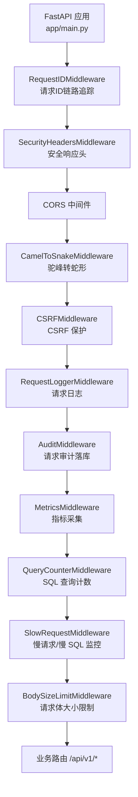
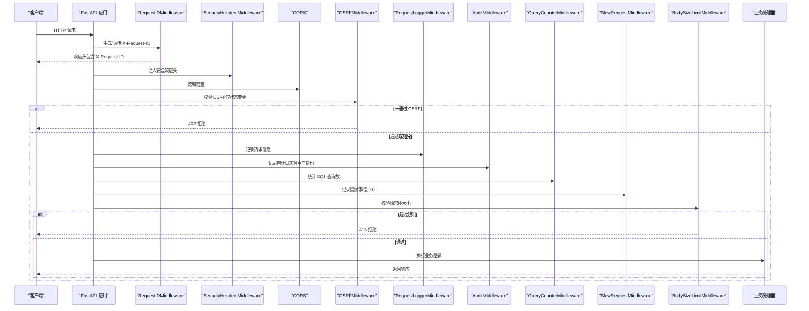
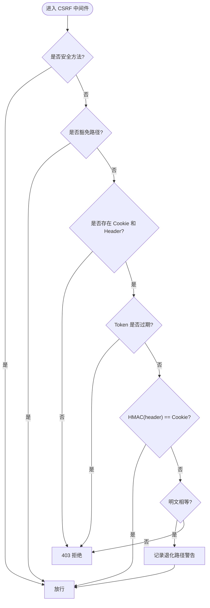
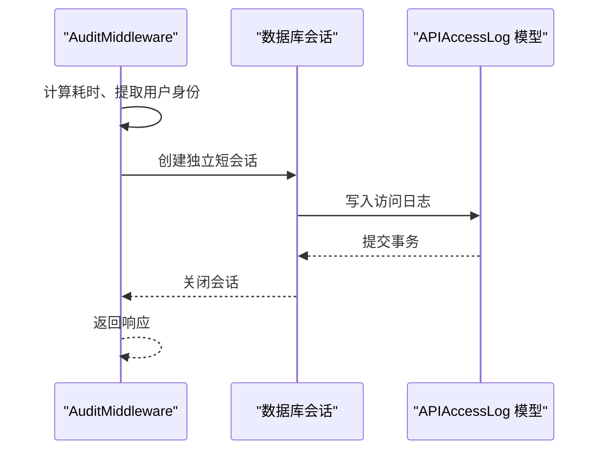
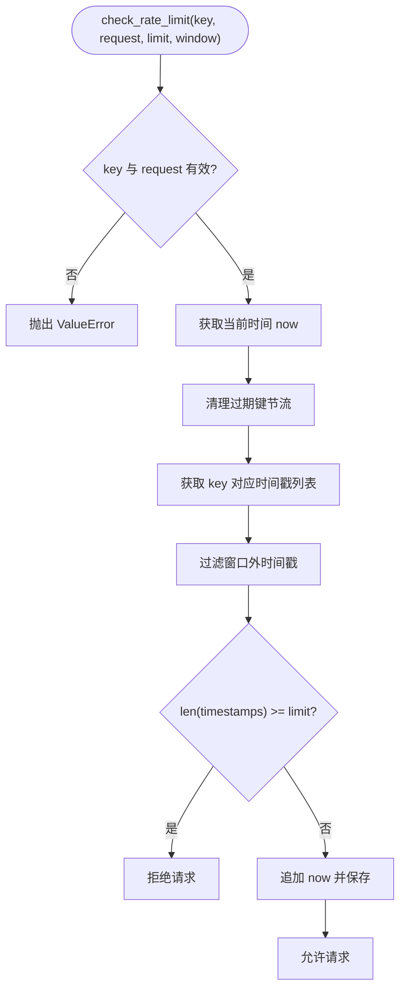
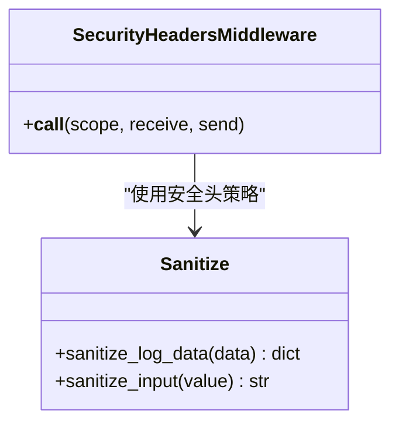
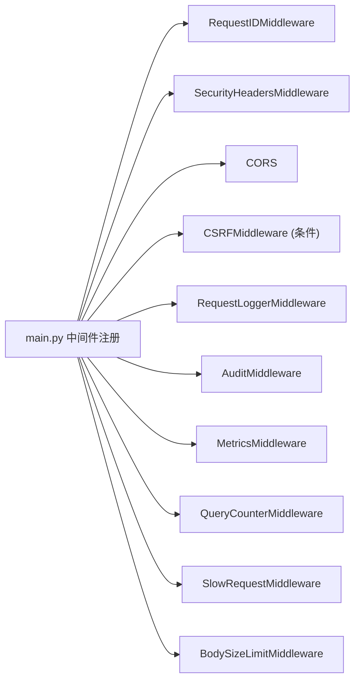

# 安全中间件

<cite>
**本文引用的文件**
- [backend/app/main.py](file://backend/app/main.py)
- [backend/app/middleware/csrf_middleware.py](file://backend/app/middleware/csrf_middleware.py)
- [backend/app/core/audit_middleware.py](file://backend/app/core/audit_middleware.py)
- [backend/app/middleware/body_size_limit.py](file://backend/app/middleware/body_size_limit.py)
- [backend/app/middleware/cache_headers.py](file://backend/app/middleware/cache_headers.py)
- [backend/app/middleware/request_id.py](file://backend/app/middleware/request_id.py)
- [backend/app/middleware/request_logger.py](file://backend/app/middleware/request_logger.py)
- [backend/app/middleware/slow_request_monitor.py](file://backend/app/middleware/slow_request_monitor.py)
- [backend/app/middleware/query_counter.py](file://backend/app/middleware/query_counter.py)
- [backend/app/core/security.py](file://backend/app/core/security.py)
- [backend/app/core/config.py](file://backend/app/core/config.py)
</cite>

## 目录
1. [简介](#简介)
2. [项目结构](#项目结构)
3. [核心组件](#核心组件)
4. [架构总览](#架构总览)
5. [详细组件分析](#详细组件分析)
6. [依赖关系分析](#依赖关系分析)
7. [性能考量](#性能考量)
8. [故障排查指南](#故障排查指南)
9. [结论](#结论)
10. [附录：自定义安全中间件编写与集成示例](#附录自定义安全中间件编写与集成示例)

## 简介
本文件面向后端服务的安全中间件体系，系统性说明 CSRF 防护、请求审计、速率限制、输入验证、安全响应头、敏感数据脱敏、SQL 注入防护等能力，并给出中间件链式处理顺序、错误处理策略与性能优化建议。同时提供自定义安全中间件的编写指南与集成方式，帮助开发者在现有 FastAPI/Starlette 栈上快速扩展安全能力。

## 项目结构
本项目将安全相关能力以“中间件 + 核心工具”的方式组织：
- 中间件层：CSRF、请求审计、请求体大小限制、缓存头、请求 ID 追踪、请求日志、慢请求/慢 SQL 监控、查询计数等
- 核心安全模块：JWT、密码策略、敏感字段脱敏、安全响应头、内置速率限制器、客户端 IP 获取等
- 应用入口：统一注册中间件顺序，确保最外层先执行（如请求 ID），最内层包裹业务逻辑（如审计、监控）

图表来源
- [backend/app/main.py:113-165](file://backend/app/main.py#L113-L165)
- [backend/app/middleware/request_id.py:40-119](file://backend/app/middleware/request_id.py#L40-L119)
- [backend/app/core/security.py:598-636](file://backend/app/core/security.py#L598-L636)
- [backend/app/middleware/csrf_middleware.py:177-284](file://backend/app/middleware/csrf_middleware.py#L177-L284)
- [backend/app/core/audit_middleware.py:11-44](file://backend/app/core/audit_middleware.py#L11-L44)
- [backend/app/middleware/query_counter.py:39-77](file://backend/app/middleware/query_counter.py#L39-L77)
- [backend/app/middleware/slow_request_monitor.py:55-132](file://backend/app/middleware/slow_request_monitor.py#L55-L132)
- [backend/app/middleware/body_size_limit.py:48-79](file://backend/app/middleware/body_size_limit.py#L48-L79)

章节来源
- [backend/app/main.py:113-165](file://backend/app/main.py#L113-L165)

## 核心组件
- CSRF 保护：基于 Double Submit Cookie + HMAC 签名校验，支持过期检测与旧版明文兼容回退
- 请求审计：记录方法、路径、状态码、耗时、用户身份，并落库到访问日志表
- 速率限制：内存滑动窗口限流，默认 60 次/分钟，支持按 key（IP/用户名）隔离
- 输入验证与安全头：敏感字段脱敏、SQL 注入模式检测、安全响应头注入
- 请求体大小限制：非上传端点限制请求体大小，防止超大 JSON 攻击
- 缓存头：为静态/低变化接口添加 Cache-Control，减少重复查询
- 请求 ID 与日志：为每个请求生成唯一 ID，贯穿日志与响应头，便于问题定位
- 慢请求/慢 SQL 监控：记录超过阈值的 API 与 SQL，辅助性能优化
- 查询计数：统计每次请求的 SQL 数量，识别 N+1 问题

章节来源
- [backend/app/middleware/csrf_middleware.py:177-284](file://backend/app/middleware/csrf_middleware.py#L177-L284)
- [backend/app/core/audit_middleware.py:11-44](file://backend/app/core/audit_middleware.py#L11-L44)
- [backend/app/core/security.py:439-488](file://backend/app/core/security.py#L439-L488)
- [backend/app/core/security.py:180-202](file://backend/app/core/security.py#L180-L202)
- [backend/app/core/security.py:379-411](file://backend/app/core/security.py#L379-L411)
- [backend/app/middleware/body_size_limit.py:48-79](file://backend/app/middleware/body_size_limit.py#L48-L79)
- [backend/app/middleware/cache_headers.py:20-31](file://backend/app/middleware/cache_headers.py#L20-L31)
- [backend/app/middleware/request_id.py:40-119](file://backend/app/middleware/request_id.py#L40-L119)
- [backend/app/middleware/slow_request_monitor.py:55-132](file://backend/app/middleware/slow_request_monitor.py#L55-L132)
- [backend/app/middleware/query_counter.py:39-77](file://backend/app/middleware/query_counter.py#L39-L77)

## 架构总览
下图展示了请求进入应用后，经过各安全中间件的完整链路，以及关键决策点（如 CSRF 校验、大小限制、审计落库）。

图表来源
- [backend/app/main.py:113-165](file://backend/app/main.py#L113-L165)
- [backend/app/middleware/csrf_middleware.py:177-284](file://backend/app/middleware/csrf_middleware.py#L177-L284)
- [backend/app/core/audit_middleware.py:11-44](file://backend/app/core/audit_middleware.py#L11-L44)
- [backend/app/middleware/body_size_limit.py:48-79](file://backend/app/middleware/body_size_limit.py#L48-L79)
- [backend/app/middleware/request_id.py:40-119](file://backend/app/middleware/request_id.py#L40-L119)
- [backend/app/middleware/query_counter.py:39-77](file://backend/app/middleware/query_counter.py#L39-L77)
- [backend/app/middleware/slow_request_monitor.py:55-132](file://backend/app/middleware/slow_request_monitor.py#L55-L132)

## 详细组件分析

### CSRF 保护中间件
- 机制：Double Submit Cookie + HMAC 签名校验。前端 GET 获取 raw_token，服务端设置 csrftoken Cookie = HMAC(raw_token)，请求时携带 X-CSRF-Token = raw_token；服务端计算 HMAC(header) 并与 cookie 比较（常量时间比较防时序攻击）
- 过期检测：token 格式 {timestamp}.{random}，超过 CSRF_TOKEN_EXPIRY（默认 24h）即拒绝
- 豁免路径：认证、健康检查、文档等路径不校验
- 兼容降级：若 cookie/header 为明文（旧版），回退明文比对并记录警告日志
- 代理信任：支持 TRUSTED_PROXIES 配置，仅在可信代理下读取 X-Forwarded-For

图表来源
- [backend/app/middleware/csrf_middleware.py:65-124](file://backend/app/middleware/csrf_middleware.py#L65-L124)
- [backend/app/middleware/csrf_middleware.py:177-284](file://backend/app/middleware/csrf_middleware.py#L177-L284)

章节来源
- [backend/app/middleware/csrf_middleware.py:177-284](file://backend/app/middleware/csrf_middleware.py#L177-L284)

### 请求审计中间件
- 功能：记录方法、路径、状态码、耗时、用户身份；落库到 api_access_logs
- 用户身份提取：从 Authorization: Bearer <token> 解析 JWT，忽略过期校验用于审计
- 容错设计：落库失败仅记录 WARNING，绝不破坏业务请求

图表来源
- [backend/app/core/audit_middleware.py:11-44](file://backend/app/core/audit_middleware.py#L11-L44)
- [backend/app/core/audit_middleware.py:79-109](file://backend/app/core/audit_middleware.py#L79-L109)

章节来源
- [backend/app/core/audit_middleware.py:11-44](file://backend/app/core/audit_middleware.py#L11-L44)
- [backend/app/core/audit_middleware.py:79-109](file://backend/app/core/audit_middleware.py#L79-L109)

### 速率限制（内置内存滑动窗口）
- 算法：滑动窗口，维护每个 key 的时间戳列表，窗口内超过 limit 则拒绝
- 清理策略：周期性清理过期键，防止内存泄漏
- 调用约定：必须传入 key（如 IP/用户名）与 request，缺失则抛出异常（fail-closed）
- 默认参数：60 次/分钟，可配置

图表来源
- [backend/app/core/security.py:419-488](file://backend/app/core/security.py#L419-L488)

章节来源
- [backend/app/core/security.py:419-488](file://backend/app/core/security.py#L419-L488)

### 输入验证与安全头
- 敏感数据脱敏：sanitize_log_data 对敏感字段进行替换，避免日志泄露
- SQL 注入防护：提供常见 SQL 注入模式集合与 sanitize_input 清理函数
- 安全响应头：SecurityHeadersMiddleware 注入 X-Content-Type-Options、X-Frame-Options、Referrer-Policy 等，并对静态资源与参考数据设置合适的 Cache-Control

图表来源
- [backend/app/core/security.py:598-636](file://backend/app/core/security.py#L598-L636)
- [backend/app/core/security.py:180-202](file://backend/app/core/security.py#L180-L202)
- [backend/app/core/security.py:379-411](file://backend/app/core/security.py#L379-L411)

章节来源
- [backend/app/core/security.py:598-636](file://backend/app/core/security.py#L598-L636)
- [backend/app/core/security.py:180-202](file://backend/app/core/security.py#L180-L202)
- [backend/app/core/security.py:379-411](file://backend/app/core/security.py#L379-L411)

### 请求体大小限制
- 策略：非 multipart/form-data 且不在大负载白名单的路径，超过 10MB 返回 413
- 白名单：导入导出、批量操作、系统备份等路径允许更大负载

章节来源
- [backend/app/middleware/body_size_limit.py:48-79](file://backend/app/middleware/body_size_limit.py#L48-L79)

### 缓存头中间件
- 策略：为筛选选项、组织树、静态资源等路径添加 Cache-Control，减少重复查询
- 注意：统计/概览类端点不缓存，保证增删改后立即可见

章节来源
- [backend/app/middleware/cache_headers.py:20-31](file://backend/app/middleware/cache_headers.py#L20-L31)

### 请求 ID 与日志
- 请求 ID：优先使用客户端传入的合法 X-Request-ID，否则生成 UUID；注入响应头与日志上下文
- 慢请求告警：超过阈值记录警告
- 请求日志：记录方法、路径、查询参数、客户端 IP、UA、状态码、耗时

章节来源
- [backend/app/middleware/request_id.py:40-119](file://backend/app/middleware/request_id.py#L40-L119)
- [backend/app/middleware/request_logger.py:52-114](file://backend/app/middleware/request_logger.py#L52-L114)

### 慢请求/慢 SQL 监控
- 慢 API：记录超过阈值的 API 请求，环形缓冲区存储最近 N 条
- 慢 SQL：通过 SQLAlchemy before/after_cursor_execute 事件捕获慢查询，记录 SQL 片段与参数

章节来源
- [backend/app/middleware/slow_request_monitor.py:55-132](file://backend/app/middleware/slow_request_monitor.py#L55-L132)

### 查询计数中间件
- 机制：通过 SQLAlchemy after_cursor_execute 事件递增计数器，合并到 request.state.query_count
- 输出：响应头 X-Query-Count、X-Response-Time；超阈值记录警告

章节来源
- [backend/app/middleware/query_counter.py:39-77](file://backend/app/middleware/query_counter.py#L39-L77)

## 依赖关系分析
- 中间件注册顺序由 main.py 控制，遵循 Starlette 逆序执行原则，确保最外层先执行（如 RequestID），最内层包裹业务逻辑（如 Audit、Metrics）
- 安全头中间件位于 CORS 之后，确保所有响应均带有安全头
- CSRF 中间件仅在 settings.CSRF_ENABLED=True 时注册，避免 BaseHTTPMiddleware 在某些环境下的协议错误
- 审计中间件依赖 JWT 解码与数据库会话，但采用独立短会话与 fail-safe 策略，不影响主流程

图表来源
- [backend/app/main.py:113-165](file://backend/app/main.py#L113-L165)

章节来源
- [backend/app/main.py:113-165](file://backend/app/main.py#L113-L165)

## 性能考量
- 中间件开销：尽量将轻量级中间件置于外层（如 RequestID、Cache-Headers），重量级（如审计落库、慢 SQL 监听）置于内层以减少不必要开销
- 异步与事件：慢 SQL 监听通过 SQLAlchemy 事件钩子实现，零侵入；查询计数通过 contextvar 桥接事件与请求上下文
- 内存管理：速率限制器定期清理过期键，防止内存泄漏；慢请求/慢 SQL 使用环形缓冲区限制最大记录数
- 缓存策略：对静态与低变化数据启用 Cache-Control，降低数据库压力

[本节为通用指导，无需特定文件引用]

## 故障排查指南
- CSRF 验证失败：检查是否已调用 /api/v1/auth/csrf-token 获取 token，确认 X-CSRF-Token 与 csrftoken Cookie 匹配；查看日志中的退化路径警告
- 请求体过大：确认是否为文件上传或白名单路径；调整 BodySizeLimitMiddleware 的 max_body_size 或白名单
- 慢请求/慢 SQL：通过 SlowRequestMiddleware 与 QueryCounterMiddleware 的输出定位瓶颈；关注 X-Query-Count 与慢 SQL 日志
- 审计落库失败：检查数据库连接与权限；审计失败仅记录 WARNING，不影响业务
- 安全头缺失：确认 SecurityHeadersMiddleware 已注册且未被后续中间件覆盖

章节来源
- [backend/app/middleware/csrf_middleware.py:177-284](file://backend/app/middleware/csrf_middleware.py#L177-L284)
- [backend/app/middleware/body_size_limit.py:48-79](file://backend/app/middleware/body_size_limit.py#L48-L79)
- [backend/app/middleware/slow_request_monitor.py:55-132](file://backend/app/middleware/slow_request_monitor.py#L55-L132)
- [backend/app/middleware/query_counter.py:39-77](file://backend/app/middleware/query_counter.py#L39-L77)
- [backend/app/core/audit_middleware.py:79-109](file://backend/app/core/audit_middleware.py#L79-L109)

## 结论
本项目通过多层中间件与核心安全模块的组合，实现了全面的请求级安全防护与可观测性能力。CSRF 采用 HMAC 签名增强，审计与监控提供完整的请求溯源，速率限制与输入验证有效缓解滥用风险。建议在部署中严格启用 CSRF、合理配置速率限制阈值，并结合慢请求/慢 SQL 监控持续优化性能。

[本节为总结，无需特定文件引用]

## 附录：自定义安全中间件编写与集成示例
- 编写步骤
  - 继承 Starlette BaseHTTPMiddleware 或实现 ASGI 中间件接口
  - 在 dispatch/__call__ 中实现前置检查（如鉴权、限流、脱敏）与后置处理（如响应头注入、审计）
  - 保持 fail-safe 设计：异常不应阻断主流程，必要时降级或记录日志
- 集成方式
  - 在 main.py 中通过 app.add_middleware 注册，注意顺序：外层先执行（如请求 ID），内层包裹业务（如审计、监控）
  - 对于条件启用的中间件（如 CSRF），结合 settings 配置动态注册
- 示例参考
  - 请求 ID 中间件：生成/透传 X-Request-ID，注入日志上下文
  - 安全响应头中间件：注入安全头与缓存策略
  - 审计中间件：记录请求信息与用户身份，落库失败不影响业务

章节来源
- [backend/app/middleware/request_id.py:40-119](file://backend/app/middleware/request_id.py#L40-L119)
- [backend/app/core/security.py:598-636](file://backend/app/core/security.py#L598-L636)
- [backend/app/core/audit_middleware.py:11-44](file://backend/app/core/audit_middleware.py#L11-L44)
- [backend/app/main.py:113-165](file://backend/app/main.py#L113-L165)