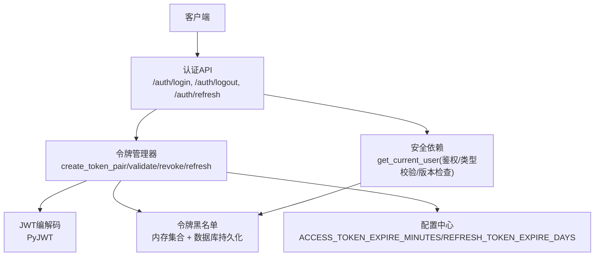
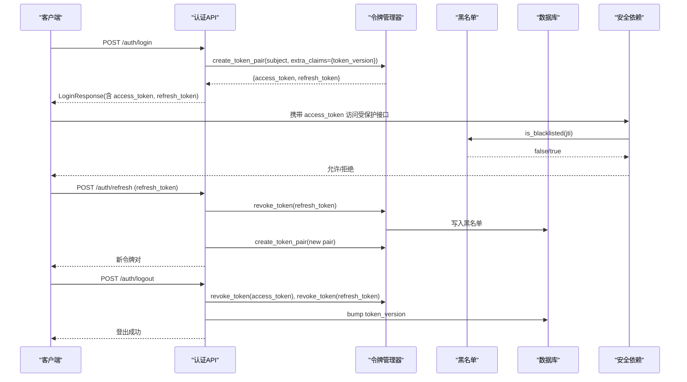
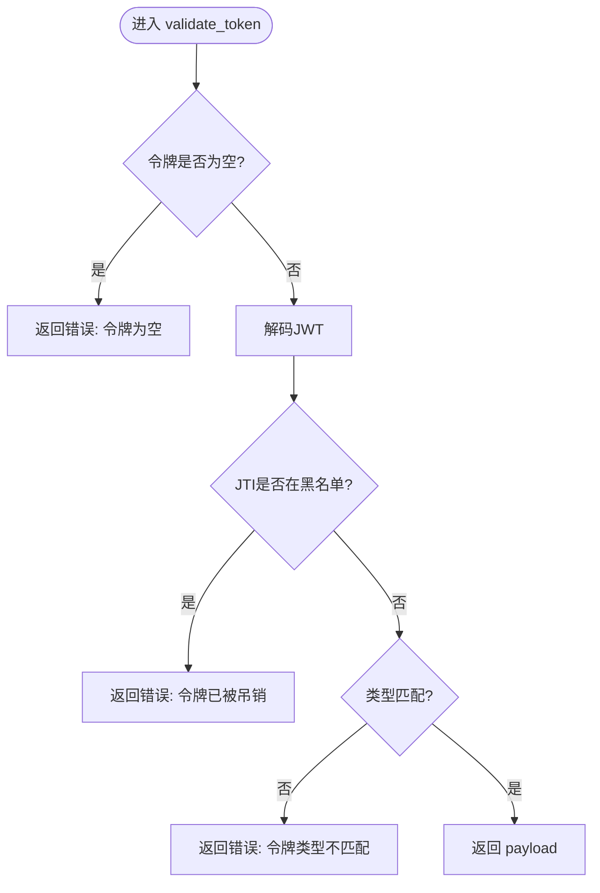
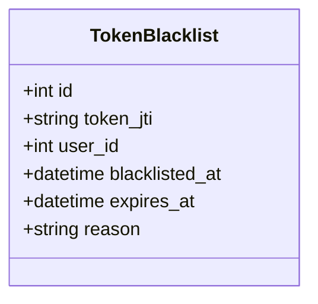
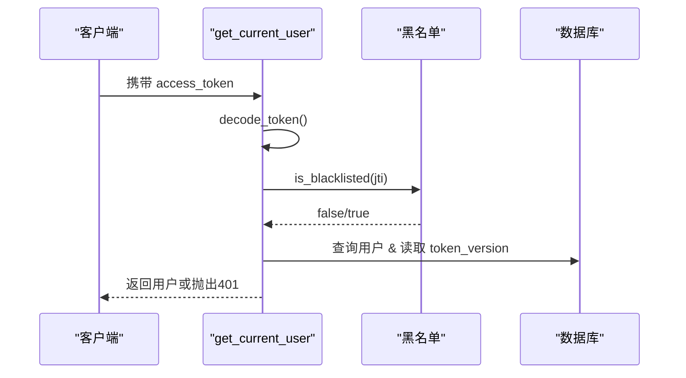
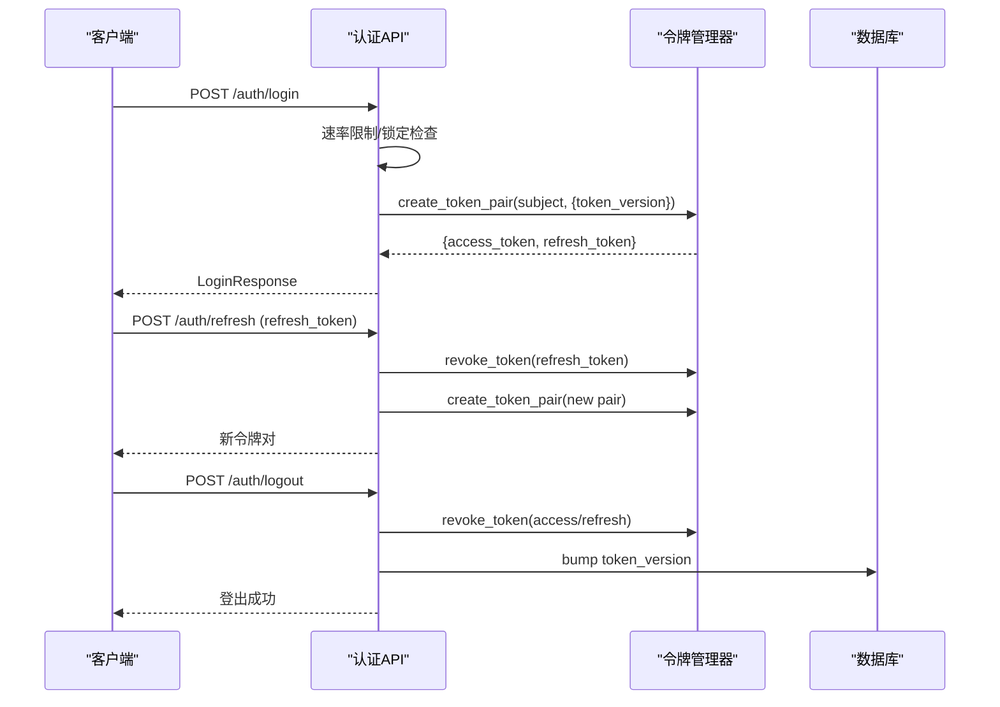
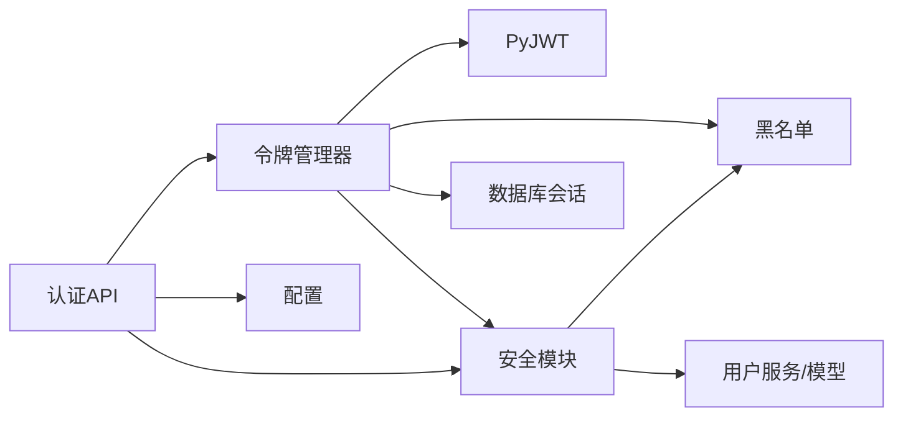

# 会话管理

<cite>
**本文引用的文件**
- [token_manager.py](file://backend/app/core/token_manager.py)
- [token_blacklist.py](file://backend/app/core/token_blacklist.py)
- [security.py](file://backend/app/core/security.py)
- [auth.py](file://backend/app/api/v1/auth/auth.py)
- [config.py](file://backend/app/core/config.py)
- [token_blacklist_model.py](file://backend/app/models/token_blacklist.py)
</cite>

## 目录
1. [简介](#简介)
2. [项目结构](#项目结构)
3. [核心组件](#核心组件)
4. [架构总览](#架构总览)
5. [详细组件分析](#详细组件分析)
6. [依赖关系分析](#依赖关系分析)
7. [性能与并发特性](#性能与并发特性)
8. [故障排查指南](#故障排查指南)
9. [结论](#结论)
10. [附录：配置与使用示例](#附录配置与使用示例)

## 简介
本章节面向“会话管理”能力，系统性说明基于 JWT 的双令牌（访问令牌 + 刷新令牌）架构、令牌生成与验证、黑名单管理、会话超时控制、令牌轮换、并发会话控制、令牌吊销与批量失效、安全清理等运维管理能力。文档同时提供配置项与使用示例，帮助开发者与运维人员正确部署与维护。

## 项目结构
与会话管理直接相关的后端代码主要分布在以下模块：
- 令牌管理与双令牌签发/刷新/吊销：backend/app/core/token_manager.py
- 令牌黑名单（内存+数据库持久化）：backend/app/core/token_blacklist.py、backend/app/models/token_blacklist.py
- 认证与安全中间件、FastAPI 依赖：backend/app/core/security.py
- 认证 API（登录、登出、刷新、CSRF 等）：backend/app/api/v1/auth/auth.py
- 应用配置（令牌有效期、锁定时长等）：backend/app/core/config.py

图表来源
- [auth.py:101-287](file://backend/app/api/v1/auth/auth.py#L101-L287)
- [auth.py:570-689](file://backend/app/api/v1/auth/auth.py#L570-L689)
- [token_manager.py:64-240](file://backend/app/core/token_manager.py#L64-L240)
- [security.py:243-336](file://backend/app/core/security.py#L243-L336)
- [config.py:127-134](file://backend/app/core/config.py#L127-L134)

章节来源
- [auth.py:101-287](file://backend/app/api/v1/auth/auth.py#L101-L287)
- [auth.py:570-689](file://backend/app/api/v1/auth/auth.py#L570-L689)
- [token_manager.py:64-240](file://backend/app/core/token_manager.py#L64-L240)
- [security.py:243-336](file://backend/app/core/security.py#L243-L336)
- [config.py:127-134](file://backend/app/core/config.py#L127-L134)

## 核心组件
- 令牌管理器（TokenManager）：封装双令牌的创建、校验、吊销、刷新；支持额外声明注入（如 token_version），并负责将吊销信息持久化到数据库。
- 令牌黑名单：内存集合存储已吊销的 JTI，启动时从数据库加载未过期条目；每次查询会清理过期条目，保证内存可控。
- 安全依赖（get_current_user）：统一鉴权入口，校验令牌类型、黑名单、用户状态、token_version，确保强制下线生效。
- 认证API：提供登录、登出、刷新、CSRF 获取等接口，集成速率限制、账户锁定、审计日志等安全能力。
- 配置：集中定义令牌有效期、密码策略、锁定时长、CORS、CSRF、速率限制等。

章节来源
- [token_manager.py:1-283](file://backend/app/core/token_manager.py#L1-L283)
- [token_blacklist.py:1-163](file://backend/app/core/token_blacklist.py#L1-L163)
- [security.py:243-336](file://backend/app/core/security.py#L243-L336)
- [auth.py:101-287](file://backend/app/api/v1/auth/auth.py#L101-L287)
- [config.py:127-134](file://backend/app/core/config.py#L127-L134)

## 架构总览
系统采用“无状态鉴权 + 可撤销令牌”的混合模式：
- 访问令牌（access_token）：短生命周期，用于资源访问。
- 刷新令牌（refresh_token）：较长生命周期，用于换取新的访问令牌对。
- 黑名单：通过 JTI（唯一标识）实现即时吊销，支持内存+数据库持久化，重启后仍有效。
- 会话控制：通过 token_version 字段实现“一键踢出所有会话”，结合黑名单达到强一致失效。

图表来源
- [auth.py:101-287](file://backend/app/api/v1/auth/auth.py#L101-L287)
- [auth.py:570-689](file://backend/app/api/v1/auth/auth.py#L570-L689)
- [token_manager.py:64-240](file://backend/app/core/token_manager.py#L64-L240)
- [token_blacklist.py:73-103](file://backend/app/core/token_blacklist.py#L73-L103)
- [security.py:243-336](file://backend/app/core/security.py#L243-L336)

## 详细组件分析

### 令牌管理器（TokenManager）
- 双令牌生成：create_token_pair 为同一 subject 签发 access 与 refresh 令牌，分别设置不同 TTL，并注入 jti、type、iat、exp 等标准声明，以及可选 extra_claims（如 token_version）。
- 令牌校验：validate_token 使用 PyJWT 解码，校验类型（access/refresh）、黑名单（JTI）、签名与过期时间。
- 令牌吊销：revoke_token 解码（忽略过期）提取 jti，加入内存黑名单并持久化到数据库，记录原因与过期时间。
- 令牌刷新：refresh_access_token 校验 refresh 令牌，吊销旧 refresh（轮换机制），签发新令牌对。
- 向后兼容：提供 TokenManager 类及实例 token_manager，兼容历史调用方式。

图表来源
- [token_manager.py:135-169](file://backend/app/core/token_manager.py#L135-L169)

章节来源
- [token_manager.py:64-240](file://backend/app/core/token_manager.py#L64-L240)

### 令牌黑名单（内存+数据库）
- 内存存储：以 JTI -> expires_at_epoch 的字典存储，线程安全（加锁），定期清理过期条目。
- 数据库持久化：启动时从数据库加载未过期条目到内存；新增吊销时异步持久化，失败不影响主流程。
- 数据模型：token_blacklist 表包含 jti、user_id、blacklisted_at、expires_at、reason 等字段，并提供复合索引优化查询。

图表来源
- [token_blacklist_model.py:13-61](file://backend/app/models/token_blacklist.py#L13-L61)

章节来源
- [token_blacklist.py:27-126](file://backend/app/core/token_blacklist.py#L27-L126)
- [token_blacklist_model.py:13-61](file://backend/app/models/token_blacklist.py#L13-L61)

### 安全依赖与鉴权流程（get_current_user）
- 提取 Bearer 令牌，解码并校验类型必须为 access。
- 检查黑名单（JTI），若存在则拒绝。
- 校验 token_version：若用户 token_version > 0 而令牌缺少或版本不一致，立即拒绝（强制下线）。
- 延迟导入用户服务，查询用户并设置审计上下文。

图表来源
- [security.py:243-336](file://backend/app/core/security.py#L243-L336)

章节来源
- [security.py:243-336](file://backend/app/core/security.py#L243-L336)

### 认证API（登录、登出、刷新）
- 登录：校验用户名密码、机器码绑定、2FA（可选），成功后签发双令牌并返回用户信息。
- 登出：吊销当前请求的 access/refresh 令牌，递增 token_version 使该用户全部现存令牌失效，记录审计日志。
- 刷新：仅接受 refresh_token，校验通过后吊销旧 refresh（轮换），签发新令牌对。
- CSRF：提供获取 CSRF token 的接口，并在响应中设置 Cookie，后续状态变更请求需携带 X-CSRF-Token。

图表来源
- [auth.py:101-287](file://backend/app/api/v1/auth/auth.py#L101-L287)
- [auth.py:570-689](file://backend/app/api/v1/auth/auth.py#L570-L689)

章节来源
- [auth.py:101-287](file://backend/app/api/v1/auth/auth.py#L101-L287)
- [auth.py:570-689](file://backend/app/api/v1/auth/auth.py#L570-L689)

## 依赖关系分析
- 令牌管理器依赖：
  - PyJWT：编解码 JWT。
  - 安全模块：SECRET_KEY、ALGORITHM。
  - 黑名单模块：is_blacklisted、add、add_to_db。
  - 数据库会话：SessionLocal（持久化黑名单）。
- 安全依赖依赖：
  - 黑名单模块：is_blacklisted。
  - 用户模型与服务：查询用户、审计上下文。
- 认证API依赖：
  - 令牌管理器：create_token_pair、revoke_token、decode_token。
  - 安全模块：check_rate_limit、get_client_ip、verify_password。
  - 用户服务：查询用户、更新状态。
  - 配置：MAX_FAILED_LOGIN_ATTEMPTS、ACCOUNT_LOCKOUT_MINUTES、PASSWORD_EXPIRE_DAYS。

图表来源
- [token_manager.py:1-283](file://backend/app/core/token_manager.py#L1-L283)
- [security.py:243-336](file://backend/app/core/security.py#L243-L336)
- [auth.py:101-287](file://backend/app/api/v1/auth/auth.py#L101-L287)

章节来源
- [token_manager.py:1-283](file://backend/app/core/token_manager.py#L1-L283)
- [security.py:243-336](file://backend/app/core/security.py#L243-L336)
- [auth.py:101-287](file://backend/app/api/v1/auth/auth.py#L101-L287)

## 性能与并发特性
- 黑名单内存结构：dict 存储 JTI -> 过期时间戳，O(1) 查找；每次查询触发 _cleanup_expired 清理过期条目，避免内存泄漏。
- 并发安全：使用 threading.Lock 保护黑名单读写，防止多线程下 KeyError。
- 数据库负载：黑名单持久化在吊销时进行，失败不影响主流程；启动时批量加载未过期条目，减少重复写入。
- 速率限制：登录、注册、刷新、CSRF 均启用速率限制，防止暴力破解与滥用。
- 令牌有效期：默认访问令牌 480 分钟（8小时），刷新令牌 30 天；可通过配置调整。

[本节为通用性能讨论，无需特定文件引用]

## 故障排查指南
- 令牌无效或过期：
  - 检查 ACCESS_TOKEN_EXPIRE_MINUTES、REFRESH_TOKEN_EXPIRE_DAYS 配置是否合理。
  - 确认服务端时钟同步，避免本地时间与服务器时间偏差导致提前过期。
- 令牌被吊销：
  - 检查黑名单是否包含对应 JTI；查看数据库 token_blacklist 表记录。
  - 确认登出逻辑是否正确调用 revoke_token 并持久化。
- 强制下线未生效：
  - 确认 get_current_user 中 token_version 校验逻辑是否执行。
  - 检查登出时是否调用 bump token_version。
- 刷新失败：
  - 确认传入的是 refresh_token，而非 access_token。
  - 检查刷新频率是否超过速率限制。
- 登录失败过多：
  - 检查账户锁定策略（MAX_FAILED_LOGIN_ATTEMPTS、ACCOUNT_LOCKOUT_MINUTES）。
  - 查看审计日志定位失败原因。

章节来源
- [config.py:127-134](file://backend/app/core/config.py#L127-L134)
- [security.py:243-336](file://backend/app/core/security.py#L243-L336)
- [auth.py:101-287](file://backend/app/api/v1/auth/auth.py#L101-L287)
- [token_blacklist.py:73-103](file://backend/app/core/token_blacklist.py#L73-L103)

## 结论
本会话管理系统基于 JWT 双令牌架构，结合黑名单与 token_version 机制，实现了细粒度的会话控制与即时吊销能力。通过内存+数据库的黑名单持久化，系统在重启后仍能保持吊销一致性；通过速率限制与账户锁定，增强了抗攻击能力。配置灵活、扩展性强，适合单机与分布式部署场景。

[本节为总结性内容，无需特定文件引用]

## 附录：配置与使用示例

### 关键配置项
- 令牌有效期：
  - ACCESS_TOKEN_EXPIRE_MINUTES：访问令牌有效期（分钟），默认 480。
  - REFRESH_TOKEN_EXPIRE_DAYS：刷新令牌有效期（天），默认 30。
- 安全策略：
  - MAX_FAILED_LOGIN_ATTEMPTS：最大登录失败次数，默认 5。
  - ACCOUNT_LOCKOUT_MINUTES：账户锁定时长（分钟），默认 30。
  - PASSWORD_EXPIRE_DAYS：密码有效期（天），默认 90。
- CORS/CSRF：
  - CORS_ORIGINS、CORS_ALLOW_CREDENTIALS、CORS_ALLOW_METHODS、CORS_ALLOW_HEADERS。
  - CSRF_ENABLED、CSRF_SECRET_KEY。
- 速率限制：
  - RATE_LIMIT_ENABLED、RATE_LIMIT_PER_MINUTE、RATE_LIMIT_PER_HOUR。

章节来源
- [config.py:127-159](file://backend/app/core/config.py#L127-L159)

### 使用示例（概念性描述）
- 登录：
  - 调用 POST /api/v1/auth/login，提交用户名与密码。
  - 成功后返回 access_token 与 refresh_token。
- 刷新令牌：
  - 调用 POST /api/v1/auth/refresh，提交 refresh_token。
  - 成功后返回新的 access_token 与 refresh_token。
- 登出：
  - 调用 POST /api/v1/auth/logout，携带 access_token（可选 refresh_token）。
  - 系统将吊销令牌并递增 token_version，使该用户所有会话失效。
- 访问受保护接口：
  - 在请求头中携带 Authorization: Bearer <access_token>。
  - 系统将校验令牌类型、黑名单、token_version。

[本节为概念性使用示例，无需特定文件引用]