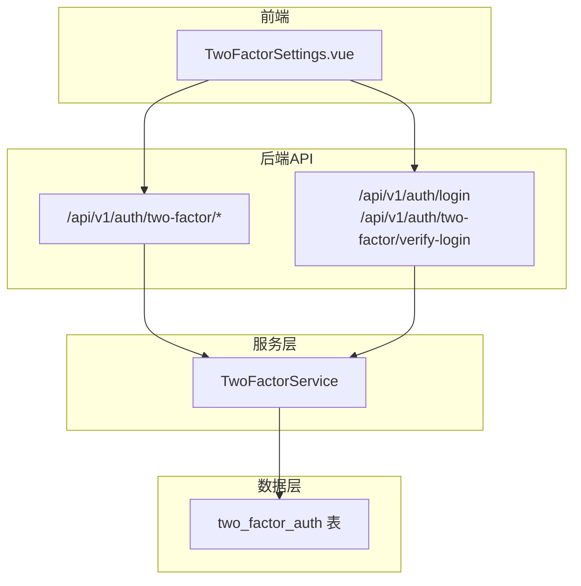
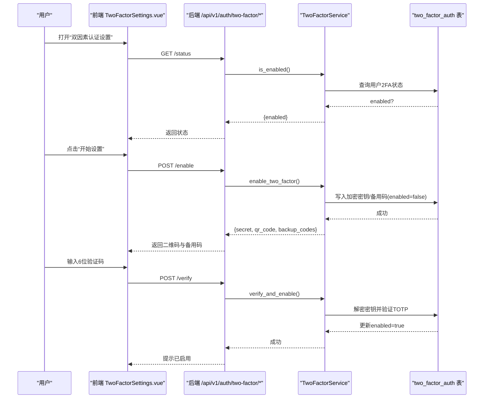
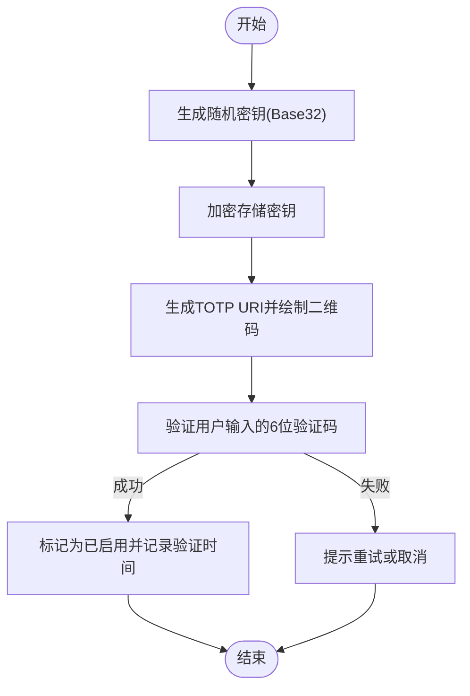
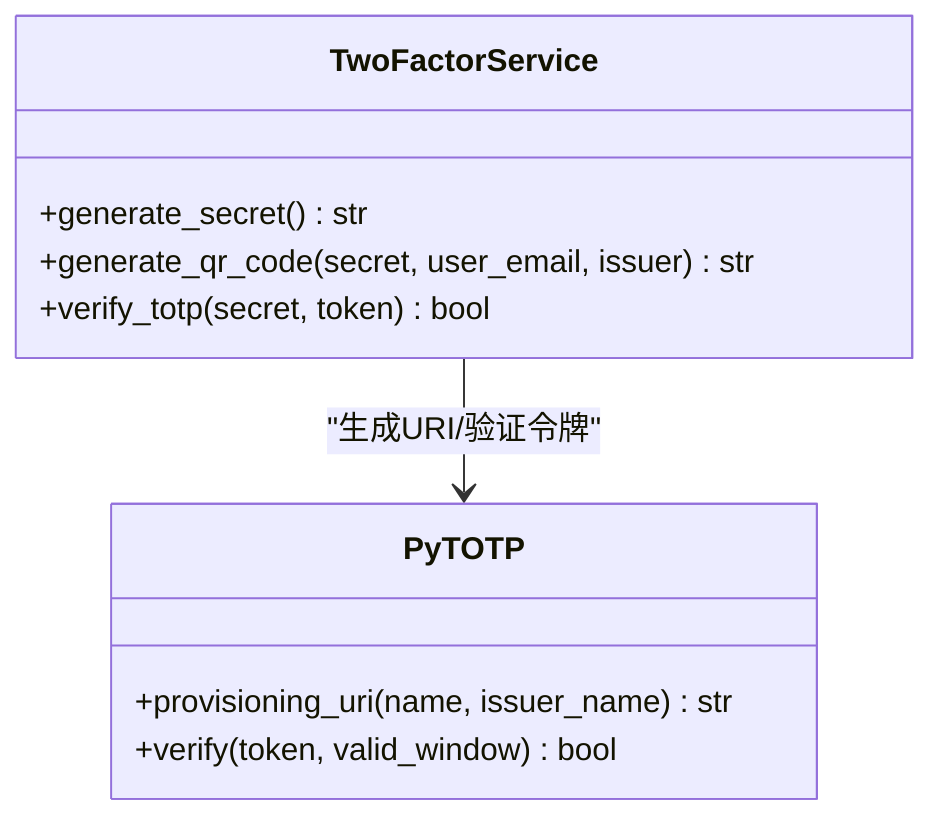
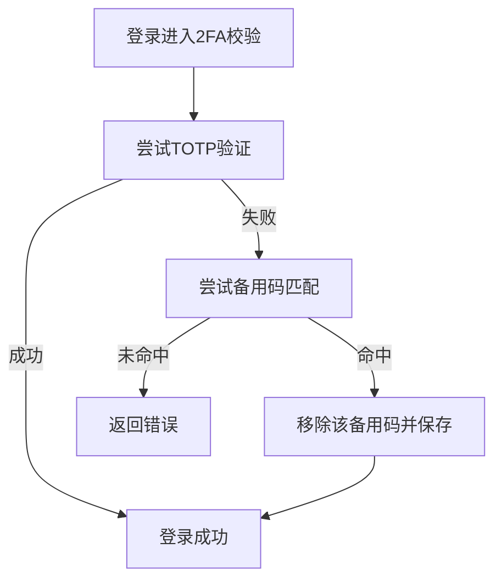
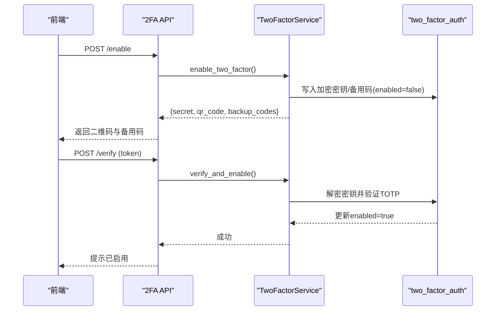
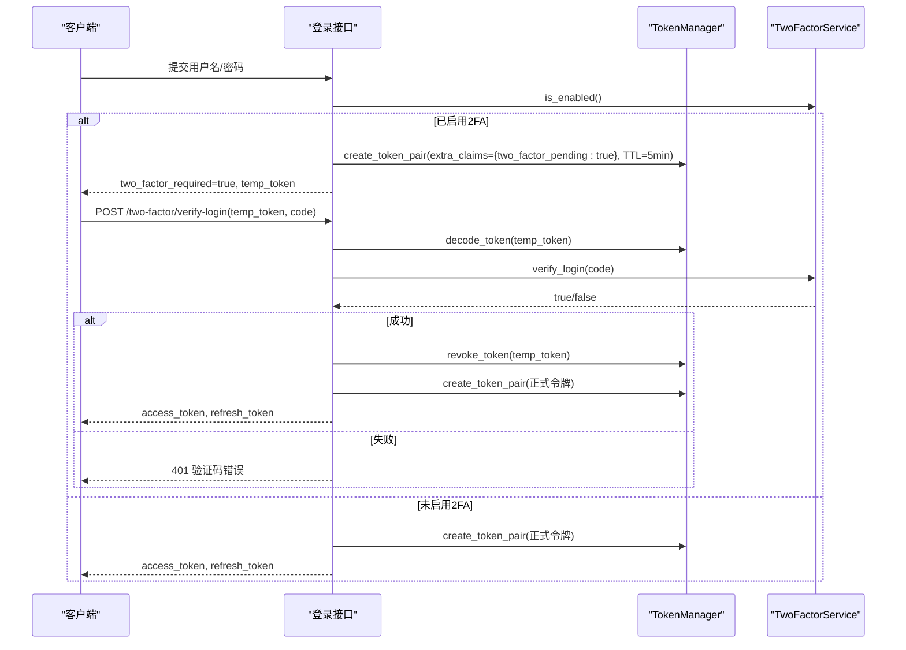
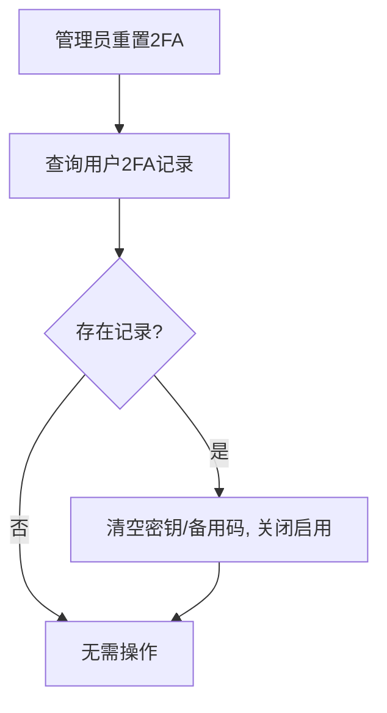
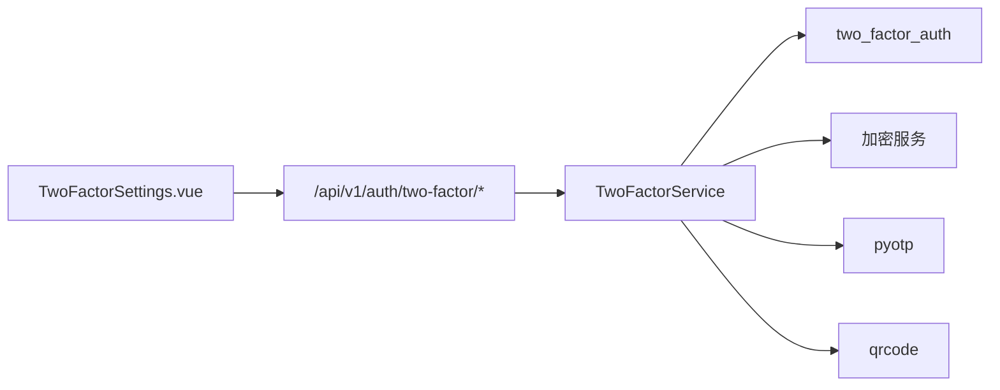

# 双因素认证

<cite>
**本文引用的文件**
- [two_factor_service.py](file://backend/app/services/two_factor_service.py)
- [two_factor_auth.py](file://backend/app/models/two_factor_auth.py)
- [two_factor.py](file://backend/app/api/v1/auth/two_factor.py)
- [auth.py](file://backend/app/api/v1/auth/auth.py)
- [admin.py](file://backend/app/api/v1/system/admin.py)
- [TwoFactorSettings.vue](file://frontend/src/views/auth/TwoFactorSettings.vue)
- [test_two_factor_service.py](file://backend/tests/unit/test_two_factor_service.py)
- [test_auth_2fa_api_cov.py](file://backend/tests/unit/test_auth_2fa_api_cov.py)
</cite>

## 目录
1. [简介](#简介)
2. [项目结构](#项目结构)
3. [核心组件](#核心组件)
4. [架构总览](#架构总览)
5. [详细组件分析](#详细组件分析)
6. [依赖关系分析](#依赖关系分析)
7. [性能与安全性考虑](#性能与安全性考虑)
8. [故障排查指南](#故障排查指南)
9. [结论](#结论)
10. [附录：API使用示例与集成指南](#附录api使用示例与集成指南)

## 简介
本系统实现了基于时间的一次性密码（TOTP）的双因素认证（2FA），涵盖密钥生成、二维码生成与扫描、备用恢复码管理、启用/验证/禁用流程，以及登录时的临时令牌机制。前端提供可视化设置页面，后端通过服务层封装算法与持久化逻辑，并通过REST API暴露能力。管理员具备重置用户2FA的能力，以支持恢复场景。

## 项目结构
围绕双因素认证的关键文件分布如下：
- 服务层：实现TOTP算法、二维码生成、备用码生成、启用/验证/禁用等核心逻辑
- 数据模型：定义双因素认证表结构与字段
- API层：暴露启用、验证、禁用、状态查询接口；登录流程中集成2FA校验与临时令牌
- 前端：提供设置页，引导用户扫码、输入验证码、查看并复制备用码
- 测试：覆盖服务方法与API路径的多种分支

**图表来源**
- [two_factor.py:1-88](file://backend/app/api/v1/auth/two_factor.py#L1-L88)
- [auth.py:200-399](file://backend/app/api/v1/auth/auth.py#L200-L399)
- [two_factor_service.py:1-251](file://backend/app/services/two_factor_service.py#L1-L251)
- [two_factor_auth.py:1-40](file://backend/app/models/two_factor_auth.py#L1-L40)
- [TwoFactorSettings.vue:1-200](file://frontend/src/views/auth/TwoFactorSettings.vue#L1-L200)

**章节来源**
- [two_factor_service.py:1-251](file://backend/app/services/two_factor_service.py#L1-L251)
- [two_factor_auth.py:1-40](file://backend/app/models/two_factor_auth.py#L1-L40)
- [two_factor.py:1-88](file://backend/app/api/v1/auth/two_factor.py#L1-L88)
- [auth.py:200-399](file://backend/app/api/v1/auth/auth.py#L200-L399)
- [TwoFactorSettings.vue:1-200](file://frontend/src/views/auth/TwoFactorSettings.vue#L1-L200)

## 核心组件
- TwoFactorService：封装TOTP密钥生成、二维码生成、备用码生成、启用/验证/禁用、登录时校验等核心方法
- TwoFactorAuth 模型：存储用户2FA配置（加密密钥、备用码、启用状态、验证时间等）
- 2FA API：提供启用、验证、禁用、状态查询接口
- 登录流程集成：在密码通过后检查是否启用2FA，必要时签发短期临时令牌，二次验证后签发正式令牌
- 前端设置页：引导用户扫码、输入验证码、展示并复制备用码，支持禁用2FA

**章节来源**
- [two_factor_service.py:23-251](file://backend/app/services/two_factor_service.py#L23-L251)
- [two_factor_auth.py:13-35](file://backend/app/models/two_factor_auth.py#L13-L35)
- [two_factor.py:15-88](file://backend/app/api/v1/auth/two_factor.py#L15-L88)
- [auth.py:200-399](file://backend/app/api/v1/auth/auth.py#L200-L399)
- [TwoFactorSettings.vue:120-200](file://frontend/src/views/auth/TwoFactorSettings.vue#L120-L200)

## 架构总览
下图展示了从前端到后端服务再到数据库的完整交互链路，包括启用2FA、验证2FA、登录时二次验证与临时令牌流转。

**图表来源**
- [two_factor.py:31-66](file://backend/app/api/v1/auth/two_factor.py#L31-L66)
- [two_factor_service.py:103-177](file://backend/app/services/two_factor_service.py#L103-L177)
- [two_factor_auth.py:18-35](file://backend/app/models/two_factor_auth.py#L18-L35)
- [TwoFactorSettings.vue:149-181](file://frontend/src/views/auth/TwoFactorSettings.vue#L149-L181)

## 详细组件分析

### TOTP 算法与密钥管理
- 密钥生成：使用安全随机数生成Base32格式的密钥，长度满足标准要求
- 密钥存储：密钥以密文形式持久化，读取时再解密，避免明文泄露
- 令牌验证：采用标准TOTP验证，允许一定时间窗口容错，确保不同步设备仍可验证

**图表来源**
- [two_factor_service.py:26-30](file://backend/app/services/two_factor_service.py#L26-L30)
- [two_factor_service.py:49-81](file://backend/app/services/two_factor_service.py#L49-L81)
- [two_factor_service.py:83-100](file://backend/app/services/two_factor_service.py#L83-L100)
- [two_factor_service.py:103-177](file://backend/app/services/two_factor_service.py#L103-L177)

**章节来源**
- [two_factor_service.py:26-100](file://backend/app/services/two_factor_service.py#L26-L100)
- [two_factor_service.py:103-177](file://backend/app/services/two_factor_service.py#L103-L177)

### 二维码生成与扫描
- 二维码内容：包含TOTP URI（含发行者名称与用户标识），便于验证器应用识别
- 懒加载策略：二维码库按需导入，避免模块初始化开销
- 输出格式：返回Data URL图片，前端可直接渲染

**图表来源**
- [two_factor_service.py:49-81](file://backend/app/services/two_factor_service.py#L49-L81)
- [two_factor_service.py:83-100](file://backend/app/services/two_factor_service.py#L83-L100)

**章节来源**
- [two_factor_service.py:49-100](file://backend/app/services/two_factor_service.py#L49-L100)

### 备用验证码管理
- 生成规则：默认生成10个8位数字恢复码，可自定义数量
- 使用策略：每次使用即删除，防止重复使用
- 登录流程：优先尝试TOTP，失败则尝试备用码

**图表来源**
- [two_factor_service.py:31-47](file://backend/app/services/two_factor_service.py#L31-L47)
- [two_factor_service.py:179-215](file://backend/app/services/two_factor_service.py#L179-L215)

**章节来源**
- [two_factor_service.py:31-47](file://backend/app/services/two_factor_service.py#L31-L47)
- [two_factor_service.py:179-215](file://backend/app/services/two_factor_service.py#L179-L215)

### 启用流程与验证过程
- 启用流程：调用启用接口生成密钥、二维码与备用码，状态为未启用；用户扫码并输入验证码后，服务端验证并标记为已启用
- 验证过程：先验证TOTP，再尝试备用码；成功后更新状态并记录验证时间

**图表来源**
- [two_factor.py:31-66](file://backend/app/api/v1/auth/two_factor.py#L31-L66)
- [two_factor_service.py:103-177](file://backend/app/services/two_factor_service.py#L103-L177)

**章节来源**
- [two_factor.py:31-66](file://backend/app/api/v1/auth/two_factor.py#L31-L66)
- [two_factor_service.py:103-177](file://backend/app/services/two_factor_service.py#L103-L177)

### 临时令牌机制（登录二次验证）
- 触发条件：密码与机器码通过后，若用户启用了2FA，则返回临时令牌（短时效，带特定声明）
- 二次验证：携带临时令牌与验证码调用专用端点，验证通过后吊销临时令牌并签发正式令牌
- 安全控制：速率限制、令牌类型校验、黑名单吊销

**图表来源**
- [auth.py:200-219](file://backend/app/api/v1/auth/auth.py#L200-L219)
- [auth.py:290-399](file://backend/app/api/v1/auth/auth.py#L290-L399)
- [token_manager.py:226-282](file://backend/app/core/token_manager.py#L226-L282)

**章节来源**
- [auth.py:200-219](file://backend/app/api/v1/auth/auth.py#L200-L219)
- [auth.py:290-399](file://backend/app/api/v1/auth/auth.py#L290-L399)
- [token_manager.py:226-282](file://backend/app/core/token_manager.py#L226-L282)

### 配置管理与设备绑定
- 配置项：每个用户一条记录，包含加密密钥、备用码列表、启用状态、验证时间戳
- 设备绑定：通过TOTP URI中的发行者与用户标识，使验证器应用正确识别账户
- 多设备支持：同一密钥可在多个验证器应用中同步生成相同验证码

**章节来源**
- [two_factor_auth.py:18-35](file://backend/app/models/two_factor_auth.py#L18-L35)
- [two_factor_service.py:49-81](file://backend/app/services/two_factor_service.py#L49-L81)

### 恢复机制与管理员重置
- 恢复方式：使用备用恢复码完成登录
- 管理员重置：管理员可重置用户的2FA配置（清空密钥与备用码，关闭启用状态）

**图表来源**
- [admin.py:475-500](file://backend/app/api/v1/system/admin.py#L475-L500)

**章节来源**
- [admin.py:475-500](file://backend/app/api/v1/system/admin.py#L475-L500)

## 依赖关系分析
- 服务层依赖：pyotp（TOTP）、qrcode（二维码）、加密服务（密钥加解密）、事务工具（安全提交）
- API层依赖：FastAPI路由、Pydantic模型、数据库会话、当前用户获取
- 模型层依赖：SQLAlchemy ORM、JSON字段、外键约束
- 前端依赖：Element Plus UI、剪贴板API、HTTP请求封装

**图表来源**
- [two_factor_service.py:1-20](file://backend/app/services/two_factor_service.py#L1-L20)
- [two_factor.py:1-14](file://backend/app/api/v1/auth/two_factor.py#L1-L14)
- [two_factor_auth.py:1-12](file://backend/app/models/two_factor_auth.py#L1-L12)
- [TwoFactorSettings.vue:120-140](file://frontend/src/views/auth/TwoFactorSettings.vue#L120-L140)

**章节来源**
- [two_factor_service.py:1-20](file://backend/app/services/two_factor_service.py#L1-L20)
- [two_factor.py:1-14](file://backend/app/api/v1/auth/two_factor.py#L1-L14)
- [two_factor_auth.py:1-12](file://backend/app/models/two_factor_auth.py#L1-L12)
- [TwoFactorSettings.vue:120-140](file://frontend/src/views/auth/TwoFactorSettings.vue#L120-L140)

## 性能与安全性考虑
- 性能
  - 二维码库懒加载，避免模块导入耗时影响启动与测试收集
  - 使用事务工具保证写操作的原子性与一致性
  - 登录二次验证端点实施速率限制，防止暴力破解
- 安全性
  - 密钥加密存储，读取时解密，降低泄露风险
  - 备用码一次性使用，减少重用风险
  - 临时令牌短时效且带特定声明，验证后立即吊销
  - 审计日志记录登录成功/失败及原因

[本节为通用指导，不直接分析具体文件]

## 故障排查指南
- 常见问题
  - 二维码无法显示：确认后端返回的是Data URL格式，前端使用标签渲染
  - 验证码无效：检查时间同步与时间窗口容错；确认TOTP密钥一致
  - 备用码失效：确认未被提前使用或被管理员重置
  - 临时令牌过期：重新登录获取新的临时令牌
- 定位步骤
  - 检查2FA状态接口返回是否正确
  - 核对启用流程中是否成功写入加密密钥与备用码
  - 查看登录二次验证端点的速率限制与令牌校验结果
  - 审查审计日志中的失败原因

**章节来源**
- [two_factor_service.py:83-100](file://backend/app/services/two_factor_service.py#L83-L100)
- [two_factor_service.py:179-215](file://backend/app/services/two_factor_service.py#L179-L215)
- [auth.py:290-399](file://backend/app/api/v1/auth/auth.py#L290-L399)

## 结论
本系统实现了完整的TOTP双因素认证能力，涵盖密钥管理、二维码生成、备用码机制、启用/验证/禁用流程以及登录时的临时令牌机制。前后端协作良好，具备必要的安全与性能优化措施，并提供管理员重置能力以支持恢复场景。建议在生产环境严格保护密钥与备用码，结合审计与监控提升整体安全性。

[本节为总结，不直接分析具体文件]

## 附录：API使用示例与集成指南

### 接口概览
- 启用2FA：POST /api/v1/auth/two-factor/enable
  - 响应：包含密钥、二维码Data URL、备用码列表
- 验证并启用：POST /api/v1/auth/two-factor/verify
  - 请求体：{ "token": "6位验证码" }
  - 响应：启用成功消息
- 禁用2FA：POST /api/v1/auth/two-factor/disable
  - 响应：禁用成功消息
- 查询状态：GET /api/v1/auth/two-factor/status
  - 响应：{ "enabled": boolean }

### 登录二次验证
- 首次登录：POST /api/v1/auth/login
  - 若用户启用2FA，返回 two_factor_required=true 与 temp_token
- 二次验证：POST /api/v1/auth/two-factor/verify-login
  - 请求体：{ "temp_token": "...", "code": "6位验证码或备用码" }
  - 响应：正式访问令牌与刷新令牌

### 前端集成要点
- 展示二维码：直接使用后端返回的Data URL
- 手动输入密钥：提供复制按钮，便于用户粘贴至验证器应用
- 备用码管理：提供一键复制全部备用码功能，提醒妥善保存
- 状态切换：根据状态动态显示启用/禁用入口

**章节来源**
- [two_factor.py:31-88](file://backend/app/api/v1/auth/two_factor.py#L31-L88)
- [auth.py:200-219](file://backend/app/api/v1/auth/auth.py#L200-L219)
- [auth.py:290-399](file://backend/app/api/v1/auth/auth.py#L290-L399)
- [TwoFactorSettings.vue:149-200](file://frontend/src/views/auth/TwoFactorSettings.vue#L149-L200)

### 测试参考
- 服务层单元测试：覆盖密钥生成、备用码生成、二维码生成、TOTP验证、启用/验证/禁用等分支
- API覆盖率测试：覆盖登录时2FA分支、二次验证端点各种异常与成功路径

**章节来源**
- [test_two_factor_service.py:5-302](file://backend/tests/unit/test_two_factor_service.py#L5-L302)
- [test_auth_2fa_api_cov.py:37-200](file://backend/tests/unit/test_auth_2fa_api_cov.py#L37-L200)