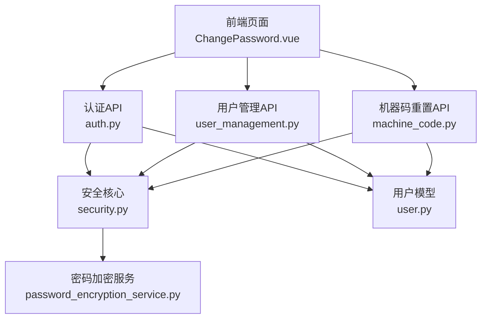
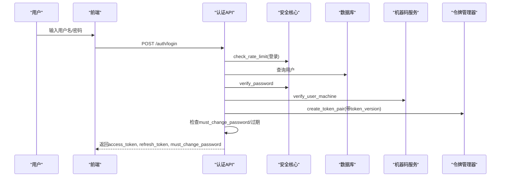
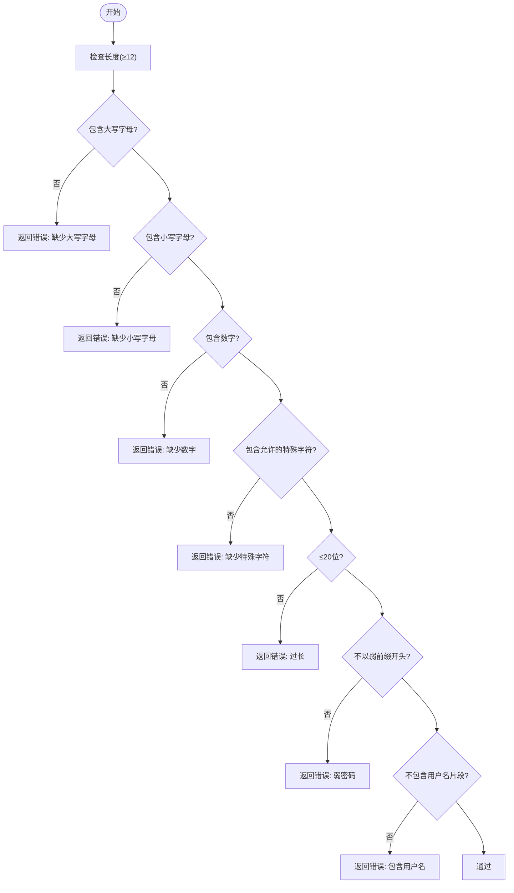
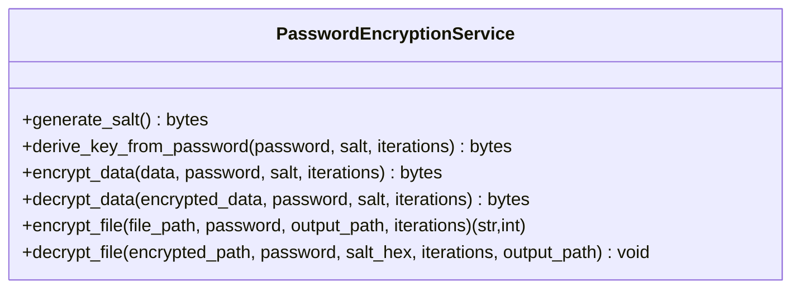
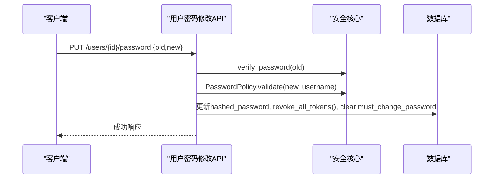
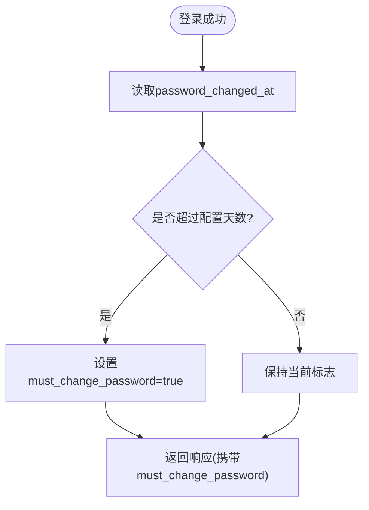
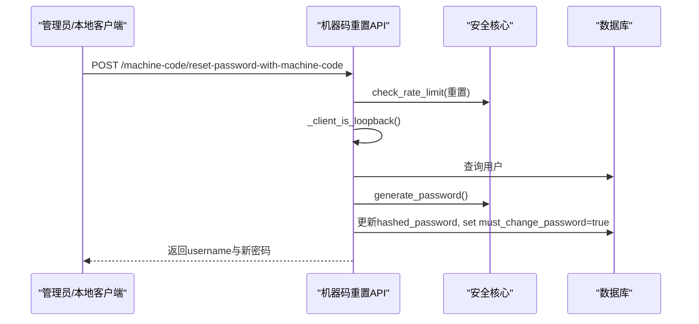
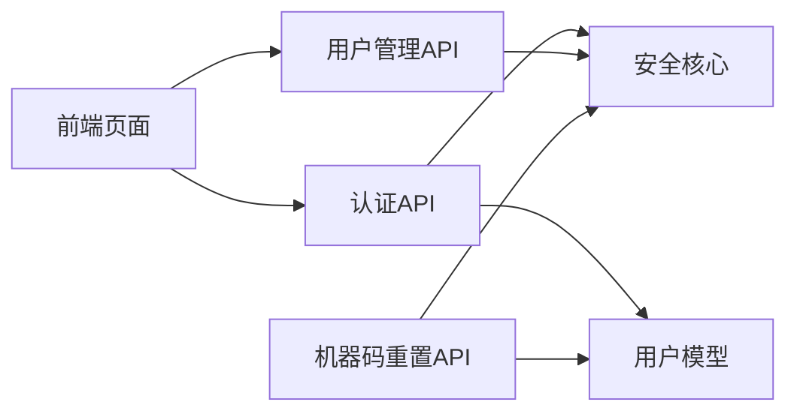

# 密码管理

<cite>
**本文引用的文件**
- [backend/app/core/security.py](file://backend/app/core/security.py)
- [backend/app/services/password_encryption_service.py](file://backend/app/services/password_encryption_service.py)
- [backend/app/api/v1/auth/auth.py](file://backend/app/api/v1/auth/auth.py)
- [backend/app/api/v1/auth/users.py](file://backend/app/api/v1/auth/users.py)
- [backend/app/api/v1/user_management.py](file://backend/app/api/v1/user_management.py)
- [backend/app/models/user.py](file://backend/app/models/user.py)
- [backend/app/api/v1/machine_code.py](file://backend/app/api/v1/machine_code.py)
- [frontend/src/views/auth/ChangePassword.vue](file://frontend/src/views/auth/ChangePassword.vue)
</cite>

## 目录
1. [简介](#简介)
2. [项目结构](#项目结构)
3. [核心组件](#核心组件)
4. [架构总览](#架构总览)
5. [详细组件分析](#详细组件分析)
6. [依赖关系分析](#依赖关系分析)
7. [性能与安全考量](#性能与安全考量)
8. [故障排查指南](#故障排查指南)
9. [结论](#结论)
10. [附录：API使用示例与最佳实践](#附录api使用示例与最佳实践)

## 简介
本文件面向密码管理功能，覆盖密码策略验证、加密存储、修改流程、过期检查、重置流程、邮箱验证（注册）、安全提示等。文档从系统架构到代码级实现进行分层说明，并提供流程图与时序图帮助理解关键路径。

## 项目结构
密码相关能力分布在以下层次：
- 安全与策略层：密码哈希、策略校验、速率限制、审计日志
- 服务层：用户服务、基于密码的加密服务
- API层：认证、用户管理、机器码重置
- 数据模型层：用户实体字段（含密码相关状态）
- 前端交互层：密码强度实时校验与提示

**图表来源**
- [backend/app/api/v1/auth/auth.py:101-287](file://backend/app/api/v1/auth/auth.py#L101-L287)
- [backend/app/api/v1/user_management.py:79-83](file://backend/app/api/v1/user_management.py#L79-L83)
- [backend/app/api/v1/machine_code.py:402-429](file://backend/app/api/v1/machine_code.py#L402-L429)
- [backend/app/core/security.py:122-173](file://backend/app/core/security.py#L122-L173)
- [backend/app/services/password_encryption_service.py:23-102](file://backend/app/services/password_encryption_service.py#L23-L102)
- [backend/app/models/user.py:78-83](file://backend/app/models/user.py#L78-L83)

**章节来源**
- [backend/app/core/security.py:122-173](file://backend/app/core/security.py#L122-L173)
- [backend/app/api/v1/auth/auth.py:101-287](file://backend/app/api/v1/auth/auth.py#L101-L287)
- [backend/app/api/v1/user_management.py:79-83](file://backend/app/api/v1/user_management.py#L79-L83)
- [backend/app/api/v1/machine_code.py:402-429](file://backend/app/api/v1/machine_code.py#L402-L429)
- [backend/app/services/password_encryption_service.py:23-102](file://backend/app/services/password_encryption_service.py#L23-L102)
- [backend/app/models/user.py:78-83](file://backend/app/models/user.py#L78-L83)

## 核心组件
- 密码策略验证：统一在安全核心中定义，包含长度、大小写、数字、特殊字符、弱前缀、用户名包含等规则，前后端保持一致。
- 密码加密存储：登录/注册/修改时通过 bcrypt 哈希存储；另提供基于 PBKDF2 + Fernet 的文件级加密服务用于敏感数据保护。
- 密码修改流程：需校验旧密码、新密码策略，成功后更新哈希并吊销令牌、清除强制修改标记。
- 密码过期检查：登录与二次认证通过后计算自上次修改时间是否超过配置周期，必要时强制修改。
- 密码重置流程：管理员重置或机器码“破窗”重置，均会生成强随机密码并强制首次登录修改。
- 邮箱验证：注册接口接受可选邮箱，配合通行码完成账户创建。
- 安全提示：前端实时强度指示器与后端错误信息联动，提升用户体验。

**章节来源**
- [backend/app/core/security.py:524-569](file://backend/app/core/security.py#L524-L569)
- [backend/app/services/password_encryption_service.py:23-102](file://backend/app/services/password_encryption_service.py#L23-L102)
- [backend/app/api/v1/auth/auth.py:256-287](file://backend/app/api/v1/auth/auth.py#L256-L287)
- [backend/app/api/v1/auth/users.py:771-796](file://backend/app/api/v1/auth/users.py#L771-L796)
- [backend/app/api/v1/user_management.py:348-384](file://backend/app/api/v1/user_management.py#L348-L384)
- [backend/app/api/v1/machine_code.py:402-429](file://backend/app/api/v1/machine_code.py#L402-L429)
- [frontend/src/views/auth/ChangePassword.vue:248-290](file://frontend/src/views/auth/ChangePassword.vue#L248-L290)

## 架构总览
密码管理的关键调用链如下：
- 登录/二次认证：鉴权 → 锁定检查 → 密码校验 → 机器码绑定检查 → 2FA → 签发令牌 → 密码过期检查 → 返回 must_change_password
- 修改密码：身份校验 → 旧密码校验 → 新密码策略校验 → 写入哈希 → 吊销令牌 → 清除强制修改标记
- 管理员重置：权限校验 → 生成/校验密码 → 写入哈希 → 返回新密码
- 机器码重置：限流 → 本机校验 → 机器码校验 → 生成强密码 → 写入哈希 → 强制首次修改

**图表来源**
- [backend/app/api/v1/auth/auth.py:101-287](file://backend/app/api/v1/auth/auth.py#L101-L287)
- [backend/app/core/security.py:140-148](file://backend/app/core/security.py#L140-L148)
- [backend/app/models/user.py:78-83](file://backend/app/models/user.py#L78-L83)

**章节来源**
- [backend/app/api/v1/auth/auth.py:101-287](file://backend/app/api/v1/auth/auth.py#L101-L287)

## 详细组件分析

### 密码策略验证（前后端一致）
- 后端策略：最小长度、必须包含大写/小写/数字/特殊字符、最大长度、弱前缀黑名单、禁止包含用户名片段。
- 前端强度：实时统计满足项数量，映射为弱/中/强等级，并在达到阈值时清除错误提示。
- 一致性保障：前端正则白名单与后端 SPECIAL_WHITELIST 对齐，避免策略分歧。

**图表来源**
- [backend/app/core/security.py:524-569](file://backend/app/core/security.py#L524-L569)
- [frontend/src/views/auth/ChangePassword.vue:248-290](file://frontend/src/views/auth/ChangePassword.vue#L248-L290)

**章节来源**
- [backend/app/core/security.py:524-569](file://backend/app/core/security.py#L524-L569)
- [frontend/src/views/auth/ChangePassword.vue:248-290](file://frontend/src/views/auth/ChangePassword.vue#L248-L290)

### 密码加密存储机制
- 登录/注册/修改：使用 bcrypt 哈希存储，支持长密码截断兼容，异常回退处理。
- 文件级加密：PBKDF2-HMAC-SHA256 派生密钥 + Fernet 对称加密，支持加解密文件，盐值与迭代次数持久化。

**图表来源**
- [backend/app/services/password_encryption_service.py:23-102](file://backend/app/services/password_encryption_service.py#L23-L102)
- [backend/app/services/password_encryption_service.py:139-206](file://backend/app/services/password_encryption_service.py#L139-L206)

**章节来源**
- [backend/app/services/password_encryption_service.py:23-102](file://backend/app/services/password_encryption_service.py#L23-L102)
- [backend/app/services/password_encryption_service.py:139-206](file://backend/app/services/password_encryption_service.py#L139-L206)

### 密码修改流程（用户自助）
- 前置条件：已认证用户可修改自身密码；管理员可修改他人密码。
- 步骤：校验旧密码 → 新密码策略校验 → 写入哈希 → 吊销所有令牌 → 清除 must_change_password → 提交事务。

**图表来源**
- [backend/app/api/v1/auth/users.py:771-796](file://backend/app/api/v1/auth/users.py#L771-L796)
- [backend/app/models/user.py:145-149](file://backend/app/models/user.py#L145-L149)

**章节来源**
- [backend/app/api/v1/auth/users.py:771-796](file://backend/app/api/v1/auth/users.py#L771-L796)
- [backend/app/models/user.py:145-149](file://backend/app/models/user.py#L145-L149)

### 密码过期检查与强制更改
- 登录与二次认证通过后，根据 last_login 与 password_changed_at 判断是否超过配置周期，若过期则 must_change_password=true。
- 首次登录或管理员重置后也会设置 must_change_password，引导用户立即修改。

**图表来源**
- [backend/app/api/v1/auth/auth.py:256-287](file://backend/app/api/v1/auth/auth.py#L256-L287)
- [backend/app/models/user.py:78-83](file://backend/app/models/user.py#L78-L83)

**章节来源**
- [backend/app/api/v1/auth/auth.py:256-287](file://backend/app/api/v1/auth/auth.py#L256-L287)
- [backend/app/models/user.py:78-83](file://backend/app/models/user.py#L78-L83)

### 密码重置流程（管理员与机器码）
- 管理员重置：仅管理员可操作，可选择自动生成强密码或指定新密码（需符合策略），成功后返回新密码。
- 机器码重置（破窗通道）：限流 + 本机校验 + 机器码校验，成功后生成强密码并强制首次修改。

**图表来源**
- [backend/app/api/v1/machine_code.py:402-429](file://backend/app/api/v1/machine_code.py#L402-L429)
- [backend/app/core/security.py:151-173](file://backend/app/core/security.py#L151-L173)

**章节来源**
- [backend/app/api/v1/machine_code.py:402-429](file://backend/app/api/v1/machine_code.py#L402-L429)
- [backend/app/core/security.py:151-173](file://backend/app/core/security.py#L151-L173)

### 邮箱验证与注册
- 注册接口接受可选邮箱，结合通行码完成账户创建；密码策略在注册时同样适用（由上层逻辑保证）。
- 建议后续扩展：发送验证码至邮箱并完成校验后再激活账户，增强安全性。

**章节来源**
- [backend/app/api/v1/auth/auth.py:750-800](file://backend/app/api/v1/auth/auth.py#L750-L800)

### 历史密码检查（现状与建议）
- 当前代码未实现历史密码去重检查。建议在用户服务或密码修改入口增加最近N次密码比对，防止重复使用。
- 可在 User 模型扩展 history_hashes 字段或使用独立表记录历史哈希，修改时进行比对。

[本节为通用建议，不直接分析具体文件]

## 依赖关系分析
- 认证API依赖安全核心的密码校验、速率限制、审计日志；依赖用户模型获取/更新用户状态。
- 用户管理API依赖安全核心的密码生成与哈希；管理员重置受权限控制。
- 机器码重置依赖安全核心的限流与本机校验；重置后强制修改密码。
- 前端页面依赖后端策略一致的强度校验，提升交互体验。

**图表来源**
- [backend/app/api/v1/auth/auth.py:101-287](file://backend/app/api/v1/auth/auth.py#L101-L287)
- [backend/app/api/v1/user_management.py:79-83](file://backend/app/api/v1/user_management.py#L79-L83)
- [backend/app/api/v1/machine_code.py:402-429](file://backend/app/api/v1/machine_code.py#L402-L429)
- [backend/app/core/security.py:122-173](file://backend/app/core/security.py#L122-L173)
- [backend/app/models/user.py:78-83](file://backend/app/models/user.py#L78-L83)

**章节来源**
- [backend/app/api/v1/auth/auth.py:101-287](file://backend/app/api/v1/auth/auth.py#L101-L287)
- [backend/app/api/v1/user_management.py:79-83](file://backend/app/api/v1/user_management.py#L79-L83)
- [backend/app/api/v1/machine_code.py:402-429](file://backend/app/api/v1/machine_code.py#L402-L429)
- [backend/app/core/security.py:122-173](file://backend/app/core/security.py#L122-L173)
- [backend/app/models/user.py:78-83](file://backend/app/models/user.py#L78-L83)

## 性能与安全考量
- 性能
  - bcrypt 哈希与 PBKDF2 迭代次数较高，注意在高并发场景下合理设置超时与重试。
  - 速率限制采用内存滑动窗口，定期清理过期键，避免内存泄漏。
- 安全
  - 所有密码均以哈希形式存储，避免明文泄露。
  - 重置接口严格限流且仅限本机访问，防止滥用。
  - 修改密码后吊销所有令牌，确保会话一致性。
  - 审计日志记录登录失败、登出等关键事件，便于追溯。

[本节为通用指导，不直接分析具体文件]

## 故障排查指南
- 登录失败频繁触发限流：检查 IP 来源与请求频率，确认未绕过代理头。
- 密码策略校验失败：核对前端正则与后端 SPECIAL_WHITELIST 是否一致；检查长度、大小写、数字、特殊字符要求。
- 重置密码失败：确认机器码与校验码正确；检查本机访问限制与限流计数。
- 令牌失效：修改密码或登出后会递增 token_version，导致旧令牌失效，需重新登录。

**章节来源**
- [backend/app/core/security.py:439-488](file://backend/app/core/security.py#L439-L488)
- [backend/app/api/v1/machine_code.py:402-429](file://backend/app/api/v1/machine_code.py#L402-L429)
- [backend/app/api/v1/auth/auth.py:256-287](file://backend/app/api/v1/auth/auth.py#L256-L287)

## 结论
本系统的密码管理实现了严格的策略校验、安全的哈希存储、完善的修改与重置流程、以及登录时的过期检查与强制修改机制。前后端策略一致提升了用户体验，限流与本机校验增强了安全性。建议后续补充历史密码检查与邮箱验证码流程以进一步增强安全与可用性。

[本节为总结性内容，不直接分析具体文件]

## 附录：API使用示例与最佳实践
- 登录
  - 方法：POST /auth/login
  - 请求体：{username, password}
  - 响应：access_token、refresh_token、must_change_password
  - 参考：[backend/app/api/v1/auth/auth.py:101-287](file://backend/app/api/v1/auth/auth.py#L101-L287)
- 修改密码（用户）
  - 方法：PUT /users/{id}/password
  - 请求体：{old_password, new_password}
  - 行为：校验旧密码与策略，更新哈希，吊销令牌，清除强制修改标记
  - 参考：[backend/app/api/v1/auth/users.py:771-796](file://backend/app/api/v1/auth/users.py#L771-L796)
- 管理员重置密码
  - 方法：POST /user-management/{user_id}/reset-password
  - 请求体：{new_password?}
  - 行为：生成或校验密码，更新哈希，返回新密码
  - 参考：[backend/app/api/v1/user_management.py:348-384](file://backend/app/api/v1/user_management.py#L348-L384)
- 机器码重置（破窗）
  - 方法：POST /api/v1/machine-code/reset-password-with-machine-code
  - 请求体：{username, machine_code, verification_code}
  - 行为：限流+本机校验+机器码校验，生成强密码，强制首次修改
  - 参考：[backend/app/api/v1/machine_code.py:402-429](file://backend/app/api/v1/machine_code.py#L402-L429)
- 最佳实践
  - 始终使用 HTTPS，避免中间人攻击。
  - 前端展示密码强度提示，减少弱密码提交。
  - 对重置接口实施更严格的访问控制（如仅本机/内网）。
  - 启用双因素认证，降低密码泄露风险。
  - 定期轮换令牌与审查审计日志。

[本节为使用指引，不直接分析具体文件]