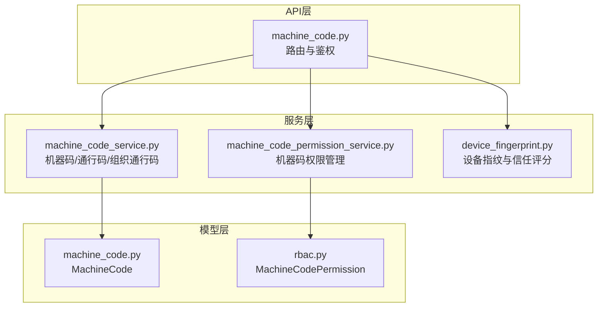
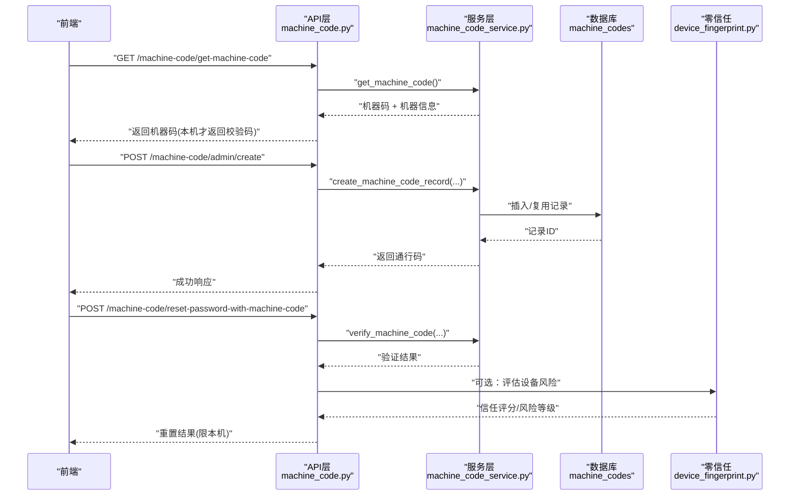
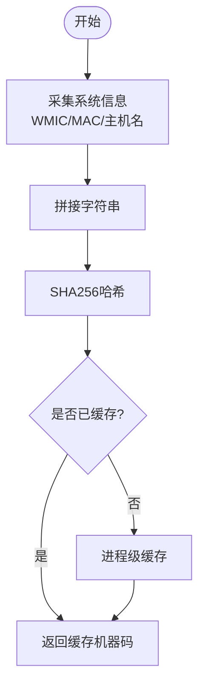
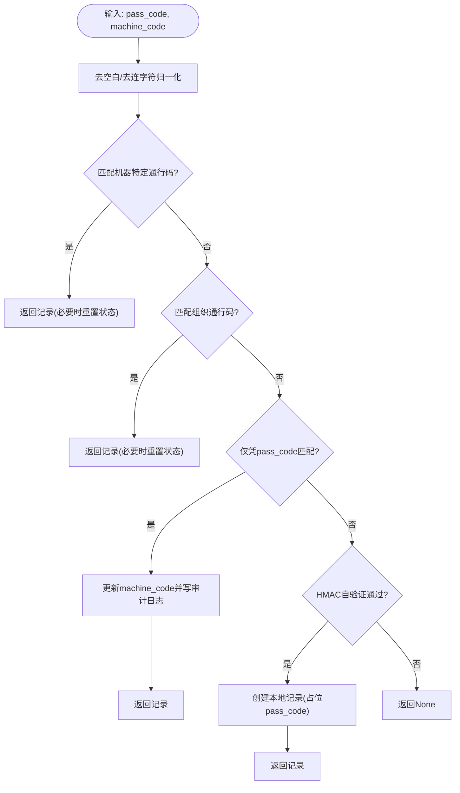
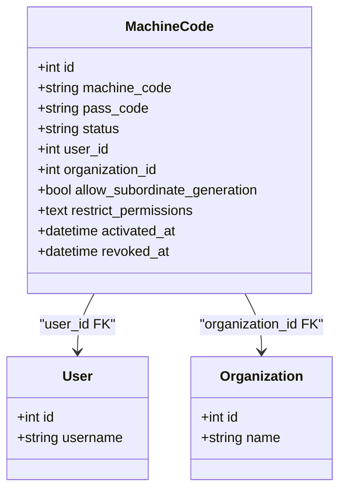
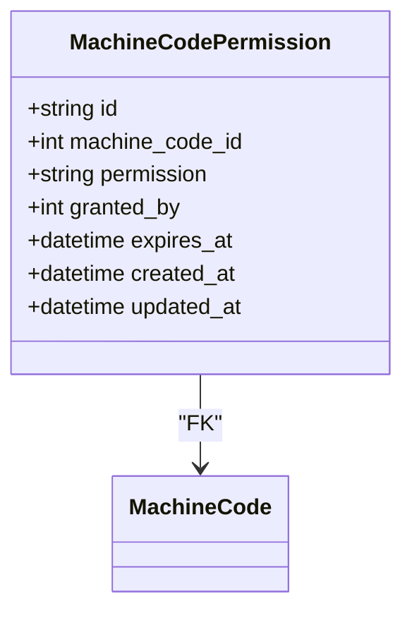
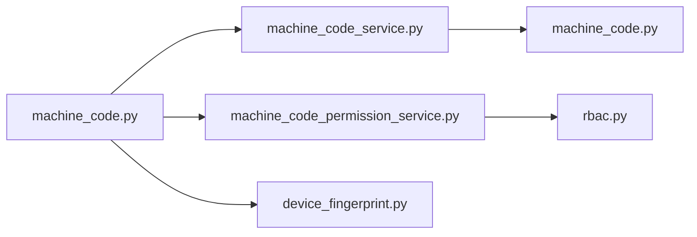

# 机器码绑定

<cite>
**本文引用的文件**
- [backend/app/models/machine_code.py](file://backend/app/models/machine_code.py)
- [backend/app/services/machine_code_service.py](file://backend/app/services/machine_code_service.py)
- [backend/app/services/machine_code_permission_service.py](file://backend/app/services/machine_code_permission_service.py)
- [backend/app/models/rbac.py](file://backend/app/models/rbac.py)
- [backend/app/api/v1/machine_code.py](file://backend/app/api/v1/machine_code.py)
- [backend/alembic/versions/009_add_machine_codes.py](file://backend/alembic/versions/009_add_machine_codes.py)
- [backend/alembic/versions/011_add_machine_code_permissions.py](file://backend/alembic/versions/011_add_machine_code_permissions.py)
- [backend/app/services/zero_trust/device_fingerprint.py](file://backend/app/services/zero_trust/device_fingerprint.py)
- [frontend/tests/unit/api/machineCode.test.ts](file://frontend/tests/unit/api/machineCode.test.ts)
</cite>

## 目录
1. [简介](#简介)
2. [项目结构](#项目结构)
3. [核心组件](#核心组件)
4. [架构总览](#架构总览)
5. [详细组件分析](#详细组件分析)
6. [依赖关系分析](#依赖关系分析)
7. [性能考虑](#性能考虑)
8. [故障排查指南](#故障排查指南)
9. [结论](#结论)
10. [附录：配置与API示例](#附录：配置与api示例)

## 简介
本文件面向“机器码绑定”能力，系统性说明机器码生成算法、设备指纹识别、通行码验证流程、安全策略（含白名单与权限控制）、多设备管理、绑定解除机制、审计与合规要求，以及配置方法与API使用示例。该能力用于单机版或受限环境下的用户注册、登录授权与功能权限控制，支持机器级与组织级通行码，并提供跨机器的HMAC自验证路径。

## 项目结构
机器码绑定涉及模型层、服务层、API层与安全扩展模块：
- 模型层：定义机器码表、机器码权限关联表等数据实体
- 服务层：实现机器码生成、通行码生成与验证、激活/撤销、组织通行码、权限授予/撤销等
- API层：暴露管理员录入、列表查询、撤销、校验、密码重置、组织通行码管理等接口
- 零信任扩展：设备指纹识别与信任评分，辅助风险决策

**图表来源**
- [backend/app/api/v1/machine_code.py:157-800](file://backend/app/api/v1/machine_code.py#L157-L800)
- [backend/app/services/machine_code_service.py:121-800](file://backend/app/services/machine_code_service.py#L121-L800)
- [backend/app/services/machine_code_permission_service.py:22-288](file://backend/app/services/machine_code_permission_service.py#L22-L288)
- [backend/app/models/machine_code.py:16-77](file://backend/app/models/machine_code.py#L16-L77)
- [backend/app/models/rbac.py:221-257](file://backend/app/models/rbac.py#L221-L257)
- [backend/app/services/zero_trust/device_fingerprint.py:68-200](file://backend/app/services/zero_trust/device_fingerprint.py#L68-L200)

**章节来源**
- [backend/app/api/v1/machine_code.py:157-800](file://backend/app/api/v1/machine_code.py#L157-L800)
- [backend/app/services/machine_code_service.py:121-800](file://backend/app/services/machine_code_service.py#L121-L800)
- [backend/app/models/machine_code.py:16-77](file://backend/app/models/machine_code.py#L16-L77)
- [backend/app/models/rbac.py:221-257](file://backend/app/models/rbac.py#L221-L257)
- [backend/app/services/zero_trust/device_fingerprint.py:68-200](file://backend/app/services/zero_trust/device_fingerprint.py#L68-L200)

## 核心组件
- 机器码生成与缓存：基于系统信息（CPU/主板/磁盘/MAC/主机名）组合哈希，进程级缓存避免重复调用外部命令
- 校验码与初始密码：基于机器码生成4位数字校验码；按用户名前缀+校验码+固定后缀生成初始密码
- 通行码（激活码）：HMAC-SHA256(machine_code, PASS_CODE_SECRET)，格式化输出；支持跨机器自验证（fail-closed）
- 四级验证回退：机器特定通行码→组织通行码→仅凭pass_code回退并改绑→HMAC自验证
- 激活与撤销：将记录状态置为active并绑定用户；或置为revoked并记录时间
- 组织通行码：基于组织ID与名称生成确定性校验码，结合随机盐生成通行码
- 机器码权限：为机器码授予/撤销功能权限，支持过期时间与批量操作
- 设备指纹：收集浏览器/客户端特征，计算信任评分与风险等级，辅助安全策略

**章节来源**
- [backend/app/services/machine_code_service.py:121-324](file://backend/app/services/machine_code_service.py#L121-L324)
- [backend/app/services/machine_code_service.py:325-800](file://backend/app/services/machine_code_service.py#L325-L800)
- [backend/app/services/machine_code_permission_service.py:22-288](file://backend/app/services/machine_code_permission_service.py#L22-L288)
- [backend/app/services/zero_trust/device_fingerprint.py:68-200](file://backend/app/services/zero_trust/device_fingerprint.py#L68-L200)

## 架构总览
机器码绑定从前端发起请求到后端处理，经API鉴权后进入服务层完成机器码/通行码的生成与验证，必要时写入数据库并触发审计日志；同时可结合设备指纹进行风险决策。

**图表来源**
- [backend/app/api/v1/machine_code.py:157-491](file://backend/app/api/v1/machine_code.py#L157-L491)
- [backend/app/services/machine_code_service.py:121-324](file://backend/app/services/machine_code_service.py#L121-L324)
- [backend/app/services/zero_trust/device_fingerprint.py:68-200](file://backend/app/services/zero_trust/device_fingerprint.py#L68-L200)

## 详细组件分析

### 机器码生成与设备指纹
- 机器码生成：采集WMIC信息（Windows）、MAC地址、主机名，拼接后SHA256得到32位十六进制；进程级缓存提升性能
- 设备指纹：收集UA、IP、屏幕分辨率、平台、字体、Canvas/WebGL哈希等，计算信任评分与风险等级，低分设备可能触发MFA或拒绝

**图表来源**
- [backend/app/services/machine_code_service.py:55-152](file://backend/app/services/machine_code_service.py#L55-L152)
- [backend/app/services/zero_trust/device_fingerprint.py:98-152](file://backend/app/services/zero_trust/device_fingerprint.py#L98-L152)

**章节来源**
- [backend/app/services/machine_code_service.py:55-152](file://backend/app/services/machine_code_service.py#L55-L152)
- [backend/app/services/zero_trust/device_fingerprint.py:98-152](file://backend/app/services/zero_trust/device_fingerprint.py#L98-L152)

### 通行码生成与验证流程
- 通行码生成：HMAC-SHA256(machine_code, PASS_CODE_SECRET)，截断32位并格式化为XXXX-XXXX-...形式
- 自验证安全策略：未显式配置PASS_CODE_SECRET时，HMAC自验证路径fail-closed，防止离线伪造
- 四级验证回退：
  1) 机器特定通行码匹配（pending/active且user_id为空）
  2) 组织通行码匹配（organization_id非空）
  3) 仅凭pass_code匹配（限制为pending且无organization_id），自动更新机器码并写审计日志
  4) HMAC自验证（跨机器场景，需显式密钥）

**图表来源**
- [backend/app/services/machine_code_service.py:267-324](file://backend/app/services/machine_code_service.py#L267-L324)
- [backend/app/services/machine_code_service.py:411-585](file://backend/app/services/machine_code_service.py#L411-L585)

**章节来源**
- [backend/app/services/machine_code_service.py:267-324](file://backend/app/services/machine_code_service.py#L267-L324)
- [backend/app/services/machine_code_service.py:411-585](file://backend/app/services/machine_code_service.py#L411-L585)

### 激活、撤销与多设备管理
- 激活：将记录状态设为active，绑定user_id，记录激活时间
- 撤销：将状态设为revoked，记录撤销时间
- 多设备管理：同一机器码记录可多次重新生成通行码；组织通行码支持允许下级生成；用户未绑定机器码时兼容旧用户允许登录

**图表来源**
- [backend/app/models/machine_code.py:16-77](file://backend/app/models/machine_code.py#L16-L77)

**章节来源**
- [backend/app/services/machine_code_service.py:587-691](file://backend/app/services/machine_code_service.py#L587-L691)
- [backend/app/models/machine_code.py:16-77](file://backend/app/models/machine_code.py#L16-L77)

### 机器码权限控制与白名单管理
- 权限模型：MachineCodePermission表关联machine_code_id与permission标识，支持granted_by与expires_at
- 授予/撤销：单条或批量授予/撤销权限，存在则更新过期时间
- 白名单/黑名单：restrict_permissions字段可用于限制功能权限；结合RBAC与访问日志进行审计

**图表来源**
- [backend/app/models/rbac.py:221-257](file://backend/app/models/rbac.py#L221-L257)

**章节来源**
- [backend/app/services/machine_code_permission_service.py:22-288](file://backend/app/services/machine_code_permission_service.py#L22-L288)
- [backend/app/models/rbac.py:221-257](file://backend/app/models/rbac.py#L221-L257)

### 安全审计与合规
- 工作日志：关键操作（创建、撤销、改绑、密码重置、出厂恢复）均写审计日志
- 速率限制：密码重置与出厂恢复接口具备限流保护
- 本机门禁：敏感接口仅接受loopback请求，防止远程滥用
- 失败关闭：未显式配置PASS_CODE_SECRET时拒绝HMAC自验证

**章节来源**
- [backend/app/api/v1/machine_code.py:394-606](file://backend/app/api/v1/machine_code.py#L394-L606)
- [backend/app/services/machine_code_service.py:531-585](file://backend/app/services/machine_code_service.py#L531-L585)

## 依赖关系分析
- API层依赖服务层：路由通过Depends注入数据库会话，调用服务方法完成业务逻辑
- 服务层依赖模型层：读写machine_codes与machine_code_permissions表
- 零信任服务独立于机器码服务，但可在API层作为风险评估补充
- 迁移脚本确保表结构与索引正确创建

**图表来源**
- [backend/app/api/v1/machine_code.py:157-800](file://backend/app/api/v1/machine_code.py#L157-L800)
- [backend/app/services/machine_code_service.py:121-800](file://backend/app/services/machine_code_service.py#L121-L800)
- [backend/app/services/machine_code_permission_service.py:22-288](file://backend/app/services/machine_code_permission_service.py#L22-L288)
- [backend/app/models/machine_code.py:16-77](file://backend/app/models/machine_code.py#L16-L77)
- [backend/app/models/rbac.py:221-257](file://backend/app/models/rbac.py#L221-L257)
- [backend/app/services/zero_trust/device_fingerprint.py:68-200](file://backend/app/services/zero_trust/device_fingerprint.py#L68-L200)

**章节来源**
- [backend/alembic/versions/009_add_machine_codes.py:19-37](file://backend/alembic/versions/009_add_machine_codes.py#L19-L37)
- [backend/alembic/versions/011_add_machine_code_permissions.py:36-54](file://backend/alembic/versions/011_add_machine_code_permissions.py#L36-L54)

## 性能考虑
- 机器码进程级缓存：避免重复执行wmic子进程，显著降低延迟
- 数据库查询优化：使用joinedload预加载用户/组织关系，避免N+1查询
- 常量时间比较：通行码比较使用hmac.compare_digest，防时序侧信道
- 幂等迁移：Alembic脚本对建表与建索引做幂等处理，保障部署稳定性

**章节来源**
- [backend/app/services/machine_code_service.py:52-152](file://backend/app/services/machine_code_service.py#L52-L152)
- [backend/app/services/machine_code_service.py:693-733](file://backend/app/services/machine_code_service.py#L693-L733)
- [backend/app/services/machine_code_service.py:297-324](file://backend/app/services/machine_code_service.py#L297-L324)
- [backend/alembic/versions/009_add_machine_codes.py:19-37](file://backend/alembic/versions/009_add_machine_codes.py#L19-L37)
- [backend/alembic/versions/011_add_machine_code_permissions.py:36-54](file://backend/alembic/versions/011_add_machine_code_permissions.py#L36-L54)

## 故障排查指南
- 通行码验证失败：检查是否带/不带连字符；确认状态是否为pending或active且user_id为空；查看是否命中回退改绑路径
- HMAC自验证被拒：确认是否显式配置PASS_CODE_SECRET；否则走管理员预录入通道
- 机器码不一致：若wmic输出漂移，会触发仅凭pass_code回退并自动更新machine_code；关注审计日志
- 权限问题：确认当前用户角色是否满足admin/super_admin；检查机器码权限是否过期或被撤销
- 设备风险高：检查设备指纹信任评分；必要时启用MFA或阻断

**章节来源**
- [backend/app/services/machine_code_service.py:411-585](file://backend/app/services/machine_code_service.py#L411-L585)
- [backend/app/services/machine_code_service.py:297-324](file://backend/app/services/machine_code_service.py#L297-L324)
- [backend/app/services/machine_code_permission_service.py:44-92](file://backend/app/services/machine_code_permission_service.py#L44-L92)
- [backend/app/services/zero_trust/device_fingerprint.py:154-200](file://backend/app/services/zero_trust/device_fingerprint.py#L154-L200)

## 结论
机器码绑定通过稳健的机器码生成、通行码HMAC自验证与四级回退机制，在单机与受限环境中提供可靠的注册与授权能力；结合设备指纹与权限模型，实现了细粒度的功能控制与安全风险管控；完善的审计与限流策略满足合规要求。建议在生产环境显式配置PASS_CODE_SECRET，并结合设备指纹策略强化访问控制。

## 附录：配置与API示例

### 配置要点
- 环境变量：设置PASS_CODE_SECRET以启用HMAC自验证；未设置时自验证路径fail-closed
- 本机门禁：敏感接口仅接受loopback请求，确保离线单机部署安全
- 权限模型：为机器码授予/撤销功能权限，支持过期时间；restrict_permissions可用于限制

**章节来源**
- [backend/app/services/machine_code_service.py:26-35](file://backend/app/services/machine_code_service.py#L26-L35)
- [backend/app/api/v1/machine_code.py:145-154](file://backend/app/api/v1/machine_code.py#L145-L154)
- [backend/app/models/rbac.py:221-257](file://backend/app/models/rbac.py#L221-L257)

### API使用示例（前端测试用例映射）
- 获取机器码：GET /machine-code/get-machine-code
- 管理员录入机器码：POST /machine-code/admin/create
- 管理员列表：GET /machine-code/admin/list?status_filter=active&skip=0&limit=10
- 撤销机器码：POST /machine-code/admin/revoke/{id}
- 验证机器码：POST /machine-code/verify-machine-code
- 生成初始密码：POST /machine-code/generate-initial-password
- 使用机器码重置密码：POST /machine-code/reset-password-with-machine-code
- 获取组织校验码：GET /machine-code/organization/{org_id}/verification-code
- 生成组织通行码：POST /machine-code/organization/create
- 列出组织通行码：GET /machine-code/organization/list

**章节来源**
- [frontend/tests/unit/api/machineCode.test.ts:29-91](file://frontend/tests/unit/api/machineCode.test.ts#L29-L91)
- [backend/app/api/v1/machine_code.py:157-800](file://backend/app/api/v1/machine_code.py#L157-L800)