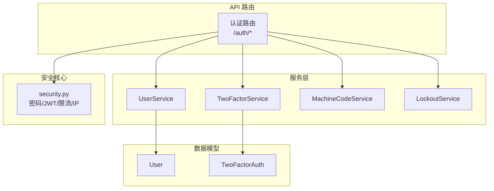
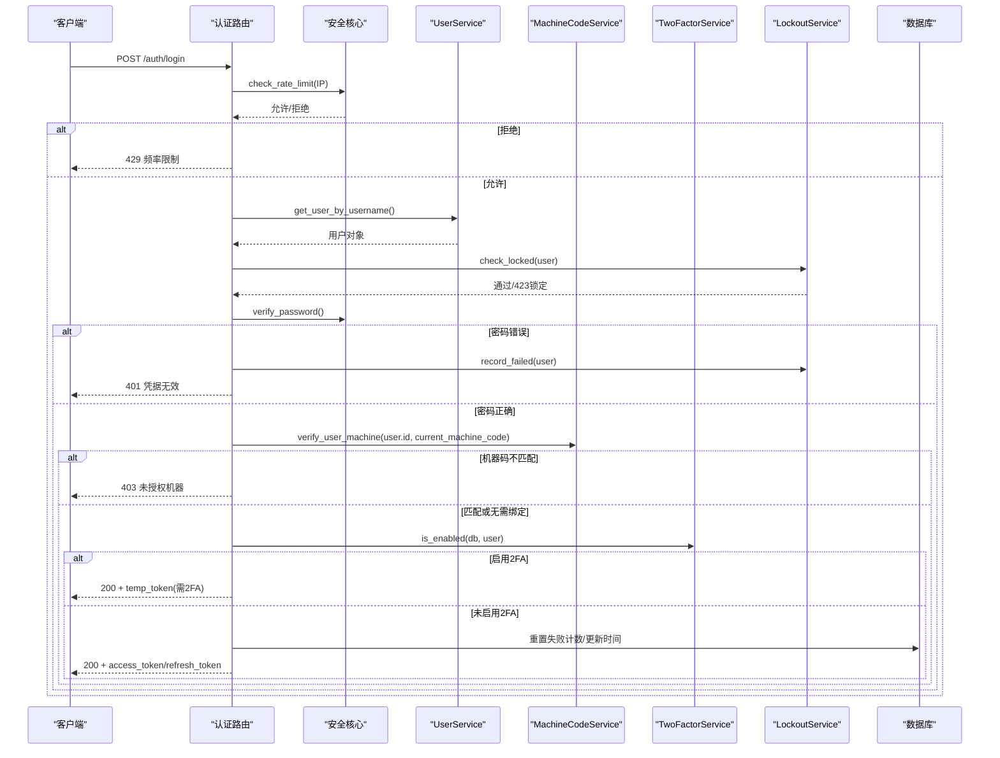
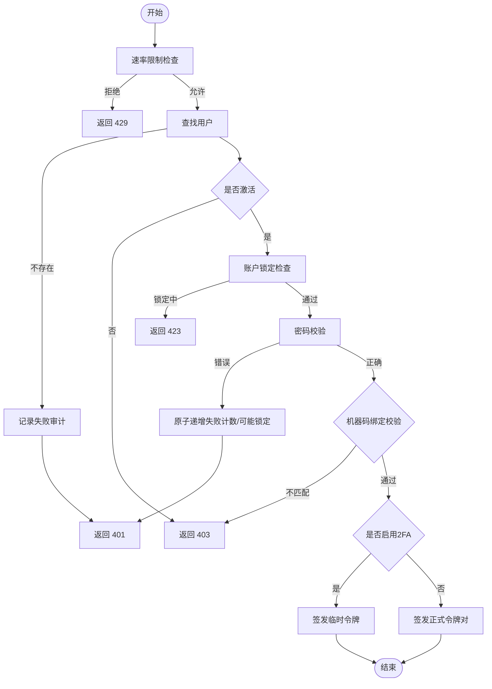
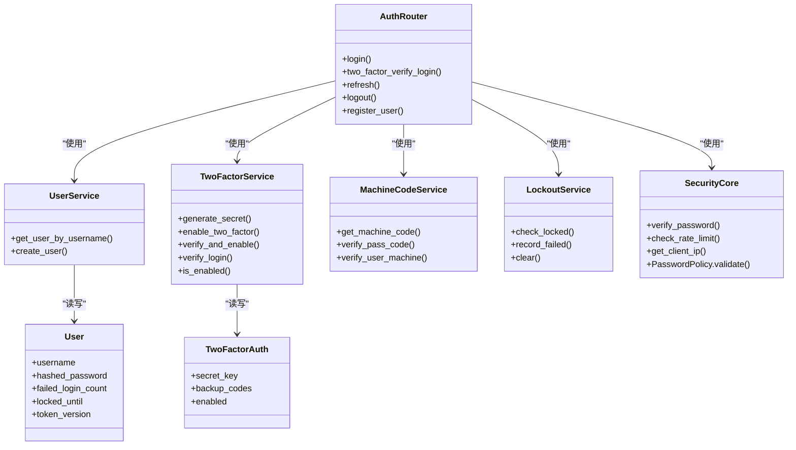

# 用户认证

<cite>
**本文引用的文件**
- [backend/app/api/v1/auth/auth.py](file://backend/app/api/v1/auth/auth.py)
- [backend/app/services/user_service.py](file://backend/app/services/user_service.py)
- [backend/app/services/two_factor_service.py](file://backend/app/services/two_factor_service.py)
- [backend/app/services/machine_code_service.py](file://backend/app/services/machine_code_service.py)
- [backend/app/core/security.py](file://backend/app/core/security.py)
- [backend/app/models/user.py](file://backend/app/models/user.py)
- [backend/app/models/two_factor_auth.py](file://backend/app/models/two_factor_auth.py)
- [backend/app/services/lockout_service.py](file://backend/app/services/lockout_service.py)
</cite>

## 目录
1. [简介](#简介)
2. [项目结构](#项目结构)
3. [核心组件](#核心组件)
4. [架构总览](#架构总览)
5. [详细组件分析](#详细组件分析)
6. [依赖关系分析](#依赖关系分析)
7. [性能考虑](#性能考虑)
8. [故障排查指南](#故障排查指南)
9. [结论](#结论)
10. [附录](#附录)

## 简介
本文件面向“乡村振兴系统”的后端认证模块，系统化说明用户登录验证、密码策略、登录失败锁定机制、会话与令牌管理、双因素认证、机器码绑定、注册流程以及验证码（通行码）机制。文档同时提供认证中间件使用示例与自定义认证逻辑的实现指引，帮助开发者与安全运维人员正确配置与扩展认证能力。

## 项目结构
认证相关代码主要分布在以下位置：
- API 路由层：认证接口定义（登录、双因素校验、刷新、登出、注册等）
- 服务层：用户服务、双因素服务、机器码服务、账户锁定服务
- 安全核心：密码哈希、JWT 生成/校验、速率限制、客户端 IP 获取、密码策略
- 数据模型：用户表、双因素认证表
- 事务与数据库：统一提交封装、会话注入

图表来源
- [backend/app/api/v1/auth/auth.py:101-287](file://backend/app/api/v1/auth/auth.py#L101-L287)
- [backend/app/services/user_service.py:20-95](file://backend/app/services/user_service.py#L20-L95)
- [backend/app/services/two_factor_service.py:23-251](file://backend/app/services/two_factor_service.py#L23-L251)
- [backend/app/services/machine_code_service.py:38-190](file://backend/app/services/machine_code_service.py#L38-L190)
- [backend/app/core/security.py:210-336](file://backend/app/core/security.py#L210-L336)
- [backend/app/models/user.py:26-85](file://backend/app/models/user.py#L26-L85)
- [backend/app/models/two_factor_auth.py:13-35](file://backend/app/models/two_factor_auth.py#L13-L35)

章节来源
- [backend/app/api/v1/auth/auth.py:101-287](file://backend/app/api/v1/auth/auth.py#L101-L287)
- [backend/app/core/security.py:439-516](file://backend/app/core/security.py#L439-L516)

## 核心组件
- 认证路由与流程控制：登录、双因素校验、刷新、登出、注册、CSRF Token 获取
- 用户服务：用户查询与创建
- 双因素服务：TOTP 密钥生成、二维码、启用/禁用、登录时 TOTP/备用码校验
- 机器码服务：机器码计算、通行码生成与验证、用户机器绑定校验
- 账户锁定服务：原子递增失败次数、自动锁定与过期清理、批量解锁
- 安全核心：密码哈希/校验、JWT 签发/解码、速率限制、客户端 IP 解析、密码策略

章节来源
- [backend/app/api/v1/auth/auth.py:101-287](file://backend/app/api/v1/auth/auth.py#L101-L287)
- [backend/app/services/user_service.py:20-95](file://backend/app/services/user_service.py#L20-L95)
- [backend/app/services/two_factor_service.py:23-251](file://backend/app/services/two_factor_service.py#L23-L251)
- [backend/app/services/machine_code_service.py:121-190](file://backend/app/services/machine_code_service.py#L121-L190)
- [backend/app/services/lockout_service.py:25-159](file://backend/app/services/lockout_service.py#L25-L159)
- [backend/app/core/security.py:120-148](file://backend/app/core/security.py#L120-L148)

## 架构总览
认证主流程（登录）：
- 请求进入 /auth/login
- 速率限制检查（按 IP）
- 用户名查找与激活状态检查
- 账户锁定检查（未过期则拒绝）
- 密码校验（失败则原子递增失败计数并可能锁定）
- 机器码绑定校验（如已绑定）
- 若启用双因素，返回临时令牌；否则签发正式令牌对
- 审计日志记录

图表来源
- [backend/app/api/v1/auth/auth.py:101-287](file://backend/app/api/v1/auth/auth.py#L101-L287)
- [backend/app/services/lockout_service.py:46-159](file://backend/app/services/lockout_service.py#L46-L159)
- [backend/app/services/machine_code_service.py:661-691](file://backend/app/services/machine_code_service.py#L661-L691)
- [backend/app/services/two_factor_service.py:233-251](file://backend/app/services/two_factor_service.py#L233-L251)

## 详细组件分析

### 登录与双因素认证流程
- 登录入口：POST /auth/login
  - 速率限制：同一 IP 每分钟最多 5 次尝试
  - 用户名查找、激活状态检查
  - 账户锁定检查：锁定未过期返回 423
  - 密码校验：失败则原子递增失败计数，达到阈值自动设置锁定截止时间
  - 机器码绑定校验：如用户已绑定机器码，必须一致
  - 双因素检查：若启用，返回临时令牌（短时效），用于后续 /auth/two-factor/verify-login
- 双因素校验：POST /auth/two-factor/verify-login
  - 速率限制复用登录限制
  - 校验临时令牌有效性及类型
  - 验证 TOTP 或备用码
  - 成功后吊销临时令牌，签发正式令牌对

图表来源
- [backend/app/api/v1/auth/auth.py:101-287](file://backend/app/api/v1/auth/auth.py#L101-L287)
- [backend/app/services/lockout_service.py:46-159](file://backend/app/services/lockout_service.py#L46-L159)

章节来源
- [backend/app/api/v1/auth/auth.py:101-287](file://backend/app/api/v1/auth/auth.py#L101-L287)
- [backend/app/api/v1/auth/auth.py:290-444](file://backend/app/api/v1/auth/auth.py#L290-L444)
- [backend/app/services/lockout_service.py:46-159](file://backend/app/services/lockout_service.py#L46-L159)

### 密码策略与哈希
- 密码策略：最小长度、大小写、数字、特殊字符白名单、弱口令前缀、禁止包含用户名片段
- 密码哈希：bcrypt，兼容 bcrypt 版本差异，超长密码截断保护
- 密码校验：安全比较，异常捕获与告警

章节来源
- [backend/app/core/security.py:524-590](file://backend/app/core/security.py#L524-L590)
- [backend/app/core/security.py:120-148](file://backend/app/core/security.py#L120-L148)

### 登录失败锁定机制
- 原子递增失败次数：单条 SQL UPDATE 完成计数与锁定判定，避免并发丢失更新
- 锁定检查：锁定未过期返回 423，已过期自动清理
- 启动时批量解锁：解锁所有过期账户并强制解锁管理员账户（单机版误锁保护）

章节来源
- [backend/app/services/lockout_service.py:46-159](file://backend/app/services/lockout_service.py#L46-L159)
- [backend/app/services/lockout_service.py:171-219](file://backend/app/services/lockout_service.py#L171-L219)

### 会话与令牌管理
- 访问令牌与刷新令牌：支持轮换与黑名单吊销
- 令牌版本：登出时递增 token_version，使该用户全部现存 JWT 立即失效
- 当前用户解析：从 Bearer token 解码，校验类型与黑名单，延迟加载数据库会话
- 刷新接口：仅接受 refresh_token，旧 token 立即吊销并签发新对

章节来源
- [backend/app/api/v1/auth/auth.py:447-689](file://backend/app/api/v1/auth/auth.py#L447-L689)
- [backend/app/core/security.py:210-336](file://backend/app/core/security.py#L210-L336)

### 机器码绑定与通行码机制
- 机器码：基于系统信息（CPU/MAC/主机名等）计算唯一标识，进程级缓存
- 通行码：HMAC-SHA256(machine_code, PASS_CODE_SECRET)，可跨机器自验证；未显式配置密钥时 fail-closed
- 验证优先级：机器特定通行码 → 组织通行码 → 仅凭 pass_code 回退（自动改绑并留痕）→ HMAC 自验证
- 用户机器绑定校验：登录时校验当前机器码是否与用户绑定一致

章节来源
- [backend/app/services/machine_code_service.py:121-190](file://backend/app/services/machine_code_service.py#L121-L190)
- [backend/app/services/machine_code_service.py:267-323](file://backend/app/services/machine_code_service.py#L267-L323)
- [backend/app/services/machine_code_service.py:411-585](file://backend/app/services/machine_code_service.py#L411-L585)
- [backend/app/services/machine_code_service.py:661-691](file://backend/app/services/machine_code_service.py#L661-L691)

### 双因素认证（TOTP）
- 密钥与备用码：随机生成，密钥加密存储，备用码一次性使用
- 启用流程：生成密钥与二维码，用户扫码后输入 TOTP 进行验证并启用
- 登录流程：优先 TOTP 校验，失败则尝试备用码；通过后吊销临时令牌并签发正式令牌对

章节来源
- [backend/app/services/two_factor_service.py:23-251](file://backend/app/services/two_factor_service.py#L23-L251)
- [backend/app/models/two_factor_auth.py:13-35](file://backend/app/models/two_factor_auth.py#L13-L35)

### 用户注册与邮箱验证
- 注册接口：POST /auth/register
  - 速率限制：同一 IP 每分钟最多 3 次
  - 用户名与密码策略校验
  - 通行码验证：支持机器特定/组织/回退/HMAC 自验证
  - 创建用户并绑定机器码（如适用）
  - 返回访问令牌
- 邮箱验证：当前实现未包含独立的邮箱验证流程；如需启用，可在 UserService.create_user 前后增加邮件发送与验证状态字段，并在登录流程中检查邮箱验证标志。

章节来源
- [backend/app/api/v1/auth/auth.py:750-800](file://backend/app/api/v1/auth/auth.py#L750-L800)
- [backend/app/services/user_service.py:76-95](file://backend/app/services/user_service.py#L76-L95)
- [backend/app/services/machine_code_service.py:411-585](file://backend/app/services/machine_code_service.py#L411-L585)

### 验证码机制（通行码）
- 生成：HMAC-SHA256(machine_code, PASS_CODE_SECRET)，格式化输出
- 验证：四级匹配（机器特定 → 组织 → 仅 pass_code 回退 → HMAC 自验证）
- 安全：未显式配置密钥时拒绝自验证路径，防止离线伪造

章节来源
- [backend/app/services/machine_code_service.py:267-323](file://backend/app/services/machine_code_service.py#L267-L323)
- [backend/app/services/machine_code_service.py:411-585](file://backend/app/services/machine_code_service.py#L411-L585)

### 认证中间件与自定义认证逻辑
- 当前用户依赖：get_current_user 从 Bearer token 解析用户，校验类型与黑名单，延迟加载数据库会话
- 管理员权限：require_admin 工厂函数，要求角色为管理员或超级管理员
- 安全响应头：SecurityHeadersMiddleware 添加安全头部
- 自定义认证：可通过 Depends(get_current_user) 在任意路由中获取当前用户；如需额外校验（如设备指纹风险），可在路由内调用 zero_trust 服务并决定放行或挑战

章节来源
- [backend/app/core/security.py:243-371](file://backend/app/core/security.py#L243-L371)
- [backend/app/core/security.py:598-636](file://backend/app/core/security.py#L598-L636)

## 依赖关系分析

图表来源
- [backend/app/api/v1/auth/auth.py:101-287](file://backend/app/api/v1/auth/auth.py#L101-L287)
- [backend/app/services/user_service.py:20-95](file://backend/app/services/user_service.py#L20-L95)
- [backend/app/services/two_factor_service.py:23-251](file://backend/app/services/two_factor_service.py#L23-L251)
- [backend/app/services/machine_code_service.py:121-190](file://backend/app/services/machine_code_service.py#L121-L190)
- [backend/app/services/lockout_service.py:25-159](file://backend/app/services/lockout_service.py#L25-L159)
- [backend/app/core/security.py:524-590](file://backend/app/core/security.py#L524-L590)
- [backend/app/models/user.py:26-85](file://backend/app/models/user.py#L26-L85)
- [backend/app/models/two_factor_auth.py:13-35](file://backend/app/models/two_factor_auth.py#L13-L35)

章节来源
- [backend/app/api/v1/auth/auth.py:101-287](file://backend/app/api/v1/auth/auth.py#L101-L287)
- [backend/app/core/security.py:243-371](file://backend/app/core/security.py#L243-L371)

## 性能考虑
- 速率限制：内存滑动窗口，周期性清理过期键，避免内存泄漏
- 机器码计算：进程级缓存，减少子进程调用开销
- 数据库操作：原子化更新（RETURNING）减少并发竞争；批量解锁优化启动时间
- 令牌校验：黑名单与 LRU 缓存结合，降低重复校验成本
- 密码哈希：bcrypt 兼容补丁与截断保护，避免异常与性能退化

章节来源
- [backend/app/core/security.py:414-488](file://backend/app/core/security.py#L414-L488)
- [backend/app/services/machine_code_service.py:52-152](file://backend/app/services/machine_code_service.py#L52-L152)
- [backend/app/services/lockout_service.py:105-159](file://backend/app/services/lockout_service.py#L105-L159)

## 故障排查指南
- 429 频率限制：检查 IP 限流键与窗口配置，确认前端重试策略
- 401 凭据无效：核对用户名、密码、用户激活状态；查看失败审计日志
- 423 账户锁定：等待锁定过期或管理员解锁；检查锁定时间与阈值配置
- 403 未授权机器：确认用户是否绑定机器码，或调整绑定策略
- 2FA 验证失败：检查 TOTP 时间同步、备用码是否被使用过；查看双因素服务日志
- 刷新令牌失败：确认传入的是 refresh_token，且未被吊销；检查黑名单与版本

章节来源
- [backend/app/api/v1/auth/auth.py:101-287](file://backend/app/api/v1/auth/auth.py#L101-L287)
- [backend/app/api/v1/auth/auth.py:290-444](file://backend/app/api/v1/auth/auth.py#L290-L444)
- [backend/app/services/lockout_service.py:46-159](file://backend/app/services/lockout_service.py#L46-L159)
- [backend/app/services/machine_code_service.py:661-691](file://backend/app/services/machine_code_service.py#L661-L691)

## 结论
本认证模块以“安全基线 + 可配置策略”为核心，覆盖登录、双因素、机器码绑定、通行码、密码策略、会话管理与锁定机制。通过原子化更新、速率限制、黑名单与令牌版本控制，有效抵御暴力破解、重放攻击与会话劫持。建议在生产环境显式配置通行码密钥、合理设置密码策略与锁定阈值，并结合零信任设备指纹增强登录安全性。

## 附录
- 常用配置项（来自安全核心与配置读取）：
  - ACCESS_TOKEN_EXPIRE_MINUTES：访问令牌有效期（分钟）
  - REFRESH_TOKEN_EXPIRE_DAYS：刷新令牌有效期（天）
  - MAX_FAILED_LOGIN_ATTEMPTS：最大失败次数
  - ACCOUNT_LOCKOUT_MINUTES：锁定持续时间（分钟）
  - PASSWORD_EXPIRE_DAYS：密码过期天数
  - PASS_CODE_SECRET：通行码 HMAC 密钥（生产环境必须显式配置）
  - TRUST_PROXY_HEADERS：是否信任代理头（反向代理场景）

章节来源
- [backend/app/core/security.py:80-90](file://backend/app/core/security.py#L80-L90)
- [backend/app/api/v1/auth/auth.py:48-53](file://backend/app/api/v1/auth/auth.py#L48-L53)
- [backend/app/services/machine_code_service.py:26-35](file://backend/app/services/machine_code_service.py#L26-L35)