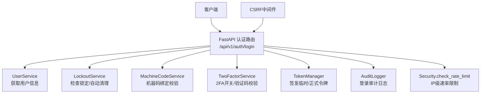
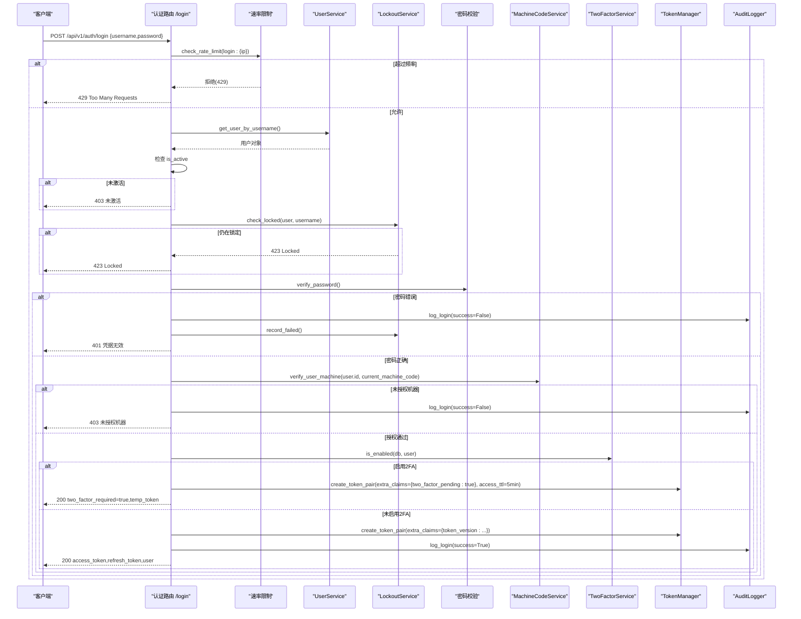
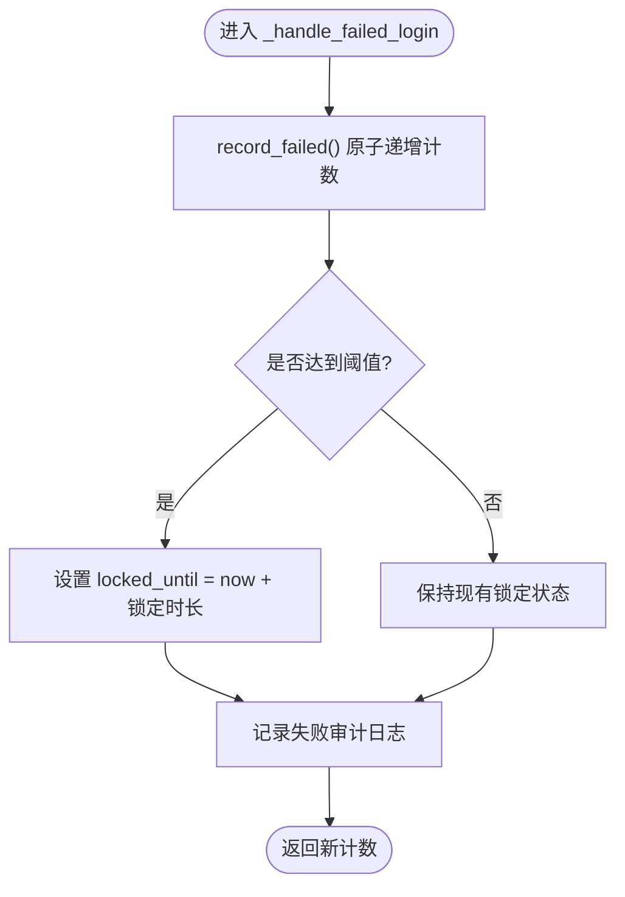
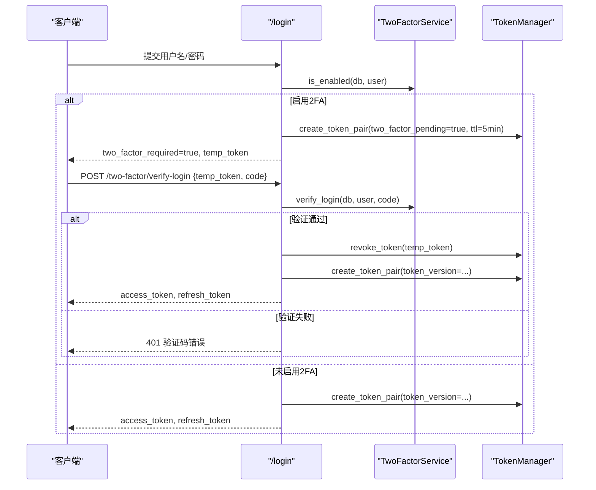
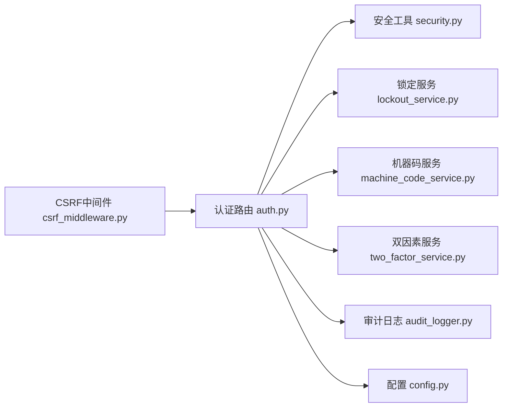

# 登录验证

<cite>
**本文引用的文件**
- [auth.py](file://backend/app/api/v1/auth/auth.py)
- [auth.py（Schemas）](file://backend/app/schemas/auth.py)
- [lockout_service.py](file://backend/app/services/lockout_service.py)
- [two_factor_service.py](file://backend/app/services/two_factor_service.py)
- [machine_code_service.py](file://backend/app/services/machine_code_service.py)
- [security.py](file://backend/app/core/security.py)
- [csrf_middleware.py](file://backend/app/middleware/csrf_middleware.py)
- [audit_logger.py](file://backend/app/utils/audit_logger.py)
- [config.py](file://backend/app/core/config.py)
</cite>

## 目录
1. [简介](#简介)
2. [项目结构](#项目结构)
3. [核心组件](#核心组件)
4. [架构总览](#架构总览)
5. [详细组件分析](#详细组件分析)
6. [依赖关系分析](#依赖关系分析)
7. [性能考虑](#性能考虑)
8. [故障排查指南](#故障排查指南)
9. [结论](#结论)
10. [附录：API使用示例与错误处理](#附录api使用示例与错误处理)

## 简介
本文件面向“登录验证”功能，系统性说明用户登录的完整实现路径与安全控制点，包括：用户名密码校验、账户激活状态检查、账户锁定机制、机器码绑定验证、双因素认证集成、CSRF保护、审计日志记录、以及登录速率限制的实现原理与配置方法。文档同时提供登录API的使用示例与常见错误处理指引，帮助开发者快速理解并正确集成。

## 项目结构
登录相关代码主要分布在以下模块：
- API层：认证路由与请求/响应模型定义
- 服务层：锁定策略、双因素认证、机器码校验
- 安全层：密码策略、令牌管理、速率限制、CSRF中间件
- 审计层：登录成功/失败审计日志持久化
- 配置层：登录失败阈值、锁定时长、密码过期策略等

图表来源
- [auth.py:101-287](file://backend/app/api/v1/auth/auth.py#L101-L287)
- [security.py:439-488](file://backend/app/core/security.py#L439-L488)
- [csrf_middleware.py:177-284](file://backend/app/middleware/csrf_middleware.py#L177-L284)

章节来源
- [auth.py:101-287](file://backend/app/api/v1/auth/auth.py#L101-L287)
- [security.py:439-488](file://backend/app/core/security.py#L439-L488)
- [csrf_middleware.py:177-284](file://backend/app/middleware/csrf_middleware.py#L177-L284)

## 核心组件
- 认证路由与流程控制：负责登录入口、速率限制、用户查询、激活状态检查、锁定检查、密码校验、机器码校验、2FA分支、令牌签发与审计。
- 账户锁定服务：统一处理失败计数递增、达到阈值的自动锁定、过期自动解锁、批量解锁。
- 双因素认证服务：TOTP密钥生成、二维码生成、启用/禁用、登录时TOTP或备用码校验。
- 机器码服务：本机机器码采集与缓存、用户机器绑定校验、通行码生成与HMAC自验证。
- 安全工具：密码哈希/校验、JWT令牌操作、速率限制器、客户端IP提取、密码策略。
- CSRF中间件：Double Submit Cookie + HMAC签名校验，防护跨站请求伪造。
- 审计日志：登录成功/失败事件写入日志系统与数据库，支持登录尝试表独立记录。
- 配置中心：登录失败次数、锁定时长、密码过期天数、CSRF开关、速率限制开关等。

章节来源
- [auth.py:101-287](file://backend/app/api/v1/auth/auth.py#L101-L287)
- [lockout_service.py:25-159](file://backend/app/services/lockout_service.py#L25-L159)
- [two_factor_service.py:23-251](file://backend/app/services/two_factor_service.py#L23-L251)
- [machine_code_service.py:121-152](file://backend/app/services/machine_code_service.py#L121-L152)
- [security.py:122-148](file://backend/app/core/security.py#L122-L148)
- [security.py:439-488](file://backend/app/core/security.py#L439-L488)
- [csrf_middleware.py:177-284](file://backend/app/middleware/csrf_middleware.py#L177-L284)
- [audit_logger.py:187-210](file://backend/app/utils/audit_logger.py#L187-L210)
- [config.py:126-154](file://backend/app/core/config.py#L126-L154)

## 架构总览
登录主流程时序如下：

图表来源
- [auth.py:101-287](file://backend/app/api/v1/auth/auth.py#L101-L287)
- [security.py:439-488](file://backend/app/core/security.py#L439-L488)
- [lockout_service.py:46-159](file://backend/app/services/lockout_service.py#L46-L159)
- [machine_code_service.py:661-691](file://backend/app/services/machine_code_service.py#L661-L691)
- [two_factor_service.py:233-251](file://backend/app/services/two_factor_service.py#L233-L251)
- [audit_logger.py:187-210](file://backend/app/utils/audit_logger.py#L187-L210)

## 详细组件分析

### 登录接口与流程控制
- 速率限制：基于IP的滑动窗口限流，登录端点每分钟最多5次；超限返回429。
- 用户查找与激活检查：不存在则记录失败审计并返回401；未激活返回403。
- 锁定检查：委托LockoutService，若锁定未过期返回423；已过期自动清理。
- 密码校验：失败则调用record_failed原子递增失败计数，达到阈值自动设置locked_until；记录审计日志。
- 机器码绑定：若用户绑定了机器码，必须与当前机器码一致，否则返回403。
- 双因素认证：若启用2FA，签发短期临时令牌（含two_factor_pending标记），前端需调用二次验证接口换取正式令牌。
- 成功登录：重置失败计数与锁定状态，更新最后登录时间，签发访问令牌与刷新令牌，记录成功审计。

章节来源
- [auth.py:101-287](file://backend/app/api/v1/auth/auth.py#L101-L287)
- [security.py:439-488](file://backend/app/core/security.py#L439-L488)
- [lockout_service.py:46-159](file://backend/app/services/lockout_service.py#L46-L159)
- [machine_code_service.py:661-691](file://backend/app/services/machine_code_service.py#L661-L691)
- [two_factor_service.py:233-251](file://backend/app/services/two_factor_service.py#L233-L251)
- [audit_logger.py:187-210](file://backend/app/utils/audit_logger.py#L187-L210)

### 账户锁定机制与失败计数
- 原子递增：通过单条UPDATE语句在SQL端完成计数+判定，避免并发丢失更新。
- 阈值触发：当失败计数达到配置的最大失败次数，自动设置locked_until为当前时间+锁定时长。
- 自动清理：每次登录前检查锁定状态，若已过期则清除failed_login_count与locked_until。
- 启动解锁：应用启动时可批量解锁所有过期账户，并对admin账户强制解锁以防误锁。

图表来源
- [lockout_service.py:105-159](file://backend/app/services/lockout_service.py#L105-L159)
- [auth.py:77-99](file://backend/app/api/v1/auth/auth.py#L77-L99)

章节来源
- [lockout_service.py:105-159](file://backend/app/services/lockout_service.py#L105-L159)
- [auth.py:77-99](file://backend/app/api/v1/auth/auth.py#L77-L99)

### 机器码绑定验证
- 机器码采集：进程级缓存，组合CPU/MAC/主机名等信息计算唯一标识。
- 用户绑定校验：若用户已绑定机器码，登录时必须匹配当前机器码；未绑定则兼容旧用户放行。
- 通行码与HMAC自验证：管理员可为目标机器生成通行码，支持跨机器自验证（fail-closed）。

章节来源
- [machine_code_service.py:121-152](file://backend/app/services/machine_code_service.py#L121-L152)
- [machine_code_service.py:661-691](file://backend/app/services/machine_code_service.py#L661-L691)
- [machine_code_service.py:267-323](file://backend/app/services/machine_code_service.py#L267-L323)

### 双因素认证集成
- 启用检测：TwoFactorService.is_enabled判断用户是否启用2FA。
- 临时令牌：首次登录通过后签发短期临时令牌（含two_factor_pending标记，5分钟有效）。
- 二次验证：/two-factor/verify-login接收temp_token与验证码，校验TOTP或备用码，成功后吊销临时令牌并签发正式令牌。
- 备用码：支持一次性备用码，使用后从列表移除。

图表来源
- [auth.py:202-219](file://backend/app/api/v1/auth/auth.py#L202-L219)
- [auth.py:290-444](file://backend/app/api/v1/auth/auth.py#L290-L444)
- [two_factor_service.py:180-215](file://backend/app/services/two_factor_service.py#L180-L215)

章节来源
- [auth.py:202-219](file://backend/app/api/v1/auth/auth.py#L202-L219)
- [auth.py:290-444](file://backend/app/api/v1/auth/auth.py#L290-L444)
- [two_factor_service.py:180-215](file://backend/app/services/two_factor_service.py#L180-L215)

### CSRF保护
- 获取CSRF Token：GET /api/v1/auth/csrf-token返回原始token并在响应中设置HMAC签名的Cookie。
- 中间件校验：对POST/PUT/DELETE/PATCH请求，要求携带X-CSRF-Token头；服务端验证HMAC(header)==cookie。
- 豁免路径：登录、注册、健康检查等路径无需CSRF校验。
- 过期检测：token内嵌时间戳，超过有效期拒绝。

章节来源
- [csrf_middleware.py:65-124](file://backend/app/middleware/csrf_middleware.py#L65-L124)
- [csrf_middleware.py:177-284](file://backend/app/middleware/csrf_middleware.py#L177-L284)
- [auth.py:692-747](file://backend/app/api/v1/auth/auth.py#L692-L747)

### 审计日志记录
- 登录事件：成功与失败均记录到Python日志与数据库（audit_logs与login_attempts表）。
- 字段包含：用户ID、用户名、IP、User-Agent、失败原因等。
- 隔离性：审计写入使用独立会话，失败不影响主业务流程。

章节来源
- [audit_logger.py:187-210](file://backend/app/utils/audit_logger.py#L187-L210)
- [audit_logger.py:121-185](file://backend/app/utils/audit_logger.py#L121-L185)

### 速率限制实现与配置
- 实现原理：内存中的滑动窗口计数器，按key（如login:{ip}）维护时间戳列表，超出limit即拒绝。
- 配置项：
  - 登录频率：_LOGIN_RATE_LIMIT=5，_LOGIN_RATE_WINDOW=60秒
  - 刷新频率：_REFRESH_RATE_LIMIT=10，_REFRESH_RATE_WINDOW=60秒
  - 全局开关：RATE_LIMIT_ENABLED
- 安全约定：缺失key或request将抛出异常，防止静默放行。

章节来源
- [security.py:439-488](file://backend/app/core/security.py#L439-L488)
- [auth.py:36-46](file://backend/app/api/v1/auth/auth.py#L36-L46)
- [config.py:156-159](file://backend/app/core/config.py#L156-L159)

## 依赖关系分析

图表来源
- [auth.py:101-287](file://backend/app/api/v1/auth/auth.py#L101-L287)
- [security.py:439-488](file://backend/app/core/security.py#L439-L488)
- [lockout_service.py:25-159](file://backend/app/services/lockout_service.py#L25-L159)
- [machine_code_service.py:661-691](file://backend/app/services/machine_code_service.py#L661-L691)
- [two_factor_service.py:233-251](file://backend/app/services/two_factor_service.py#L233-L251)
- [audit_logger.py:187-210](file://backend/app/utils/audit_logger.py#L187-L210)
- [csrf_middleware.py:177-284](file://backend/app/middleware/csrf_middleware.py#L177-L284)
- [config.py:126-154](file://backend/app/core/config.py#L126-L154)

章节来源
- [auth.py:101-287](file://backend/app/api/v1/auth/auth.py#L101-L287)
- [security.py:439-488](file://backend/app/core/security.py#L439-L488)
- [lockout_service.py:25-159](file://backend/app/services/lockout_service.py#L25-L159)
- [machine_code_service.py:661-691](file://backend/app/services/machine_code_service.py#L661-L691)
- [two_factor_service.py:233-251](file://backend/app/services/two_factor_service.py#L233-L251)
- [audit_logger.py:187-210](file://backend/app/utils/audit_logger.py#L187-L210)
- [csrf_middleware.py:177-284](file://backend/app/middleware/csrf_middleware.py#L177-L284)
- [config.py:126-154](file://backend/app/core/config.py#L126-L154)

## 性能考虑
- 机器码采集缓存：进程级缓存避免重复执行系统命令，减少登录延迟。
- 原子化失败计数：单条UPDATE减少并发竞争与锁开销。
- 速率限制内存存储：轻量级滑动窗口，定期清理过期键，避免内存泄漏。
- 审计日志独立会话：不阻塞主事务，失败仅记录错误日志。
- 2FA临时令牌短时效：降低被重放风险，提升整体安全性。

[本节为通用性能建议，不直接分析具体文件]

## 故障排查指南
- 429 登录过于频繁：检查同一IP是否在1分钟内超过5次；确认check_rate_limit调用是否正确传入key与request。
- 403 未激活或未授权机器：确认用户is_active状态与机器码绑定情况；检查verify_user_machine返回值。
- 423 账户锁定：查看locked_until是否过期；确认LockoutService.check_locked逻辑与配置阈值。
- 401 密码错误或验证码错误：核对verify_password与TwoFactorService.verify_login结果；检查备用码是否已被使用。
- CSRF失败：确保先调用/csrf-token获取token，并在后续请求头携带X-CSRF-Token；检查CSRF_SECRET_KEY配置。
- 审计日志缺失：检查AuditLogger._persist_to_db是否成功；确认数据库连接与会话管理正常。

章节来源
- [security.py:439-488](file://backend/app/core/security.py#L439-L488)
- [auth.py:101-287](file://backend/app/api/v1/auth/auth.py#L101-L287)
- [lockout_service.py:46-159](file://backend/app/services/lockout_service.py#L46-L159)
- [two_factor_service.py:180-215](file://backend/app/services/two_factor_service.py#L180-L215)
- [csrf_middleware.py:177-284](file://backend/app/middleware/csrf_middleware.py#L177-L284)
- [audit_logger.py:121-185](file://backend/app/utils/audit_logger.py#L121-L185)

## 结论
登录验证模块通过多层次的防护机制保障系统安全：速率限制抵御暴力破解，账户锁定与失败计数防止持续攻击，机器码绑定强化设备信任，双因素认证提升身份强度，CSRF中间件防范跨站请求伪造，审计日志满足合规追踪需求。各组件职责清晰、耦合合理，便于扩展与维护。

[本节为总结性内容，不直接分析具体文件]

## 附录：API使用示例与错误处理

### 登录接口
- 端点：POST /api/v1/auth/login
- 请求体：{username, password}
- 成功响应：code=200, data={access_token, token_type, user}, message, must_change_password, refresh_token
- 需要2FA响应：code=200, two_factor_required=true, temp_token
- 常见错误：
  - 401 凭据无效：用户名不存在或密码错误
  - 403 未激活或未授权机器：账户未激活或不在授权机器
  - 423 账户锁定：仍在锁定期内
  - 429 登录过于频繁：超过速率限制

章节来源
- [auth.py:101-287](file://backend/app/api/v1/auth/auth.py#L101-L287)
- [auth.py（Schemas）:8-12](file://backend/app/schemas/auth.py#L8-L12)
- [auth.py（Schemas）:53-62](file://backend/app/schemas/auth.py#L53-L62)

### 双因素认证验证
- 端点：POST /api/v1/auth/two-factor/verify-login
- 请求体：{temp_token, code}
- 成功响应：code=200, data={access_token, token_type, user}, message, must_change_password, refresh_token
- 常见错误：
  - 401 临时令牌无效或已过期
  - 401 验证码错误

章节来源
- [auth.py:290-444](file://backend/app/api/v1/auth/auth.py#L290-L444)
- [auth.py（Schemas）:65-69](file://backend/app/schemas/auth.py#L65-L69)

### 获取CSRF Token
- 端点：GET /api/v1/auth/csrf-token
- 响应：data={csrf_token, csrf_signed_token}
- 注意：后续状态变更请求需在X-CSRF-Token头携带原始token

章节来源
- [auth.py:692-747](file://backend/app/api/v1/auth/auth.py#L692-L747)
- [csrf_middleware.py:65-124](file://backend/app/middleware/csrf_middleware.py#L65-L124)

### 配置参考
- 登录失败阈值：MAX_FAILED_LOGIN_ATTEMPTS
- 锁定时长：ACCOUNT_LOCKOUT_MINUTES
- 密码过期天数：PASSWORD_EXPIRE_DAYS
- CSRF开关：CSRF_ENABLED
- 速率限制开关：RATE_LIMIT_ENABLED

章节来源
- [config.py:126-154](file://backend/app/core/config.py#L126-L154)