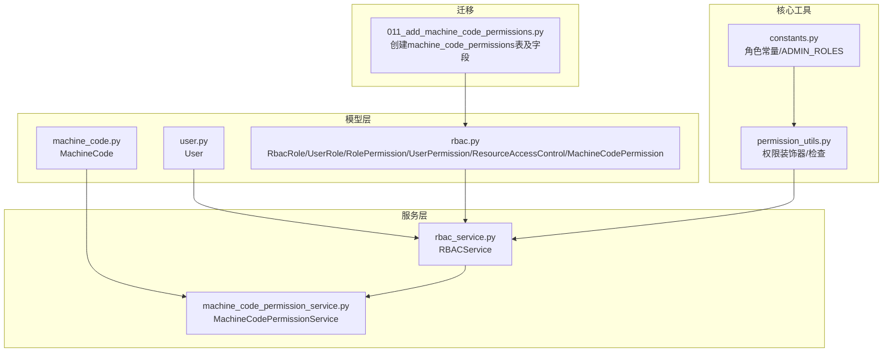
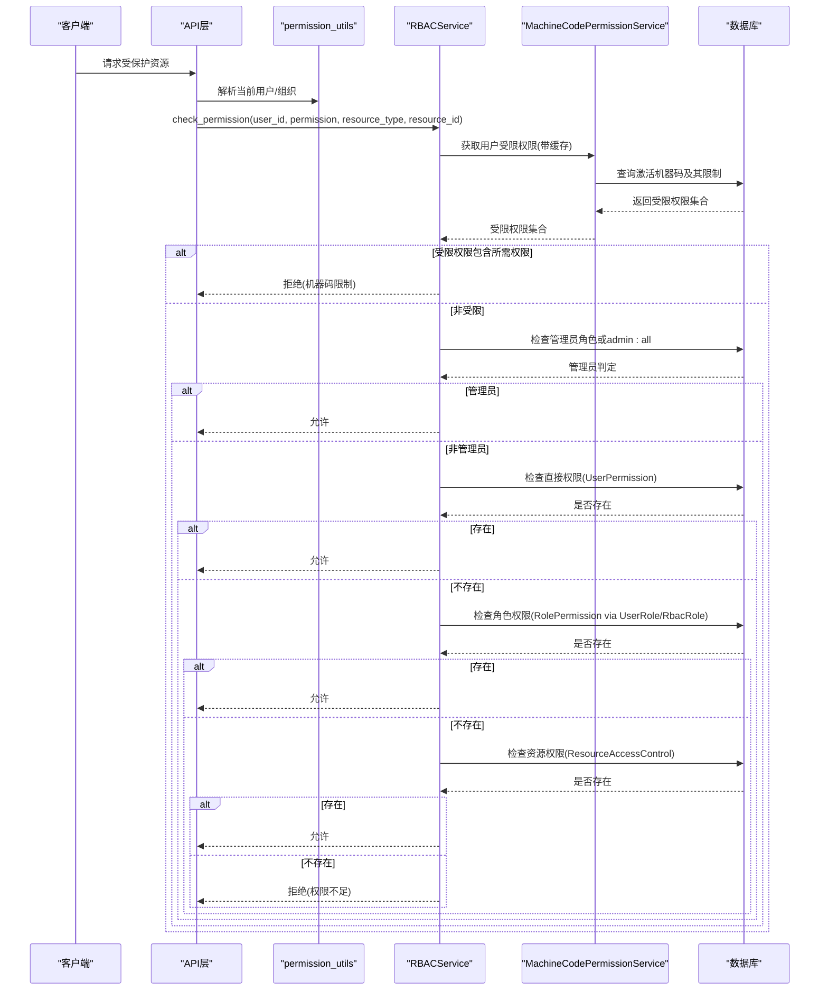
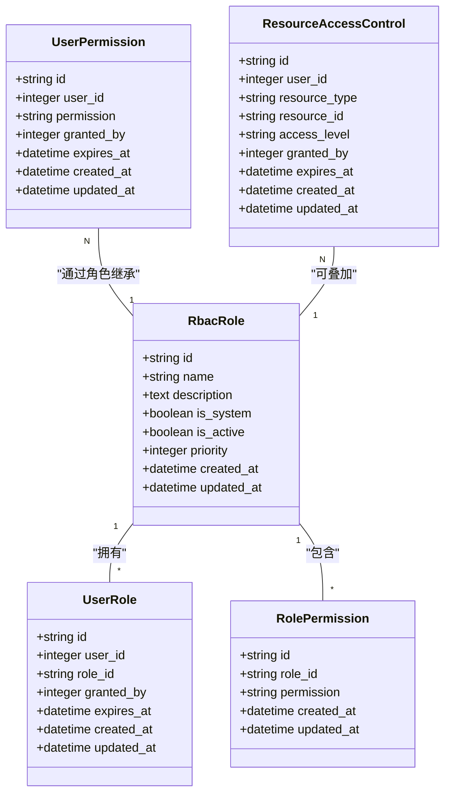
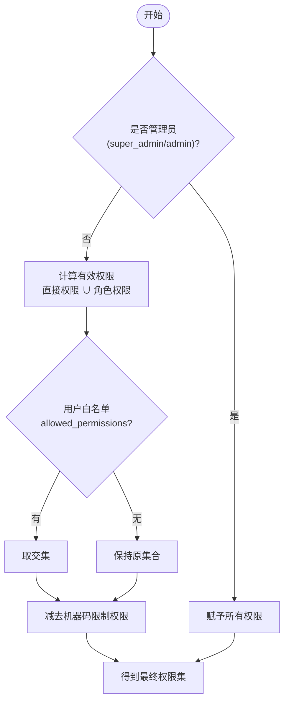
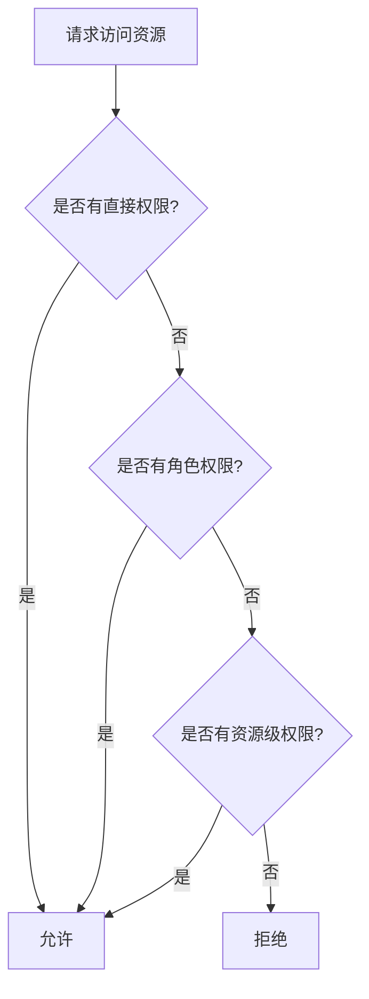
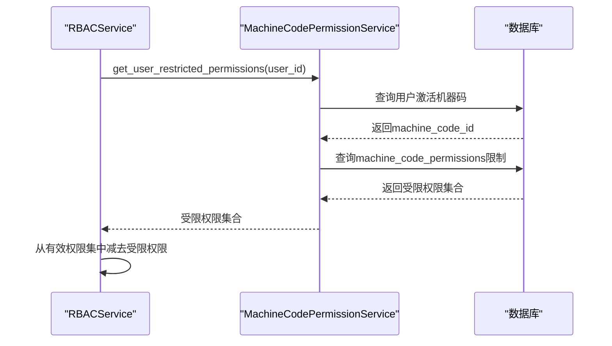
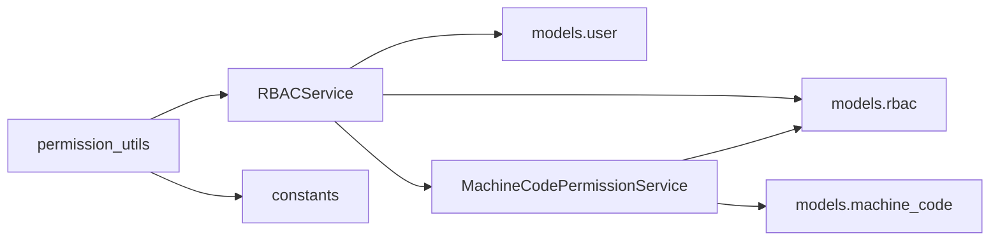
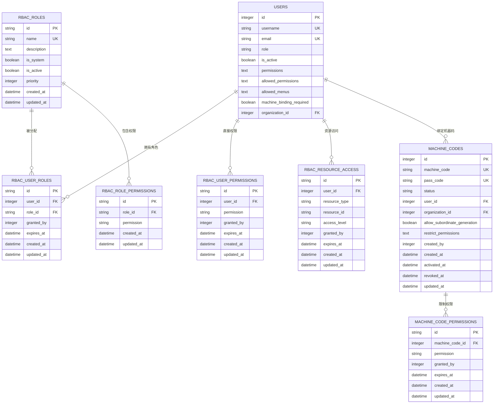

# RBAC模型设计

<cite>
**本文引用的文件**
- [rbac.py](file://backend/app/models/rbac.py)
- [user.py](file://backend/app/models/user.py)
- [role.py](file://backend/app/models/role.py)
- [machine_code.py](file://backend/app/models/machine_code.py)
- [rbac_service.py](file://backend/app/services/rbac_service.py)
- [machine_code_permission_service.py](file://backend/app/services/machine_code_permission_service.py)
- [permission_utils.py](file://backend/app/core/permission_utils.py)
- [constants.py](file://backend/app/core/constants.py)
- [011_add_machine_code_permissions.py](file://backend/alembic/versions/011_add_machine_code_permissions.py)
</cite>

## 目录
1. [简介](#简介)
2. [项目结构](#项目结构)
3. [核心组件](#核心组件)
4. [架构总览](#架构总览)
5. [详细组件分析](#详细组件分析)
6. [依赖关系分析](#依赖关系分析)
7. [性能考虑](#性能考虑)
8. [故障排查指南](#故障排查指南)
9. [结论](#结论)
10. [附录](#附录)

## 简介
本文件面向系统RBAC（基于角色的访问控制）模型的设计与实现，围绕角色-权限-用户关系、四级角色体系、资源访问控制与机器码权限控制展开。文档重点说明以下核心表与服务的职责与交互：RbacRole、UserRole、RolePermission、UserPermission、ResourceAccessControl、MachineCodePermission，以及RBACService与MachineCodePermissionService在权限计算与校验中的协作方式。同时给出数据库表关系图、实体关系说明、数据完整性约束与业务规则，帮助读者快速理解并正确使用该权限体系。

## 项目结构
后端采用分层架构：
- 模型层（models）：定义ORM模型，映射到数据库表，如rbac.py中的RBAC相关表、user.py中的用户表、machine_code.py中的机器码表等。
- 服务层（services）：封装权限计算、分配、撤销等业务逻辑，如rbac_service.py和machine_code_permission_service.py。
- 核心工具（core）：提供通用能力，如常量定义、权限装饰器与检查工具，如constants.py与permission_utils.py。
- 迁移（alembic）：通过迁移脚本维护数据库结构与索引，如011_add_machine_code_permissions.py。

图表来源
- [rbac.py:31-257](file://backend/app/models/rbac.py#L31-L257)
- [user.py:26-85](file://backend/app/models/user.py#L26-L85)
- [machine_code.py:16-77](file://backend/app/models/machine_code.py#L16-L77)
- [rbac_service.py:104-320](file://backend/app/services/rbac_service.py#L104-L320)
- [machine_code_permission_service.py:22-92](file://backend/app/services/machine_code_permission_service.py#L22-L92)
- [constants.py:27-50](file://backend/app/core/constants.py#L27-L50)
- [011_add_machine_code_permissions.py:20-55](file://backend/alembic/versions/011_add_machine_code_permissions.py#L20-L55)

章节来源
- [rbac.py:31-257](file://backend/app/models/rbac.py#L31-L257)
- [user.py:26-85](file://backend/app/models/user.py#L26-L85)
- [machine_code.py:16-77](file://backend/app/models/machine_code.py#L16-L77)
- [rbac_service.py:104-320](file://backend/app/services/rbac_service.py#L104-L320)
- [machine_code_permission_service.py:22-92](file://backend/app/services/machine_code_permission_service.py#L22-L92)
- [constants.py:27-50](file://backend/app/core/constants.py#L27-L50)
- [011_add_machine_code_permissions.py:20-55](file://backend/alembic/versions/011_add_machine_code_permissions.py#L20-L55)

## 核心组件
- RbacRole：角色定义，包含名称、描述、是否系统内置、是否启用、优先级等。支持多对多关联用户与权限。
- UserRole：用户与角色的关联，支持授权人、过期时间、创建更新时间。
- RolePermission：角色与权限的关联，记录角色拥有的权限标识。
- UserPermission：用户直接授予的权限，支持授权人与过期时间。
- ResourceAccessControl：资源级访问控制，针对具体资源类型与ID授予读/写/删级别。
- MachineCodePermission：机器码功能权限限制，用于按设备维度限制可用功能。
- RBACService：权限计算与校验的核心服务，整合直接权限、角色权限、资源权限与机器码限制。
- MachineCodePermissionService：管理机器码权限的授予、撤销与批量操作。
- permission_utils：提供管理员判断、组织访问控制装饰器与通用权限检查工具。
- constants：定义四级角色常量与管理员角色集合，并提供旧角色归一化方法。

章节来源
- [rbac.py:31-257](file://backend/app/models/rbac.py#L31-L257)
- [rbac_service.py:104-320](file://backend/app/services/rbac_service.py#L104-L320)
- [machine_code_permission_service.py:22-92](file://backend/app/services/machine_code_permission_service.py#L22-L92)
- [permission_utils.py:17-114](file://backend/app/core/permission_utils.py#L17-L114)
- [constants.py:27-50](file://backend/app/core/constants.py#L27-L50)

## 架构总览
RBAC权限校验流程遵循“机器码限制优先 → 管理员特权 → 直接权限 → 角色权限 → 资源权限”的顺序，确保细粒度与安全性。权限计算结果会结合用户白名单（allowed_permissions）进行交集过滤，再减去机器码限制的权限，得到最终有效权限集。

图表来源
- [rbac_service.py:133-222](file://backend/app/services/rbac_service.py#L133-L222)
- [machine_code_permission_service.py:67-92](file://backend/app/services/machine_code_permission_service.py#L67-L92)
- [rbac.py:137-188](file://backend/app/models/rbac.py#L137-L188)

## 详细组件分析

### 角色-权限-用户关系模型
- RbacRole：角色主表，唯一索引name，支持优先级priority（数字越小优先级越高），is_system标记系统内置角色，is_active控制启用状态。
- UserRole：用户-角色关联，外键users.id与rbac_roles.id，支持granted_by与expires_at，保证临时授权与可追溯性。
- RolePermission：角色-权限关联，记录角色具备的权限标识，便于批量继承。
- UserPermission：用户直接权限，独立于角色，适合临时或特殊场景授权。
- ResourceAccessControl：资源级访问控制，针对具体resource_type与resource_id授予read/write/delete级别，支持过期与授权人。

图表来源
- [rbac.py:31-188](file://backend/app/models/rbac.py#L31-L188)

章节来源
- [rbac.py:31-188](file://backend/app/models/rbac.py#L31-L188)

### 四级角色体系与继承机制
- 四级角色：super_admin（超级管理员）、admin（管理员）、user（普通用户）、viewer（只读用户）。
- 管理员集合：ADMIN_ROLES = {super_admin, admin}，用于快速判断管理员权限。
- 历史角色归一化：approval_leader/manager归为admin，operator归为user，保证向后兼容。
- 角色优先级：RbacRole.priority用于排序与潜在继承策略；当前权限计算中未直接使用优先级做继承，但可用于展示与管理界面排序。
- 管理员特权：当用户拥有admin:all权限时，视为拥有全部权限，跳过后续检查。

图表来源
- [constants.py:27-50](file://backend/app/core/constants.py#L27-L50)
- [rbac_service.py:237-320](file://backend/app/services/rbac_service.py#L237-L320)

章节来源
- [constants.py:27-50](file://backend/app/core/constants.py#L27-L50)
- [rbac_service.py:237-320](file://backend/app/services/rbac_service.py#L237-L320)

### 资源访问控制模型ResourceAccessControl
- 目的：对具体资源实例进行细粒度访问控制，适用于跨角色共享资源的场景。
- 字段：resource_type（资源类型）、resource_id（资源ID）、access_level（read/write/delete）、过期时间与授权人。
- 使用：在check_permission流程的最后阶段，若前序权限均不满足且提供了resource_type与resource_id，则尝试匹配资源级权限。

图表来源
- [rbac_service.py:133-222](file://backend/app/services/rbac_service.py#L133-L222)
- [rbac.py:163-188](file://backend/app/models/rbac.py#L163-L188)

章节来源
- [rbac_service.py:133-222](file://backend/app/services/rbac_service.py#L133-L222)
- [rbac.py:163-188](file://backend/app/models/rbac.py#L163-L188)

### 机器码权限模型MachineCodePermission
- 目的：按设备维度限制功能权限，增强安全边界，防止越权使用。
- 字段：machine_code_id（机器码ID）、permission（权限标识符）、granted_by（授权人）、expires_at（过期时间）。
- 服务：MachineCodePermissionService提供授予、撤销、批量操作与查询受限权限的能力。
- 集成：RBACService在权限计算开始时获取用户绑定激活机器码的限制权限，并在最终权限集中减去这些限制。

图表来源
- [machine_code_permission_service.py:67-92](file://backend/app/services/machine_code_permission_service.py#L67-L92)
- [rbac_service.py:224-235](file://backend/app/services/rbac_service.py#L224-L235)

章节来源
- [machine_code_permission_service.py:67-92](file://backend/app/services/machine_code_permission_service.py#L67-L92)
- [rbac_service.py:224-235](file://backend/app/services/rbac_service.py#L224-L235)

### 用户模型与权限白名单
- User表包含role（四级角色）、is_superuser、data_scope（数据范围）、permissions（逗号分隔或JSON）、allowed_permissions（白名单权限JSON数组）、allowed_menus（可见菜单key列表）、machine_binding_required（是否强制机器码绑定）等字段。
- allowed_permissions用于将角色默认权限与用户白名单取交集，实现更精细的用户级权限裁剪。
- 权限装饰器与工具函数（permission_utils）提供管理员判断、组织访问控制与通用权限检查。

章节来源
- [user.py:26-85](file://backend/app/models/user.py#L26-L85)
- [permission_utils.py:17-114](file://backend/app/core/permission_utils.py#L17-L114)

## 依赖关系分析
- RBACService依赖：
  - models.rbac：RbacRole、UserRole、RolePermission、UserPermission、ResourceAccessControl、MachineCodePermission。
  - models.user：User（读取allowed_permissions）。
  - services.machine_code_permission_service：获取机器码限制权限。
- MachineCodePermissionService依赖：
  - models.machine_code：MachineCode（查询激活机器码）。
  - models.rbac：MachineCodePermission（权限限制表）。
- permission_utils依赖：
  - core.constants：ADMIN_ROLES与角色常量。
  - fastapi：HTTPException用于权限校验失败时的响应。

图表来源
- [rbac_service.py:18-27](file://backend/app/services/rbac_service.py#L18-L27)
- [machine_code_permission_service.py:14-16](file://backend/app/services/machine_code_permission_service.py#L14-L16)
- [permission_utils.py:12-14](file://backend/app/core/permission_utils.py#L12-L14)

章节来源
- [rbac_service.py:18-27](file://backend/app/services/rbac_service.py#L18-L27)
- [machine_code_permission_service.py:14-16](file://backend/app/services/machine_code_permission_service.py#L14-L16)
- [permission_utils.py:12-14](file://backend/app/core/permission_utils.py#L12-L14)

## 性能考虑
- 请求级缓存：RBACService使用ContextVar缓存受限权限集合，避免单次请求内重复查询机器码权限。
- 预查询与批量操作：grant_permissions_batch与save_permissions采用预查询去重与批量INSERT/DELETE，减少数据库往返。
- 索引优化：各表建立复合索引（如ix_rbac_user_roles_user_role、ix_mcp_machine_permission），提升查询效率。
- 管理员短路：当检测到admin:all权限时直接返回全部权限，减少后续查询。

章节来源
- [rbac_service.py:45-47](file://backend/app/services/rbac_service.py#L45-L47)
- [rbac_service.py:407-454](file://backend/app/services/rbac_service.py#L407-L454)
- [rbac.py:35-37](file://backend/app/models/rbac.py#L35-L37)
- [rbac.py:85-87](file://backend/app/models/rbac.py#L85-L87)
- [rbac.py:114-116](file://backend/app/models/rbac.py#L114-L116)
- [rbac.py:141-143](file://backend/app/models/rbac.py#L141-L143)
- [rbac.py:167-169](file://backend/app/models/rbac.py#L167-L169)
- [rbac.py:229-232](file://backend/app/models/rbac.py#L229-L232)

## 故障排查指南
- 权限被拒绝原因定位：
  - 检查机器码限制：确认用户绑定激活机器码是否配置了限制权限。
  - 检查管理员权限：确认用户是否拥有admin:all或属于ADMIN_ROLES。
  - 检查直接权限与角色权限：确认UserPermission与RolePermission是否存在且未过期。
  - 检查资源级权限：确认ResourceAccessControl是否配置正确。
- 常见错误：
  - 过期权限：expires_at早于当前时间导致权限失效。
  - 白名单交集为空：allowed_permissions与当前权限集交集为空导致无权限。
  - 机器码未激活：MachineCode.status不为active导致无法获取限制权限。
- 日志与审计：
  - AccessLog记录每次权限检查的结果与原因，便于审计与问题定位。

章节来源
- [rbac_service.py:133-222](file://backend/app/services/rbac_service.py#L133-L222)
- [rbac_service.py:716-741](file://backend/app/services/rbac_service.py#L716-L741)
- [machine_code_permission_service.py:67-92](file://backend/app/services/machine_code_permission_service.py#L67-L92)

## 结论
本RBAC模型通过角色-权限-用户三层关系与资源级访问控制，结合机器码权限限制与用户白名单，实现了灵活而安全的权限体系。四级角色体系清晰明确，管理员特权与优先级机制便于管理与扩展。服务层采用高效查询与缓存策略，保障高并发下的性能。建议在新增权限时统一通过RBACService进行授予与校验，确保一致性。

## 附录

### 数据库表关系图（ER图）

图表来源
- [rbac.py:31-257](file://backend/app/models/rbac.py#L31-L257)
- [user.py:26-85](file://backend/app/models/user.py#L26-L85)
- [machine_code.py:16-77](file://backend/app/models/machine_code.py#L16-L77)
- [011_add_machine_code_permissions.py:20-55](file://backend/alembic/versions/011_add_machine_code_permissions.py#L20-L55)

### 数据完整性约束与业务规则
- 外键约束：
  - rbac_user_roles.user_id → users.id（ondelete CASCADE）
  - rbac_user_roles.role_id → rbac_roles.id（ondelete CASCADE）
  - rbac_role_permissions.role_id → rbac_roles.id（ondelete CASCADE）
  - rbac_user_permissions.user_id → users.id（ondelete CASCADE）
  - rbac_resource_access.user_id → users.id（ondelete CASCADE）
  - machine_code_permissions.machine_code_id → machine_codes.id（ondelete CASCADE）
- 唯一约束与索引：
  - rbac_roles.name 唯一
  - rbac_user_roles.user_id + role_id 复合索引
  - rbac_role_permissions.role_id + permission 复合索引
  - rbac_user_permissions.user_id + permission 复合索引
  - rbac_resource_access.user_id + resource_type + resource_id 复合索引
  - machine_code_permissions.machine_code_id + permission 唯一索引
- 业务规则：
  - 权限有效期：expires_at为空或大于当前时间才生效。
  - 管理员特权：admin:all或ADMIN_ROLES成员拥有全部权限。
  - 白名单交集：用户allowed_permissions与当前权限集取交集。
  - 机器码限制：从有效权限集中减去受限权限。
  - 资源访问：需显式配置resource_type与resource_id的访问级别。

章节来源
- [rbac.py:31-257](file://backend/app/models/rbac.py#L31-L257)
- [011_add_machine_code_permissions.py:20-55](file://backend/alembic/versions/011_add_machine_code_permissions.py#L20-L55)
- [rbac_service.py:237-320](file://backend/app/services/rbac_service.py#L237-L320)