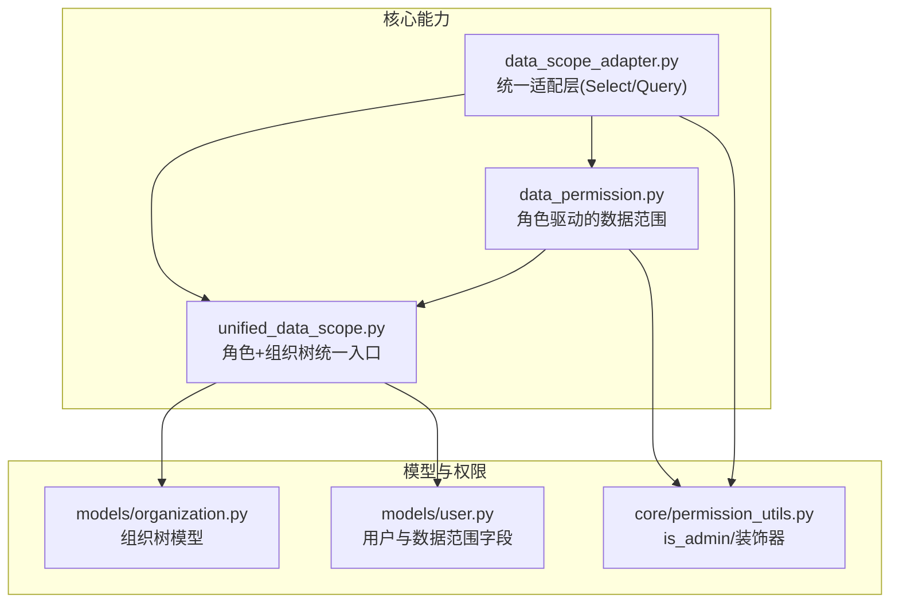
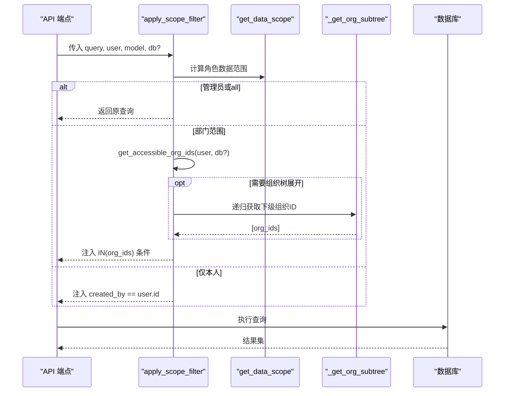
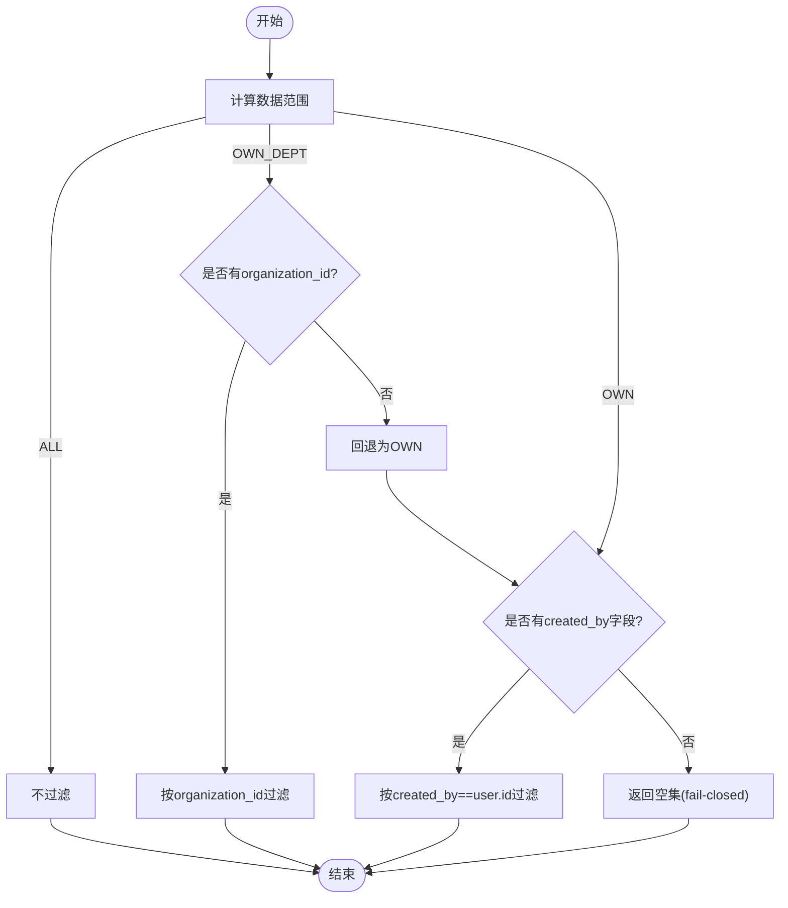
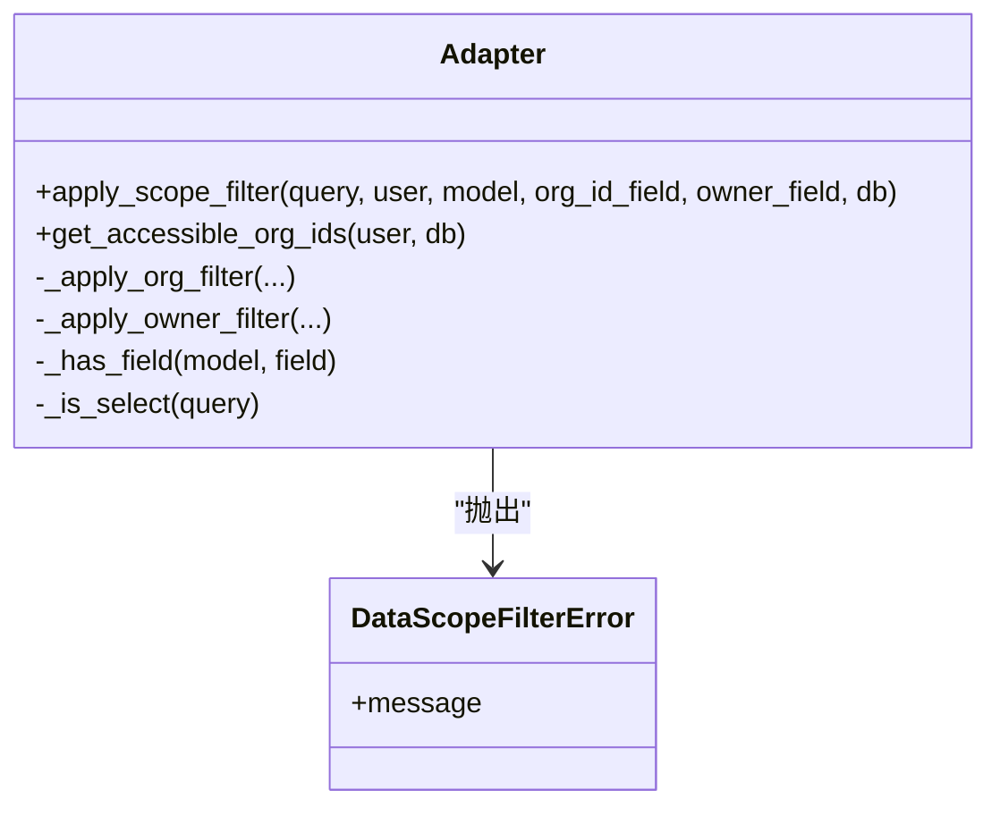
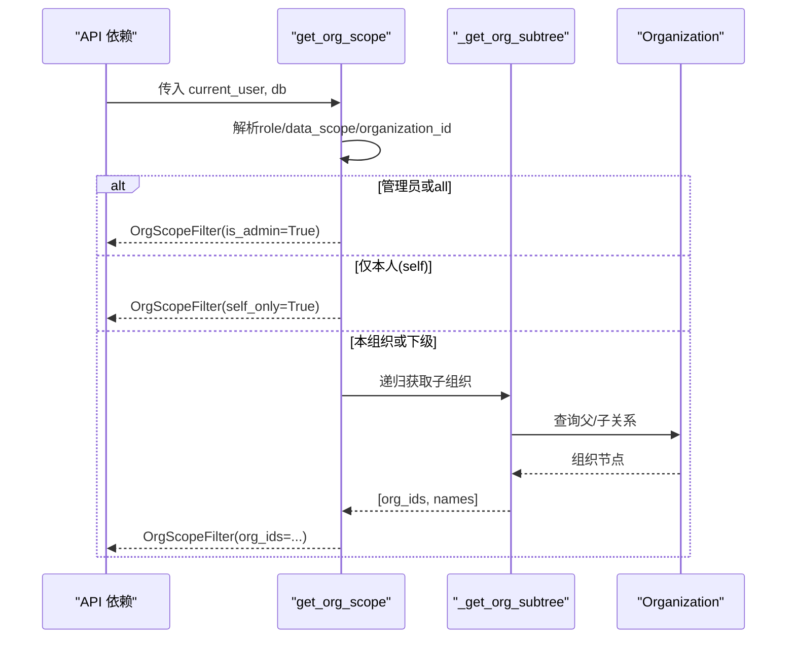
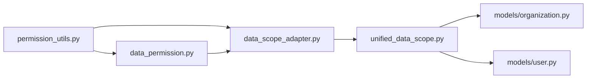

# 数据范围隔离

<cite>
**本文引用的文件**
- [backend/app/core/data_permission.py](file://backend/app/core/data_permission.py)
- [backend/app/core/data_scope_adapter.py](file://backend/app/core/data_scope_adapter.py)
- [backend/app/core/unified_data_scope.py](file://backend/app/core/unified_data_scope.py)
- [backend/app/models/organization.py](file://backend/app/models/organization.py)
- [backend/app/models/user.py](file://backend/app/models/user.py)
- [backend/app/core/permission_utils.py](file://backend/app/core/permission_utils.py)
- [backend/tests/security/test_data_isolation.py](file://backend/tests/security/test_data_isolation.py)
- [backend/tests/unit/test_data_scope_adapter_a24.py](file://backend/tests/unit/test_data_scope_adapter_a24.py)
</cite>

## 目录
1. [简介](#简介)
2. [项目结构](#项目结构)
3. [核心组件](#核心组件)
4. [架构总览](#架构总览)
5. [详细组件分析](#详细组件分析)
6. [依赖关系分析](#依赖关系分析)
7. [性能考量](#性能考量)
8. [故障排查指南](#故障排查指南)
9. [结论](#结论)
10. [附录：配置与使用示例](#附录配置与使用示例)

## 简介
本文件系统性说明系统的数据范围隔离机制，围绕“组织层级 + 数据范围”的双维度控制，覆盖全局数据、组织内数据、个人数据的访问策略。文档涵盖：
- 角色级别的数据访问权限控制（超级管理员、管理员、普通用户）
- 数据范围查询构建器与动态 SQL 生成
- 跨组织数据访问控制（含组织树展开）
- 统一适配层与迁移策略
- 为业务模块添加数据范围支持的方法与示例

## 项目结构
数据范围隔离的核心实现集中在后端 core 层，涉及三个关键模块：
- 基于角色的数据范围：data_permission.py
- 统一数据范围适配器：data_scope_adapter.py
- 统一数据范围聚合（角色 + 组织树）：unified_data_scope.py
- 模型支撑：organization.py、user.py
- 权限工具：permission_utils.py

图表来源
- [backend/app/core/data_permission.py:20-134](file://backend/app/core/data_permission.py#L20-L134)
- [backend/app/core/unified_data_scope.py:43-163](file://backend/app/core/unified_data_scope.py#L43-L163)
- [backend/app/core/data_scope_adapter.py:58-183](file://backend/app/core/data_scope_adapter.py#L58-L183)
- [backend/app/models/organization.py:31-78](file://backend/app/models/organization.py#L31-L78)
- [backend/app/models/user.py:26-90](file://backend/app/models/user.py#L26-L90)
- [backend/app/core/permission_utils.py:17-58](file://backend/app/core/permission_utils.py#L17-L58)

章节来源
- [backend/app/core/data_permission.py:20-134](file://backend/app/core/data_permission.py#L20-L134)
- [backend/app/core/data_scope_adapter.py:1-44](file://backend/app/core/data_scope_adapter.py#L1-L44)
- [backend/app/core/unified_data_scope.py:1-30](file://backend/app/core/unified_data_scope.py#L1-L30)

## 核心组件
- 数据范围枚举与判定
  - DataScope：ALL（全部）、OWN_DEPT（本部门/组织）、OWN（仅本人）
  - get_data_scope(user)：根据角色与 is_superuser 计算数据范围
- 查询过滤与记录校验
  - apply_scope_to_query(query, model, user, owner_field, dept_field)：按范围注入过滤条件
  - check_record_access(record, user, ...)：单条记录访问校验
  - filter_by_data_scope(...)：便捷封装
- 统一适配层
  - apply_scope_filter(query, user, model, org_id_field, owner_field, db)：自动识别 Select/Query，统一应用过滤；可传入 db 以启用组织树展开
  - get_accessible_org_ids(user, db)：计算可访问组织 ID 列表（None=不限制，[]表示无组织级权限）
- 组织树与范围
  - OrgScopeFilter：基于组织树的过滤对象，支持 self_only、org_ids 等
  - _get_org_subtree(db, org_id)：递归获取当前组织及其下级（带深度保护与环检测）
  - get_org_scope(current_user, db)：FastAPI 依赖，返回 OrgScopeFilter
- 权限工具
  - is_admin(user)、is_superuser(user)：管理员/超级管理员判断
  - require_organization、require_admin、require_permission：装饰器用于接口级权限控制

章节来源
- [backend/app/core/data_permission.py:20-187](file://backend/app/core/data_permission.py#L20-L187)
- [backend/app/core/data_scope_adapter.py:58-225](file://backend/app/core/data_scope_adapter.py#L58-L225)
- [backend/app/core/unified_data_scope.py:43-343](file://backend/app/core/unified_data_scope.py#L43-L343)
- [backend/app/core/permission_utils.py:17-58](file://backend/app/core/permission_utils.py#L17-L58)

## 架构总览
数据范围隔离采用“角色 + 组织树”双轨制，并通过统一适配层屏蔽差异：
- 角色轨道：通过 DataScope 决定 ALL/OWN_DEPT/OWN
- 组织树轨道：通过 OrgScopeFilter 与 _get_org_subtree 实现“本组织及下级”的递归访问
- 统一入口：apply_scope_filter 同时兼容 SQLAlchemy 2.0 Select 与旧式 Query，并支持 fail-closed 安全降级

图表来源
- [backend/app/core/data_scope_adapter.py:114-183](file://backend/app/core/data_scope_adapter.py#L114-L183)
- [backend/app/core/unified_data_scope.py:245-276](file://backend/app/core/unified_data_scope.py#L245-L276)
- [backend/app/core/data_permission.py:54-134](file://backend/app/core/data_permission.py#L54-L134)

## 详细组件分析

### 基于角色的数据范围（data_permission.py）
- 角色到范围的映射
  - 超级管理员或 super_admin -> ALL
  - 管理员或 admin -> OWN_DEPT
  - 其他 -> OWN
- 查询过滤
  - OWN_DEPT：按 organization_id 过滤；若用户无组织归属则回退至 OWN
  - OWN：按 created_by 过滤；若模型缺少 owner 字段，fail-closed 返回空集
- 记录级校验
  - check_record_access：按范围对比记录的 department/owner 与用户属性
- 便捷方法
  - filter_by_data_scope：默认 owner_field="created_by", dept_field="organization_id"

图表来源
- [backend/app/core/data_permission.py:54-134](file://backend/app/core/data_permission.py#L54-L134)

章节来源
- [backend/app/core/data_permission.py:20-187](file://backend/app/core/data_permission.py#L20-L187)

### 统一数据范围适配器（data_scope_adapter.py）
- 目标：统一三种历史实现，提供单一入口 apply_scope_filter
- 行为要点
  - 管理员/超级管理员：直接返回原查询
  - data_scope="self"：强制仅本人过滤
  - data_scope="all"：不过滤
  - 角色范围：优先走角色逻辑；当传入 db 时，OWN_DEPT 会展开组织树
  - 模型字段缺失：fail-closed（抛错或降级），绝不静默放行全量
- 组织 ID 计算
  - get_accessible_org_ids：返回 None（不限制）、[]（无组织级权限）、[id...]（可访问组织）

图表来源
- [backend/app/core/data_scope_adapter.py:54-225](file://backend/app/core/data_scope_adapter.py#L54-L225)

章节来源
- [backend/app/core/data_scope_adapter.py:1-225](file://backend/app/core/data_scope_adapter.py#L1-L225)

### 统一数据范围聚合（unified_data_scope.py）
- 角色部分
  - DataScope、get_data_scope、apply_scope_to_query、check_record_access、filter_by_data_scope、require_data_permission
- 组织树部分
  - OrgScopeFilter：支持 has_full_access、filter_by_org_ids
  - _get_org_subtree：递归遍历组织树，带最大深度与环检测
  - get_org_scope：FastAPI 依赖，根据 role、data_scope、organization_id 构造 OrgScopeFilter

图表来源
- [backend/app/core/unified_data_scope.py:191-343](file://backend/app/core/unified_data_scope.py#L191-L343)
- [backend/app/models/organization.py:31-78](file://backend/app/models/organization.py#L31-L78)

章节来源
- [backend/app/core/unified_data_scope.py:1-343](file://backend/app/core/unified_data_scope.py#L1-L343)
- [backend/app/models/organization.py:31-78](file://backend/app/models/organization.py#L31-L78)

### 模型与权限支撑
- 用户模型（user.py）
  - role、is_superuser、organization_id、data_scope 等字段
  - data_scope 支持 all/org/org_children/self
- 组织模型（organization.py）
  - parent_id 自引用形成树形结构
  - 索引优化查询性能
- 权限工具（permission_utils.py）
  - is_admin/is_superuser 判断
  - require_organization 装饰器确保接口级组织访问控制

章节来源
- [backend/app/models/user.py:26-90](file://backend/app/models/user.py#L26-L90)
- [backend/app/models/organization.py:31-78](file://backend/app/models/organization.py#L31-L78)
- [backend/app/core/permission_utils.py:17-58](file://backend/app/core/permission_utils.py#L17-L58)

## 依赖关系分析
- 耦合与内聚
  - data_permission.py 与 permission_utils.py 低耦合，职责清晰
  - data_scope_adapter.py 作为统一入口，聚合角色与组织树逻辑，降低调用方复杂度
  - unified_data_scope.py 将两套体系合并，便于维护
- 外部依赖
  - SQLAlchemy：Select/Query 两种风格兼容
  - FastAPI：Depends(get_current_user)、HTTPException
- 循环依赖风险
  - 通过延迟导入避免循环（如 adapter 中 from app.core.unified_data_scope import ...）

图表来源
- [backend/app/core/data_scope_adapter.py:1-44](file://backend/app/core/data_scope_adapter.py#L1-L44)
- [backend/app/core/unified_data_scope.py:1-30](file://backend/app/core/unified_data_scope.py#L1-L30)

章节来源
- [backend/app/core/data_scope_adapter.py:1-44](file://backend/app/core/data_scope_adapter.py#L1-L44)
- [backend/app/core/unified_data_scope.py:1-30](file://backend/app/core/unified_data_scope.py#L1-L30)

## 性能考量
- 组织树展开
  - _get_org_subtree 使用递归遍历，设置最大深度防止无限递归
  - 建议对 organizations.parent_id 建立索引以提升查询效率（已存在）
- 查询过滤
  - 统一适配层在 Select/Query 上分别使用 .where/.filter，减少额外开销
  - 仅在必要时展开组织树（传入 db），避免不必要的数据库访问
- 失败关闭策略
  - 模型缺少必要字段时立即降级或抛错，避免产生全量扫描

[本节为通用性能讨论，不直接分析具体文件]

## 故障排查指南
- 常见问题
  - 查询未生效：确认是否调用了 apply_scope_filter 或 filter_by_data_scope
  - 越权访问：检查用户 role/data_scope 是否正确；管理员会被豁免
  - 模型字段缺失：若缺少 organization_id 或 created_by，可能触发 fail-closed 导致空结果或异常
- 定位步骤
  - 打印 get_data_scope(user) 确认范围
  - 打印 get_accessible_org_ids(user, db) 确认组织范围
  - 检查模型是否存在 required fields
- 测试参考
  - 基础隔离断言：test_data_isolation.py
  - 适配器行为验证：test_data_scope_adapter_a24.py

章节来源
- [backend/tests/security/test_data_isolation.py:1-41](file://backend/tests/security/test_data_isolation.py#L1-L41)
- [backend/tests/unit/test_data_scope_adapter_a24.py:72-168](file://backend/tests/unit/test_data_scope_adapter_a24.py#L72-L168)

## 结论
系统通过“角色 + 组织树”双重机制实现了细粒度的数据范围隔离，并以统一适配层屏蔽了历史实现的差异。新代码应优先使用 apply_scope_filter，以获得一致的语义与安全降级策略。对于需要跨组织访问的场景，可通过传入 db 启用组织树展开。配合 require_organization 等装饰器，可在接口层进一步保障组织边界。

[本节为总结性内容，不直接分析具体文件]

## 附录：配置与使用示例

### 数据范围配置
- 用户层面
  - role：super_admin/admin/user/viewer
  - data_scope：all/org/org_children/self
  - organization_id：所属组织
- 组织层面
  - 通过 parent_id 构建树形结构，支持多级组织

章节来源
- [backend/app/models/user.py:42-67](file://backend/app/models/user.py#L42-L67)
- [backend/app/models/organization.py:47-73](file://backend/app/models/organization.py#L47-L73)

### 为业务模块添加数据范围支持
- 推荐方式（新代码）
  - 使用 apply_scope_filter(select(Model), current_user, Model, db=db) 或 apply_scope_filter(db.query(Model), current_user, Model)
  - 如需包含下级组织，传入 db 以启用组织树展开
- 旧代码迁移
  - 逐步替换为 apply_scope_filter，保持原有语义一致
  - 注意模型字段要求：至少具备 organization_id 或 created_by

章节来源
- [backend/app/core/data_scope_adapter.py:24-37](file://backend/app/core/data_scope_adapter.py#L24-L37)
- [backend/app/core/data_scope_adapter.py:114-183](file://backend/app/core/data_scope_adapter.py#L114-L183)

### 跨组织数据访问控制
- 接口级控制
  - 使用 @require_organization 确保只能访问自身组织数据（管理员除外）
- 查询级控制
  - 通过 OrgScopeFilter.filter_by_org_ids 精确限定多列组织 ID
  - 结合 get_org_scope 快速构建过滤器

章节来源
- [backend/app/core/permission_utils.py:218-269](file://backend/app/core/permission_utils.py#L218-L269)
- [backend/app/core/unified_data_scope.py:191-242](file://backend/app/core/unified_data_scope.py#L191-L242)