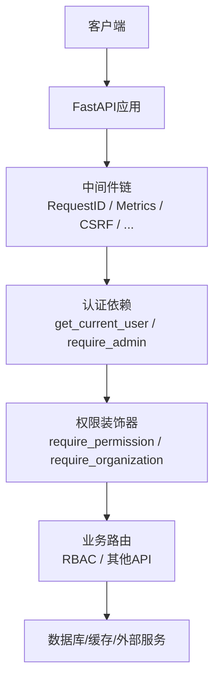
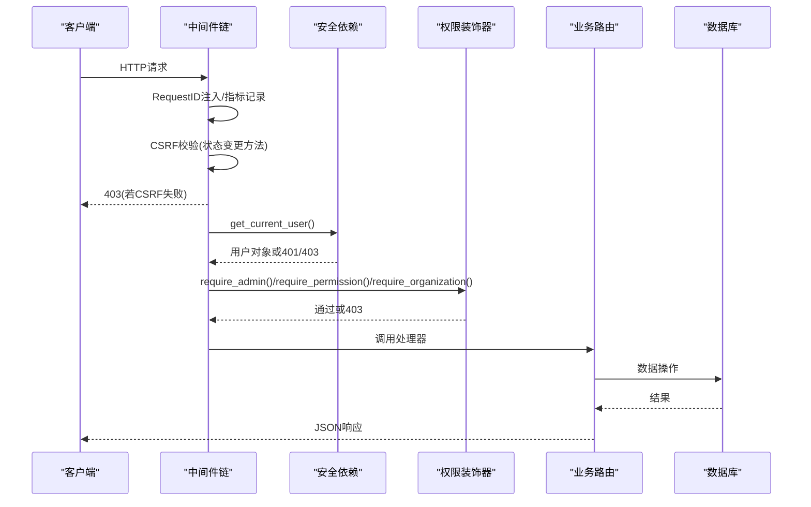
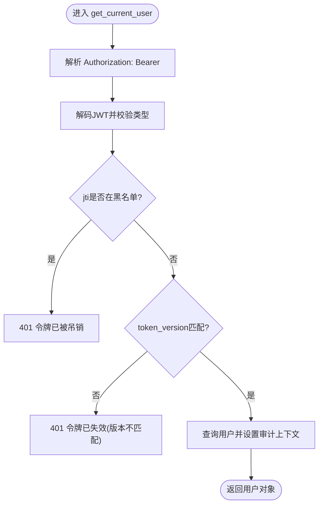
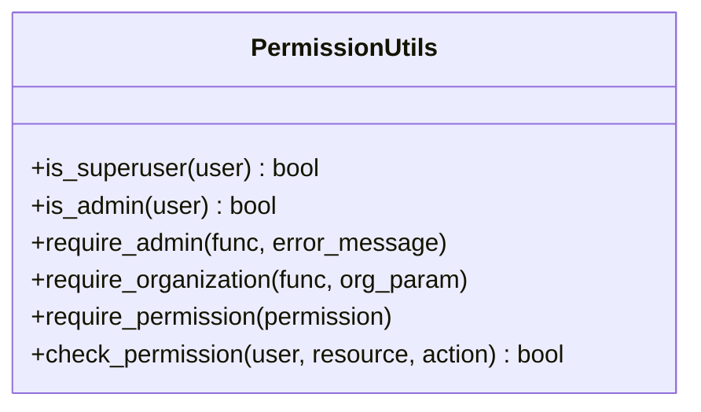
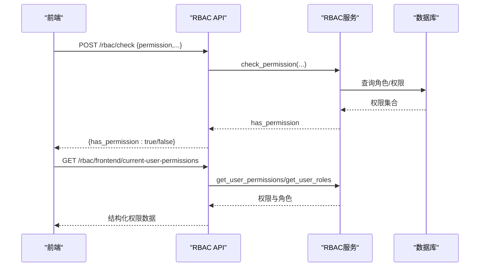
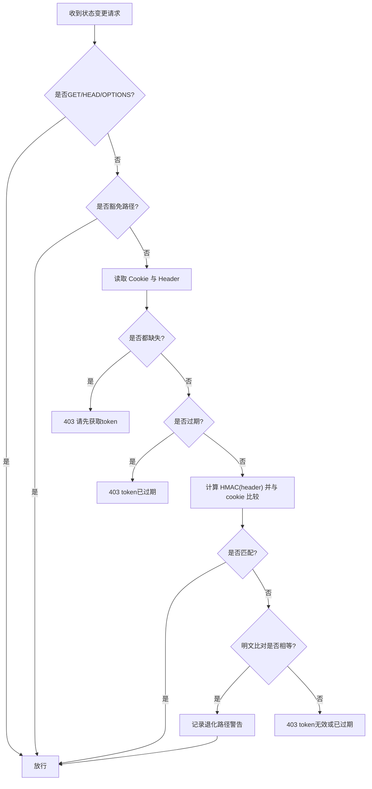
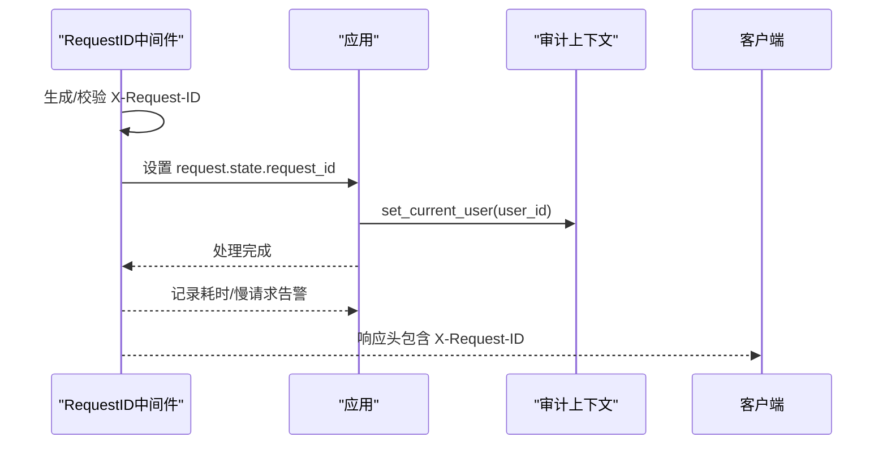
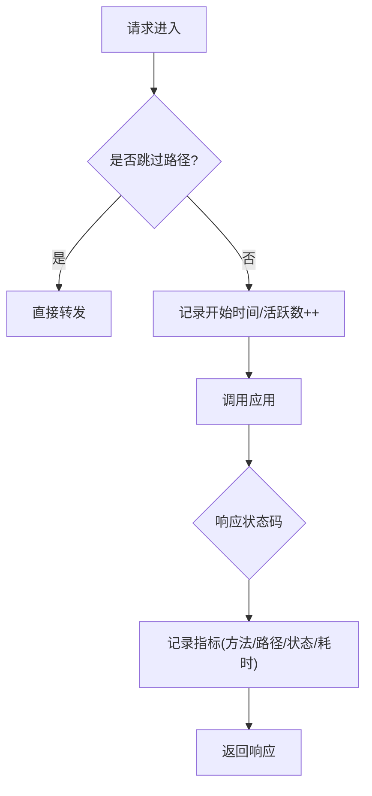

# API访问控制

<cite>
**本文引用的文件**
- [security.py](file://backend/app/core/security.py)
- [csrf_middleware.py](file://backend/app/middleware/csrf_middleware.py)
- [permission_utils.py](file://backend/app/core/permission_utils.py)
- [rbac.py](file://backend/app/api/v1/auth/rbac.py)
- [request_id.py](file://backend/app/middleware/request_id.py)
- [audit_context.py](file://backend/app/middleware/audit_context.py)
- [metrics_middleware.py](file://backend/app/middleware/metrics_middleware.py)
- [error_handler.py](file://backend/app/core/error_handler.py)
- [config.py](file://backend/app/core/config.py)
</cite>

## 目录
1. [简介](#简介)
2. [项目结构](#项目结构)
3. [核心组件](#核心组件)
4. [架构总览](#架构总览)
5. [详细组件分析](#详细组件分析)
6. [依赖关系分析](#依赖关系分析)
7. [性能考虑](#性能考虑)
8. [故障排查指南](#故障排查指南)
9. [结论](#结论)
10. [附录](#附录)

## 简介
本文件面向后端开发者与运维人员，系统化说明本项目的API访问控制机制。内容覆盖：
- 认证与授权：JWT、角色/权限检查、组织隔离、RBAC接口
- 中间件拦截：CSRF防护、请求ID链路追踪、指标采集、审计上下文
- 安全策略：CSRF签名校验、速率限制、代理头信任策略、令牌吊销与版本校验
- 执行顺序与错误处理：从请求进入至响应返回的完整链路
- 使用示例：装饰器用法、自定义权限验证、异常处理、前端路由守卫协同

## 项目结构
本项目采用分层与模块化组织：
- 核心安全能力集中在 core/security.py（JWT、密码、依赖注入）
- 通用权限工具在 core/permission_utils.py（装饰器、资源级权限）
- RBAC管理API在 api/v1/auth/rbac.py（角色、权限分配、查询）
- 安全中间件位于 middleware/（CSRF、请求ID、指标等）
- 配置集中于 core/config.py（CORS、CSRF开关、代理信任等）

图表来源
- [security.py:243-336](file://backend/app/core/security.py#L243-L336)
- [csrf_middleware.py:177-284](file://backend/app/middleware/csrf_middleware.py#L177-L284)
- [permission_utils.py:272-359](file://backend/app/core/permission_utils.py#L272-L359)
- [rbac.py:85-122](file://backend/app/api/v1/auth/rbac.py#L85-L122)

章节来源
- [config.py:126-154](file://backend/app/core/config.py#L126-L154)

## 核心组件
- 认证与鉴权
  - JWT生成/解码、Bearer提取、黑名单与token_version校验
  - 管理员校验、活跃用户校验
- 权限工具
  - 管理员/超级管理员判断
  - 资源级权限检查（resource:action 或通配符）
  - 组织访问控制（按组织隔离）
- 中间件
  - CSRF保护（HMAC签名+过期检测+豁免路径）
  - 请求ID链路追踪（X-Request-ID注入与慢请求告警）
  - 指标采集（请求计数、耗时、慢请求）
  - 审计上下文（当前用户ID、请求ID跨层传递）
- 配置
  - CORS、CSRF开关、代理头信任、速率限制开关

章节来源
- [security.py:210-336](file://backend/app/core/security.py#L210-L336)
- [permission_utils.py:17-359](file://backend/app/core/permission_utils.py#L17-L359)
- [csrf_middleware.py:17-132](file://backend/app/middleware/csrf_middleware.py#L17-L132)
- [request_id.py:40-128](file://backend/app/middleware/request_id.py#L40-L128)
- [metrics_middleware.py:132-177](file://backend/app/middleware/metrics_middleware.py#L132-L177)
- [audit_context.py:15-58](file://backend/app/middleware/audit_context.py#L15-L58)
- [config.py:126-154](file://backend/app/core/config.py#L126-L154)

## 架构总览
请求进入后的典型处理流程如下：

图表来源
- [request_id.py:50-119](file://backend/app/middleware/request_id.py#L50-L119)
- [csrf_middleware.py:189-284](file://backend/app/middleware/csrf_middleware.py#L189-L284)
- [security.py:243-336](file://backend/app/core/security.py#L243-L336)
- [permission_utils.py:61-114](file://backend/app/core/permission_utils.py#L61-L114)
- [permission_utils.py:218-269](file://backend/app/core/permission_utils.py#L218-L269)
- [permission_utils.py:272-309](file://backend/app/core/permission_utils.py#L272-L309)

## 详细组件分析

### 认证与令牌管理（JWT、黑名单、版本校验）
- 令牌签发与解码：统一密钥与算法，支持access与refresh类型
- 认证依赖：从Authorization头提取Bearer，解码后校验黑名单与type字段
- 强制下线：结合token_version与用户token_version_safe进行版本匹配，不匹配则拒绝
- 审计归因：将当前用户ID写入审计上下文，供写操作可追责

图表来源
- [security.py:243-336](file://backend/app/core/security.py#L243-L336)

章节来源
- [security.py:210-336](file://backend/app/core/security.py#L210-L336)

### 权限装饰器与资源级权限
- 管理员校验：@require_admin 支持装饰器与直接调用两种模式
- 组织隔离：@require_organization 确保非管理员仅能访问自身组织数据
- 资源权限：@require_permission("resource:action") 基于用户permissions字段（JSON或逗号分隔），支持通配符匹配
- 权限检查：check_permission 提供细粒度资源/动作判定

图表来源
- [permission_utils.py:17-359](file://backend/app/core/permission_utils.py#L17-L359)

章节来源
- [permission_utils.py:61-114](file://backend/app/core/permission_utils.py#L61-L114)
- [permission_utils.py:218-269](file://backend/app/core/permission_utils.py#L218-L269)
- [permission_utils.py:272-359](file://backend/app/core/permission_utils.py#L272-L359)

### RBAC管理与前端权限同步
- 角色与权限CRUD：创建/更新/删除角色，批量授予/撤销权限
- 权限检查API：POST /rbac/check 用于服务端侧权限判定
- 前端专用接口：
  - GET /rbac/frontend/current-user-permissions：返回结构化权限与角色信息
  - GET /rbac/frontend/route-permissions：返回路由到权限映射，供前端路由守卫使用

图表来源
- [rbac.py:85-122](file://backend/app/api/v1/auth/rbac.py#L85-L122)
- [rbac.py:442-523](file://backend/app/api/v1/auth/rbac.py#L442-L523)

章节来源
- [rbac.py:85-122](file://backend/app/api/v1/auth/rbac.py#L85-L122)
- [rbac.py:144-405](file://backend/app/api/v1/auth/rbac.py#L144-L405)
- [rbac.py:442-523](file://backend/app/api/v1/auth/rbac.py#L442-L523)

### CSRF防护（HMAC签名增强）
- 双提交Cookie模式：Cookie为HMAC(raw_token)，Header携带raw_token
- 过期检测：token内嵌时间戳，超过CSRF_TOKEN_EXPIRY即拒绝
- 豁免路径：登录、注册、健康检查、文档等无需CSRF
- 降级兼容：旧版明文比对仍可用但记录警告日志
- 可信代理：仅在配置TRUSTED_PROXIES时透传X-Forwarded-For首段

图表来源
- [csrf_middleware.py:65-132](file://backend/app/middleware/csrf_middleware.py#L65-L132)
- [csrf_middleware.py:177-284](file://backend/app/middleware/csrf_middleware.py#L177-L284)

章节来源
- [csrf_middleware.py:17-132](file://backend/app/middleware/csrf_middleware.py#L17-L132)
- [csrf_middleware.py:177-284](file://backend/app/middleware/csrf_middleware.py#L177-L284)
- [config.py:148-154](file://backend/app/core/config.py#L148-L154)

### 请求ID与审计上下文
- 请求ID：每个请求生成唯一ID，注入响应头X-Request-ID，便于全链路追踪；支持客户端传入合法ID
- 审计上下文：通过ContextVar在当前请求范围内传递user_id与request_id，供审计与日志模块使用

图表来源
- [request_id.py:40-128](file://backend/app/middleware/request_id.py#L40-L128)
- [audit_context.py:15-58](file://backend/app/middleware/audit_context.py#L15-L58)
- [security.py:324-333](file://backend/app/core/security.py#L324-L333)

章节来源
- [request_id.py:40-128](file://backend/app/middleware/request_id.py#L40-L128)
- [audit_context.py:15-58](file://backend/app/middleware/audit_context.py#L15-L58)

### 指标采集与慢请求监控
- 指标存储：内存计数器，线程安全，记录请求数、错误率、平均耗时、活跃请求数、Top端点、慢请求列表
- 跳过路径：健康检查、指标端点、favicon等不采集
- 输出：可通过内部端点查询指标摘要（由上层暴露）

图表来源
- [metrics_middleware.py:132-177](file://backend/app/middleware/metrics_middleware.py#L132-L177)

章节来源
- [metrics_middleware.py:18-125](file://backend/app/middleware/metrics_middleware.py#L18-L125)
- [metrics_middleware.py:132-177](file://backend/app/middleware/metrics_middleware.py#L132-L177)

### 错误处理与统一响应
- 统一错误体：error_response封装code/message/success/details
- 常用响应：not_found_response、forbidden_response、server_error_response
- 业务异常：BusinessLogicError用于业务逻辑错误（状态码400）

章节来源
- [error_handler.py:38-108](file://backend/app/core/error_handler.py#L38-L108)

## 依赖关系分析
- 认证依赖与安全中间件的耦合点：
  - get_current_user 依赖数据库会话与黑名单服务
  - CSRF中间件依赖配置中的CSRF开关与密钥
  - 权限装饰器依赖用户对象的role/permissions字段
- 中间件顺序建议：
  - RequestID → Metrics → CSRF → 认证依赖 → 权限装饰器 → 业务路由

图表来源
- [request_id.py:40-128](file://backend/app/middleware/request_id.py#L40-L128)
- [metrics_middleware.py:132-177](file://backend/backend/app/middleware/metrics_middleware.py#L132-L177)
- [csrf_middleware.py:177-284](file://backend/app/middleware/csrf_middleware.py#L177-L284)
- [security.py:243-336](file://backend/app/core/security.py#L243-L336)
- [permission_utils.py:61-359](file://backend/app/core/permission_utils.py#L61-L359)

章节来源
- [config.py:126-154](file://backend/app/core/config.py#L126-L154)

## 性能考虑
- 中间件开销
  - RequestID与Metrics为轻量ASGI中间件，开销极低
  - CSRF校验涉及HMAC计算与过期检查，建议在网关层也做基础校验以减轻后端压力
- 认证与权限
  - get_current_user 每次请求查库，建议配合缓存（如Redis）缓存用户基本信息与权限集
  - 权限检查尽量使用本地缓存（用户权限集）减少DB访问
- 指标与慢请求
  - 合理设置慢请求阈值，避免过多慢请求记录导致内存增长
  - 定期清理过期键（已在速率限制中实现）

[本节为通用指导，不直接分析具体文件]

## 故障排查指南
- 401未认证
  - 检查Authorization头是否正确携带Bearer Token
  - 检查Token是否过期或被吊销（黑名单/版本不匹配）
  - 参考：[security.py:243-336](file://backend/app/core/security.py#L243-L336)
- 403无权限/CSRF失败
  - 确认是否处于豁免路径或方法
  - 检查CSRF Cookie与Header是否匹配且未过期
  - 参考：[csrf_middleware.py:189-284](file://backend/app/middleware/csrf_middleware.py#L189-L284)
  - 权限不足：检查用户permissions字段与所需resource:action
  - 参考：[permission_utils.py:272-359](file://backend/app/core/permission_utils.py#L272-L359)
- 404资源不存在
  - 使用统一响应构建器返回标准格式
  - 参考：[error_handler.py:63-77](file://backend/app/core/error_handler.py#L63-L77)
- 慢请求定位
  - 查看RequestID与Metrics记录的慢请求列表
  - 参考：[request_id.py:94-119](file://backend/app/middleware/request_id.py#L94-L119)、[metrics_middleware.py:75-125](file://backend/app/middleware/metrics_middleware.py#L75-L125)

章节来源
- [security.py:243-336](file://backend/app/core/security.py#L243-L336)
- [csrf_middleware.py:189-284](file://backend/app/middleware/csrf_middleware.py#L189-L284)
- [permission_utils.py:272-359](file://backend/app/core/permission_utils.py#L272-L359)
- [error_handler.py:63-77](file://backend/app/core/error_handler.py#L63-L77)
- [request_id.py:94-119](file://backend/app/middleware/request_id.py#L94-L119)
- [metrics_middleware.py:75-125](file://backend/app/middleware/metrics_middleware.py#L75-L125)

## 结论
本系统的API访问控制以“中间件前置拦截 + 依赖注入认证 + 装饰器授权”为核心，结合CSRF、请求ID、指标采集与审计上下文，形成端到端的安全与可观测性闭环。通过RBAC接口与前端路由权限映射，前后端协同实现一致的用户体验与安全的边界控制。

[本节为总结，不直接分析具体文件]

## 附录

### 使用示例与最佳实践
- 使用@require_permission装饰器
  - 在需要资源级权限的端点上添加装饰器，参数为"resource:action"
  - 若无权限，将返回403并提示缺少权限
  - 参考：[permission_utils.py:272-309](file://backend/app/core/permission_utils.py#L272-L309)
- 使用@require_admin装饰器
  - 对管理端点进行管理员校验，支持装饰器与直接调用两种模式
  - 参考：[permission_utils.py:61-114](file://backend/app/core/permission_utils.py#L61-L114)
- 使用@require_organization组织隔离
  - 确保非管理员只能访问自身组织数据
  - 参考：[permission_utils.py:218-269](file://backend/app/core/permission_utils.py#L218-L269)
- 自定义权限验证器
  - 基于check_permission扩展资源/动作规则，或在装饰器中组合多个条件
  - 参考：[permission_utils.py:312-359](file://backend/app/core/permission_utils.py#L312-L359)
- 权限异常处理
  - 统一使用HTTPException抛出401/403，或通过error_handler构建标准错误体
  - 参考：[error_handler.py:38-108](file://backend/app/core/error_handler.py#L38-L108)
- 前端路由守卫协同
  - 调用GET /rbac/frontend/route-permissions获取路由到权限映射
  - 调用GET /rbac/frontend/current-user-permissions获取当前用户权限与角色
  - 在前端路由守卫中根据权限决定是否允许导航
  - 参考：[rbac.py:442-523](file://backend/app/api/v1/auth/rbac.py#L442-L523)

章节来源
- [permission_utils.py:61-114](file://backend/app/core/permission_utils.py#L61-L114)
- [permission_utils.py:218-269](file://backend/app/core/permission_utils.py#L218-L269)
- [permission_utils.py:272-359](file://backend/app/core/permission_utils.py#L272-L359)
- [error_handler.py:38-108](file://backend/app/core/error_handler.py#L38-L108)
- [rbac.py:442-523](file://backend/app/api/v1/auth/rbac.py#L442-L523)