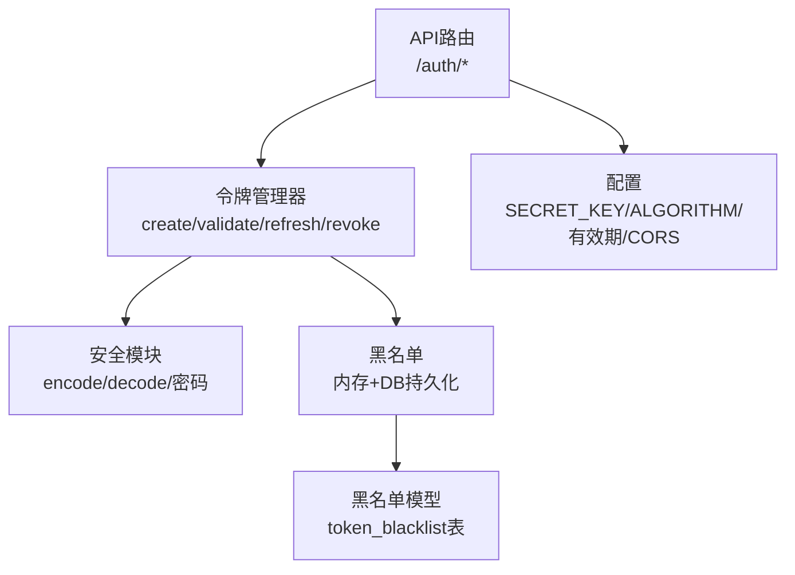
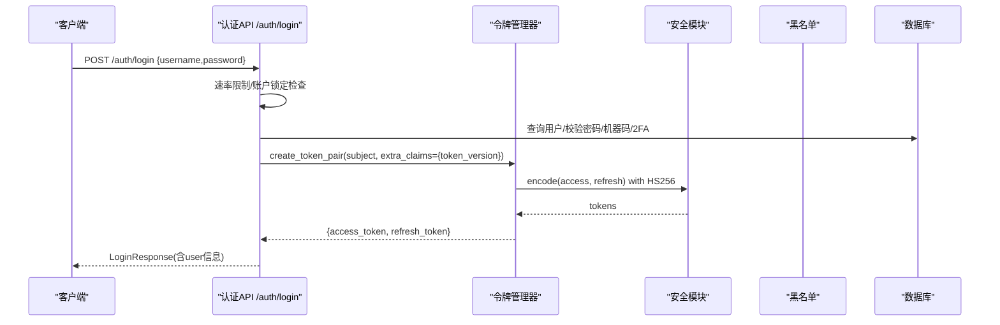
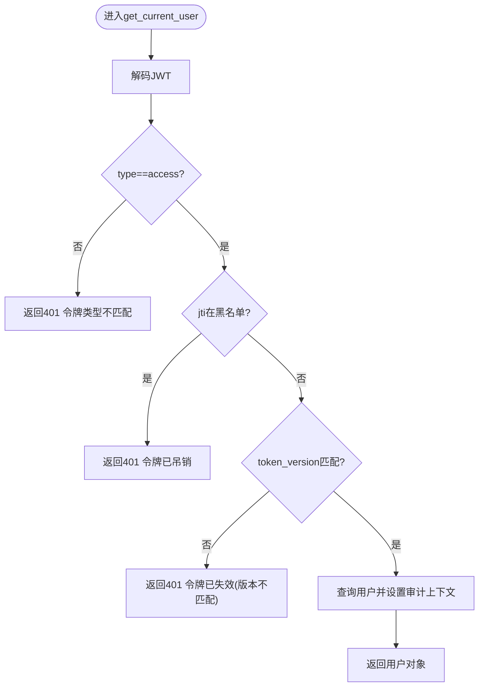
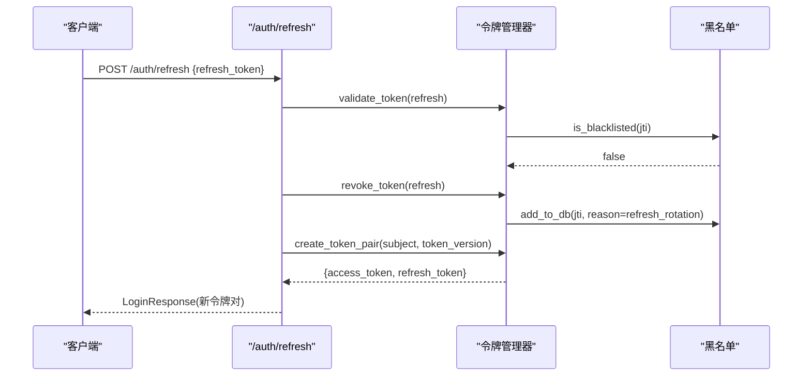
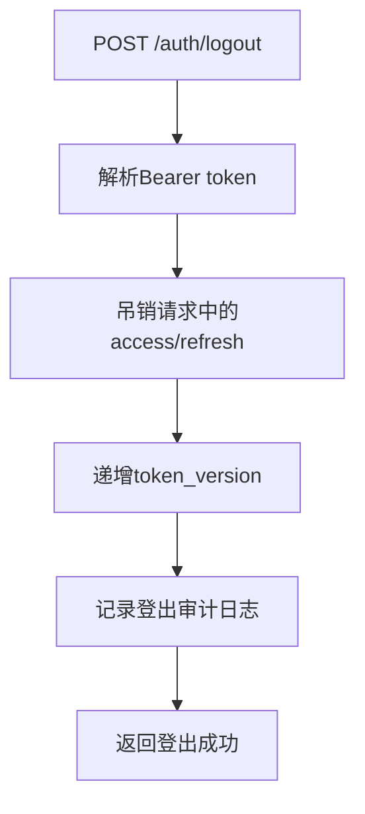
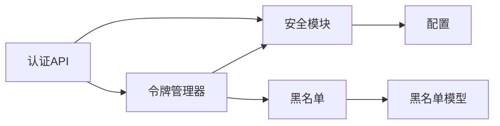

# JWT认证流程

<cite>
**本文引用的文件**
- [security.py](file://backend/app/core/security.py)
- [token_manager.py](file://backend/app/core/token_manager.py)
- [token_blacklist.py](file://backend/app/core/token_blacklist.py)
- [auth.py](file://backend/app/api/v1/auth/auth.py)
- [config.py](file://backend/app/core/config.py)
- [token_blacklist模型](file://backend/app/models/token_blacklist.py)
- [auth schemas](file://backend/app/schemas/auth.py)
</cite>

## 目录
1. [简介](#简介)
2. [项目结构](#项目结构)
3. [核心组件](#核心组件)
4. [架构总览](#架构总览)
5. [详细组件分析](#详细组件分析)
6. [依赖关系分析](#依赖关系分析)
7. [性能与安全考量](#性能与安全考量)
8. [故障排查指南](#故障排查指南)
9. [结论](#结论)
10. [附录：使用示例与最佳实践](#附录使用示例与最佳实践)

## 简介
本文件面向JWT认证流程，覆盖令牌的生成、验证、刷新、撤销（黑名单）、令牌生命周期管理、多设备登录支持、加密算法与签名校验、过期时间处理、存储策略、跨域配置及安全最佳实践。内容基于后端代码实现进行说明，帮助开发者与运维人员理解并正确使用系统提供的JWT能力。

## 项目结构
JWT相关能力主要分布在以下模块：
- 安全与鉴权：提供JWT加解密、密码哈希、FastAPI依赖注入等
- 令牌管理：封装令牌对创建、校验、刷新、吊销的高层API
- 黑名单：内存+数据库持久化的令牌撤销机制
- API路由：登录、双因素校验、刷新、登出、CSRF等接口
- 配置：密钥、算法、有效期、CORS、速率限制等
- 数据模型：黑名单表结构

图表来源
- [auth.py:101-690](file://backend/app/api/v1/auth/auth.py#L101-L690)
- [token_manager.py:64-240](file://backend/app/core/token_manager.py#L64-L240)
- [security.py:210-336](file://backend/app/core/security.py#L210-L336)
- [token_blacklist.py:27-163](file://backend/app/core/token_blacklist.py#L27-L163)
- [config.py:126-153](file://backend/app/core/config.py#L126-L153)
- [token_blacklist模型:13-61](file://backend/app/models/token_blacklist.py#L13-L61)

章节来源
- [auth.py:101-690](file://backend/app/api/v1/auth/auth.py#L101-L690)
- [token_manager.py:64-240](file://backend/app/core/token_manager.py#L64-L240)
- [security.py:210-336](file://backend/app/core/security.py#L210-L336)
- [token_blacklist.py:27-163](file://backend/app/core/token_blacklist.py#L27-L163)
- [config.py:126-153](file://backend/app/core/config.py#L126-L153)
- [token_blacklist模型:13-61](file://backend/app/models/token_blacklist.py#L13-L61)

## 核心组件
- 安全模块：负责JWT编码/解码、密码哈希、FastAPI认证依赖、输入脱敏、速率限制、客户端IP识别等
- 令牌管理器：统一封装令牌对的创建、校验、刷新、吊销，并集成黑名单检查与持久化
- 黑名单：内存集合+可选数据库持久化，支持自动清理过期条目
- API路由：登录、2FA校验、刷新、登出、CSRF获取等
- 配置：密钥、算法、有效期、CORS、CSRF、速率限制等
- 数据模型：黑名单表，记录被吊销的JTI、原因、过期时间、用户ID等

章节来源
- [security.py:210-336](file://backend/app/core/security.py#L210-L336)
- [token_manager.py:64-240](file://backend/app/core/token_manager.py#L64-L240)
- [token_blacklist.py:27-163](file://backend/app/core/token_blacklist.py#L27-L163)
- [auth.py:101-690](file://backend/app/api/v1/auth/auth.py#L101-L690)
- [config.py:126-153](file://backend/app/core/config.py#L126-L153)
- [token_blacklist模型:13-61](file://backend/app/models/token_blacklist.py#L13-L61)

## 架构总览
JWT认证的关键路径包括：
- 登录：校验用户名/密码、机器码绑定、可选2FA，成功后签发access_token与refresh_token，附带token_version
- 访问保护：从请求头提取Bearer token，解码后校验类型、黑名单、版本匹配，再查询用户上下文
- 刷新：仅接受refresh_token，校验通过后吊销旧refresh_token并签发新token对（轮换）
- 登出：吊销当前access_token（及可选refresh_token），递增token_version使该用户所有现存JWT立即失效
- 黑名单：内存快速判断+数据库持久化，启动时加载未过期记录，保证重启后仍有效

图表来源
- [auth.py:101-287](file://backend/app/api/v1/auth/auth.py#L101-L287)
- [token_manager.py:64-127](file://backend/app/core/token_manager.py#L64-L127)
- [security.py:210-225](file://backend/app/core/security.py#L210-L225)

章节来源
- [auth.py:101-287](file://backend/app/api/v1/auth/auth.py#L101-L287)
- [token_manager.py:64-127](file://backend/app/core/token_manager.py#L64-L127)
- [security.py:210-225](file://backend/app/core/security.py#L210-L225)

## 详细组件分析

### 令牌生成与验证
- 生成：
  - access_token：包含sub、jti、type=access、iat、exp，以及token_version（来自用户）
  - refresh_token：包含sub、jti、type=refresh、iat、exp
  - 算法与密钥：HS256，密钥来自配置或运行时动态生成
- 验证：
  - decode时校验签名与过期
  - 类型校验：access用于资源访问，refresh用于刷新
  - 黑名单校验：通过jti检查是否已被吊销
  - 版本校验：若用户token_version>0而token缺少版本声明或版本不匹配，拒绝访问

图表来源
- [security.py:243-336](file://backend/app/core/security.py#L243-L336)
- [token_blacklist.py:60-70](file://backend/app/core/token_blacklist.py#L60-L70)

章节来源
- [security.py:243-336](file://backend/app/core/security.py#L243-L336)
- [token_blacklist.py:60-70](file://backend/app/core/token_blacklist.py#L60-L70)

### 令牌刷新（轮换）
- 仅接受refresh_token，校验通过后：
  - 吊销旧refresh_token（加入黑名单）
  - 签发新的access_token与refresh_token对（携带最新token_version）
- 防止重放攻击：每次刷新都轮换refresh_token

图表来源
- [auth.py:594-690](file://backend/app/api/v1/auth/auth.py#L594-L690)
- [token_manager.py:218-240](file://backend/app/core/token_manager.py#L218-L240)
- [token_blacklist.py:133-163](file://backend/app/core/token_blacklist.py#L133-L163)

章节来源
- [auth.py:594-690](file://backend/app/api/v1/auth/auth.py#L594-L690)
- [token_manager.py:218-240](file://backend/app/core/token_manager.py#L218-L240)
- [token_blacklist.py:133-163](file://backend/app/core/token_blacklist.py#L133-L163)

### 令牌撤销与登出
- 登出：
  - 吊销本次请求携带的access_token（及可选refresh_token）
  - 递增用户token_version，使该用户所有现存JWT立即失效（强制下线）
  - 记录登出审计日志
- 黑名单：
  - 内存中快速判定，同时持久化到数据库，确保服务重启后仍有效
  - 支持按原始过期时间或TTL自动清理

图表来源
- [auth.py:570-591](file://backend/app/api/v1/auth/auth.py#L570-L591)
- [token_manager.py:176-210](file://backend/app/core/token_manager.py#L176-L210)
- [token_blacklist.py:27-52](file://backend/app/core/token_blacklist.py#L27-L52)

章节来源
- [auth.py:570-591](file://backend/app/api/v1/auth/auth.py#L570-L591)
- [token_manager.py:176-210](file://backend/app/core/token_manager.py#L176-L210)
- [token_blacklist.py:27-52](file://backend/app/core/token_blacklist.py#L27-L52)

### 多设备登录支持
- 每个设备会话拥有独立的jti，支持并发登录
- 登出时可仅吊销当前会话，或通过递增token_version强制下线全部会话
- 刷新采用轮换机制，避免共享refresh_token导致的多设备同步问题

章节来源
- [token_manager.py:64-127](file://backend/app/core/token_manager.py#L64-L127)
- [auth.py:570-690](file://backend/app/api/v1/auth/auth.py#L570-L690)

### 令牌生命周期与过期处理
- access_token默认有效期由配置决定（例如480分钟）
- refresh_token默认有效期更长（例如30天）
- 过期检测由JWT库在decode时完成；黑名单条目也支持按过期时间自动清理
- 登出或刷新会主动将旧令牌加入黑名单，缩短实际可用窗口

章节来源
- [config.py:126-130](file://backend/app/core/config.py#L126-L130)
- [token_blacklist.py:117-126](file://backend/app/core/token_blacklist.py#L117-L126)
- [token_manager.py:135-168](file://backend/app/core/token_manager.py#L135-L168)

### 安全特性
- 加密算法与签名：HS256，密钥来源于配置或运行时动态生成，避免硬编码
- 密码哈希：bcrypt，兼容新版bcrypt与passlib
- 速率限制：登录、注册、刷新、CSRF均有限流保护
- CSRF保护：提供CSRF token获取接口，支持Cookie+Header双重校验
- 敏感信息脱敏：日志中对敏感字段进行脱敏处理

章节来源
- [security.py:21-57](file://backend/app/core/security.py#L21-L57)
- [security.py:121-148](file://backend/app/core/security.py#L121-L148)
- [security.py:439-516](file://backend/app/core/security.py#L439-L516)
- [auth.py:692-747](file://backend/app/api/v1/auth/auth.py#L692-L747)

## 依赖关系分析
- API路由依赖令牌管理器与安全模块
- 令牌管理器依赖安全模块（编码/解码）与黑名单（校验/持久化）
- 黑名单依赖数据库模型（可选持久化）与内存集合（快速查找）
- 配置集中管理密钥、算法、有效期、CORS、CSRF、速率限制等

图表来源
- [auth.py:101-690](file://backend/app/api/v1/auth/auth.py#L101-L690)
- [token_manager.py:64-240](file://backend/app/core/token_manager.py#L64-L240)
- [security.py:210-336](file://backend/app/core/security.py#L210-L336)
- [token_blacklist.py:27-163](file://backend/app/core/token_blacklist.py#L27-L163)
- [config.py:126-153](file://backend/app/core/config.py#L126-L153)

章节来源
- [auth.py:101-690](file://backend/app/api/v1/auth/auth.py#L101-L690)
- [token_manager.py:64-240](file://backend/app/core/token_manager.py#L64-L240)
- [security.py:210-336](file://backend/app/core/security.py#L210-L336)
- [token_blacklist.py:27-163](file://backend/app/core/token_blacklist.py#L27-L163)
- [config.py:126-153](file://backend/app/core/config.py#L126-L153)

## 性能与安全考量
- 性能
  - 黑名单内存集合提供O(1)查找，定期清理过期条目减少内存占用
  - 数据库黑名单仅在持久化时使用，避免每次请求都查库
  - 速率限制采用滑动窗口，周期性清理过期键，防止内存泄漏
- 安全
  - 强制类型校验与黑名单检查，防止refresh被误用为access
  - token_version机制支持强制下线全部会话，降低泄露风险
  - CSRF保护与速率限制结合，缓解暴力破解与重放攻击
  - 敏感字段脱敏与严格错误提示，避免信息泄露

章节来源
- [token_blacklist.py:117-126](file://backend/app/core/token_blacklist.py#L117-L126)
- [security.py:439-516](file://backend/app/core/security.py#L439-L516)
- [security.py:186-202](file://backend/app/core/security.py#L186-L202)

## 故障排查指南
- 登录失败
  - 检查用户名是否存在、密码是否正确、账户是否激活、是否被锁定
  - 查看速率限制是否触发（同一IP每分钟尝试次数）
- 令牌无效或过期
  - 确认请求头Authorization格式正确（Bearer <token>）
  - 检查token_type是否为access
  - 检查黑名单是否包含该jti
  - 检查token_version是否与用户当前版本一致
- 刷新失败
  - 确认传入的是refresh_token而非access_token
  - 检查用户状态（存在且活跃）与账户锁定状态
  - 查看刷新频率是否超限
- 登出后仍可访问
  - 确认登出接口是否调用成功
  - 检查黑名单是否写入成功（内存与数据库）
  - 确认token_version是否递增，旧令牌是否因版本不匹配被拒绝

章节来源
- [auth.py:101-287](file://backend/app/api/v1/auth/auth.py#L101-L287)
- [auth.py:594-690](file://backend/app/api/v1/auth/auth.py#L594-L690)
- [security.py:243-336](file://backend/app/core/security.py#L243-L336)
- [token_blacklist.py:27-163](file://backend/app/core/token_blacklist.py#L27-L163)

## 结论
本系统的JWT认证实现了完整的令牌生命周期管理：安全的生成与验证、严格的类型与黑名单校验、可配置的过期策略、支持多设备登录与会话轮换、以及强力的强制下线能力。配合速率限制、CSRF保护与敏感信息脱敏，整体安全性与可用性得到保障。建议在生产环境中合理配置密钥、有效期与CORS，并启用CSRF与速率限制以增强防护。

## 附录：使用示例与最佳实践

### 登录接口调用与令牌获取
- 调用POST /api/v1/auth/login，提交用户名与密码
- 响应中包含access_token与refresh_token（以及用户信息）
- 后续请求在Authorization头中携带Bearer <access_token>

章节来源
- [auth.py:101-287](file://backend/app/api/v1/auth/auth.py#L101-L287)
- [auth schemas:8-63](file://backend/app/schemas/auth.py#L8-L63)

### 自动刷新与令牌续期
- 当access_token即将过期时，使用refresh_token调用POST /api/v1/auth/refresh
- 服务端会吊销旧refresh_token并签发新的token对
- 前端应缓存新令牌并在下次请求中使用

章节来源
- [auth.py:594-690](file://backend/app/api/v1/auth/auth.py#L594-L690)
- [token_manager.py:218-240](file://backend/app/core/token_manager.py#L218-L240)

### 登出处理
- 调用POST /api/v1/auth/logout，携带当前access_token（可选在body中传递refresh_token一并吊销）
- 服务端会吊销令牌并递增token_version，使该用户所有会话立即失效
- 前端清除本地存储的令牌

章节来源
- [auth.py:570-591](file://backend/app/api/v1/auth/auth.py#L570-L591)
- [token_manager.py:176-210](file://backend/app/core/token_manager.py#L176-L210)

### 令牌存储策略
- 前端建议将access_token保存在内存中，refresh_token可保存在HttpOnly Cookie或安全存储中
- 避免在localStorage长期保存高权限令牌
- 跨域场景下谨慎使用Cookie，确保SameSite与Secure属性正确配置

章节来源
- [config.py:136-153](file://backend/app/core/config.py#L136-L153)
- [auth.py:692-747](file://backend/app/api/v1/auth/auth.py#L692-L747)

### 跨域配置与安全最佳实践
- CORS允许的来源与方法需最小化，生产环境仅放行可信域名
- 启用CSRF保护，并在状态变更请求中携带X-CSRF-Token
- 启用速率限制，防止暴力破解与滥用
- 使用HTTPS传输，确保Cookie的Secure标志
- 定期轮换密钥与审查令牌策略

章节来源
- [config.py:126-153](file://backend/app/core/config.py#L126-L153)
- [auth.py:692-747](file://backend/app/api/v1/auth/auth.py#L692-L747)