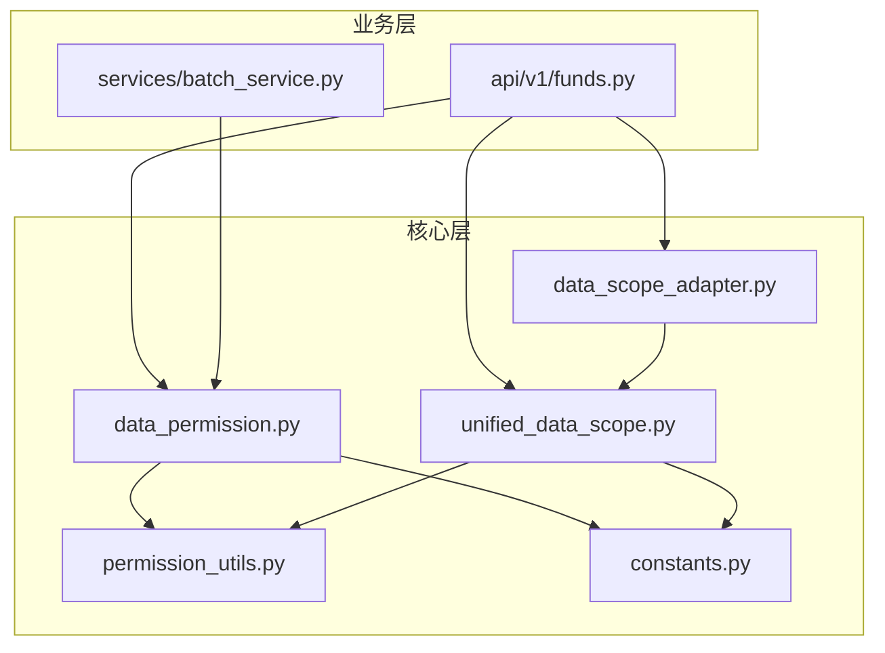
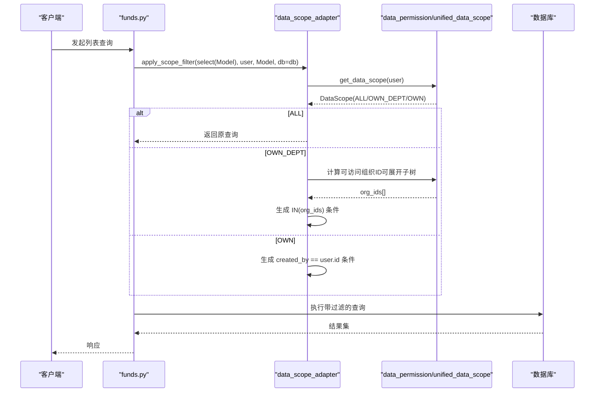
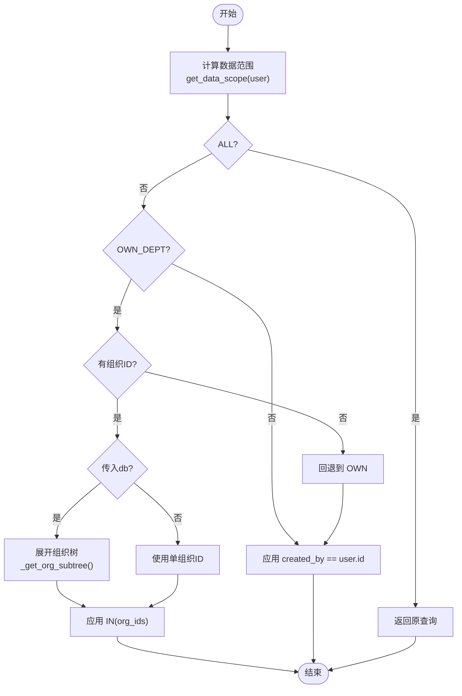
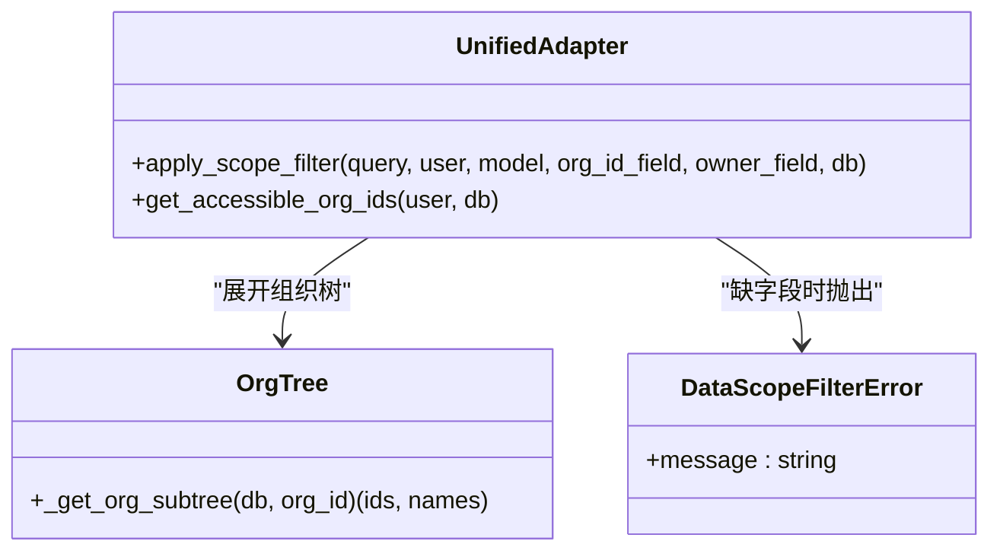
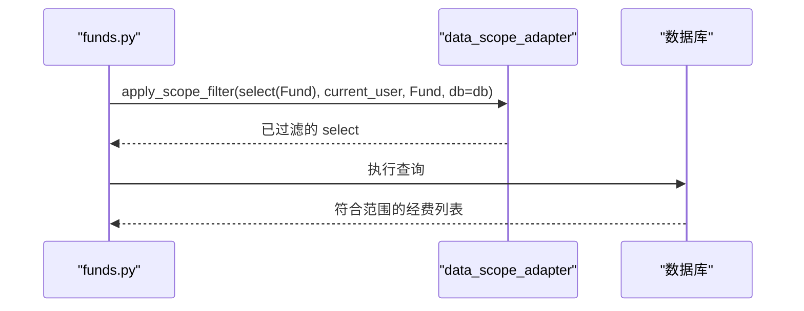
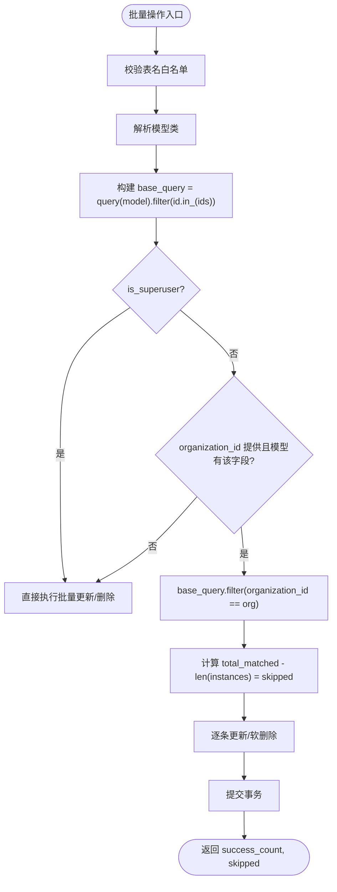
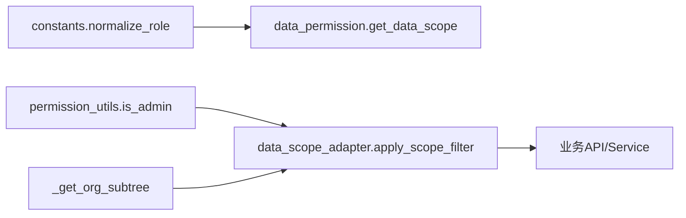

# 数据范围隔离

<cite>
**本文引用的文件**
- [backend/app/core/data_permission.py](file://backend/app/core/data_permission.py)
- [backend/app/core/unified_data_scope.py](file://backend/app/core/unified_data_scope.py)
- [backend/app/core/data_scope_adapter.py](file://backend/app/core/data_scope_adapter.py)
- [backend/app/core/permission_utils.py](file://backend/app/core/permission_utils.py)
- [backend/app/core/constants.py](file://backend/app/core/constants.py)
- [backend/app/api/v1/funds.py](file://backend/app/api/v1/funds.py)
- [backend/app/services/batch_service.py](file://backend/app/services/batch_service.py)
</cite>

## 目录
1. [简介](#简介)
2. [项目结构](#项目结构)
3. [核心组件](#核心组件)
4. [架构总览](#架构总览)
5. [详细组件分析](#详细组件分析)
6. [依赖关系分析](#依赖关系分析)
7. [性能考量](#性能考量)
8. [故障排查指南](#故障排查指南)
9. [结论](#结论)
10. [附录：使用示例与最佳实践](#附录使用示例与最佳实践)

## 简介
本文件系统性说明本项目中的数据范围隔离机制，覆盖三种数据范围模式：
- 全部数据（ALL）：超级管理员或具备全局权限的用户可访问所有记录。
- 本部门数据（OWN_DEPT）：管理员或部门级角色仅能访问其所属组织（含可选的下级组织树）的数据。
- 本人数据（OWN）：普通用户仅能访问自己创建的数据。

文档重点解释：
- 数据范围如何根据用户角色自动应用到数据库查询中；
- SQLAlchemy 查询构建器集成、动态过滤条件生成；
- 性能优化策略（组织树展开、IN 条件、fail-closed 安全降级）；
- Service 层应用数据过滤、自定义规则、批量操作中的隔离；
- 冲突解决策略与边界情况处理。

## 项目结构
数据范围相关能力集中在后端 core 层，并通过 API 与 Service 层消费：
- 核心实现：data_permission、unified_data_scope、data_scope_adapter
- 权限工具：permission_utils、constants
- 业务集成：API（如 funds.py）、Service（如 batch_service.py）

图表来源
- [backend/app/core/data_permission.py:20-134](file://backend/app/core/data_permission.py#L20-L134)
- [backend/app/core/unified_data_scope.py:43-163](file://backend/app/core/unified_data_scope.py#L43-L163)
- [backend/app/core/data_scope_adapter.py:58-183](file://backend/app/core/data_scope_adapter.py#L58-L183)
- [backend/app/api/v1/funds.py:14-37](file://backend/app/api/v1/funds.py#L14-L37)
- [backend/app/services/batch_service.py:142-200](file://backend/app/services/batch_service.py#L142-L200)

章节来源
- [backend/app/core/data_permission.py:20-134](file://backend/app/core/data_permission.py#L20-L134)
- [backend/app/core/unified_data_scope.py:43-163](file://backend/app/core/unified_data_scope.py#L43-L163)
- [backend/app/core/data_scope_adapter.py:58-183](file://backend/app/core/data_scope_adapter.py#L58-L183)
- [backend/app/core/permission_utils.py:17-58](file://backend/app/core/permission_utils.py#L17-L58)
- [backend/app/core/constants.py:27-74](file://backend/app/core/constants.py#L27-L74)
- [backend/app/api/v1/funds.py:14-37](file://backend/app/api/v1/funds.py#L14-L37)
- [backend/app/services/batch_service.py:142-200](file://backend/app/services/batch_service.py#L142-L200)

## 核心组件
- DataScope 枚举：定义 ALL、OWN_DEPT、OWN 三种范围语义。
- get_data_scope：基于用户角色与 is_superuser 判定范围。
- apply_scope_to_query / filter_by_data_scope：将范围转换为 SQL 过滤条件。
- OrgScopeFilter/_get_org_subtree：组织树展开（包含下级组织）。
- data_scope_adapter.apply_scope_filter：统一入口，兼容旧 Query 与新 Select，支持组织树展开。
- permission_utils.is_admin：判断是否管理员（含 super_admin）。
- constants.normalize_role：历史角色归一化，确保兼容性。

章节来源
- [backend/app/core/data_permission.py:20-134](file://backend/app/core/data_permission.py#L20-L134)
- [backend/app/core/unified_data_scope.py:43-163](file://backend/app/core/unified_data_scope.py#L43-L163)
- [backend/app/core/data_scope_adapter.py:58-183](file://backend/app/core/data_scope_adapter.py#L58-L183)
- [backend/app/core/permission_utils.py:17-58](file://backend/app/core/permission_utils.py#L17-L58)
- [backend/app/core/constants.py:27-74](file://backend/app/core/constants.py#L27-L74)

## 架构总览
数据范围在请求进入后，由 API/Service 层调用统一适配器或原始方法，将当前用户上下文注入到查询中，最终在数据库层面完成行级隔离。

图表来源
- [backend/app/api/v1/funds.py:14-37](file://backend/app/api/v1/funds.py#L14-L37)
- [backend/app/core/data_scope_adapter.py:114-183](file://backend/app/core/data_scope_adapter.py#L114-L183)
- [backend/app/core/data_permission.py:54-134](file://backend/app/core/data_permission.py#L54-L134)
- [backend/app/core/unified_data_scope.py:245-276](file://backend/app/core/unified_data_scope.py#L245-L276)

## 详细组件分析

### 数据范围判定与转换
- 角色→范围映射：
  - super_admin/is_superuser → ALL
  - admin/manager/approval_leader → OWN_DEPT
  - 其他 → OWN
- 字段映射：
  - 所有者字段默认 created_by
  - 组织字段默认 organization_id（也兼容 org_id）
- 安全降级（fail-closed）：
  - 模型缺少组织字段时，OWN_DEPT 回退为 OWN；若连 owner 字段也缺失，抛出异常拒绝放行。
  - 未知 scope 值防御性兜底，不追加过滤。

图表来源
- [backend/app/core/data_permission.py:54-134](file://backend/app/core/data_permission.py#L54-L134)
- [backend/app/core/unified_data_scope.py:245-276](file://backend/app/core/unified_data_scope.py#L245-L276)
- [backend/app/core/data_scope_adapter.py:114-183](file://backend/app/core/data_scope_adapter.py#L114-L183)

章节来源
- [backend/app/core/data_permission.py:54-134](file://backend/app/core/data_permission.py#L54-L134)
- [backend/app/core/unified_data_scope.py:245-276](file://backend/app/core/unified_data_scope.py#L245-L276)
- [backend/app/core/data_scope_adapter.py:114-183](file://backend/app/core/data_scope_adapter.py#L114-L183)

### 统一适配层（SQLAlchemy 2.0 Select 与旧式 Query 兼容）
- 自动识别查询类型：Select 使用 .where()，Query 使用 .filter()。
- 组织树展开：当传入 db 会话时，OWN_DEPT 会递归获取下级组织 ID 并应用 IN 条件。
- 失败关闭：缺组织字段则降级为 OWN；缺 owner 字段抛错拒绝。

图表来源
- [backend/app/core/data_scope_adapter.py:54-183](file://backend/app/core/data_scope_adapter.py#L54-L183)
- [backend/app/core/unified_data_scope.py:245-276](file://backend/app/core/unified_data_scope.py#L245-L276)

章节来源
- [backend/app/core/data_scope_adapter.py:54-183](file://backend/app/core/data_scope_adapter.py#L54-L183)
- [backend/app/core/unified_data_scope.py:245-276](file://backend/app/core/unified_data_scope.py#L245-L276)

### 业务集成示例：经费模块
- 在 API 层通过统一适配器对查询附加数据范围过滤，支持组织树展开。
- 与审批工作流、审计日志等模块解耦，聚焦数据隔离。

图表来源
- [backend/app/api/v1/funds.py:14-37](file://backend/app/api/v1/funds.py#L14-L37)
- [backend/app/core/data_scope_adapter.py:114-183](file://backend/app/core/data_scope_adapter.py#L114-L183)

章节来源
- [backend/app/api/v1/funds.py:14-37](file://backend/app/api/v1/funds.py#L14-L37)
- [backend/app/core/data_scope_adapter.py:114-183](file://backend/app/core/data_scope_adapter.py#L114-L183)

### 批量操作中的数据隔离
- 批量更新/删除在服务层进行二次组织隔离：非超级管理员只能操作本组织数据。
- 软删除优先使用 is_active 列，避免物理删除。
- 跳过跨组织记录并统计 skipped 数量。

图表来源
- [backend/app/services/batch_service.py:142-200](file://backend/app/services/batch_service.py#L142-L200)

章节来源
- [backend/app/services/batch_service.py:142-200](file://backend/app/services/batch_service.py#L142-L200)

## 依赖关系分析
- 角色与权限：
  - constants.normalize_role 将历史角色归一化，确保范围判定稳定。
  - permission_utils.is_admin 用于快速判断管理员豁免。
- 组织树：
  - unified_data_scope._get_org_subtree 递归遍历组织层级，限制最大深度防止循环引用。
- 查询构建：
  - data_scope_adapter 自动选择 .where/.filter，保证新旧语法兼容。
  - 通过 IN(org_ids) 与 created_by == user.id 两种条件组合实现范围过滤。

图表来源
- [backend/app/core/constants.py:60-74](file://backend/app/core/constants.py#L60-L74)
- [backend/app/core/permission_utils.py:40-58](file://backend/app/core/permission_utils.py#L40-L58)
- [backend/app/core/unified_data_scope.py:245-276](file://backend/app/core/unified_data_scope.py#L245-L276)
- [backend/app/core/data_scope_adapter.py:114-183](file://backend/app/core/data_scope_adapter.py#L114-L183)

章节来源
- [backend/app/core/constants.py:60-74](file://backend/app/core/constants.py#L60-L74)
- [backend/app/core/permission_utils.py:40-58](file://backend/app/core/permission_utils.py#L40-L58)
- [backend/app/core/unified_data_scope.py:245-276](file://backend/app/core/unified_data_scope.py#L245-L276)
- [backend/app/core/data_scope_adapter.py:114-183](file://backend/app/core/data_scope_adapter.py#L114-L183)

## 性能考量
- 组织树展开：
  - 仅在需要时（传入 db）展开，避免不必要的递归查询。
  - 设置最大深度限制，防止循环引用导致无限递归。
- 过滤条件优化：
  - OWN_DEPT 使用 IN(org_ids) 一次性匹配多组织，减少多次 OR 拼接。
  - OWN 使用精确等值条件 created_by == user.id，利于索引命中。
- Fail-closed 安全降级：
  - 缺字段时立即降级或抛错，避免全量扫描带来的性能与安全风险。
- 批量操作：
  - 先批量查询再逐条更新，减少 N+1 问题；软删除优先使用布尔列，降低写放大。

[本节为通用性能建议，不直接分析具体代码]

## 故障排查指南
- 现象：查询返回空集
  - 检查用户是否属于 OWN 范围且无对应 created_by 记录。
  - 检查模型是否缺少 organization_id/created_by 字段，触发 fail-closed。
- 现象：管理员未看到全部数据
  - 确认 is_admin/is_superuser 判定逻辑与 normalize_role 是否正确。
  - 检查是否在统一适配器中传入了 db 导致组织树展开异常。
- 现象：批量操作跳过大量记录
  - 核对 organization_id 参数与模型字段是否一致。
  - 确认 is_superuser 标志位是否符合预期。

章节来源
- [backend/app/core/data_permission.py:120-134](file://backend/app/core/data_permission.py#L120-L134)
- [backend/app/core/data_scope_adapter.py:170-183](file://backend/app/core/data_scope_adapter.py#L170-L183)
- [backend/app/services/batch_service.py:156-188](file://backend/app/services/batch_service.py#L156-L188)

## 结论
本项目通过三层协同实现了稳健的数据范围隔离：
- 核心层负责范围判定与过滤条件生成；
- 适配层统一新旧查询风格并支持组织树展开；
- 业务层在 API/Service 中按需应用过滤，保障批量操作的安全与性能。
通过 fail-closed 策略与严格的字段校验，系统在复杂场景下仍能保持数据安全与一致性。

[本节为总结性内容，不直接分析具体代码]

## 附录：使用示例与最佳实践

### 在 Service 层应用数据过滤
- 推荐做法：
  - 使用统一适配器 apply_scope_filter(select(Model), user, Model, db=db) 构造查询。
  - 对于仅需本组织的场景，可直接传入 organization_id 并在服务层做二次过滤。
- 参考路径：
  - [backend/app/api/v1/funds.py:14-37](file://backend/app/api/v1/funds.py#L14-L37)
  - [backend/app/core/data_scope_adapter.py:114-183](file://backend/app/core/data_scope_adapter.py#L114-L183)

### 自定义数据范围规则
- 扩展点：
  - 在 get_data_scope 中结合用户属性（如 data_scope 字段）进行更细粒度控制。
  - 在 apply_scope_filter 中根据业务需求插入额外过滤条件（如状态、时间窗口）。
- 注意：
  - 保持 fail-closed 原则，缺字段必须降级或抛错。
  - 避免引入全表扫描条件，尽量利用索引。

章节来源
- [backend/app/core/data_permission.py:54-134](file://backend/app/core/data_permission.py#L54-L134)
- [backend/app/core/data_scope_adapter.py:114-183](file://backend/app/core/data_scope_adapter.py#L114-L183)

### 批量操作中的数据隔离
- 推荐做法：
  - 在批量更新/删除前，按 organization_id 过滤实例集合，统计 skipped。
  - 优先软删除（is_active），减少物理删除成本。
- 参考路径：
  - [backend/app/services/batch_service.py:142-200](file://backend/app/services/batch_service.py#L142-L200)

### 冲突解决策略与边界情况
- 冲突场景：
  - 用户同时拥有 OWN_DEPT 与 OWN 权限：以角色判定为准，OWN_DEPT 优先于 OWN。
  - 组织树循环引用：通过最大深度限制与 visited 集合防止死循环。
- 边界情况：
  - 模型缺少组织字段：OWN_DEPT 回退为 OWN；缺 owner 字段抛错。
  - 未知 scope 值：防御性兜底，不追加过滤。
- 参考路径：
  - [backend/app/core/unified_data_scope.py:245-276](file://backend/app/core/unified_data_scope.py#L245-L276)
  - [backend/app/core/data_permission.py:120-134](file://backend/app/core/data_permission.py#L120-L134)

章节来源
- [backend/app/core/unified_data_scope.py:245-276](file://backend/app/core/unified_data_scope.py#L245-L276)
- [backend/app/core/data_permission.py:120-134](file://backend/app/core/data_permission.py#L120-L134)