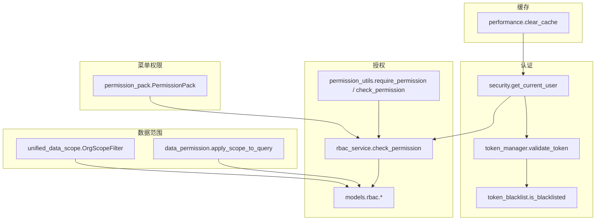
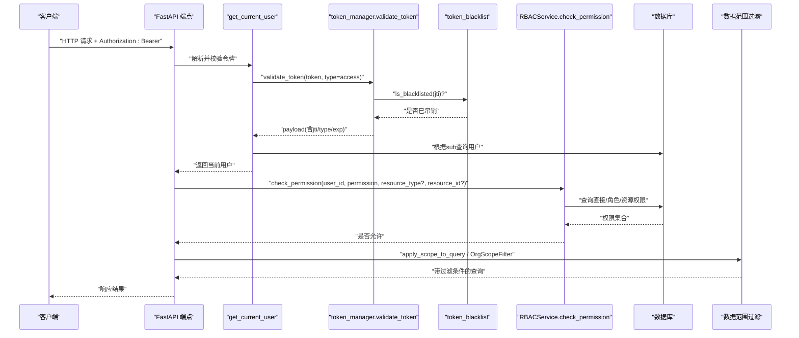
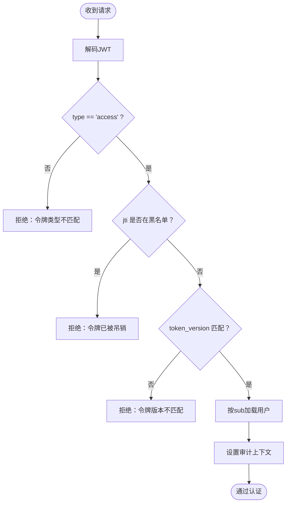
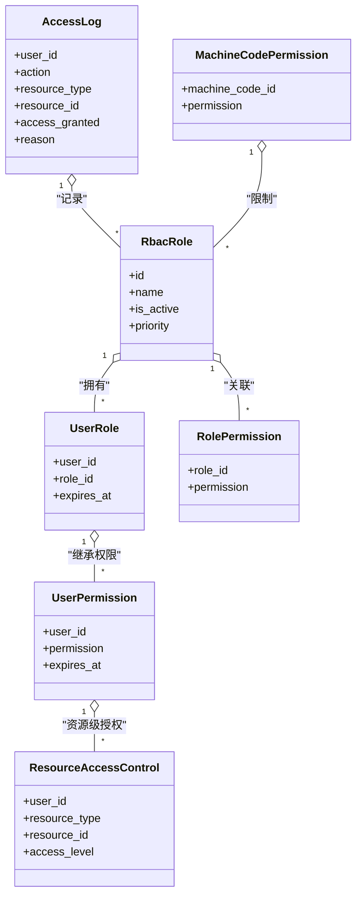
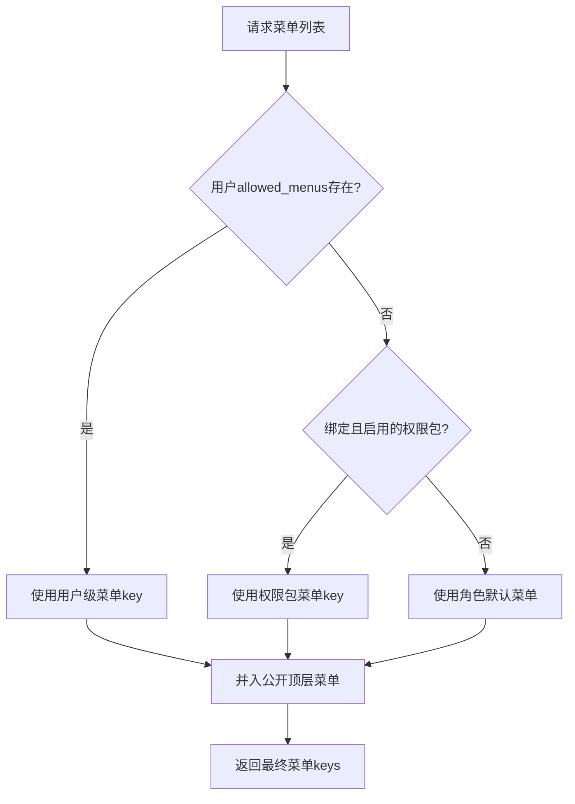
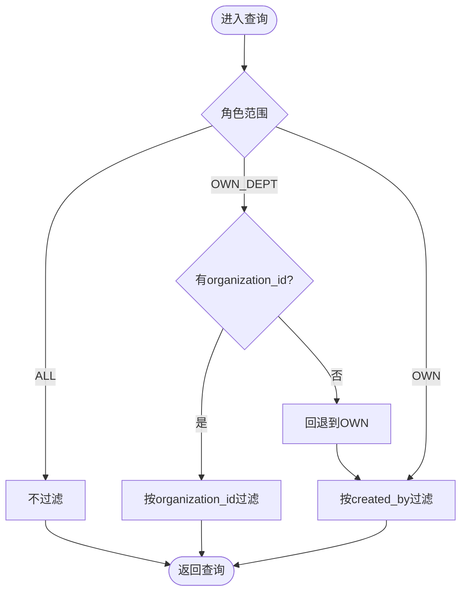
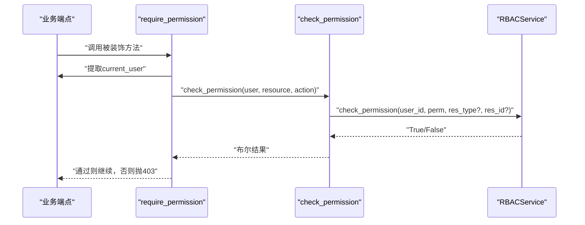
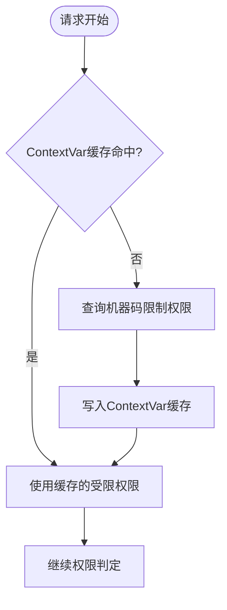
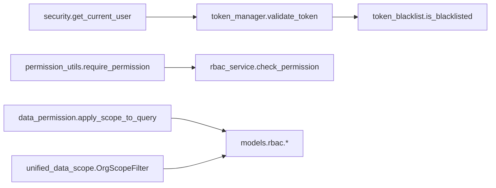

# 权限验证机制

<cite>
**本文引用的文件**
- [security.py](file://backend/app/core/security.py)
- [token_manager.py](file://backend/app/core/token_manager.py)
- [token_blacklist.py](file://backend/app/core/token_blacklist.py)
- [permission_utils.py](file://backend/app/core/permission_utils.py)
- [data_permission.py](file://backend/app/core/data_permission.py)
- [unified_data_scope.py](file://backend/app/core/unified_data_scope.py)
- [rbac_service.py](file://backend/app/services/rbac_service.py)
- [rbac.py](file://backend/app/models/rbac.py)
- [permission_pack.py](file://backend/app/models/permission_pack.py)
- [performance.py](file://backend/app/api/v1/performance.py)
</cite>

## 目录
1. [简介](#简介)
2. [项目结构](#项目结构)
3. [核心组件](#核心组件)
4. [架构总览](#架构总览)
5. [详细组件分析](#详细组件分析)
6. [依赖关系分析](#依赖关系分析)
7. [性能考虑](#性能考虑)
8. [故障排查指南](#故障排查指南)
9. [结论](#结论)
10. [附录：使用示例与最佳实践](#附录使用示例与最佳实践)

## 简介
本文件系统性说明本项目的权限验证机制，覆盖基于 JWT 的认证流程、细粒度 RBAC 授权、菜单权限解析、操作权限校验、数据范围隔离、权限缓存与计算算法、动态权限检查、以及冲突解决策略与性能优化方案。文档面向开发与运维人员，既提供高层架构视图，也给出代码级实现路径与调用序列图，便于快速定位与扩展。

## 项目结构
权限相关能力分布在以下模块：
- 认证与令牌：JWT 签发/校验、黑名单、版本控制、类型校验
- 授权与权限：RBAC 模型与服务、资源访问控制、机器码限制
- 数据范围：角色驱动的数据范围（ALL/OWN_DEPT/OWN）与组织树范围
- 菜单权限：权限包绑定与用户级覆盖，决定前端可见菜单 key
- 中间件与装饰器：FastAPI 依赖注入、管理员守卫、资源级权限装饰器
- 缓存与性能：请求级上下文缓存、Redis 缓存统计与清理接口

图表来源
- [security.py:243-336](file://backend/app/core/security.py#L243-L336)
- [token_manager.py:135-168](file://backend/app/core/token_manager.py#L135-L168)
- [token_blacklist.py:60-70](file://backend/app/core/token_blacklist.py#L60-L70)
- [rbac_service.py:133-222](file://backend/app/services/rbac_service.py#L133-L222)
- [rbac.py:31-188](file://backend/app/models/rbac.py#L31-L188)
- [permission_utils.py:272-359](file://backend/app/core/permission_utils.py#L272-L359)
- [data_permission.py:83-134](file://backend/app/core/data_permission.py#L83-L134)
- [unified_data_scope.py:191-242](file://backend/app/core/unified_data_scope.py#L191-L242)
- [permission_pack.py:16-47](file://backend/app/models/permission_pack.py#L16-L47)
- [performance.py:98-117](file://backend/app/api/v1/performance.py#L98-L117)

章节来源
- [security.py:243-336](file://backend/app/core/security.py#L243-L336)
- [token_manager.py:135-168](file://backend/app/core/token_manager.py#L135-L168)
- [token_blacklist.py:60-70](file://backend/app/core/token_blacklist.py#L60-L70)
- [rbac_service.py:133-222](file://backend/app/services/rbac_service.py#L133-L222)
- [rbac.py:31-188](file://backend/app/models/rbac.py#L31-L188)
- [permission_utils.py:272-359](file://backend/app/core/permission_utils.py#L272-L359)
- [data_permission.py:83-134](file://backend/app/core/data_permission.py#L83-L134)
- [unified_data_scope.py:191-242](file://backend/app/core/unified_data_scope.py#L191-L242)
- [permission_pack.py:16-47](file://backend/app/models/permission_pack.py#L16-L47)
- [performance.py:98-117](file://backend/app/api/v1/performance.py#L98-L117)

## 核心组件
- 认证与令牌
  - get_current_user：从 Bearer Token 提取并解码，校验类型与黑名单，校验 token_version，加载当前用户到审计上下文
  - token_manager：统一创建/校验/刷新/吊销令牌，强制携带 jti，支持持久化黑名单
  - token_blacklist：内存+数据库双写，自动清理过期条目，启动时加载未过期记录
- 授权与权限
  - RBACService：综合判断管理员、直接权限、角色权限、资源权限，结合机器码限制进行最终裁决，并记录访问日志
  - permission_utils：提供 require_admin、require_permission、check_permission 等装饰器与工具函数
  - models.rbac：角色、用户-角色、角色-权限、用户直接权限、资源访问控制、访问日志、机器码权限等模型
- 数据范围
  - data_permission：基于角色的 ALL/OWN_DEPT/OWN 过滤，fail-closed 兜底
  - unified_data_scope：合并角色范围与组织树范围，提供 OrgScopeFilter 与 get_org_scope 依赖
- 菜单权限
  - PermissionPack：定义菜单套餐，支持绑定用户；菜单解析优先级：用户级 allowed_menus > 启用中的权限包 > 角色默认菜单
- 缓存与性能
  - performance.clear_cache：管理员可清空 Redis 缓存，用于权限/菜单等缓存失效场景

章节来源
- [security.py:243-336](file://backend/app/core/security.py#L243-L336)
- [token_manager.py:64-127](file://backend/app/core/token_manager.py#L64-L127)
- [token_blacklist.py:27-103](file://backend/app/core/token_blacklist.py#L27-L103)
- [rbac_service.py:133-222](file://backend/app/services/rbac_service.py#L133-L222)
- [permission_utils.py:17-114](file://backend/app/core/permission_utils.py#L17-L114)
- [rbac.py:31-188](file://backend/app/models/rbac.py#L31-L188)
- [data_permission.py:54-134](file://backend/app/core/data_permission.py#L54-L134)
- [unified_data_scope.py:56-160](file://backend/app/core/unified_data_scope.py#L56-L160)
- [permission_pack.py:16-47](file://backend/app/models/permission_pack.py#L16-L47)
- [performance.py:98-117](file://backend/app/api/v1/performance.py#L98-L117)

## 架构总览
下图展示一次受保护 API 请求的完整链路：从鉴权、授权到数据范围过滤，再到菜单权限与缓存管理。

图表来源
- [security.py:243-336](file://backend/app/core/security.py#L243-L336)
- [token_manager.py:135-168](file://backend/app/core/token_manager.py#L135-L168)
- [token_blacklist.py:60-70](file://backend/app/core/token_blacklist.py#L60-L70)
- [rbac_service.py:133-222](file://backend/app/services/rbac_service.py#L133-L222)
- [data_permission.py:83-134](file://backend/app/core/data_permission.py#L83-L134)
- [unified_data_scope.py:191-242](file://backend/app/core/unified_data_scope.py#L191-L242)

## 详细组件分析

### 认证与令牌（JWT）
- 令牌签发
  - create_token_pair：生成 access/refresh 对，均包含 jti、type、exp，确保可吊销与类型约束
- 令牌校验
  - validate_token：校验签名、类型、黑名单；失败返回错误信息
  - get_current_user：在 FastAPI 依赖中执行类型校验、黑名单检查、token_version 比对，并将当前用户写入审计上下文
- 令牌吊销
  - revoke_token：将 jti 加入内存黑名单，并持久化到数据库，支持重启后仍有效
  - refresh_access_token：旋转式刷新，旧 refresh 立即吊销，颁发新 pair

图表来源
- [security.py:243-336](file://backend/app/core/security.py#L243-L336)
- [token_manager.py:135-168](file://backend/app/core/token_manager.py#L135-L168)
- [token_blacklist.py:60-70](file://backend/app/core/token_blacklist.py#L60-L70)

章节来源
- [security.py:243-336](file://backend/app/core/security.py#L243-L336)
- [token_manager.py:64-127](file://backend/app/core/token_manager.py#L64-L127)
- [token_manager.py:135-168](file://backend/app/core/token_manager.py#L135-L168)
- [token_blacklist.py:27-103](file://backend/app/core/token_blacklist.py#L27-L103)

### RBAC 权限服务与模型
- 权限判定顺序
  1) 机器码限制（拒绝优先）
  2) 管理员角色（放行）
  3) 直接权限（用户-权限表）
  4) 角色权限（用户-角色-角色-权限）
  5) 资源权限（用户-资源访问控制）
- 权限计算
  - get_user_permissions_with_restrictions：单次查询聚合直接/角色权限，应用白名单交集，再减去机器码限制
- 模型
  - RbacRole、UserRole、RolePermission、UserPermission、ResourceAccessControl、AccessLog、MachineCodePermission

图表来源
- [rbac.py:31-188](file://backend/app/models/rbac.py#L31-L188)
- [rbac_service.py:133-222](file://backend/app/services/rbac_service.py#L133-L222)

章节来源
- [rbac_service.py:133-222](file://backend/app/services/rbac_service.py#L133-L222)
- [rbac.py:31-188](file://backend/app/models/rbac.py#L31-L188)

### 菜单权限与权限包
- 权限包（PermissionPack）：预定义一组菜单 key，可批量绑定给用户
- 解析优先级：用户级 allowed_menus > 启用中的权限包 > 角色默认菜单
- 即时生效：修改权限包或解绑后，下次请求重新计算并生效

图表来源
- [permission_pack.py:16-47](file://backend/app/models/permission_pack.py#L16-L47)

章节来源
- [permission_pack.py:16-47](file://backend/app/models/permission_pack.py#L16-L47)

### 数据范围隔离
- 角色范围（DataScope）
  - ALL：超级管理员可见全部
  - OWN_DEPT：管理员可见本部门/组织
  - OWN：普通用户仅本人数据
- 组织范围（OrgScopeFilter）
  - 支持 self_only、org、org_children 等模式，递归遍历组织树获取子组织 ID/名称
- 查询过滤
  - apply_scope_to_query：为 SQLAlchemy 查询附加过滤条件，缺失字段时 fail-closed 返回空集

图表来源
- [data_permission.py:83-134](file://backend/app/core/data_permission.py#L83-L134)
- [unified_data_scope.py:191-242](file://backend/app/core/unified_data_scope.py#L191-L242)

章节来源
- [data_permission.py:83-134](file://backend/app/core/data_permission.py#L83-L134)
- [unified_data_scope.py:191-242](file://backend/app/core/unified_data_scope.py#L191-L242)

### 操作权限与装饰器
- 装饰器
  - require_admin：要求管理员身份
  - require_permission：要求特定资源-操作权限（如 villages:write）
  - require_organization：组织边界校验（跨组织访问拦截）
- 检查函数
  - check_permission：兼容字符串/JSON 格式的 permissions 字段，支持通配符匹配

图表来源
- [permission_utils.py:272-359](file://backend/app/core/permission_utils.py#L272-L359)
- [rbac_service.py:133-222](file://backend/app/services/rbac_service.py#L133-L222)

章节来源
- [permission_utils.py:272-359](file://backend/app/core/permission_utils.py#L272-L359)
- [rbac_service.py:133-222](file://backend/app/services/rbac_service.py#L133-L222)

### 权限缓存机制与动态检查
- 请求级缓存
  - RBACService 使用 ContextVar 缓存“受限权限集合”，避免同一请求内重复查询机器码限制
- 菜单/权限缓存
  - 通过 Redis 适配器提供统计与清空接口，管理员可主动清理以触发权限/菜单重算
- 动态检查
  - 每次请求都会重新计算权限（结合最新数据库状态），保证一致性

图表来源
- [rbac_service.py:224-235](file://backend/app/services/rbac_service.py#L224-L235)
- [performance.py:98-117](file://backend/app/api/v1/performance.py#L98-L117)

章节来源
- [rbac_service.py:224-235](file://backend/app/services/rbac_service.py#L224-L235)
- [performance.py:98-117](file://backend/app/api/v1/performance.py#L98-L117)

## 依赖关系分析
- 低耦合设计
  - security 负责认证，不感知业务权限；RBACService 专注授权；数据范围模块独立于授权逻辑
- 关键依赖链
  - get_current_user → token_manager.validate_token → token_blacklist.is_blacklisted
  - require_permission → check_permission → RBACService.check_permission
  - 数据范围过滤 → apply_scope_to_query / OrgScopeFilter
- 潜在循环依赖规避
  - 延迟导入（如 SessionLocal、models）避免模块加载时的循环引用

图表来源
- [security.py:243-336](file://backend/app/core/security.py#L243-L336)
- [token_manager.py:135-168](file://backend/app/core/token_manager.py#L135-L168)
- [token_blacklist.py:60-70](file://backend/app/core/token_blacklist.py#L60-L70)
- [permission_utils.py:272-359](file://backend/app/core/permission_utils.py#L272-L359)
- [rbac_service.py:133-222](file://backend/app/services/rbac_service.py#L133-L222)
- [data_permission.py:83-134](file://backend/app/core/data_permission.py#L83-L134)
- [unified_data_scope.py:191-242](file://backend/app/core/unified_data_scope.py#L191-L242)
- [rbac.py:31-188](file://backend/app/models/rbac.py#L31-L188)

章节来源
- [security.py:243-336](file://backend/app/core/security.py#L243-L336)
- [token_manager.py:135-168](file://backend/app/core/token_manager.py#L135-L168)
- [token_blacklist.py:60-70](file://backend/app/core/token_blacklist.py#L60-L70)
- [permission_utils.py:272-359](file://backend/app/core/permission_utils.py#L272-L359)
- [rbac_service.py:133-222](file://backend/app/services/rbac_service.py#L133-L222)
- [data_permission.py:83-134](file://backend/app/core/data_permission.py#L83-L134)
- [unified_data_scope.py:191-242](file://backend/app/core/unified_data_scope.py#L191-L242)
- [rbac.py:31-188](file://backend/app/models/rbac.py#L31-L188)

## 性能考虑
- 令牌校验
  - validate_token 先查内存黑名单，减少数据库压力；支持持久化黑名单，重启后恢复
- 权限计算
  - 请求级 ContextVar 缓存受限权限，避免同请求多次查询
  - RBACService 单次聚合查询直接/角色权限，减少 N+1 问题
- 数据范围
  - 组织树遍历限制最大深度，防止无限递归；缺失字段时 fail-closed 避免异常放大
- 缓存管理
  - 提供管理员接口清空 Redis 缓存，配合权限/菜单变更及时生效

[本节为通用性能建议，无需具体文件引用]

## 故障排查指南
- 登录成功但访问受保护接口返回 401
  - 检查令牌类型是否为 access、是否被加入黑名单、token_version 是否匹配
  - 参考：[security.py:243-336](file://backend/app/core/security.py#L243-L336)、[token_manager.py:135-168](file://backend/app/core/token_manager.py#L135-L168)、[token_blacklist.py:60-70](file://backend/app/core/token_blacklist.py#L60-L70)
- 权限不足 403
  - 确认用户是否具备直接/角色/资源权限；检查机器码限制是否拒绝；查看访问日志
  - 参考：[rbac_service.py:133-222](file://backend/app/services/rbac_service.py#L133-L222)、[rbac.py:191-218](file://backend/app/models/rbac.py#L191-L218)
- 数据范围导致无数据
  - 检查角色范围与模型字段是否存在；若缺少 owner/dept 字段会回退为空集
  - 参考：[data_permission.py:83-134](file://backend/app/core/data_permission.py#L83-L134)
- 菜单未显示
  - 检查权限包是否启用、是否绑定用户、用户 allowed_menus 是否覆盖
  - 参考：[permission_pack.py:16-47](file://backend/app/models/permission_pack.py#L16-L47)
- 缓存未更新
  - 管理员可通过缓存清理接口刷新；确认 Redis 健康状态
  - 参考：[performance.py:98-117](file://backend/app/api/v1/performance.py#L98-L117)

章节来源
- [security.py:243-336](file://backend/app/core/security.py#L243-L336)
- [token_manager.py:135-168](file://backend/app/core/token_manager.py#L135-L168)
- [token_blacklist.py:60-70](file://backend/app/core/token_blacklist.py#L60-L70)
- [rbac_service.py:133-222](file://backend/app/services/rbac_service.py#L133-L222)
- [rbac.py:191-218](file://backend/app/models/rbac.py#L191-L218)
- [data_permission.py:83-134](file://backend/app/core/data_permission.py#L83-L134)
- [permission_pack.py:16-47](file://backend/app/models/permission_pack.py#L16-L47)
- [performance.py:98-117](file://backend/app/api/v1/performance.py#L98-L117)

## 结论
本系统采用“认证-授权-数据范围”三层分离的权限架构：JWT 认证保障身份可信，RBAC 服务实现细粒度授权，数据范围模块确保数据隔离。通过令牌黑名单与版本控制、请求级权限缓存、组织树范围过滤、菜单权限包与用户覆盖等机制，兼顾安全性与性能。管理员可通过缓存清理与权限包管理快速调整权限策略。

[本节为总结性内容，无需具体文件引用]

## 附录：使用示例与最佳实践
- API 装饰器使用
  - 管理员守卫：在端点中使用 require_admin() 或 Depends(require_admin())
  - 操作权限：使用 @require_permission("villages:write") 装饰需要写权限的端点
  - 组织边界：使用 @require_organization 限制跨组织访问
  - 参考：[permission_utils.py:61-114](file://backend/app/core/permission_utils.py#L61-L114)、[permission_utils.py:272-359](file://backend/app/core/permission_utils.py#L272-L359)
- 中间件集成
  - 全局认证：通过 FastAPI 依赖 get_current_user 注入当前用户
  - 审计归因：认证通过后自动设置审计上下文，便于写操作追踪
  - 参考：[security.py:243-336](file://backend/app/core/security.py#L243-L336)
- 自定义权限规则
  - 在 RBACService 中扩展 _has_resource_access 或新增检查步骤，结合 AccessLog 记录原因
  - 参考：[rbac_service.py:693-714](file://backend/app/services/rbac_service.py#L693-L714)、[rbac_service.py:716-741](file://backend/app/services/rbac_service.py#L716-L741)
- 权限冲突解决策略
  - 机器码限制优先拒绝（fail-closed）
  - 管理员角色直接放行
  - 白名单（allowed_permissions）与权限取交集
  - 菜单权限：用户级 allowed_menus > 启用中的权限包 > 角色默认菜单
  - 参考：[rbac_service.py:145-157](file://backend/app/services/rbac_service.py#L145-L157)、[rbac_service.py:298-320](file://backend/app/services/rbac_service.py#L298-L320)、[permission_pack.py:16-47](file://backend/app/models/permission_pack.py#L16-L47)
- 性能优化方案
  - 使用 validate_token 统一校验入口，减少重复解码
  - 利用 ContextVar 缓存受限权限，降低同请求内重复查询
  - 组织树遍历限制深度，避免递归爆炸
  - 管理员可清理 Redis 缓存以加速权限/菜单重算
  - 参考：[rbac_service.py:224-235](file://backend/app/services/rbac_service.py#L224-L235)、[unified_data_scope.py:245-276](file://backend/app/core/unified_data_scope.py#L245-L276)、[performance.py:98-117](file://backend/app/api/v1/performance.py#L98-L117)

章节来源
- [permission_utils.py:61-114](file://backend/app/core/permission_utils.py#L61-L114)
- [permission_utils.py:272-359](file://backend/app/core/permission_utils.py#L272-L359)
- [security.py:243-336](file://backend/app/core/security.py#L243-L336)
- [rbac_service.py:145-157](file://backend/app/services/rbac_service.py#L145-L157)
- [rbac_service.py:298-320](file://backend/app/services/rbac_service.py#L298-L320)
- [rbac_service.py:693-714](file://backend/app/services/rbac_service.py#L693-L714)
- [rbac_service.py:716-741](file://backend/app/services/rbac_service.py#L716-L741)
- [permission_pack.py:16-47](file://backend/app/models/permission_pack.py#L16-L47)
- [unified_data_scope.py:245-276](file://backend/app/core/unified_data_scope.py#L245-L276)
- [performance.py:98-117](file://backend/app/api/v1/performance.py#L98-L117)