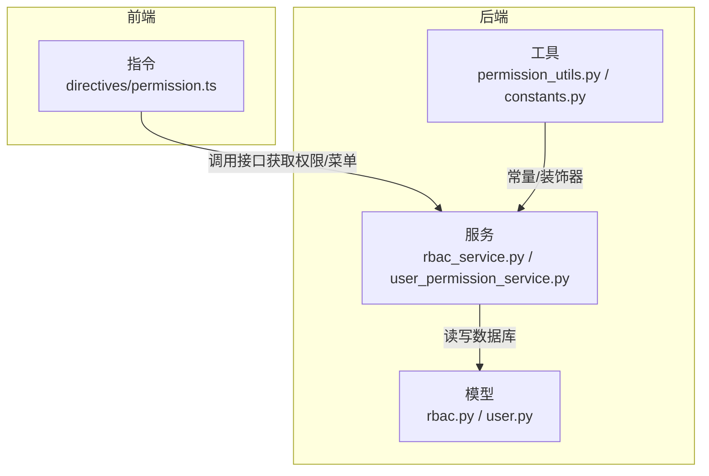
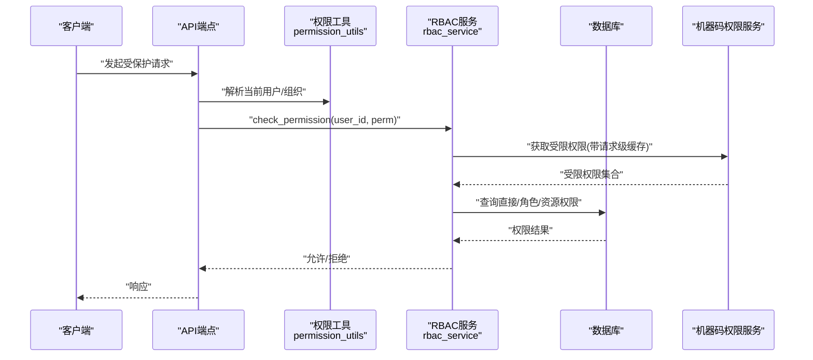
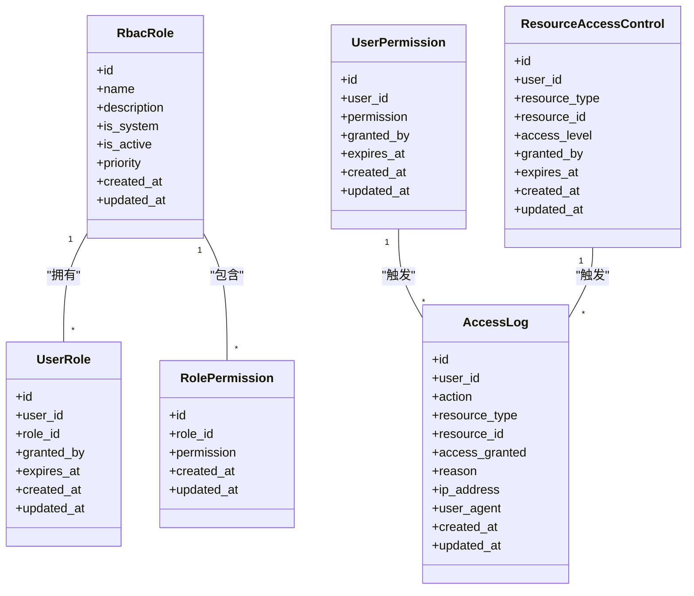
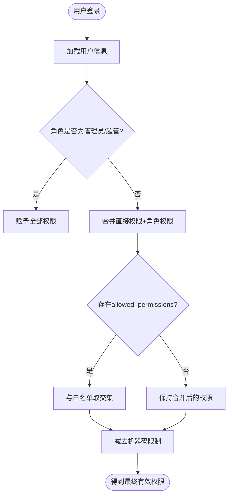
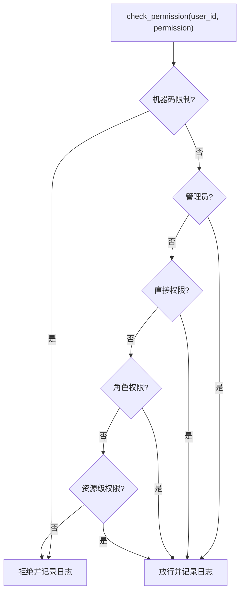
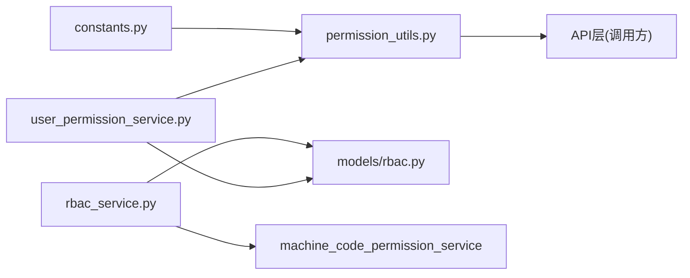

# 角色权限控制

<cite>
**本文引用的文件**
- [backend/app/models/rbac.py](file://backend/app/models/rbac.py)
- [backend/app/models/user.py](file://backend/app/models/user.py)
- [backend/app/core/constants.py](file://backend/app/core/constants.py)
- [backend/app/services/rbac_service.py](file://backend/app/services/rbac_service.py)
- [backend/app/core/permission_utils.py](file://backend/app/core/permission_utils.py)
- [backend/app/services/user_permission_service.py](file://backend/app/services/user_permission_service.py)
- [frontend/src/directives/permission.ts](file://frontend/src/directives/permission.ts)
</cite>

## 目录
1. [简介](#简介)
2. [项目结构](#项目结构)
3. [核心组件](#核心组件)
4. [架构总览](#架构总览)
5. [详细组件分析](#详细组件分析)
6. [依赖关系分析](#依赖关系分析)
7. [性能与缓存](#性能与缓存)
8. [故障排查指南](#故障排查指南)
9. [结论](#结论)
10. [附录：配置与使用示例](#附录：配置与使用示例)

## 简介
本文件面向“基于RBAC的角色权限控制”实现，覆盖角色定义、权限分配、用户角色关联、四级角色体系（超级管理员、管理员、普通用户、访客）的权限差异与继承关系，以及菜单、按钮、API的细粒度控制。同时说明权限缓存机制、动态权限更新与性能优化方案，并提供可操作的配置与使用示例路径。

## 项目结构
后端采用“模型-服务-工具”分层：
- 模型层：统一RBAC模型与用户模型，定义角色、用户-角色、角色-权限、直接权限、资源访问控制、访问日志等表结构。
- 服务层：RBACService负责权限计算、角色/权限分配、访问日志记录；UserPermissionService提供组织与用户权限管理辅助能力。
- 工具层：permission_utils提供装饰器与便捷校验；constants集中定义四级角色常量与归一化逻辑。

前端通过指令进行按钮级权限控制，结合路由守卫与菜单配置实现页面可见性控制。

图表来源
- [backend/app/models/rbac.py:31-263](file://backend/app/models/rbac.py#L31-L263)
- [backend/app/models/user.py:26-152](file://backend/app/models/user.py#L26-L152)
- [backend/app/services/rbac_service.py:104-746](file://backend/app/services/rbac_service.py#L104-L746)
- [backend/app/core/permission_utils.py:17-360](file://backend/app/core/permission_utils.py#L17-L360)
- [backend/app/core/constants.py:27-87](file://backend/app/core/constants.py#L27-L87)
- [frontend/src/directives/permission.ts](file://frontend/src/directives/permission.ts)

章节来源
- [backend/app/models/rbac.py:31-263](file://backend/app/models/rbac.py#L31-L263)
- [backend/app/models/user.py:26-152](file://backend/app/models/user.py#L26-L152)
- [backend/app/core/constants.py:27-87](file://backend/app/core/constants.py#L27-L87)
- [backend/app/services/rbac_service.py:104-746](file://backend/app/services/rbac_service.py#L104-L746)
- [backend/app/core/permission_utils.py:17-360](file://backend/app/core/permission_utils.py#L17-L360)
- [backend/app/services/user_permission_service.py:21-592](file://backend/app/services/user_permission_service.py#L21-L592)
- [frontend/src/directives/permission.ts](file://frontend/src/directives/permission.ts)

## 核心组件
- RBAC模型
  - 角色：RbacRole（名称、描述、是否系统内置、优先级、状态、时间戳）
  - 用户-角色：UserRole（用户ID、角色ID、授权人、过期时间）
  - 角色-权限：RolePermission（角色ID、权限标识）
  - 用户直接权限：UserPermission（用户ID、权限标识、授权人、过期时间）
  - 资源访问控制：ResourceAccessControl（用户、资源类型、资源ID、访问级别、过期时间）
  - 访问日志：AccessLog（用户、动作、资源、是否授权、原因、IP、UA、时间）
  - 机器码权限：MachineCodePermission（机器码ID、权限标识、过期时间）
- 用户模型
  - 字段包含角色role（super_admin/admin/user/viewer）、数据范围data_scope、白名单allowed_permissions、可见菜单allowed_menus、权限包绑定permission_pack_id等
- 权限服务
  - RBACService：权限检查、角色/权限分配、批量授予/撤销、访问日志记录、机器码限制集成
  - UserPermissionService：组织与用户权限管理、角色分配、权限查询、数据范围校验
- 工具与常量
  - permission_utils：is_superuser/is_admin、require_admin/require_organization/require_permission装饰器、check_permission
  - constants：四级角色常量、ADMIN_ROLES、PRACTICAL_ROLES、normalize_role

章节来源
- [backend/app/models/rbac.py:31-263](file://backend/app/models/rbac.py#L31-L263)
- [backend/app/models/user.py:26-152](file://backend/app/models/user.py#L26-L152)
- [backend/app/services/rbac_service.py:104-746](file://backend/app/services/rbac_service.py#L104-L746)
- [backend/app/core/permission_utils.py:17-360](file://backend/app/core/permission_utils.py#L17-L360)
- [backend/app/core/constants.py:27-87](file://backend/app/core/constants.py#L27-L87)
- [backend/app/services/user_permission_service.py:21-592](file://backend/app/services/user_permission_service.py#L21-L592)

## 架构总览
下图展示从请求到权限判断的核心流程：认证后进入业务端点，通过装饰器或显式调用RBACService.check_permission完成权限判定，期间考虑机器码限制、管理员特权、直接权限、角色权限、资源级权限，并记录访问日志。

图表来源
- [backend/app/services/rbac_service.py:133-222](file://backend/app/services/rbac_service.py#L133-L222)
- [backend/app/core/permission_utils.py:272-309](file://backend/app/core/permission_utils.py#L272-L309)
- [backend/app/services/rbac_service.py:224-235](file://backend/app/services/rbac_service.py#L224-L235)

## 详细组件分析

### 角色与权限模型（RBAC）
- 角色与权限解耦：角色仅作为权限容器，支持优先级与激活状态；用户可通过多角色叠加权限。
- 直接权限优先：用户可直接被授予权限，便于临时授权与精细化控制。
- 资源级控制：针对具体资源实例（如某条数据）授予read/write/delete级别访问。
- 审计追踪：所有权限判定均记录AccessLog，便于审计与问题定位。
- 机器码限制：通过MachineCodePermission对特定设备功能进行限制，并在权限计算时扣除。

图表来源
- [backend/app/models/rbac.py:31-263](file://backend/app/models/rbac.py#L31-L263)

章节来源
- [backend/app/models/rbac.py:31-263](file://backend/app/models/rbac.py#L31-L263)

### 用户模型与四级角色体系
- 四级角色：super_admin（超级管理员）、admin（管理员）、user（普通用户）、viewer（访客），由constants集中定义与归一化。
- 数据范围：data_scope支持all/org/org_children/self，用于行级数据隔离。
- 白名单与菜单：allowed_permissions为JSON数组，若设置则与角色/直接权限取交集；allowed_menus控制可见菜单key列表。
- 权限包：permission_pack_id用于绑定预设菜单/权限包，解析优先级：allowed_menus > 权限包 > 角色默认。

图表来源
- [backend/app/models/user.py:42-77](file://backend/app/models/user.py#L42-L77)
- [backend/app/core/constants.py:27-87](file://backend/app/core/constants.py#L27-L87)
- [backend/app/services/rbac_service.py:256-320](file://backend/app/services/rbac_service.py#L256-L320)

章节来源
- [backend/app/models/user.py:26-152](file://backend/app/models/user.py#L26-L152)
- [backend/app/core/constants.py:27-87](file://backend/app/core/constants.py#L27-L87)
- [backend/app/services/rbac_service.py:256-320](file://backend/app/services/rbac_service.py#L256-L320)

### 权限服务（RBACService）
- 权限检查顺序：机器码限制 → 管理员特权 → 直接权限 → 角色权限 → 资源级权限。
- 批量操作：支持批量授予/撤销权限，原子保存save_permissions在单事务内完成删除旧权限与授予新权限。
- 访问日志：每次权限判定均记录AccessLog，便于审计。
- 机器码限制：通过MachineCodePermissionService获取受限权限集合，并使用请求级ContextVar缓存避免重复查询。

图表来源
- [backend/app/services/rbac_service.py:133-222](file://backend/app/services/rbac_service.py#L133-L222)
- [backend/app/services/rbac_service.py:224-235](file://backend/app/services/rbac_service.py#L224-L235)
- [backend/app/services/rbac_service.py:716-741](file://backend/app/services/rbac_service.py#L716-L741)

章节来源
- [backend/app/services/rbac_service.py:133-222](file://backend/app/services/rbac_service.py#L133-L222)
- [backend/app/services/rbac_service.py:224-235](file://backend/app/services/rbac_service.py#L224-L235)
- [backend/app/services/rbac_service.py:716-741](file://backend/app/services/rbac_service.py#L716-L741)

### 用户权限服务（UserPermissionService）
- 组织与用户关系：支持将用户分配到组织、移除、查询组织树与可访问组织。
- 角色与权限管理：为用户分配/移除角色、授予/撤销直接权限、查询用户权限集合。
- 数据范围校验：根据data_scope判断对目标组织的访问权限。

章节来源
- [backend/app/services/user_permission_service.py:21-592](file://backend/app/services/user_permission_service.py#L21-L592)

### 前端按钮与菜单权限
- 按钮权限：通过自定义指令v-permission控制按钮显示/隐藏，需传入权限标识（如"user:write"）。
- 菜单权限：前端依据allowed_menus或权限包决定菜单渲染；后端返回用户可见菜单key列表。
- 路由守卫：结合用户权限与菜单配置，防止未授权页面访问。

章节来源
- [frontend/src/directives/permission.ts](file://frontend/src/directives/permission.ts)
- [backend/app/models/user.py:71-77](file://backend/app/models/user.py#L71-L77)

## 依赖关系分析
- 模块耦合
  - RBACService依赖models/rbac.py中的ORM模型，依赖machine_code_permission_service获取机器码限制。
  - permission_utils提供装饰器与通用校验，被API层广泛引用。
  - constants集中角色常量，避免跨层硬编码。
- 外部依赖
  - SQLAlchemy ORM用于数据持久化。
  - FastAPI HTTPException用于权限不足时的错误响应。
- 潜在循环依赖
  - 通过字符串引用注册关系（如machine_code）避免导入循环。

图表来源
- [backend/app/core/constants.py:27-87](file://backend/app/core/constants.py#L27-L87)
- [backend/app/core/permission_utils.py:17-360](file://backend/app/core/permission_utils.py#L17-L360)
- [backend/app/services/rbac_service.py:104-746](file://backend/app/services/rbac_service.py#L104-L746)
- [backend/app/services/user_permission_service.py:21-592](file://backend/app/services/user_permission_service.py#L21-L592)
- [backend/app/models/rbac.py:31-263](file://backend/app/models/rbac.py#L31-L263)

章节来源
- [backend/app/core/constants.py:27-87](file://backend/app/core/constants.py#L27-L87)
- [backend/app/core/permission_utils.py:17-360](file://backend/app/core/permission_utils.py#L17-L360)
- [backend/app/services/rbac_service.py:104-746](file://backend/app/services/rbac_service.py#L104-L746)
- [backend/app/services/user_permission_service.py:21-592](file://backend/app/services/user_permission_service.py#L21-L592)
- [backend/app/models/rbac.py:31-263](file://backend/app/models/rbac.py#L31-L263)

## 性能与缓存
- 请求级缓存：RBACService使用ContextVar缓存每个请求内的机器码受限权限，避免重复查询。
- 批量操作：grant_permissions_batch/save_permissions/revoke_permissions_batch减少数据库往返。
- 索引优化：模型中为常用查询建立复合索引（如user_id+permission、role_id+permission等）。
- 权限计算优化：管理员直接放行；白名单与机器码限制在单次计算中处理，减少多次IO。
- 建议
  - 在高并发场景下，可将用户权限集缓存至Redis，设置合理TTL并在权限变更时失效。
  - 对频繁读取的菜单/按钮权限，可在前端本地缓存并按用户维度刷新。

章节来源
- [backend/app/services/rbac_service.py:224-235](file://backend/app/services/rbac_service.py#L224-L235)
- [backend/app/services/rbac_service.py:407-454](file://backend/app/services/rbac_service.py#L407-L454)
- [backend/app/services/rbac_service.py:518-586](file://backend/app/services/rbac_service.py#L518-L586)
- [backend/app/models/rbac.py:31-263](file://backend/app/models/rbac.py#L31-L263)

## 故障排查指南
- 常见问题
  - 权限不生效：检查是否设置了allowed_permissions白名单且与角色/直接权限取交集后为空。
  - 机器码限制导致无权限：确认MachineCodePermission中是否存在对应权限限制。
  - 管理员无法访问：确认用户角色是否为super_admin或admin，或是否具备admin:all。
  - 菜单不可见：检查allowed_menus是否为空数组或权限包未正确绑定。
- 诊断步骤
  - 查看AccessLog中最近权限判定记录，关注reason字段。
  - 使用get_user_permissions_with_restrictions获取有效权限与受限权限集合。
  - 验证角色是否激活、用户-角色关联是否过期。

章节来源
- [backend/app/services/rbac_service.py:256-320](file://backend/app/services/rbac_service.py#L256-L320)
- [backend/app/services/rbac_service.py:716-741](file://backend/app/services/rbac_service.py#L716-L741)
- [backend/app/models/user.py:71-77](file://backend/app/models/user.py#L71-L77)

## 结论
本系统实现了完整的RBAC权限体系，支持四级角色、直接/角色/资源级权限、机器码限制与审计日志。通过批量操作与请求级缓存提升性能，并通过白名单与菜单配置实现灵活的细粒度控制。建议在大规模部署中引入分布式缓存以进一步优化权限读取性能。

## 附录：配置与使用示例
- 创建角色并分配权限
  - 参考：create_role方法
  - 路径：[backend/app/services/rbac_service.py:588-606](file://backend/app/services/rbac_service.py#L588-L606)
- 为用户分配角色
  - 参考：assign_role方法
  - 路径：[backend/app/services/rbac_service.py:322-363](file://backend/app/services/rbac_service.py#L322-L363)
- 授予/撤销用户权限
  - 参考：grant_permission、revoke_permission、grant_permissions_batch、revoke_permissions_batch、save_permissions
  - 路径：
    - [backend/app/services/rbac_service.py:375-405](file://backend/app/services/rbac_service.py#L375-L405)
    - [backend/app/services/rbac_service.py:407-454](file://backend/app/services/rbac_service.py#L407-L454)
    - [backend/app/services/rbac_service.py:456-516](file://backend/app/services/rbac_service.py#L456-L516)
    - [backend/app/services/rbac_service.py:518-586](file://backend/app/services/rbac_service.py#L518-L586)
- 检查权限（API装饰器）
  - 参考：require_permission装饰器
  - 路径：[backend/app/core/permission_utils.py:272-309](file://backend/app/core/permission_utils.py#L272-L309)
- 前端按钮权限指令
  - 参考：v-permission指令
  - 路径：[frontend/src/directives/permission.ts](file://frontend/src/directives/permission.ts)
- 四级角色常量与归一化
  - 参考：ROLE_*常量、normalize_role
  - 路径：[backend/app/core/constants.py:27-87](file://backend/app/core/constants.py#L27-L87)
- 用户白名单与菜单配置
  - 参考：User.allowed_permissions_list、allowed_menus_list
  - 路径：[backend/app/models/user.py:112-139](file://backend/app/models/user.py#L112-L139)