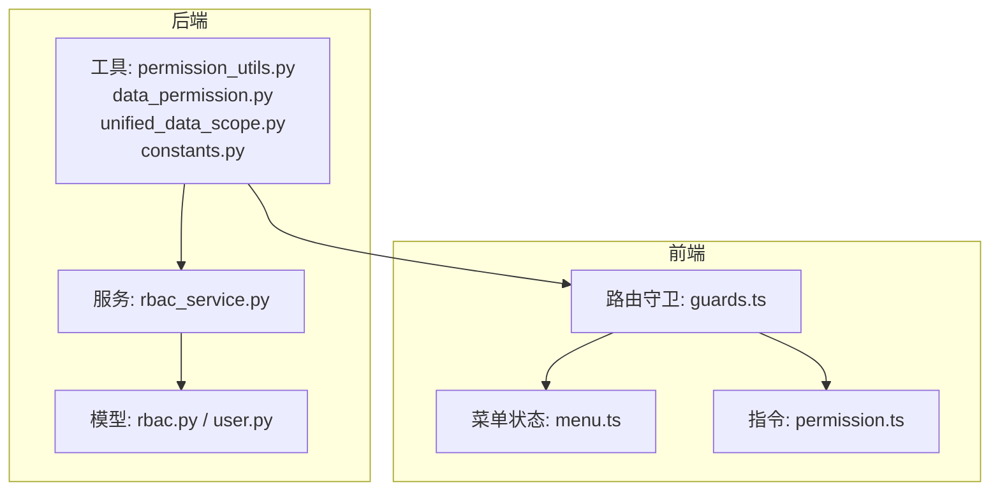
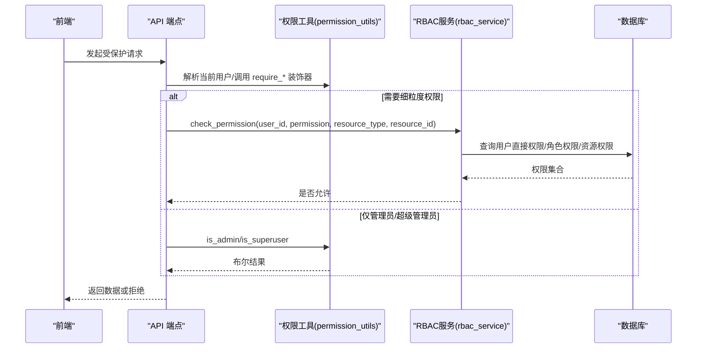
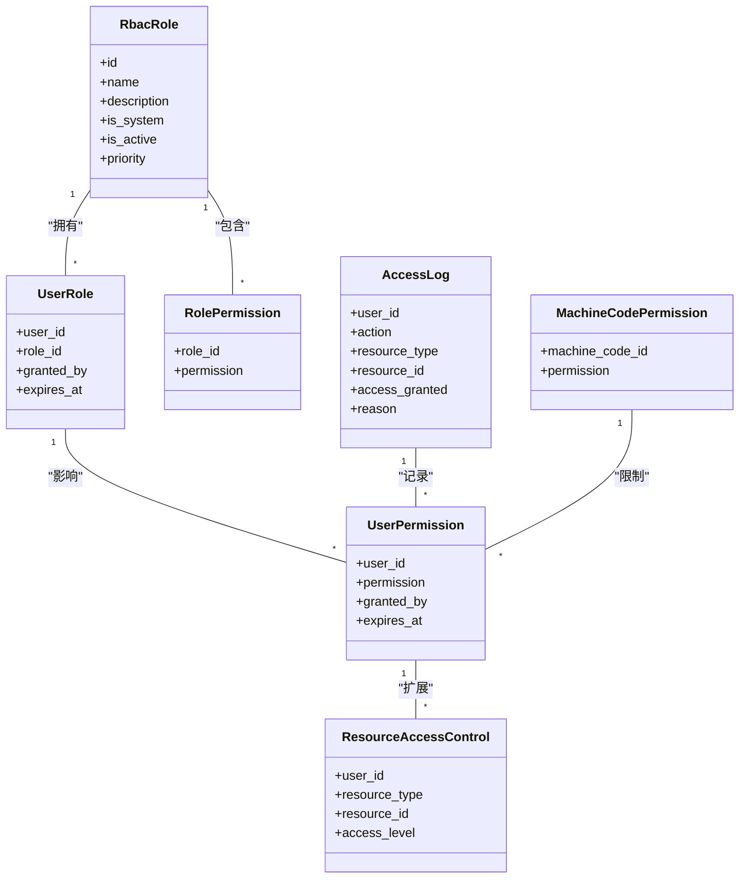
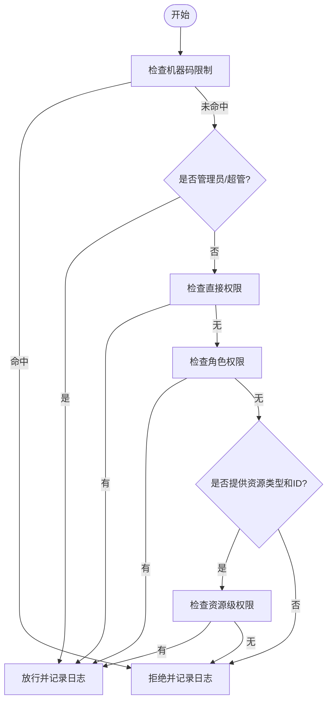
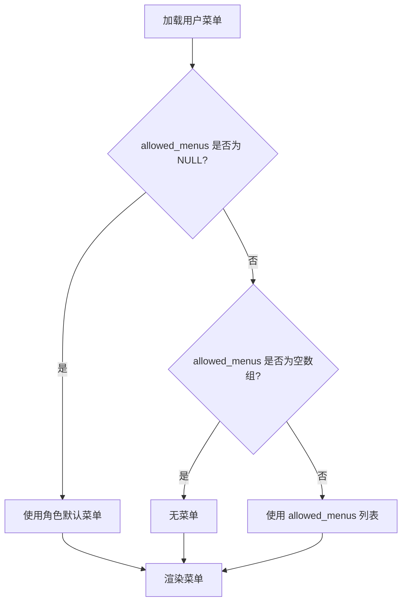
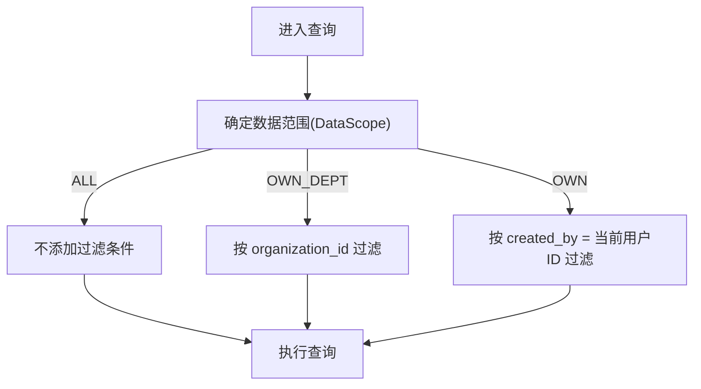
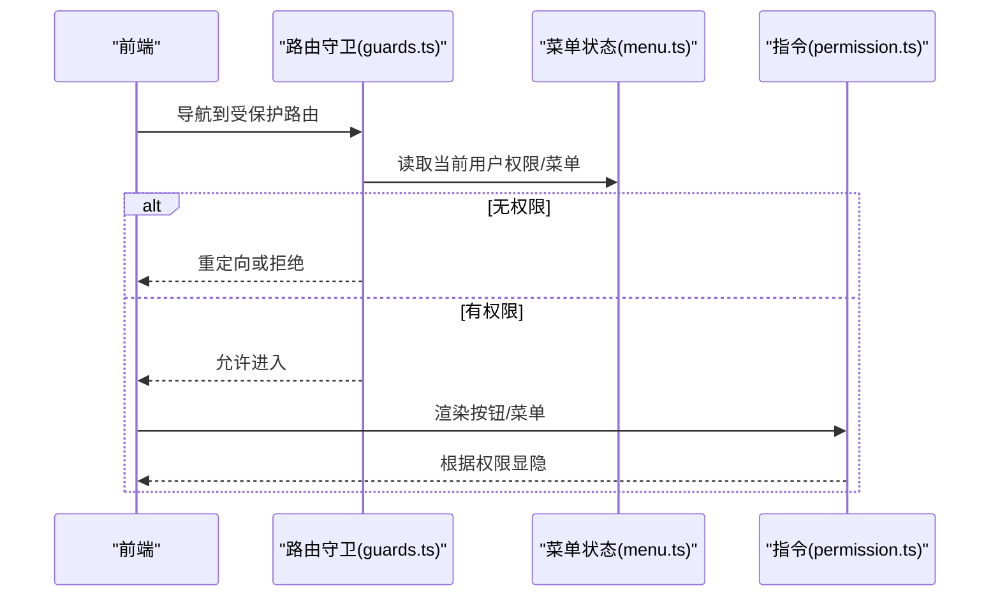
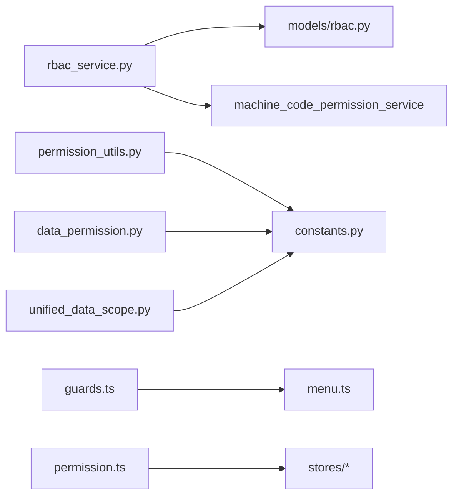

# 角色权限控制

<cite>
**本文引用的文件**
- [backend/app/models/rbac.py](file://backend/app/models/rbac.py)
- [backend/app/models/user.py](file://backend/app/models/user.py)
- [backend/app/services/rbac_service.py](file://backend/app/services/rbac_service.py)
- [backend/app/core/permission_utils.py](file://backend/app/core/permission_utils.py)
- [backend/app/core/data_permission.py](file://backend/app/core/data_permission.py)
- [backend/app/core/unified_data_scope.py](file://backend/app/core/unified_data_scope.py)
- [backend/app/core/constants.py](file://backend/app/core/constants.py)
- [frontend/src/router/guards.ts](file://frontend/src/router/guards.ts)
- [frontend/src/stores/menu.ts](file://frontend/src/stores/menu.ts)
- [frontend/src/directives/permission.ts](file://frontend/src/directives/permission.ts)
</cite>

## 目录
1. [简介](#简介)
2. [项目结构](#项目结构)
3. [核心组件](#核心组件)
4. [架构总览](#架构总览)
5. [详细组件分析](#详细组件分析)
6. [依赖关系分析](#依赖关系分析)
7. [性能考虑](#性能考虑)
8. [故障排查指南](#故障排查指南)
9. [结论](#结论)
10. [附录：使用示例与自定义规则](#附录使用示例与自定义规则)

## 简介
本文件系统性说明乡村振兴系统的角色与权限控制实现，覆盖 RBAC 模型设计、四级角色体系（超级管理员、管理员、普通用户、只读用户）、细粒度权限控制（菜单权限、数据范围隔离、操作权限）、权限分配与继承、权限缓存、以及前后端协同的权限验证流程。文档同时提供权限验证的使用示例与自定义权限规则的实践指南。

## 项目结构
后端采用“模型-服务-工具”分层：
- 模型层：定义 RBAC 相关实体（角色、用户-角色、角色-权限、用户直接权限、资源访问控制、访问日志、机器码权限）。
- 服务层：RBACService 负责权限计算、分配、撤销、批量操作与访问日志记录。
- 工具层：权限校验装饰器、数据范围过滤、统一数据作用域、常量与角色归一化。

前端在路由守卫、菜单状态管理、指令级按钮/菜单显隐控制三个层面配合后端进行权限控制。

**图表来源**
- [backend/app/models/rbac.py:31-263](file://backend/app/models/rbac.py#L31-L263)
- [backend/app/models/user.py:26-152](file://backend/app/models/user.py#L26-L152)
- [backend/app/services/rbac_service.py:104-746](file://backend/app/services/rbac_service.py#L104-L746)
- [backend/app/core/permission_utils.py:17-360](file://backend/app/core/permission_utils.py#L17-L360)
- [backend/app/core/data_permission.py:20-187](file://backend/app/core/data_permission.py#L20-L187)
- [backend/app/core/unified_data_scope.py:43-343](file://backend/app/core/unified_data_scope.py#L43-L343)
- [backend/app/core/constants.py:27-87](file://backend/app/core/constants.py#L27-L87)
- [frontend/src/router/guards.ts](file://frontend/src/router/guards.ts)
- [frontend/src/stores/menu.ts](file://frontend/src/stores/menu.ts)
- [frontend/src/directives/permission.ts](file://frontend/src/directives/permission.ts)

**章节来源**
- [backend/app/models/rbac.py:31-263](file://backend/app/models/rbac.py#L31-L263)
- [backend/app/models/user.py:26-152](file://backend/app/models/user.py#L26-L152)
- [backend/app/services/rbac_service.py:104-746](file://backend/app/services/rbac_service.py#L104-L746)
- [backend/app/core/permission_utils.py:17-360](file://backend/app/core/permission_utils.py#L17-L360)
- [backend/app/core/data_permission.py:20-187](file://backend/app/core/data_permission.py#L20-L187)
- [backend/app/core/unified_data_scope.py:43-343](file://backend/app/core/unified_data_scope.py#L43-L343)
- [backend/app/core/constants.py:27-87](file://backend/app/core/constants.py#L27-L87)

## 核心组件
- RBAC 模型：角色、用户-角色、角色-权限、用户直接权限、资源访问控制、访问日志、机器码权限。
- RBAC 服务：权限检查、权限计算（含白名单与机器码限制）、角色与权限分配/撤销、批量操作、访问日志。
- 权限工具：管理员判定、组织访问控制、通用权限校验装饰器。
- 数据范围：基于角色的数据可见性（全部/本部门/本人）与组织树范围过滤。
- 常量与角色归一化：四级角色定义、历史角色兼容映射。
- 前端：路由守卫、菜单状态、指令级权限控制。

**章节来源**
- [backend/app/models/rbac.py:31-263](file://backend/app/models/rbac.py#L31-L263)
- [backend/app/services/rbac_service.py:104-746](file://backend/app/services/rbac_service.py#L104-L746)
- [backend/app/core/permission_utils.py:17-360](file://backend/app/core/permission_utils.py#L17-L360)
- [backend/app/core/data_permission.py:20-187](file://backend/app/core/data_permission.py#L20-L187)
- [backend/app/core/unified_data_scope.py:43-343](file://backend/app/core/unified_data_scope.py#L43-L343)
- [backend/app/core/constants.py:27-87](file://backend/app/core/constants.py#L27-L87)

## 架构总览
系统通过“角色+权限+数据范围”三层控制实现最小授权原则：
- 角色层：用户可拥有多个角色；支持系统内置角色与自定义角色；支持优先级与有效期。
- 权限层：支持角色权限、用户直接权限、资源级权限；支持白名单裁剪与机器码限制。
- 数据范围层：按角色或 data_scope 字段限定查询范围（全部/本部门/本人），并支持组织树范围。

**图表来源**
- [backend/app/core/permission_utils.py:61-114](file://backend/app/core/permission_utils.py#L61-L114)
- [backend/app/core/permission_utils.py:272-309](file://backend/app/core/permission_utils.py#L272-L309)
- [backend/app/services/rbac_service.py:133-222](file://backend/app/services/rbac_service.py#L133-L222)

## 详细组件分析

### RBAC 模型与四级角色体系
- 四级角色：超级管理员(super_admin)、管理员(admin)、普通用户(user)、只读用户(viewer)。
- 角色与权限：
  - 角色表存储角色元信息（名称、描述、是否系统内置、是否启用、优先级）。
  - 角色-权限关联表绑定角色到具体权限标识。
  - 用户-角色关联表支持授予人、有效期。
  - 用户直接权限表支持对特定用户的细粒度授权。
  - 资源访问控制表支持针对具体资源的读写删级别。
  - 访问日志表记录每次权限检查的结果与原因。
  - 机器码权限表用于设备维度的功能限制。
- 用户模型包含 role、is_superuser、data_scope、allowed_permissions、allowed_menus、permission_pack_id 等字段，支撑菜单与权限包策略。

**图表来源**
- [backend/app/models/rbac.py:31-263](file://backend/app/models/rbac.py#L31-L263)
- [backend/app/models/user.py:26-152](file://backend/app/models/user.py#L26-L152)

**章节来源**
- [backend/app/models/rbac.py:31-263](file://backend/app/models/rbac.py#L31-L263)
- [backend/app/models/user.py:26-152](file://backend/app/models/user.py#L26-L152)
- [backend/app/core/constants.py:27-87](file://backend/app/core/constants.py#L27-L87)

### 权限计算与检查流程
- 权限检查顺序：
  1) 机器码限制优先（若命中则拒绝）。
  2) 管理员/超级管理员放行。
  3) 用户直接权限匹配。
  4) 角色权限匹配（仅启用且未过期的角色）。
  5) 资源级权限匹配（当提供资源类型与ID时）。
- 权限计算（获取用户所有有效权限）：
  - 合并直接权限与角色权限。
  - 若存在 allowed_permissions 白名单，取交集。
  - 减去机器码限制的权限。
  - 若包含 admin:all，则视为全量权限。
- 访问日志：每次权限检查均记录成功/失败及原因。

**图表来源**
- [backend/app/services/rbac_service.py:133-222](file://backend/app/services/rbac_service.py#L133-L222)
- [backend/app/services/rbac_service.py:256-320](file://backend/app/services/rbac_service.py#L256-L320)

**章节来源**
- [backend/app/services/rbac_service.py:133-222](file://backend/app/services/rbac_service.py#L133-L222)
- [backend/app/services/rbac_service.py:256-320](file://backend/app/services/rbac_service.py#L256-L320)

### 菜单权限与权限包
- 菜单可见性优先级：用户 allowed_menus > 权限包(通过 permission_pack_id) > 角色默认菜单。
- 用户模型中 allowed_menus 为 JSON 数组，可为空数组表示无菜单，NULL 表示继承角色默认菜单。
- 权限包机制通过 permission_pack_id 将一组菜单/权限打包，便于批量配置。

**图表来源**
- [backend/app/models/user.py:63-77](file://backend/app/models/user.py#L63-L77)
- [backend/app/models/user.py:123-139](file://backend/app/models/user.py#L123-L139)

**章节来源**
- [backend/app/models/user.py:63-77](file://backend/app/models/user.py#L63-L77)
- [backend/app/models/user.py:123-139](file://backend/app/models/user.py#L123-L139)

### 数据范围隔离
- 基于角色的数据范围：
  - 超级管理员：全部数据。
  - 管理员：本部门/组织数据。
  - 普通用户/只读用户：仅本人数据。
- 基于 data_scope 字段：
  - all：全部。
  - org：本组织。
  - org_children：本组织及下级。
  - self：仅本人。
- 统一数据作用域模块整合了两种路径，并提供组织树遍历以支持多级组织。

**图表来源**
- [backend/app/core/data_permission.py:20-187](file://backend/app/core/data_permission.py#L20-L187)
- [backend/app/core/unified_data_scope.py:43-185](file://backend/app/core/unified_data_scope.py#L43-L185)
- [backend/app/core/unified_data_scope.py:279-343](file://backend/app/core/unified_data_scope.py#L279-L343)

**章节来源**
- [backend/app/core/data_permission.py:20-187](file://backend/app/core/data_permission.py#L20-L187)
- [backend/app/core/unified_data_scope.py:43-185](file://backend/app/core/unified_data_scope.py#L43-L185)
- [backend/app/core/unified_data_scope.py:279-343](file://backend/app/core/unified_data_scope.py#L279-L343)

### 权限分配、角色继承与权限缓存
- 角色分配：支持设置授予人与有效期；重复分配会跳过。
- 权限授予/撤销：支持单条与批量操作；save_permissions 原子性更新（删除旧权限、新增新权限）。
- 角色继承：用户可拥有多角色，权限为各角色权限的并集；管理员角色具有 admin:all 即全量权限。
- 权限缓存：
  - 请求级上下文缓存：避免单次请求内重复查询机器码限制权限。
  - 前端缓存：路由守卫与菜单状态在会话期内缓存权限与菜单，减少重复请求。

**章节来源**
- [backend/app/services/rbac_service.py:322-586](file://backend/app/services/rbac_service.py#L322-L586)
- [backend/app/services/rbac_service.py:224-235](file://backend/app/services/rbac_service.py#L224-L235)
- [frontend/src/router/guards.ts](file://frontend/src/router/guards.ts)
- [frontend/src/stores/menu.ts](file://frontend/src/stores/menu.ts)

### 前端权限控制
- 路由守卫：根据用户角色与菜单权限控制页面访问。
- 菜单状态：集中管理用户可见菜单，结合 allowed_menus 与权限包。
- 指令：在模板中按权限标识控制按钮/菜单显示。

**图表来源**
- [frontend/src/router/guards.ts](file://frontend/src/router/guards.ts)
- [frontend/src/stores/menu.ts](file://frontend/src/stores/menu.ts)
- [frontend/src/directives/permission.ts](file://frontend/src/directives/permission.ts)

**章节来源**
- [frontend/src/router/guards.ts](file://frontend/src/router/guards.ts)
- [frontend/src/stores/menu.ts](file://frontend/src/stores/menu.ts)
- [frontend/src/directives/permission.ts](file://frontend/src/directives/permission.ts)

## 依赖关系分析
- 后端依赖：
  - RBACService 依赖 models/rbac.py 中的 ORM 模型与 machine_code_permission_service。
  - permission_utils 依赖 constants 的角色常量与 ADMIN_ROLES。
  - data_permission 与 unified_data_scope 依赖 constants 的角色归一化与组织模型。
- 前端依赖：
  - 路由守卫依赖菜单状态与用户认证状态。
  - 指令依赖全局权限标识与用户权限集合。

**图表来源**
- [backend/app/services/rbac_service.py:18-27](file://backend/app/services/rbac_service.py#L18-L27)
- [backend/app/core/permission_utils.py:12-14](file://backend/app/core/permission_utils.py#L12-L14)
- [backend/app/core/data_permission.py:14-16](file://backend/app/core/data_permission.py#L14-L16)
- [backend/app/core/unified_data_scope.py:24-28](file://backend/app/core/unified_data_scope.py#L24-L28)
- [frontend/src/router/guards.ts](file://frontend/src/router/guards.ts)
- [frontend/src/stores/menu.ts](file://frontend/src/stores/menu.ts)
- [frontend/src/directives/permission.ts](file://frontend/src/directives/permission.ts)

**章节来源**
- [backend/app/services/rbac_service.py:18-27](file://backend/app/services/rbac_service.py#L18-L27)
- [backend/app/core/permission_utils.py:12-14](file://backend/app/core/permission_utils.py#L12-L14)
- [backend/app/core/data_permission.py:14-16](file://backend/app/core/data_permission.py#L14-L16)
- [backend/app/core/unified_data_scope.py:24-28](file://backend/app/core/unified_data_scope.py#L24-L28)

## 性能考虑
- 权限检查优化：
  - 请求级上下文缓存：避免同一请求内多次查询机器码限制权限。
  - 批量操作：grant_permissions_batch、revoke_permissions_batch、save_permissions 减少数据库往返。
- 数据范围优化：
  - 统一数据作用域模块提供组织树遍历与防环保护，避免递归过深。
  - 在查询阶段尽早应用过滤条件，减少无效数据传输。
- 前端缓存：
  - 路由守卫与菜单状态在会话期内缓存，降低重复鉴权开销。

[本节为通用性能建议，无需特定文件引用]

## 故障排查指南
- 权限不足：
  - 检查是否命中机器码限制（被拒绝时会记录原因）。
  - 确认用户直接权限、角色权限是否生效（注意有效期与角色启用状态）。
  - 检查 allowed_permissions 白名单是否裁剪了必要权限。
- 数据不可见：
  - 确认 data_scope 与 organization_id 是否正确设置。
  - 检查 apply_scope_to_query 是否因缺少 owner_field 而回退为空集。
- 菜单不显示：
  - 检查 allowed_menus 是否为空数组或错误 JSON。
  - 确认权限包配置与角色默认菜单优先级。

**章节来源**
- [backend/app/services/rbac_service.py:716-742](file://backend/app/services/rbac_service.py#L716-L742)
- [backend/app/core/data_permission.py:120-130](file://backend/app/core/data_permission.py#L120-L130)
- [backend/app/models/user.py:123-139](file://backend/app/models/user.py#L123-L139)

## 结论
本系统通过 RBAC 模型、四级角色体系、细粒度权限控制与数据范围隔离，实现了安全、灵活、可扩展的权限管理。结合请求级缓存与前端缓存，在保证安全性的同时兼顾性能。通过统一的权限工具与数据作用域模块，降低了业务层的复杂度，提升了可维护性与一致性。

[本节为总结性内容，无需特定文件引用]

## 附录：使用示例与自定义规则

### 后端使用示例
- 在 API 端点中使用权限装饰器：
  - 管理员访问：require_admin()
  - 资源操作：@require_permission("villages:write")
- 在业务逻辑中直接调用权限检查：
  - 检查用户是否有某权限：check_permission(current_user, "villages", "write")
- 数据范围过滤：
  - 在查询前应用 filter_by_data_scope(query, model, current_user)

**章节来源**
- [backend/app/core/permission_utils.py:61-114](file://backend/app/core/permission_utils.py#L61-L114)
- [backend/app/core/permission_utils.py:272-309](file://backend/app/core/permission_utils.py#L272-L309)
- [backend/app/core/data_permission.py:164-173](file://backend/app/core/data_permission.py#L164-L173)

### 自定义权限规则
- 新增权限标识：
  - 在 RBACService 的 Permission 枚举中添加新权限（如 module:action）。
  - 在角色默认权限或角色-权限表中配置该权限。
- 白名单裁剪：
  - 为用户设置 allowed_permissions，系统将自动取交集。
- 机器码限制：
  - 通过机器码权限表限制特定功能，RBACService 会在权限检查时优先拒绝。
- 数据范围扩展：
  - 如需新的数据范围，可在 DataScope 中扩展并在 apply_scope_to_query 中实现对应过滤逻辑。

**章节来源**
- [backend/app/services/rbac_service.py:52-99](file://backend/app/services/rbac_service.py#L52-L99)
- [backend/app/services/rbac_service.py:256-320](file://backend/app/services/rbac_service.py#L256-L320)
- [backend/app/core/unified_data_scope.py:43-83](file://backend/app/core/unified_data_scope.py#L43-L83)