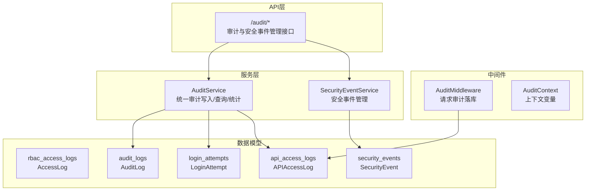
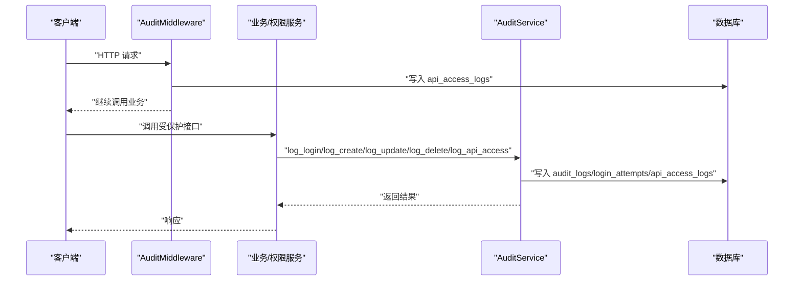
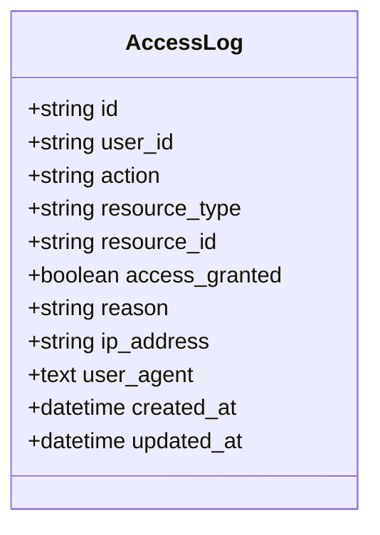
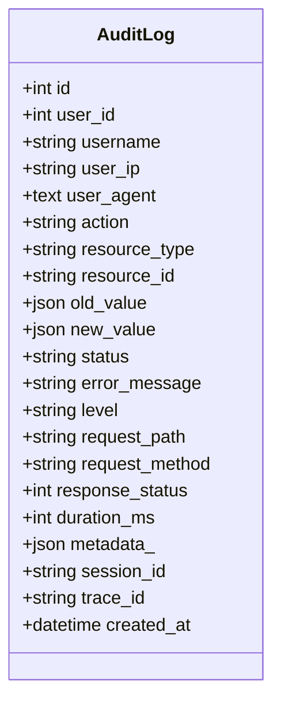
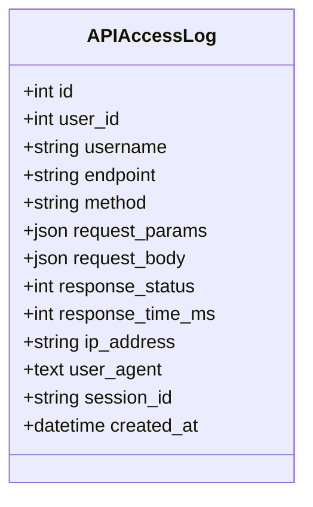
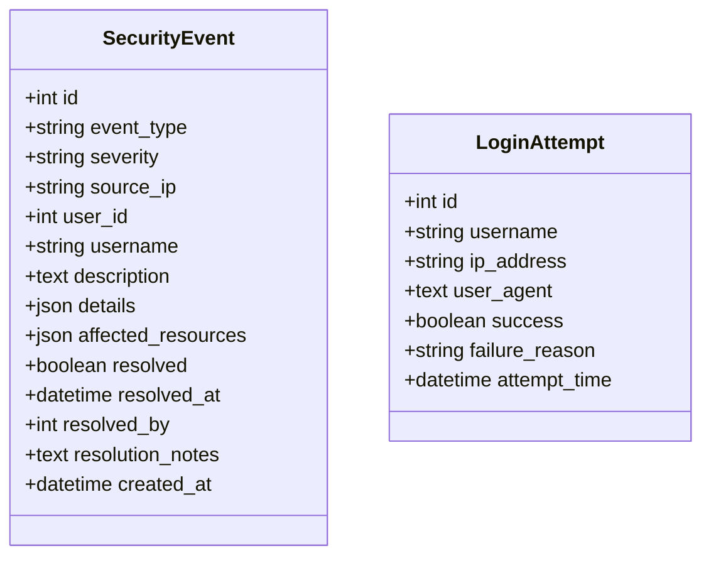
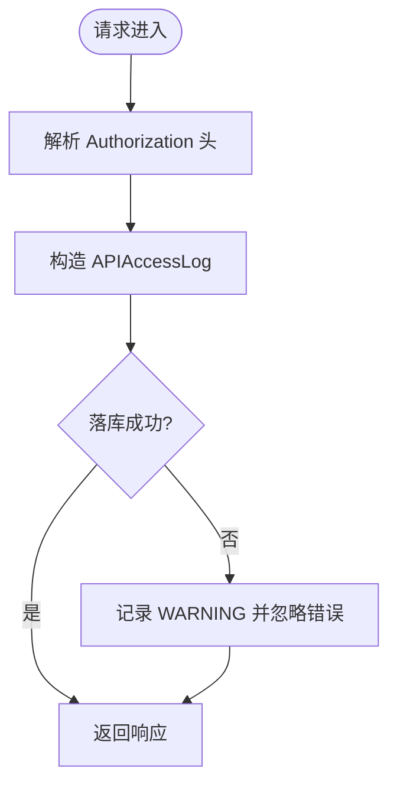
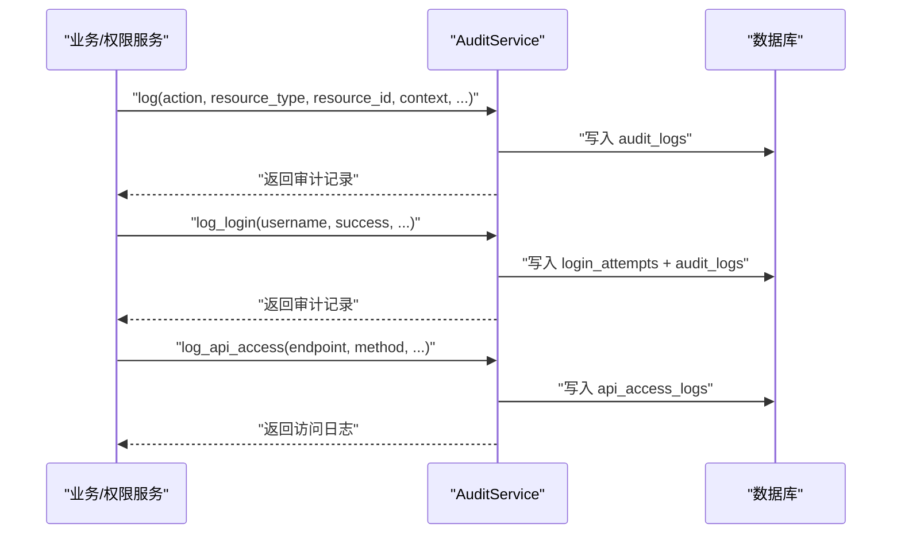
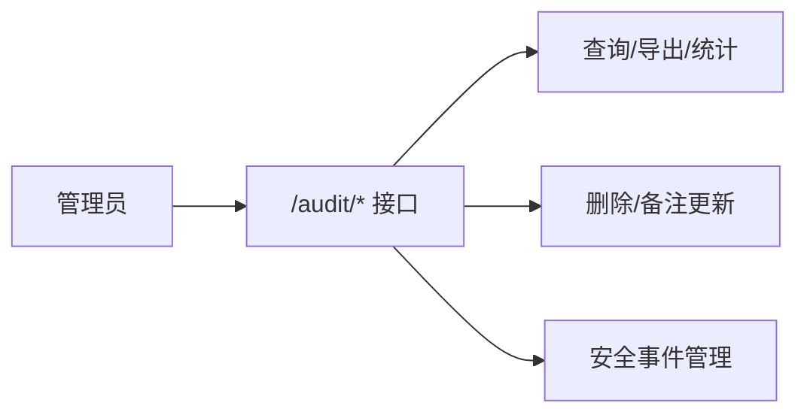
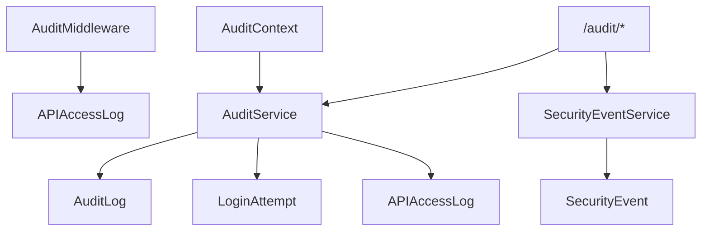

# 访问控制日志

<cite>
**本文引用的文件**
- [backend/app/models/rbac.py](file://backend/app/models/rbac.py)
- [backend/app/models/audit.py](file://backend/app/models/audit.py)
- [backend/app/core/audit_middleware.py](file://backend/app/core/audit_middleware.py)
- [backend/app/middleware/audit_context.py](file://backend/app/middleware/audit_context.py)
- [backend/app/services/audit_service.py](file://backend/app/services/audit_service.py)
- [backend/app/api/v1/system/audit.py](file://backend/app/api/v1/system/audit.py)
- [backend/app/core/security.py](file://backend/app/core/security.py)
</cite>

## 目录
1. [简介](#简介)
2. [项目结构](#项目结构)
3. [核心组件](#核心组件)
4. [架构总览](#架构总览)
5. [详细组件分析](#详细组件分析)
6. [依赖关系分析](#依赖关系分析)
7. [性能考虑](#性能考虑)
8. [故障排查指南](#故障排查指南)
9. [结论](#结论)
10. [附录](#附录)

## 简介
本文件面向访问控制与审计，系统性说明 RBAC 访问日志的记录机制、模型设计、采集流程、审计事件分类（成功访问、拒绝访问、异常访问）、查询分析与安全事件检测能力，并给出合规报告导出、配置与监控告警建议，以及基于日志的安全分析与故障排查方法。

## 项目结构
围绕访问控制日志的关键代码分布在以下模块：
- 数据模型：RBAC 权限模型与访问日志模型、通用审计日志与安全事件模型
- 中间件：请求级审计中间件（记录 API 访问）与审计上下文（跨层传递用户与请求信息）
- 服务层：统一审计服务（登录、资源操作、API 访问、导出等）与安全事件服务
- API 层：审计与安全事件的查询、导出、统计、批量清理等管理接口
- 安全工具：通用审计日志写入入口（供业务侧直接调用）

图表来源
- [backend/app/models/rbac.py:191-218](file://backend/app/models/rbac.py#L191-L218)
- [backend/app/models/audit.py:53-96](file://backend/app/models/audit.py#L53-L96)
- [backend/app/models/audit.py:98-125](file://backend/app/models/audit.py#L98-L125)
- [backend/app/models/audit.py:128-145](file://backend/app/models/audit.py#L128-L145)
- [backend/app/models/audit.py:148-175](file://backend/app/models/audit.py#L148-L175)
- [backend/app/core/audit_middleware.py:11-44](file://backend/app/core/audit_middleware.py#L11-L44)
- [backend/app/middleware/audit_context.py:15-58](file://backend/app/middleware/audit_context.py#L15-L58)
- [backend/app/services/audit_service.py:58-106](file://backend/app/services/audit_service.py#L58-L106)
- [backend/app/services/audit_service.py:379-509](file://backend/app/services/audit_service.py#L379-L509)
- [backend/app/api/v1/system/audit.py:339-615](file://backend/app/api/v1/system/audit.py#L339-L615)

章节来源
- [backend/app/models/rbac.py:191-218](file://backend/app/models/rbac.py#L191-L218)
- [backend/app/models/audit.py:53-175](file://backend/app/models/audit.py#L53-L175)
- [backend/app/core/audit_middleware.py:11-109](file://backend/app/core/audit_middleware.py#L11-L109)
- [backend/app/middleware/audit_context.py:15-58](file://backend/app/middleware/audit_context.py#L15-L58)
- [backend/app/services/audit_service.py:58-509](file://backend/app/services/audit_service.py#L58-L509)
- [backend/app/api/v1/system/audit.py:339-615](file://backend/app/api/v1/system/audit.py#L339-L615)

## 核心组件
- AccessLog（RBAC 访问日志）：记录每次访问控制的判定结果（授权/拒绝）、动作、资源类型与 ID、IP、UA 等，用于审计与追责。
- AuditLog（通用审计日志）：覆盖登录、资源 CRUD、导出、导入、配置变更等全量行为，支持状态、级别、元数据、耗时、响应码等。
- APIAccessLog（API 访问日志）：由中间件自动记录每个 HTTP 请求的端点、方法、状态码、耗时、客户端 IP/UA、会话标识等。
- SecurityEvent（安全事件）：聚焦安全相关事件（如暴力破解、多次失败登录），支持严重等级、处理状态与备注。
- LoginAttempt（登录尝试）：记录每次登录尝试的结果与原因，支撑安全事件聚合。
- AuditService：封装统一的审计写入、查询、统计与导出；提供登录、API 访问、数据导出等便捷方法。
- SecurityEventService：安全事件创建、查询、统计与闭环处理（标记已解决）。
- AuditMiddleware：在请求链路中无侵入地记录 API 访问日志，失败不破坏业务。
- AuditContext：通过上下文变量在当前请求范围内传播用户与请求信息。

章节来源
- [backend/app/models/rbac.py:191-218](file://backend/app/models/rbac.py#L191-L218)
- [backend/app/models/audit.py:53-175](file://backend/app/models/audit.py#L53-L175)
- [backend/app/services/audit_service.py:58-509](file://backend/app/services/audit_service.py#L58-L509)
- [backend/app/core/audit_middleware.py:11-109](file://backend/app/core/audit_middleware.py#L11-L109)
- [backend/app/middleware/audit_context.py:15-58](file://backend/app/middleware/audit_context.py#L15-L58)

## 架构总览
访问控制日志的整体流程如下：
- 请求进入后，AuditMiddleware 解析 JWT 获取用户身份，记录 API 访问日志到 api_access_logs，同时输出结构化日志。
- 业务逻辑或权限校验过程中，通过 AuditService.log_* 系列方法记录资源级审计日志到 audit_logs，并通过 AuditContext 携带上下文。
- 登录成功/失败时，记录 login_attempts 与对应的审计日志，并根据失败次数生成 security_events。
- 管理员通过 /audit/* 接口进行审计日志与安全事件的查询、导出、统计与清理。

图表来源
- [backend/app/core/audit_middleware.py:11-44](file://backend/app/core/audit_middleware.py#L11-L44)
- [backend/app/services/audit_service.py:62-106](file://backend/app/services/audit_service.py#L62-L106)
- [backend/app/services/audit_service.py:168-229](file://backend/app/services/audit_service.py#L168-L229)
- [backend/app/models/audit.py:53-175](file://backend/app/models/audit.py#L53-L175)

## 详细组件分析

### RBAC 访问日志模型（AccessLog）
- 表名：rbac_access_logs
- 关键字段：user_id、action、resource_type、resource_id、access_granted、reason、ip_address、user_agent、created_at
- 索引：按 user_id + action 建立复合索引，便于按用户与动作快速检索
- 用途：记录每次访问控制的判定结果与原因，支撑审计与合规检查

图表来源
- [backend/app/models/rbac.py:191-218](file://backend/app/models/rbac.py#L191-L218)

章节来源
- [backend/app/models/rbac.py:191-218](file://backend/app/models/rbac.py#L191-L218)

### 通用审计日志模型（AuditLog）
- 表名：audit_logs
- 关键字段：user_id、username、user_ip、user_agent、action、resource_type、resource_id、old_value/new_value、status、level、request_path、request_method、response_status、duration_ms、metadata_、session_id、trace_id、created_at
- 索引：多列索引优化按用户、动作、时间、资源的查询
- 用途：统一记录系统内各类关键行为，包括登录、资源操作、导出、导入、配置变更等

图表来源
- [backend/app/models/audit.py:53-96](file://backend/app/models/audit.py#L53-L96)

章节来源
- [backend/app/models/audit.py:53-96](file://backend/app/models/audit.py#L53-L96)

### API 访问日志模型（APIAccessLog）
- 表名：api_access_logs
- 关键字段：user_id、username、endpoint、method、request_params/request_body、response_status、response_time_ms、ip_address、user_agent、session_id、created_at
- 索引：按 user_id+created_at、endpoint+created_at 优化高频查询
- 用途：中间件自动记录所有 HTTP 请求的访问轨迹与性能指标

图表来源
- [backend/app/models/audit.py:148-175](file://backend/app/models/audit.py#L148-L175)

章节来源
- [backend/app/models/audit.py:148-175](file://backend/app/models/audit.py#L148-L175)

### 安全事件与登录尝试
- SecurityEvent：记录安全事件类型、严重等级、来源 IP、用户、描述、详情、受影响资源、处理状态与备注
- LoginAttempt：记录用户名、IP、UA、是否成功、失败原因、尝试时间
- 用途：集中管理安全事件，支持按严重等级、类型、时间范围查询与统计，辅助安全分析与合规报告

图表来源
- [backend/app/models/audit.py:98-145](file://backend/app/models/audit.py#L98-L145)

章节来源
- [backend/app/models/audit.py:98-145](file://backend/app/models/audit.py#L98-L145)

### 审计中间件（AuditMiddleware）
- 功能：在每个请求结束后提取用户身份（从 Authorization Bearer Token），记录 API 访问日志到 api_access_logs，并输出结构化日志
- 健壮性：使用独立短 session 落库，失败仅记录警告，绝不影响业务请求
- 可观测性：记录方法、路径、状态码、耗时、用户标识

图表来源
- [backend/app/core/audit_middleware.py:11-109](file://backend/app/core/audit_middleware.py#L11-L109)

章节来源
- [backend/app/core/audit_middleware.py:11-109](file://backend/app/core/audit_middleware.py#L11-L109)

### 审计服务（AuditService）
- 统一写入：提供 log、log_create、log_update、log_delete、log_read、log_login、log_api_access、log_export 等方法
- 上下文：支持 AuditContext 携带用户、IP、UA、会话、追踪、请求路径与方法等信息
- 查询与统计：query_audit_logs、get_audit_stats 支持多维度过滤与分页，提供今日操作数、活跃用户、失败操作、警告数等指标
- 安全事件：SecurityEventService 提供事件创建、查询、统计与闭环处理

图表来源
- [backend/app/services/audit_service.py:62-229](file://backend/app/services/audit_service.py#L62-L229)
- [backend/app/services/audit_service.py:231-273](file://backend/app/services/audit_service.py#L231-L273)

章节来源
- [backend/app/services/audit_service.py:62-273](file://backend/app/services/audit_service.py#L62-L273)

### 审计 API（/audit/*）
- 审计日志查询：GET /audit/logs，支持按用户、动作、资源类型、状态、级别、时间范围分页查询
- 审计日志导出：GET /audit/logs/export，支持 JSON/Excel/CSV 格式导出（限制最大条数）
- 单条删除与批量删除：DELETE /audit/logs/{log_id}、DELETE /audit/logs/batch（支持按 ids/actions/before_date 删除）
- 审计统计：GET /audit/stats
- 安全事件：GET /audit/security/events、GET /audit/security/stats、POST /audit/security/events/{event_id}/resolve
- 登录尝试：GET /audit/login-attempts
- API 访问日志：GET /audit/api-access
- 数据导出日志：GET /audit/exports
- 用户活动：GET /audit/user-activity/{user_id}

图表来源
- [backend/app/api/v1/system/audit.py:80-141](file://backend/app/api/v1/system/audit.py#L80-L141)
- [backend/app/api/v1/system/audit.py:205-336](file://backend/app/api/v1/system/audit.py#L205-L336)
- [backend/app/api/v1/system/audit.py:339-615](file://backend/app/api/v1/system/audit.py#L339-L615)

章节来源
- [backend/app/api/v1/system/audit.py:80-615](file://backend/app/api/v1/system/audit.py#L80-L615)

### 通用审计写入入口（Security.log）
- 作用：为业务侧提供轻量审计写入能力，将 action/resource/resource_id/details/ip_address 映射到 AuditLog 字段并持久化
- 容错：写入失败记录警告并回滚，避免影响主事务

章节来源
- [backend/app/core/security.py:650-713](file://backend/app/core/security.py#L650-L713)

## 依赖关系分析
- 中间件依赖：JWT 解码、数据库会话、APIAccessLog 模型
- 服务依赖：AuditLog、LoginAttempt、APIAccessLog、SecurityEvent 模型与 safe_commit
- API 依赖：服务层、模型与权限校验（admin/super_admin）
- 上下文依赖：AuditContext 通过 ContextVar 在当前请求范围内共享用户与请求信息

图表来源
- [backend/app/core/audit_middleware.py:11-109](file://backend/app/core/audit_middleware.py#L11-L109)
- [backend/app/services/audit_service.py:58-509](file://backend/app/services/audit_service.py#L58-L509)
- [backend/app/middleware/audit_context.py:15-58](file://backend/app/middleware/audit_context.py#L15-L58)
- [backend/app/api/v1/system/audit.py:339-615](file://backend/app/api/v1/system/audit.py#L339-L615)

章节来源
- [backend/app/core/audit_middleware.py:11-109](file://backend/app/core/audit_middleware.py#L11-L109)
- [backend/app/services/audit_service.py:58-509](file://backend/app/services/audit_service.py#L58-L509)
- [backend/app/middleware/audit_context.py:15-58](file://backend/app/middleware/audit_context.py#L15-L58)
- [backend/app/api/v1/system/audit.py:339-615](file://backend/app/api/v1/system/audit.py#L339-L615)

## 性能考虑
- 中间件落库采用独立短 session，失败不影响业务请求，降低对主事务的影响
- 审计日志表建立多维索引（用户、动作、时间、资源、端点），提升查询效率
- 导出接口限制最大条数（例如 5000），避免大结果集导致内存与网络压力
- 统计接口使用分组与聚合查询，减少应用层计算开销
- 建议在大数据量场景下对历史日志进行归档或分区策略

[本节为通用指导，无需特定文件引用]

## 故障排查指南
- 审计日志未写入：检查中间件日志中的 WARNING，确认数据库连接与权限；查看 safe_commit 与异常捕获逻辑
- 登录失败频繁：通过 /audit/login-attempts 与 /audit/security/events 查看失败原因与严重等级，必要时触发告警
- 导出失败：确认 openpyxl 是否安装（Excel 导出），否则会自动回退 CSV；检查导出参数与时间范围
- 批量删除误删：确保传入有效的 ids/actions/before_date，避免空条件导致无删除或误删
- 审计上下文缺失：确认 AuditContext 是否正确设置当前用户与请求 ID，并在需要时注入到服务层

章节来源
- [backend/app/core/audit_middleware.py:79-109](file://backend/app/core/audit_middleware.py#L79-L109)
- [backend/app/api/v1/system/audit.py:80-141](file://backend/app/api/v1/system/audit.py#L80-L141)
- [backend/app/api/v1/system/audit.py:205-336](file://backend/app/api/v1/system/audit.py#L205-L336)
- [backend/app/services/audit_service.py:411-442](file://backend/app/services/audit_service.py#L411-L442)

## 结论
本系统通过 RBAC 访问日志、通用审计日志、API 访问日志与安全事件四类数据，构建了完整的访问控制审计体系。中间件与服务层协同实现无侵入采集与统一写入，API 层提供丰富的查询、导出与管理能力，满足安全分析、合规报告与故障排查需求。结合合理的索引与导出限制，系统在可扩展性与性能之间取得平衡。

[本节为总结，无需特定文件引用]

## 附录

### 审计事件分类与日志格式要点
- 成功访问：action 为 create/read/update/delete/export/import 等，status=success，level 通常为 info
- 拒绝访问：RBAC 判定失败时，AccessLog.access_granted=false，reason 记录拒绝原因；也可通过 AuditLog.status=failed 与 level=warning/error 体现
- 异常访问：登录失败、权限校验异常、导出失败等，记录 error_message 与 level，必要时生成 SecurityEvent（severity 根据规则提升）

章节来源
- [backend/app/models/rbac.py:191-218](file://backend/app/models/rbac.py#L191-L218)
- [backend/app/models/audit.py:53-96](file://backend/app/models/audit.py#L53-L96)
- [backend/app/services/audit_service.py:168-229](file://backend/app/services/audit_service.py#L168-L229)
- [backend/app/services/audit_service.py:411-442](file://backend/app/services/audit_service.py#L411-L442)

### 日志查询与分析
- 审计日志：/audit/logs，支持按用户、动作、资源类型、状态、级别、时间范围分页查询
- API 访问日志：/audit/api-access，支持按用户、端点、时间范围查询
- 登录尝试：/audit/login-attempts，支持按用户名、IP、时间范围查询
- 安全事件：/audit/security/events，支持按严重等级、事件类型、处理状态、时间范围查询
- 统计：/audit/stats、/audit/security/stats，提供汇总指标与近期事件

章节来源
- [backend/app/api/v1/system/audit.py:339-615](file://backend/app/api/v1/system/audit.py#L339-L615)

### 合规报告生成
- 导出审计日志：/audit/logs/export，支持 JSON/Excel/CSV，便于合规审计与归档
- 导出数据操作日志：/audit/exports，记录导出类型、数据项、文件格式、记录数、状态等

章节来源
- [backend/app/api/v1/system/audit.py:205-336](file://backend/app/api/v1/system/audit.py#L205-L336)
- [backend/app/api/v1/system/audit.py:544-574](file://backend/app/api/v1/system/audit.py#L544-L574)

### 配置与监控告警建议
- 中间件落库失败：监控 WARNING 日志，确保审计不丢失且不影响业务
- 登录失败阈值：当同一用户在短时间内多次失败登录时，触发告警并生成高严重等级安全事件
- 导出频率与大小：监控导出接口调用频率与记录数，防止数据泄露风险
- 审计日志生命周期：定期归档与清理，保留符合合规要求的周期

[本节为通用指导，无需特定文件引用]