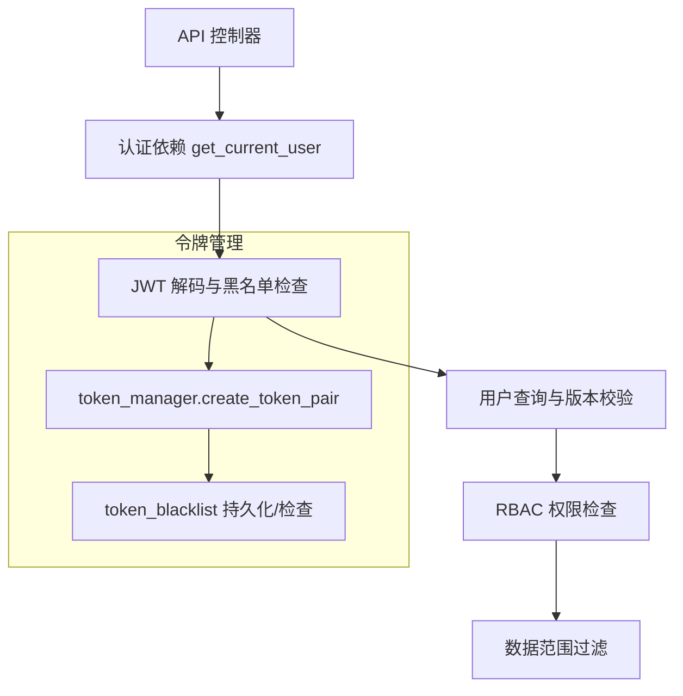
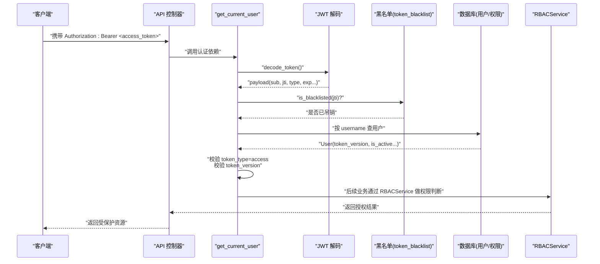
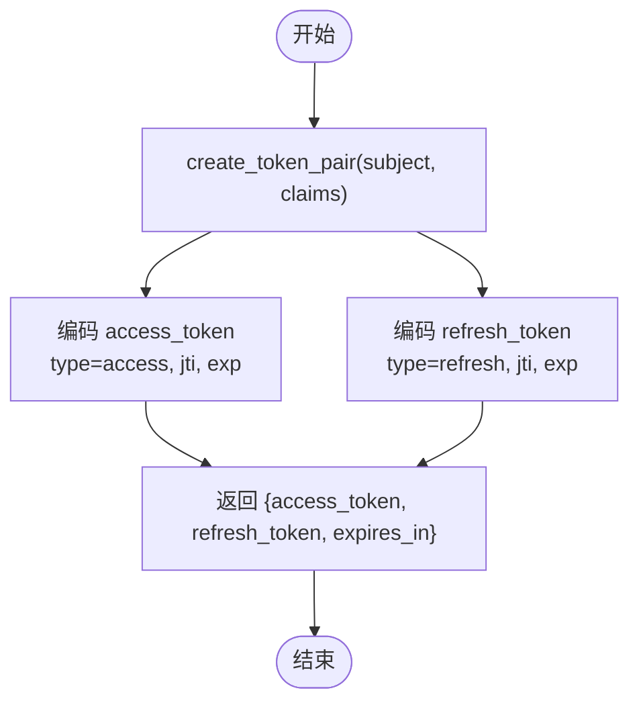
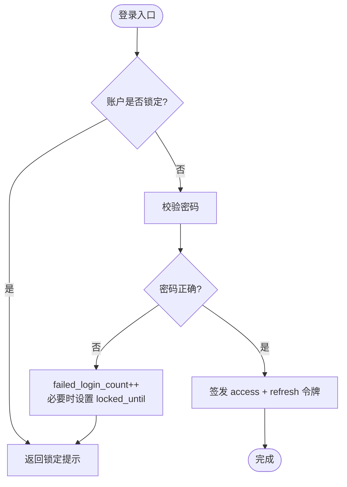
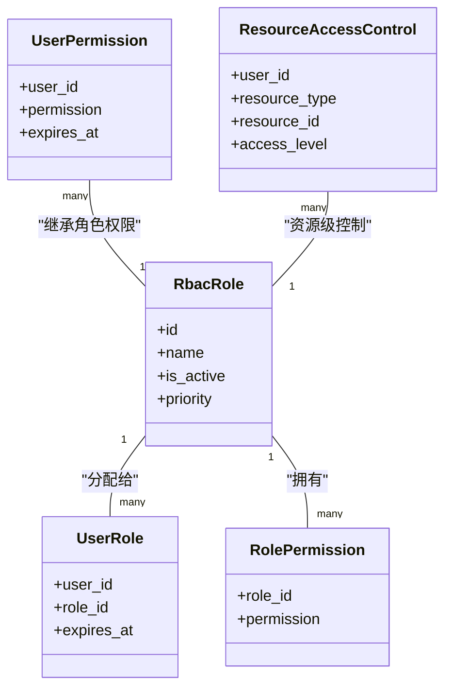
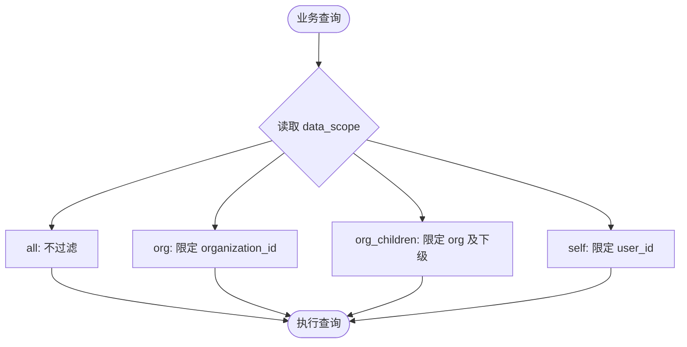
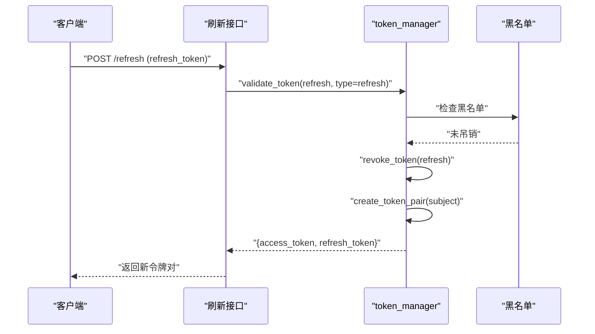
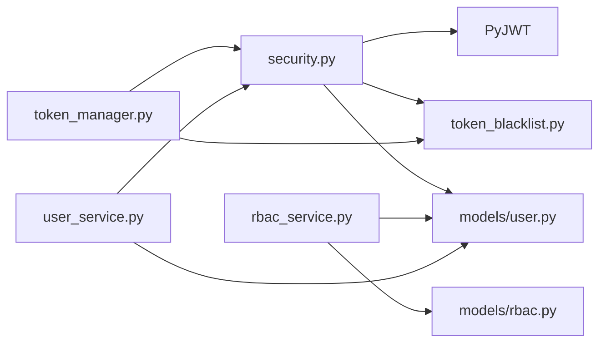

# 认证授权机制

<cite>
**本文引用的文件**
- [backend/app/core/security.py](file://backend/app/core/security.py)
- [backend/app/core/token_manager.py](file://backend/app/core/token_manager.py)
- [backend/app/core/token_blacklist.py](file://backend/app/core/token_blacklist.py)
- [backend/app/schemas/auth.py](file://backend/app/schemas/auth.py)
- [backend/app/models/user.py](file://backend/app/models/user.py)
- [backend/app/models/rbac.py](file://backend/app/models/rbac.py)
- [backend/app/services/user_service.py](file://backend/app/services/user_service.py)
- [backend/app/services/rbac_service.py](file://backend/app/services/rbac_service.py)
</cite>

## 目录
1. [简介](#简介)
2. [项目结构](#项目结构)
3. [核心组件](#核心组件)
4. [架构总览](#架构总览)
5. [详细组件分析](#详细组件分析)
6. [依赖关系分析](#依赖关系分析)
7. [性能考虑](#性能考虑)
8. [故障排查指南](#故障排查指南)
9. [结论](#结论)
10. [附录](#附录)

## 简介
本文件面向“乡村振兴系统”的后端安全能力，系统化说明认证与授权的实现：JWT 令牌生成与校验、用户身份认证、角色与权限控制、数据范围隔离、令牌生命周期管理（access/refresh）、令牌吊销、多会话管理、密码策略、登录失败锁定与会话管理等。文档同时提供认证中间件使用示例与自定义认证逻辑的实现指引，帮助开发者快速集成并扩展安全能力。

## 项目结构
认证授权相关代码主要分布在以下模块：
- 安全基础与 JWT：security.py、token_manager.py、token_blacklist.py
- 数据模型：user.py、rbac.py
- 服务层：user_service.py、rbac_service.py
- 请求/响应模式：schemas/auth.py

**图表来源**
- [backend/app/core/security.py:243-336](file://backend/app/core/security.py#L243-L336)
- [backend/app/core/token_manager.py:64-127](file://backend/app/core/token_manager.py#L64-L127)
- [backend/app/core/token_blacklist.py:27-70](file://backend/app/core/token_blacklist.py#L27-L70)

**章节来源**
- [backend/app/core/security.py:243-336](file://backend/app/core/security.py#L243-L336)
- [backend/app/core/token_manager.py:64-127](file://backend/app/core/token_manager.py#L64-L127)
- [backend/app/core/token_blacklist.py:27-70](file://backend/app/core/token_blacklist.py#L27-L70)

## 核心组件
- 安全与 JWT：负责密码哈希、JWT 签发/解码、Bearer 提取、速率限制与安全头注入。
- 令牌管理器：封装 access/refresh 成对签发、刷新、吊销、验证等高层 API。
- 令牌黑名单：内存+数据库的持久化黑名单，支持过期清理与重启恢复。
- 用户模型：包含 token_version、failed_login_count、locked_until 等安全字段。
- RBAC 模型与服务：角色、直接权限、资源级访问控制、机器码限制与访问日志。
- 认证 Schema：登录请求、令牌载荷、用户信息、双因素临时令牌等。

**章节来源**
- [backend/app/core/security.py:120-235](file://backend/app/core/security.py#L120-L235)
- [backend/app/core/token_manager.py:64-240](file://backend/app/core/token_manager.py#L64-L240)
- [backend/app/core/token_blacklist.py:27-163](file://backend/app/core/token_blacklist.py#L27-L163)
- [backend/app/models/user.py:63-83](file://backend/app/models/user.py#L63-L83)
- [backend/app/models/rbac.py:31-263](file://backend/app/models/rbac.py#L31-L263)
- [backend/app/schemas/auth.py:8-77](file://backend/app/schemas/auth.py#L8-L77)

## 架构总览
下图展示了从登录到受保护接口调用的完整流程，包括令牌签发、校验、黑名单与版本控制、RBAC 权限判定。

**图表来源**
- [backend/app/core/security.py:243-336](file://backend/app/core/security.py#L243-L336)
- [backend/app/core/token_blacklist.py:60-70](file://backend/app/core/token_blacklist.py#L60-L70)
- [backend/app/services/rbac_service.py:133-222](file://backend/app/services/rbac_service.py#L133-L222)

## 详细组件分析

### JWT 令牌生成与验证
- 签发 access/refresh 令牌：统一由 token_manager.create_token_pair 生成，附带 jti、type、exp 等声明；access 短时效、refresh 长时效。
- 解码与校验：security.get_current_user 负责从请求中提取 Bearer Token，解码后校验类型、黑名单、用户存在性与 token_version。
- 算法与密钥：使用配置中的 ALGORITHM 与 SECRET_KEY，支持 HS256 等对称算法。

**图表来源**
- [backend/app/core/token_manager.py:64-127](file://backend/app/core/token_manager.py#L64-L127)

**章节来源**
- [backend/app/core/token_manager.py:64-127](file://backend/app/core/token_manager.py#L64-L127)
- [backend/app/core/security.py:210-235](file://backend/app/core/security.py#L210-L235)

### 用户身份认证与登录失败锁定
- 登录流程：前端提交用户名/密码，后端校验密码策略与账户状态，成功后签发令牌对。
- 失败锁定：用户模型包含 failed_login_count 与 locked_until，可在登录失败时递增计数并在达到阈值时设置锁定截止时间。
- 活跃状态：get_current_active_user 会拒绝 is_active=False 的用户。

**图表来源**
- [backend/app/models/user.py:78-83](file://backend/app/models/user.py#L78-L83)
- [backend/app/core/security.py:339-347](file://backend/app/core/security.py#L339-L347)

**章节来源**
- [backend/app/models/user.py:78-83](file://backend/app/models/user.py#L78-L83)
- [backend/app/core/security.py:339-347](file://backend/app/core/security.py#L339-L347)

### 角色权限控制（RBAC）
- 模型：角色、用户-角色关联、角色-权限关联、用户直接权限、资源级访问控制、访问日志。
- 权限计算：RBACService.check_permission 依次检查机器码限制、管理员角色、直接权限、角色权限、资源权限，并记录审计日志。
- 白名单与交集：若用户设置了 allowed_permissions，则与当前权限取交集，进一步收紧权限。

**图表来源**
- [backend/app/models/rbac.py:31-263](file://backend/app/models/rbac.py#L31-L263)

**章节来源**
- [backend/app/services/rbac_service.py:133-222](file://backend/app/services/rbac_service.py#L133-L222)
- [backend/app/models/rbac.py:31-263](file://backend/app/models/rbac.py#L31-L263)

### 数据范围隔离
- 用户模型 data_scope 字段定义数据范围：all、org、org_children、self。
- 结合组织归属 organization_id，可在查询层按范围过滤数据，确保不同角色/用户仅能访问其范围内的数据。

**图表来源**
- [backend/app/models/user.py:63-67](file://backend/app/models/user.py#L63-L67)

**章节来源**
- [backend/app/models/user.py:63-67](file://backend/app/models/user.py#L63-L67)

### 令牌生命周期管理与吊销
- 生命周期：
  - access_token：短时有效，用于访问受保护资源。
  - refresh_token：长时有效，用于换取新的 access_token。
- 刷新流程：使用有效的 refresh_token 调用刷新接口，服务端吊销旧 refresh_token 并签发新令牌对。
- 吊销机制：
  - 单条吊销：revoke_token 将 JTI 加入内存黑名单，并持久化至数据库。
  - 批量失效：通过用户 token_version 递增，使所有旧令牌在 get_current_user 中因版本不匹配而失效。
  - 黑名单加载：服务启动时将数据库未过期的黑名单条目加载到内存。

**图表来源**
- [backend/app/core/token_manager.py:218-240](file://backend/app/core/token_manager.py#L218-L240)
- [backend/app/core/token_blacklist.py:27-70](file://backend/app/core/token_blacklist.py#L27-L70)

**章节来源**
- [backend/app/core/token_manager.py:176-240](file://backend/app/core/token_manager.py#L176-L240)
- [backend/app/core/token_blacklist.py:73-103](file://backend/app/core/token_blacklist.py#L73-L103)
- [backend/app/core/security.py:306-323](file://backend/app/core/security.py#L306-L323)

### 多会话管理
- 每个令牌具有唯一 jti，支持独立吊销。
- 通过 token_version 可实现“一键下线所有会话”，当用户 token_version > 0 且令牌缺少版本或版本不匹配时，立即拒绝。
- 适合多设备/多浏览器场景下的细粒度会话控制。

**章节来源**
- [backend/app/core/security.py:306-323](file://backend/app/core/security.py#L306-L323)
- [backend/app/models/user.py:78-83](file://backend/app/models/user.py#L78-L83)

### 密码策略验证
- 最小长度、大小写、数字、特殊字符要求，弱口令前缀检测，禁止包含用户名片段。
- 用户名格式校验：长度、字符集限制。
- 建议在前端与后端同时实施策略校验，保证一致性。

**章节来源**
- [backend/app/core/security.py:524-590](file://backend/app/core/security.py#L524-L590)

### 认证中间件与自定义认证逻辑
- 内置依赖：
  - get_current_user：从请求头解析 Bearer Token，解码并校验类型、黑名单、用户存在性与 token_version。
  - get_current_active_user：在认证基础上增加账户激活状态检查。
  - require_admin：要求管理员角色或超级管理员。
- 自定义扩展：
  - 可基于 HTTPBearer 自定义凭据提取器，或在 get_current_user 前后插入额外校验（如设备指纹、IP 白名单）。
  - 结合 RBACService.check_permission 实现资源级鉴权。
  - 使用 SecurityHeadersMiddleware 为响应添加安全头。

**章节来源**
- [backend/app/core/security.py:243-371](file://backend/app/core/security.py#L243-L371)
- [backend/app/core/security.py:598-636](file://backend/app/core/security.py#L598-L636)

## 依赖关系分析
- security.py 依赖 jwt、passlib、FastAPI 安全组件，并与 token_blacklist、database、models.user 交互。
- token_manager.py 依赖 security 的密钥与算法，并通过 token_blacklist 进行吊销持久化。
- rbac_service.py 依赖 models.rbac 与 models.user，提供权限计算与审计日志。
- user_service.py 提供用户查询与创建，配合 security 的密码哈希。

**图表来源**
- [backend/app/core/security.py:243-336](file://backend/app/core/security.py#L243-L336)
- [backend/app/core/token_manager.py:64-127](file://backend/app/core/token_manager.py#L64-L127)
- [backend/app/services/rbac_service.py:133-222](file://backend/app/services/rbac_service.py#L133-L222)
- [backend/app/services/user_service.py:76-95](file://backend/app/services/user_service.py#L76-L95)

**章节来源**
- [backend/app/core/security.py:243-336](file://backend/app/core/security.py#L243-L336)
- [backend/app/core/token_manager.py:64-127](file://backend/app/core/token_manager.py#L64-L127)
- [backend/app/services/rbac_service.py:133-222](file://backend/app/services/rbac_service.py#L133-L222)
- [backend/app/services/user_service.py:76-95](file://backend/app/services/user_service.py#L76-L95)

## 性能考虑
- 令牌校验路径尽量轻量：优先内存黑名单检查，再查库；避免重复查询。
- RBAC 权限计算采用请求级缓存 ContextVar，减少单次请求内多次查询。
- 黑名单定期清理过期条目，防止内存膨胀。
- 密码哈希使用 bcrypt，注意服务器 CPU 负载；必要时调整并发与超时。

[本节为通用指导，无需具体文件引用]

## 故障排查指南
- 401 未认证/无效令牌：
  - 检查 Authorization 头是否正确携带 Bearer Token。
  - 确认 token_type 是否为 access，jti 是否在黑名单。
  - 核对 token_version 是否与用户当前版本一致。
- 403 权限不足：
  - 检查用户是否具备所需权限（直接/角色/资源级）。
  - 查看 RBAC 访问日志定位拒绝原因。
- 登录失败锁定：
  - 检查 failed_login_count 与 locked_until，必要时解锁或等待过期。
- 黑名单持久化失败：
  - 检查数据库连接与表结构，关注异常日志。

**章节来源**
- [backend/app/core/security.py:243-336](file://backend/app/core/security.py#L243-L336)
- [backend/app/core/token_blacklist.py:133-163](file://backend/app/core/token_blacklist.py#L133-L163)
- [backend/app/services/rbac_service.py:716-742](file://backend/app/services/rbac_service.py#L716-L742)

## 结论
本系统的认证授权机制以 JWT 为核心，结合黑名单与 token_version 实现强一致的令牌吊销与多会话管理；通过 RBAC 与数据范围控制实现细粒度的权限与数据隔离；配套密码策略、登录失败锁定与安全中间件，形成完整的安全闭环。建议在接入业务时严格遵循依赖与校验顺序，并结合审计日志持续优化安全策略。

## 附录
- 常用依赖用法：
  - 在路由中使用 Depends(get_current_user) 获取当前用户。
  - 在需要管理员的路由中使用 Depends(require_admin())。
  - 在业务方法中调用 RBACService.check_permission(user_id, permission, resource_type, resource_id)。
- 参考 Schema：
  - LoginRequest、Token、LoginResponse、TwoFactorLoginVerifyRequest、ChangePasswordRequest。

**章节来源**
- [backend/app/schemas/auth.py:8-77](file://backend/app/schemas/auth.py#L8-L77)
- [backend/app/core/security.py:243-371](file://backend/app/core/security.py#L243-L371)
- [backend/app/services/rbac_service.py:133-222](file://backend/app/services/rbac_service.py#L133-L222)