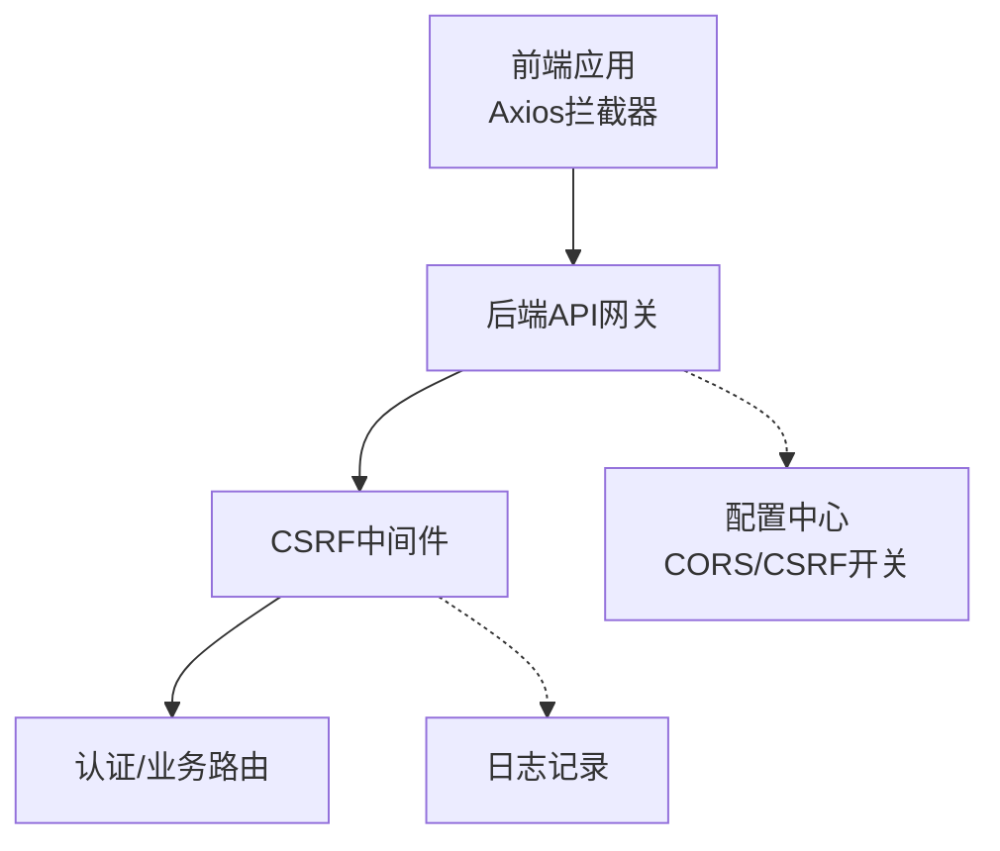
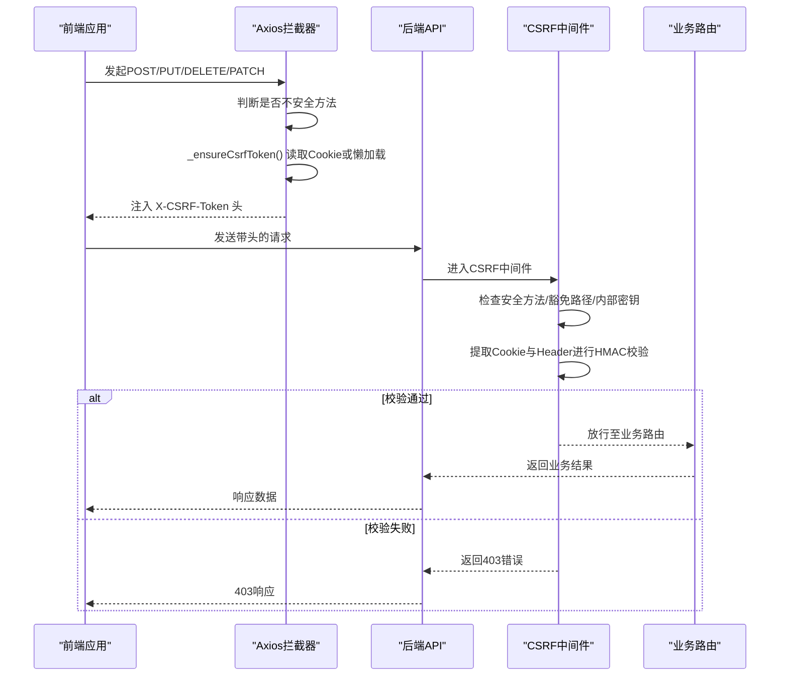
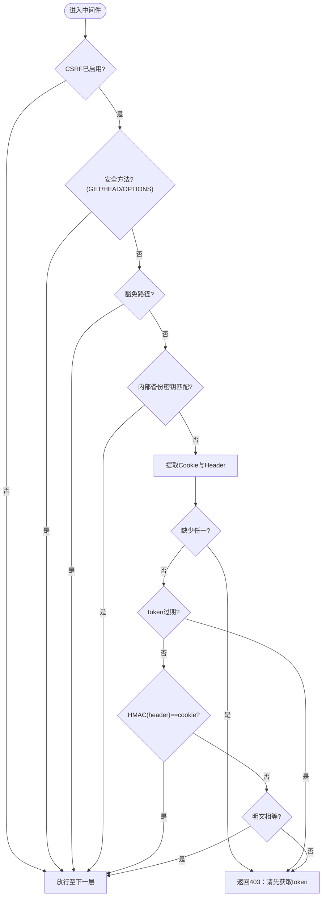
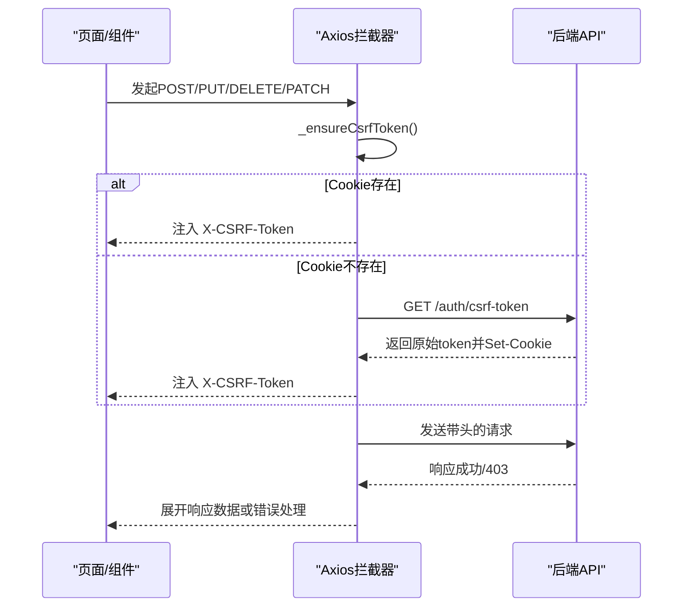
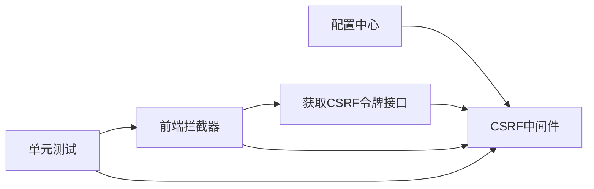

# CSRF攻击防护

<cite>
**本文引用的文件**
- [backend/app/middleware/csrf_middleware.py](file://backend/app/middleware/csrf_middleware.py)
- [backend/app/api/v1/auth/auth.py](file://backend/app/api/v1/auth/auth.py)
- [backend/app/core/config.py](file://backend/app/core/config.py)
- [frontend/src/api/request.ts](file://frontend/src/api/request.ts)
- [frontend/tests/unit/api/request-interceptors.test.ts](file://frontend/tests/unit/api/request-interceptors.test.ts)
- [backend/tests/unit/test_cov_final_csrf_middleware.py](file://backend/tests/unit/test_cov_final_csrf_middleware.py)
</cite>

## 目录
1. [简介](#简介)
2. [项目结构](#项目结构)
3. [核心组件](#核心组件)
4. [架构总览](#架构总览)
5. [详细组件分析](#详细组件分析)
6. [依赖关系分析](#依赖关系分析)
7. [性能考虑](#性能考虑)
8. [故障排查指南](#故障排查指南)
9. [结论](#结论)
10. [附录](#附录)

## 简介
本文件面向CSRF（跨站请求伪造）攻击防护，结合本项目实现，系统性说明：
- CSRF攻击原理与典型场景
- 后端CSRF中间件的实现机制：令牌生成、HMAC签名校验、同源策略与豁免路径、过期检测
- 前端集成方式：表单提交与AJAX请求的令牌传递、自动续期与重试
- 测试方法与防护配置最佳实践，包括不同HTTP方法的特殊处理

## 项目结构
本项目采用前后端分离架构，CSRF保护由后端中间件统一拦截，前端通过Axios拦截器自动注入令牌。关键位置如下：
- 后端中间件：CSRF校验、HMAC签名验证、豁免路径、过期检测、内部通道豁免
- 后端API：提供获取CSRF令牌的接口，设置Cookie并返回原始token
- 前端拦截器：对不安全方法自动注入X-CSRF-Token头，懒加载/缓存token，失败不阻断请求
- 配置中心：CORS允许头包含X-CSRF-Token，默认启用CSRF保护

图表来源
- [backend/app/middleware/csrf_middleware.py:177-284](file://backend/app/middleware/csrf_middleware.py#L177-L284)
- [backend/app/api/v1/auth/auth.py:692-747](file://backend/app/api/v1/auth/auth.py#L692-L747)
- [backend/app/core/config.py:140-155](file://backend/app/core/config.py#L140-L155)
- [frontend/src/api/request.ts:103-190](file://frontend/src/api/request.ts#L103-L190)

章节来源
- [backend/app/middleware/csrf_middleware.py:1-284](file://backend/app/middleware/csrf_middleware.py#L1-L284)
- [backend/app/api/v1/auth/auth.py:692-747](file://backend/app/api/v1/auth/auth.py#L692-L747)
- [backend/app/core/config.py:140-155](file://backend/app/core/config.py#L140-L155)
- [frontend/src/api/request.ts:103-190](file://frontend/src/api/request.ts#L103-L190)

## 核心组件
- CSRF中间件：基于Double Submit Cookie + HMAC签名的CSRF保护，支持安全方法放行、豁免路径、内部通道密钥豁免、过期检测与明文兼容回退
- 获取CSRF令牌接口：生成原始token与HMAC签名，设置Cookie并返回原始token供前端放入请求头
- 前端Axios拦截器：识别不安全方法，自动读取或懒加载CSRF token，注入X-CSRF-Token头；失败不阻断请求，交由响应侧处理
- 配置项：CORS允许携带凭证与自定义头，默认开启CSRF保护

章节来源
- [backend/app/middleware/csrf_middleware.py:1-284](file://backend/app/middleware/csrf_middleware.py#L1-L284)
- [backend/app/api/v1/auth/auth.py:692-747](file://backend/app/api/v1/auth/auth.py#L692-L747)
- [backend/app/core/config.py:140-155](file://backend/app/core/config.py#L140-L155)
- [frontend/src/api/request.ts:103-190](file://frontend/src/api/request.ts#L103-L190)

## 架构总览
下图展示一次状态变更请求从前端到后端的完整流程，包括CSRF令牌获取、注入与校验。

图表来源
- [frontend/src/api/request.ts:103-190](file://frontend/src/api/request.ts#L103-L190)
- [backend/app/middleware/csrf_middleware.py:177-284](file://backend/app/middleware/csrf_middleware.py#L177-L284)
- [backend/app/api/v1/auth/auth.py:692-747](file://backend/app/api/v1/auth/auth.py#L692-L747)

## 详细组件分析

### CSRF中间件（后端）
- 令牌生成：生成含时间戳与随机值的原始token，便于过期检测
- HMAC签名：使用配置的密钥对原始token进行HMAC-SHA256签名，签名值写入Cookie，原始token由前端放入请求头
- 校验流程：优先执行HMAC(header) == cookie比较；若失败则回退到明文比对（兼容旧版），均失败返回403
- 安全方法：GET/HEAD/OPTIONS直接放行
- 豁免路径：登录、注册、健康检查、文档等路径无需CSRF校验
- 内部通道豁免：Electron内部备份通道可通过专用头部密钥绕过CSRF
- 过期检测：解析token中的时间戳，超过CSRF_TOKEN_EXPIRY即拒绝
- 客户端IP：支持可信代理透传真实客户端IP，用于审计与限流

图表来源
- [backend/app/middleware/csrf_middleware.py:177-284](file://backend/app/middleware/csrf_middleware.py#L177-L284)

章节来源
- [backend/app/middleware/csrf_middleware.py:1-284](file://backend/app/middleware/csrf_middleware.py#L1-L284)
- [backend/tests/unit/test_cov_final_csrf_middleware.py:11-48](file://backend/tests/unit/test_cov_final_csrf_middleware.py#L11-L48)

### 获取CSRF令牌接口（后端）
- 速率限制：按客户端IP限制CSRF token获取频率，防止滥用
- 生成与签名：生成原始token与HMAC签名，将签名写入Cookie（可被JS读取），并在响应体中返回原始token
- 前端职责：从响应体取原始token，在后续状态变更请求的X-CSRF-Token头中携带

章节来源
- [backend/app/api/v1/auth/auth.py:692-747](file://backend/app/api/v1/auth/auth.py#L692-L747)

### 前端Axios拦截器（前端）
- 不安全方法识别：对POST/PUT/DELETE/PATCH注入CSRF头
- Token来源：优先从Cookie读取；若无则懒加载调用后端接口获取，避免重复并发请求
- 容错策略：获取失败不阻断请求，交由响应拦截器统一处理（如提示或重试）
- 测试环境：在测试模式下不自动获取token，避免影响单测

图表来源
- [frontend/src/api/request.ts:103-190](file://frontend/src/api/request.ts#L103-L190)

章节来源
- [frontend/src/api/request.ts:103-190](file://frontend/src/api/request.ts#L103-L190)
- [frontend/tests/unit/api/request-interceptors.test.ts:65-90](file://frontend/tests/unit/api/request-interceptors.test.ts#L65-L90)

### 配置与CORS
- CORS允许携带凭证与自定义头：Content-Type、Authorization、X-Requested-With、X-CSRF-Token
- CSRF默认启用：生产环境建议保持开启；如需调试临时关闭，可通过环境变量控制
- 密钥管理：CSRF_SECRET_KEY留空时自动生成并持久化，确保每台机器独立密钥

章节来源
- [backend/app/core/config.py:140-155](file://backend/app/core/config.py#L140-L155)

## 依赖关系分析
- 中间件依赖配置中心以读取CSRF开关与密钥
- 获取CSRF令牌接口依赖中间件的生成与签名函数
- 前端拦截器依赖后端提供的CSRF令牌接口与Cookie机制
- 测试用例覆盖内部通道豁免与拦截器行为

图表来源
- [backend/app/middleware/csrf_middleware.py:177-284](file://backend/app/middleware/csrf_middleware.py#L177-L284)
- [backend/app/api/v1/auth/auth.py:692-747](file://backend/app/api/v1/auth/auth.py#L692-L747)
- [frontend/src/api/request.ts:103-190](file://frontend/src/api/request.ts#L103-L190)
- [backend/tests/unit/test_cov_final_csrf_middleware.py:11-48](file://backend/tests/unit/test_cov_final_csrf_middleware.py#L11-L48)
- [frontend/tests/unit/api/request-interceptors.test.ts:65-90](file://frontend/tests/unit/api/request-interceptors.test.ts#L65-L90)

章节来源
- [backend/app/middleware/csrf_middleware.py:177-284](file://backend/app/middleware/csrf_middleware.py#L177-L284)
- [backend/app/api/v1/auth/auth.py:692-747](file://backend/app/api/v1/auth/auth.py#L692-L747)
- [frontend/src/api/request.ts:103-190](file://frontend/src/api/request.ts#L103-L190)
- [backend/tests/unit/test_cov_final_csrf_middleware.py:11-48](file://backend/tests/unit/test_cov_final_csrf_middleware.py#L11-L48)
- [frontend/tests/unit/api/request-interceptors.test.ts:65-90](file://frontend/tests/unit/api/request-interceptors.test.ts#L65-L90)

## 性能考虑
- 中间件仅在非安全方法且未豁免的路径执行校验，减少开销
- HMAC比较使用常量时间比较，避免时序攻击
- 前端懒加载token并缓存，避免重复网络请求
- 速率限制保护CSRF令牌接口，防止滥用

[本节为通用指导，不直接分析具体文件]

## 故障排查指南
- 403错误：检查是否缺少CSRF Cookie或X-CSRF-Token头；确认是否先调用获取token接口
- Token过期：重新获取token并刷新页面或重试请求
- 内部通道异常：确认内部备份密钥是否正确配置
- 前端未注入头：检查是否为不安全方法；测试环境下不会自动获取token
- 日志定位：查看中间件警告日志，包含方法、路径、IP等信息

章节来源
- [backend/app/middleware/csrf_middleware.py:211-284](file://backend/app/middleware/csrf_middleware.py#L211-L284)
- [frontend/src/api/request.ts:128-164](file://frontend/src/api/request.ts#L128-L164)

## 结论
本项目采用Double Submit Cookie + HMAC签名的CSRF防护方案，结合安全方法放行、豁免路径、内部通道密钥豁免与过期检测，形成完整的防护闭环。前端通过Axios拦截器自动注入令牌，降低集成成本并提升用户体验。建议在所有环境默认启用CSRF保护，严格配置CORS与密钥，并通过测试用例持续验证。

[本节为总结性内容，不直接分析具体文件]

## 附录

### CSRF攻击原理与场景
- 原理：攻击者诱导已认证用户访问恶意站点，利用浏览器自动携带Cookie的特性，向目标站点发起状态变更请求
- 场景：转账、修改密码、删除数据等敏感操作
- 防护要点：同源策略、CSRF令牌、HMAC签名、安全方法放行、豁免路径最小化

[本节为概念性内容，不直接分析具体文件]

### 前端集成要点
- 表单提交：确保表单所在页面已加载CSRF Cookie，或在提交前调用获取token接口
- AJAX请求：对POST/PUT/DELETE/PATCH自动注入X-CSRF-Token头；失败不阻断请求，交由响应侧处理
- 跨域：确保CORS允许携带凭证与X-CSRF-Token头

章节来源
- [frontend/src/api/request.ts:103-190](file://frontend/src/api/request.ts#L103-L190)
- [backend/app/core/config.py:140-155](file://backend/app/core/config.py#L140-L155)

### 测试方法与最佳实践
- 单元测试：覆盖内部通道豁免、拦截器行为、CSRF失败路径
- 集成测试：模拟CSRF攻击场景，验证403响应与日志记录
- 配置最佳实践：默认启用CSRF，严格CORS，定期轮换密钥，监控日志告警

章节来源
- [backend/tests/unit/test_cov_final_csrf_middleware.py:11-48](file://backend/tests/unit/test_cov_final_csrf_middleware.py#L11-L48)
- [frontend/tests/unit/api/request-interceptors.test.ts:65-90](file://frontend/tests/unit/api/request-interceptors.test.ts#L65-L90)