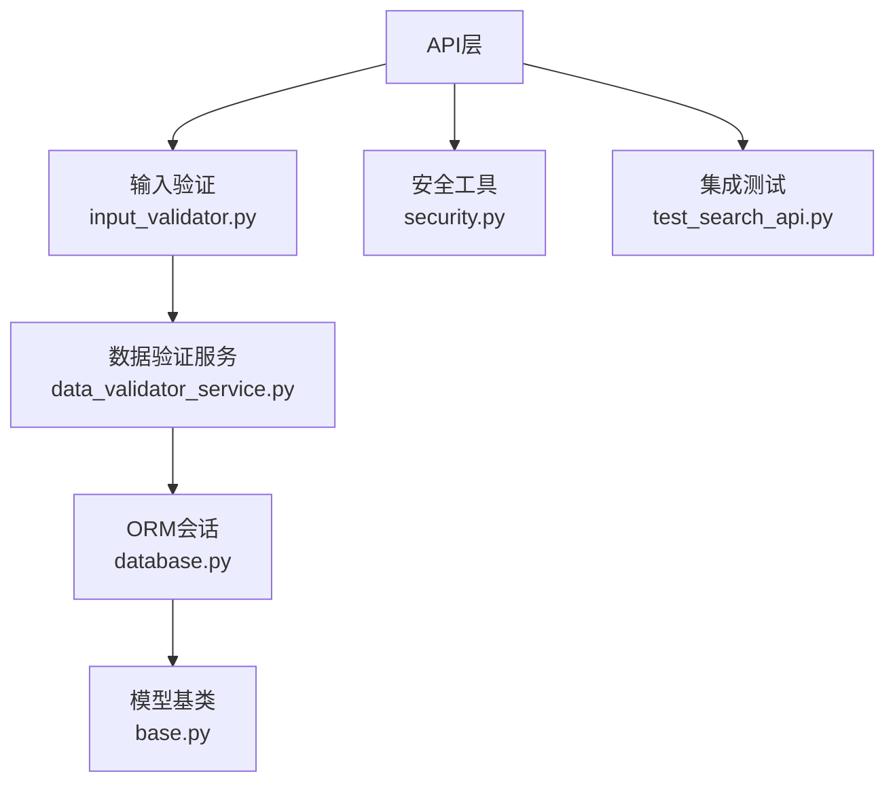
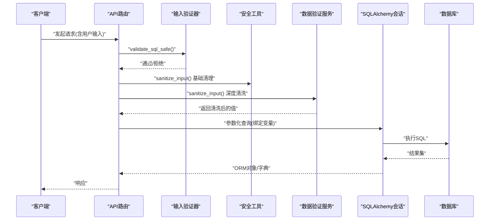
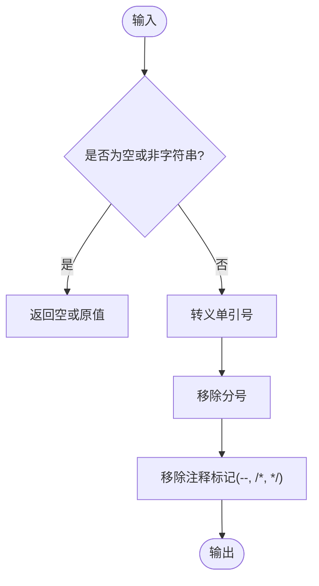
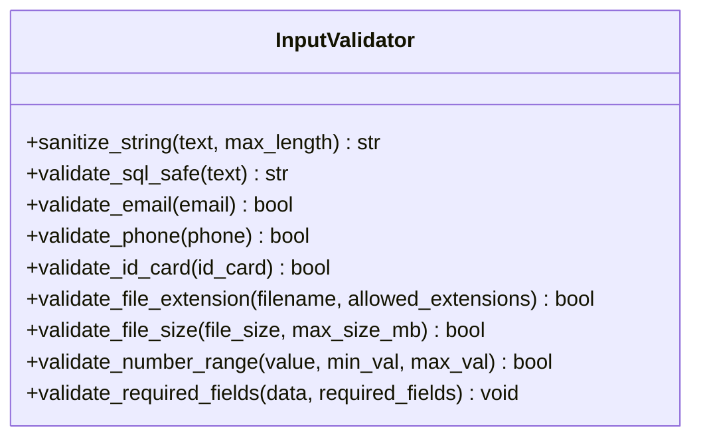
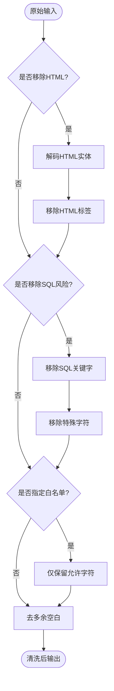
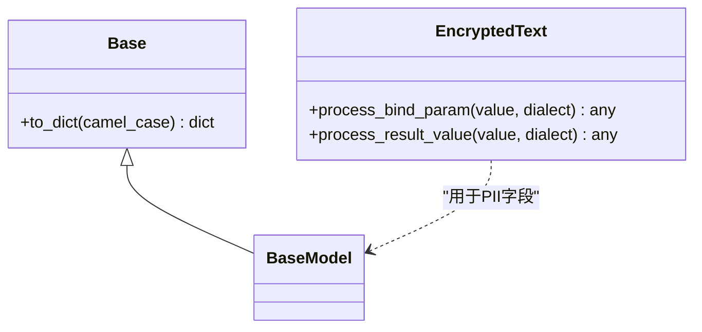
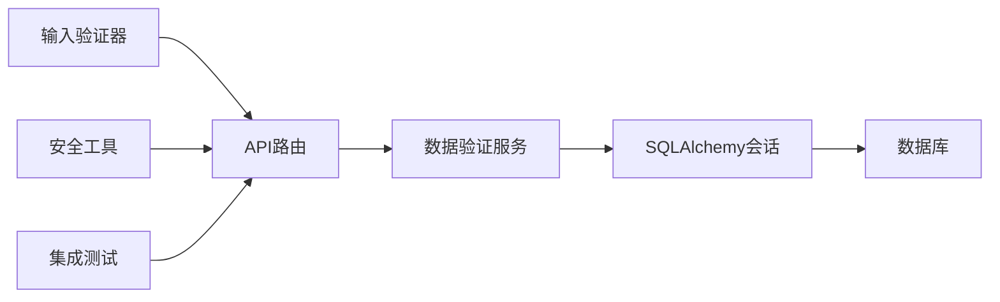

# SQL注入防护

<cite>
**本文引用的文件**
- [backend/app/core/security.py](file://backend/app/core/security.py)
- [backend/app/utils/input_validator.py](file://backend/app/utils/input_validator.py)
- [backend/app/services/data_validator_service.py](file://backend/app/services/data_validator_service.py)
- [backend/app/core/database.py](file://backend/app/core/database.py)
- [backend/app/models/base.py](file://backend/app/models/base.py)
- [backend/tests/integration/test_search_api.py](file://backend/tests/integration/test_search_api.py)
</cite>

## 目录
1. [简介](#简介)
2. [项目结构](#项目结构)
3. [核心组件](#核心组件)
4. [架构总览](#架构总览)
5. [详细组件分析](#详细组件分析)
6. [依赖关系分析](#依赖关系分析)
7. [性能考虑](#性能考虑)
8. [故障排查指南](#故障排查指南)
9. [结论](#结论)
10. [附录](#附录)

## 简介
本文件面向“乡村振兴系统”的后端安全实践，聚焦SQL注入防护。内容涵盖：
- SQL注入攻击原理与危害
- 项目中实现的检测与清理机制（正则模式匹配、输入清理）
- 参数化查询与ORM的安全特性
- 常见攻击模式与防御方法
- 结合代码路径的最佳实践与示例指引

## 项目结构
本项目在多个层级落实输入安全与数据库访问安全：
- 安全工具层：提供SQL注入模式定义与基础输入清理能力
- 服务层：提供更丰富的输入清洗与校验流程
- ORM/数据层：通过SQLAlchemy进行参数化查询，避免拼接SQL
- 测试层：对搜索等接口进行SQL注入/XSS防护的集成验证

**图表来源**
- [backend/app/utils/input_validator.py:12-71](file://backend/app/utils/input_validator.py#L12-L71)
- [backend/app/core/security.py:379-411](file://backend/app/core/security.py#L379-L411)
- [backend/app/services/data_validator_service.py:975-1051](file://backend/app/services/data_validator_service.py#L975-L1051)
- [backend/app/core/database.py:174-186](file://backend/app/core/database.py#L174-L186)
- [backend/app/models/base.py:19-45](file://backend/app/models/base.py#L19-L45)
- [backend/tests/integration/test_search_api.py:93-112](file://backend/tests/integration/test_search_api.py#L93-L112)

**章节来源**
- [backend/app/utils/input_validator.py:12-71](file://backend/app/utils/input_validator.py#L12-L71)
- [backend/app/core/security.py:379-411](file://backend/app/core/security.py#L379-L411)
- [backend/app/services/data_validator_service.py:975-1051](file://backend/app/services/data_validator_service.py#L975-L1051)
- [backend/app/core/database.py:174-186](file://backend/app/core/database.py#L174-L186)
- [backend/app/models/base.py:19-45](file://backend/app/models/base.py#L19-L45)
- [backend/tests/integration/test_search_api.py:93-112](file://backend/tests/integration/test_search_api.py#L93-L112)

## 核心组件
- 安全常量与基础清理：定义SQL注入检测的正则模式集合，并提供轻量级输入清理函数
- 输入验证器：提供XSS与SQL注入的模式匹配拦截，以及常用格式校验
- 数据验证服务：提供可配置的输入清洗（HTML移除、SQL关键字/特殊字符移除、白名单过滤）
- ORM与数据库：使用SQLAlchemy Session与参数化查询；模型层支持加密字段类型
- 集成测试：覆盖搜索接口的SQL注入与XSS防护断言

**章节来源**
- [backend/app/core/security.py:379-411](file://backend/app/core/security.py#L379-L411)
- [backend/app/utils/input_validator.py:12-71](file://backend/app/utils/input_validator.py#L12-L71)
- [backend/app/services/data_validator_service.py:975-1051](file://backend/app/services/data_validator_service.py#L975-L1051)
- [backend/app/core/database.py:174-186](file://backend/app/core/database.py#L174-L186)
- [backend/app/models/base.py:23-45](file://backend/app/models/base.py#L23-L45)
- [backend/tests/integration/test_search_api.py:93-112](file://backend/tests/integration/test_search_api.py#L93-L112)

## 架构总览
从请求到落库的关键安全链路如下：
- 请求进入后，先经输入验证器与安全工具进行模式匹配与基础清理
- 业务服务层调用数据验证服务进行更严格的清洗与白名单过滤
- 最终通过ORM（SQLAlchemy）以参数化方式执行查询，避免字符串拼接
- 模型层可选使用加密字段类型保护敏感数据

**图表来源**
- [backend/app/utils/input_validator.py:54-71](file://backend/app/utils/input_validator.py#L54-L71)
- [backend/app/core/security.py:394-411](file://backend/app/core/security.py#L394-L411)
- [backend/app/services/data_validator_service.py:975-1051](file://backend/app/services/data_validator_service.py#L975-L1051)
- [backend/app/core/database.py:174-186](file://backend/app/core/database.py#L174-L186)

## 详细组件分析

### 组件A：安全工具（security.py）
- SQL注入检测模式：集中维护一组正则表达式，覆盖UNION SELECT、DROP TABLE、ALTER TABLE、注释符等常见危险片段
- 输入清理函数：对单引号转义、移除分号与注释标记等，作为最外层的基础净化手段

**图表来源**
- [backend/app/core/security.py:379-411](file://backend/app/core/security.py#L379-L411)

**章节来源**
- [backend/app/core/security.py:379-411](file://backend/app/core/security.py#L379-L411)

### 组件B：输入验证器（input_validator.py）
- XSS与SQL注入模式匹配：对包含脚本标签、事件处理器、SQL关键字组合等进行拦截并返回错误
- 其他校验：邮箱、手机号、身份证号、文件扩展名/大小、数值范围、必填字段等

**图表来源**
- [backend/app/utils/input_validator.py:12-124](file://backend/app/utils/input_validator.py#L12-L124)

**章节来源**
- [backend/app/utils/input_validator.py:12-124](file://backend/app/utils/input_validator.py#L12-L124)

### 组件C：数据验证服务（data_validator_service.py）
- sanitize_input：可配置地移除HTML标签、SQL关键字与特殊字符，并按白名单保留字符
- validate_and_sanitize：组合清洗与长度校验，统一返回清洗后的值与验证结果

**图表来源**
- [backend/app/services/data_validator_service.py:975-1051](file://backend/app/services/data_validator_service.py#L975-L1051)

**章节来源**
- [backend/app/services/data_validator_service.py:975-1051](file://backend/app/services/data_validator_service.py#L975-L1051)

### 组件D：ORM与数据库（database.py, base.py）
- 参数化查询：通过SQLAlchemy Session执行查询，所有用户输入均作为绑定参数传入，从根本上避免SQL注入
- 加密字段：EncryptedText类型在写入时自动加密、读取时自动解密，降低敏感信息泄露风险

**图表来源**
- [backend/app/models/base.py:19-45](file://backend/app/models/base.py#L19-L45)
- [backend/app/models/base.py:157-185](file://backend/app/models/base.py#L157-L185)

**章节来源**
- [backend/app/core/database.py:174-186](file://backend/app/core/database.py#L174-L186)
- [backend/app/models/base.py:19-45](file://backend/app/models/base.py#L19-L45)

### 组件E：集成测试（test_search_api.py）
- 针对搜索接口进行SQL注入与XSS防护的断言，确保恶意输入不会导致异常行为或数据破坏

**章节来源**
- [backend/tests/integration/test_search_api.py:93-112](file://backend/tests/integration/test_search_api.py#L93-L112)

## 依赖关系分析
- 输入验证器与安全工具为上层API提供前置防护
- 数据验证服务在业务层进一步收敛输入风险
- ORM层负责安全的参数化执行，屏蔽底层SQL细节
- 测试用例保障关键路径的安全性

**图表来源**
- [backend/app/utils/input_validator.py:12-71](file://backend/app/utils/input_validator.py#L12-L71)
- [backend/app/core/security.py:379-411](file://backend/app/core/security.py#L379-L411)
- [backend/app/services/data_validator_service.py:975-1051](file://backend/app/services/data_validator_service.py#L975-L1051)
- [backend/app/core/database.py:174-186](file://backend/app/core/database.py#L174-L186)
- [backend/tests/integration/test_search_api.py:93-112](file://backend/tests/integration/test_search_api.py#L93-L112)

**章节来源**
- [backend/app/utils/input_validator.py:12-71](file://backend/app/utils/input_validator.py#L12-L71)
- [backend/app/core/security.py:379-411](file://backend/app/core/security.py#L379-L411)
- [backend/app/services/data_validator_service.py:975-1051](file://backend/app/services/data_validator_service.py#L975-L1051)
- [backend/app/core/database.py:174-186](file://backend/app/core/database.py#L174-L186)
- [backend/tests/integration/test_search_api.py:93-112](file://backend/tests/integration/test_search_api.py#L93-L112)

## 性能考虑
- 正则匹配与字符串替换开销较小，适合在请求入口快速失败
- 数据验证服务的多步清洗可能带来额外CPU消耗，建议仅在必要时启用严格模式
- 参数化查询由ORM与驱动层优化，通常具备良好性能
- 建议在高频接口中优先采用白名单校验与最小化清洗策略

[本节为通用指导，不直接分析具体文件]

## 故障排查指南
- 若接口频繁返回“检测到SQL注入风险”，检查输入验证器的模式是否过于严格，必要时放宽规则或增加白名单
- 若出现“无效或过期的令牌”等认证错误，确认JWT校验逻辑与黑名单机制正常
- 若数据库连接报错，检查SQLite PRAGMA设置与WAL模式是否正常初始化
- 若加密字段读写异常，确认密钥文件存在且权限正确，并验证SQLCipher驱动可用

**章节来源**
- [backend/app/utils/input_validator.py:54-71](file://backend/app/utils/input_validator.py#L54-L71)
- [backend/app/core/security.py:228-336](file://backend/app/core/security.py#L228-L336)
- [backend/app/core/database.py:78-157](file://backend/app/core/database.py#L78-L157)
- [backend/app/models/base.py:23-45](file://backend/app/models/base.py#L23-L45)

## 结论
本项目通过“模式匹配+输入清理+参数化查询”的多层防护体系有效抵御SQL注入：
- 安全工具与输入验证器在前置层快速识别并阻断高风险输入
- 数据验证服务提供可配置的深度清洗与白名单控制
- ORM与数据库层通过参数化查询与加密字段类型，从根源上消除注入面
- 集成测试持续验证关键路径的安全性

建议在实际开发中：
- 始终使用参数化查询，禁止字符串拼接SQL
- 对输入进行“白名单优先”的校验与清洗
- 对敏感字段使用加密类型存储
- 保持测试覆盖，尤其是边界与异常输入场景

[本节为总结性内容，不直接分析具体文件]

## 附录

### 常见SQL注入模式与对应防御
- UNION SELECT、SELECT/INSERT/UPDATE/DELETE/DROP/ALTER等关键字组合
  - 防御：正则模式匹配拦截；数据验证服务移除关键字；参数化查询
  - 参考路径：[backend/app/core/security.py:379-391](file://backend/app/core/security.py#L379-L391)、[backend/app/services/data_validator_service.py:1017-1030](file://backend/app/services/data_validator_service.py#L1017-L1030)
- 注释符与语句终止符（--、;、/* */）
  - 防御：基础清理移除；模式匹配拦截；参数化查询
  - 参考路径：[backend/app/core/security.py:394-411](file://backend/app/core/security.py#L394-L411)、[backend/app/utils/input_validator.py:24-29](file://backend/app/utils/input_validator.py#L24-L29)
- 布尔盲注（OR/AND 条件构造）
  - 防御：模式匹配拦截；白名单校验；参数化查询
  - 参考路径：[backend/app/utils/input_validator.py:24-29](file://backend/app/utils/input_validator.py#L24-L29)

### 参数化查询最佳实践
- 使用SQLAlchemy的Session执行查询，将用户输入作为绑定参数
- 避免在模板或字符串中拼接用户输入
- 对复杂查询使用命名参数，便于审计与维护
- 参考路径：[backend/app/core/database.py:174-186](file://backend/app/core/database.py#L174-L186)

### ORM安全特性
- 声明式模型与混入：统一时间戳、软删除、乐观锁等
- 加密字段类型：透明加解密，减少明文存储风险
- 参考路径：[backend/app/models/base.py:19-45](file://backend/app/models/base.py#L19-L45)、[backend/app/models/base.py:157-185](file://backend/app/models/base.py#L157-L185)

### 实际代码示例（路径指引）
- 输入验证与SQL注入拦截：[backend/app/utils/input_validator.py:54-71](file://backend/app/utils/input_validator.py#L54-L71)
- 基础输入清理：[backend/app/core/security.py:394-411](file://backend/app/core/security.py#L394-L411)
- 深度清洗与白名单：[backend/app/services/data_validator_service.py:975-1051](file://backend/app/services/data_validator_service.py#L975-L1051)
- 参数化查询入口：[backend/app/core/database.py:174-186](file://backend/app/core/database.py#L174-L186)
- 集成测试断言：[backend/tests/integration/test_search_api.py:93-112](file://backend/tests/integration/test_search_api.py#L93-L112)