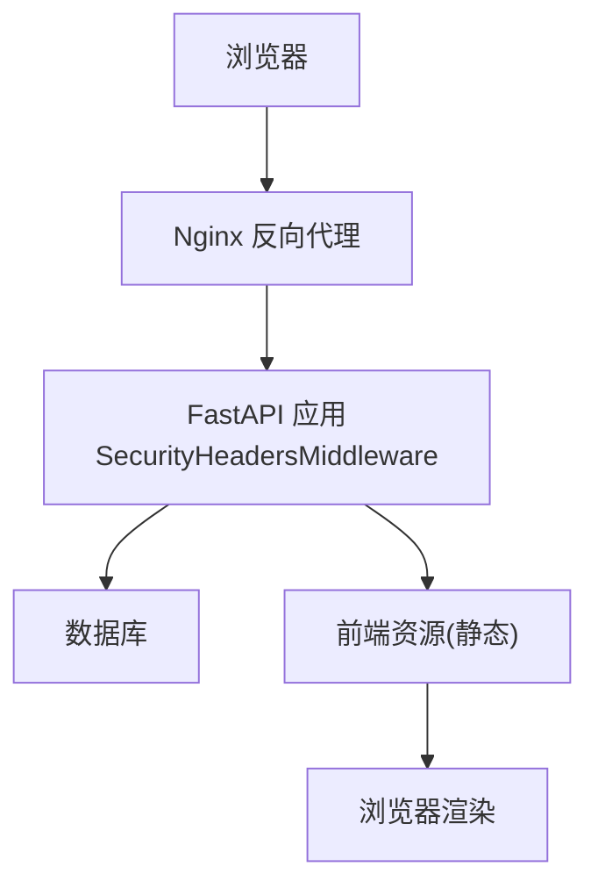
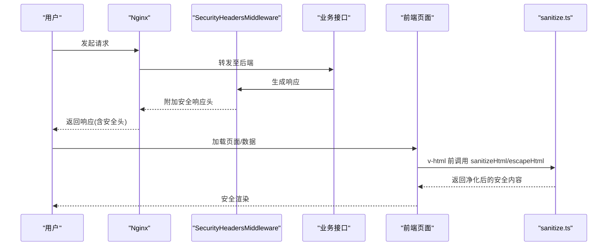
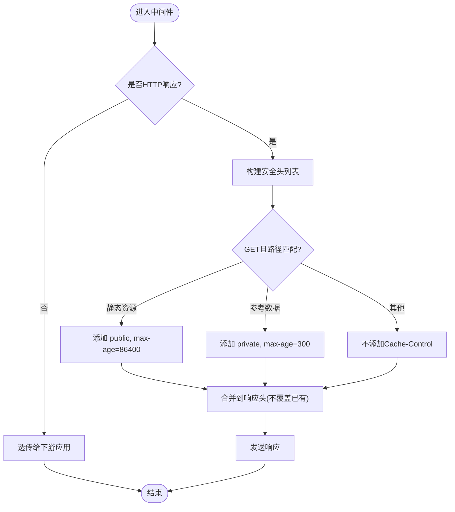
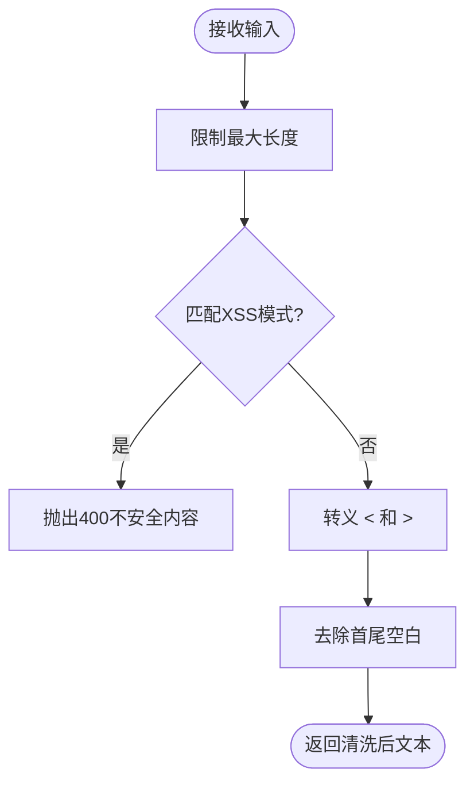
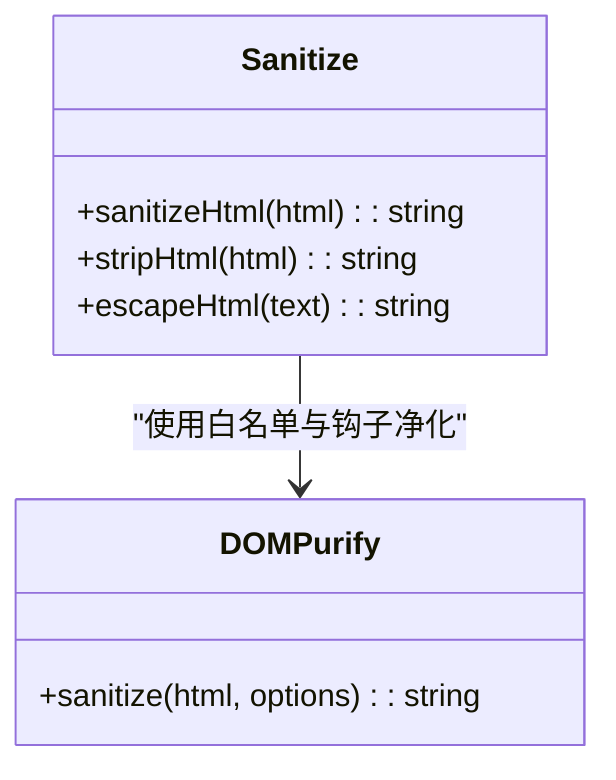
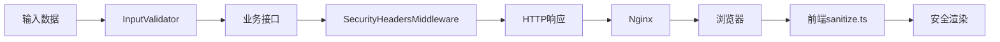

# XSS攻击防护

<cite>
**本文引用的文件**
- [backend/app/core/security.py](file://backend/app/core/security.py)
- [backend/app/utils/input_validator.py](file://backend/app/utils/input_validator.py)
- [frontend/src/utils/sanitize.ts](file://frontend/src/utils/sanitize.ts)
- [nginx/conf.d/assistance.conf](file://nginx/conf.d/assistance.conf)
- [backend/tests/unit/test_core_security.py](file://backend/tests/unit/test_core_security.py)
- [frontend/tests/unit/sanitize.test.ts](file://frontend/tests/unit/sanitize.test.ts)
- [frontend/tests/unit/utils/sanitize.test.ts](file://frontend/tests/unit/utils/sanitize.test.ts)
- [frontend/tests/unit/zzz-final-coverage.test.ts](file://frontend/tests/unit/zzz-final-coverage.test.ts)
</cite>

## 目录
1. [简介](#简介)
2. [项目结构](#项目结构)
3. [核心组件](#核心组件)
4. [架构总览](#架构总览)
5. [详细组件分析](#详细组件分析)
6. [依赖关系分析](#依赖关系分析)
7. [性能考虑](#性能考虑)
8. [故障排查指南](#故障排查指南)
9. [结论](#结论)
10. [附录](#附录)

## 简介
本文件围绕跨站脚本（XSS）攻击防护，系统梳理本项目在后端响应头、输入验证与前端输出编码方面的实现。内容涵盖：
- XSS 类型与危害概述（反射型、存储型、DOM 型）
- 后端 SecurityHeadersMiddleware 的安全响应头配置与作用
- 前端输入验证与输出编码机制（HTML 实体编码、JavaScript 转义、HTML 净化等）
- XSS 测试方法与防护措施落地指南

## 项目结构
本项目在前后端均实现了针对 XSS 的纵深防御：
- 后端通过中间件统一注入安全响应头，并在输入层进行危险模式检测与清理。
- 前端使用 DOMPurify 对富文本进行严格净化，并提供 HTML 实体转义与纯文本剥离工具。
- Nginx 作为反向代理，提供静态资源缓存策略与请求转发。

**图表来源**
- [nginx/conf.d/assistance.conf:1-49](file://nginx/conf.d/assistance.conf#L1-L49)
- [backend/app/core/security.py:598-636](file://backend/app/core/security.py#L598-L636)

**章节来源**
- [nginx/conf.d/assistance.conf:1-49](file://nginx/conf.d/assistance.conf#L1-L49)
- [backend/app/core/security.py:598-636](file://backend/app/core/security.py#L598-L636)

## 核心组件
- 后端安全中间件：为所有 HTTP 响应附加安全响应头，并基于路径与方法设置合适的缓存控制。
- 后端输入验证：对输入进行 XSS 模式检测、SQL 注入风险检测与基础清洗。
- 前端输出编码：提供 HTML 净化、HTML 标签剥离、HTML 实体转义三类能力，配合白名单与钩子强化安全性。
- 反向代理：对静态资源启用强缓存，减少重复传输与潜在篡改面。

**章节来源**
- [backend/app/core/security.py:598-702](file://backend/app/core/security.py#L598-L702)
- [backend/app/utils/input_validator.py:12-71](file://backend/app/utils/input_validator.py#L12-L71)
- [frontend/src/utils/sanitize.ts:10-133](file://frontend/src/utils/sanitize.ts#L10-L133)
- [nginx/conf.d/assistance.conf:42-47](file://nginx/conf.d/assistance.conf#L42-L47)

## 架构总览
下图展示了从请求到响应的关键安全节点：Nginx 转发、后端中间件注入安全头、业务处理、前端渲染前净化与转义。

**图表来源**
- [backend/app/core/security.py:609-636](file://backend/app/core/security.py#L609-L636)
- [frontend/src/utils/sanitize.ts:86-127](file://frontend/src/utils/sanitize.ts#L86-L127)

## 详细组件分析

### 后端安全响应头（SecurityHeadersMiddleware）
- 作用：为每个 HTTP 响应追加安全相关响应头，降低浏览器执行恶意脚本或错误解析的风险。
- 关键头字段：
  - X-Content-Type-Options: nosniff
  - X-Frame-Options: DENY
  - X-XSS-Protection: 1; mode=block
  - Referrer-Policy: strict-origin-when-cross-origin
  - Strict-Transport-Security、Content-Security-Policy、Permissions-Policy 等常量定义
- 缓存策略：根据路径与方法动态添加 Cache-Control，静态资源长缓存，敏感 API 短缓存或不缓存。

**图表来源**
- [backend/app/core/security.py:609-636](file://backend/app/core/security.py#L609-L636)

**章节来源**
- [backend/app/core/security.py:598-702](file://backend/app/core/security.py#L598-L702)
- [backend/tests/unit/test_core_security.py:110-223](file://backend/tests/unit/test_core_security.py#L110-L223)

### 后端输入验证（InputValidator）
- 功能：对字符串输入进行 XSS 模式检测、SQL 注入风险检测，并对尖括号进行转义；同时提供邮箱、手机号、身份证号、文件大小等校验。
- 行为要点：
  - 检测到 <script>、javascript:、事件处理器、iframe/object/embed 等模式时直接拒绝。
  - 将 < 和 > 替换为 HTML 实体，避免后续被当作标签解析。
  - 对 SQL 关键字与注释符号进行拦截。

**图表来源**
- [backend/app/utils/input_validator.py:31-52](file://backend/app/utils/input_validator.py#L31-L52)
- [backend/app/utils/input_validator.py:54-71](file://backend/app/utils/input_validator.py#L54-L71)

**章节来源**
- [backend/app/utils/input_validator.py:12-124](file://backend/app/utils/input_validator.py#L12-L124)
- [backend/tests/unit/test_input_validator_utils.py:6-67](file://backend/tests/unit/test_input_validator_utils.py#L6-L67)

### 前端输出编码（sanitize.ts）
- 功能：提供 HTML 净化、HTML 标签剥离、HTML 实体转义三个核心函数，用于 v-html 渲染前的安全处理。
- 关键点：
  - 使用 DOMPurify 并限定允许标签与属性白名单，关闭 data-* 属性。
  - 通过 afterSanitizeAttributes 钩子移除危险协议（javascript:/vbscript:/data:/file:），并为外部链接添加 rel="noopener noreferrer" 与 target="_blank"。
  - stripHtml 用于仅保留可见文本，避免 innerHTML 带来的 XSS 风险。
  - escapeHtml 对 & < > " ' 进行实体化，防止在文本上下文中被解析为标记。

**图表来源**
- [frontend/src/utils/sanitize.ts:10-133](file://frontend/src/utils/sanitize.ts#L10-L133)

**章节来源**
- [frontend/src/utils/sanitize.ts:10-133](file://frontend/src/utils/sanitize.ts#L10-L133)
- [frontend/tests/unit/sanitize.test.ts:109-127](file://frontend/tests/unit/sanitize.test.ts#L109-L127)
- [frontend/tests/unit/utils/sanitize.test.ts:151-188](file://frontend/tests/unit/utils/sanitize.test.ts#L151-L188)
- [frontend/tests/unit/zzz-final-coverage.test.ts:538-702](file://frontend/tests/unit/zzz-final-coverage.test.ts#L538-L702)

### 反向代理与缓存（Nginx）
- 作用：将请求转发至后端，并对静态资源启用长期缓存，提升性能并减少可被篡改的资源暴露面。
- 关键点：
  - 静态资源匹配规则启用 expires 与 immutable 缓存策略。
  - 统一设置 Host、X-Real-IP、X-Forwarded-For、X-Forwarded-Proto 等头部，便于后端识别真实来源。

**章节来源**
- [nginx/conf.d/assistance.conf:1-49](file://nginx/conf.d/assistance.conf#L1-L49)

## 依赖关系分析
- 中间件与安全头：SecurityHeadersMiddleware 依赖 FastAPI 的 ASGI 消息流，向 http.response.start 阶段注入响应头；SECURITY_HEADERS 常量集中管理默认安全头。
- 输入验证：InputValidator 依赖正则表达式进行模式匹配，并通过 FastAPI 异常返回错误。
- 前端净化：sanitize.ts 依赖 DOMPurify，通过白名单与钩子增强过滤效果。
- 反向代理：Nginx 与后端通过 HTTP 协议交互，静态资源由浏览器缓存。

**图表来源**
- [backend/app/utils/input_validator.py:12-71](file://backend/app/utils/input_validator.py#L12-L71)
- [backend/app/core/security.py:598-702](file://backend/app/core/security.py#L598-L702)
- [frontend/src/utils/sanitize.ts:86-133](file://frontend/src/utils/sanitize.ts#L86-L133)
- [nginx/conf.d/assistance.conf:10-47](file://nginx/conf.d/assistance.conf#L10-L47)

**章节来源**
- [backend/app/core/security.py:598-702](file://backend/app/core/security.py#L598-L702)
- [backend/app/utils/input_validator.py:12-71](file://backend/app/utils/input_validator.py#L12-L71)
- [frontend/src/utils/sanitize.ts:86-133](file://frontend/src/utils/sanitize.ts#L86-L133)
- [nginx/conf.d/assistance.conf:10-47](file://nginx/conf.d/assistance.conf#L10-L47)

## 性能考虑
- 安全头注入发生在响应起始阶段，开销极小，不影响主业务逻辑。
- 输入验证的正则匹配仅在必要时触发，建议结合业务场景控制输入长度与复杂度。
- 前端 DOMPurify 净化在渲染前执行，建议对大段富文本进行分页或懒加载，避免阻塞 UI。
- Nginx 静态资源缓存可减少带宽与服务器压力，提高首屏加载速度。

[本节为通用指导，无需特定文件引用]

## 故障排查指南
- 安全头未生效：检查中间件是否正确挂载，确认响应 start 阶段未被覆盖；可通过单元测试断言响应头存在性进行验证。
- 输入被误判：检查输入是否命中 XSS/SQL 注入模式，必要时放宽白名单或调整正则；注意长度限制与字符集。
- 前端净化失败：确认 sanitizeHtml 已调用且传入的是字符串；检查白名单是否过窄导致必要标签被移除；关注钩子中对 href/src 的危险协议拦截。
- 缓存问题：确认静态资源路径匹配规则与 Cache-Control 设置；POST 请求不应带缓存头。

**章节来源**
- [backend/tests/unit/test_core_security.py:110-223](file://backend/tests/unit/test_core_security.py#L110-L223)
- [backend/app/utils/input_validator.py:31-71](file://backend/app/utils/input_validator.py#L31-L71)
- [frontend/src/utils/sanitize.ts:64-96](file://frontend/src/utils/sanitize.ts#L64-L96)
- [nginx/conf.d/assistance.conf:42-47](file://nginx/conf.d/assistance.conf#L42-L47)

## 结论
本项目通过“后端安全头 + 输入验证 + 前端净化”的多层防护体系，有效降低 XSS 攻击面。建议在新增富文本展示与用户输入点时，遵循以下原则：
- 所有 v-html 渲染前必须经过 sanitizeHtml 或 stripHtml。
- 普通文本插入需使用 escapeHtml。
- 后端对所有写操作输入进行 XSS/SQL 注入模式检测与长度限制。
- 保持安全响应头始终生效，并根据环境调整 CSP 策略。

[本节为总结性内容，无需特定文件引用]

## 附录

### XSS 类型与危害（概念性说明）
- 反射型 XSS：恶意脚本通过 URL 参数等反射回客户端执行，常见于搜索框、重定向页。
- 存储型 XSS：恶意脚本持久化存储在服务器（如评论、公告），影响所有访问者。
- DOM 型 XSS：前端 JavaScript 动态拼接或处理不可信数据，导致 DOM 被注入执行。

[本节为概念性内容，无需特定文件引用]

### 安全措施清单（实施指南）
- 后端
  - 确保 SecurityHeadersMiddleware 已启用，并包含 X-Content-Type-Options、X-Frame-Options、X-XSS-Protection、Referrer-Policy 等。
  - 在输入入口统一调用 InputValidator.sanitize_string 与 validate_sql_safe。
  - 对敏感 API 设置合理的 Cache-Control，避免缓存用户态数据。
- 前端
  - 所有富文本渲染前调用 sanitizeHtml；纯文本使用 escapeHtml；需要去除标签时使用 stripHtml。
  - 保持 DOMPurify 白名单最小化，禁用 data-* 属性。
  - 外链统一添加 rel="noopener noreferrer" 与 target="_blank"。
- 反向代理
  - 静态资源启用强缓存；确保转发头正确传递真实来源信息。

**章节来源**
- [backend/app/core/security.py:598-702](file://backend/app/core/security.py#L598-L702)
- [backend/app/utils/input_validator.py:31-71](file://backend/app/utils/input_validator.py#L31-L71)
- [frontend/src/utils/sanitize.ts:64-133](file://frontend/src/utils/sanitize.ts#L64-L133)
- [nginx/conf.d/assistance.conf:42-47](file://nginx/conf.d/assistance.conf#L42-L47)

### XSS 测试方法（基于现有测试用例）
- 后端安全头验证：通过单元测试断言响应头包含 X-Content-Type-Options、X-Frame-Options 等，并验证不同路径与方法下的 Cache-Control 行为。
- 输入验证验证：构造包含 <script>、javascript:、onclick、iframe、object、embed 等模式的输入，预期应返回不安全内容错误或被转义。
- 前端净化验证：构造包含 script、事件属性、危险协议的 HTML，预期被移除或转义；外链应添加安全属性；纯文本剥离应仅保留可见文本。

**章节来源**
- [backend/tests/unit/test_core_security.py:110-223](file://backend/tests/unit/test_core_security.py#L110-L223)
- [backend/tests/unit/test_input_validator_utils.py:17-67](file://backend/tests/unit/test_input_validator_utils.py#L17-L67)
- [frontend/tests/unit/sanitize.test.ts:109-127](file://frontend/tests/unit/sanitize.test.ts#L109-L127)
- [frontend/tests/unit/utils/sanitize.test.ts:151-188](file://frontend/tests/unit/utils/sanitize.test.ts#L151-L188)
- [frontend/tests/unit/zzz-final-coverage.test.ts:538-702](file://frontend/tests/unit/zzz-final-coverage.test.ts#L538-L702)