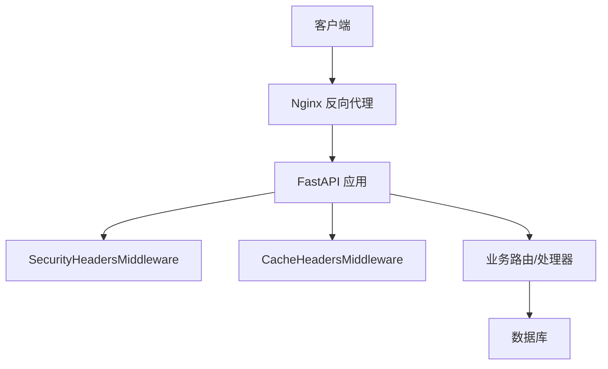
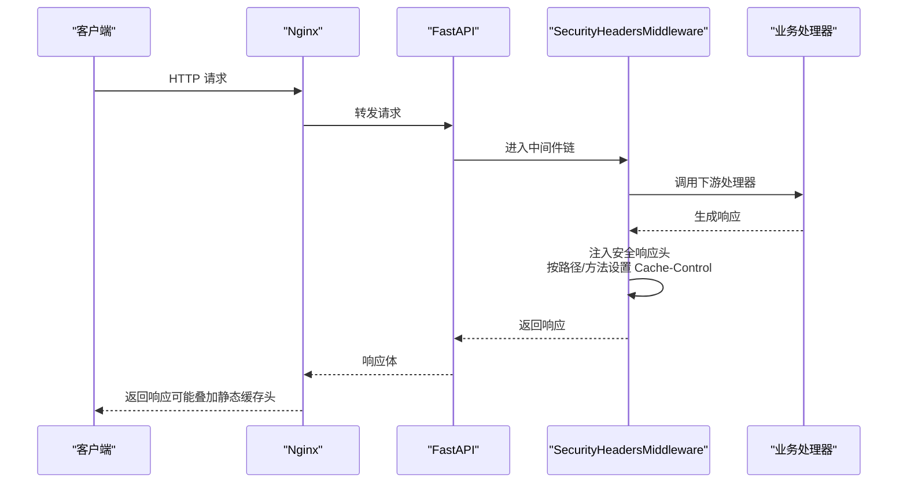
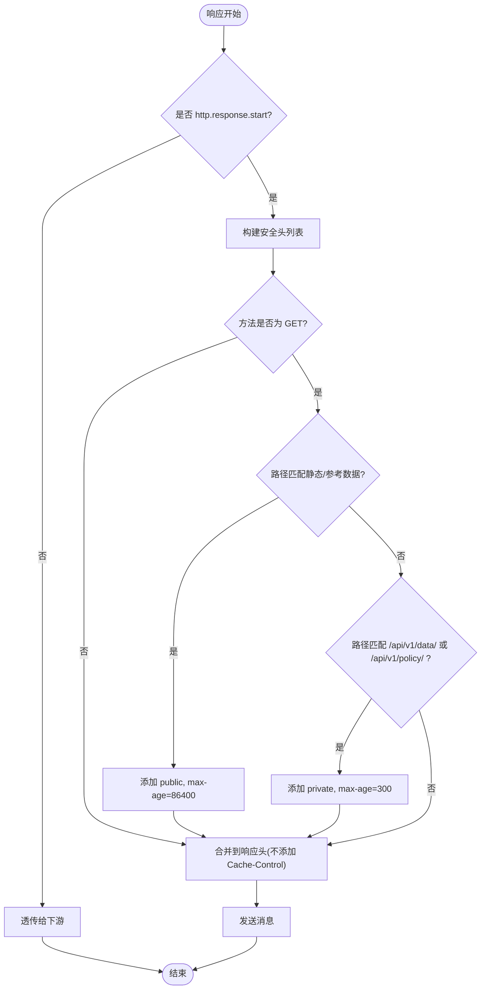
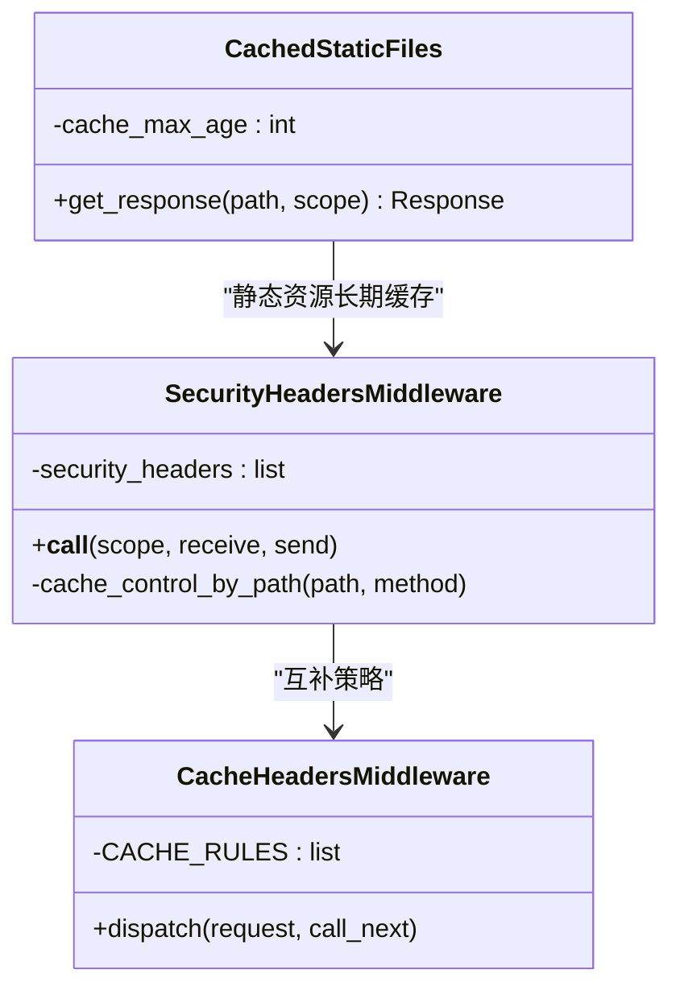
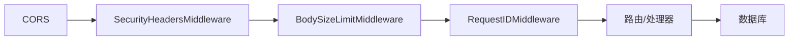

# 安全响应头

<cite>
**本文引用的文件**
- [backend/app/core/security.py](file://backend/app/core/security.py)
- [backend/app/middleware/cache_headers.py](file://backend/app/middleware/cache_headers.py)
- [backend/app/main.py](file://backend/app/main.py)
- [backend/tests/unit/test_core_security.py](file://backend/tests/unit/test_core_security.py)
- [nginx/conf.d/assistance.conf](file://nginx/conf.d/assistance.conf)
</cite>

## 目录
1. [简介](#简介)
2. [项目结构](#项目结构)
3. [核心组件](#核心组件)
4. [架构总览](#架构总览)
5. [详细组件分析](#详细组件分析)
6. [依赖关系分析](#依赖关系分析)
7. [性能考虑](#性能考虑)
8. [故障排查指南](#故障排查指南)
9. [结论](#结论)
10. [附录](#附录)

## 简介
本文件聚焦于后端应用中的“安全响应头”机制，系统性说明 SecurityHeadersMiddleware 所添加的安全相关响应头及其作用、配置方式与行为边界；解释 Content-Security-Policy（CSP）策略的默认设置与扩展点；区分静态资源与动态数据的缓存控制策略；并提供生产环境的最佳实践与浏览器兼容性注意事项。

## 项目结构
与安全响应头直接相关的代码主要位于以下位置：
- 中间件实现：backend/app/core/security.py（SecurityHeadersMiddleware）
- 辅助缓存头中间件：backend/app/middleware/cache_headers.py（CacheHeadersMiddleware）
- 应用注册：backend/app/main.py（中间件挂载顺序）
- 单元测试：backend/tests/unit/test_core_security.py（验证行为）
- 反向代理：nginx/conf.d/assistance.conf（静态资源长期缓存）

图表来源
- [backend/app/main.py:150-165](file://backend/app/main.py#L150-L165)
- [backend/app/core/security.py:598-636](file://backend/app/core/security.py#L598-L636)
- [backend/app/middleware/cache_headers.py:20-30](file://backend/app/middleware/cache_headers.py#L20-L30)
- [nginx/conf.d/assistance.conf:42-47](file://nginx/conf.d/assistance.conf#L42-L47)

章节来源
- [backend/app/main.py:150-165](file://backend/app/main.py#L150-L165)
- [backend/app/core/security.py:598-636](file://backend/app/core/security.py#L598-L636)
- [backend/app/middleware/cache_headers.py:1-30](file://backend/app/middleware/cache_headers.py#L1-L30)
- [nginx/conf.d/assistance.conf:42-47](file://nginx/conf.d/assistance.conf#L42-L47)

## 核心组件
- SecurityHeadersMiddleware：为所有 HTTP 响应统一注入安全响应头，并根据请求方法与路径智能附加 Cache-Control。
- CacheHeadersMiddleware：针对特定 API 前缀或静态资源路径追加细粒度的 Cache-Control 策略。
- 应用层静态服务：对带内容哈希的前端资源启用长期缓存与 immutable。
- Nginx：对常见静态资源类型提供长期缓存与不可变策略。

章节来源
- [backend/app/core/security.py:598-636](file://backend/app/core/security.py#L598-L636)
- [backend/app/middleware/cache_headers.py:1-30](file://backend/app/middleware/cache_headers.py#L1-L30)
- [backend/app/main.py:207-224](file://backend/app/main.py#L207-L224)
- [nginx/conf.d/assistance.conf:42-47](file://nginx/conf.d/assistance.conf#L42-L47)

## 架构总览
请求进入后，依次经过 CORS、安全响应头中间件、其他中间件与路由处理，最终返回响应。SecurityHeadersMiddleware 在响应起始阶段拦截并注入安全头，同时根据路径与方法决定是否添加 Cache-Control。Nginx 作为反向代理，对静态资源进一步施加长期缓存策略。

图表来源
- [backend/app/main.py:150-165](file://backend/app/main.py#L150-L165)
- [backend/app/core/security.py:609-636](file://backend/app/core/security.py#L609-L636)
- [nginx/conf.d/assistance.conf:42-47](file://nginx/conf.d/assistance.conf#L42-L47)

## 详细组件分析

### SecurityHeadersMiddleware：安全响应头与缓存控制
- 注入的安全响应头
  - X-Content-Type-Options: nosniff
  - X-Frame-Options: DENY
  - X-XSS-Protection: 1; mode=block
  - Referrer-Policy: strict-origin-when-cross-origin
- 条件性 Cache-Control
  - GET 且路径以 /static/、/assets/、/frontend/ 开头：public, max-age=86400
  - GET 且路径以 /api/v1/data/、/api/v1/policy/ 开头：private, max-age=300
  - 非 GET 或其他路径：不添加 Cache-Control
- 防覆盖策略：若下游已存在同名响应头，则不会覆盖。

图表来源
- [backend/app/core/security.py:609-636](file://backend/app/core/security.py#L609-L636)

章节来源
- [backend/app/core/security.py:598-636](file://backend/app/core/security.py#L598-L636)
- [backend/tests/unit/test_core_security.py:110-230](file://backend/tests/unit/test_core_security.py#L110-L230)

### CSP（Content-Security-Policy）策略
- 默认策略：default-src 'self'
- 说明：仅允许从同源加载资源，阻止跨域脚本、样式等资源的默认加载。
- 扩展建议（结合业务需求）：如需加载第三方脚本或样式，可逐步放宽 script-src、style-src、img-src、connect-src 等指令，但应遵循最小权限原则。
- 内联脚本控制：默认不允许内联脚本执行；如确需内联脚本，可使用 nonce 或 hash 白名单精确放行，避免使用 unsafe-inline。

章节来源
- [backend/app/core/security.py:693-702](file://backend/app/core/security.py#L693-L702)

### 缓存控制策略：静态资源 vs 动态数据
- 静态资源（前端构建产物）
  - 应用层：对 /assets、/images 等路径使用 CachedStaticFiles，设置 long-term cache + immutable（例如 1 年）。
  - Nginx：对常见静态资源类型（jpg/png/css/js/svg/woff 等）设置 expires 1y 与 Cache-Control: public, immutable。
- 参考数据与低变化 API
  - SecurityHeadersMiddleware：对 /api/v1/data/、/api/v1/policy/ 的 GET 请求设置 private, max-age=300。
  - CacheHeadersMiddleware：对筛选选项、组织树等路径设置 public, max-age=300。
- 变更数据
  - 非 GET 请求或不匹配的路径：不添加 Cache-Control，避免缓存写入操作结果。

图表来源
- [backend/app/core/security.py:598-636](file://backend/app/core/security.py#L598-L636)
- [backend/app/middleware/cache_headers.py:20-30](file://backend/app/middleware/cache_headers.py#L20-L30)
- [backend/app/main.py:207-224](file://backend/app/main.py#L207-L224)

章节来源
- [backend/app/core/security.py:609-636](file://backend/app/core/security.py#L609-L636)
- [backend/app/middleware/cache_headers.py:1-30](file://backend/app/middleware/cache_headers.py#L1-L30)
- [backend/app/main.py:207-224](file://backend/app/main.py#L207-L224)
- [nginx/conf.d/assistance.conf:42-47](file://nginx/conf.d/assistance.conf#L42-L47)

### 其他安全响应头
- Strict-Transport-Security：强制 HTTPS，包含子域名，有效期 1 年。
- Permissions-Policy：限制摄像头、麦克风、地理位置等敏感能力。
- 这些常量定义在安全模块中，便于集中管理与审计。

章节来源
- [backend/app/core/security.py:693-702](file://backend/app/core/security.py#L693-L702)

## 依赖关系分析
- 中间件注册顺序：CORS → SecurityHeadersMiddleware → BodySizeLimitMiddleware → RequestIDMiddleware → 路由。
- 静态资源路径：/assets、/images 使用 CachedStaticFiles；/static 用于模板等无哈希资源。
- Nginx 反向代理：对静态资源类型进行长期缓存，减少后端压力。

图表来源
- [backend/app/main.py:150-165](file://backend/app/main.py#L150-L165)

章节来源
- [backend/app/main.py:150-165](file://backend/app/main.py#L150-L165)

## 性能考虑
- 静态资源长期缓存与 immutable：显著降低重复请求与带宽消耗，提升首屏加载速度。
- 参考数据短缓存：对极少变化的字典数据设置短期缓存，平衡一致性与性能。
- 变更数据不缓存：确保写操作后的数据立即可见，避免脏读。
- Nginx 层压缩与缓存：gzip 与静态资源缓存进一步提升整体吞吐。

[本节为通用指导，无需具体文件引用]

## 故障排查指南
- 安全头未生效
  - 检查中间件是否已注册：确认 SecurityHeadersMiddleware 已在应用启动时添加。
  - 检查下游是否已设置同名响应头：中间件不会覆盖已有头部。
- 缓存不符合预期
  - 确认请求方法与路径匹配规则：仅 GET 且匹配特定前缀才会添加 Cache-Control。
  - 检查 Nginx 层是否覆盖了响应头：静态资源类型可能被 Nginx 设置长期缓存。
- CSP 导致资源加载失败
  - 检查 default-src 与具体指令是否限制了必要资源；按需放宽并优先使用 nonce/hash。

章节来源
- [backend/app/core/security.py:609-636](file://backend/app/core/security.py#L609-L636)
- [backend/tests/unit/test_core_security.py:110-230](file://backend/tests/unit/test_core_security.py#L110-L230)
- [nginx/conf.d/assistance.conf:42-47](file://nginx/conf.d/assistance.conf#L42-L47)

## 结论
本项目通过 SecurityHeadersMiddleware 统一注入关键安全响应头，并结合路径与方法实施精细化的缓存控制；配合应用层与 Nginx 层的静态资源长期缓存策略，兼顾安全性与性能。CSP 默认采用严格模式，可按业务需要逐步放宽。建议在生产环境保持当前安全头策略，并对 CSP 进行持续评估与优化。

[本节为总结性内容，无需具体文件引用]

## 附录

### 安全响应头清单与作用
- X-Content-Type-Options: nosniff — 禁止 MIME 嗅探，防止错误解析。
- X-Frame-Options: DENY — 禁止页面被嵌入 iframe。
- X-XSS-Protection: 1; mode=block — 启用浏览器 XSS 过滤并阻断渲染。
- Referrer-Policy: strict-origin-when-cross-origin — 跨站时仅发送源信息。
- Strict-Transport-Security: max-age=31536000; includeSubDomains — 强制 HTTPS。
- Permissions-Policy: camera=(), microphone=(), geolocation() — 限制敏感设备访问。
- Content-Security-Policy: default-src 'self' — 默认仅允许同源资源。

章节来源
- [backend/app/core/security.py:609-636](file://backend/app/core/security.py#L609-L636)
- [backend/app/core/security.py:693-702](file://backend/app/core/security.py#L693-L702)

### 缓存策略对照表
- 静态资源（/assets、/images）：public, max-age=31536000, immutable（应用层）；expires 1y + Cache-Control: public, immutable（Nginx）。
- 静态资源（/static）：由 SecurityHeadersMiddleware 设置 public, max-age=86400（GET）。
- 参考数据 API（/api/v1/data/、/api/v1/policy/）：private, max-age=300（GET）。
- 筛选选项/组织树：public, max-age=300（GET）。
- 变更数据：不设置 Cache-Control。

章节来源
- [backend/app/core/security.py:609-636](file://backend/app/core/security.py#L609-L636)
- [backend/app/middleware/cache_headers.py:10-17](file://backend/app/middleware/cache_headers.py#L10-L17)
- [backend/app/main.py:207-224](file://backend/app/main.py#L207-L224)
- [nginx/conf.d/assistance.conf:42-47](file://nginx/conf.d/assistance.conf#L42-L47)

### 生产环境推荐配置
- 保持现有安全响应头不变，确保所有响应均携带基础安全头。
- 在生产启用 HSTS 与 CSP，并基于监控与日志逐步收紧 CSP 指令。
- 对静态资源使用带内容哈希的文件名，配合长期缓存与 immutable。
- 对频繁变更的 API 避免缓存；对参考数据使用短期缓存。
- 在反向代理层开启 gzip 与静态资源缓存，减轻后端压力。

[本节为通用指导，无需具体文件引用]