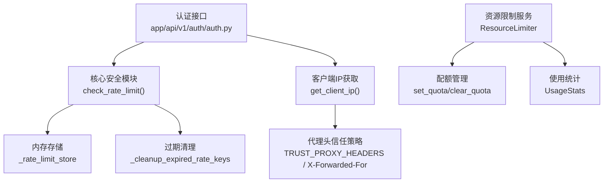
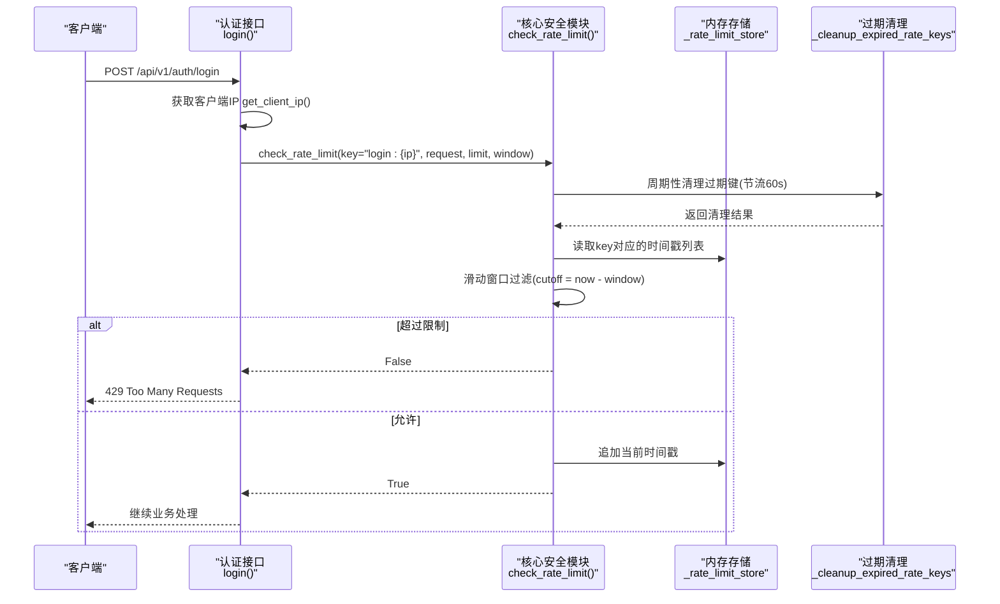
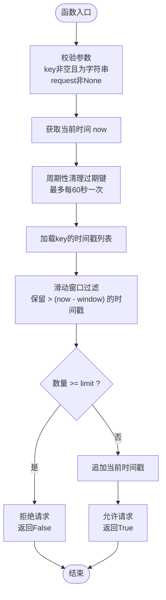
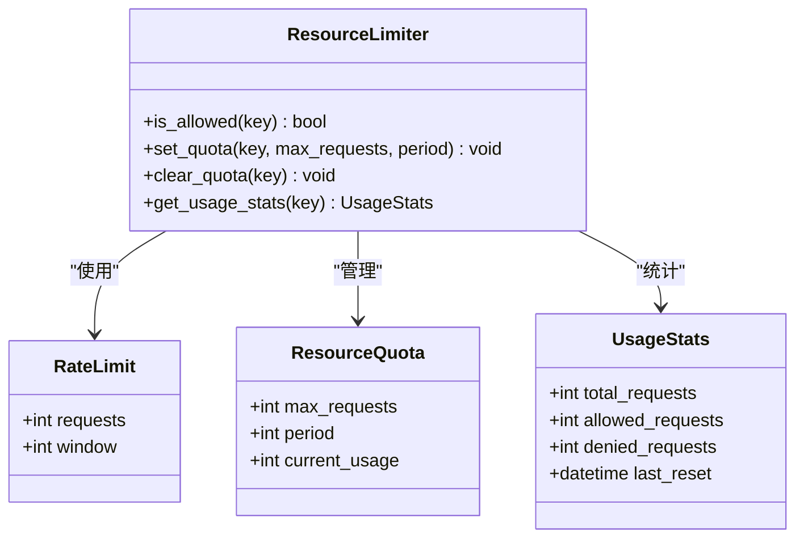
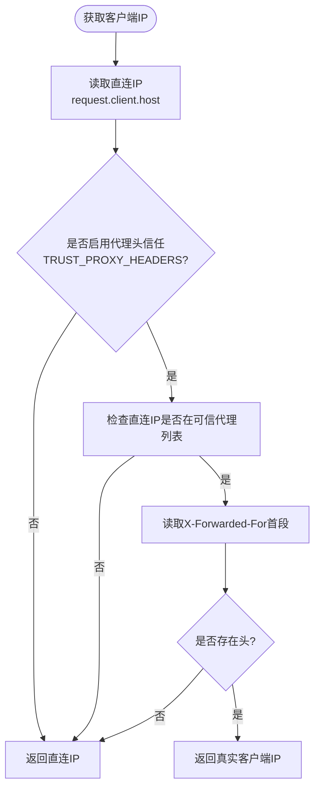
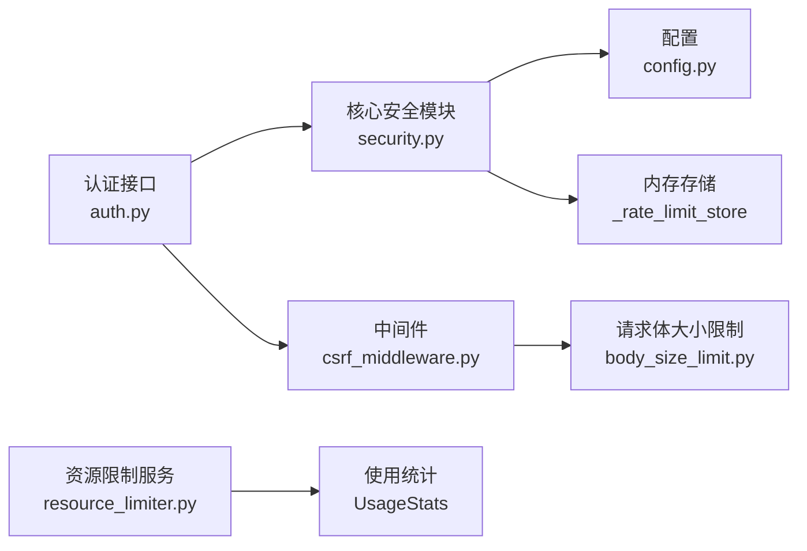

# 请求频率限制

<cite>
**本文引用的文件**
- [security.py](file://backend/app/core/security.py)
- [resource_limiter.py](file://backend/app/services/resource_limiter.py)
- [csrf_middleware.py](file://backend/app/middleware/csrf_middleware.py)
- [auth.py](file://backend/app/api/v1/auth/auth.py)
- [config.py](file://backend/app/core/config.py)
- [body_size_limit.py](file://backend/app/middleware/body_size_limit.py)
- [monitoring_service.py](file://backend/app/services/monitoring_service.py)
</cite>

## 目录
1. [简介](#简介)
2. [项目结构](#项目结构)
3. [核心组件](#核心组件)
4. [架构总览](#架构总览)
5. [详细组件分析](#详细组件分析)
6. [依赖关系分析](#依赖关系分析)
7. [性能考虑](#性能考虑)
8. [故障排查指南](#故障排查指南)
9. [结论](#结论)
10. [附录](#附录)

## 简介
本文件围绕“请求频率限制”能力，系统化说明 check_rate_limit 的实现原理、内存存储与过期清理策略、配置项（limit/window/key）的语义与用法、IP 地址获取与代理头信任策略、本地请求判断，以及在不同场景下的限流配置建议。同时给出性能优化与监控告警的实施方法，帮助在生产环境中稳定、安全地落地速率限制。

## 项目结构
本项目在后端实现了两套速率限制实现：
- 核心安全模块中的内存滑动窗口限流器（用于登录等关键接口）
- 资源限制服务模块中的通用限流器（提供配额管理与统计）

此外，中间件提供了客户端 IP 获取与代理头信任策略，认证接口在登录、注册、刷新令牌等路径上应用了不同的限流参数。

**图表来源**
- [security.py:414-488](file://backend/app/core/security.py#L414-L488)
- [csrf_middleware.py:135-174](file://backend/app/middleware/csrf_middleware.py#L135-L174)
- [resource_limiter.py:41-171](file://backend/app/services/resource_limiter.py#L41-L171)
- [auth.py:120-137](file://backend/app/api/v1/auth/auth.py#L120-L137)

**章节来源**
- [security.py:414-488](file://backend/app/core/security.py#L414-L488)
- [csrf_middleware.py:135-174](file://backend/app/middleware/csrf_middleware.py#L135-L174)
- [resource_limiter.py:41-171](file://backend/app/services/resource_limiter.py#L41-L171)
- [auth.py:120-137](file://backend/app/api/v1/auth/auth.py#L120-L137)

## 核心组件
- 核心安全模块中的 check_rate_limit：基于内存列表记录时间戳，采用滑动窗口算法进行限流；具备周期性清理过期键的机制，防止内存泄漏。
- 资源限制服务 ResourceLimiter：提供按 key 的配额设置、请求计数、使用统计与清理能力，适合更通用的限流场景。
- 客户端 IP 获取 get_client_ip：默认不信任代理头，仅在 TRUST_PROXY_HEADERS=True 时读取 X-Forwarded-For/X-Real-IP；支持 CIDR 可信代理匹配。
- 认证接口 auth.py：对登录、注册、刷新令牌等敏感操作分别设置了不同的 limit 和 window 参数，结合 IP 作为 key。

**章节来源**
- [security.py:414-488](file://backend/app/core/security.py#L414-L488)
- [resource_limiter.py:41-171](file://backend/app/services/resource_limiter.py#L41-L171)
- [csrf_middleware.py:135-174](file://backend/app/middleware/csrf_middleware.py#L135-L174)
- [auth.py:30-53](file://backend/app/api/v1/auth/auth.py#L30-L53)

## 架构总览
下图展示了从请求进入认证接口到触发速率限制的完整流程，包括 IP 识别、滑动窗口检查与过期清理。

**图表来源**
- [auth.py:120-137](file://backend/app/api/v1/auth/auth.py#L120-L137)
- [security.py:414-488](file://backend/app/core/security.py#L414-L488)
- [csrf_middleware.py:135-174](file://backend/app/middleware/csrf_middleware.py#L135-L174)

## 详细组件分析

### check_rate_limit 实现原理
- 滑动窗口算法：维护每个 key 的时间戳列表，每次请求计算 cutoff = now - window，仅保留窗口内的时间戳；若窗口内数量达到 limit，则拒绝请求。
- 内存存储机制：使用全局字典 _rate_limit_store 存储 key -> list[float]，线程安全通过 _rate_limit_lock 保证并发访问安全。
- 过期键清理策略：_cleanup_expired_rate_keys 每 60 秒执行一次全局清理，移除空列表或全部时间戳已过期的键，避免内存泄漏。
- 安全约定：要求传入非空的字符串 key 与有效的 FastAPI Request，缺失将抛出 ValueError，确保不会静默放行。

**图表来源**
- [security.py:414-488](file://backend/app/core/security.py#L414-L488)

**章节来源**
- [security.py:414-488](file://backend/app/core/security.py#L414-L488)

### 资源限制服务 ResourceLimiter
- 数据结构：RateLimit（requests/window）、ResourceQuota（max_requests/period/current_usage）、UsageStats（total/allowed/denied/last_reset）。
- 功能：set_quota 设置配额并同步 RateLimit；is_allowed 实现滑动窗口检查；clear_quota 清理配额与统计；get_usage_stats 获取使用统计。
- 适用场景：适用于需要配额管理与统计的通用限流需求，可与核心安全模块互补。

**图表来源**
- [resource_limiter.py:14-171](file://backend/app/services/resource_limiter.py#L14-L171)

**章节来源**
- [resource_limiter.py:14-171](file://backend/app/services/resource_limiter.py#L14-L171)

### 客户端 IP 获取与代理头信任策略
- 默认行为：直接返回 TCP 对端地址 request.client.host，不信任 X-Forwarded-For/X-Real-IP，防止伪造绕过限流。
- 可信代理模式：当 TRUST_PROXY_HEADERS=True 时，优先读取 X-Forwarded-For 首段，否则回退到 X-Real-IP，再否则返回直连 IP。
- 中间件增强：CSRF 中间件的 get_client_ip 支持 TRUSTED_PROXIES 列表（含 CIDR），仅当直连 IP 属于可信代理时才透传真实客户端 IP。

**图表来源**
- [security.py:491-510](file://backend/app/core/security.py#L491-L510)
- [csrf_middleware.py:135-174](file://backend/app/middleware/csrf_middleware.py#L135-L174)
- [config.py:109-112](file://backend/app/core/config.py#L109-L112)

**章节来源**
- [security.py:491-510](file://backend/app/core/security.py#L491-L510)
- [csrf_middleware.py:135-174](file://backend/app/middleware/csrf_middleware.py#L135-L174)
- [config.py:109-112](file://backend/app/core/config.py#L109-L112)

### 不同场景下的限流配置建议
- 登录接口：同一 IP 每分钟最多 5 次尝试（limit=5, window=60），防止暴力破解。
- 注册接口：同一 IP 每分钟最多 3 次尝试（limit=3, window=60），控制批量注册。
- Token 刷新：同一 IP 每分钟最多 10 次（limit=10, window=60），防止令牌滥用。
- API 调用：可基于用户 ID 或 API Key 作为 key，设置合理 limit/window，例如每分钟 100 次。
- 文件上传：结合 body_size_limit 中间件限制请求体大小，并对上传接口单独设置较低 limit（如每分钟 5 次），防止大文件攻击。

**章节来源**
- [auth.py:30-53](file://backend/app/api/v1/auth/auth.py#L30-L53)
- [auth.py:120-137](file://backend/app/api/v1/auth/auth.py#L120-L137)
- [body_size_limit.py:1-45](file://backend/app/middleware/body_size_limit.py#L1-L45)

## 依赖关系分析
- 认证接口依赖核心安全模块的 check_rate_limit 与 get_client_ip。
- 核心安全模块依赖配置 TRUST_PROXY_HEADERS 与全局内存存储。
- 资源限制服务提供独立的限流能力，可用于其他业务模块。
- 中间件提供请求体大小限制与 CSRF 保护，与限流协同工作。

**图表来源**
- [auth.py:120-137](file://backend/app/api/v1/auth/auth.py#L120-L137)
- [security.py:414-488](file://backend/app/core/security.py#L414-L488)
- [resource_limiter.py:41-171](file://backend/app/services/resource_limiter.py#L41-L171)
- [body_size_limit.py:1-45](file://backend/app/middleware/body_size_limit.py#L1-L45)

**章节来源**
- [auth.py:120-137](file://backend/app/api/v1/auth/auth.py#L120-L137)
- [security.py:414-488](file://backend/app/core/security.py#L414-L488)
- [resource_limiter.py:41-171](file://backend/app/services/resource_limiter.py#L41-L171)
- [body_size_limit.py:1-45](file://backend/app/middleware/body_size_limit.py#L1-L45)

## 性能考虑
- 滑动窗口复杂度：每次请求需过滤时间戳列表，时间复杂度 O(n)，n 为窗口内请求数；可通过合理设置 window 与 limit 控制 n。
- 内存占用：每个 key 维护时间戳列表，需定期清理过期键以避免内存增长。
- 清理节流：全局清理最多每 60 秒执行一次，降低清理开销。
- 并发安全：使用线程锁保护共享状态，避免竞态条件。
- 监控指标：可结合 MonitoringService 记录响应时间与错误率，辅助评估限流效果。

**章节来源**
- [security.py:414-488](file://backend/app/core/security.py#L414-L488)
- [monitoring_service.py:194-260](file://backend/app/services/monitoring_service.py#L194-L260)

## 故障排查指南
- 429 错误：检查是否触发速率限制，确认 key、limit、window 配置是否正确。
- 代理头问题：若部署在反向代理后，需启用 TRUST_PROXY_HEADERS 并正确配置可信代理列表。
- 内存泄漏：观察 _rate_limit_store 增长情况，确认清理逻辑是否生效。
- 并发异常：检查线程锁使用是否正确，避免死锁或竞争条件。
- 监控告警：利用 MonitoringService 配置响应时间与错误率阈值，及时发现问题。

**章节来源**
- [security.py:414-488](file://backend/app/core/security.py#L414-L488)
- [config.py:109-112](file://backend/app/core/config.py#L109-L112)
- [monitoring_service.py:194-260](file://backend/app/services/monitoring_service.py#L194-L260)

## 结论
本项目通过核心安全模块与资源限制服务实现了灵活、安全的请求频率限制。滑动窗口算法与内存存储机制在保证性能的同时，配合过期清理策略有效防止内存泄漏。客户端 IP 获取与代理头信任策略确保了限流的准确性与安全性。针对不同场景的限流配置建议有助于平衡用户体验与安全防御。结合监控告警与性能优化措施，可在生产环境中稳定运行。

## 附录
- 配置项参考：
  - TRUST_PROXY_HEADERS：控制是否信任代理头，默认关闭。
  - RATE_LIMIT_ENABLED/RATE_LIMIT_PER_MINUTE/RATE_LIMIT_PER_HOUR：全局速率限制开关与阈值。
- 中间件参考：
  - body_size_limit：限制非文件上传请求体大小，防止恶意大请求。
- 监控参考：
  - MonitoringService：支持响应时间、错误率、资源使用率等告警规则。

**章节来源**
- [config.py:109-112](file://backend/app/core/config.py#L109-L112)
- [config.py:156-159](file://backend/app/core/config.py#L156-L159)
- [body_size_limit.py:1-45](file://backend/app/middleware/body_size_limit.py#L1-L45)
- [monitoring_service.py:194-260](file://backend/app/services/monitoring_service.py#L194-L260)