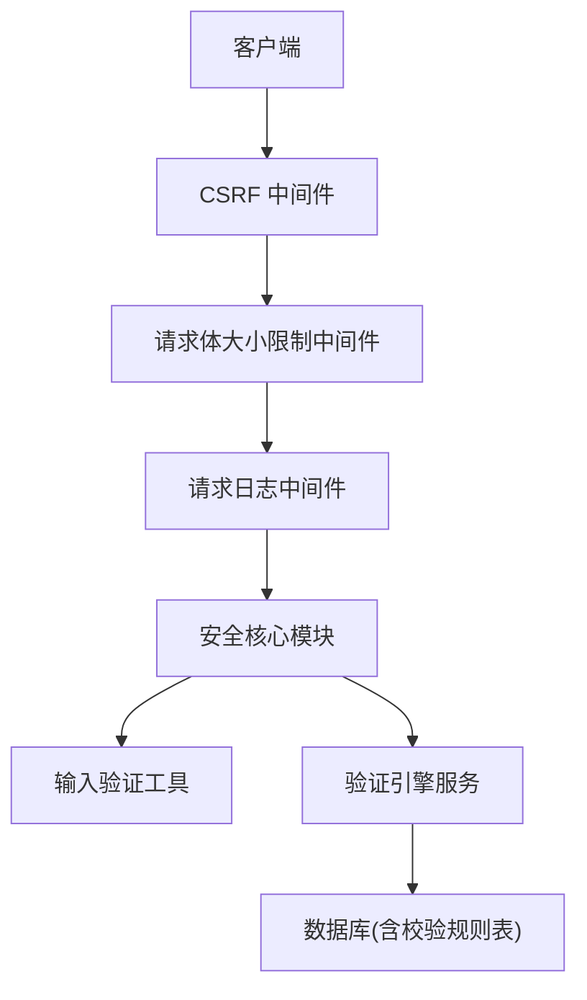
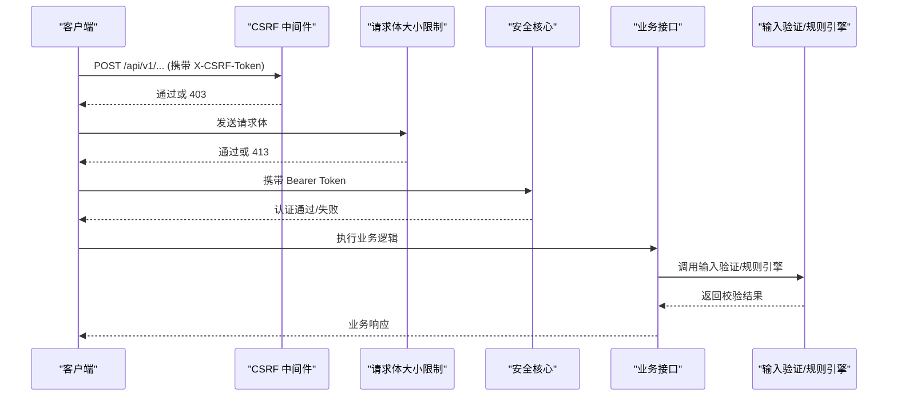
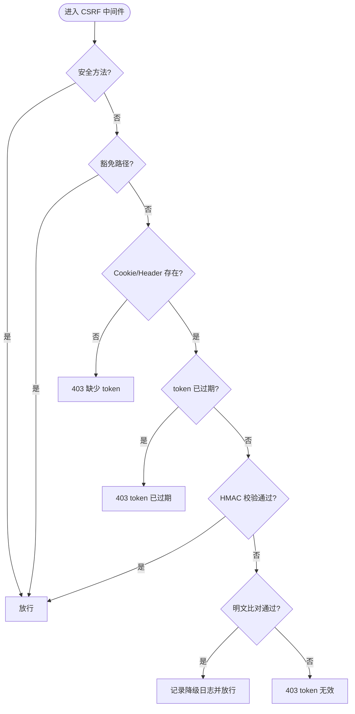
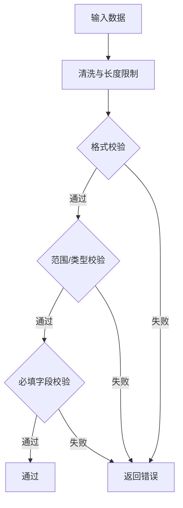
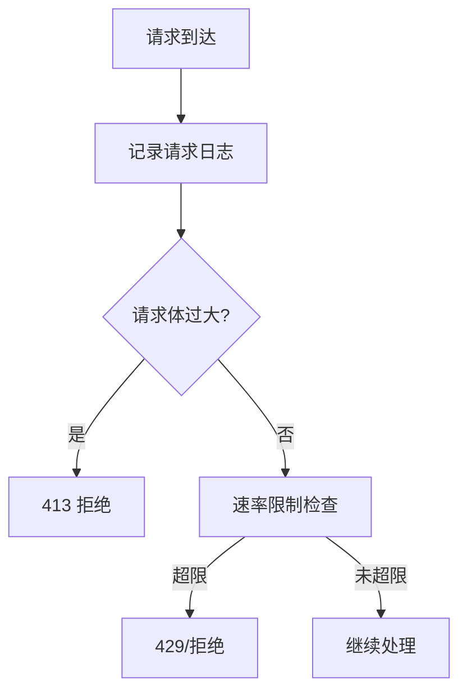
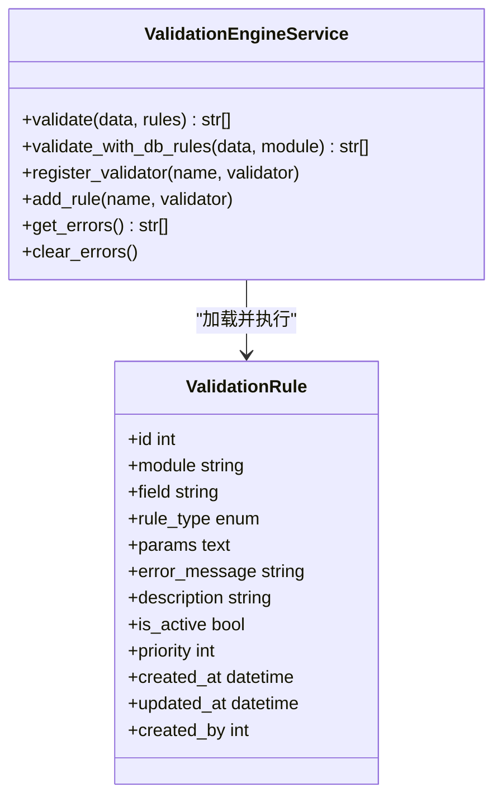
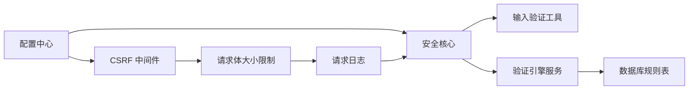

# 输入验证与防护

<cite>
**本文引用的文件**
- [backend/app/middleware/csrf_middleware.py](file://backend/app/middleware/csrf_middleware.py)
- [backend/app/utils/input_validator.py](file://backend/app/utils/input_validator.py)
- [backend/app/core/security.py](file://backend/app/core/security.py)
- [backend/app/services/validation_engine_service.py](file://backend/app/services/validation_engine_service.py)
- [backend/app/models/validation_rule.py](file://backend/app/models/validation_rule.py)
- [backend/app/middleware/body_size_limit.py](file://backend/app/middleware/body_size_limit.py)
- [backend/app/middleware/request_logger.py](file://backend/app/middleware/request_logger.py)
- [backend/app/core/config.py](file://backend/app/core/config.py)
</cite>

## 目录
1. [简介](#简介)
2. [项目结构](#项目结构)
3. [核心组件](#核心组件)
4. [架构总览](#架构总览)
5. [详细组件分析](#详细组件分析)
6. [依赖关系分析](#依赖关系分析)
7. [性能考虑](#性能考虑)
8. [故障排查指南](#故障排查指南)
9. [结论](#结论)
10. [附录](#附录)

## 简介
本文件聚焦后端输入验证与安全防护，覆盖 SQL 注入、XSS、CSRF 等攻击的防御机制；说明输入清洗、格式校验、长度限制、类型检查等策略；并提供恶意请求检测、请求频率限制、IP 白名单（代理信任）等防护措施的配置与使用方法；最后给出自定义验证规则开发指南与安全编码最佳实践。

## 项目结构
安全相关能力主要分布在以下位置：
- 中间件层：CSRF 保护、请求体大小限制、请求日志记录
- 核心安全模块：认证鉴权、速率限制、安全响应头、敏感信息脱敏
- 输入验证工具：XSS/SQL 注入模式匹配、格式校验、长度/范围校验
- 验证引擎服务：统一规则执行、数据库驱动规则加载
- 配置中心：安全开关、令牌有效期、CORS、CSRF、速率限制等

图表来源
- [backend/app/middleware/csrf_middleware.py:177-284](file://backend/app/middleware/csrf_middleware.py#L177-L284)
- [backend/app/middleware/body_size_limit.py:48-79](file://backend/app/middleware/body_size_limit.py#L48-L79)
- [backend/app/middleware/request_logger.py:52-114](file://backend/app/middleware/request_logger.py#L52-L114)
- [backend/app/core/security.py:414-510](file://backend/app/core/security.py#L414-L510)
- [backend/app/utils/input_validator.py:12-124](file://backend/app/utils/input_validator.py#L12-L124)
- [backend/app/services/validation_engine_service.py:26-177](file://backend/app/services/validation_engine_service.py#L26-L177)
- [backend/app/models/validation_rule.py:31-55](file://backend/app/models/validation_rule.py#L31-L55)

章节来源
- [backend/app/middleware/csrf_middleware.py:177-284](file://backend/app/middleware/csrf_middleware.py#L177-L284)
- [backend/app/middleware/body_size_limit.py:48-79](file://backend/app/middleware/body_size_limit.py#L48-L79)
- [backend/app/middleware/request_logger.py:52-114](file://backend/app/middleware/request_logger.py#L52-L114)
- [backend/app/core/security.py:414-510](file://backend/app/core/security.py#L414-L510)
- [backend/app/utils/input_validator.py:12-124](file://backend/app/utils/input_validator.py#L12-L124)
- [backend/app/services/validation_engine_service.py:26-177](file://backend/app/services/validation_engine_service.py#L26-L177)
- [backend/app/models/validation_rule.py:31-55](file://backend/app/models/validation_rule.py#L31-L55)

## 核心组件
- CSRF 中间件：基于 Double Submit Cookie + HMAC 签名校验，支持过期检测与豁免路径
- 输入验证工具：XSS/SQL 注入模式匹配、邮箱/手机/身份证格式校验、文件扩展名与大小校验、数值范围与必填字段校验
- 安全核心：JWT 认证、密码策略、内存级速率限制、安全响应头、敏感数据脱敏、客户端 IP 提取
- 验证引擎服务：统一规则执行（required/range/regex/enum/length），支持从数据库动态加载并执行校验规则
- 请求体大小限制：非上传端点限制请求体大小，防止超大 JSON 攻击
- 请求日志：记录方法、路径、参数、IP、UA、状态码、耗时，便于审计与异常定位

章节来源
- [backend/app/middleware/csrf_middleware.py:177-284](file://backend/app/middleware/csrf_middleware.py#L177-L284)
- [backend/app/utils/input_validator.py:12-124](file://backend/app/utils/input_validator.py#L12-L124)
- [backend/app/core/security.py:120-149](file://backend/app/core/security.py#L120-L149)
- [backend/app/core/security.py:414-510](file://backend/app/core/security.py#L414-L510)
- [backend/app/services/validation_engine_service.py:26-177](file://backend/app/services/validation_engine_service.py#L26-L177)
- [backend/app/middleware/body_size_limit.py:48-79](file://backend/app/middleware/body_size_limit.py#L48-L79)
- [backend/app/middleware/request_logger.py:52-114](file://backend/app/middleware/request_logger.py#L52-L114)

## 架构总览
下图展示一次状态变更请求的安全处理流程：CSRF 校验 → 请求体大小限制 → 安全核心（认证/限流/安全头）→ 业务逻辑（输入验证/规则引擎）。

图表来源
- [backend/app/middleware/csrf_middleware.py:177-284](file://backend/app/middleware/csrf_middleware.py#L177-L284)
- [backend/app/middleware/body_size_limit.py:48-79](file://backend/app/middleware/body_size_limit.py#L48-L79)
- [backend/app/core/security.py:243-336](file://backend/app/core/security.py#L243-L336)
- [backend/app/services/validation_engine_service.py:38-91](file://backend/app/services/validation_engine_service.py#L38-L91)

## 详细组件分析

### CSRF 攻击防护（Double Submit Cookie + HMAC）
- 工作原理
  - 前端先 GET 获取原始 token，服务端设置 csrftoken Cookie 为 HMAC-SHA256(raw_token)
  - 后续状态变更请求在 X-CSRF-Token 头中携带 raw_token
  - 服务端计算 HMAC(header_value) 并与 cookie 常量时间比较，同时检查 token 是否过期
- 豁免与安全
  - 安全方法（GET/HEAD/OPTIONS）直接放行
  - 豁免路径列表（如健康检查、登录注册、文档等）不校验
  - 支持可信代理透传真实客户端 IP，用于审计与限流键
- 兼容性与降级
  - 若检测到旧版明文比对，仍允许但记录警告日志，提示升级前端至签名流程

图表来源
- [backend/app/middleware/csrf_middleware.py:177-284](file://backend/app/middleware/csrf_middleware.py#L177-L284)

章节来源
- [backend/app/middleware/csrf_middleware.py:177-284](file://backend/app/middleware/csrf_middleware.py#L177-L284)

### XSS 攻击防护
- 实现方式
  - 输入清洗：对字符串进行长度截断、危险字符转义（如 < >）
  - 模式匹配：检测常见 XSS 片段（script、javascript:、事件处理器、iframe/object/embed 等）
  - 触发策略：命中即拒绝请求并返回 400
- 使用建议
  - 所有用户可控文本在进入存储/渲染前均应经过清洗
  - 结合安全响应头（X-XSS-Protection、Referrer-Policy、Content-Security-Policy）增强浏览器侧防护

章节来源
- [backend/app/utils/input_validator.py:12-53](file://backend/app/utils/input_validator.py#L12-L53)
- [backend/app/core/security.py:598-636](file://backend/app/core/security.py#L598-L636)

### SQL 注入防护
- 实现方式
  - 模式匹配：检测 UNION SELECT、DROP TABLE、INSERT INTO、DELETE FROM、UPDATE SET、EXEC/EXECUTE、注释符等高危模式
  - 输入清理：移除分号、注释、块注释等危险字符
  - 触发策略：命中即拒绝请求并返回 400
- 最佳实践
  - 优先使用参数化查询（ORM/预编译语句）
  - 将输入验证作为额外防线，而非唯一防护

章节来源
- [backend/app/utils/input_validator.py:54-71](file://backend/app/utils/input_validator.py#L54-L71)
- [backend/app/core/security.py:379-411](file://backend/app/core/security.py#L379-L411)

### 输入数据清洗、格式验证、长度限制、类型检查
- 清洗与过滤
  - 字符串长度限制、危险字符替换
- 格式验证
  - 邮箱、手机号、身份证号正则校验
- 长度与范围
  - 字符串最小/最大长度、数值范围校验
- 类型检查
  - 数字转换与异常捕获，确保类型正确
- 必填字段
  - 校验缺失或空值字段并返回错误

图表来源
- [backend/app/utils/input_validator.py:31-124](file://backend/app/utils/input_validator.py#L31-L124)
- [backend/app/services/validation_engine_service.py:38-91](file://backend/app/services/validation_engine_service.py#L38-L91)

章节来源
- [backend/app/utils/input_validator.py:31-124](file://backend/app/utils/input_validator.py#L31-L124)
- [backend/app/services/validation_engine_service.py:38-91](file://backend/app/services/validation_engine_service.py#L38-L91)

### 恶意请求检测与请求频率限制
- 频率限制
  - 内存滑动窗口算法，默认 60 次/分钟，可配置
  - 严格参数校验：必须提供 key（通常为 IP）和 request，否则抛出异常拒绝放行
  - 定期清理过期键，避免内存泄漏
- 恶意请求检测
  - 请求日志记录：方法、路径、查询参数、IP、UA、状态码、耗时
  - 请求体大小限制：非上传端点限制最大请求体，防止超大 JSON 攻击
- 代理信任与 IP 提取
  - 默认不信任代理头（防伪造），仅在可信反向代理场景下启用 TRUST_PROXY_HEADERS

图表来源
- [backend/app/middleware/request_logger.py:52-114](file://backend/app/middleware/request_logger.py#L52-L114)
- [backend/app/middleware/body_size_limit.py:48-79](file://backend/app/middleware/body_size_limit.py#L48-L79)
- [backend/app/core/security.py:414-510](file://backend/app/core/security.py#L414-L510)

章节来源
- [backend/app/core/security.py:414-510](file://backend/app/core/security.py#L414-L510)
- [backend/app/middleware/request_logger.py:52-114](file://backend/app/middleware/request_logger.py#L52-L114)
- [backend/app/middleware/body_size_limit.py:48-79](file://backend/app/middleware/body_size_limit.py#L48-L79)

### IP 白名单（代理信任）与来源识别
- 代理信任
  - 通过环境变量 TRUSTED_PROXIES 指定可信代理地址段，仅当直连 IP 属于可信代理时，才读取 X-Forwarded-For 首段作为真实客户端 IP
  - 未配置时采用 fail-closed 策略，直接使用直连 IP，防止伪造绕过
- 来源识别
  - 安全核心提供 get_client_ip()，默认不信任代理头，仅在 TRUST_PROXY_HEADERS=True 时读取代理头
  - 本地请求判断：回环地址视为本地

章节来源
- [backend/app/middleware/csrf_middleware.py:135-174](file://backend/app/middleware/csrf_middleware.py#L135-L174)
- [backend/app/core/security.py:491-516](file://backend/app/core/security.py#L491-L516)

### 自定义验证规则开发指南
- 规则模型
  - ValidationRule 表支持多种规则类型：required、positive、non_negative、date_format、file_type、max_length、min_length、range、regex、cross_field、enum_values
- 规则执行
  - 验证引擎服务支持按模块加载活跃规则，按优先级执行
  - 支持内置规则（required/range/regex/enum/length）与自定义规则注册
- 开发步骤
  - 定义规则类型与参数（JSON）
  - 在验证引擎中注册自定义校验器
  - 通过数据库配置规则并启用
  - 在业务接口中调用验证引擎执行校验

图表来源
- [backend/app/services/validation_engine_service.py:26-177](file://backend/app/services/validation_engine_service.py#L26-L177)
- [backend/app/models/validation_rule.py:31-55](file://backend/app/models/validation_rule.py#L31-L55)

章节来源
- [backend/app/services/validation_engine_service.py:26-177](file://backend/app/services/validation_engine_service.py#L26-L177)
- [backend/app/models/validation_rule.py:31-55](file://backend/app/models/validation_rule.py#L31-L55)

### 安全编码最佳实践
- 始终对用户输入进行清洗与校验，不要信任任何外部输入
- 使用参数化查询与 ORM，避免拼接 SQL
- 对所有状态变更请求启用 CSRF 保护
- 设置合理的安全响应头（X-Content-Type-Options、X-Frame-Options、X-XSS-Protection、Referrer-Policy、Content-Security-Policy）
- 限制请求体大小，防止资源耗尽攻击
- 实施频率限制与审计日志，便于检测与溯源
- 敏感信息脱敏后再记录日志
- 使用强密码策略与合理的令牌有效期

章节来源
- [backend/app/core/security.py:598-636](file://backend/app/core/security.py#L598-L636)
- [backend/app/core/security.py:524-590](file://backend/app/core/security.py#L524-L590)
- [backend/app/middleware/body_size_limit.py:48-79](file://backend/app/middleware/body_size_limit.py#L48-L79)
- [backend/app/middleware/request_logger.py:52-114](file://backend/app/middleware/request_logger.py#L52-L114)

## 依赖关系分析
- 中间件依赖
  - CSRF 中间件依赖配置（CSRF_ENABLED、CSRF_SECRET_KEY）、安全密钥与时间戳校验
  - 请求体大小限制中间件依赖路径白名单与 Content-Length 解析
  - 请求日志中间件依赖 ASGI scope 与 headers
- 核心安全模块依赖
  - 速率限制依赖线程锁与内存存储，周期性清理过期键
  - 客户端 IP 提取依赖配置 TRUST_PROXY_HEADERS 与代理头
- 验证引擎依赖
  - 依赖输入验证工具与数据库规则表，支持动态规则加载与执行

图表来源
- [backend/app/core/config.py:126-159](file://backend/app/core/config.py#L126-L159)
- [backend/app/middleware/csrf_middleware.py:177-284](file://backend/app/middleware/csrf_middleware.py#L177-L284)
- [backend/app/middleware/body_size_limit.py:48-79](file://backend/app/middleware/body_size_limit.py#L48-L79)
- [backend/app/middleware/request_logger.py:52-114](file://backend/app/middleware/request_logger.py#L52-L114)
- [backend/app/core/security.py:414-510](file://backend/app/core/security.py#L414-L510)
- [backend/app/services/validation_engine_service.py:26-177](file://backend/app/services/validation_engine_service.py#L26-L177)
- [backend/app/models/validation_rule.py:31-55](file://backend/app/models/validation_rule.py#L31-L55)

章节来源
- [backend/app/core/config.py:126-159](file://backend/app/core/config.py#L126-L159)
- [backend/app/middleware/csrf_middleware.py:177-284](file://backend/app/middleware/csrf_middleware.py#L177-L284)
- [backend/app/middleware/body_size_limit.py:48-79](file://backend/app/middleware/body_size_limit.py#L48-L79)
- [backend/app/middleware/request_logger.py:52-114](file://backend/app/middleware/request_logger.py#L52-L114)
- [backend/app/core/security.py:414-510](file://backend/app/core/security.py#L414-L510)
- [backend/app/services/validation_engine_service.py:26-177](file://backend/app/services/validation_engine_service.py#L26-L177)
- [backend/app/models/validation_rule.py:31-55](file://backend/app/models/validation_rule.py#L31-L55)

## 性能考虑
- 速率限制采用内存滑动窗口，具备 O(n) 时间复杂度（n 为窗口内请求数），并通过周期性清理控制内存占用
- 请求日志记录轻量，跳过静态与健康检查路径，减少 I/O 开销
- 请求体大小限制在中间件早期拦截，避免不必要的解析与处理
- 验证引擎支持批量规则执行，注意规则数量与复杂度的影响

[本节为通用性能讨论，无需特定文件引用]

## 故障排查指南
- CSRF 验证失败
  - 检查是否缺少 X-CSRF-Token 头或 csrftoken Cookie
  - 检查 token 是否过期（默认 24 小时）
  - 查看日志中的降级路径警告，确认前端是否已升级至签名流程
- 请求被拒绝（413/403）
  - 413：请求体超过限制，检查是否为上传端点或大 JSON 批量操作
  - 403：CSRF 校验失败或权限不足，检查 token 与权限
- 速率限制触发
  - 检查 key 是否正确（通常为 IP），确认 TRUST_PROXY_HEADERS 配置
  - 查看日志中的限流记录，调整限流阈值或优化请求频率
- 输入验证失败
  - 检查字段格式、长度、范围是否符合预期
  - 查看验证引擎返回的错误列表，定位具体规则

章节来源
- [backend/app/middleware/csrf_middleware.py:211-284](file://backend/app/middleware/csrf_middleware.py#L211-L284)
- [backend/app/middleware/body_size_limit.py:53-79](file://backend/app/middleware/body_size_limit.py#L53-L79)
- [backend/app/core/security.py:439-488](file://backend/app/core/security.py#L439-L488)
- [backend/app/services/validation_engine_service.py:38-91](file://backend/app/services/validation_engine_service.py#L38-L91)

## 结论
本项目在后端实现了较为完善的输入验证与安全防护体系，涵盖 CSRF、XSS、SQL 注入、频率限制、请求体大小限制、安全响应头等关键措施。通过中间件与核心安全模块的组合，以及可配置的验证引擎，既保证了安全性，又提供了灵活的扩展能力。建议在生产环境中严格启用 CSRF 保护、合理配置代理信任与频率限制，并持续监控与审计日志以发现潜在风险。

[本节为总结性内容，无需特定文件引用]

## 附录
- 配置项参考
  - CSRF_ENABLED、CSRF_SECRET_KEY：控制 CSRF 保护开关与密钥
  - RATE_LIMIT_ENABLED、RATE_LIMIT_PER_MINUTE/HOUR：控制频率限制
  - TRUST_PROXY_HEADERS：控制是否信任代理头
  - CORS_*：跨域配置
  - ACCESS_TOKEN_EXPIRE_MINUTES、REFRESH_TOKEN_EXPIRE_DAYS：令牌有效期
- 常用路径与行为
  - 豁免路径：健康检查、登录注册、文档等不进行 CSRF 校验
  - 大负载路径：导入导出、备份恢复等端点放宽请求体限制

章节来源
- [backend/app/core/config.py:126-159](file://backend/app/core/config.py#L126-L159)
- [backend/app/middleware/csrf_middleware.py:46-56](file://backend/app/middleware/csrf_middleware.py#L46-L56)
- [backend/app/middleware/body_size_limit.py:20-45](file://backend/app/middleware/body_size_limit.py#L20-L45)