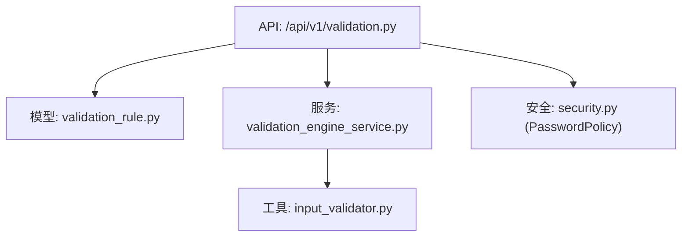
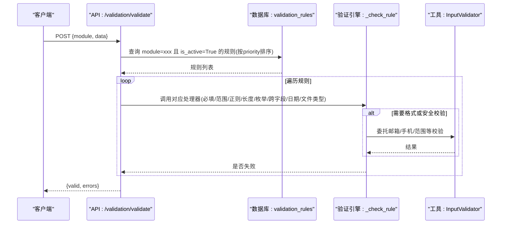
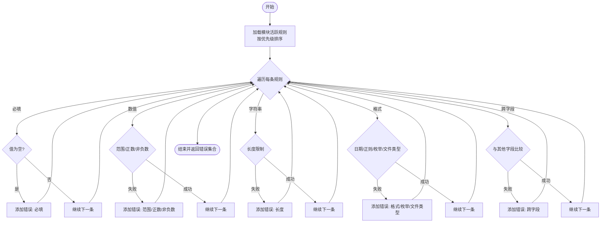
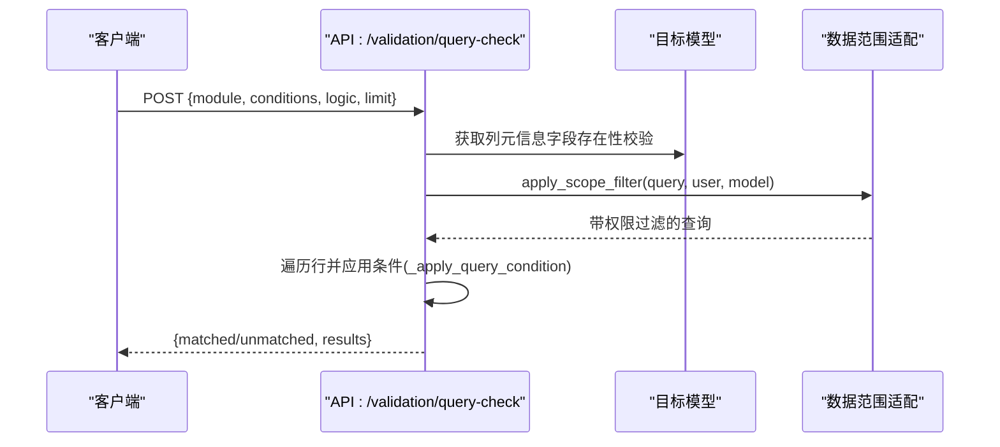
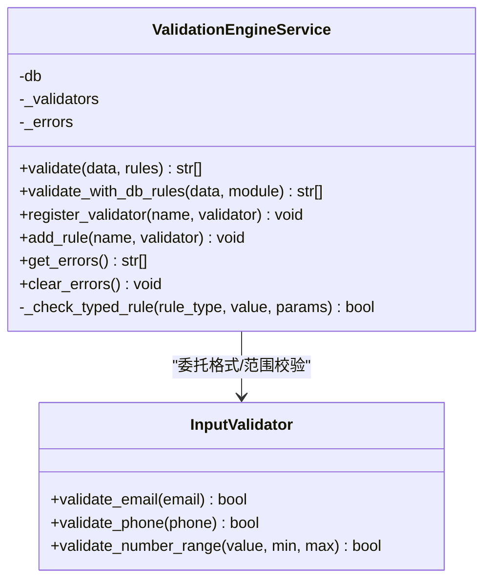
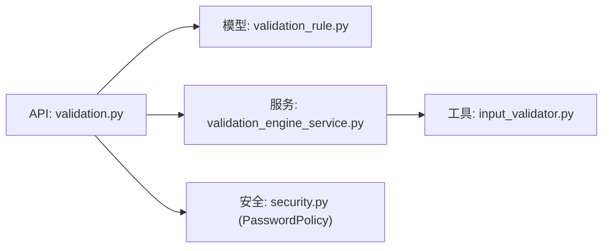

# 输入验证规则

<cite>
**本文引用的文件**
- [backend/app/api/v1/validation.py](file://backend/app/api/v1/validation.py)
- [backend/app/models/validation_rule.py](file://backend/app/models/validation_rule.py)
- [backend/app/services/validation_engine_service.py](file://backend/app/services/validation_engine_service.py)
- [backend/app/utils/input_validator.py](file://backend/app/utils/input_validator.py)
- [backend/app/core/security.py](file://backend/app/core/security.py)
</cite>

## 目录
1. [简介](#简介)
2. [项目结构](#项目结构)
3. [核心组件](#核心组件)
4. [架构总览](#架构总览)
5. [详细组件分析](#详细组件分析)
6. [依赖关系分析](#依赖关系分析)
7. [性能考虑](#性能考虑)
8. [故障排查指南](#故障排查指南)
9. [结论](#结论)
10. [附录](#附录)

## 简介
本文件系统性梳理本项目中的输入验证策略与实现，覆盖数据类型校验、格式校验、长度限制、范围检查、跨字段校验、枚举值校验等。重点说明可配置的数据校验规则引擎（基于数据库的 ValidationRule）以及密码策略 PasswordPolicy 的实现细节（复杂度要求、弱口令检测、用户名关联约束）。同时给出自定义验证规则的开发方法（Pydantic 模型、FastAPI 依赖注入、数据库约束），并提供最佳实践与常见模式的参考路径。

## 项目结构
围绕输入验证的相关代码主要分布在以下模块：
- API 层：提供规则管理、数据校验、条件查询校验等接口
- 模型层：定义校验规则的数据结构与类型枚举
- 服务层：提供统一的验证引擎，支持从数据库加载并执行规则
- 工具层：通用输入清洗与安全校验（XSS/SQL注入、邮箱/手机/身份证、文件大小等）
- 安全层：密码策略（PasswordPolicy）集中实现

图表来源
- [backend/app/api/v1/validation.py:1-508](file://backend/app/api/v1/validation.py#L1-L508)
- [backend/app/models/validation_rule.py:1-55](file://backend/app/models/validation_rule.py#L1-L55)
- [backend/app/services/validation_engine_service.py:1-217](file://backend/app/services/validation_engine_service.py#L1-L217)
- [backend/app/utils/input_validator.py:1-124](file://backend/app/utils/input_validator.py#L1-L124)
- [backend/app/core/security.py:519-569](file://backend/app/core/security.py#L519-L569)

章节来源
- [backend/app/api/v1/validation.py:1-508](file://backend/app/api/v1/validation.py#L1-L508)
- [backend/app/models/validation_rule.py:1-55](file://backend/app/models/validation_rule.py#L1-L55)
- [backend/app/services/validation_engine_service.py:1-217](file://backend/app/services/validation_engine_service.py#L1-L217)
- [backend/app/utils/input_validator.py:1-124](file://backend/app/utils/input_validator.py#L1-L124)
- [backend/app/core/security.py:519-569](file://backend/app/core/security.py#L519-L569)

## 核心组件
- 可配置校验规则模型与枚举：用于持久化字段级校验规则（必填、正数、非负数、日期格式、文件类型、最大/最小长度、数值范围、正则表达式、跨字段逻辑、枚举值限制），并通过优先级控制执行顺序。
- 规则管理 API：提供规则的增删改查、按模块筛选、启用状态过滤；提供对提交数据的实时校验接口，返回结构化错误信息。
- 条件查询校验：以“字段+运算符+值”组合条件对存量数据进行匹配/不匹配校验，支持 and/or 多条件组合，便于前端可视化操作。
- 验证引擎服务：统一封装验证流程，支持内存规则字典与数据库规则两种模式，提供扩展点注册自定义验证器。
- 输入验证工具：提供 XSS/SQL 注入防护、邮箱/手机/身份证格式校验、文件扩展名与大小校验、数值范围校验、必填字段校验等。
- 密码策略：集中实现密码复杂度、长度、特殊字符白名单、弱口令前缀检测、用户名包含性检查等。

章节来源
- [backend/app/models/validation_rule.py:15-55](file://backend/app/models/validation_rule.py#L15-L55)
- [backend/app/api/v1/validation.py:26-231](file://backend/app/api/v1/validation.py#L26-L231)
- [backend/app/api/v1/validation.py:348-508](file://backend/app/api/v1/validation.py#L348-L508)
- [backend/app/services/validation_engine_service.py:18-177](file://backend/app/services/validation_engine_service.py#L18-L177)
- [backend/app/utils/input_validator.py:12-124](file://backend/app/utils/input_validator.py#L12-L124)
- [backend/app/core/security.py:524-569](file://backend/app/core/security.py#L524-L569)

## 架构总览
下图展示了请求进入后的验证链路：API 接收数据后，先进行 Pydantic 模型校验，再根据模块动态加载数据库中的活跃规则，逐条执行对应处理器，最终汇总错误返回。对于存量数据，还提供条件查询校验能力。

图表来源
- [backend/app/api/v1/validation.py:195-231](file://backend/app/api/v1/validation.py#L195-L231)
- [backend/app/api/v1/validation.py:234-341](file://backend/app/api/v1/validation.py#L234-L341)
- [backend/app/utils/input_validator.py:74-112](file://backend/app/utils/input_validator.py#L74-L112)

## 详细组件分析

### 可配置校验规则模型（ValidationRule）
- 规则类型枚举：required、positive、non_negative、date_format、file_type、max_length、min_length、range、regex、cross_field、enum_values。
- 字段说明：module（所属模块）、field（字段名）、rule_type（规则类型）、params（JSON 参数，如 min/max/pattern/values/other_field/operator/format/allowed）、error_message（错误提示）、description（描述）、is_active（是否启用）、priority（优先级，越小越优先）、审计字段 created_at/updated_at/created_by。
- 设计要点：通过 JSON params 灵活表达不同规则参数；通过 priority 控制执行顺序；通过 is_active 快速开关规则。

章节来源
- [backend/app/models/validation_rule.py:15-55](file://backend/app/models/validation_rule.py#L15-L55)

### 规则管理 API（CRUD + 实时校验）
- 规则列表：支持按 module、is_active 筛选，按 module 和 priority 排序。
- 创建/更新规则：对 params 进行 JSON 合法性校验，写入数据库并记录工作日志。
- 删除规则：软删除或物理删除（当前为物理删除），并记录日志。
- 实时数据校验：根据 module 加载活跃规则，逐项执行处理器，返回结构化错误（含字段中文名标签映射）。
- 字段中文标签映射：内置常用模块字段的中文展示名，提升用户体验。

图表来源
- [backend/app/api/v1/validation.py:195-231](file://backend/app/api/v1/validation.py#L195-L231)
- [backend/app/api/v1/validation.py:234-341](file://backend/app/api/v1/validation.py#L234-L341)

章节来源
- [backend/app/api/v1/validation.py:65-162](file://backend/app/api/v1/validation.py#L65-L162)
- [backend/app/api/v1/validation.py:165-231](file://backend/app/api/v1/validation.py#L165-L231)

### 条件查询校验（小白友好）
- 请求体：module、conditions（字段+运算符+值）、logic（and/or）、limit。
- 运算符：eq/ne/gt/gte/lt/lte/contains/not_contains/empty/not_empty。
- 行为：对指定模块的实体表进行查询，应用条件判断，返回匹配/不匹配明细及统计。
- 安全与权限：结合数据范围适配（apply_scope_filter）与软删除过滤。

图表来源
- [backend/app/api/v1/validation.py:348-508](file://backend/app/api/v1/validation.py#L348-L508)

章节来源
- [backend/app/api/v1/validation.py:348-508](file://backend/app/api/v1/validation.py#L348-L508)

### 验证引擎服务（ValidationEngineService）
- 功能：提供 validate(data, rules) 与 validate_with_db_rules(data, module) 两种模式；支持 required/range/regex/enum/length/positive/non_negative 等规则；可扩展 register_validator/add_rule。
- 错误收集：内部维护错误列表，可通过 get_errors/clear_errors 管理。
- 工具委托：邮箱/手机/范围校验委托给 InputValidator。

图表来源
- [backend/app/services/validation_engine_service.py:18-177](file://backend/app/services/validation_engine_service.py#L18-L177)
- [backend/app/utils/input_validator.py:74-112](file://backend/app/utils/input_validator.py#L74-L112)

章节来源
- [backend/app/services/validation_engine_service.py:18-217](file://backend/app/services/validation_engine_service.py#L18-L217)

### 输入验证工具（InputValidator）
- 安全清洗：sanitize_string 清理 XSS 风险内容；validate_sql_safe 检测 SQL 注入风险。
- 格式校验：邮箱、手机号、身份证号、文件扩展名、文件大小、数值范围。
- 必填字段：validate_required_fields 缺失时抛出 HTTP 异常。

章节来源
- [backend/app/utils/input_validator.py:12-124](file://backend/app/utils/input_validator.py#L12-L124)

### 密码策略（PasswordPolicy）
- 复杂度要求：最小长度、必须包含大写/小写/数字/特殊字符（白名单限定）、最大长度限制。
- 弱口令检测：禁止以 admin/root/123/password/qwerty 等前缀开头。
- 用户名约束：密码不能包含用户名（支持分词匹配）。
- 返回值：(is_valid, error_message)。

章节来源
- [backend/app/core/security.py:524-569](file://backend/app/core/security.py#L524-L569)

## 依赖关系分析
- API 层依赖模型层（ValidationRule）与服务层（ValidationEngineService）。
- 服务层依赖工具层（InputValidator）进行格式与安全校验。
- 安全层（PasswordPolicy）独立于验证引擎，但可在用户注册/修改密码流程中调用。
- 条件查询校验依赖具体业务模型（village/school/project/fund）与数据范围适配。

图表来源
- [backend/app/api/v1/validation.py:1-508](file://backend/app/api/v1/validation.py#L1-L508)
- [backend/app/models/validation_rule.py:1-55](file://backend/app/models/validation_rule.py#L1-L55)
- [backend/app/services/validation_engine_service.py:1-217](file://backend/app/services/validation_engine_service.py#L1-L217)
- [backend/app/utils/input_validator.py:1-124](file://backend/app/utils/input_validator.py#L1-L124)
- [backend/app/core/security.py:519-569](file://backend/app/core/security.py#L519-L569)

章节来源
- [backend/app/api/v1/validation.py:1-508](file://backend/app/api/v1/validation.py#L1-L508)
- [backend/app/models/validation_rule.py:1-55](file://backend/app/models/validation_rule.py#L1-L55)
- [backend/app/services/validation_engine_service.py:1-217](file://backend/app/services/validation_engine_service.py#L1-L217)
- [backend/app/utils/input_validator.py:1-124](file://backend/app/utils/input_validator.py#L1-L124)
- [backend/app/core/security.py:519-569](file://backend/app/core/security.py#L519-L569)

## 性能考虑
- 规则加载与执行：按 module 过滤并仅加载 is_active=True 的规则，按 priority 排序，减少无效计算。
- 条件查询校验：使用 limit 限制扫描行数，避免全表扫描；结合数据范围适配减少不必要数据读取。
- 工具函数复用：将通用格式/安全校验下沉到 InputValidator，避免重复实现。
- 建议：对高频模块可缓存规则集；对复杂正则或跨字段校验可引入索引或预计算字段。

[本节为通用指导，无需特定文件引用]

## 故障排查指南
- 规则参数非法：创建/更新规则时若 params 不是合法 JSON，会返回 400 错误。请检查 JSON 格式与键名。
- 字段不存在：条件查询校验会校验字段是否存在于目标模型列中，不存在则返回 400。请确认字段名与模块映射。
- 逻辑参数非法：logic 仅支持 and/or，其他值会返回 400。
- 数据库规则加载失败：验证引擎在加载 DB 规则时发生异常会降级为空规则集，不影响基础流程。可检查数据库连接与规则表数据。
- 安全拦截：sanitize_string 与 validate_sql_safe 会在检测到 XSS/SQL 注入风险时抛出 400。请清理输入或调整策略。

章节来源
- [backend/app/api/v1/validation.py:82-143](file://backend/app/api/v1/validation.py#L82-L143)
- [backend/app/api/v1/validation.py:461-470](file://backend/app/api/v1/validation.py#L461-L470)
- [backend/app/services/validation_engine_service.py:93-123](file://backend/app/services/validation_engine_service.py#L93-L123)
- [backend/app/utils/input_validator.py:31-71](file://backend/app/utils/input_validator.py#L31-L71)

## 结论
本项目构建了“模型驱动 + 引擎执行 + 工具支撑”的分层输入验证体系：通过数据库可配置的 ValidationRule 实现灵活的字段级校验，借助 ValidationEngineService 统一编排执行流程，并以 InputValidator 提供安全与格式校验能力。PasswordPolicy 集中保障密码强度与安全性。该体系兼顾了可维护性与扩展性，适合在多模块、多场景下持续演进。

[本节为总结性内容，无需特定文件引用]

## 附录

### 自定义验证规则开发方法
- Pydantic 模型验证
  - 在 FastAPI 请求体中使用 Pydantic BaseModel 声明字段类型、默认值、约束（如 Field(min_length=..., max_length=...)），由框架自动完成基础校验。
  - 参考路径：各 schemas 模块（如 auth/user/village 等）中的 Pydantic 模型定义。
- FastAPI 依赖注入验证
  - 通过 Depends 注入自定义校验函数或类方法，在路由处理前执行校验逻辑，必要时抛出 HTTPException。
  - 参考路径：API 路由中对 get_current_user、get_db 等依赖的使用方式。
- 数据库约束验证
  - 在模型层通过 Column 约束（如 unique、nullable、check）与 Alembic 迁移确保数据一致性。
  - 参考路径：models 下的各实体模型与 alembic versions。

[本节为方法论指导，无需特定文件引用]

### 常见验证模式与参考路径
- 必填校验：required 规则或 InputValidator.validate_required_fields
  - 参考路径：[backend/app/api/v1/validation.py:234-241](file://backend/app/api/v1/validation.py#L234-L241)、[backend/app/utils/input_validator.py:114-124](file://backend/app/utils/input_validator.py#L114-L124)
- 数值范围：range/positive/non_negative
  - 参考路径：[backend/app/api/v1/validation.py:244-277](file://backend/app/api/v1/validation.py#L244-L277)、[backend/app/services/validation_engine_service.py:127-156](file://backend/app/services/validation_engine_service.py#L127-L156)
- 字符串长度：min_length/max_length
  - 参考路径：[backend/app/api/v1/validation.py:258-263](file://backend/app/api/v1/validation.py#L258-L263)、[backend/app/services/validation_engine_service.py:141-146](file://backend/app/services/validation_engine_service.py#L141-L146)
- 格式校验：日期格式、正则、枚举值、文件类型
  - 参考路径：[backend/app/api/v1/validation.py:280-305](file://backend/app/api/v1/validation.py#L280-L305)、[backend/app/services/validation_engine_service.py:136-146](file://backend/app/services/validation_engine_service.py#L136-L146)
- 跨字段逻辑：cross_field（比较两个字段的大小/相等）
  - 参考路径：[backend/app/api/v1/validation.py:308-327](file://backend/app/api/v1/validation.py#L308-L327)
- 安全与格式：邮箱/手机/身份证、XSS/SQL 注入防护
  - 参考路径：[backend/app/utils/input_validator.py:74-112](file://backend/app/utils/input_validator.py#L74-L112)、[backend/app/utils/input_validator.py:31-71](file://backend/app/utils/input_validator.py#L31-L71)
- 密码策略：PasswordPolicy
  - 参考路径：[backend/app/core/security.py:524-569](file://backend/app/core/security.py#L524-L569)