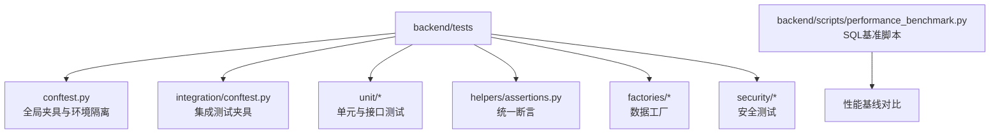
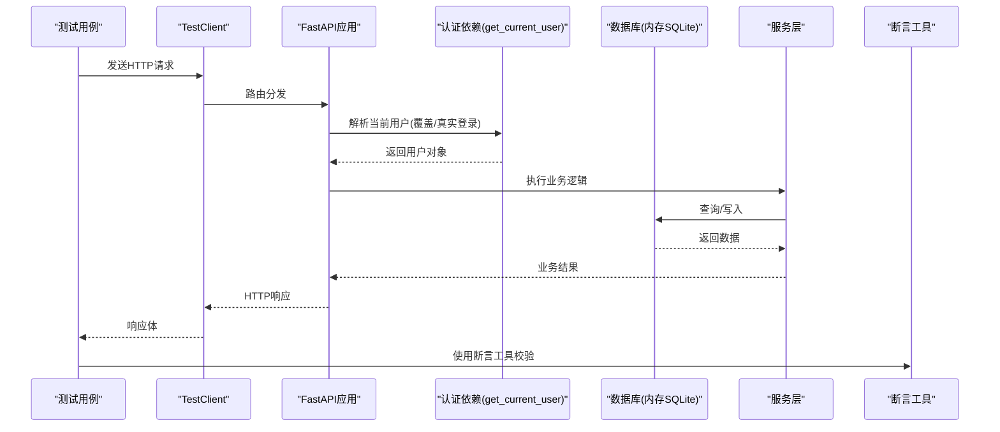
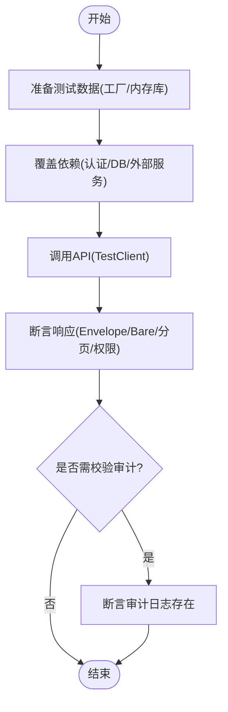
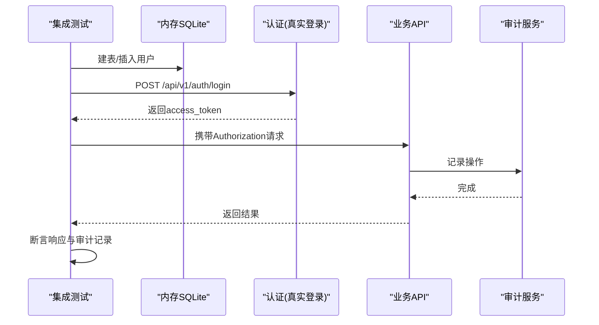
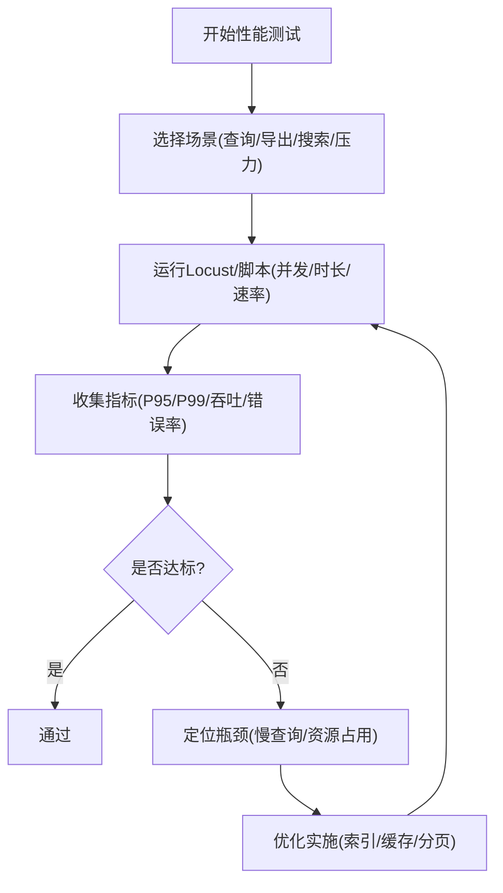
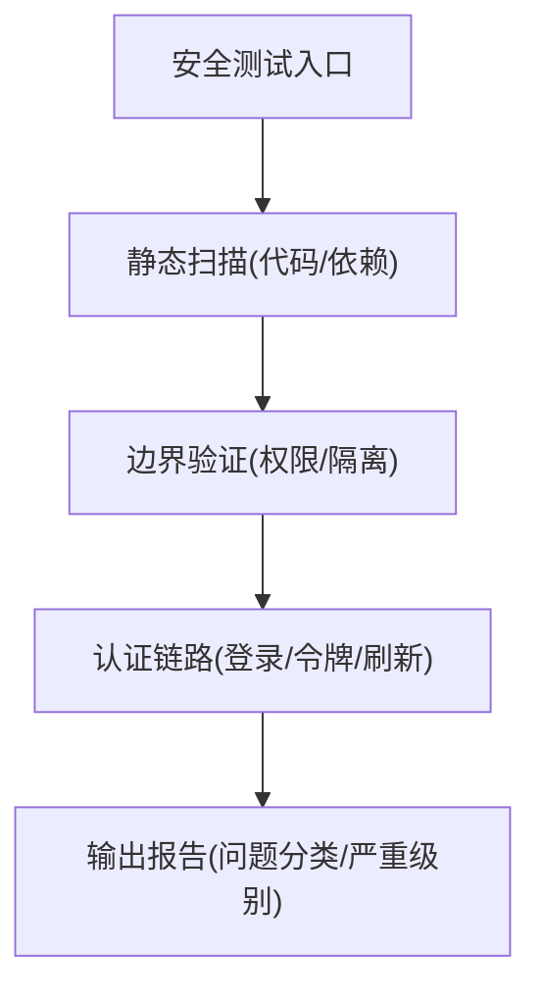
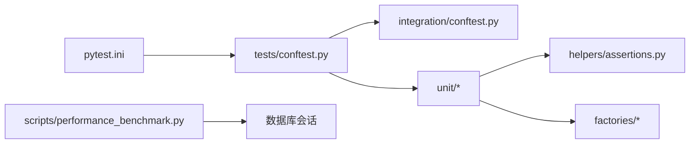

# API测试指南

<cite>
**本文引用的文件**
- [backend/pytest.ini](file://backend/pytest.ini)
- [backend/tests/conftest.py](file://backend/tests/conftest.py)
- [backend/tests/integration/conftest.py](file://backend/tests/integration/conftest.py)
- [backend/tests/helpers/assertions.py](file://backend/tests/helpers/assertions.py)
- [backend/tests/factories/user_factory.py](file://backend/tests/factories/user_factory.py)
- [backend/tests/unit/test_api_auth_full.py](file://backend/tests/unit/test_api_auth_full.py)
- [backend/tests/unit/test_performance_api.py](file://backend/tests/unit/test_performance_api.py)
- [backend/tests/security/test_data_isolation.py](file://backend/tests/security/test_data_isolation.py)
- [backend/scripts/performance_benchmark.py](file://backend/scripts/performance_benchmark.py)
- [docs/03-开发文档/05-性能优化/性能需求.md](file://docs/03-开发文档/05-性能优化/性能需求.md)
- [docs/test-report-gb25000.md](file://docs/test-report-gb25000.md)
</cite>

## 目录
1. [简介](#简介)
2. [项目结构](#项目结构)
3. [核心组件](#核心组件)
4. [架构总览](#架构总览)
5. [详细组件分析](#详细组件分析)
6. [依赖关系分析](#依赖关系分析)
7. [性能考虑](#性能考虑)
8. [故障排查指南](#故障排查指南)
9. [结论](#结论)
10. [附录](#附录)

## 简介
本指南面向后端API的测试实践，覆盖单元测试、集成测试、端到端测试、性能测试与安全测试。基于仓库中的Pytest配置、夹具与工厂、断言工具、安全与性能相关脚本及文档，提供可操作的规范与示例路径，帮助团队稳定、高效地保障API质量与可靠性。

## 项目结构
后端测试位于 backend/tests，采用分层组织：
- 根级 conftest 提供全局环境隔离、内存数据库、认证覆盖等基础能力
- integration 子目录提供集成测试共享夹具（独立数据库、真实登录流程）
- unit 子目录按模块划分大量单元与接口测试
- helpers 提供统一断言工具
- factories 提供数据工厂（如用户、组织、资金等）
- security 子目录聚焦安全边界与多租户隔离验证
- scripts 包含性能基准与安全扫描辅助脚本

**图表来源**
- [backend/tests/conftest.py:1-150](file://backend/tests/conftest.py#L1-L150)
- [backend/tests/integration/conftest.py:1-120](file://backend/tests/integration/conftest.py#L1-L120)
- [backend/tests/helpers/assertions.py:1-190](file://backend/tests/helpers/assertions.py#L1-L190)
- [backend/tests/factories/user_factory.py:1-86](file://backend/tests/factories/user_factory.py#L1-L86)
- [backend/scripts/performance_benchmark.py:1-149](file://backend/scripts/performance_benchmark.py#L1-L149)

**章节来源**
- [backend/pytest.ini:1-39](file://backend/pytest.ini#L1-L39)
- [backend/tests/conftest.py:1-150](file://backend/tests/conftest.py#L1-L150)
- [backend/tests/integration/conftest.py:1-120](file://backend/tests/integration/conftest.py#L1-L120)

## 核心组件
- Pytest 配置与标记：定义测试路径、命名约定、标记（unit/integration/security/e2e/stress/performance），并启用异步模式与警告过滤。
- 全局测试夹具：
  - 环境变量与上传目录隔离，避免污染真实数据
  - 内存SQLite引擎与模型表初始化
  - 依赖注入覆盖（get_db、get_current_user）以支持无DB或Mock认证
  - 会话级数据根目录重定向，防止误写生产目录
- 集成测试夹具：
  - 独立in-memory数据库，自动建表/清理
  - 通过真实登录流程获取JWT，构造admin/user请求头
  - 清理全局状态（令牌黑名单、限流缓存等）
- 断言工具：
  - Envelope/Bare两种响应格式校验
  - 分页、权限拒绝、未找到、校验错误、审计日志、字段加密、同步版本递增等专用断言
- 数据工厂：
  - 用户工厂支持构建/创建管理员、操作员、查看者等角色，密码哈希处理

**章节来源**
- [backend/pytest.ini:1-39](file://backend/pytest.ini#L1-L39)
- [backend/tests/conftest.py:150-737](file://backend/tests/conftest.py#L150-L737)
- [backend/tests/integration/conftest.py:120-313](file://backend/tests/integration/conftest.py#L120-L313)
- [backend/tests/helpers/assertions.py:1-190](file://backend/tests/helpers/assertions.py#L1-L190)
- [backend/tests/factories/user_factory.py:1-86](file://backend/tests/factories/user_factory.py#L1-L86)

## 架构总览
测试执行的关键调用链如下：
- 测试用例通过 FastAPI TestClient 发起HTTP请求
- 依赖注入被覆盖为内存数据库与会话
- 认证依赖被覆盖为模拟用户或真实登录流程
- 业务逻辑访问服务层与数据库
- 结果通过统一断言工具进行校验

**图表来源**
- [backend/tests/conftest.py:392-450](file://backend/tests/conftest.py#L392-L450)
- [backend/tests/integration/conftest.py:59-108](file://backend/tests/integration/conftest.py#L59-L108)
- [backend/tests/helpers/assertions.py:1-190](file://backend/tests/helpers/assertions.py#L1-L190)

## 详细组件分析

### 单元测试编写规范
- 目标：快速、稳定、隔离，不依赖外部资源
- Mock策略：
  - 使用 conftest 提供的 client 与依赖覆盖，避免真实DB与网络IO
  - 对服务层与第三方依赖使用 unittest.mock.patch 进行替换
  - 认证依赖 get_current_user 可通过 fixture 覆盖为模拟用户
- 测试数据准备：
  - 优先使用 factories 构建对象；必要时在内存库中插入记录
  - 使用 real_db_session 或 client_with_db 获取会话进行持久化
- 断言方法使用：
  - 使用 helpers/assertions 中的断言函数校验Envelope/Bare响应、分页、权限拒绝、未找到、校验错误、审计日志、加密字段等
- 示例参考：
  - 认证API全面测试：[backend/tests/unit/test_api_auth_full.py:1-158](file://backend/tests/unit/test_api_auth_full.py#L1-L158)
  - 性能API测试（含权限控制与参数校验）：[backend/tests/unit/test_performance_api.py:1-200](file://backend/tests/unit/test_performance_api.py#L1-L200)

**图表来源**
- [backend/tests/helpers/assertions.py:1-190](file://backend/tests/helpers/assertions.py#L1-L190)
- [backend/tests/conftest.py:392-450](file://backend/tests/conftest.py#L392-L450)
- [backend/tests/factories/user_factory.py:1-86](file://backend/tests/factories/user_factory.py#L1-L86)

**章节来源**
- [backend/tests/unit/test_api_auth_full.py:1-158](file://backend/tests/unit/test_api_auth_full.py#L1-L158)
- [backend/tests/unit/test_performance_api.py:1-200](file://backend/tests/unit/test_performance_api.py#L1-L200)
- [backend/tests/helpers/assertions.py:1-190](file://backend/tests/helpers/assertions.py#L1-L190)
- [backend/tests/conftest.py:392-450](file://backend/tests/conftest.py#L392-L450)
- [backend/tests/factories/user_factory.py:1-86](file://backend/tests/factories/user_factory.py#L1-L86)

### 集成测试设计
- 数据库测试：
  - 使用独立的 in-memory SQLite，每个测试前建表、后清理
  - 通过覆盖 get_db 与 SessionLocal，确保所有代码路径使用测试库
- 外部服务模拟：
  - 通过依赖覆盖将外部服务替换为Mock或内存实现
  - 对认证流程可使用真实登录获取JWT，再构造请求头
- 端到端测试流程：
  - 注册/登录 → 获取token → 调用业务接口 → 校验响应与副作用（如审计日志）
- 示例参考：
  - 集成测试夹具与登录流程：[backend/tests/integration/conftest.py:120-313](file://backend/tests/integration/conftest.py#L120-L313)

**图表来源**
- [backend/tests/integration/conftest.py:120-313](file://backend/tests/integration/conftest.py#L120-L313)

**章节来源**
- [backend/tests/integration/conftest.py:120-313](file://backend/tests/integration/conftest.py#L120-L313)

### 性能测试方法
- 负载测试：
  - 使用 Locust 模拟并发用户与场景权重，输出P95/P99响应时间与吞吐量
  - 参考验收标准与运行方式：[docs/test-report-gb25000.md:148-199](file://docs/test-report-gb25000.md#L148-L199)
- 压力测试：
  - 逐步增加并发与请求速率，观察系统稳定性与错误率
- 性能基准测试：
  - 使用脚本对关键SQL进行多次迭代测量，对比优化前后差异
  - 参考脚本与阈值检查：[backend/scripts/performance_benchmark.py:1-149](file://backend/scripts/performance_benchmark.py#L1-L149)
- 指标与目标：
  - 响应时间、吞吐、资源利用率、错误率等KPI与目标设定：[docs/03-开发文档/05-性能优化/性能需求.md:1-173](file://docs/03-开发文档/05-性能优化/性能需求.md#L1-L173)

**图表来源**
- [docs/test-report-gb25000.md:148-199](file://docs/test-report-gb25000.md#L148-L199)
- [backend/scripts/performance_benchmark.py:1-149](file://backend/scripts/performance_benchmark.py#L1-L149)
- [docs/03-开发文档/05-性能优化/性能需求.md:1-173](file://docs/03-开发文档/05-性能优化/性能需求.md#L1-L173)

**章节来源**
- [docs/test-report-gb25000.md:148-199](file://docs/test-report-gb25000.md#L148-L199)
- [backend/scripts/performance_benchmark.py:1-149](file://backend/scripts/performance_benchmark.py#L1-L149)
- [docs/03-开发文档/05-性能优化/性能需求.md:1-173](file://docs/03-开发文档/05-性能优化/性能需求.md#L1-L173)

### 安全测试策略
- 渗透测试与漏洞扫描：
  - 使用安全扫描脚本对代码进行静态分析与问题归类
  - 参考扫描器与报告输出：[scripts/archive/audit_security.py:194-240](file://scripts/archive/audit_security.py#L194-L240)
- 安全边界验证：
  - 多租户数据隔离：验证不同组织间的数据不可见性
  - 权限控制：非管理员访问管理接口应返回403/401
  - 参考测试：[backend/tests/security/test_data_isolation.py:1-41](file://backend/tests/security/test_data_isolation.py#L1-L41)
- 认证与授权：
  - 通过集成夹具的真实登录流程验证鉴权链路
  - 使用断言工具校验权限拒绝与未找到等边界情况

**图表来源**
- [scripts/archive/audit_security.py:194-240](file://scripts/archive/audit_security.py#L194-L240)
- [backend/tests/security/test_data_isolation.py:1-41](file://backend/tests/security/test_data_isolation.py#L1-L41)

**章节来源**
- [backend/tests/security/test_data_isolation.py:1-41](file://backend/tests/security/test_data_isolation.py#L1-L41)
- [scripts/archive/audit_security.py:194-240](file://scripts/archive/audit_security.py#L194-L240)

## 依赖关系分析
- pytest 配置定义了测试收集规则与标记，便于选择性执行（如仅unit或integration）
- conftest 提供全局依赖覆盖，使测试无需真实DB即可运行，同时保证审计落库链路可用
- 集成测试夹具进一步提供真实登录流程与独立数据库，确保端到端链路正确
- 断言工具集中封装响应格式与常见校验，降低测试重复代码
- 性能基准脚本直接对接数据库会话，用于SQL层面的性能回归

**图表来源**
- [backend/pytest.ini:1-39](file://backend/pytest.ini#L1-L39)
- [backend/tests/conftest.py:150-737](file://backend/tests/conftest.py#L150-L737)
- [backend/tests/integration/conftest.py:120-313](file://backend/tests/integration/conftest.py#L120-L313)
- [backend/tests/helpers/assertions.py:1-190](file://backend/tests/helpers/assertions.py#L1-L190)
- [backend/tests/factories/user_factory.py:1-86](file://backend/tests/factories/user_factory.py#L1-L86)
- [backend/scripts/performance_benchmark.py:1-149](file://backend/scripts/performance_benchmark.py#L1-L149)

**章节来源**
- [backend/pytest.ini:1-39](file://backend/pytest.ini#L1-L39)
- [backend/tests/conftest.py:150-737](file://backend/tests/conftest.py#L150-L737)
- [backend/tests/integration/conftest.py:120-313](file://backend/tests/integration/conftest.py#L120-L313)

## 性能考虑
- 测试环境隔离：
  - 使用内存数据库与临时上传目录，避免I/O竞争与数据污染
  - 清理全局状态（令牌黑名单、限流缓存、缓存管理器）防止跨测试泄漏
- 测试执行顺序：
  - 对敏感于事件循环或依赖污染的测试提前执行，减少干扰
- 性能回归：
  - 通过基准脚本定期比对慢查询与聚合查询耗时，设置阈值告警
- 监控与可视化：
  - 前端监控面板展示CPU/内存/磁盘/响应时间等健康指标，辅助定位问题

**章节来源**
- [backend/tests/conftest.py:100-150](file://backend/tests/conftest.py#L100-L150)
- [backend/tests/integration/conftest.py:110-197](file://backend/tests/integration/conftest.py#L110-L197)
- [backend/scripts/performance_benchmark.py:1-149](file://backend/scripts/performance_benchmark.py#L1-L149)

## 故障排查指南
- 常见问题：
  - 测试连接真实数据库：确认 conftest 已覆盖 DATABASE_URL 与 get_project_backend_dir
  - 审计落库失败：确认 app.core.database 的 engine/SessionLocal 已被覆盖到内存库
  - 环境变量过长导致崩溃：会话级移除超长环境变量，避免patch.dict还原时异常
- 排查步骤：
  - 检查 pytest 标记与收集顺序，确保敏感测试先执行
  - 使用断言工具快速定位响应格式与权限问题
  - 通过性能基准脚本定位慢查询与资源瓶颈

**章节来源**
- [backend/tests/conftest.py:1-150](file://backend/tests/conftest.py#L1-L150)
- [backend/tests/conftest.py:392-450](file://backend/tests/conftest.py#L392-L450)
- [backend/tests/helpers/assertions.py:1-190](file://backend/tests/helpers/assertions.py#L1-L190)

## 结论
本指南基于仓库现有测试基础设施，提供了从单元到集成、从功能到性能与安全的完整测试方案。借助统一的夹具、工厂与断言工具，结合性能基准与安全扫描，可有效保障API的质量与可靠性。建议在日常开发中遵循本规范，持续完善测试覆盖率与性能基线。

## 附录
- 常用命令与标记：
  - 仅运行单元/集成/安全测试：使用 pytest -m unit/integration/security
  - 忽略慢测试：pytest -m "not slow"
- 参考用例路径：
  - 认证API全面测试：[backend/tests/unit/test_api_auth_full.py:1-158](file://backend/tests/unit/test_api_auth_full.py#L1-L158)
  - 性能API测试：[backend/tests/unit/test_performance_api.py:1-200](file://backend/tests/unit/test_performance_api.py#L1-L200)
  - 数据隔离安全测试：[backend/tests/security/test_data_isolation.py:1-41](file://backend/tests/security/test_data_isolation.py#L1-L41)
- 性能与基准：
  - 性能需求文档：[docs/03-开发文档/05-性能优化/性能需求.md:1-173](file://docs/03-开发文档/05-性能优化/性能需求.md#L1-L173)
  - 性能测试报告与运行方式：[docs/test-report-gb25000.md:148-199](file://docs/test-report-gb25000.md#L148-L199)
  - SQL基准脚本：[backend/scripts/performance_benchmark.py:1-149](file://backend/scripts/performance_benchmark.py#L1-L149)