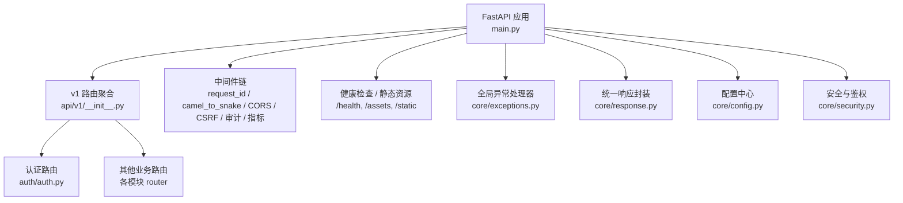
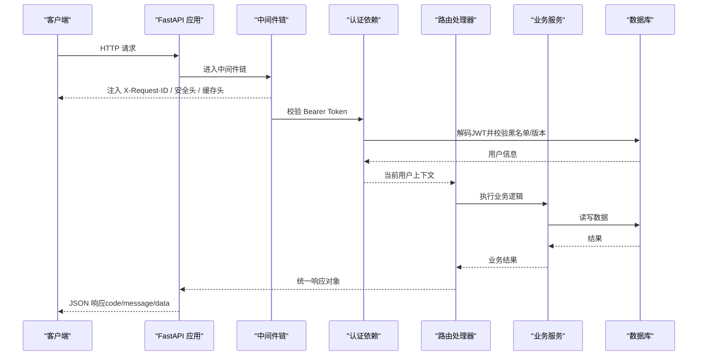
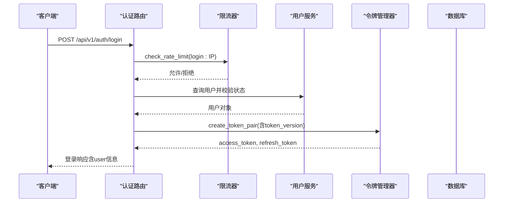
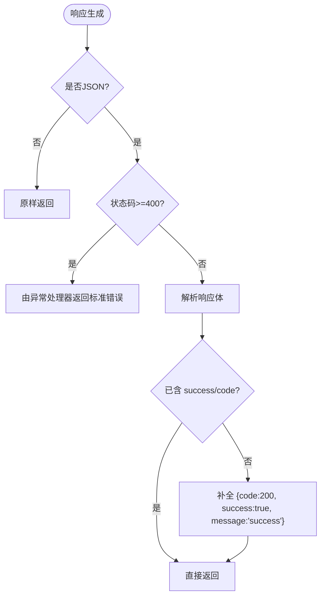
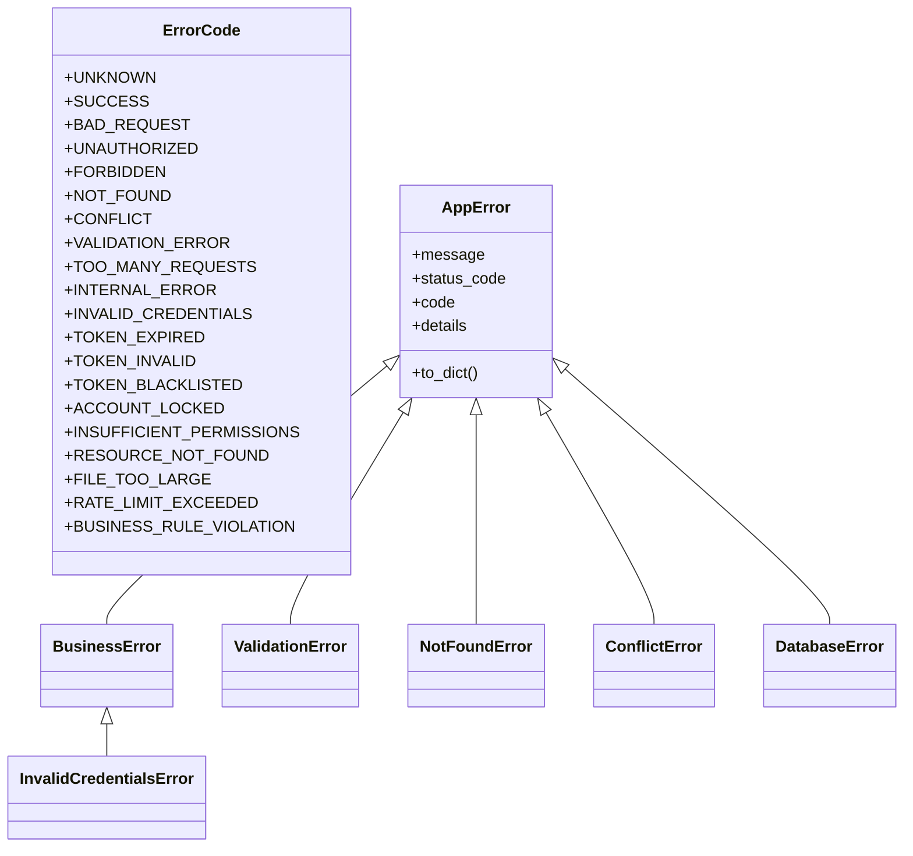
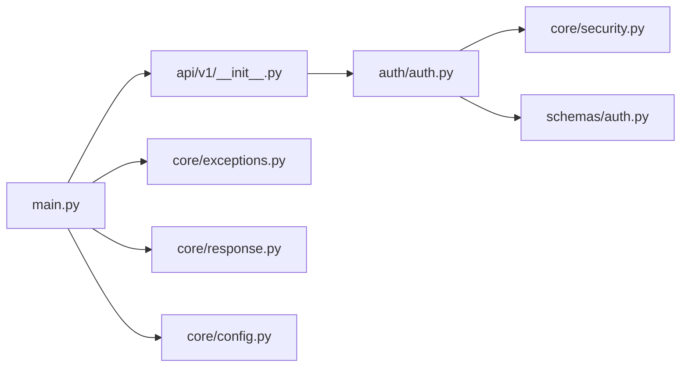

# API规范

<cite>
**本文引用的文件**
- [backend/app/main.py](file://backend/app/main.py)
- [backend/app/api/v1/__init__.py](file://backend/app/api/v1/__init__.py)
- [backend/app/core/config.py](file://backend/app/core/config.py)
- [backend/app/core/response.py](file://backend/app/core/response.py)
- [backend/app/core/errors.py](file://backend/app/core/errors.py)
- [backend/app/core/exceptions.py](file://backend/app/core/exceptions.py)
- [backend/app/core/security.py](file://backend/app/core/security.py)
- [backend/app/middleware/request_id.py](file://backend/app/middleware/request_id.py)
- [backend/app/middleware/camel_to_snake.py](file://backend/app/middleware/camel_to_snake.py)
- [backend/app/api/v1/auth/auth.py](file://backend/app/api/v1/auth/auth.py)
- [backend/app/schemas/auth.py](file://backend/app/schemas/auth.py)
- [backend/tests/integration/test_auth_integration.py](file://backend/tests/integration/test_auth_integration.py)
</cite>

## 目录
1. [简介](#简介)
2. [项目结构](#项目结构)
3. [核心组件](#核心组件)
4. [架构总览](#架构总览)
5. [详细组件分析](#详细组件分析)
6. [依赖关系分析](#依赖关系分析)
7. [性能考虑](#性能考虑)
8. [故障排查指南](#故障排查指南)
9. [结论](#结论)
10. [附录](#附录)

## 简介
本规范面向乡村振兴系统的后端 RESTful API，覆盖设计原则、版本控制、请求与响应格式、认证授权、错误处理、数据验证、接口命名约定、参数传递方式、状态码定义、测试方法、调试工具与性能优化建议，并给出向后兼容性与废弃接口策略，确保系统稳定、可维护且易于演进。

## 项目结构
后端采用 FastAPI 构建，统一入口在应用主模块中注册中间件、路由与健康检查；API 按 v1 前缀组织，业务模块通过静态导入集中挂载，便于打包与快速失败；安全、配置、异常与响应格式等横切能力集中在 core 层；中间件提供链路追踪、请求体键名转换、CORS、CSRF、限流等通用能力。

图示来源
- [backend/app/main.py:100-180](file://backend/app/main.py#L100-L180)
- [backend/app/api/v1/__init__.py:29-140](file://backend/app/api/v1/__init__.py#L29-L140)
- [backend/app/core/exceptions.py:123-145](file://backend/app/core/exceptions.py#L123-L145)
- [backend/app/core/response.py:52-178](file://backend/app/core/response.py#L52-L178)
- [backend/app/core/config.py:54-183](file://backend/app/core/config.py#L54-L183)
- [backend/app/core/security.py:243-371](file://backend/app/core/security.py#L243-L371)

章节来源
- [backend/app/main.py:100-180](file://backend/app/main.py#L100-L180)
- [backend/app/api/v1/__init__.py:29-140](file://backend/app/api/v1/__init__.py#L29-L140)

## 核心组件
- 应用启动与生命周期：初始化数据库、迁移、任务队列、监控与备份调度器，注册中间件与路由，暴露健康检查端点。
- 路由与版本控制：所有业务接口以 /api/v1 为前缀，通过集中式路由聚合器静态导入并注册，保证打包与加载稳定性。
- 认证与授权：基于 JWT（access/refresh）+ 黑名单 + token_version 的版本化吊销机制；支持双因素认证、账户锁定、密码策略与速率限制。
- 错误处理：统一的异常类型与错误码枚举，全局异常处理器输出标准 JSON 错误格式。
- 响应格式：成功/分页/错误响应统一封装，列表返回包含 items、total、page、page_size 的 envelope。
- 中间件：请求ID追踪、驼峰转蛇形、CORS、CSRF、缓存头、慢请求监控、查询计数、审计日志等。
- 配置管理：环境变量驱动，生产环境强制关闭 SQL 回显、自动补齐路径与安全密钥。

章节来源
- [backend/app/main.py:68-180](file://backend/app/main.py#L68-L180)
- [backend/app/api/v1/__init__.py:29-140](file://backend/app/api/v1/__init__.py#L29-L140)
- [backend/app/core/security.py:243-371](file://backend/app/core/security.py#L243-L371)
- [backend/app/core/errors.py:10-87](file://backend/app/core/errors.py#L10-L87)
- [backend/app/core/response.py:52-178](file://backend/app/core/response.py#L52-L178)
- [backend/app/core/config.py:54-183](file://backend/app/core/config.py#L54-L183)

## 架构总览
下图展示一次受保护的业务请求从进入应用到返回响应的完整流程，包括中间件链、认证依赖、服务调用与统一错误处理。

图示来源
- [backend/app/main.py:113-165](file://backend/app/main.py#L113-L165)
- [backend/app/core/security.py:243-336](file://backend/app/core/security.py#L243-L336)
- [backend/app/core/exceptions.py:123-145](file://backend/app/core/exceptions.py#L123-L145)
- [backend/app/core/response.py:52-178](file://backend/app/core/response.py#L52-L178)

## 详细组件分析

### 认证与授权机制
- 登录流程：校验用户名/密码、账户激活与锁定状态、机器码绑定、可选双因素认证；成功后签发 access_token 与 refresh_token，携带 token_version。
- 令牌刷新：仅接受 refresh_token，旧 token 立即吊销，签发新 token 对，防止重放攻击。
- 登出：将当前 access_token 加入黑名单，并递增 token_version 使该用户全部现存 JWT 立即失效。
- 鉴权依赖：get_current_user 解析 Bearer Token，校验黑名单与 token_version，设置审计上下文；require_admin 用于管理员权限校验。
- 速率限制：登录、注册、刷新、CSRF 获取均实施 IP 维度的滑动窗口限流。

图示来源
- [backend/app/api/v1/auth/auth.py:101-287](file://backend/app/api/v1/auth/auth.py#L101-L287)
- [backend/app/core/security.py:439-488](file://backend/app/core/security.py#L439-L488)
- [backend/app/schemas/auth.py:8-77](file://backend/app/schemas/auth.py#L8-L77)

章节来源
- [backend/app/api/v1/auth/auth.py:101-287](file://backend/app/api/v1/auth/auth.py#L101-L287)
- [backend/app/core/security.py:243-371](file://backend/app/core/security.py#L243-L371)
- [backend/app/schemas/auth.py:8-77](file://backend/app/schemas/auth.py#L8-L77)

### 请求与响应格式规范
- 成功响应：统一包含 code、message、success，data 承载业务数据；列表使用 ok_list 返回 {items,total,page,page_size} 的 envelope。
- 错误响应：统一包含 code、message、success，errors/detail 携带详细信息；HTTP 状态码与业务 code 保持一致。
- 分页元信息：PaginationMeta 提供 page、page_size、total、total_pages、has_next、has_prev。
- 驼峰到蛇形：中间件自动将前端 camelCase JSON 键转换为 snake_case，减少前后端字段映射成本。
- 信封补全：对裸 dict JSON 响应自动补全 code/success/message，不改变数据层级，保持兼容性。

图示来源
- [backend/app/middleware/camel_to_snake.py:44-106](file://backend/app/middleware/camel_to_snake.py#L44-L106)
- [backend/app/core/response.py:52-178](file://backend/app/core/response.py#L52-L178)
- [backend/app/core/exceptions.py:123-145](file://backend/app/core/exceptions.py#L123-L145)

章节来源
- [backend/app/core/response.py:52-178](file://backend/app/core/response.py#L52-L178)
- [backend/app/middleware/camel_to_snake.py:44-106](file://backend/app/middleware/camel_to_snake.py#L44-L106)
- [backend/app/core/exceptions.py:123-145](file://backend/app/core/exceptions.py#L123-L145)

### 错误处理标准与错误码
- 错误码枚举：集中定义通用、认证、权限、资源、文件、数据库、限流、外部服务、配置、业务等错误码，并提供人类可读消息。
- 自定义异常：AppError 及其子类（BusinessError、ValidationError、NotFoundError、ConflictError、DatabaseError、InvalidCredentialsError 等）。
- 全局异常处理器：捕获 Pydantic 验证异常与应用异常，输出统一 JSON 错误格式；未捕获异常返回 500。

图示来源
- [backend/app/core/errors.py:10-87](file://backend/app/core/errors.py#L10-L87)
- [backend/app/core/exceptions.py:11-119](file://backend/app/core/exceptions.py#L11-L119)

章节来源
- [backend/app/core/errors.py:10-87](file://backend/app/core/errors.py#L10-L87)
- [backend/app/core/exceptions.py:11-119](file://backend/app/core/exceptions.py#L11-L119)

### 数据验证规则
- 登录请求：用户名长度与密码长度由 Pydantic Schema 约束。
- 密码策略：最小长度、大小写、数字、特殊字符、弱口令前缀、禁止包含用户名片段。
- 用户名格式：字母、数字、下划线、短横线与中文字符，长度限制。
- 速率限制：登录、注册、刷新、CSRF 获取按 IP 维度进行滑动窗口限流。

章节来源
- [backend/app/schemas/auth.py:8-77](file://backend/app/schemas/auth.py#L8-L77)
- [backend/app/core/security.py:524-590](file://backend/app/core/security.py#L524-L590)
- [backend/app/api/v1/auth/auth.py:124-137](file://backend/app/api/v1/auth/auth.py#L124-L137)

### 接口命名约定与版本控制
- 版本控制：所有业务接口统一以 /api/v1 前缀组织，通过集中路由聚合器静态导入并注册，便于后续扩展 v2 并保持向后兼容。
- 命名约定：RESTful 风格资源名词复数形式（如 users、projects），动词通过 HTTP 方法表达；子功能通过路径分段（如 /auth/login、/auth/me）。
- 路由注册顺序：影响匹配优先级，需将更具体的路由置于动态路由之前（例如 supported_village_export 先于 supported_village）。

章节来源
- [backend/app/api/v1/__init__.py:29-140](file://backend/app/api/v1/__init__.py#L29-L140)
- [backend/app/api/v1/auth/auth.py:74-74](file://backend/app/api/v1/auth/auth.py#L74-L74)

### 参数传递方式
- 请求体：JSON 格式，支持 camelCase 输入，中间件自动转换为 snake_case。
- 查询参数：用于分页、过滤与排序（具体由业务路由定义）。
- 路径参数：资源标识（如 /{id}）。
- 头部：Authorization: Bearer <token>、X-Request-ID、X-CSRF-Token（启用 CSRF 时）、Content-Type: application/json。

章节来源
- [backend/app/middleware/camel_to_snake.py:59-106](file://backend/app/middleware/camel_to_snake.py#L59-L106)
- [backend/app/core/security.py:243-286](file://backend/app/core/security.py#L243-L286)
- [backend/app/api/v1/auth/auth.py:692-747](file://backend/app/api/v1/auth/auth.py#L692-L747)

### 状态码定义
- 200：成功（业务 code=200）。
- 400：请求参数错误（业务 code=400）。
- 401：未认证或凭证无效（业务 code=401）。
- 403：无权访问或账户禁用（业务 code=403）。
- 404：资源不存在（业务 code=404）。
- 409：数据冲突（业务 code=409）。
- 422：请求参数验证失败（业务 code=422）。
- 429：请求过于频繁（业务 code=429）。
- 500：服务器内部错误（业务 code=500）。

章节来源
- [backend/app/core/errors.py:10-87](file://backend/app/core/errors.py#L10-L87)
- [backend/app/core/exceptions.py:123-145](file://backend/app/core/exceptions.py#L123-L145)

### 测试方法与调试工具
- 集成测试：使用 FastAPI TestClient 模拟 HTTP 请求，覆盖登录、注册、刷新、登出等关键流程，断言响应结构与状态码。
- 调试工具：
  - OpenAPI 文档：/docs 与 /redoc（开发环境开启）。
  - 健康检查：/health 暴露版本、构建信息与迁移状态。
  - 请求ID：X-Request-ID 用于跨层日志关联。
  - 指标与慢请求：MetricsMiddleware 与 SlowRequestMiddleware 记录性能指标与慢请求告警。
  - 静态资源缓存：带 hash 的资源设置长期缓存与 immutable。

章节来源
- [backend/tests/integration/test_auth_integration.py:10-180](file://backend/tests/integration/test_auth_integration.py#L10-L180)
- [backend/app/main.py:237-262](file://backend/app/main.py#L237-L262)
- [backend/app/middleware/request_id.py:40-119](file://backend/app/middleware/request_id.py#L40-L119)
- [backend/app/main.py:207-224](file://backend/app/main.py#L207-L224)

## 依赖关系分析
- 应用入口依赖中间件、路由聚合器、异常处理器与配置。
- 认证路由依赖安全模块、用户服务、令牌管理器与审计日志。
- 路由聚合器静态导入各业务模块，保证打包完整性与快速失败。
- 配置模块提供运行时密钥、路径与安全基线。

图示来源
- [backend/app/main.py:100-180](file://backend/app/main.py#L100-L180)
- [backend/app/api/v1/__init__.py:29-140](file://backend/app/api/v1/__init__.py#L29-L140)
- [backend/app/api/v1/auth/auth.py:101-287](file://backend/app/api/v1/auth/auth.py#L101-L287)
- [backend/app/core/security.py:243-371](file://backend/app/core/security.py#L243-L371)
- [backend/app/schemas/auth.py:8-77](file://backend/app/schemas/auth.py#L8-L77)
- [backend/app/core/exceptions.py:123-145](file://backend/app/core/exceptions.py#L123-L145)
- [backend/app/core/response.py:52-178](file://backend/app/core/response.py#L52-L178)
- [backend/app/core/config.py:54-183](file://backend/app/core/config.py#L54-L183)

章节来源
- [backend/app/main.py:100-180](file://backend/app/main.py#L100-L180)
- [backend/app/api/v1/__init__.py:29-140](file://backend/app/api/v1/__init__.py#L29-L140)

## 性能考虑
- 连接池与慢查询：数据库连接池参数可调，慢查询阈值可配置，结合慢请求监控定位瓶颈。
- 缓存策略：静态资源与参考数据设置合适的 Cache-Control，减少重复请求。
- 中间件开销：按需启用 CSRF、审计与指标采集，避免在生产环境过度开销。
- 批量操作：服务层提供批量导入/导出优化，降低数据库往返次数。
- 资源监控：启动资源监控与数据库健康监控，及时发现异常。

章节来源
- [backend/app/core/config.py:95-105](file://backend/app/core/config.py#L95-L105)
- [backend/app/main.py:117-126](file://backend/app/main.py#L117-L126)
- [backend/app/main.py:207-224](file://backend/app/main.py#L207-L224)

## 故障排查指南
- 认证失败：检查 Authorization 头、Token 是否过期或被吊销、token_version 是否匹配、账户是否被锁定。
- 参数验证失败：查看 422 响应中的 errors 字段，确认字段类型与长度约束。
- 资源不存在：确认路径参数与资源 ID 是否正确。
- 服务器错误：查看服务端日志与 X-Request-ID 关联的异常堆栈。
- 迁移问题：/health 暴露 migration.at_head 与 error_type，结合 Alembic 命令排查。

章节来源
- [backend/app/core/security.py:243-336](file://backend/app/core/security.py#L243-L336)
- [backend/app/core/exceptions.py:123-145](file://backend/app/core/exceptions.py#L123-L145)
- [backend/app/main.py:237-262](file://backend/app/main.py#L237-L262)

## 结论
本规范明确了系统的 RESTful API 设计原则、版本控制策略、请求响应格式、认证授权机制、错误处理标准与数据验证规则，提供了接口命名约定、参数传递方式与状态码定义，并配套测试方法与调试工具，同时给出性能优化建议与向后兼容性保障策略，确保 API 的稳定性和可维护性。

## 附录
- 向后兼容性保证：
  - 路由集中静态导入，任何模块损坏即启动中止，避免静默降级。
  - 响应信封最小补全，兼容历史裸 dict 响应。
  - 错误码保留别名，兼容旧消费者。
- 废弃接口处理策略：
  - 通过路由前缀与标签区分版本，逐步下线旧接口。
  - 在响应头或文档中标注废弃信息，提供迁移指引。
  - 保持最小兼容层，逐步引导客户端升级。