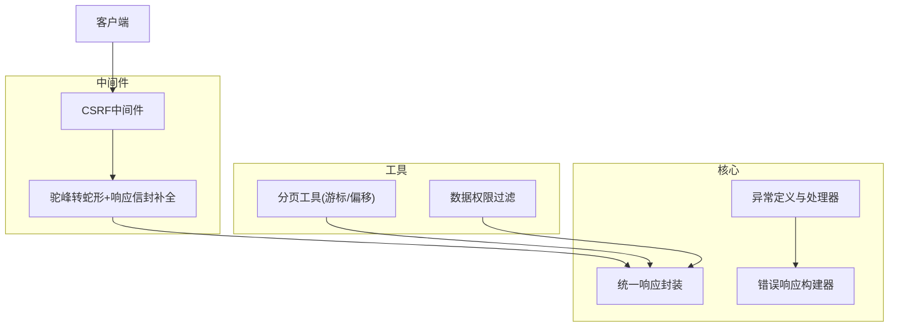
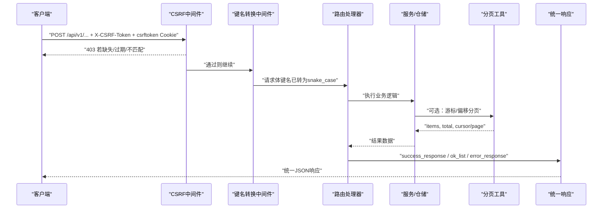
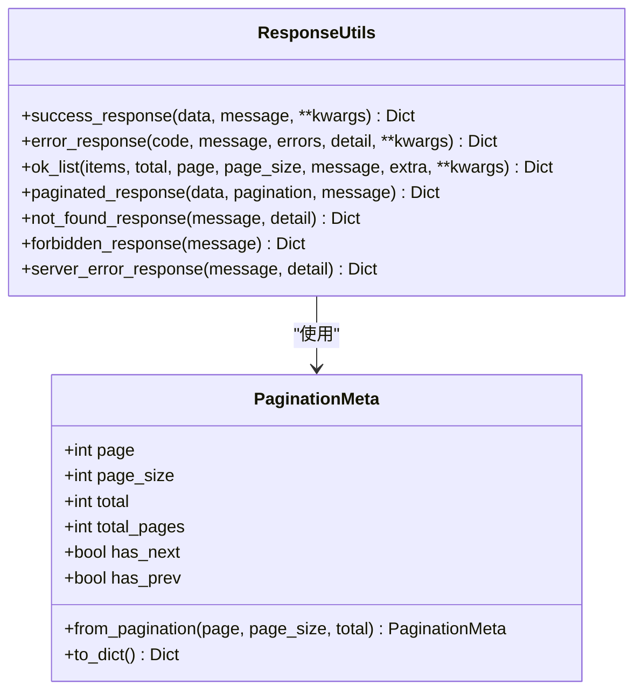
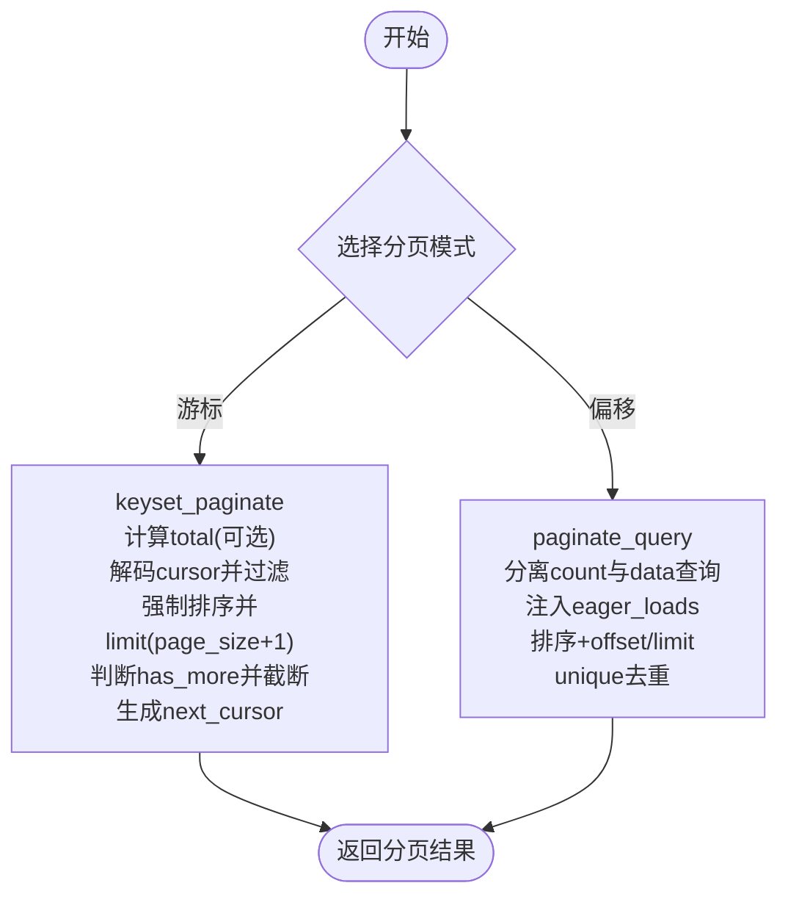
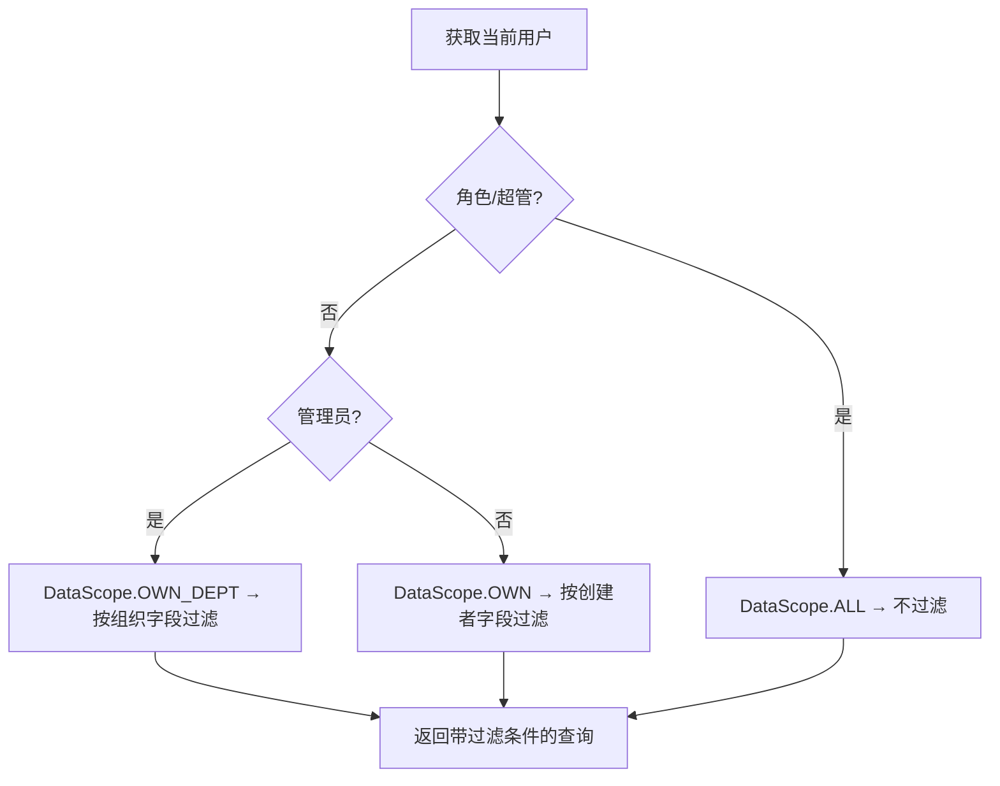
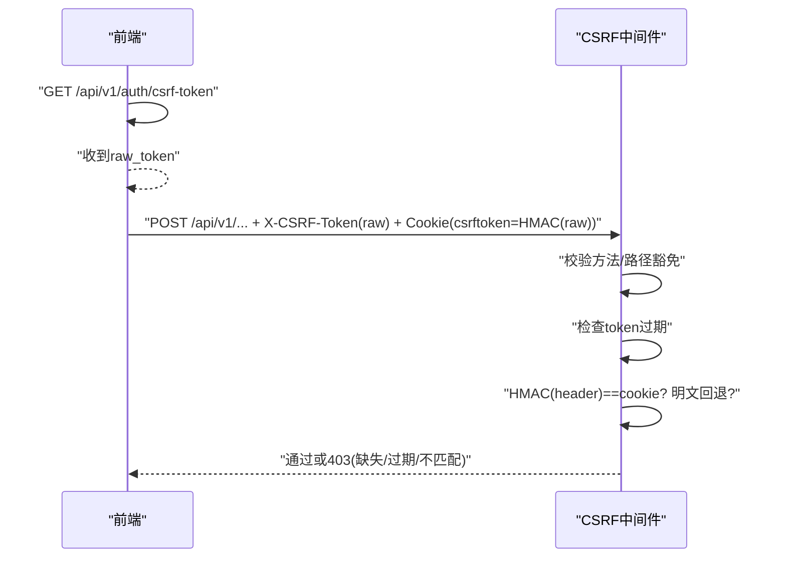
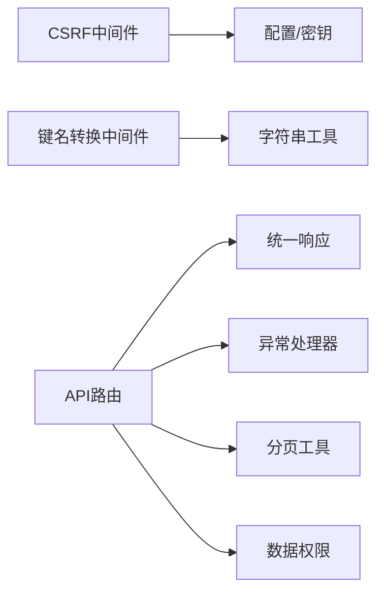

# API设计原则

<cite>
**本文引用的文件**
- [backend/app/core/response.py](file://backend/app/core/response.py)
- [backend/app/core/error_handler.py](file://backend/app/core/error_handler.py)
- [backend/app/core/exceptions.py](file://backend/app/core/exceptions.py)
- [backend/app/middleware/csrf_middleware.py](file://backend/app/middleware/csrf_middleware.py)
- [backend/app/utils/pagination.py](file://backend/app/utils/pagination.py)
- [backend/app/middleware/camel_to_snake.py](file://backend/app/middleware/camel_to_snake.py)
- [backend/app/core/data_permission.py](file://backend/app/core/data_permission.py)
</cite>

## 目录
1. [简介](#简介)
2. [项目结构](#项目结构)
3. [核心组件](#核心组件)
4. [架构总览](#架构总览)
5. [详细组件分析](#详细组件分析)
6. [依赖关系分析](#依赖关系分析)
7. [性能考量](#性能考量)
8. [故障排查指南](#故障排查指南)
9. [结论](#结论)
10. [附录](#附录)

## 简介
本技术文档围绕RESTful API设计原则，结合后端实现，系统阐述资源命名规范、HTTP方法约定、状态码标准；统一响应格式（成功/错误/分页）；请求参数传递方式（查询参数、路径参数、请求体）与命名约定；数据隔离机制、软删除处理、CSRF防护等安全设计。文档提供可追溯的源码引用与图示，帮助团队保持一致性与可维护性。

## 项目结构
本项目采用分层与模块化组织：
- 核心响应与异常：统一响应信封、错误构造、全局异常处理器
- 中间件层：CSRF保护、请求键名转换与响应信封补全
- 工具库：分页（游标/偏移）、数据权限过滤
- 业务API：按领域划分的路由与服务（不在本文展开）

**图表来源**
- [backend/app/middleware/csrf_middleware.py:177-284](file://backend/app/middleware/csrf_middleware.py#L177-L284)
- [backend/app/middleware/camel_to_snake.py:59-106](file://backend/app/middleware/camel_to_snake.py#L59-L106)
- [backend/app/core/response.py:12-178](file://backend/app/core/response.py#L12-L178)
- [backend/app/core/exceptions.py:121-145](file://backend/app/core/exceptions.py#L121-L145)
- [backend/app/utils/pagination.py:62-227](file://backend/app/utils/pagination.py#L62-L227)
- [backend/app/core/data_permission.py:83-170](file://backend/app/core/data_permission.py#L83-L170)

**章节来源**
- [backend/app/core/response.py:12-178](file://backend/app/core/response.py#L12-L178)
- [backend/app/core/exceptions.py:121-145](file://backend/app/core/exceptions.py#L121-L145)
- [backend/app/middleware/csrf_middleware.py:177-284](file://backend/app/middleware/csrf_middleware.py#L177-L284)
- [backend/app/middleware/camel_to_snake.py:59-106](file://backend/app/middleware/camel_to_snake.py#L59-L106)
- [backend/app/utils/pagination.py:62-227](file://backend/app/utils/pagination.py#L62-L227)
- [backend/app/core/data_permission.py:83-170](file://backend/app/core/data_permission.py#L83-L170)

## 核心组件
- 统一响应封装：成功响应、错误响应、分页元信息、列表信封
- 异常体系：应用级异常、验证失败、未捕获异常的统一处理
- CSRF中间件：HMAC签名校验、过期检测、豁免路径与安全方法放行
- 分页工具：Keyset游标分页与Offset传统分页，适配SQLAlchemy 2.0
- 数据权限：基于角色的数据范围（全部/本部门/本人），自动注入查询过滤
- 请求/响应规范化：前端camelCase到后端snake_case自动转换，裸字典响应最小补全

**章节来源**
- [backend/app/core/response.py:12-178](file://backend/app/core/response.py#L12-L178)
- [backend/app/core/exceptions.py:11-145](file://backend/app/core/exceptions.py#L11-L145)
- [backend/app/middleware/csrf_middleware.py:177-284](file://backend/app/middleware/csrf_middleware.py#L177-L284)
- [backend/app/utils/pagination.py:62-227](file://backend/app/utils/pagination.py#L62-L227)
- [backend/app/core/data_permission.py:20-170](file://backend/app/core/data_permission.py#L20-L170)
- [backend/app/middleware/camel_to_snake.py:59-106](file://backend/app/middleware/camel_to_snake.py#L59-L106)

## 架构总览
下图展示一次受CSRF保护的写请求在中间件与核心层的流转，以及统一响应与分页数据的生成过程。

**图表来源**
- [backend/app/middleware/csrf_middleware.py:177-284](file://backend/app/middleware/csrf_middleware.py#L177-L284)
- [backend/app/middleware/camel_to_snake.py:59-106](file://backend/app/middleware/camel_to_snake.py#L59-L106)
- [backend/app/utils/pagination.py:62-227](file://backend/app/utils/pagination.py#L62-L227)
- [backend/app/core/response.py:52-178](file://backend/app/core/response.py#L52-L178)

## 详细组件分析

### RESTful 资源与方法约定
- 资源命名
  - 使用复数名词表示集合资源，如“资金”、“项目”、“组织”
  - 路径层级体现资源从属关系，如 /api/v1/organizations/{org_id}/projects
  - 避免动词出现在URL中，操作语义由HTTP方法表达
- HTTP方法
  - GET：读取资源或集合（幂等、安全）
  - POST：创建子资源或发起动作（非幂等）
  - PUT：完整更新资源（幂等）
  - PATCH：部分更新资源（幂等）
  - DELETE：删除资源（幂等）
- 状态码
  - 200/201/204：成功、已创建、无内容
  - 400/401/403/404/409/422/500：参数错误、未认证、禁止访问、资源不存在、冲突、验证失败、服务器错误
  - 错误响应统一包含 code、message、success，必要时附加 errors/detail

**章节来源**
- [backend/app/core/response.py:101-178](file://backend/app/core/response.py#L101-L178)
- [backend/app/core/exceptions.py:121-145](file://backend/app/core/exceptions.py#L121-L145)

### 统一响应格式规范
- 成功响应
  - 基础结构：code=200、message、success=True，data为业务数据
  - 列表响应：使用列表信封，包含 items、total、page、page_size，支持 extra 扩展字段
- 错误响应
  - 基础结构：code、message、success=False，errors/detail 按需附加
  - 预置便捷函数：not_found、forbidden、server_error
- 分页元信息
  - PaginationMeta：page、page_size、total、total_pages、has_next、has_prev
  - 分页响应：在成功响应基础上追加 meta.pagination

**图表来源**
- [backend/app/core/response.py:12-178](file://backend/app/core/response.py#L12-L178)

**章节来源**
- [backend/app/core/response.py:12-178](file://backend/app/core/response.py#L12-L178)

### 请求参数传递与命名约定
- 查询参数
  - 用于筛选、排序、分页，如 page、page_size、order_by、filter_*
  - 保持小写下划线命名，避免歧义
- 路径参数
  - 用于标识资源ID或从属关系，如 org_id、project_id
  - 使用短横线或下划线均可，但需一致
- 请求体参数
  - 前端使用 camelCase，中间件自动转换为 snake_case 供Pydantic模型解析
  - 对裸字典响应进行最小补全（code/success/message），不改变数据层级
- 示例参考
  - 键名转换与响应补全流程见中间件实现

**章节来源**
- [backend/app/middleware/camel_to_snake.py:59-106](file://backend/app/middleware/camel_to_snake.py#L59-L106)

### 分页数据结构与最佳实践
- Keyset 游标分页
  - 适用于大数据量、无限滚动场景，性能 O(log N + page_size)
  - 返回 next_cursor、has_more、pagination="keyset"
- Offset 传统分页
  - 适用于后台管理列表，精确页码跳转
  - 返回 page、page_size、total、pagination="offset"
- 建议
  - 大表优先使用游标分页；需要统计总数时谨慎开启 calculate_total
  - 使用 unique() 去重避免 joinedload 导致的重复行

**图表来源**
- [backend/app/utils/pagination.py:62-154](file://backend/app/utils/pagination.py#L62-L154)
- [backend/app/utils/pagination.py:161-227](file://backend/app/utils/pagination.py#L161-L227)

**章节来源**
- [backend/app/utils/pagination.py:62-227](file://backend/app/utils/pagination.py#L62-L227)

### 数据隔离机制
- 数据范围枚举
  - ALL：超级管理员可见全部
  - OWN_DEPT：管理员可见本部门/组织
  - OWN：普通用户仅可见本人记录
- 自动过滤
  - apply_scope_to_query 根据角色与字段（created_by、organization_id）动态注入过滤条件
  - 缺省策略：fail-closed，当模型缺少必要字段时返回空集，避免越权
- 单条记录检查
  - check_record_access 快速判定是否允许访问某条记录

**图表来源**
- [backend/app/core/data_permission.py:20-170](file://backend/app/core/data_permission.py#L20-L170)

**章节来源**
- [backend/app/core/data_permission.py:20-170](file://backend/app/core/data_permission.py#L20-L170)

### 软删除处理
- 现状说明
  - 迁移脚本中存在回收站保留与软删除相关变更（如 recycle_retention_001_add_deleted_at.py、village_softdel_001_add_is_active.py、fund_project_softdel_001_add_is_active.py）
  - 建议在查询中默认排除已删除记录，并提供显式接口查看回收站
- 建议实践
  - 所有列表查询默认添加 is_active=false 或 deleted_at IS NULL 的条件
  - 删除接口改为标记删除而非物理删除，并记录审计日志

**章节来源**
- [backend/alembic/versions/recycle_retention_001_add_deleted_at.py](file://backend/alembic/versions/recycle_retention_001_add_deleted_at.py)
- [backend/alembic/versions/village_softdel_001_add_is_active.py](file://backend/alembic/versions/village_softdel_001_add_is_active.py)
- [backend/alembic/versions/fund_project_softdel_001_add_is_active.py](file://backend/alembic/versions/fund_project_softdel_001_add_is_active.py)

### CSRF防护
- 双提交Cookie增强（HMAC签名）
  - 前端先GET /api/v1/auth/csrf-token 获取原始token
  - 服务端设置 csrftoken Cookie = HMAC-SHA256(raw_token)
  - 请求头携带 X-CSRF-Token = raw_token
  - 服务端验证 HMAC(header) == cookie（常量时间比较）
- 过期检测
  - token内嵌时间戳，超过有效期拒绝
- 豁免与安全方法
  - GET/HEAD/OPTIONS 直接放行
  - 指定豁免路径前缀（如健康检查、登录注册、文档）
- 代理透传
  - 支持 TRUSTED_PROXIES 配置，可信代理才信任 X-Forwarded-For

**图表来源**
- [backend/app/middleware/csrf_middleware.py:65-125](file://backend/app/middleware/csrf_middleware.py#L65-L125)
- [backend/app/middleware/csrf_middleware.py:177-284](file://backend/app/middleware/csrf_middleware.py#L177-L284)

**章节来源**
- [backend/app/middleware/csrf_middleware.py:65-125](file://backend/app/middleware/csrf_middleware.py#L65-L125)
- [backend/app/middleware/csrf_middleware.py:177-284](file://backend/app/middleware/csrf_middleware.py#L177-L284)

### 错误处理与状态码
- 应用异常
  - AppError及其子类：BusinessError、NotFoundError、ConflictError、DatabaseError、InvalidCredentialsError、UserAlreadyExistsError
  - 统一转换为 JSONResponse，包含 code、message、success
- 参数验证
  - PydanticValidationError 映射为 422，附带 errors 数组
- 全局兜底
  - 未捕获异常统一返回 500，避免泄露内部细节

**章节来源**
- [backend/app/core/exceptions.py:11-145](file://backend/app/core/exceptions.py#L11-L145)
- [backend/app/core/error_handler.py:38-108](file://backend/app/core/error_handler.py#L38-L108)

## 依赖关系分析
- 中间件依赖
  - CSRF中间件依赖配置与加密能力（HMAC、随机数）
  - 键名转换中间件依赖字符串工具与JSON编解码
- 核心模块依赖
  - 统一响应被各API广泛使用，保证一致性
  - 异常处理器集中管理错误输出
- 工具模块依赖
  - 分页工具依赖SQLAlchemy 2.0语法
  - 数据权限依赖角色归一化与常量定义

**图表来源**
- [backend/app/middleware/csrf_middleware.py:177-284](file://backend/app/middleware/csrf_middleware.py#L177-L284)
- [backend/app/middleware/camel_to_snake.py:59-106](file://backend/app/middleware/camel_to_snake.py#L59-L106)
- [backend/app/core/response.py:12-178](file://backend/app/core/response.py#L12-L178)
- [backend/app/core/exceptions.py:121-145](file://backend/app/core/exceptions.py#L121-L145)
- [backend/app/utils/pagination.py:62-227](file://backend/app/utils/pagination.py#L62-L227)
- [backend/app/core/data_permission.py:20-170](file://backend/app/core/data_permission.py#L20-L170)

**章节来源**
- [backend/app/middleware/csrf_middleware.py:177-284](file://backend/app/middleware/csrf_middleware.py#L177-L284)
- [backend/app/middleware/camel_to_snake.py:59-106](file://backend/app/middleware/camel_to_snake.py#L59-L106)
- [backend/app/core/response.py:12-178](file://backend/app/core/response.py#L12-L178)
- [backend/app/core/exceptions.py:121-145](file://backend/app/core/exceptions.py#L121-L145)
- [backend/app/utils/pagination.py:62-227](file://backend/app/utils/pagination.py#L62-L227)
- [backend/app/core/data_permission.py:20-170](file://backend/app/core/data_permission.py#L20-L170)

## 性能考量
- 分页优化
  - 大数据集优先使用Keyset游标分页，避免OFFSET全表扫描
  - 关闭不必要的total计算以提升吞吐
  - 使用unique()去重避免joinedload带来的笛卡尔积
- 查询过滤
  - 数据权限自动注入WHERE条件，减少无效数据传输
- 中间件开销
  - 键名转换仅在JSON请求体上执行，避免额外开销
  - CSRF校验仅在状态变更请求上进行，安全方法直接放行

[本节为通用指导，无需具体文件引用]

## 故障排查指南
- CSRF失败
  - 检查是否调用 /api/v1/auth/csrf-token 获取token
  - 确认X-CSRF-Token与csrftoken Cookie同时存在且匹配
  - 关注过期提示与降级日志（明文比对警告）
- 参数验证失败
  - 422响应包含errors数组，定位具体字段
- 数据越权
  - 检查数据权限范围与模型字段是否存在（created_by、organization_id）
  - 若模型缺少字段，将触发fail-closed返回空集
- 分页异常
  - 游标编码/解码失败会记录警告并忽略该cursor
  - OFFSET分页注意eager_loads与排序列的一致性

**章节来源**
- [backend/app/middleware/csrf_middleware.py:211-284](file://backend/app/middleware/csrf_middleware.py#L211-L284)
- [backend/app/core/exceptions.py:131-145](file://backend/app/core/exceptions.py#L131-L145)
- [backend/app/core/data_permission.py:120-134](file://backend/app/core/data_permission.py#L120-L134)
- [backend/app/utils/pagination.py:41-55](file://backend/app/utils/pagination.py#L41-L55)

## 结论
通过统一的响应封装、严格的异常处理、健壮的CSRF防护、高性能分页与细粒度数据权限控制，本项目实现了高一致性、可维护且安全的RESTful API设计。遵循本文的资源命名、方法约定、状态码标准与参数传递规范，可确保前后端契约稳定，降低集成成本与维护风险。

## 附录
- 最佳实践清单
  - 所有列表接口使用统一列表信封（ok_list）
  - 大表优先Keyset分页，必要时关闭total计算
  - 所有写操作启用CSRF校验，遵循双提交流程
  - 查询默认按数据权限过滤，避免手动拼接WHERE
  - 错误统一通过异常体系抛出，交由全局处理器格式化
  - 软删除记录默认隐藏，提供独立回收站接口

[本节为通用指导，无需具体文件引用]