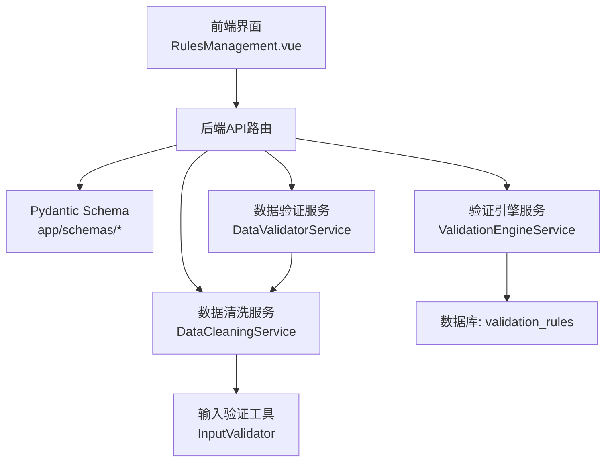
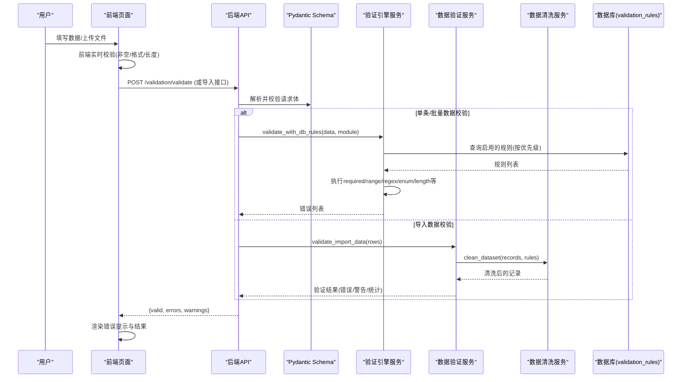
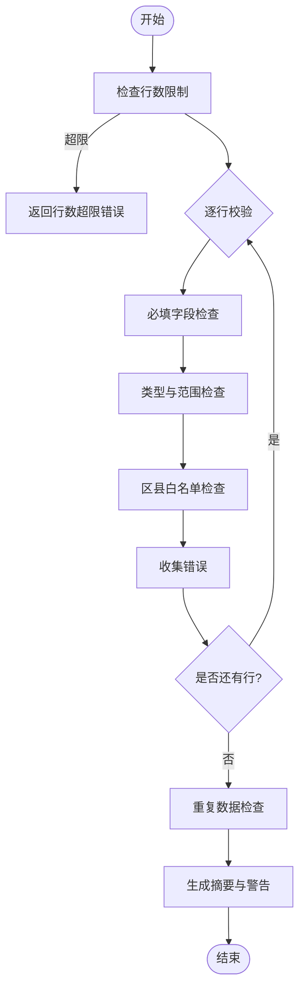
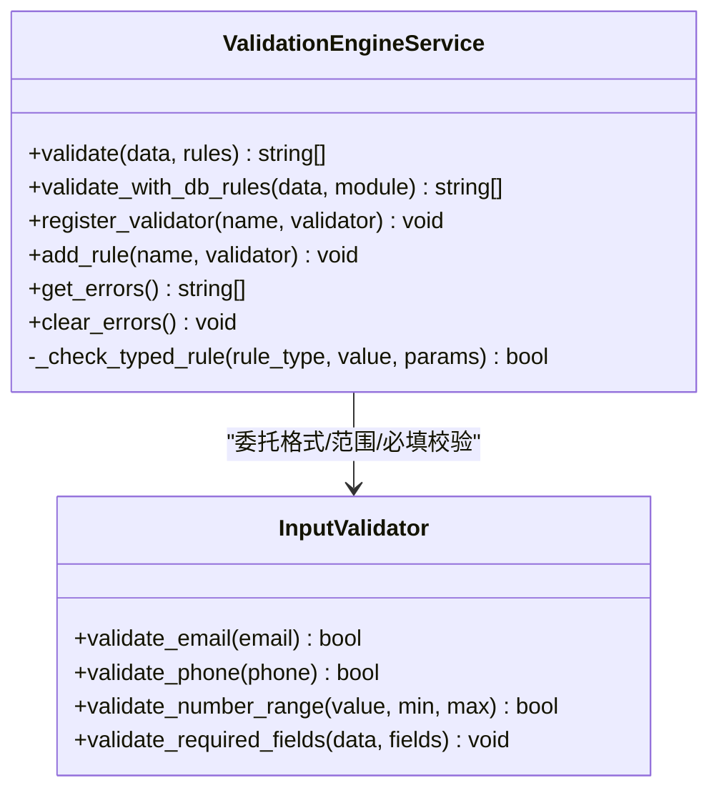
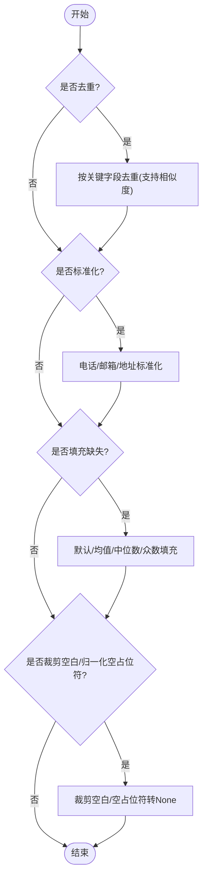
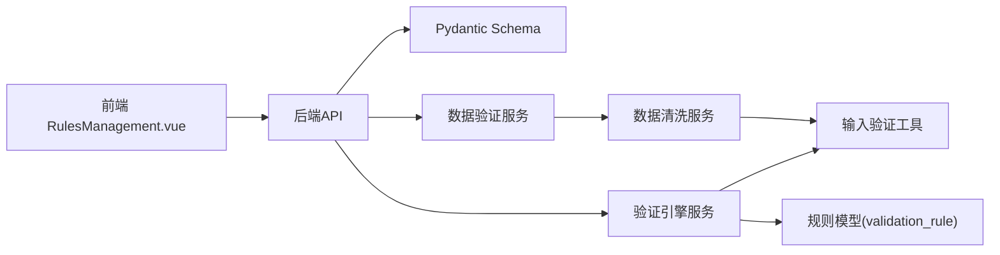

# 数据验证规则

<cite>
**本文引用的文件**
- [backend/app/schemas/__init__.py](file://backend/app/schemas/__init__.py)
- [backend/app/services/data_validator_service.py](file://backend/app/services/data_validator_service.py)
- [backend/app/services/validation_engine_service.py](file://backend/app/services/validation_engine_service.py)
- [backend/app/models/validation_rule.py](file://backend/app/models/validation_rule.py)
- [backend/app/utils/input_validator.py](file://backend/app/utils/input_validator.py)
- [backend/app/services/data_cleaning_service.py](file://backend/app/services/data_cleaning_service.py)
- [frontend/src/views/dataVerify/RulesManagement.vue](file://frontend/src/views/dataVerify/RulesManagement.vue)
- [frontend/tests/unit/api/validationRules.test.ts](file://frontend/tests/unit/api/validationRules.test.ts)
- [frontend/tests/unit/views/dataVerify/RulesManagementCov.test.ts](file://frontend/tests/unit/views/dataVerify/RulesManagementCov.test.ts)
- [backend/tests/unit/test_validation.py](file://backend/tests/unit/test_validation.py)
- [backend/tests/unit/test_data_validator_service.py](file://backend/tests/unit/test_data_validator_service.py)
- [backend/tests/unit/test_data_cleaning_service.py](file://backend/tests/unit/test_data_cleaning_service.py)
</cite>

## 目录
1. [简介](#简介)
2. [项目结构](#项目结构)
3. [核心组件](#核心组件)
4. [架构总览](#架构总览)
5. [详细组件分析](#详细组件分析)
6. [依赖关系分析](#依赖关系分析)
7. [性能考量](#性能考量)
8. [故障排查指南](#故障排查指南)
9. [结论](#结论)
10. [附录：示例与测试用例索引](#附录示例与测试用例索引)

## 简介
本技术文档围绕“数据验证规则”展开，系统阐述后端基于 Pydantic 的模型校验、通用数据验证服务、可配置验证引擎、数据清洗与标准化处理，以及前后端协同的验证策略与错误反馈机制。文档覆盖字段类型检查、格式验证、自定义验证器实现；业务规则验证（完整性、约束、跨字段关联）；前端实时校验与后端严格校验的分工；输入过滤、格式转换、敏感数据处理等关键能力，并给出具体示例与测试用例定位，确保数据的准确性与一致性。

## 项目结构
本项目在后端采用分层设计：
- 接口层：FastAPI 路由接收请求，使用 Pydantic 模型进行入参校验与序列化。
- 服务层：提供领域验证与清洗能力，如数据导入验证、通用验证引擎、数据清洗。
- 模型层：ORM 模型定义数据库表结构与枚举约束。
- 工具层：输入安全与格式校验工具。
- 前端：Vue + Element Plus 页面负责规则管理与运行时的前端校验与结果展示。

图表来源
- [backend/app/services/validation_engine_service.py:1-217](file://backend/app/services/validation_engine_service.py#L1-L217)
- [backend/app/services/data_validator_service.py:1-800](file://backend/app/services/data_validator_service.py#L1-L800)
- [backend/app/services/data_cleaning_service.py:1-297](file://backend/app/services/data_cleaning_service.py#L1-L297)
- [backend/app/utils/input_validator.py:1-124](file://backend/app/utils/input_validator.py#L1-L124)
- [backend/app/models/validation_rule.py:1-55](file://backend/app/models/validation_rule.py#L1-L55)
- [frontend/src/views/dataVerify/RulesManagement.vue:215-260](file://frontend/src/views/dataVerify/RulesManagement.vue#L215-L260)

章节来源
- [backend/app/schemas/__init__.py:1-53](file://backend/app/schemas/__init__.py#L1-L53)
- [backend/app/services/validation_engine_service.py:1-217](file://backend/app/services/validation_engine_service.py#L1-L217)
- [backend/app/services/data_validator_service.py:1-800](file://backend/app/services/data_validator_service.py#L1-L800)
- [backend/app/services/data_cleaning_service.py:1-297](file://backend/app/services/data_cleaning_service.py#L1-L297)
- [backend/app/utils/input_validator.py:1-124](file://backend/app/utils/input_validator.py#L1-L124)
- [backend/app/models/validation_rule.py:1-55](file://backend/app/models/validation_rule.py#L1-L55)
- [frontend/src/views/dataVerify/RulesManagement.vue:215-260](file://frontend/src/views/dataVerify/RulesManagement.vue#L215-L260)

## 核心组件
- Pydantic Schema 注册中心：动态加载各模块下的 Pydantic BaseModel，统一对外暴露，便于 FastAPI 路由自动校验与 OpenAPI 生成。
- 数据验证服务：面向 Excel/批量导入场景，提供文件格式、大小、行数限制、必填字段、类型与范围、重复检测、区县白名单等校验，并输出结构化错误摘要。
- 通用验证引擎：支持 required/range/regex/enum/length/positive/non_negative 等规则，可从数据库加载 ValidationRule 执行校验，也可通过 API 直接传入规则。
- 数据清洗服务：提供去重（含相似度）、格式标准化（电话/邮箱/地址）、缺失值填充（默认/均值/中位数/众数）、空白裁剪与空占位符归一化。
- 输入验证工具：XSS/SQL注入防护、邮箱/手机/身份证格式校验、文件大小与扩展名校验、必填字段校验。
- 可配置规则模型：以数据库表存储字段级规则（必填、正数、日期格式、文件类型、长度、范围、正则、跨字段逻辑、枚举），支持优先级与启用状态。

章节来源
- [backend/app/schemas/__init__.py:1-53](file://backend/app/schemas/__init__.py#L1-L53)
- [backend/app/services/data_validator_service.py:1-800](file://backend/app/services/data_validator_service.py#L1-L800)
- [backend/app/services/validation_engine_service.py:1-217](file://backend/app/services/validation_engine_service.py#L1-L217)
- [backend/app/services/data_cleaning_service.py:1-297](file://backend/app/services/data_cleaning_service.py#L1-L297)
- [backend/app/utils/input_validator.py:1-124](file://backend/app/utils/input_validator.py#L1-L124)
- [backend/app/models/validation_rule.py:1-55](file://backend/app/models/validation_rule.py#L1-L55)

## 架构总览
下图展示了从前端到后端的完整验证链路：前端对表单进行轻量校验并调用运行校验接口；后端先做基础格式与安全校验，再根据模块加载数据库中的规则进行业务校验；对于导入场景，走数据验证服务与清洗服务流水线；最终返回结构化错误信息供前端渲染。

图表来源
- [backend/app/services/validation_engine_service.py:93-123](file://backend/app/services/validation_engine_service.py#L93-L123)
- [backend/app/services/data_validator_service.py:514-590](file://backend/app/services/data_validator_service.py#L514-L590)
- [backend/app/services/data_cleaning_service.py:232-279](file://backend/app/services/data_cleaning_service.py#L232-L279)
- [backend/app/models/validation_rule.py:31-55](file://backend/app/models/validation_rule.py#L31-L55)
- [frontend/src/views/dataVerify/RulesManagement.vue:215-260](file://frontend/src/views/dataVerify/RulesManagement.vue#L215-L260)

## 详细组件分析

### Pydantic 模型与 Schema 注册
- 作用：集中管理各模块的 Pydantic 模型，通过动态导入将 BaseModel 子类注册到全局，便于 FastAPI 路由自动校验与文档生成。
- 关键点：
  - 可选模块按需加载，失败时记录日志不影响启动。
  - 支持显式 __all__ 导出或自动发现 BaseModel 子类。
- 适用场景：所有 API 入参/出参的结构化校验与序列化。

章节来源
- [backend/app/schemas/__init__.py:1-53](file://backend/app/schemas/__init__.py#L1-L53)

### 数据验证服务（导入与批量校验）
- 职责：针对 Excel/批量导入场景，提供文件类型、大小、行数限制、必填字段、类型与范围、区县白名单、重复数据检查，并输出结构化错误与警告。
- 关键能力：
  - 行级校验：必填、类型转换、数值范围、布尔值规范化、区县白名单。
  - 批量校验：汇总错误、计算有效行数、生成质量警告。
  - 重复检测：基于关键字段组合去重。
  - 结果摘要：按错误类型/字段分组统计，便于前端展示。
- 复杂度：逐行 O(N)，重复检测 O(N) 哈希；总体线性时间。

图表来源
- [backend/app/services/data_validator_service.py:218-302](file://backend/app/services/data_validator_service.py#L218-L302)
- [backend/app/services/data_validator_service.py:514-590](file://backend/app/services/data_validator_service.py#L514-L590)
- [backend/app/services/data_validator_service.py:626-665](file://backend/app/services/data_validator_service.py#L626-L665)

章节来源
- [backend/app/services/data_validator_service.py:1-800](file://backend/app/services/data_validator_service.py#L1-L800)

### 通用验证引擎（可配置规则）
- 职责：提供统一的规则执行器，支持 required/range/regex/enum/length/positive/non_negative 等规则；可从数据库加载 ValidationRule 并按优先级执行。
- 关键点：
  - 规则参数来自 JSON，灵活扩展。
  - 支持注册自定义验证器，便于业务扩展。
  - 当数据库不可用时降级为空规则集，保证可用性。
- 复杂度：每条规则 O(1)，整体 O(M) 其中 M 为规则数量。

图表来源
- [backend/app/services/validation_engine_service.py:18-177](file://backend/app/services/validation_engine_service.py#L18-L177)
- [backend/app/utils/input_validator.py:12-124](file://backend/app/utils/input_validator.py#L12-L124)

章节来源
- [backend/app/services/validation_engine_service.py:1-217](file://backend/app/services/validation_engine_service.py#L1-L217)
- [backend/app/utils/input_validator.py:1-124](file://backend/app/utils/input_validator.py#L1-L124)

### 数据清洗与标准化
- 职责：在入库前对数据进行去重、格式标准化、缺失值填充、空白裁剪与空占位符归一化，提升数据一致性与质量。
- 关键能力：
  - 去重：支持模糊匹配（相似度阈值）。
  - 标准化：电话（仅数字）、邮箱（小写+格式校验）、地址（统一行政区划后缀）。
  - 缺失值填充：默认值、均值、中位数、众数。
  - 空白与占位符：去除首尾空白，将常见占位符转为 None。
- 复杂度：去重 O(N^2) 最坏（可通过键优化至 O(N)），其余线性。

图表来源
- [backend/app/services/data_cleaning_service.py:17-297](file://backend/app/services/data_cleaning_service.py#L17-L297)

章节来源
- [backend/app/services/data_cleaning_service.py:1-297](file://backend/app/services/data_cleaning_service.py#L1-L297)

### 可配置规则模型（数据库驱动）
- 职责：持久化字段级校验规则，支持必填、正数、非负数、日期格式、文件类型、长度、范围、正则、跨字段逻辑、枚举值等。
- 关键点：
  - 每个规则包含模块、字段、类型、参数、错误消息、描述、启用状态、优先级。
  - 验证引擎按模块加载并排序执行，保障业务规则的可维护性与灵活性。

章节来源
- [backend/app/models/validation_rule.py:1-55](file://backend/app/models/validation_rule.py#L1-L55)

### 前后端验证策略与错误反馈
- 前端实时验证：
  - 表单提交前进行非空、格式、长度等基础校验，减少无效请求。
  - 提供“运行校验”功能，将测试数据发送至后端，渲染返回的错误列表。
- 后端严格验证：
  - 使用 Pydantic 模型校验入参结构。
  - 通过验证引擎加载数据库规则进行业务校验。
  - 导入流程使用数据验证服务与清洗服务，确保数据质量。
- 错误反馈机制：
  - 结构化错误对象（字段、错误码、消息、样例值）。
  - 前端按字段聚合展示，支持分页与高亮。

章节来源
- [frontend/src/views/dataVerify/RulesManagement.vue:215-260](file://frontend/src/views/dataVerify/RulesManagement.vue#L215-L260)
- [frontend/tests/unit/api/validationRules.test.ts:48-75](file://frontend/tests/unit/api/validationRules.test.ts#L48-L75)
- [frontend/tests/unit/views/dataVerify/RulesManagementCov.test.ts:503-537](file://frontend/tests/unit/views/dataVerify/RulesManagementCov.test.ts#L503-L537)
- [backend/app/services/validation_engine_service.py:93-123](file://backend/app/services/validation_engine_service.py#L93-L123)
- [backend/app/services/data_validator_service.py:626-665](file://backend/app/services/data_validator_service.py#L626-L665)

## 依赖关系分析
- 组件耦合：
  - 验证引擎依赖输入验证工具与数据库规则模型。
  - 数据验证服务依赖数据清洗服务与输入验证工具。
  - 前端依赖后端提供的运行校验接口。
- 外部依赖：
  - FastAPI/Pydantic：请求解析与模型校验。
  - SQLAlchemy：数据库访问与规则加载。
  - Element Plus：前端 UI 与交互。

图表来源
- [backend/app/services/validation_engine_service.py:1-217](file://backend/app/services/validation_engine_service.py#L1-L217)
- [backend/app/services/data_validator_service.py:1-800](file://backend/app/services/data_validator_service.py#L1-L800)
- [backend/app/services/data_cleaning_service.py:1-297](file://backend/app/services/data_cleaning_service.py#L1-L297)
- [backend/app/models/validation_rule.py:1-55](file://backend/app/models/validation_rule.py#L1-L55)
- [frontend/src/views/dataVerify/RulesManagement.vue:215-260](file://frontend/src/views/dataVerify/RulesManagement.vue#L215-L260)

章节来源
- [backend/app/services/validation_engine_service.py:1-217](file://backend/app/services/validation_engine_service.py#L1-L217)
- [backend/app/services/data_validator_service.py:1-800](file://backend/app/services/data_validator_service.py#L1-L800)
- [backend/app/services/data_cleaning_service.py:1-297](file://backend/app/services/data_cleaning_service.py#L1-L297)
- [backend/app/models/validation_rule.py:1-55](file://backend/app/models/validation_rule.py#L1-L55)
- [frontend/src/views/dataVerify/RulesManagement.vue:215-260](file://frontend/src/views/dataVerify/RulesManagement.vue#L215-L260)

## 性能考量
- 批量导入：
  - 建议限制单次导入行数，避免内存与CPU压力。
  - 重复检测可使用哈希键优化，降低比较次数。
- 规则执行：
  - 规则数量较多时，优先执行快速短路规则（如 required）。
  - 正则表达式应预编译，避免重复开销。
- 数据清洗：
  - 去重相似度计算成本较高，建议在大数据集上谨慎使用或分片处理。
  - 标准化与填充操作均为线性，注意批量处理的并发控制。

[本节为通用指导，不直接分析具体文件]

## 故障排查指南
- 常见问题定位：
  - 必填字段缺失：检查 required 规则与前端校验是否一致。
  - 格式错误：核对 regex 模式与输入规范（邮箱/手机/身份证）。
  - 范围越界：确认 min/max 配置与业务语义。
  - 重复数据：检查去重键字段与相似度阈值。
  - 导入失败：查看错误摘要中的错误类型与字段分布。
- 调试建议：
  - 开启详细日志，关注规则加载与执行过程。
  - 使用单元测试覆盖边界条件（空值、超长、非法字符、极端数值）。
  - 在前端“运行校验”页面构造最小复现用例，逐步缩小问题范围。

章节来源
- [backend/tests/unit/test_data_validator_service.py:708-764](file://backend/tests/unit/test_data_validator_service.py#L708-L764)
- [backend/tests/unit/test_validation.py:351-399](file://backend/tests/unit/test_validation.py#L351-L399)
- [backend/tests/unit/test_data_cleaning_service.py:102-322](file://backend/tests/unit/test_data_cleaning_service.py#L102-L322)

## 结论
本方案通过 Pydantic 模型、通用验证引擎、可配置规则模型与数据清洗服务，构建了从前端到后端的完整数据验证体系。前端负责用户体验友好的实时校验，后端承担严格的业务规则与数据安全校验；导入场景通过数据验证与清洗流水线保障数据质量。该体系具备良好的可扩展性、可维护性与可观测性，能够有效支撑复杂业务的数据一致性要求。

[本节为总结性内容，不直接分析具体文件]

## 附录：示例与测试用例索引
- 身份证号验证与重复检测：
  - 参考：[backend/app/services/data_validator_service.py:724-791](file://backend/app/services/data_validator_service.py#L724-L791)
- 日期格式与范围校验：
  - 参考：[backend/tests/unit/test_data_validator_service.py:708-722](file://backend/tests/unit/test_data_validator_service.py#L708-L722)
- 必填字段校验：
  - 参考：[backend/tests/unit/test_data_validator_service.py:723-751](file://backend/tests/unit/test_data_validator_service.py#L723-L751)
- 字段长度校验：
  - 参考：[backend/tests/unit/test_data_validator_service.py:752-764](file://backend/tests/unit/test_data_validator_service.py#L752-L764)
- 跨字段关联验证（>=、<=、==、<、>）：
  - 参考：[backend/tests/unit/test_validation.py:351-399](file://backend/tests/unit/test_validation.py#L351-L399)
- 数据清洗（去重、标准化、填充、空白裁剪）：
  - 参考：[backend/tests/unit/test_data_cleaning_service.py:191-322](file://backend/tests/unit/test_data_cleaning_service.py#L191-L322)
- 前端运行校验与错误渲染：
  - 参考：[frontend/tests/unit/views/dataVerify/RulesManagementCov.test.ts:503-537](file://frontend/tests/unit/views/dataVerify/RulesManagementCov.test.ts#L503-L537)
  - 参考：[frontend/tests/unit/api/validationRules.test.ts:48-75](file://frontend/tests/unit/api/validationRules.test.ts#L48-L75)

[本节为索引性内容，不直接分析具体文件]