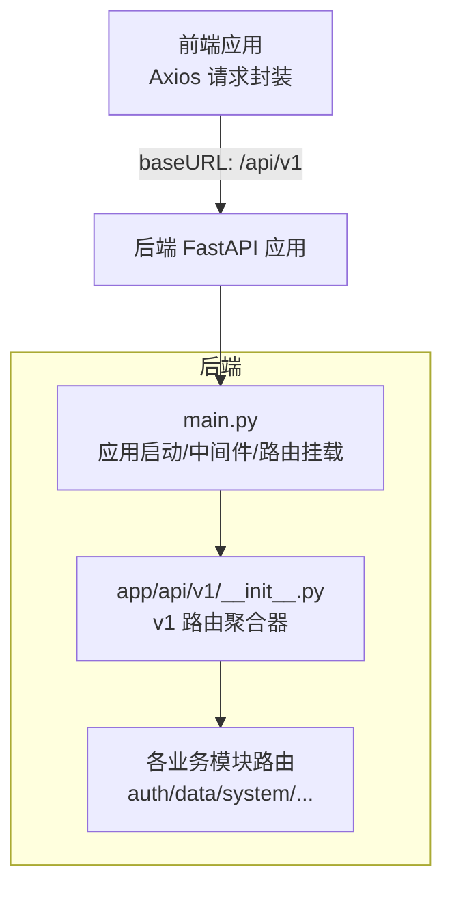
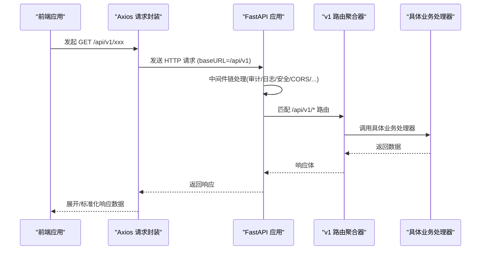
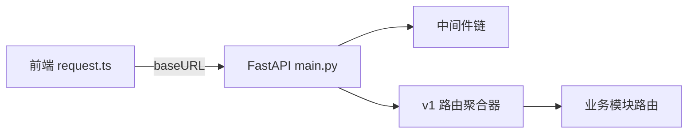

# 版本控制策略

<cite>
**本文引用的文件**
- [backend/app/main.py](file://backend/app/main.py)
- [backend/app/api/__init__.py](file://backend/app/api/__init__.py)
- [backend/app/api/v1/__init__.py](file://backend/app/api/v1/__init__.py)
- [frontend/src/api/request.ts](file://frontend/src/api/request.ts)
- [docs/03-开发文档/03-API文档/API_VERSION_CONTROL_STRATEGY.md](file://docs/03-开发文档/03-API文档/API_VERSION_CONTROL_STRATEGY.md)
</cite>

## 目录
1. [引言](#引言)
2. [项目结构](#项目结构)
3. [核心组件](#核心组件)
4. [架构总览](#架构总览)
5. [详细组件分析](#详细组件分析)
6. [依赖关系分析](#依赖关系分析)
7. [性能考量](#性能考量)
8. [故障排查指南](#故障排查指南)
9. [结论](#结论)
10. [附录](#附录)

## 引言
本技术文档围绕本项目的API版本控制策略，系统阐述版本管理的重要性、向后兼容与废弃接口处理原则、版本标识方法（URL路径版本化、请求头版本控制、内容协商）、版本迁移流程（新版本发布、旧版本支持周期、废弃通知机制），以及前端适配策略（客户端版本检测、降级处理、功能特性探测）。目标是确保API演进的平滑性与稳定性，降低升级风险并提升可维护性。

## 项目结构
本项目采用“后端FastAPI + 前端Vue”的架构，API路由以版本化前缀组织，当前已实现v1版本；前端通过统一的HTTP封装集中配置API基地址，便于统一切换与管理版本。

图示来源
- [backend/app/main.py:100-180](file://backend/app/main.py#L100-L180)
- [backend/app/api/v1/__init__.py:29-140](file://backend/app/api/v1/__init__.py#L29-L140)

章节来源
- [backend/app/main.py:100-180](file://backend/app/main.py#L100-L180)
- [backend/app/api/__init__.py:1-6](file://backend/app/api/__init__.py#L1-L6)
- [backend/app/api/v1/__init__.py:1-148](file://backend/app/api/v1/__init__.py#L1-L148)
- [frontend/src/api/request.ts:11-18](file://frontend/src/api/request.ts#L11-L18)

## 核心组件
- 后端应用入口与中间件：负责注册全局中间件、挂载路由、提供健康检查与构建版本信息端点。
- v1 路由聚合器：集中注册所有业务路由，统一前缀为 /api/v1。
- 前端请求封装：集中配置 baseURL、拦截器、错误处理、CSRF 与刷新令牌逻辑，统一对接后端API。
- 版本控制策略文档：定义语义化版本、URL路径版本化、弃用响应头、版本检测中间件等规范与实施计划。

章节来源
- [backend/app/main.py:100-180](file://backend/app/main.py#L100-L180)
- [backend/app/api/v1/__init__.py:29-140](file://backend/app/api/v1/__init__.py#L29-L140)
- [frontend/src/api/request.ts:11-18](file://frontend/src/api/request.ts#L11-L18)
- [docs/03-开发文档/03-API文档/API_VERSION_CONTROL_STRATEGY.md:63-118](file://docs/03-开发文档/03-API文档/API_VERSION_CONTROL_STRATEGY.md#L63-L118)

## 架构总览
下图展示从前端发起请求到后端路由处理的完整链路，体现版本前缀在前后端的贯穿与一致性。

图示来源
- [backend/app/main.py:113-180](file://backend/app/main.py#L113-L180)
- [backend/app/api/v1/__init__.py:102-140](file://backend/app/api/v1/__init__.py#L102-L140)
- [frontend/src/api/request.ts:172-204](file://frontend/src/api/request.ts#L172-L204)
- [frontend/src/api/request.ts:281-327](file://frontend/src/api/request.ts#L281-L327)

## 详细组件分析

### 后端：应用入口与路由挂载
- 应用初始化：设置标题、版本、描述、调试开关、重定向行为等。
- 中间件链：按顺序注册查询计数、慢请求监控、指标、审计、请求日志、CSRF、驼峰转蛇形、缓存头、CORS、安全响应头、请求体大小限制、请求ID追踪等。
- 路由加载：懒加载并包含 v1 路由聚合器，保证静态导入与快速失败模式。
- 健康检查：暴露服务状态、版本、Git哈希与数据库迁移状态。

章节来源
- [backend/app/main.py:100-180](file://backend/app/main.py#L100-L180)
- [backend/app/main.py:237-262](file://backend/app/main.py#L237-L262)

### 后端：v1 路由聚合器
- 统一前缀：所有业务路由挂载于 /api/v1。
- 静态导入：避免动态导入导致打包缺失，提高可观测性与可维护性。
- 注册顺序：影响路由匹配优先级，敏感路由需优先注册。

章节来源
- [backend/app/api/v1/__init__.py:1-148](file://backend/app/api/v1/__init__.py#L1-L148)

### 前端：请求封装与版本基址
- 版本基址：默认 baseURL 为 /api/v1，可通过环境变量覆盖，便于多环境或多版本部署。
- 拦截器：统一注入认证头、CSRF Token、请求去重、超时与网络重试、离线回退、错误提示与用户消息。
- 响应展开：将后端信封 {data} 中的字段提升到顶层，简化调用方使用。

章节来源
- [frontend/src/api/request.ts:11-18](file://frontend/src/api/request.ts#L11-L18)
- [frontend/src/api/request.ts:172-204](file://frontend/src/api/request.ts#L172-L204)
- [frontend/src/api/request.ts:281-327](file://frontend/src/api/request.ts#L281-L327)

### 版本标识方法
- URL路径版本化（推荐）：通过 /api/v1 前缀明确区分版本，清晰直观、易于缓存与测试。
- 请求头版本控制：可在响应头中携带 X-API-Version、X-API-Latest-Version，辅助客户端识别版本与最新可用版本。
- 内容协商：结合 Accept 或自定义头部进行内容格式协商（如JSON/XML），但建议仍以URL路径为主版本标识。

章节来源
- [docs/03-开发文档/03-API文档/API_VERSION_CONTROL_STRATEGY.md:63-118](file://docs/03-开发文档/03-API文档/API_VERSION_CONTROL_STRATEGY.md#L63-L118)
- [docs/03-开发文档/03-API文档/API_VERSION_CONTROL_STRATEGY.md:273-330](file://docs/03-开发文档/03-API文档/API_VERSION_CONTROL_STRATEGY.md#L273-L330)

### 废弃接口与兼容性策略
- 语义化版本：主版本变更用于不兼容变更；次版本新增向后兼容功能；修订版本修复问题。
- 弃用标记：在响应头中添加弃用标志与下线日期，并在响应体中包含迁移指引。
- 生命周期：活跃开发期→维护期→弃用期→下线，逐步引导用户迁移。

章节来源
- [docs/03-开发文档/03-API文档/API_VERSION_CONTROL_STRATEGY.md:63-118](file://docs/03-开发文档/03-API文档/API_VERSION_CONTROL_STRATEGY.md#L63-L118)
- [docs/03-开发文档/03-API文档/API_VERSION_CONTROL_STRATEGY.md:273-330](file://docs/03-开发文档/03-API文档/API_VERSION_CONTROL_STRATEGY.md#L273-L330)

### 前端适配策略
- 客户端版本检测：通过环境变量配置 baseURL 指向特定版本；启动时可拉取 /version.json 获取构建版本指纹。
- 降级处理：网络异常时尝试离线Mock；会话过期自动刷新Token或跳转登录；CSRF失败自动重试一次。
- 功能特性探测：基于响应结构与字段存在性判断能力，必要时启用兼容分支。

章节来源
- [frontend/src/api/request.ts:11-18](file://frontend/src/api/request.ts#L11-L18)
- [frontend/src/api/request.ts:474-494](file://frontend/src/api/request.ts#L474-L494)
- [backend/app/main.py:343-352](file://backend/app/main.py#L343-L352)

## 依赖关系分析
- 前端依赖后端API基址与环境变量，版本切换集中在请求封装层。
- 后端路由聚合器依赖各业务模块路由，静态导入确保可维护性与可观测性。
- 中间件链对请求/响应进行横切处理，保障安全、审计、性能与可观测性。

图示来源
- [frontend/src/api/request.ts:11-18](file://frontend/src/api/request.ts#L11-L18)
- [backend/app/main.py:113-180](file://backend/app/main.py#L113-L180)
- [backend/app/api/v1/__init__.py:102-140](file://backend/app/api/v1/__init__.py#L102-L140)

章节来源
- [frontend/src/api/request.ts:11-18](file://frontend/src/api/request.ts#L11-L18)
- [backend/app/main.py:113-180](file://backend/app/main.py#L113-L180)
- [backend/app/api/v1/__init__.py:102-140](file://backend/app/api/v1/__init__.py#L102-L140)

## 性能考量
- 中间件开销：合理排序与最小化计算，避免在高频路径上执行重型操作。
- 缓存策略：静态资源长期缓存与immutable；API响应根据场景设置合适的Cache-Control。
- 请求去重：仅对幂等的GET请求进行去重，避免并发写入被取消。
- 超时与重试：合理设置超时时间，网络异常时有限重试，防止雪崩。

[本节为通用指导，无需引用具体文件]

## 故障排查指南
- 401会话过期：前端自动刷新Token或跳转登录；若refresh失败则清理认证状态并提示。
- 403权限不足：CSRF校验失败时自动获取新Token并重试一次；否则提示权限不足。
- 404资源不存在：统一提示资源不存在，检查路由与参数。
- 5xx服务器错误：统一提示服务器错误，查看服务端日志定位问题。
- 网络异常：离线模式下尝试Mock数据；非离线模式延迟重试一次。

章节来源
- [frontend/src/api/request.ts:342-449](file://frontend/src/api/request.ts#L342-L449)
- [frontend/src/api/request.ts:474-494](file://frontend/src/api/request.ts#L474-L494)

## 结论
本项目已实现以URL路径为主的API版本控制（/api/v1），并通过前端请求封装集中管理版本基址与请求行为。建议在后续演进中：
- 严格遵循语义化版本与生命周期管理，确保向后兼容。
- 在响应头与响应体中提供弃用警告与迁移指引。
- 在前端增加版本检测与降级策略，提升用户体验与鲁棒性。
- 建立完善的监控与告警，跟踪各版本使用情况与性能指标。

[本节为总结，无需引用具体文件]

## 附录
- 版本控制原则与实施计划参考：
  - 语义化版本、URL路径版本化、弃用标记、版本检测中间件与分阶段实施计划。

章节来源
- [docs/03-开发文档/03-API文档/API_VERSION_CONTROL_STRATEGY.md:63-118](file://docs/03-开发文档/03-API文档/API_VERSION_CONTROL_STRATEGY.md#L63-L118)
- [docs/03-开发文档/03-API文档/API_VERSION_CONTROL_STRATEGY.md:273-330](file://docs/03-开发文档/03-API文档/API_VERSION_CONTROL_STRATEGY.md#L273-L330)
- [docs/03-开发文档/03-API文档/API_VERSION_CONTROL_STRATEGY.md:331-409](file://docs/03-开发文档/03-API文档/API_VERSION_CONTROL_STRATEGY.md#L331-L409)