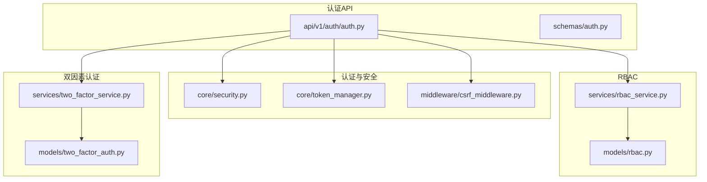
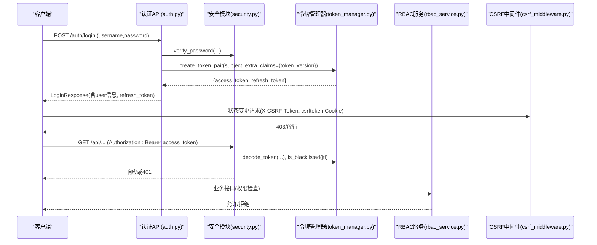
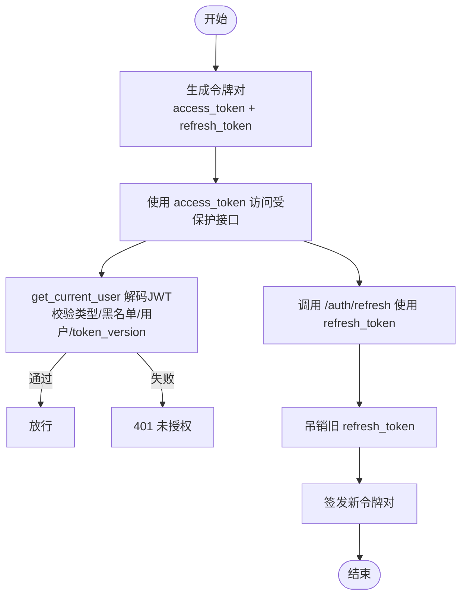
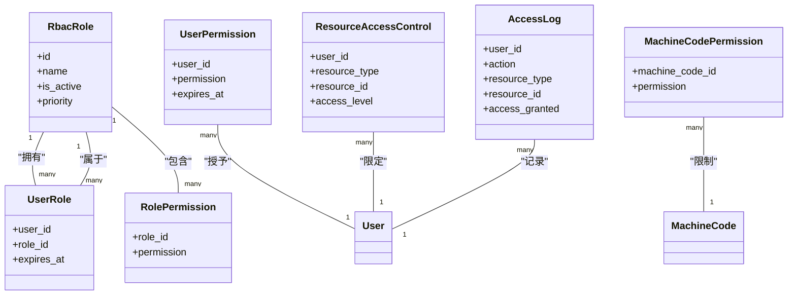
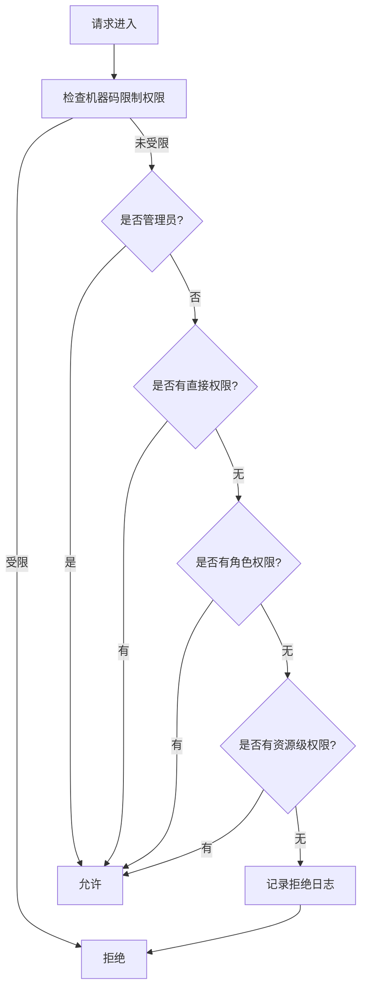
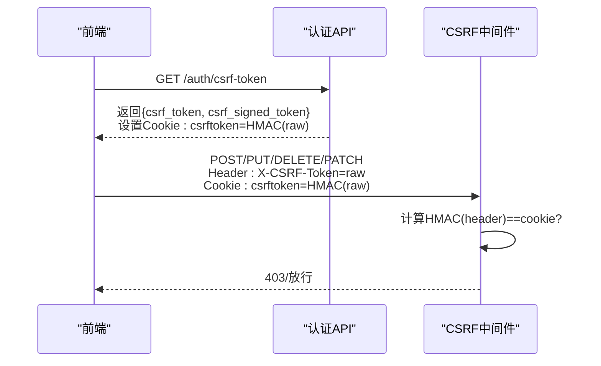
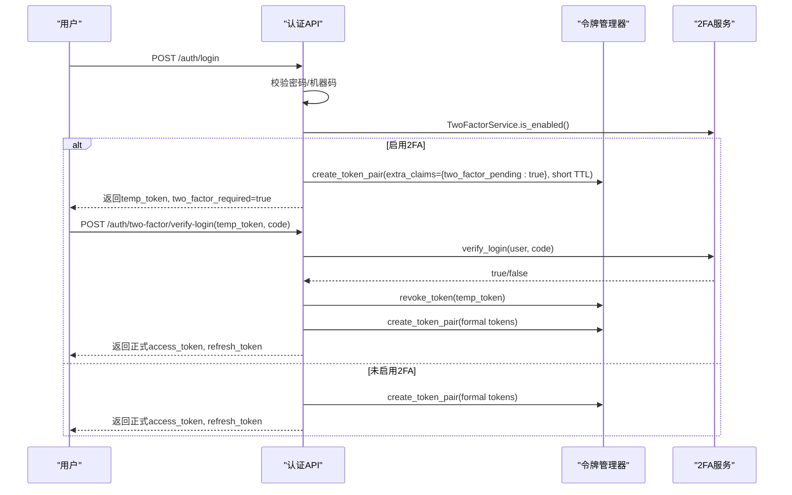
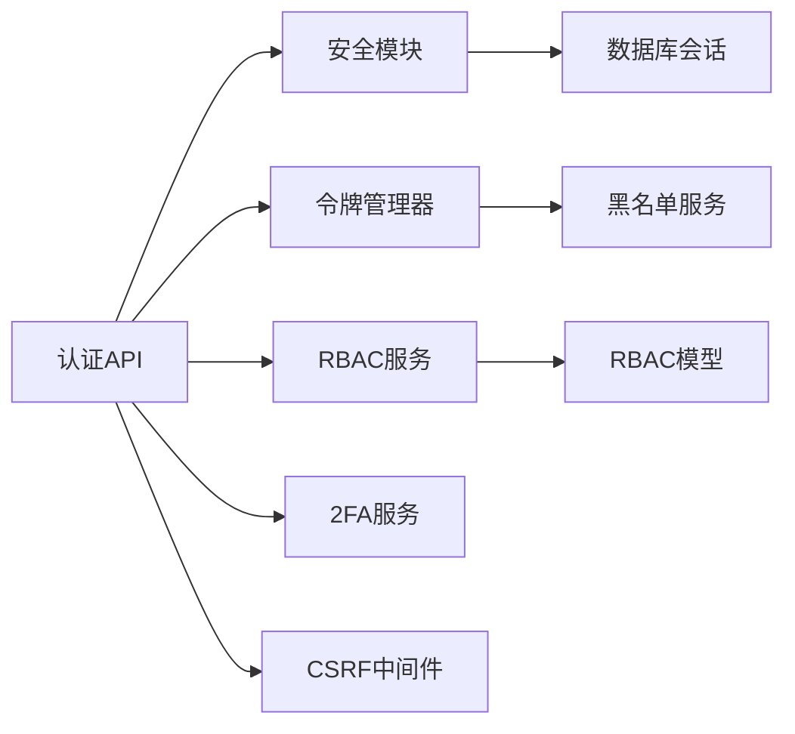
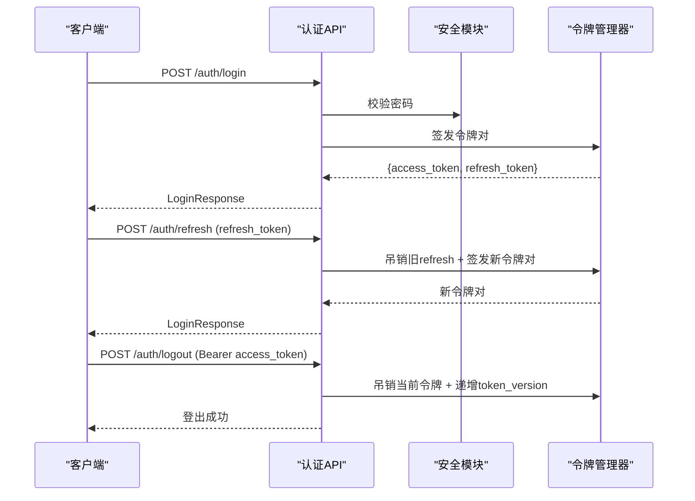

# 认证授权规范

<cite>
**本文引用的文件**
- [security.py](file://backend/app/core/security.py)
- [token_manager.py](file://backend/app/core/token_manager.py)
- [auth.py](file://backend/app/api/v1/auth/auth.py)
- [csrf_middleware.py](file://backend/app/middleware/csrf_middleware.py)
- [rbac_service.py](file://backend/app/services/rbac_service.py)
- [rbac.py](file://backend/app/models/rbac.py)
- [two_factor_service.py](file://backend/app/services/two_factor_service.py)
- [two_factor_auth.py](file://backend/app/models/two_factor_auth.py)
- [auth.py](file://backend/app/schemas/auth.py)
</cite>

## 目录
1. [简介](#简介)
2. [项目结构](#项目结构)
3. [核心组件](#核心组件)
4. [架构总览](#架构总览)
5. [详细组件分析](#详细组件分析)
6. [依赖关系分析](#依赖关系分析)
7. [性能考虑](#性能考虑)
8. [故障排查指南](#故障排查指南)
9. [结论](#结论)
10. [附录：API调用示例与流程图](#附录api调用示例与流程图)

## 简介
本规范面向系统认证与授权，覆盖以下关键能力：
- JWT 令牌管理：生成、验证、刷新、吊销（黑名单）与版本化强制下线。
- RBAC 权限模型：角色-权限-资源访问控制，细粒度校验与数据范围隔离。
- CSRF 防护：Double Submit Cookie + HMAC 签名校验，请求头携带原始 token，Cookie 存储签名。
- 双因素认证（TOTP）：密钥生成、二维码生成、验证码/备用码校验。
- 完整认证流程与 API 调用示例，确保身份验证与数据访问安全。

## 项目结构
认证授权相关代码主要分布在后端模块中：
- 核心安全与令牌：core/security.py、core/token_manager.py
- 认证 API：api/v1/auth/auth.py
- CSRF 中间件：middleware/csrf_middleware.py
- RBAC 模型与服务：models/rbac.py、services/rbac_service.py
- 双因素认证：services/two_factor_service.py、models/two_factor_auth.py
- 认证 Schema：schemas/auth.py

**图示来源**
- [security.py:210-336](file://backend/app/core/security.py#L210-L336)
- [token_manager.py:64-283](file://backend/app/core/token_manager.py#L64-L283)
- [auth.py:101-747](file://backend/app/api/v1/auth/auth.py#L101-L747)
- [csrf_middleware.py:65-284](file://backend/app/middleware/csrf_middleware.py#L65-L284)
- [rbac_service.py:104-746](file://backend/app/services/rbac_service.py#L104-L746)
- [rbac.py:31-263](file://backend/app/models/rbac.py#L31-L263)
- [two_factor_service.py:23-251](file://backend/app/services/two_factor_service.py#L23-L251)
- [two_factor_auth.py:13-40](file://backend/app/models/two_factor_auth.py#L13-L40)

**章节来源**
- [security.py:210-336](file://backend/app/core/security.py#L210-L336)
- [token_manager.py:64-283](file://backend/app/core/token_manager.py#L64-L283)
- [auth.py:101-747](file://backend/app/api/v1/auth/auth.py#L101-L747)
- [csrf_middleware.py:65-284](file://backend/app/middleware/csrf_middleware.py#L65-L284)
- [rbac_service.py:104-746](file://backend/app/services/rbac_service.py#L104-L746)
- [rbac.py:31-263](file://backend/app/models/rbac.py#L31-L263)
- [two_factor_service.py:23-251](file://backend/app/services/two_factor_service.py#L23-L251)
- [two_factor_auth.py:13-40](file://backend/app/models/two_factor_auth.py#L13-L40)

## 核心组件
- JWT 令牌管理：统一通过 token_manager 创建、验证、刷新、吊销；支持黑名单持久化与 token_version 强制下线。
- 认证依赖：get_current_user 从 Bearer 提取并解码 JWT，校验类型、黑名单、用户存在性与 token_version。
- RBAC 权限服务：check_permission 综合机器码限制、管理员权限、直接权限、角色权限、资源级权限进行判定。
- CSRF 中间件：Double Submit Cookie + HMAC 签名校验，过期检测与豁免路径。
- 双因素认证：TOTP 密钥生成、二维码生成、登录时临时令牌+验证码校验、备用码恢复。

**章节来源**
- [token_manager.py:64-283](file://backend/app/core/token_manager.py#L64-L283)
- [security.py:243-336](file://backend/app/core/security.py#L243-L336)
- [rbac_service.py:133-223](file://backend/app/services/rbac_service.py#L133-L223)
- [csrf_middleware.py:177-284](file://backend/app/middleware/csrf_middleware.py#L177-L284)
- [two_factor_service.py:23-251](file://backend/app/services/two_factor_service.py#L23-L251)

## 架构总览
认证授权整体流程如下：
- 登录：校验用户名密码、账户锁定、机器码绑定、可选 2FA，签发 access_token + refresh_token（含 token_version）。
- 鉴权：get_current_user 解码 JWT，检查黑名单、类型、用户状态与 token_version。
- 权限：RBACService 综合多种维度判定是否允许操作。
- CSRF：状态变更请求需携带 X-CSRF-Token，服务端用 Cookie 中的 HMAC 签名校验。
- 2FA：启用后登录返回临时令牌，二次验证通过后签发正式令牌。

**图示来源**
- [auth.py:101-287](file://backend/app/api/v1/auth/auth.py#L101-L287)
- [security.py:243-336](file://backend/app/core/security.py#L243-L336)
- [token_manager.py:64-283](file://backend/app/core/token_manager.py#L64-L283)
- [rbac_service.py:133-223](file://backend/app/services/rbac_service.py#L133-L223)
- [csrf_middleware.py:177-284](file://backend/app/middleware/csrf_middleware.py#L177-L284)

## 详细组件分析

### JWT 令牌管理机制
- 令牌生成：create_token_pair 生成 access_token 与 refresh_token，包含 jti、type、exp、sub 等声明，并支持额外 claims（如 token_version）。
- 令牌验证：validate_token 解码并校验类型、黑名单；get_current_user 进一步校验用户存在性、活跃状态与 token_version 匹配。
- 令牌刷新：refresh 端点仅接受 refresh_token，校验后吊销旧 refresh_token 并签发新 pair（轮换防重放）。
- 令牌撤销：revoke_token 将 jti 加入内存与数据库黑名单；登出时还递增 token_version 使该用户所有现存 JWT 立即失效。

**图示来源**
- [token_manager.py:64-283](file://backend/app/core/token_manager.py#L64-L283)
- [security.py:243-336](file://backend/app/core/security.py#L243-L336)
- [auth.py:594-689](file://backend/app/api/v1/auth/auth.py#L594-L689)

**章节来源**
- [token_manager.py:64-283](file://backend/app/core/token_manager.py#L64-L283)
- [security.py:210-336](file://backend/app/core/security.py#L210-L336)
- [auth.py:594-689](file://backend/app/api/v1/auth/auth.py#L594-L689)

### 角色权限控制模型（RBAC）
- 模型设计：
  - 角色与权限关联：RbacRole、RolePermission
  - 用户与角色关联：UserRole
  - 用户直接权限：UserPermission
  - 资源访问控制：ResourceAccessControl
  - 访问日志：AccessLog
  - 机器码功能权限：MachineCodePermission
- 权限判定流程：
  - 优先检查机器码限制权限（若命中则拒绝）
  - 管理员权限（admin:all）直接放行
  - 直接权限（UserPermission）
  - 角色权限（RolePermission via UserRole）
  - 资源级权限（ResourceAccessControl）
  - 记录访问日志

**图示来源**
- [rbac.py:31-263](file://backend/app/models/rbac.py#L31-L263)

**图示来源**
- [rbac_service.py:133-223](file://backend/app/services/rbac_service.py#L133-L223)

**章节来源**
- [rbac.py:31-263](file://backend/app/models/rbac.py#L31-L263)
- [rbac_service.py:133-223](file://backend/app/services/rbac_service.py#L133-L223)

### CSRF 防护措施
- 获取 CSRF Token：GET /auth/csrf-token 返回 raw token 并在响应中设置 csrftoken Cookie（HMAC 签名版本）。
- 请求验证：状态变更请求必须携带 X-CSRF-Token（原始 token），服务端计算 HMAC(header) 并与 Cookie 比较（常量时间）。
- 安全防护：过期检测（内嵌时间戳）、豁免路径（登录、注册、健康检查等）、可信代理 IP 透传。

**图示来源**
- [auth.py:692-747](file://backend/app/api/v1/auth/auth.py#L692-L747)
- [csrf_middleware.py:65-284](file://backend/app/middleware/csrf_middleware.py#L65-L284)

**章节来源**
- [auth.py:692-747](file://backend/app/api/v1/auth/auth.py#L692-L747)
- [csrf_middleware.py:65-284](file://backend/app/middleware/csrf_middleware.py#L65-L284)

### 双因素认证实现（TOTP）
- 启用 2FA：生成 TOTP 密钥与备用码，加密存储密钥，生成二维码供用户扫码配置。
- 登录流程：密码与机器码通过后，若启用 2FA，返回临时令牌（短期有效），前端提交 temp_token + TOTP 验证码完成二次验证，成功后签发正式令牌。
- 备用码：当无法使用 TOTP 时，可使用一次性备用码登录，使用后移除。

**图示来源**
- [auth.py:101-444](file://backend/app/api/v1/auth/auth.py#L101-L444)
- [two_factor_service.py:23-251](file://backend/app/services/two_factor_service.py#L23-L251)
- [token_manager.py:64-283](file://backend/app/core/token_manager.py#L64-L283)

**章节来源**
- [auth.py:101-444](file://backend/app/api/v1/auth/auth.py#L101-L444)
- [two_factor_service.py:23-251](file://backend/app/services/two_factor_service.py#L23-L251)
- [two_factor_auth.py:13-40](file://backend/app/models/two_factor_auth.py#L13-L40)

## 依赖关系分析
- 认证 API 依赖安全模块（密码校验、速率限制、IP 获取）、令牌管理器（签发/吊销/刷新）、RBAC 服务（权限判定）、2FA 服务（二次验证）、CSRF 中间件（状态变更保护）。
- RBAC 服务依赖 RBAC 模型（角色、权限、资源访问控制）与机器码权限服务。
- 令牌管理器依赖黑名单服务（内存+数据库）与安全模块的密钥与算法配置。

**图示来源**
- [auth.py:101-747](file://backend/app/api/v1/auth/auth.py#L101-L747)
- [security.py:210-336](file://backend/app/core/security.py#L210-L336)
- [token_manager.py:64-283](file://backend/app/core/token_manager.py#L64-L283)
- [rbac_service.py:133-223](file://backend/app/services/rbac_service.py#L133-L223)
- [two_factor_service.py:23-251](file://backend/app/services/two_factor_service.py#L23-L251)
- [csrf_middleware.py:177-284](file://backend/app/middleware/csrf_middleware.py#L177-L284)

**章节来源**
- [auth.py:101-747](file://backend/app/api/v1/auth/auth.py#L101-L747)
- [security.py:210-336](file://backend/app/core/security.py#L210-L336)
- [token_manager.py:64-283](file://backend/app/core/token_manager.py#L64-L283)
- [rbac_service.py:133-223](file://backend/app/services/rbac_service.py#L133-L223)
- [two_factor_service.py:23-251](file://backend/app/services/two_factor_service.py#L23-L251)
- [csrf_middleware.py:177-284](file://backend/app/middleware/csrf_middleware.py#L177-L284)

## 性能考虑
- 令牌验证：使用 LRU 缓存与黑名单快速判断，避免重复数据库查询。
- 权限计算：请求级上下文变量缓存机器码限制权限，减少重复查询。
- 速率限制：登录、注册、刷新、CSRF 获取均有限流保护，防止滥用。
- 审计日志：异步写入或失败不影响主流程，降低开销。

[本节为通用指导，不直接分析具体文件]

## 故障排查指南
- 登录失败：检查用户名是否存在、密码是否正确、账户是否激活、是否被锁定、机器码是否授权。
- 2FA 失败：确认 TOTP 密钥已正确配置、验证码是否在时间窗口内、备用码是否可用且未被使用。
- 令牌无效：检查是否过期、是否被吊销（黑名单）、token_version 是否匹配、类型是否为 access。
- CSRF 失败：确认已调用 /auth/csrf-token 获取 token，并在后续请求中携带 X-CSRF-Token 与 csrftoken Cookie。
- 权限不足：检查用户角色、直接权限、资源级权限以及机器码限制。

**章节来源**
- [auth.py:101-444](file://backend/app/api/v1/auth/auth.py#L101-L444)
- [security.py:243-336](file://backend/app/core/security.py#L243-L336)
- [token_manager.py:135-210](file://backend/app/core/token_manager.py#L135-L210)
- [csrf_middleware.py:177-284](file://backend/app/middleware/csrf_middleware.py#L177-L284)
- [rbac_service.py:133-223](file://backend/app/services/rbac_service.py#L133-L223)

## 结论
本规范通过 JWT 令牌管理、RBAC 权限模型、CSRF 防护与双因素认证，构建了完整的认证授权体系。结合黑名单、token_version 强制下线、速率限制与审计日志，确保系统在多场景下的安全性与可追溯性。建议在生产环境中严格配置密钥、启用 CSRF 保护、合理设置令牌有效期与权限策略，并定期审查访问日志与权限分配。

[本节为总结，不直接分析具体文件]

## 附录：API调用示例与流程图
- 登录
  - 请求：POST /auth/body={username,password}
  - 响应：LoginResponse（含 access_token、refresh_token、user 信息）
  - 参考：[auth.py:101-287](file://backend/app/api/v1/auth/auth.py#L101-L287)
- 双因素认证登录验证
  - 请求：POST /auth/two-factor/verify-login body={temp_token,code}
  - 响应：LoginResponse（正式令牌）
  - 参考：[auth.py:290-444](file://backend/app/api/v1/auth/auth.py#L290-L444)
- 刷新令牌
  - 请求：POST /auth/refresh body={token=refresh_token}
  - 响应：LoginResponse（新令牌对）
  - 参考：[auth.py:594-689](file://backend/app/api/v1/auth/auth.py#L594-L689)
- 获取 CSRF Token
  - 请求：GET /auth/csrf-token
  - 响应：{csrf_token, csrf_signed_token}，同时设置 csrftoken Cookie
  - 参考：[auth.py:692-747](file://backend/app/api/v1/auth/auth.py#L692-L747)
- 登出
  - 请求：POST /auth/logout（携带 Authorization: Bearer access_token，可选 body.refresh_token）
  - 行为：吊销当前令牌、递增 token_version 使该用户所有 JWT 失效
  - 参考：[auth.py:570-591](file://backend/app/api/v1/auth/auth.py#L570-L591)

**图示来源**
- [auth.py:101-747](file://backend/app/api/v1/auth/auth.py#L101-L747)
- [token_manager.py:64-283](file://backend/app/core/token_manager.py#L64-L283)
- [security.py:243-336](file://backend/app/core/security.py#L243-L336)

**章节来源**
- [auth.py:101-747](file://backend/app/api/v1/auth/auth.py#L101-L747)
- [token_manager.py:64-283](file://backend/app/core/token_manager.py#L64-L283)
- [security.py:243-336](file://backend/app/core/security.py#L243-L336)