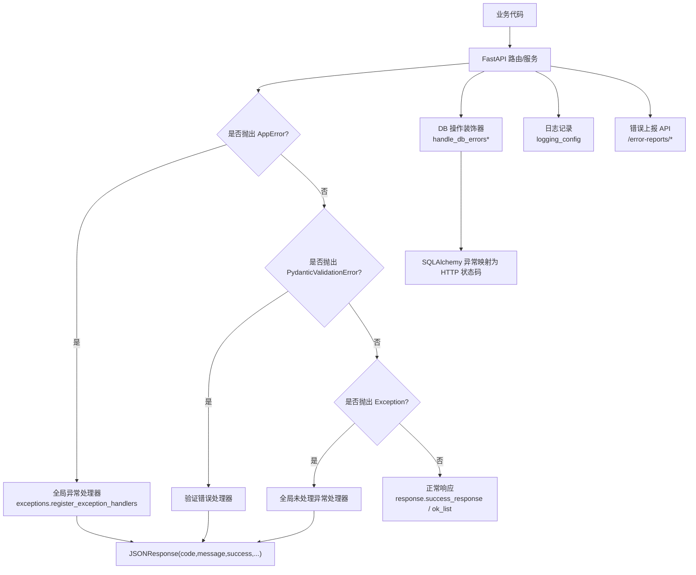
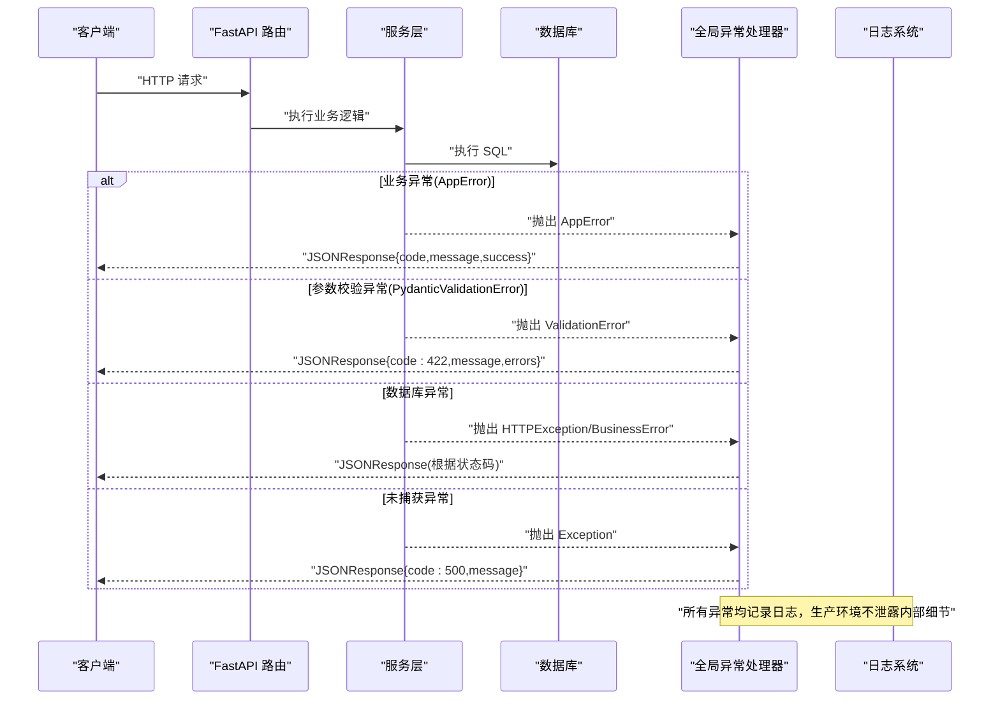
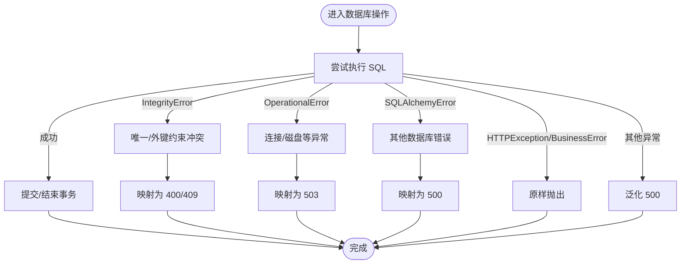
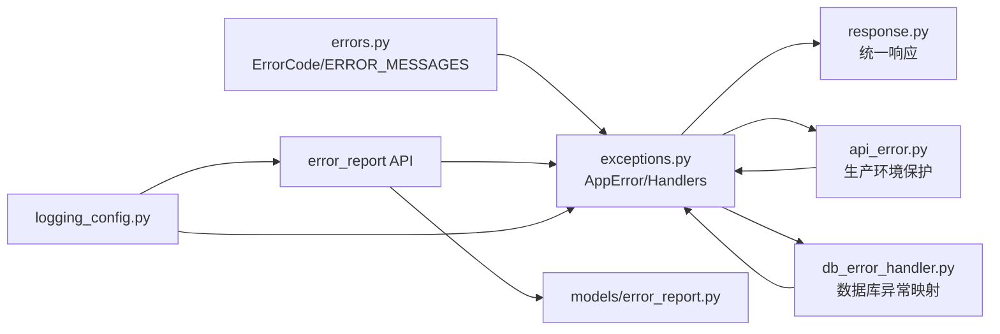

# 错误处理标准

<cite>
**本文引用的文件**
- [backend/app/core/errors.py](file://backend/app/core/errors.py)
- [backend/app/core/exceptions.py](file://backend/app/core/exceptions.py)
- [backend/app/core/error_handler.py](file://backend/app/core/error_handler.py)
- [backend/app/utils/api_error.py](file://backend/app/utils/api_error.py)
- [backend/app/utils/db_error_handler.py](file://backend/app/utils/db_error_handler.py)
- [backend/app/core/response.py](file://backend/app/core/response.py)
- [backend/app/models/error_report.py](file://backend/app/models/error_report.py)
- [backend/app/api/v1/system/error_report.py](file://backend/app/api/v1/system/error_report.py)
- [backend/app/core/logging_config.py](file://backend/app/core/logging_config.py)
- [backend/app/core/logging.py](file://backend/app/core/logging.py)
</cite>

## 目录
1. [简介](#简介)
2. [项目结构](#项目结构)
3. [核心组件](#核心组件)
4. [架构总览](#架构总览)
5. [详细组件分析](#详细组件分析)
6. [依赖关系分析](#依赖关系分析)
7. [性能考虑](#性能考虑)
8. [故障排查指南](#故障排查指南)
9. [结论](#结论)
10. [附录](#附录)

## 简介
本规范定义系统统一的错误响应格式、异常分类体系、日志记录与审计追踪机制，以及前后端协同的错误处理策略。目标是确保：
- 统一且可解析的错误响应结构（含错误码、消息、可选详情）
- 清晰的异常分层与处理策略（业务异常、系统异常、网络/外部服务异常）
- 安全合规的日志记录（脱敏、分级、持久化与轮转）
- 前端友好的提示、重试与降级方案
- 可观测性与可维护性（错误上报、统计、追踪）

## 项目结构
后端围绕“错误码定义—异常类—全局异常处理器—响应封装—数据库错误处理—日志与上报”形成闭环。关键路径如下：
- 错误码与消息：集中定义于 errors.py
- 异常类与全局处理器：exceptions.py 注册 FastAPI 异常处理器
- 通用响应构造：response.py 提供成功/失败/分页等统一结构
- API 层辅助：api_error.py 提供生产环境敏感信息保护
- 数据库错误：db_error_handler.py 统一捕获并泛化出站消息
- 错误上报：error_report.py + error_report API 持久化与查询
- 日志：logging_config.py 提供结构化 JSON 日志与敏感信息过滤

图表来源
- [backend/app/core/exceptions.py:121-145](file://backend/app/core/exceptions.py#L121-L145)
- [backend/app/core/response.py:101-178](file://backend/app/core/response.py#L101-L178)
- [backend/app/utils/db_error_handler.py:70-101](file://backend/app/utils/db_error_handler.py#L70-L101)
- [backend/app/api/v1/system/error_report.py:49-88](file://backend/app/api/v1/system/error_report.py#L49-L88)

章节来源
- [backend/app/core/errors.py:10-87](file://backend/app/core/errors.py#L10-L87)
- [backend/app/core/exceptions.py:11-145](file://backend/app/core/exceptions.py#L11-L145)
- [backend/app/core/response.py:101-178](file://backend/app/core/response.py#L101-L178)
- [backend/app/utils/db_error_handler.py:34-68](file://backend/app/utils/db_error_handler.py#L34-L68)
- [backend/app/api/v1/system/error_report.py:49-88](file://backend/app/api/v1/system/error_report.py#L49-L88)

## 核心组件
- 错误码与消息：ErrorCode 枚举与 ERROR_MESSAGES 字典，提供跨模块一致的错误码与中文可读消息；get_error_message 用于获取默认文案。
- 异常体系：AppError 及其子类（BusinessError、NotFoundError、ConflictError、DatabaseError、InvalidCredentialsError 等），to_dict 输出统一结构。
- 全局异常处理器：register_exception_handlers 将 AppError、PydanticValidationError、未捕获 Exception 分别映射为统一 JSON 响应。
- 响应封装：success_response、error_response、ok_list、paginated_response 等，保证成功/失败/分页结构一致。
- API 错误工具：raise_api_error/handle_service_error/safe_api_call/APIErrorHandler，生产环境隐藏内部细节，仅记录日志。
- 数据库错误处理：handle_db_errors*/DBTransaction 统一捕获 SQLAlchemy 异常，回滚事务，并将底层细节泛化为用户可见消息。
- 错误上报：ErrorReport 模型与 /error-reports/* 接口，支持持久化存储、查询、统计与状态更新。
- 日志配置：logging_config 提供 JSON/文本格式化、按大小/时间轮转、敏感信息过滤（身份证、手机号、邮箱、密钥键值对）。

章节来源
- [backend/app/core/errors.py:10-155](file://backend/app/core/errors.py#L10-L155)
- [backend/app/core/exceptions.py:11-145](file://backend/app/core/exceptions.py#L11-L145)
- [backend/app/core/response.py:52-178](file://backend/app/core/response.py#L52-L178)
- [backend/app/utils/api_error.py:22-124](file://backend/app/utils/api_error.py#L22-L124)
- [backend/app/utils/db_error_handler.py:27-140](file://backend/app/utils/db_error_handler.py#L27-L140)
- [backend/app/models/error_report.py:8-36](file://backend/app/models/error_report.py#L8-L36)
- [backend/app/api/v1/system/error_report.py:49-260](file://backend/app/api/v1/system/error_report.py#L49-L260)
- [backend/app/core/logging_config.py:75-140](file://backend/app/core/logging_config.py#L75-L140)

## 架构总览
下图展示一次典型请求从进入路由到返回响应的错误处理流程，包括业务异常、参数校验异常、数据库异常与全局兜底。

图表来源
- [backend/app/core/exceptions.py:121-145](file://backend/app/core/exceptions.py#L121-L145)
- [backend/app/utils/db_error_handler.py:70-101](file://backend/app/utils/db_error_handler.py#L70-L101)
- [backend/app/core/response.py:101-178](file://backend/app/core/response.py#L101-L178)

## 详细组件分析

### 统一错误响应格式
- 成功响应：{ code: 200, message: "成功", success: true, data?: any }
- 列表响应：使用 ok_list 生成 { code: 200, message: "成功", data: { items, total, page, page_size, ...extra }, success: true }
- 分页元信息：paginated_response 在成功响应基础上附加 meta.pagination
- 错误响应：error_response 生成 { code, message, success: false, errors?: any, detail?: any }
- 404/403/500 便捷函数：not_found_response、forbidden_response、server_error_response

最佳实践
- 所有 API 返回统一 envelope，避免裸对象
- 列表接口必须使用 ok_list，便于前端 _unwrapList 解析
- 错误响应中不包含堆栈或内部实现细节

章节来源
- [backend/app/core/response.py:52-178](file://backend/app/core/response.py#L52-L178)

### 错误码定义与消息
- ErrorCode 枚举覆盖通用、认证、权限、资源、文件、数据库、限流、外部服务、配置、业务等场景
- ERROR_MESSAGES 提供中文可读消息，get_error_message 用于获取默认文案
- 保留向后兼容别名，避免破坏既有消费者

建议
- 新增错误码时同步补充 ERROR_MESSAGES
- 对外暴露错误码应优先使用 ErrorCode 成员，而非硬编码数字

章节来源
- [backend/app/core/errors.py:10-155](file://backend/app/core/errors.py#L10-L155)

### 异常分类与处理策略
- 业务异常：BusinessError 及具体子类（如 InvalidCredentialsError、UserAlreadyExistsError、NotFoundException、AuthenticationException）
- 数据校验异常：_ValidationError（重导出为 ValidationError），由 Pydantic 触发时统一映射为 422
- 资源异常：NotFoundError、ConflictError
- 系统/基础设施异常：DatabaseError 及 db_error_handler 中的映射（IntegrityError/OperationalError/SQLAlchemyError）
- 全局兜底：未捕获 Exception 返回 500，并记录完整堆栈

处理策略
- 业务异常：明确语义，携带 details（如 field、identifier）
- 校验异常：返回 422，附带 errors 列表
- 数据库异常：泛化用户可见消息，内部细节仅落日志
- 全局异常：记录日志并返回通用 500

章节来源
- [backend/app/core/exceptions.py:11-145](file://backend/app/core/exceptions.py#L11-L145)
- [backend/app/utils/db_error_handler.py:34-68](file://backend/app/utils/db_error_handler.py#L34-L68)

### 数据库错误处理与事务管理
- handle_db_errors / handle_db_errors_async：捕获常见 SQLAlchemy 异常，自动回滚会话，并映射为合适的 HTTP 状态码
- DBTransaction：上下文管理器，异常时回滚，可选自动提交
- 敏感信息保护：禁止将底层异常原文直接返回给客户端，仅记录日志

流程图（数据库异常分支）

图表来源
- [backend/app/utils/db_error_handler.py:34-68](file://backend/app/utils/db_error_handler.py#L34-L68)
- [backend/app/utils/db_error_handler.py:104-140](file://backend/app/utils/db_error_handler.py#L104-L140)

章节来源
- [backend/app/utils/db_error_handler.py:27-140](file://backend/app/utils/db_error_handler.py#L27-L140)

### 错误日志记录规范
- 日志初始化：init_logging/configure_logging 支持 JSON/文本格式、按大小/时间轮转、控制台与文件双通道
- 敏感信息脱敏：SensitiveDataFilter 对身份证号、手机号、邮箱、密码/令牌等键值进行替换
- 日志级别：默认 INFO，DEBUG 模式开启更详细输出；第三方噪音日志降级
- 审计追踪：错误报告通过 ErrorReport 模型持久化，包含 source、error_type、message、stack_trace、context、severity、status、reporter、resolved_at、resolution_note

建议
- 所有异常路径必须记录日志，生产环境不将内部细节返回客户端
- 使用 structured logging（JSON）便于检索与分析
- 对写入日志前进行脱敏，防止敏感信息泄露

章节来源
- [backend/app/core/logging_config.py:75-140](file://backend/app/core/logging_config.py#L75-L140)
- [backend/app/core/logging_config.py:161-274](file://backend/app/core/logging_config.py#L161-L274)
- [backend/app/models/error_report.py:8-36](file://backend/app/models/error_report.py#L8-L36)

### 错误上报与审计
- 模型：ErrorReport 表字段覆盖来源、类型、消息、堆栈、上下文、严重级别、状态、报告人、解决时间与备注
- API：
  - POST /error-reports：创建错误报告
  - GET /error-reports：分页查询
  - GET /error-reports/stats：统计（总数、未解决、严重错误数、按来源/严重级别分组）
  - GET /error-reports/{id}：详情
  - PUT /error-reports/{id}：更新状态与备注
  - POST /error-reports/report-exception：简化异常上报
- 权限：更新需本人或管理员

章节来源
- [backend/app/api/v1/system/error_report.py:49-260](file://backend/app/api/v1/system/error_report.py#L49-L260)
- [backend/app/models/error_report.py:8-36](file://backend/app/models/error_report.py#L8-L36)

### 前端错误处理策略
- 用户友好提示：基于统一响应结构显示 message，必要时结合 errors 列表定位问题字段
- 错误重试机制：对幂等 GET/HEAD 请求可在短暂延迟后重试；非幂等操作不建议自动重试
- 降级处理：当外部服务不可用时，返回缓存或友好提示，引导用户稍后重试
- 鉴权失败：401/403 时跳转登录或提示无权限
- 网络异常：区分超时、DNS、连接失败，给出差异化提示

说明
- 前端应依据 code/message/success 判断结果，避免直接解析 detail 或堆栈
- 对于批量/导入导出等长耗时任务，采用轮询或事件通知方式反馈进度与结果

[本节为概念性内容，不直接分析具体文件]

## 依赖关系分析
- exceptions.py 依赖 errors.py（通过懒加载避免循环导入）
- api_error.py 依赖 FastAPI HTTPException，用于生产环境隐藏细节
- db_error_handler.py 依赖 SQLAlchemy 异常类型与 BusinessError
- response.py 被各层复用，保证响应一致性
- error_report API 依赖 models.error_report.ErrorReport 与事务工具 safe_commit
- logging_config.py 被应用启动时调用，统一注入过滤器与处理器

图表来源
- [backend/app/core/errors.py:157-176](file://backend/app/core/errors.py#L157-L176)
- [backend/app/core/exceptions.py:43-45](file://backend/app/core/exceptions.py#L43-L45)
- [backend/app/utils/db_error_handler.py:19-21](file://backend/app/utils/db_error_handler.py#L19-L21)
- [backend/app/api/v1/system/error_report.py:18-22](file://backend/app/api/v1/system/error_report.py#L18-L22)
- [backend/app/core/logging_config.py:256-274](file://backend/app/core/logging_config.py#L256-L274)

章节来源
- [backend/app/core/errors.py:157-176](file://backend/app/core/errors.py#L157-L176)
- [backend/app/core/exceptions.py:43-45](file://backend/app/core/exceptions.py#L43-L45)
- [backend/app/utils/db_error_handler.py:19-21](file://backend/app/utils/db_error_handler.py#L19-L21)
- [backend/app/api/v1/system/error_report.py:18-22](file://backend/app/api/v1/system/error_report.py#L18-L22)
- [backend/app/core/logging_config.py:256-274](file://backend/app/core/logging_config.py#L256-L274)

## 性能考虑
- 日志轮转：按大小或时间轮转，避免单文件过大影响 IO
- 敏感信息过滤：正则匹配开销较小，但应避免过度复杂表达式
- 数据库异常快速失败：尽早捕获并泛化，减少不必要的重试
- 错误上报：异步或批量化写入可降低主链路阻塞风险（当前实现为同步写入，建议在高频场景下引入队列）

[本节为通用指导，不直接分析具体文件]

## 故障排查指南
- 401/403：检查认证与权限，确认 token 有效性与角色权限
- 422：查看 errors 列表定位字段级校验失败原因
- 404：确认资源是否存在或已删除
- 409：检查唯一性约束或并发冲突
- 500：查看服务端日志，关注未捕获异常与堆栈
- 数据库错误：根据 db_error_handler 映射判断是否为完整性/操作性错误，检查磁盘空间与连接池
- 错误上报：通过 /error-reports/* 查询与统计，跟踪问题生命周期

章节来源
- [backend/app/core/exceptions.py:121-145](file://backend/app/core/exceptions.py#L121-L145)
- [backend/app/utils/db_error_handler.py:34-68](file://backend/app/utils/db_error_handler.py#L34-L68)
- [backend/app/api/v1/system/error_report.py:90-165](file://backend/app/api/v1/system/error_report.py#L90-L165)

## 结论
本规范通过集中化的错误码、统一的异常体系、严格的响应格式与安全日志机制，构建了健壮的错误处理框架。配合前端友好提示、重试与降级策略，以及完善的错误上报与审计能力，可有效提升系统的可观测性、可维护性与用户体验。

[本节为总结性内容，不直接分析具体文件]

## 附录
- 统一响应示例（参考路径）
  - 成功响应：response.success_response
  - 列表响应：response.ok_list
  - 错误响应：response.error_response
  - 404/403/500 便捷函数：response.not_found_response / forbidden_response / server_error_response
- API 错误工具（参考路径）
  - raise_api_error / handle_service_error / safe_api_call / APIErrorHandler
- 数据库错误处理（参考路径）
  - handle_db_errors / handle_db_errors_async / DBTransaction
- 错误上报（参考路径）
  - ErrorReport 模型与 /error-reports/* 接口

章节来源
- [backend/app/core/response.py:52-178](file://backend/app/core/response.py#L52-L178)
- [backend/app/utils/api_error.py:22-124](file://backend/app/utils/api_error.py#L22-L124)
- [backend/app/utils/db_error_handler.py:70-140](file://backend/app/utils/db_error_handler.py#L70-L140)
- [backend/app/api/v1/system/error_report.py:49-260](file://backend/app/api/v1/system/error_report.py#L49-L260)