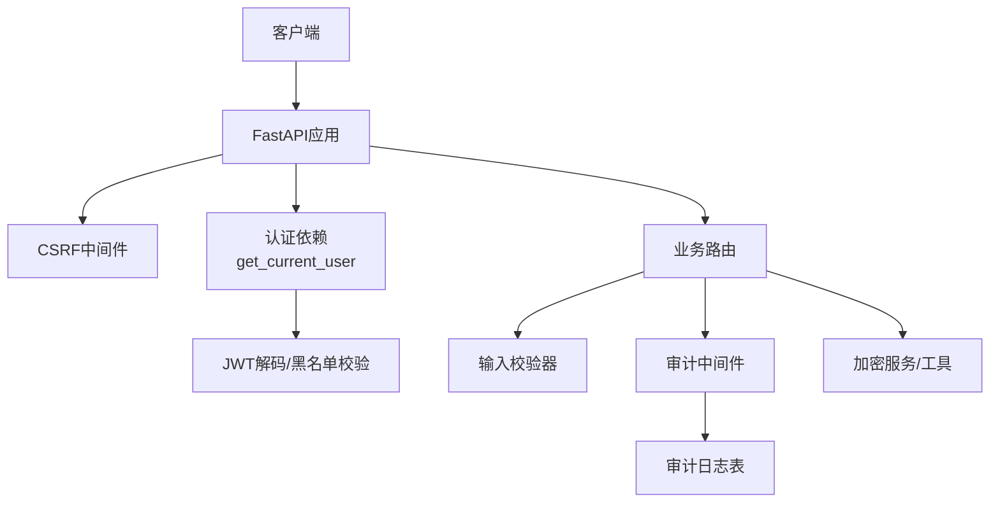
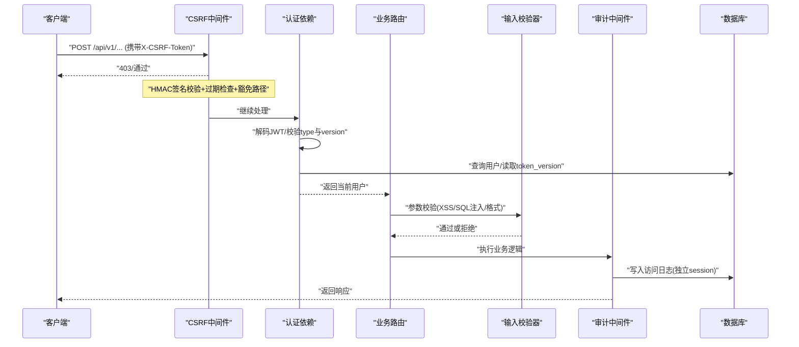
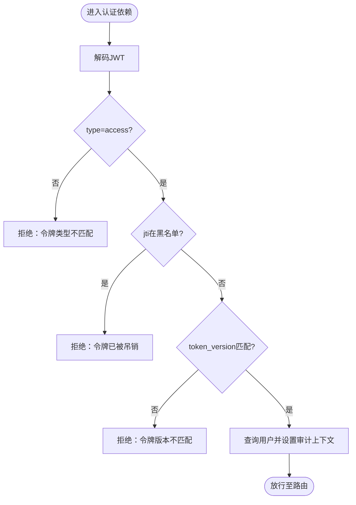
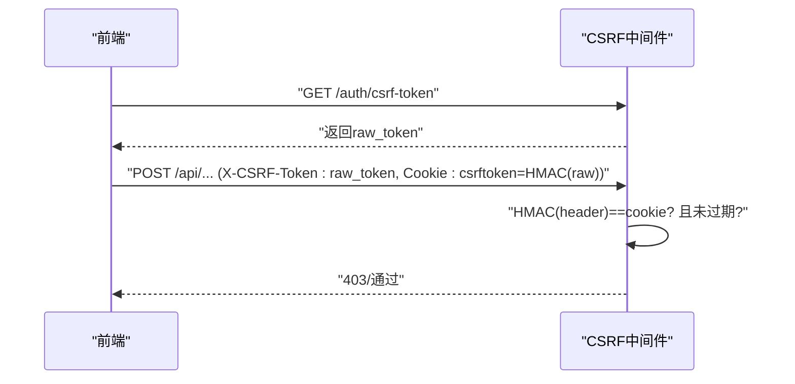
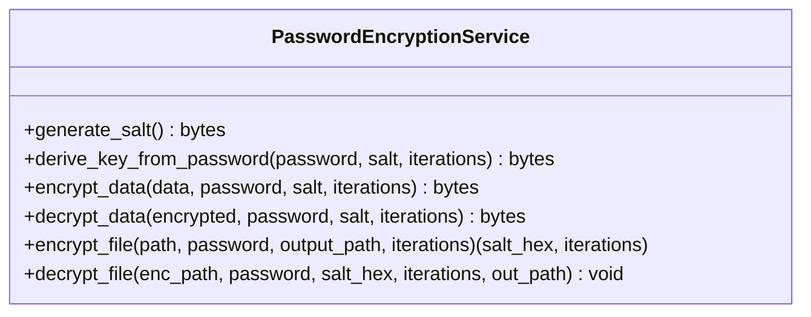
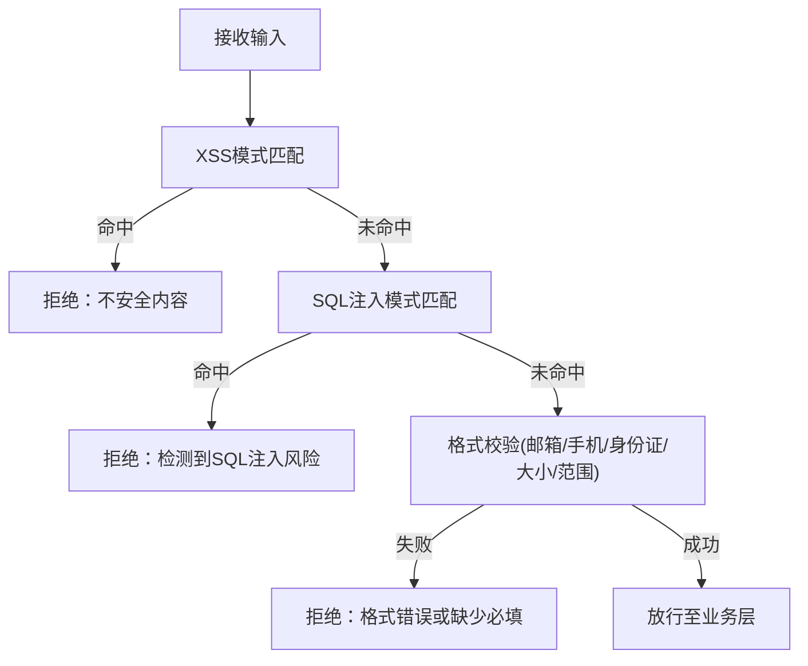
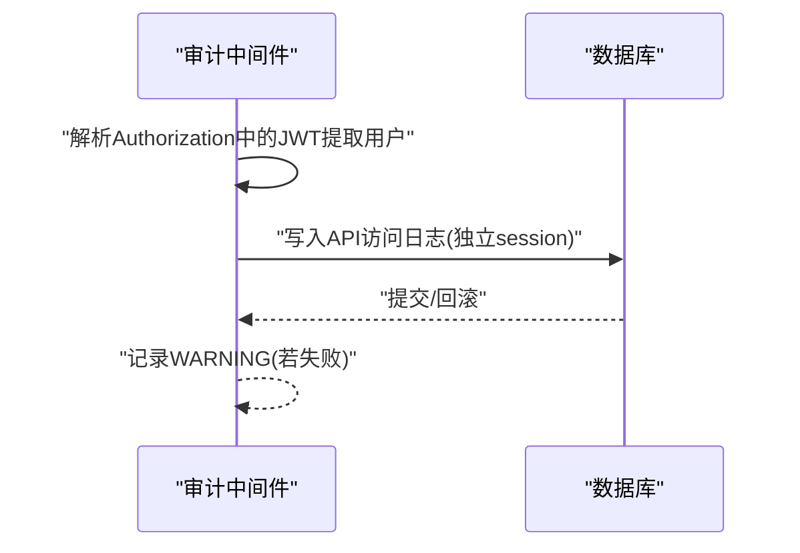
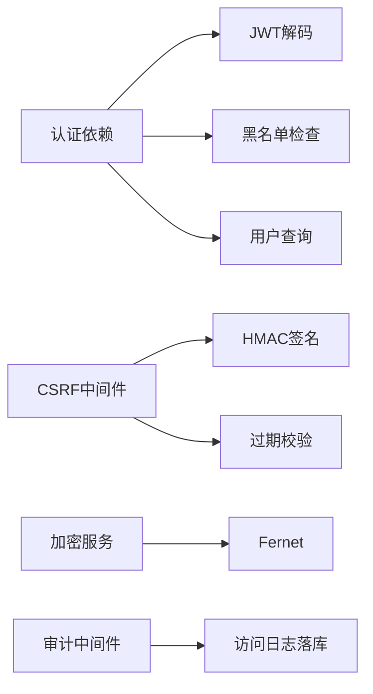
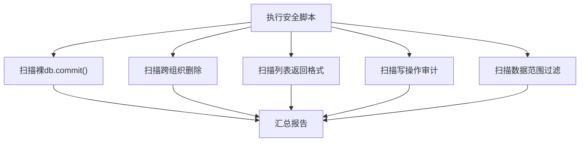

# 安全开发规范

<cite>
**本文引用的文件**
- [security.py](file://backend/app/core/security.py)
- [csrf_middleware.py](file://backend/app/middleware/csrf_middleware.py)
- [token_manager.py](file://backend/app/core/token_manager.py)
- [token_blacklist.py](file://backend/app/core/token_blacklist.py)
- [password_encryption_service.py](file://backend/app/services/password_encryption_service.py)
- [input_validator.py](file://backend/app/utils/input_validator.py)
- [audit_middleware.py](file://backend/app/core/audit_middleware.py)
- [security_audit.py](file://scripts/security_audit.py)
- [security_self_check.py](file://backend/scripts/security_self_check.py)
</cite>

## 目录
1. [引言](#引言)
2. [项目结构](#项目结构)
3. [核心组件](#核心组件)
4. [架构总览](#架构总览)
5. [详细组件分析](#详细组件分析)
6. [依赖关系分析](#依赖关系分析)
7. [性能与安全权衡](#性能与安全权衡)
8. [故障排查指南](#故障排查指南)
9. [结论](#结论)
10. [附录](#附录)

## 引言
本规范面向后端服务的安全开发生命周期，覆盖认证授权、数据加密、防攻击策略、令牌管理、密码哈希存储、CSRF防护、输入验证、SQL注入与XSS防护、审计日志、安全扫描与漏洞检测、安全编码最佳实践、常见威胁防护及应急响应流程。文档以仓库中已实现的安全能力为依据，提供可落地的实践指引与排障建议。

## 项目结构
后端安全相关能力主要分布在以下模块：
- 认证与鉴权：JWT生成/校验、黑名单、角色控制、速率限制、安全响应头中间件
- CSRF防护：HMAC签名增强、过期校验、豁免路径与可信代理IP
- 数据加密：PBKDF2+Fernet的基于密码的加密服务；敏感字段脱敏
- 输入校验：XSS/SQL注入模式匹配、格式校验、必填项校验
- 审计与可观测性：请求级审计日志、操作审计记录、访问日志落库
- 安全自检与审计脚本：CI门禁、配置检查、数据库状态检查、权限与事务合规扫描

图表来源
- [csrf_middleware.py:177-284](file://backend/app/middleware/csrf_middleware.py#L177-L284)
- [security.py:243-336](file://backend/app/core/security.py#L243-L336)
- [audit_middleware.py:11-109](file://backend/app/core/audit_middleware.py#L11-L109)

章节来源
- [security.py:1-713](file://backend/app/core/security.py#L1-L713)
- [csrf_middleware.py:1-284](file://backend/app/middleware/csrf_middleware.py#L1-L284)
- [audit_middleware.py:1-109](file://backend/app/core/audit_middleware.py#L1-L109)

## 核心组件
- 认证与授权
  - JWT签发与校验、类型与版本控制、黑名单吊销、角色与活跃状态校验
  - 速率限制（滑动窗口）、客户端IP获取、安全响应头注入
- CSRF防护
  - Double Submit Cookie + HMAC签名、过期校验、豁免路径、可信代理透传
- 数据加密
  - PBKDF2-HMAC-SHA256派生密钥+Fernet对称加密，支持文件加解密
  - 敏感字段脱敏、日志清洗
- 输入验证
  - XSS/SQL注入模式匹配、邮箱/手机/身份证/文件大小等校验
- 审计与日志
  - 每次HTTP请求落库访问日志，操作审计记录，失败不阻断主流程

章节来源
- [security.py:107-336](file://backend/app/core/security.py#L107-L336)
- [security.py:379-517](file://backend/app/core/security.py#L379-L517)
- [security.py:598-702](file://backend/app/core/security.py#L598-L702)
- [csrf_middleware.py:65-125](file://backend/app/middleware/csrf_middleware.py#L65-L125)
- [csrf_middleware.py:177-284](file://backend/app/middleware/csrf_middleware.py#L177-L284)
- [password_encryption_service.py:23-206](file://backend/app/services/password_encryption_service.py#L23-L206)
- [input_validator.py:12-124](file://backend/app/utils/input_validator.py#L12-L124)
- [audit_middleware.py:11-109](file://backend/app/core/audit_middleware.py#L11-L109)

## 架构总览
下图展示一次受保护的业务请求从进入网关到落库审计的完整链路，体现认证、CSRF、输入校验、审计与黑名单机制的协作。

图表来源
- [csrf_middleware.py:177-284](file://backend/app/middleware/csrf_middleware.py#L177-L284)
- [security.py:243-336](file://backend/app/core/security.py#L243-L336)
- [input_validator.py:31-71](file://backend/app/utils/input_validator.py#L31-L71)
- [audit_middleware.py:18-44](file://backend/app/core/audit_middleware.py#L18-L44)

## 详细组件分析

### 认证与授权（JWT、角色、活跃态、黑名单）
- 令牌生命周期
  - 签发：access/refresh token，包含jti、exp、type、sub等声明
  - 校验：解码、类型校验、黑名单检查、token_version一致性校验
  - 吊销：将jti加入内存与持久化黑名单，支持重启后仍有效
- 角色与活跃态
  - 管理员角色白名单、账户禁用拦截
- 速率限制
  - 滑动窗口算法，默认60次/分钟，带过期清理
- 安全响应头
  - X-Content-Type-Options、X-Frame-Options、X-XSS-Protection、Referrer-Policy等

图表来源
- [security.py:243-336](file://backend/app/core/security.py#L243-L336)
- [token_manager.py:135-169](file://backend/app/core/token_manager.py#L135-L169)
- [token_blacklist.py:60-70](file://backend/app/core/token_blacklist.py#L60-L70)

章节来源
- [security.py:210-336](file://backend/app/core/security.py#L210-L336)
- [security.py:414-517](file://backend/app/core/security.py#L414-L517)
- [security.py:598-702](file://backend/app/core/security.py#L598-L702)
- [token_manager.py:64-127](file://backend/app/core/token_manager.py#L64-L127)
- [token_manager.py:176-240](file://backend/app/core/token_manager.py#L176-L240)
- [token_blacklist.py:27-103](file://backend/app/core/token_blacklist.py#L27-L103)

### CSRF防护（HMAC签名增强）
- 双提交Cookie模式：Header携带原始token，Cookie携带HMAC签名
- 过期校验：token内嵌时间戳，超过阈值拒绝
- 豁免路径：登录、注册、健康检查、文档等
- 可信代理：仅在配置可信反向代理时信任X-Forwarded-For

图表来源
- [csrf_middleware.py:65-125](file://backend/app/middleware/csrf_middleware.py#L65-L125)
- [csrf_middleware.py:177-284](file://backend/app/middleware/csrf_middleware.py#L177-L284)

章节来源
- [csrf_middleware.py:1-284](file://backend/app/middleware/csrf_middleware.py#L1-L284)

### 数据加密方案（密码哈希与基于密码的加密）
- 密码哈希
  - 使用bcrypt进行哈希，兼容不同版本，长度截断避免异常
  - 提供随机密码生成与复杂度策略校验
- 基于密码的加密
  - PBKDF2-HMAC-SHA256派生密钥+Fernet对称加密
  - 支持文件级加解密，盐值与迭代次数可配置

图表来源
- [password_encryption_service.py:23-206](file://backend/app/services/password_encryption_service.py#L23-L206)

章节来源
- [security.py:107-173](file://backend/app/core/security.py#L107-L173)
- [password_encryption_service.py:23-206](file://backend/app/services/password_encryption_service.py#L23-L206)

### 输入验证与防攻击（XSS/SQL注入/格式校验）
- XSS防护：正则匹配危险片段，必要时转义输出
- SQL注入防护：检测常见危险关键字与注释符号
- 格式校验：邮箱、手机号、身份证号、文件扩展名与大小、数值范围、必填字段

图表来源
- [input_validator.py:12-124](file://backend/app/utils/input_validator.py#L12-L124)

章节来源
- [input_validator.py:12-124](file://backend/app/utils/input_validator.py#L12-L124)
- [security.py:379-411](file://backend/app/core/security.py#L379-L411)

### 审计日志与可观测性
- 请求级审计：记录方法、路径、状态码、耗时、用户标识、IP、UA
- 操作审计：按资源与动作记录，失败不影响主流程
- 访问日志落库：独立短会话，失败仅告警

图表来源
- [audit_middleware.py:18-109](file://backend/app/core/audit_middleware.py#L18-L109)

章节来源
- [audit_middleware.py:1-109](file://backend/app/core/audit_middleware.py#L1-L109)
- [security.py:644-687](file://backend/app/core/security.py#L644-L687)

## 依赖关系分析
- 认证链依赖：认证依赖调用JWT解码、黑名单、数据库查询与审计上下文设置
- CSRF依赖：中间件依赖配置、HMAC签名函数、过期校验与豁免路径判断
- 加密依赖：密码哈希依赖bcrypt/passlib，基于密码的加密依赖cryptography.Fernet
- 审计依赖：中间件依赖JWT解码（仅用于审计，不校验过期）、数据库会话与模型

图表来源
- [security.py:243-336](file://backend/app/core/security.py#L243-L336)
- [csrf_middleware.py:65-125](file://backend/app/middleware/csrf_middleware.py#L65-L125)
- [password_encryption_service.py:23-206](file://backend/app/services/password_encryption_service.py#L23-L206)
- [audit_middleware.py:18-109](file://backend/app/core/audit_middleware.py#L18-L109)

章节来源
- [security.py:210-336](file://backend/app/core/security.py#L210-L336)
- [csrf_middleware.py:177-284](file://backend/app/middleware/csrf_middleware.py#L177-L284)
- [password_encryption_service.py:23-206](file://backend/app/services/password_encryption_service.py#L23-L206)
- [audit_middleware.py:1-109](file://backend/app/core/audit_middleware.py#L1-L109)

## 性能与安全权衡
- 密码哈希
  - bcrypt轮数越高越安全但CPU开销越大；建议生产环境≥10轮，结合硬件能力评估
- 令牌有效期
  - access token短期、refresh token长期；频繁刷新会增加校验与黑名单压力
- 黑名单
  - 内存+数据库持久化；启动加载未过期条目，注意并发清理与锁
- 速率限制
  - 滑动窗口需定期清理过期键，避免内存增长
- 审计日志
  - 独立session落库，失败不阻断；高吞吐场景建议异步化或批量写入

[本节为通用指导，无需具体文件引用]

## 故障排查指南
- 认证失败
  - 检查JWT是否过期、类型是否为access、是否被吊销、token_version是否匹配
  - 参考：[security.py:243-336](file://backend/app/core/security.py#L243-L336)、[token_manager.py:135-169](file://backend/app/core/token_manager.py#L135-L169)
- CSRF失败
  - 确认已调用获取token接口、Header与Cookie均存在、未过期、路径非豁免
  - 参考：[csrf_middleware.py:177-284](file://backend/app/middleware/csrf_middleware.py#L177-L284)
- 输入校验报错
  - 检查是否命中XSS/SQL注入规则、格式是否符合要求
  - 参考：[input_validator.py:31-71](file://backend/app/utils/input_validator.py#L31-L71)
- 审计日志缺失
  - 检查数据库连接与模型可用性，关注中间件警告日志
  - 参考：[audit_middleware.py:80-109](file://backend/app/core/audit_middleware.py#L80-L109)
- 安全自检告警
  - 运行自检脚本定位配置、数据库、加密、权限等问题
  - 参考：[security_self_check.py:46-177](file://backend/scripts/security_self_check.py#L46-L177)

章节来源
- [security.py:243-336](file://backend/app/core/security.py#L243-L336)
- [csrf_middleware.py:177-284](file://backend/app/middleware/csrf_middleware.py#L177-L284)
- [input_validator.py:31-71](file://backend/app/utils/input_validator.py#L31-L71)
- [audit_middleware.py:80-109](file://backend/app/core/audit_middleware.py#L80-L109)
- [security_self_check.py:46-177](file://backend/scripts/security_self_check.py#L46-L177)

## 结论
本项目在后端实现了较为完善的安全基线：JWT令牌全生命周期管理、CSRF双重提交+HMAC加固、输入层XSS/SQL注入防护、基于密码的强加密、审计日志与访问日志落库、以及CI门禁与安全自检脚本。建议在部署与运维中持续启用CSRF与速率限制、保持密码策略与加密强度、强化审计与监控，并结合安全扫描与渗透测试形成闭环。

[本节为总结性内容，无需具体文件引用]

## 附录

### 安全编码最佳实践
- 始终使用参数化查询或ORM，避免拼接SQL
- 对一切外部输入进行白名单校验与最小化原则
- 敏感信息不落盘、不在日志中明文出现
- 统一错误响应，不泄露内部细节
- 使用强随机源生成密钥与令牌

[本节为通用指导，无需具体文件引用]

### 常见安全威胁防护清单
- 认证绕过：强制Bearer校验、黑名单、token_version
- CSRF：Double Submit + HMAC、豁免路径最小化
- XSS/SQL注入：输入校验与输出转义、严格模式
- 暴力破解：速率限制、账号锁定策略（可扩展）
- 越权访问：RBAC与数据范围过滤（结合业务模型）

[本节为通用指导，无需具体文件引用]

### 应急响应流程
- 发现异常：监控告警、审计日志回溯
- 快速止损：吊销令牌、封禁IP、关闭高危接口
- 根因分析：代码变更与配置变更审查
- 修复验证：回归测试、安全自检与扫描
- 复盘改进：更新规范与自动化门禁

[本节为通用指导，无需具体文件引用]

### 安全扫描与自检工具
- 综合安全审计脚本：检查裸commit、跨组织删除、列表返回格式、写操作审计、数据范围过滤
- 安全自检脚本：配置、数据库、加密、审计、文件系统权限检查

图表来源
- [security_audit.py:45-237](file://scripts/security_audit.py#L45-L237)

章节来源
- [security_audit.py:1-301](file://scripts/security_audit.py#L1-L301)
- [security_self_check.py:1-183](file://backend/scripts/security_self_check.py#L1-L183)