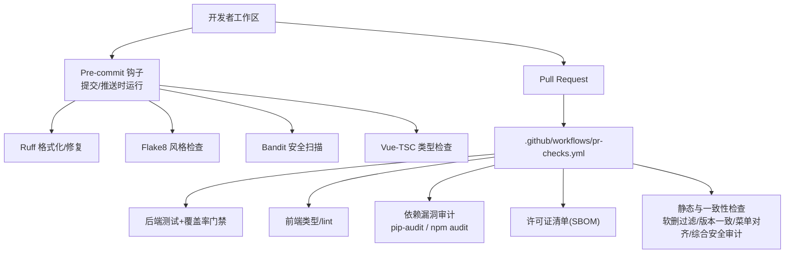
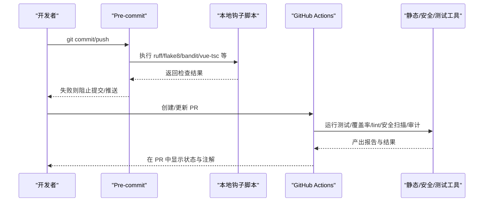
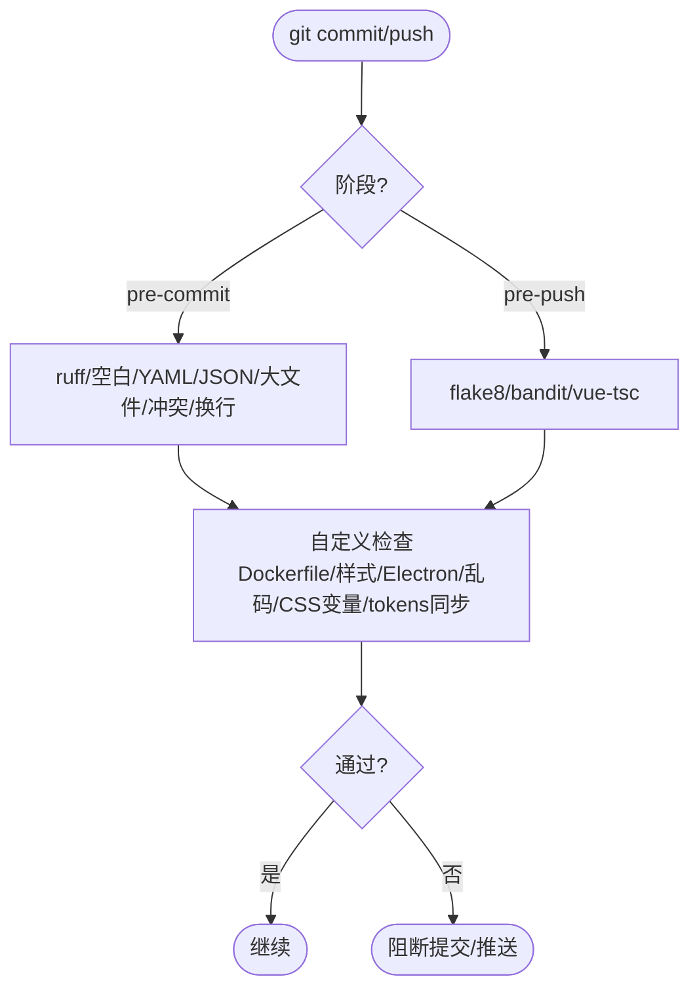
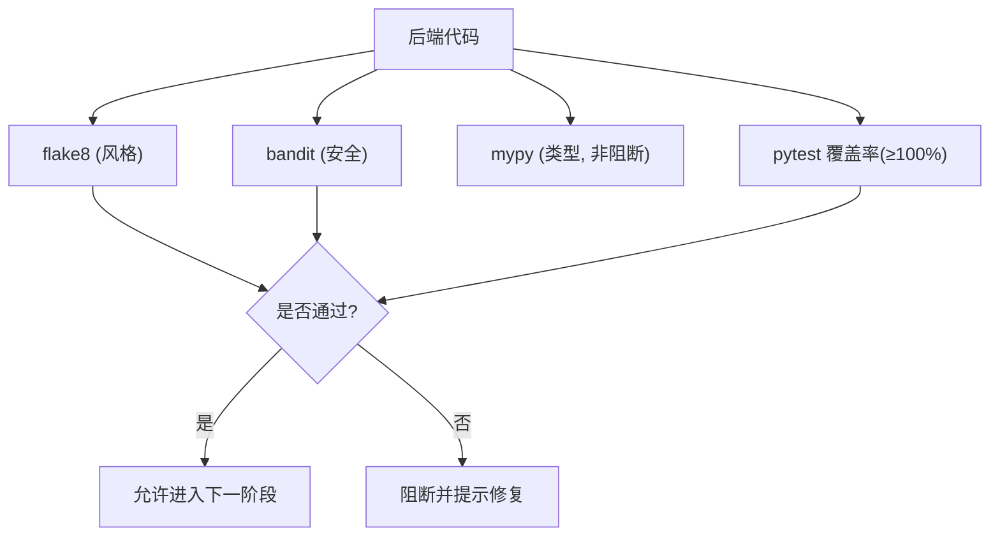
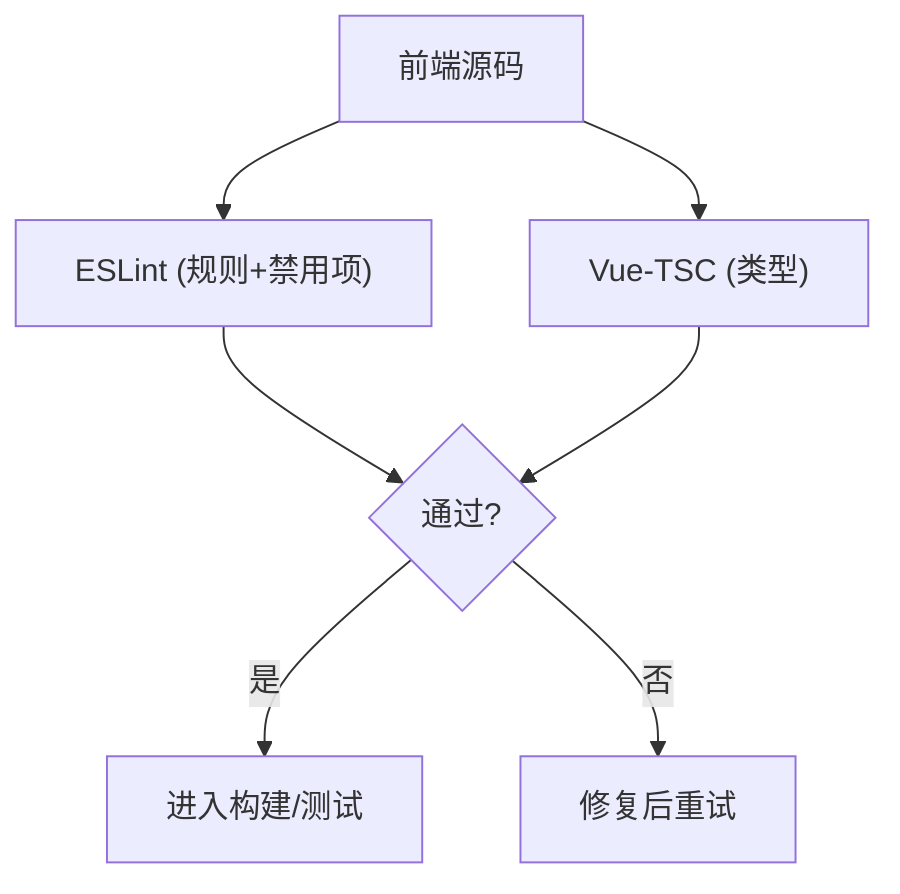
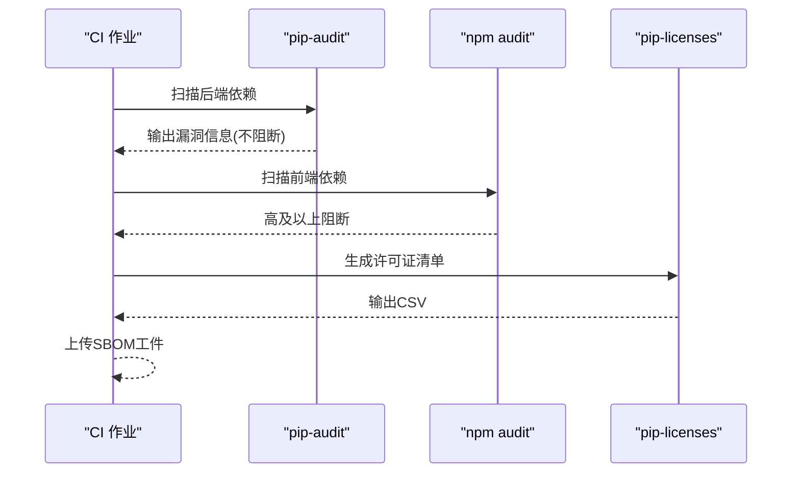
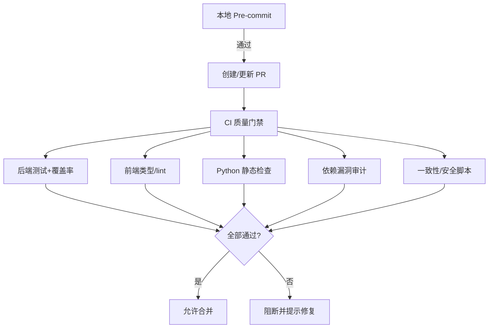
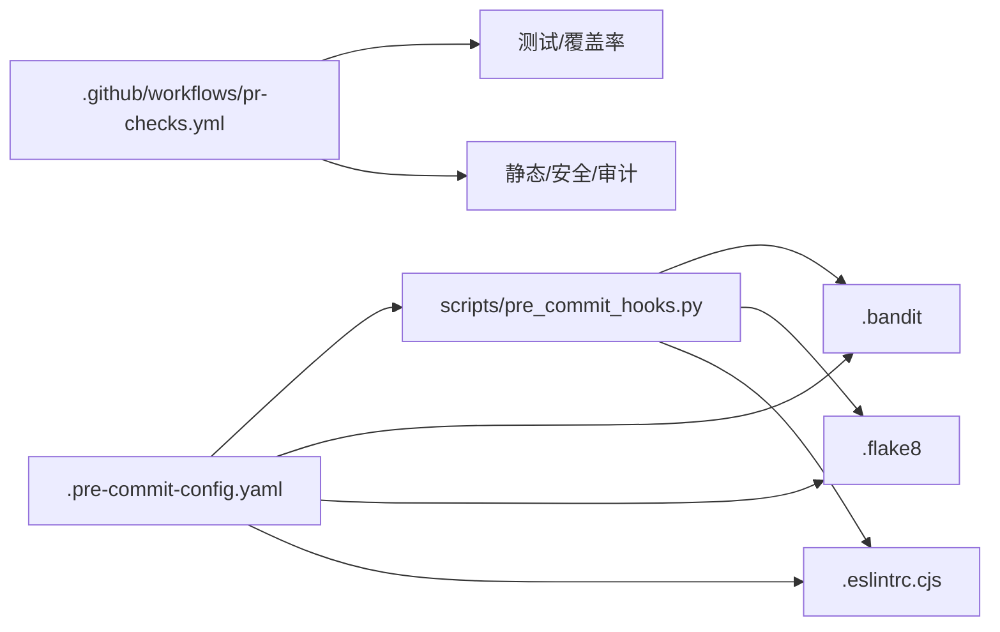

# 代码审查流程

<cite>
**本文引用的文件**
- [.pre-commit-config.yaml](file://.pre-commit-config.yaml)
- [scripts/pre_commit_hooks.py](file://scripts/pre_commit_hooks.py)
- [backend/.bandit](file://backend/.bandit)
- [frontend/.eslintrc.cjs](file://frontend/.eslintrc.cjs)
- [backend/.flake8](file://backend/.flake8)
- [backend/pyproject.toml](file://backend/pyproject.toml)
- [.github/workflows/pr-checks.yml](file://.github/workflows/pr-checks.yml)
- [frontend/package.json](file://frontend/package.json)
- [package.json](file://package.json)
</cite>

## 目录
1. [简介](#简介)
2. [项目结构](#项目结构)
3. [核心组件](#核心组件)
4. [架构总览](#架构总览)
5. [详细组件分析](#详细组件分析)
6. [依赖分析](#依赖分析)
7. [性能考虑](#性能考虑)
8. [故障排查指南](#故障排查指南)
9. [结论](#结论)
10. [附录](#附录)

## 简介
本指南面向本仓库的代码审查落地实践，覆盖静态分析、安全扫描、依赖漏洞审计、手动审查清单与自动化门禁（Git hooks + CI/CD）。目标是在提交前与合并前形成“快速反馈 + 严格门禁”的闭环，确保代码质量与安全基线稳定可控。

## 项目结构
本项目在本地与CI两端均配置了完整的代码审查工具链：
- 本地开发：通过 pre-commit 钩子在提交/推送阶段执行轻量检查（ruff、格式、Dockerfile 规范等），并在 push 阶段执行更严格的 flake8、bandit、vue-tsc。
- CI 流水线：PR 触发后端测试覆盖率门禁、前端类型检查与 lint、Python 静态检查（flake8/mypy/bandit）、依赖漏洞审计（pip-audit/npm audit）、SBOM 生成与上传、以及多项业务安全与一致性检查脚本。

**图表来源**
- [.pre-commit-config.yaml:1-116](file://.pre-commit-config.yaml#L1-L116)
- [.github/workflows/pr-checks.yml:17-133](file://.github/workflows/pr-checks.yml#L17-L133)

**章节来源**
- [.pre-commit-config.yaml:1-116](file://.pre-commit-config.yaml#L1-L116)
- [.github/workflows/pr-checks.yml:17-133](file://.github/workflows/pr-checks.yml#L17-L133)

## 核心组件
- 本地预提交钩子（Pre-commit）
  - 快速检查：ruff、尾随空白、YAML/JSON、大文件、合并冲突、行尾统一。
  - 推送门禁：flake8、bandit、vue-tsc。
  - 自定义检查：Dockerfile RUN 尾部规范、硬编码样式、Electron 语法、乱码检测、CSS 变量拼写、tokens 双源同步。
- 后端静态与安全
  - Flake8：最大行宽120，忽略 E203。
  - Bandit：限定规则集，排除 tests/alembic/venv，严重级别 LOW/MEDIUM/HIGH。
  - Mypy：非阻断类型检查。
  - 覆盖率：pytest 覆盖率报告，要求 100%（可配合 pragma 豁免不可执行行）。
- 前端静态与类型
  - ESLint：基于推荐规则与 Vue3/TS 配置；生产环境关闭 console/debugger；禁止 response.data.success 双重解包；对 v-html 使用场景进行精准豁免并记录消毒依据。
  - Vue-TSC：类型检查。
  - Vitest：单元测试与覆盖率。
- CI 门禁
  - 后端测试覆盖率 ≥ 98%（真实阻断）。
  - 前端类型检查与 lint 必须通过。
  - Python 静态检查（flake8 零错误；mypy 报告；bandit 低级别阻断）。
  - 依赖漏洞审计：pip-audit（不阻断，提示）、npm audit（high 及以上阻断）。
  - 生成并上传 SBOM（许可证清单）。
  - 静态与一致性检查：软删除过滤守卫、版本号一致性、前后端菜单对齐、后端综合安全审计脚本。

**章节来源**
- [.pre-commit-config.yaml:1-116](file://.pre-commit-config.yaml#L1-L116)
- [scripts/pre_commit_hooks.py:1-39](file://scripts/pre_commit_hooks.py#L1-L39)
- [backend/.flake8:1-5](file://backend/.flake8#L1-L5)
- [backend/.bandit:1-14](file://backend/.bandit#L1-L14)
- [backend/pyproject.toml:1-34](file://backend/pyproject.toml#L1-L34)
- [frontend/.eslintrc.cjs:1-66](file://frontend/.eslintrc.cjs#L1-L66)
- [frontend/package.json:1-73](file://frontend/package.json#L1-L73)
- [.github/workflows/pr-checks.yml:17-133](file://.github/workflows/pr-checks.yml#L17-L133)

## 架构总览
下图展示了从开发者提交到 CI 门禁的完整数据与控制流，涵盖本地与云端两端的工具链协作关系。

**图表来源**
- [.pre-commit-config.yaml:1-116](file://.pre-commit-config.yaml#L1-L116)
- [scripts/pre_commit_hooks.py:1-39](file://scripts/pre_commit_hooks.py#L1-L39)
- [.github/workflows/pr-checks.yml:17-133](file://.github/workflows/pr-checks.yml#L17-L133)

## 详细组件分析

### 本地 Pre-commit 钩子与自定义检查
- 职责
  - 提交阶段：快速修复与基础校验（ruff、空白、YAML/JSON、大文件、合并冲突、换行符）。
  - 推送阶段：严格检查（flake8、bandit、vue-tsc）。
  - 自定义：Dockerfile RUN 命令需以 | tail 结尾；禁止硬编码样式；Electron 主进程语法检查；扫描 NUL/非 UTF-8；CSS 变量四连字符误用；tokens.scss 与 tokens-vars.scss 同步校验。
- 关键实现要点
  - 通过 local hooks 调用 scripts/pre_commit_hooks.py 统一入口，封装跨平台执行。
  - 使用 stages 控制不同阶段的执行时机（pre-commit vs pre-push）。
  - files/exclude 精确匹配变更范围，提升速度。

**图表来源**
- [.pre-commit-config.yaml:10-116](file://.pre-commit-config.yaml#L10-L116)
- [scripts/pre_commit_hooks.py:12-34](file://scripts/pre_commit_hooks.py#L12-L34)

**章节来源**
- [.pre-commit-config.yaml:10-116](file://.pre-commit-config.yaml#L10-L116)
- [scripts/pre_commit_hooks.py:1-39](file://scripts/pre_commit_hooks.py#L1-L39)

### 后端静态分析与安全扫描
- Flake8
  - 行宽限制为 120，忽略 E203（切片空格误报）。
- Bandit
  - 明确启用规则集（B2xx/B3xx/B4xx/B5xx/B6xx/B7xx），排除 tests/alembic/venv。
  - 严重级别与置信度均为 LOW/MEDIUM/HIGH。
- Mypy
  - CI 中作为非阻断的类型检查，便于渐进式治理。
- 覆盖率
  - pytest 覆盖率报告输出 XML，要求 100%（可通过 pragma 豁免真正不可执行行）。

**图表来源**
- [backend/.flake8:1-5](file://backend/.flake8#L1-L5)
- [backend/.bandit:1-14](file://backend/.bandit#L1-L14)
- [backend/pyproject.toml:1-34](file://backend/pyproject.toml#L1-L34)
- [.github/workflows/pr-checks.yml:68-83](file://.github/workflows/pr-checks.yml#L68-L83)

**章节来源**
- [backend/.flake8:1-5](file://backend/.flake8#L1-L5)
- [backend/.bandit:1-14](file://backend/.bandit#L1-L14)
- [backend/pyproject.toml:1-34](file://backend/pyproject.toml#L1-L34)
- [.github/workflows/pr-checks.yml:68-83](file://.github/workflows/pr-checks.yml#L68-L83)

### 前端静态分析与类型检查
- ESLint
  - 继承 eslint:recommended、vue3-recommended、TypeScript 与 Prettier 配置。
  - 生产环境关闭 console/debugger；禁止未使用变量（忽略下划线前缀参数）；禁止 response.data.success 双重解包。
  - 针对 v-html 的使用点进行精准豁免，并要求模板内已做 DOMPurify/sanitizeHtml 消毒。
- Vue-TSC
  - 类型检查，CI 中强制通过。
- 脚本与任务
  - lint:check 为纯检查模式（不带 --fix），CI 必须暴露违规。
  - lint-staged 仅对暂存文件执行 eslint --fix，加速本地体验。

**图表来源**
- [frontend/.eslintrc.cjs:1-66](file://frontend/.eslintrc.cjs#L1-L66)
- [frontend/package.json:16-24](file://frontend/package.json#L16-L24)
- [.github/workflows/pr-checks.yml:46-66](file://.github/workflows/pr-checks.yml#L46-L66)

**章节来源**
- [frontend/.eslintrc.cjs:1-66](file://frontend/.eslintrc.cjs#L1-L66)
- [frontend/package.json:16-24](file://frontend/package.json#L16-L24)
- [.github/workflows/pr-checks.yml:46-66](file://.github/workflows/pr-checks.yml#L46-L66)

### 依赖漏洞扫描与 SBOM
- Python 依赖
  - pip-audit：扫描 requirements.txt 中的已知漏洞（当前为提示型，不阻断）。
- Node.js 依赖
  - npm audit：仅 high 及以上级别阻断。
- SBOM
  - pip-licenses 生成许可证清单 CSV，作为工件上传供合规审查。

**图表来源**
- [.github/workflows/pr-checks.yml:84-112](file://.github/workflows/pr-checks.yml#L84-L112)

**章节来源**
- [.github/workflows/pr-checks.yml:84-112](file://.github/workflows/pr-checks.yml#L84-L112)

### 手动代码审查检查清单
建议在 PR 评审时结合以下清单逐项核对：
- 安全漏洞检查
  - 输入校验与输出转义：所有用户输入是否经过白名单或强类型校验；模板渲染是否使用安全的转义/消毒（如 DOMPurify/sanitizeHtml）。
  - 认证与授权：敏感接口是否强制鉴权；是否存在越权访问路径；权限粒度是否满足最小权限原则。
  - 敏感信息：日志/错误响应是否泄露堆栈、密钥、令牌；环境变量与配置文件是否受控。
  - 依赖风险：是否引入已知高危漏洞依赖；是否及时升级。
- 性能问题识别
  - 数据库查询：是否存在 N+1 查询、缺少索引、全表扫描；复杂查询是否拆分或异步化。
  - 资源占用：内存泄漏、大对象传输、未释放连接/句柄；前端打包体积与首屏加载时间。
  - 并发与限流：热点接口是否具备限流/熔断/缓存策略。
- 代码规范验证
  - 风格与类型：flake8/vitest/eslint/vue-tsc 是否全部通过；命名与模块组织是否符合约定。
  - 可维护性：函数/类职责单一；注释与文档完善；异常处理完备。
  - 测试覆盖：新增逻辑是否补充单测/集成测；覆盖率是否达到门禁阈值。

[本节为通用指导，不直接引用具体文件]

### 自动化审查流程集成方案
- Git Hooks（本地）
  - 安装 pre-commit 并在提交/推送阶段自动执行上述检查，减少无效提交。
  - 建议配合 lint-staged，仅在暂存文件上执行快速修复，提升交互体验。
- CI/CD 安全门禁（云端）
  - PR 触发：后端测试覆盖率 ≥ 98%（真实阻断）；前端类型/lint 必须通过；Python 静态检查（flake8 零错误、mypy 报告、bandit 低级别阻断）。
  - 依赖审计：pip-audit 提示、npm audit high+ 阻断；生成并上传 SBOM。
  - 业务安全与一致性：软删除过滤守卫、版本号一致性、前后端菜单对齐、后端综合安全审计脚本。

**图表来源**
- [.pre-commit-config.yaml:1-116](file://.pre-commit-config.yaml#L1-L116)
- [.github/workflows/pr-checks.yml:17-133](file://.github/workflows/pr-checks.yml#L17-L133)

**章节来源**
- [.pre-commit-config.yaml:1-116](file://.pre-commit-config.yaml#L1-L116)
- [.github/workflows/pr-checks.yml:17-133](file://.github/workflows/pr-checks.yml#L17-L133)

## 依赖分析
- 组件耦合与职责
  - Pre-commit 作为统一入口，将多语言/多工具的校验收敛到一次提交/推送动作。
  - CI 作业按职责拆分为测试、前端检查、Python 静态检查、安全审计、静态与一致性检查，互不阻塞但共同构成门禁。
- 外部依赖与集成点
  - GitHub Actions：checkout/setup-python/setup-node、codecov action、artifact 上传。
  - 第三方工具：ruff、flake8、mypy、bandit、vue-tsc、eslint、vitest、pip-audit、npm audit、pip-licenses。
- 潜在循环依赖
  - 无直接循环依赖；各作业相互独立，通过 PR 状态聚合结果。

**图表来源**
- [.pre-commit-config.yaml:1-116](file://.pre-commit-config.yaml#L1-L116)
- [scripts/pre_commit_hooks.py:1-39](file://scripts/pre_commit_hooks.py#L1-L39)
- [backend/.bandit:1-14](file://backend/.bandit#L1-L14)
- [backend/.flake8:1-5](file://backend/.flake8#L1-L5)
- [frontend/.eslintrc.cjs:1-66](file://frontend/.eslintrc.cjs#L1-L66)
- [.github/workflows/pr-checks.yml:17-133](file://.github/workflows/pr-checks.yml#L17-L133)

**章节来源**
- [.pre-commit-config.yaml:1-116](file://.pre-commit-config.yaml#L1-L116)
- [scripts/pre_commit_hooks.py:1-39](file://scripts/pre_commit_hooks.py#L1-L39)
- [backend/.bandit:1-14](file://backend/.bandit#L1-L14)
- [backend/.flake8:1-5](file://backend/.flake8#L1-L5)
- [frontend/.eslintrc.cjs:1-66](file://frontend/.eslintrc.cjs#L1-L66)
- [.github/workflows/pr-checks.yml:17-133](file://.github/workflows/pr-checks.yml#L17-L133)

## 性能考虑
- 本地体验优化
  - 使用 lint-staged 仅对暂存文件执行 eslint --fix，减少等待时间。
  - Pre-commit 使用 ruff 替代部分 flake8 能力，提高扫描速度。
- CI 效率优化
  - 并行作业：后端测试、前端检查、Python 静态检查、安全审计、静态与一致性检查并行执行。
  - 缓存依赖：setup-python/setup-node 可结合缓存加速安装。
- 覆盖率与扫描成本
  - 覆盖率门禁设置为 98%（CI）与 100%（本地/报告），避免过度耗时；必要时对不可执行行使用 pragma 豁免。

[本节提供通用指导，不直接引用具体文件]

## 故障排查指南
- 常见失败原因与修复建议
  - 覆盖率不足（后端）：定位未覆盖分支，补充单测或使用 pragma 豁免不可执行行；确认 pytest 调度器与 rerun 兼容性。
  - ESLint 报错：优先遵循 no-restricted-syntax 禁止项（如 response.data.success 双重解包），并按生产/开发环境规则调整。
  - Bandit 告警：根据规则编号定位风险点，优先修复高危；必要时在 .bandit 中评估跳过理由并记录。
  - npm audit 阻断：升级存在高危漏洞的依赖或寻找替代包；必要时在 package.json 中使用 overrides 临时缓解。
  - 软删除过滤守卫失败：检查模型列表/聚合查询是否包含 is_active 过滤条件。
  - 版本号不一致：运行版本一致性检查脚本，修正漂移位置。
  - 菜单对齐失败：核对后端 MENU_DEFINITIONS 与前端路由 key/path。
- 诊断辅助
  - CI 失败时查看“Report failed tests”步骤输出的断言详情。
  - 使用 Codecov 查看覆盖率趋势与缺失行。
  - 利用 SBOM 工件进行许可证合规复核。

**章节来源**
- [.github/workflows/pr-checks.yml:24-39](file://.github/workflows/pr-checks.yml#L24-L39)
- [.github/workflows/pr-checks.yml:114-133](file://.github/workflows/pr-checks.yml#L114-L133)

## 结论
本项目已建立完善的本地与 CI 两级代码审查体系：本地通过 pre-commit 提供即时反馈，CI 通过多维度门禁保障质量与安全。建议持续演进：
- 逐步收紧 bandit 规则与 npm audit 阈值。
- 扩大静态与一致性检查覆盖面（如 SQL 注入、XSS、越权等专项）。
- 强化覆盖率与回归测试，保持 98%+ 的 CI 覆盖率门槛。
- 定期复盘 SBOM 与依赖升级计划，降低供应链风险。

[本节为总结性内容，不直接引用具体文件]

## 附录
- 常用命令参考
  - 本地：pip install pre-commit && pre-commit install；npx lint-staged；cd frontend && npm run lint:check；cd backend && python -m pytest ... --cov=app --cov-report=xml --cov-fail-under=98
  - CI：已在 .github/workflows/pr-checks.yml 中定义，无需额外配置。
- 相关配置路径
  - 本地钩子：.pre-commit-config.yaml
  - 钩子脚本：scripts/pre_commit_hooks.py
  - 后端规则：backend/.flake8、backend/.bandit、backend/pyproject.toml
  - 前端规则：frontend/.eslintrc.cjs、frontend/package.json
  - CI 流程：.github/workflows/pr-checks.yml
  - 根脚本：package.json（Electron 构建与后端打包）

**章节来源**
- [.pre-commit-config.yaml:1-116](file://.pre-commit-config.yaml#L1-L116)
- [scripts/pre_commit_hooks.py:1-39](file://scripts/pre_commit_hooks.py#L1-L39)
- [backend/.flake8:1-5](file://backend/.flake8#L1-L5)
- [backend/.bandit:1-14](file://backend/.bandit#L1-L14)
- [backend/pyproject.toml:1-34](file://backend/pyproject.toml#L1-L34)
- [frontend/.eslintrc.cjs:1-66](file://frontend/.eslintrc.cjs#L1-L66)
- [frontend/package.json:1-73](file://frontend/package.json#L1-L73)
- [.github/workflows/pr-checks.yml:17-133](file://.github/workflows/pr-checks.yml#L17-L133)
- [package.json:12-23](file://package.json#L12-L23)