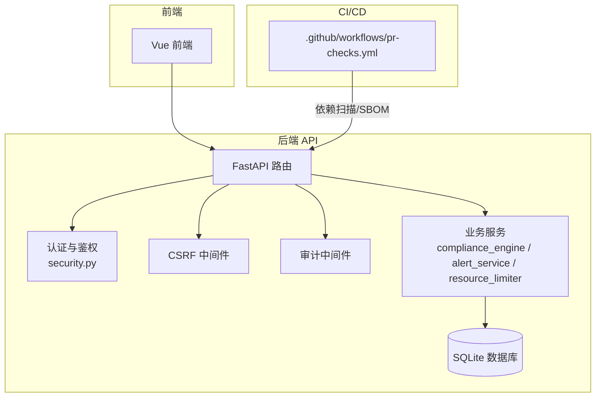
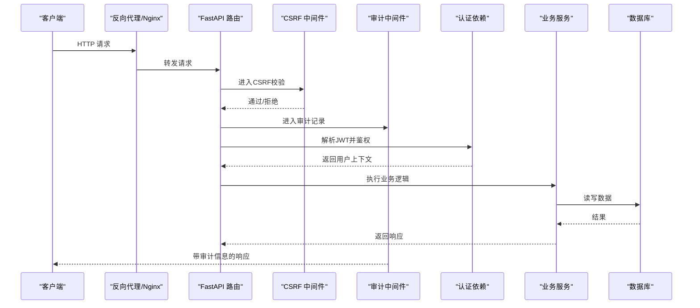
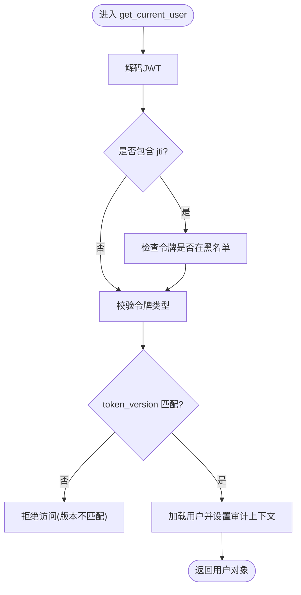
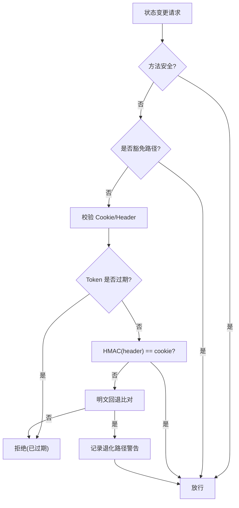
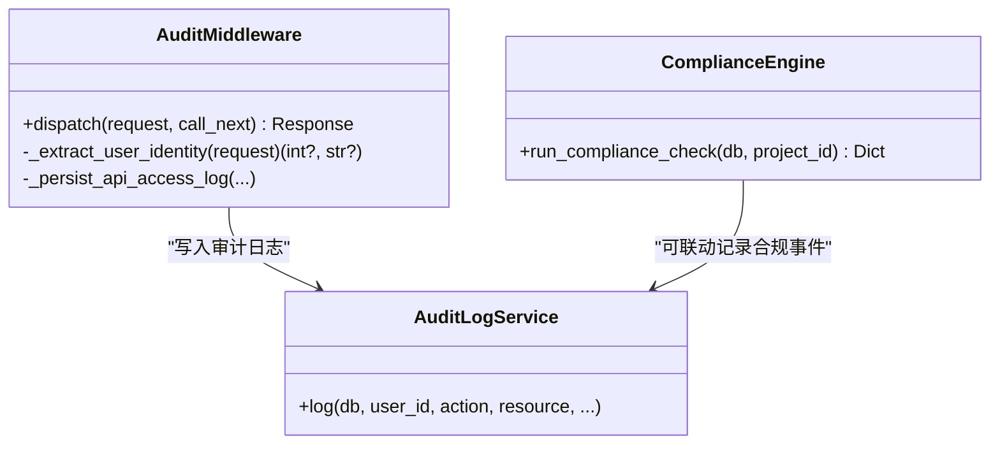
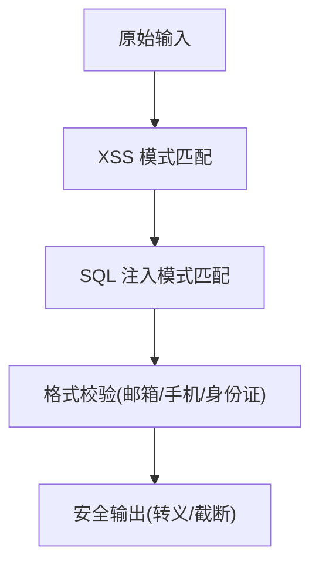
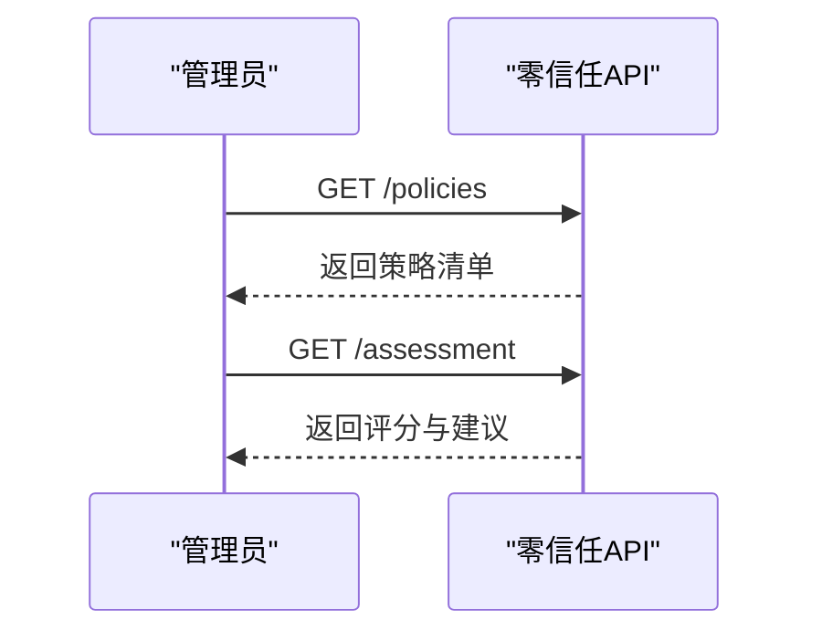
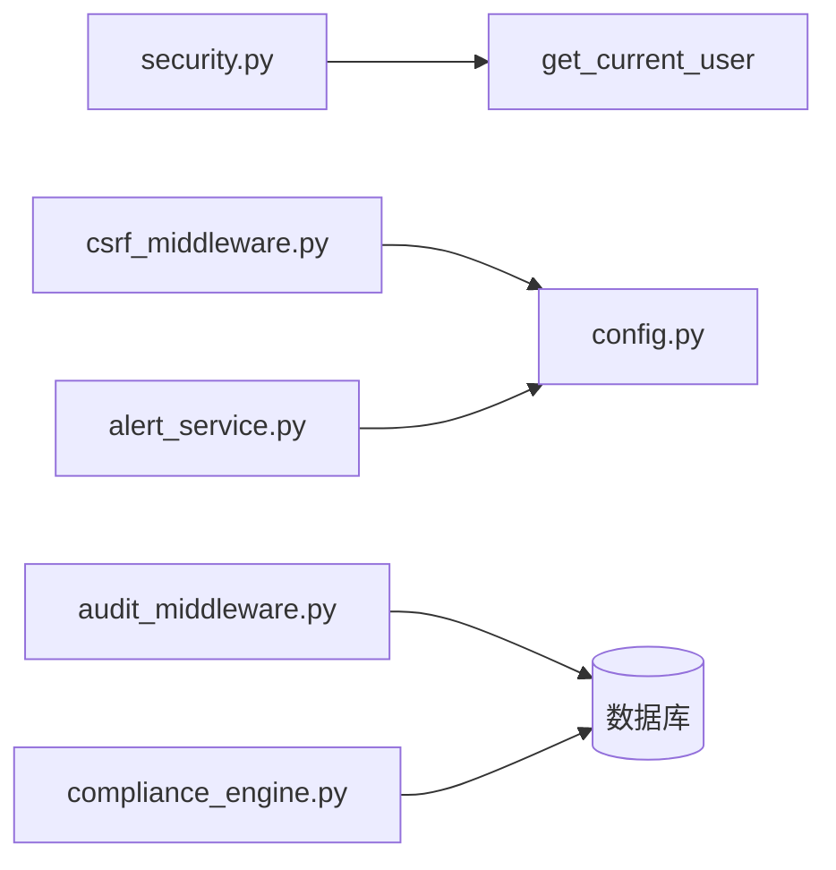

# 安全开发生命周期

<cite>
**本文引用的文件**
- [backend/app/core/security.py](file://backend/app/core/security.py)
- [backend/app/core/config.py](file://backend/app/core/config.py)
- [backend/app/middleware/csrf_middleware.py](file://backend/app/middleware/csrf_middleware.py)
- [backend/app/core/audit_middleware.py](file://backend/app/core/audit_middleware.py)
- [backend/app/services/compliance_engine.py](file://backend/app/services/compliance_engine.py)
- [backend/app/utils/input_validator.py](file://backend/app/utils/input_validator.py)
- [backend/app/services/resource_limiter.py](file://backend/app/services/resource_limiter.py)
- [backend/app/api/v1/system/audit.py](file://backend/app/api/v1/system/audit.py)
- [backend/app/models/audit.py](file://backend/app/models/audit.py)
- [backend/app/api/v1/system/zero_trust.py](file://backend/app/api/v1/system/zero_trust.py)
- [backend/app/services/alert_service.py](file://backend/app/services/alert_service.py)
- [.github/workflows/pr-checks.yml](file://.github/workflows/pr-checks.yml)
- [backend/scripts/deep_scan.py](file://backend/scripts/deep_scan.py)
- [backend/tests/unit/test_system_audit_api.py](file://backend/tests/unit/test_system_audit_api.py)
</cite>

## 目录
1. [引言](#引言)
2. [项目结构](#项目结构)
3. [核心组件](#核心组件)
4. [架构总览](#架构总览)
5. [详细组件分析](#详细组件分析)
6. [依赖关系分析](#依赖关系分析)
7. [性能与安全特性](#性能与安全特性)
8. [故障排查指南](#故障排查指南)
9. [结论](#结论)
10. [附录](#附录)

## 引言
本文件面向安全开发生命周期（SDLC）的实施框架，覆盖需求、设计、开发、测试、部署与持续改进各阶段。结合仓库中的认证鉴权、输入校验、CSRF保护、审计日志、合规校验、零信任策略评估、告警与CI依赖扫描等实现，提供可落地的流程、控制点与度量指标，帮助团队在单机/离线场景下仍保持高安全基线。

## 项目结构
本项目采用前后端分离的单体应用：后端基于FastAPI，内置认证、中间件、服务层与模型；前端为Vue工程；CI流水线集成依赖漏洞扫描与SBOM生成；运维侧提供Nginx配置与打包脚本。安全相关能力主要分布在后端core、middleware、services与scripts中，并通过API暴露给前端或外部系统。

**图示来源**
- [backend/app/core/security.py:243-336](file://backend/app/core/security.py#L243-L336)
- [backend/app/middleware/csrf_middleware.py:177-284](file://backend/app/middleware/csrf_middleware.py#L177-L284)
- [backend/app/core/audit_middleware.py:11-109](file://backend/app/core/audit_middleware.py#L11-L109)
- [backend/app/services/compliance_engine.py:23-109](file://backend/app/services/compliance_engine.py#L23-L109)
- [backend/app/services/alert_service.py:20-111](file://backend/app/services/alert_service.py#L20-L111)
- [.github/workflows/pr-checks.yml:84-112](file://.github/workflows/pr-checks.yml#L84-L112)

**章节来源**
- [backend/app/core/security.py:243-336](file://backend/app/core/security.py#L243-L336)
- [backend/app/middleware/csrf_middleware.py:177-284](file://backend/app/middleware/csrf_middleware.py#L177-L284)
- [backend/app/core/audit_middleware.py:11-109](file://backend/app/core/audit_middleware.py#L11-L109)
- [backend/app/services/compliance_engine.py:23-109](file://backend/app/services/compliance_engine.py#L23-L109)
- [backend/app/services/alert_service.py:20-111](file://backend/app/services/alert_service.py#L20-L111)
- [.github/workflows/pr-checks.yml:84-112](file://.github/workflows/pr-checks.yml#L84-L112)

## 核心组件
- 认证与鉴权：JWT签发/校验、黑名单校验、角色权限、密码策略、速率限制、客户端IP识别。
- 输入与输出安全：XSS/SQL注入检测、敏感字段脱敏、安全响应头注入。
- CSRF保护：HMAC签名增强、过期窗口、豁免路径、可信代理IP透传。
- 审计与合规：请求访问日志、操作审计、合规性检查（经费偏差阈值）。
- 零信任策略：策略列表与详情查询、风险评估打分。
- 告警与监控：邮件/Webhook告警、健康检查与指标端口。
- 依赖与供应链安全：CI中pip-audit、npm audit、SBOM生成。

**章节来源**
- [backend/app/core/security.py:120-173](file://backend/app/core/security.py#L120-L173)
- [backend/app/core/security.py:210-235](file://backend/app/core/security.py#L210-L235)
- [backend/app/core/security.py:379-411](file://backend/app/core/security.py#L379-L411)
- [backend/app/core/security.py:598-636](file://backend/app/core/security.py#L598-L636)
- [backend/app/middleware/csrf_middleware.py:65-124](file://backend/app/middleware/csrf_middleware.py#L65-L124)
- [backend/app/services/compliance_engine.py:18-21](file://backend/app/services/compliance_engine.py#L18-L21)
- [backend/app/services/alert_service.py:20-111](file://backend/app/services/alert_service.py#L20-L111)
- [.github/workflows/pr-checks.yml:84-112](file://.github/workflows/pr-checks.yml#L84-L112)

## 架构总览
下图展示一次受保护的API请求从进入网关到落库审计的完整链路，体现认证、CSRF、审计、业务处理与告警的协作关系。

**图示来源**
- [backend/app/middleware/csrf_middleware.py:177-284](file://backend/app/middleware/csrf_middleware.py#L177-L284)
- [backend/app/core/audit_middleware.py:11-109](file://backend/app/core/audit_middleware.py#L11-L109)
- [backend/app/core/security.py:243-336](file://backend/app/core/security.py#L243-L336)

## 详细组件分析

### 认证与鉴权（JWT、令牌吊销、密码策略、速率限制）
- JWT签发/解码：使用HS256算法，支持access与refresh类型，强制过期时间。
- 令牌吊销：通过jti加入黑名单后拒绝访问；token_version与用户版本比对，支持强制下线。
- 密码策略：最小长度、复杂度、弱口令前缀、用户名包含检查。
- 速率限制：内存滑动窗口限流，默认60次/分钟，具备过期清理与线程安全。
- 客户端IP：默认不信任代理头，仅在可信代理模式下读取X-Forwarded-For/X-Real-IP。

**图示来源**
- [backend/app/core/security.py:243-336](file://backend/app/core/security.py#L243-L336)

**章节来源**
- [backend/app/core/security.py:210-235](file://backend/app/core/security.py#L210-L235)
- [backend/app/core/security.py:243-336](file://backend/app/core/security.py#L243-L336)
- [backend/app/core/security.py:524-569](file://backend/app/core/security.py#L524-L569)
- [backend/app/core/security.py:439-488](file://backend/app/core/security.py#L439-L488)
- [backend/app/core/security.py:491-516](file://backend/app/core/security.py#L491-L516)

### CSRF 保护（HMAC 签名、过期窗口、豁免路径）
- 双提交+HMAC：Cookie保存HMAC(raw_token)，Header携带raw_token，服务端常量时间比较。
- 过期检测：token内嵌时间戳，超过24小时拒绝。
- 豁免路径：登录、注册、健康检查、文档等路径跳过验证。
- 可信代理：仅当直连IP在可信列表中时，才透传X-Forwarded-For首段。

**图示来源**
- [backend/app/middleware/csrf_middleware.py:65-124](file://backend/app/middleware/csrf_middleware.py#L65-L124)
- [backend/app/middleware/csrf_middleware.py:177-284](file://backend/app/middleware/csrf_middleware.py#L177-L284)

**章节来源**
- [backend/app/middleware/csrf_middleware.py:177-284](file://backend/app/middleware/csrf_middleware.py#L177-L284)

### 审计与合规（访问日志、操作审计、合规检查）
- 访问日志：每次HTTP请求记录方法、路径、状态码、耗时、用户、IP、UA，落库独立事务，失败不影响主流程。
- 操作审计：将当前用户ID写入上下文，写操作时可追责到人。
- 合规引擎：对经费偏差率进行预警与否决判定（10%/15%阈值），输出汇总与违规项。

**图示来源**
- [backend/app/core/audit_middleware.py:11-109](file://backend/app/core/audit_middleware.py#L11-L109)
- [backend/app/services/compliance_engine.py:23-109](file://backend/app/services/compliance_engine.py#L23-L109)
- [backend/app/core/security.py:644-687](file://backend/app/core/security.py#L644-L687)

**章节来源**
- [backend/app/core/audit_middleware.py:11-109](file://backend/app/core/audit_middleware.py#L11-L109)
- [backend/app/services/compliance_engine.py:23-109](file://backend/app/services/compliance_engine.py#L23-L109)
- [backend/app/core/security.py:644-687](file://backend/app/core/security.py#L644-L687)

### 输入与输出安全（XSS/SQL注入防护、安全响应头）
- 输入校验：XSS模式匹配、SQL注入模式匹配、邮箱/手机/身份证格式校验、必填字段校验。
- 安全响应头：X-Content-Type-Options、X-Frame-Options、Referrer-Policy等，静态资源与参考数据缓存策略差异化。
- 敏感信息脱敏：日志中隐藏密码、令牌、卡号、手机号等。

**图示来源**
- [backend/app/utils/input_validator.py:12-124](file://backend/app/utils/input_validator.py#L12-L124)
- [backend/app/core/security.py:598-636](file://backend/app/core/security.py#L598-L636)
- [backend/app/core/security.py:180-202](file://backend/app/core/security.py#L180-L202)

**章节来源**
- [backend/app/utils/input_validator.py:12-124](file://backend/app/utils/input_validator.py#L12-L124)
- [backend/app/core/security.py:598-636](file://backend/app/core/security.py#L598-L636)
- [backend/app/core/security.py:180-202](file://backend/app/core/security.py#L180-L202)

### 零信任策略与风险评估
- 策略管理：提供策略列表与详情接口，支持按类别筛选与启用过滤。
- 风险评估：根据请求协议、来源等因子计算安全评分与建议。

**图示来源**
- [backend/app/api/v1/system/zero_trust.py:338-384](file://backend/app/api/v1/system/zero_trust.py#L338-L384)
- [backend/app/api/v1/system/zero_trust.py:144-168](file://backend/app/api/v1/system/zero_trust.py#L144-L168)

**章节来源**
- [backend/app/api/v1/system/zero_trust.py:338-384](file://backend/app/api/v1/system/zero_trust.py#L338-L384)
- [backend/app/api/v1/system/zero_trust.py:144-168](file://backend/app/api/v1/system/zero_trust.py#L144-L168)

### 告警与监控（邮件/Webhook、健康检查）
- 告警服务：支持SMTP邮件与Webhook（通用/钉钉/企业微信）两种渠道，失败记录错误日志。
- 监控与健康：提供指标端口与健康检查开关，便于部署侧集成。

**章节来源**
- [backend/app/services/alert_service.py:20-111](file://backend/app/services/alert_service.py#L20-L111)
- [backend/app/core/config.py:185-188](file://backend/app/core/config.py#L185-L188)

### 依赖与供应链安全（CI 扫描与SBOM）
- 后端依赖：pip-audit扫描requirements.txt，提示漏洞但不阻断合并。
- 前端依赖：npm audit以high级别阻断。
- SBOM：生成许可证清单供白名单审查。

**章节来源**
- [.github/workflows/pr-checks.yml:84-112](file://.github/workflows/pr-checks.yml#L84-L112)

## 依赖关系分析
- 模块耦合：认证模块被路由与中间件广泛依赖；CSRF与审计中间件位于请求入口链；合规引擎与告警服务作为业务支撑。
- 外部依赖：PyJWT、passlib/bcrypt、httpx、smtplib等。
- 潜在风险：若SECRET_KEY未正确配置，将回退到进程内随机密钥导致会话失效；CSRF降级路径需关注前端升级进度。

**图示来源**
- [backend/app/core/security.py:243-336](file://backend/app/core/security.py#L243-L336)
- [backend/app/middleware/csrf_middleware.py:177-284](file://backend/app/middleware/csrf_middleware.py#L177-L284)
- [backend/app/core/audit_middleware.py:11-109](file://backend/app/core/audit_middleware.py#L11-L109)
- [backend/app/services/compliance_engine.py:23-109](file://backend/app/services/compliance_engine.py#L23-L109)
- [backend/app/services/alert_service.py:20-111](file://backend/app/services/alert_service.py#L20-L111)

**章节来源**
- [backend/app/core/security.py:243-336](file://backend/app/core/security.py#L243-L336)
- [backend/app/middleware/csrf_middleware.py:177-284](file://backend/app/middleware/csrf_middleware.py#L177-L284)
- [backend/app/core/audit_middleware.py:11-109](file://backend/app/core/audit_middleware.py#L11-L109)
- [backend/app/services/compliance_engine.py:23-109](file://backend/app/services/compliance_engine.py#L23-L109)
- [backend/app/services/alert_service.py:20-111](file://backend/app/services/alert_service.py#L20-L111)

## 性能与安全特性
- 性能：审计落库使用独立短事务，失败不阻塞主流程；CSRF与认证均为轻量计算；速率限制内存存储定期清理避免泄漏。
- 安全：生产环境强制关闭DB_ECHO防止敏感SQL入日志；字段加密密钥自动生成与持久化；CSRF默认开启且HMAC签名优先。

**章节来源**
- [backend/app/core/audit_middleware.py:80-109](file://backend/app/core/audit_middleware.py#L80-L109)
- [backend/app/core/config.py:301-329](file://backend/app/core/config.py#L301-L329)
- [backend/app/middleware/csrf_middleware.py:177-284](file://backend/app/middleware/csrf_middleware.py#L177-L284)

## 故障排查指南
- 认证失败：检查JWT是否有效、是否被拉黑、token_version是否匹配；确认SECRET_KEY与ALGORITHM配置一致。
- CSRF失败：确认前端先获取token并在X-CSRF-Token携带；检查Cookie是否存在且未过期；核对豁免路径是否正确。
- 审计缺失：检查api_access_logs落库是否成功；确认中间件顺序与数据库连接可用。
- 合规异常：核查预算与实际支出数据一致性；确认阈值配置是否符合预期。
- 告警未送达：检查SMTP/Webhook配置；查看错误日志定位网络或认证问题。

**章节来源**
- [backend/app/core/security.py:243-336](file://backend/app/core/security.py#L243-L336)
- [backend/app/middleware/csrf_middleware.py:177-284](file://backend/app/middleware/csrf_middleware.py#L177-L284)
- [backend/app/core/audit_middleware.py:11-109](file://backend/app/core/audit_middleware.py#L11-L109)
- [backend/app/services/compliance_engine.py:23-109](file://backend/app/services/compliance_engine.py#L23-L109)
- [backend/app/services/alert_service.py:20-111](file://backend/app/services/alert_service.py#L20-L111)

## 结论
本SDLC实施框架将安全控制嵌入到每个阶段：需求阶段明确威胁建模与合规要求；设计阶段落实安全架构评审与控制设计；开发阶段执行安全编码规范与代码审查；测试阶段开展安全测试与渗透；部署阶段强化配置管理与监控告警；运行期通过持续监控与改进闭环提升整体安全水位。仓库中的认证、CSRF、审计、合规、零信任与CI扫描等能力为落地提供了坚实基础。

## 附录

### 分阶段实施要点（对照仓库实现）
- 需求阶段
  - 威胁建模：识别认证绕过、CSRF、注入、越权等威胁，映射至安全控制点。
  - 安全需求：定义令牌有效期、密码策略、CSRF默认开启、审计留存等基线。
  - 合规要求：经费偏差阈值、数据脱敏、日志保留策略。
- 设计阶段
  - 安全架构评审：认证统一出口、中间件前置校验、审计不可中断。
  - 风险评估：零信任策略评估与评分机制。
  - 控制设计：HMAC CSRF、速率限制、安全响应头、敏感字段脱敏。
- 开发阶段
  - 安全编码：输入校验、参数绑定、禁止硬编码密钥。
  - 代码审查：依赖漏洞扫描、静态扫描、SBOM审查。
  - 依赖管理：pip-audit与npm audit纳入PR检查。
- 测试阶段
  - 安全测试计划：认证鉴权、CSRF、注入、越权用例。
  - 漏洞扫描：CI中自动化扫描与报告。
  - 渗透测试：针对关键流程进行红蓝对抗演练。
- 部署阶段（secOps）
  - 安全配置：环境变量与加密密钥管理、CSRF与CORS严格策略。
  - 监控告警：邮件/Webhook告警、健康检查与指标采集。
  - 应急响应：令牌吊销、账户锁定、快速回滚与补丁发布。
- 持续改进
  - 持续监控：访问日志、安全事件、合规检查结果。
  - 改进机制：缺陷修复、策略调优、依赖更新与复测。

**章节来源**
- [backend/app/api/v1/system/audit.py:395-475](file://backend/app/api/v1/system/audit.py#L395-L475)
- [backend/app/models/audit.py:65-101](file://backend/app/models/audit.py#L65-L101)
- [backend/tests/unit/test_system_audit_api.py:406-467](file://backend/tests/unit/test_system_audit_api.py#L406-L467)
- [backend/scripts/deep_scan.py:102-130](file://backend/scripts/deep_scan.py#L102-L130)
- [.github/workflows/pr-checks.yml:84-112](file://.github/workflows/pr-checks.yml#L84-L112)